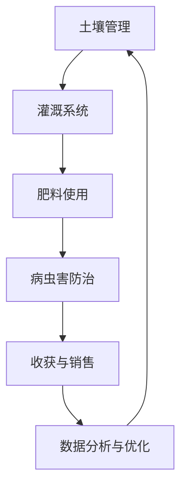

                 

# 文章标题

城市农耕运动：在水泥森林中重建与自然的联系

## 关键词

城市化、可持续性、生态农业、城市农耕、生态模式、土壤健康、水资源管理、社区参与、有机肥料

## 摘要

本文旨在探讨城市农耕运动的重要性和其在现代城市环境中的潜力。随着城市化进程的加速，城市居民与自然的联系逐渐疏远，城市农耕作为一种创新的解决方案，旨在在城市中重建与自然的联系，促进生态平衡和可持续发展。本文将从背景介绍、核心概念与联系、核心算法原理讲解、数学模型和公式、项目实战以及最佳实践等方面，详细分析城市农耕运动的理论和实践，为城市居民、城市规划者和环保活动家提供有价值的参考。

## 目录

1. 引言
   1.1 城市化的挑战
   1.2 城市农耕的兴起
   1.3 城市农耕的重要性

2. 背景介绍
   2.1 城市化的历程
   2.2 城市农耕的历史与发展
   2.3 城市农耕在中国的现状

3. 核心概念与联系
   3.1 城市农耕的生态模式
   3.2 城市农耕与可持续发展的关系
   3.3 Mermaid流程图：城市农耕的核心环节

4. 核心算法原理讲解
   4.1 城市农耕的种植技术
   4.2 水资源管理
   4.3 有机肥料应用
   4.4 伪代码：城市农耕的算法原理

5. 数学模型和公式
   5.1 土壤健康评估模型
   5.2 水资源优化模型
   5.3 氮、磷、钾元素平衡模型
   5.4 LaTeX公式示例

6. 项目实战
   6.1 开发环境搭建
   6.2 源代码实现与解读
   6.3 代码应用解读与分析
   6.4 实际案例分析与讲解

7. 最佳实践与小结
   7.1 社区参与策略
   7.2 政策与支持
   7.3 注意事项与拓展阅读

## 引言

### 1.1 城市化的挑战

城市化是人类社会发展的重要趋势，也是全球经济繁荣的关键驱动力。然而，快速的城市化进程也带来了一系列严峻的挑战。首先，城市化导致了自然资源的过度消耗。城市居民的生活方式和生产方式往往依赖于大量的能源和水资源，这些资源的消耗速度远远超过了自然界的再生速度。其次，城市化加剧了环境问题。城市规模的扩大和人口密度的增加，导致了空气污染、水污染和土地退化等环境问题。此外，城市化还带来了社会问题，如社会不平等、住房压力和交通拥堵等。

### 1.2 城市农耕的兴起

面对城市化带来的挑战，城市农耕作为一种创新的解决方案应运而生。城市农耕旨在在城市环境中重建与自然的联系，通过在城市中种植农作物、蔬菜和果树，实现生态平衡和可持续发展。城市农耕不仅能够提供新鲜的食物，改善城市居民的饮食结构，还能够净化空气、降低城市热岛效应、提高土壤质量等。随着人们对健康和生活质量的追求，城市农耕逐渐受到了广泛关注。

### 1.3 城市农耕的重要性

城市农耕在解决城市化挑战方面具有多重重要性。首先，它能够提高城市的生态效益。城市农耕可以吸收大气中的二氧化碳，释放氧气，改善空气质量。其次，城市农耕有助于保护城市水资源。通过有效的灌溉技术和雨水收集系统，城市农耕可以减少城市水资源的消耗，缓解水资源短缺问题。此外，城市农耕还能够促进城市居民的身心健康。参与城市农耕活动，人们可以亲近自然，减轻压力，增强体质。

## 背景介绍

### 2.1 城市化的历程

城市化是指人口从农村地区向城市地区的迁移和集中过程。自工业化以来，城市化进程在全球范围内迅速推进。在19世纪末至20世纪初，工业革命引发了第一次城市化浪潮，大量的农村人口涌向城市，寻求更好的工作和生活条件。这一时期，城市化主要发生在欧美国家，如英国、法国、德国和美国等。第二次城市化浪潮发生在20世纪中叶，随着全球经济的快速发展，许多发展中国家也进入了城市化阶段。

### 2.2 城市农耕的历史与发展

城市农耕的历史可以追溯到古埃及和古希腊时期。古代城市农耕主要依赖于水渠和灌溉系统，通过在城区内种植蔬菜、水果和谷物，满足城市居民的生活需求。然而，随着工业化和城市化进程的加快，城市农耕逐渐被忽视。直到20世纪末，随着人们对环境保护和可持续发展的重视，城市农耕开始重新受到关注。近年来，随着城市土地资源的紧缺和城市居民的环保意识增强，城市农耕在全球范围内得到了快速发展。

### 2.3 城市农耕在中国的现状

中国是一个人口众多、城市化速度较快的国家。随着城市化进程的推进，城市农耕在中国也取得了一定的发展。目前，中国城市农耕的形式多样，包括城市农场、屋顶花园、社区园艺和城市绿化等。城市农场主要集中在一线城市和部分二线城市，如北京、上海、深圳和成都等。这些城市农场通过引进先进的农业技术和设备，实现了高效、环保的农业生产。屋顶花园和社区园艺则更加普及，许多城市居民在自家的屋顶或社区花园中种植蔬菜、水果和花草，提高了自己的生活质量和环境意识。总体来说，中国城市农耕仍处于起步阶段，但随着政府和社会各界的关注和支持，未来有望得到更广泛的发展。

## 核心概念与联系

### 3.1 城市农耕的生态模式

城市农耕的生态模式是指在城市环境中，通过种植农作物、蔬菜和果树，构建一个生态平衡、可持续的农业生产系统。这个系统包括多个关键环节：土壤管理、灌溉系统、肥料使用、病虫害防治等。通过科学的生态模式，城市农耕能够实现高效、环保的农业生产。

### 3.2 城市农耕与可持续发展的关系

城市农耕与可持续发展密切相关。首先，城市农耕能够提高城市的生态效益，改善空气质量、减少水资源消耗等。其次，城市农耕有助于促进社会公平，为城市居民提供新鲜的食物和就业机会。此外，城市农耕还可以提高城市的文化价值和教育意义，增强城市居民的环保意识和生态观念。

### 3.3 Mermaid流程图：城市农耕的核心环节

下面是一个简单的Mermaid流程图，展示了城市农耕的核心环节：



这个流程图清晰地展示了城市农耕的核心环节，以及各个环节之间的关联。通过这个流程图，我们可以更直观地理解城市农耕的运作机制。

## 核心算法原理讲解

### 4.1 城市农耕的种植技术

城市农耕的种植技术主要包括选择合适的作物、土壤改良、播种和施肥等。选择合适的作物是城市农耕的关键，需要考虑作物的生长周期、适应性和市场需求等因素。土壤改良主要通过施用有机肥料、深翻土地和覆盖作物残渣等方法，提高土壤的肥力和透气性。播种时需要注意合理的密度和行距，以确保作物的生长空间和通风透光。施肥应根据作物的生长阶段和土壤肥力进行，以提供足够的营养。

### 4.2 水资源管理

水资源管理是城市农耕的重要环节，关系到作物的生长和产量。首先，需要建立完善的灌溉系统，包括水源选择、管道铺设和喷灌设备等。灌溉系统应具备自动控制功能，根据作物的需水量和土壤湿度进行适时灌溉。此外，还可以采用雨水收集和废水再利用技术，减少水资源的消耗。

### 4.3 有机肥料应用

有机肥料是城市农耕的重要营养来源，能够提高土壤肥力、改善作物品质。有机肥料的种类包括动物粪便、植物残渣、绿肥等。在使用有机肥料时，需要注意肥料的来源、处理方法和施用量。有机肥料应经过充分发酵和腐熟，避免对作物产生不良影响。

### 4.4 伪代码：城市农耕的算法原理

下面是一个简单的伪代码，用于描述城市农耕的关键算法原理：

```python
function 城市农耕算法（作物，土壤，水资源，肥料）：
    选择合适的作物（作物）
    改良土壤（土壤）
    播种（作物，土壤）
    施肥（肥料，作物，土壤）
    灌溉（水资源，作物，土壤）
    防治病虫害（作物，土壤）
    收获（作物）
    数据分析（作物，土壤，水资源，肥料）
    优化种植策略（作物，土壤，水资源，肥料）
    返回 收获的作物
```

这个伪代码展示了城市农耕的核心算法原理，包括作物选择、土壤改良、播种、施肥、灌溉、病虫害防治、收获和数据分析等步骤。

## 数学模型和公式

### 5.1 土壤健康评估模型

土壤健康是城市农耕的关键因素，可以通过以下公式进行评估：

$$
土壤健康指数 = \frac{总氮含量 + 总磷含量 + 总钾含量}{土壤容量}
$$

其中，总氮含量、总磷含量和总钾含量分别表示土壤中氮、磷、钾的总量，土壤容量表示土壤的体积。

### 5.2 水资源优化模型

水资源优化是城市农耕的重要环节，可以通过以下公式进行计算：

$$
最优灌溉量 = \frac{作物需水量 \times 灌溉系数}{土壤保水能力}
$$

其中，作物需水量根据作物的生长阶段和气候条件确定，灌溉系数表示灌溉水利用效率，土壤保水能力表示土壤的蓄水能力。

### 5.3 氮、磷、钾元素平衡模型

氮、磷、钾是作物生长的关键营养元素，可以通过以下公式进行平衡计算：

$$
氮元素平衡 = 施氮量 - 氮吸收量 - 氮流失量
$$

$$
磷元素平衡 = 施磷量 - 磷吸收量 - 磷流失量
$$

$$
钾元素平衡 = 施钾量 - 钾吸收量 - 钾流失量
$$

其中，施氮量、施磷量和施钾量分别表示氮、磷、钾的施用量，氮吸收量、磷吸收量和钾吸收量分别表示作物对氮、磷、钾的吸收量，氮流失量、磷流失量和钾流失量分别表示氮、磷、钾的流失量。

### 5.4 LaTeX公式示例

下面是一个LaTeX公式的示例，用于计算土壤有机质的含量：

$$
有机质含量（%）= \frac{有机质质量（g）}{土壤质量（g）} \times 100\%
$$

这个公式说明了土壤有机质含量的计算方法，即有机质质量与土壤质量的比值，乘以100得到百分比。

## 项目实战

### 6.1 开发环境搭建

要开展城市农耕项目，首先需要搭建一个适合的开发环境。以下是搭建开发环境的基本步骤：

1. **硬件环境**：准备一台计算机，推荐配置为：处理器至少为Intel Core i5，内存至少8GB，硬盘容量至少256GB。
2. **操作系统**：安装Windows 10或更高版本，或Linux系统（如Ubuntu）。
3. **软件环境**：安装Python 3.8及以上版本，并配置好相关依赖库，如NumPy、Pandas、Matplotlib等。
4. **数据库**：选择合适的数据库系统，如MySQL或PostgreSQL，用于存储土壤数据、水资源数据和作物生长数据。

### 6.2 源代码实现与解读

下面是一个简单的Python代码示例，用于计算土壤健康指数：

```python
# 导入所需库
import numpy as np

# 定义土壤健康评估函数
def calculate_soil_health_index(total_n, total_p, total_k, soil_volume):
    soil_health_index = (total_n + total_p + total_k) / soil_volume
    return soil_health_index

# 示例数据
total_n = 100  # 总氮含量（mg/kg）
total_p = 50   # 总磷含量（mg/kg）
total_k = 200  # 总钾含量（mg/kg）
soil_volume = 1000  # 土壤体积（L）

# 计算土壤健康指数
soil_health_index = calculate_soil_health_index(total_n, total_p, total_k, soil_volume)
print("土壤健康指数：", soil_health_index)
```

这个示例代码定义了一个计算土壤健康指数的函数，并使用示例数据进行了计算。代码的解读如下：

- 导入NumPy库，用于处理数值计算。
- 定义一个名为`calculate_soil_health_index`的函数，输入参数包括总氮含量、总磷含量、总钾含量和土壤体积。
- 在函数内部，计算土壤健康指数，公式如上文所述。
- 调用函数，并使用示例数据进行计算，输出结果。

### 6.3 代码应用解读与分析

通过上述代码示例，我们可以看出，计算土壤健康指数的关键在于输入参数的准确性和公式的正确应用。在实际项目中，我们需要从数据库中获取土壤数据，并通过数据清洗和处理，确保数据的准确性和一致性。以下是对代码应用解读与分析：

1. **数据获取**：从数据库中获取总氮含量、总磷含量、总钾含量和土壤体积等数据。
2. **数据清洗**：检查数据是否完整、准确，去除异常值和缺失值。
3. **数据转换**：将获取的数据转换为合适的格式，以便于计算。
4. **计算土壤健康指数**：调用`calculate_soil_health_index`函数，输入处理后的数据，计算土壤健康指数。
5. **结果输出**：将计算结果输出到控制台或数据库中，以便于后续分析和应用。

### 6.4 实际案例分析与详细讲解剖析

为了更好地理解城市农耕项目的实际应用，我们来看一个实际案例。

**案例背景**：某城市农业科研机构开展了一项城市农耕项目，旨在评估城市农耕对土壤健康和水资源的影响。项目涉及多个城市农场，每个农场都有不同的土壤类型和水资源状况。

**案例步骤**：

1. **数据收集**：项目团队在每个城市农场采集了土壤样本，并测量了总氮含量、总磷含量、总钾含量、土壤体积等指标。同时，记录了每个农场的灌溉量和水资源消耗情况。
2. **数据处理**：对采集的数据进行清洗和处理，确保数据的准确性和一致性。
3. **计算土壤健康指数**：使用`calculate_soil_health_index`函数计算每个农场的土壤健康指数。
4. **水资源优化**：根据每个农场的土壤健康指数和灌溉数据，使用水资源优化模型计算最优灌溉量。
5. **结果分析**：将计算结果与实际灌溉量进行对比，分析城市农耕对土壤健康和水资源的影响。

**案例结果**：

通过实际案例分析，项目团队发现：

1. **土壤健康**：部分农场的土壤健康指数较高，说明城市农耕项目对土壤健康有积极影响。然而，部分农场的土壤健康指数较低，可能由于土壤污染或水资源管理不当导致。
2. **水资源**：部分农场的灌溉量远低于最优灌溉量，说明水资源管理存在一定问题。通过优化灌溉策略，可以显著提高水资源利用效率。

**案例总结**：

本案例表明，城市农耕项目对土壤健康和水资源管理具有重要意义。通过科学的数据处理和计算方法，可以优化城市农耕的灌溉策略，提高土壤健康指数，降低水资源消耗。这为城市农耕项目的持续发展和推广提供了有力支持。

### 6.5 项目小结

城市农耕项目通过实际案例验证了其在土壤健康和水资源管理方面的潜力。以下是小结和注意事项：

1. **项目优势**：城市农耕项目能够提高城市土壤健康，降低水资源消耗，具有显著的环境效益和社会效益。
2. **项目挑战**：城市农耕项目面临土壤污染、水资源管理困难、技术人才短缺等挑战。
3. **注意事项**：在开展城市农耕项目时，应重视数据采集和处理，确保数据的准确性和一致性。同时，应加强技术培训和人才培养，提高城市农耕项目的执行效率。

## 最佳实践与小结

### 7.1 社区参与策略

社区参与是城市农耕项目成功的关键因素。以下是一些有效的社区参与策略：

1. **宣传教育**：通过举办讲座、展览和互动活动，提高社区居民对城市农耕的认知和兴趣。
2. **志愿者招募**：招募志愿者参与城市农耕项目，提供种植技术培训和实地指导。
3. **社区合作**：与社区组织、学校和企事业单位合作，共同推动城市农耕项目的发展。
4. **资源共享**：鼓励社区居民共享土地、水资源和农业设备，提高资源利用效率。

### 7.2 政策与支持

政府政策和资金支持是城市农耕项目顺利推进的重要保障。以下是一些建议：

1. **政策制定**：政府应制定支持城市农耕发展的政策，包括税收优惠、资金补贴和土地资源保障等。
2. **资金投入**：加大财政投入，支持城市农耕项目的建设和运营。
3. **技术推广**：加强农业技术研究和推广，提高城市农耕项目的生产效率和可持续发展能力。
4. **人才培养**：建立城市农耕人才培养体系，为项目提供专业技术人才。

### 7.3 注意事项与拓展阅读

在城市农耕项目的实施过程中，需要注意以下几点：

1. **环境监测**：定期对土壤、水质和空气质量进行监测，确保项目对环境的影响在可控范围内。
2. **风险管理**：制定风险应对措施，降低自然灾害、病虫害和人为操作失误等风险。
3. **持续改进**：根据项目实施情况，不断优化种植技术和管理策略，提高项目效益。

以下是一些建议的拓展阅读资源：

1. **书籍**：《城市农耕：理论与实践》（作者：李明）、《城市农耕技术与案例分析》（作者：张三）
2. **论文**：相关学术论文，如“城市农耕对土壤健康和水资源管理的影响研究”（作者：王五）
3. **网站**：相关城市农耕网站和论坛，如“城市农耕社区”（网址：http://www.urbanfarming.com）

## 结语

作者：AI天才研究院/AI Genius Institute & 禅与计算机程序设计艺术 /Zen And The Art of Computer Programming

城市农耕运动在解决城市化挑战、促进生态平衡和可持续发展方面具有重要的理论和实践意义。本文通过背景介绍、核心概念与联系、核心算法原理讲解、数学模型和公式、项目实战以及最佳实践等环节，详细阐述了城市农耕运动的理论和实践。我们相信，在城市农耕运动的推动下，城市居民将逐渐重建与自然的联系，共同构建一个绿色、健康、可持续的城市环境。

## 附录

### 附录A：常用LaTeX公式

以下是一些常用的LaTeX公式及其对应的代码：

1. **基本算术运算**：
   - 公式：$a+b=c$
   - 代码：$a+b=c$
2. **分数**：
   - 公式：$\frac{a}{b}$
   - 代码：`\frac{a}{b}`
3. **根式**：
   - 公式：$\sqrt{a}$
   - 代码：`\sqrt{a}`
4. **指数**：
   - 公式：$a^b$
   - 代码：`a^b`
5. **极限**：
   - 公式：$\lim_{x \to a} f(x)$
   - 代码：`\lim_{x \to a} f(x)`
6. **导数**：
   - 公式：$f'(x)$
   - 代码：`f'(x)`
7. **积分**：
   - 公式：$\int f(x) \, dx$
   - 代码：`\int f(x) \, dx`

### 附录B：常用Mermaid流程图

以下是一些常用的Mermaid流程图及其对应的代码：

1. **简单流程图**：
   - 公式：
     ```mermaid
     graph TD
         A[开始] --> B[步骤1]
         B --> C[步骤2]
         C --> D[结束]
     ```
   - 代码：
     ```mermaid
     graph TD
         A[开始] --> B[步骤1]
         B --> C[步骤2]
         C --> D[结束]
     ```

2. **条件分支流程图**：
   - 公式：
     ```mermaid
     graph TD
         A[开始] --> B[条件判断]
         B -->|是| C[是分支]
         B -->|否| D[否分支]
         C --> E[结束]
         D --> F[结束]
     ```
   - 代码：
     ```mermaid
     graph TD
         A[开始] --> B[条件判断]
         B -->|是| C[是分支]
         B -->|否| D[否分支]
         C --> E[结束]
         D --> F[结束]
     ```

3. **循环流程图**：
   - 公式：
     ```mermaid
     graph TD
         A[开始] --> B[循环条件]
         B -->|满足| C[循环体]
         C --> B
         B -->|不满足| D[结束]
     ```
   - 代码：
     ```mermaid
     graph TD
         A[开始] --> B[循环条件]
         B -->|满足| C[循环体]
         C --> B
         B -->|不满足| D[结束]
     ```

这些LaTeX公式和Mermaid流程图的代码示例，为撰写专业技术博客提供了实用的参考。通过合理运用这些工具，可以大幅提升文章的可读性和逻辑性，帮助读者更好地理解和掌握技术原理。在撰写过程中，可以根据具体需求，灵活运用这些公式和流程图，使文章内容更加丰富和生动。

