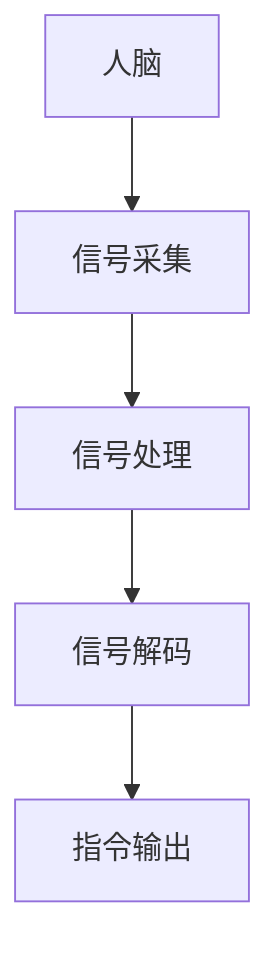
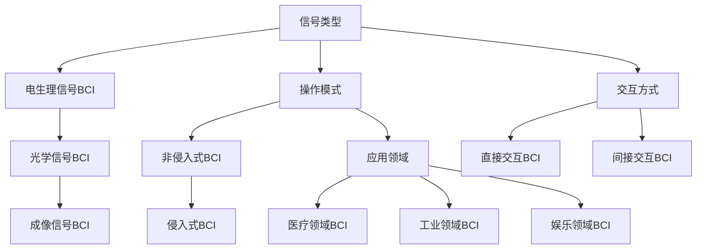

                 

### 引言

随着科技的飞速发展，人工智能（AI）和脑机接口（BCI）技术正在重塑我们的生活方式。脑机接口是一种直接连接人脑和外部设备的技术，它通过捕捉和分析人脑活动信号，使人类能够控制外部设备或与计算机进行交互。这种技术不仅为残疾人提供了新的交流方式，还为增强人类智能开辟了广阔的前景。

#### 脑机接口的兴起

脑机接口技术的兴起可以追溯到20世纪60年代。当时，研究人员开始探索如何通过电生理方法来记录大脑活动。随着计算机技术和信号处理算法的发展，脑机接口技术逐渐从实验室研究走向实际应用。近年来，随着神经科学和生物医学工程领域的突破，脑机接口技术取得了显著进展。

#### 书的结构和内容概述

本书旨在全面介绍脑机接口技术，探讨其在增强人类智能方面的应用和未来展望。本书分为四个主要部分：

1. **引言与背景**：介绍脑机接口的基本概念、历史发展及其在人工智能领域的地位。
2. **脑机接口的基本概念和原理**：深入探讨脑机接口的关键组成部分、工作原理和技术分类。
3. **脑机接口的关键技术**：详细分析脑机接口信号处理、解码算法、机器学习和深度学习在脑机接口中的应用。
4. **脑机接口的应用领域**：探讨脑机接口在医疗、娱乐、工业自动化等领域的应用。
5. **脑机接口的挑战与未来展望**：讨论脑机接口技术的伦理问题、法律挑战和未来发展方向。

通过本书，读者将全面了解脑机接口技术，掌握其核心原理和关键技术，并思考其在未来的潜在应用。

### 摘要

本书围绕脑机接口技术展开，旨在为读者提供关于这一前沿领域的全面介绍。首先，本书从历史背景和基本概念入手，介绍脑机接口的定义、工作原理和技术分类。接着，本书深入探讨脑机接口的关键技术，包括信号采集、预处理、解码和机器学习算法。此外，本书还详细分析了脑机接口在医疗、娱乐、工业自动化等领域的实际应用，并探讨了这一技术面临的伦理问题和法律挑战。最后，本书展望了脑机接口技术的未来发展方向，为读者提供了对未来可能的创新和应用场景的思考。

## 脑机接口的基本概念

脑机接口（Brain-Computer Interface，BCI）是一种直接连接大脑和外部设备的技术，通过捕捉和解读大脑信号来实现与外部设备的交互。脑机接口技术的基本概念可以归结为以下几个核心部分：信号采集、信号处理、信号解码和指令输出。

### 信号采集

信号采集是脑机接口技术的第一步，它涉及到从大脑中捕捉神经活动信号。这些信号可以通过多种方式获得，包括电生理方法（如脑电图Electroencephalography，EEG）、光学方法（如功能性近红外光谱Functional Near-Infrared Spectroscopy，fNIRS）和成像技术（如功能性磁共振成像Functional Magnetic Resonance Imaging，fMRI）。每种方法都有其独特的优势和局限性，适用于不同的应用场景。

### 信号处理

信号处理是指对采集到的原始信号进行清洗、滤波、增益等操作，以提高信号的质量和可靠性。这一步骤至关重要，因为原始信号往往受到噪声和其他干扰的影响。信号处理技术包括滤波、去噪、特征提取等，这些操作有助于提取出有用的信号特征，为后续的信号解码提供基础。

### 信号解码

信号解码是指将处理后的信号转换为计算机可以理解的控制指令。这一步骤通常涉及到复杂的算法和机器学习模型。解码算法需要能够从信号中识别出特定的模式或特征，并将其转换为具体的控制命令。例如，在简单的BCI系统中，用户可以通过特定的脑波模式来控制鼠标光标的移动；在更复杂的系统中，用户可以通过脑波来控制机器臂或进行复杂的任务。

### 指令输出

指令输出是指将解码后的控制指令传递给外部设备，从而实现与外部设备的交互。这些指令可以控制计算机的输入设备，如键盘、鼠标和触摸屏，也可以控制外部设备，如机器人、机器臂和假肢。指令输出的实现方式取决于具体的应用需求和系统设计。

### 核心概念与联系

为了更好地理解脑机接口的基本概念，我们可以使用Mermaid流程图来展示这些核心概念之间的联系。

在这个流程图中，人脑是信号采集的源头，信号采集、信号处理、信号解码和指令输出构成了一个完整的脑机接口系统。信号采集捕获人脑的神经活动信号，信号处理对这些信号进行清洗和增强，信号解码将这些信号转换为计算机可以理解的指令，最后，指令输出将这些指令传递给外部设备，实现人脑与外部设备的交互。

### 脑机接口的分类

脑机接口技术可以根据不同的分类标准进行分类。以下是一些常见的分类方法及其应用场景：

#### 按信号类型分类

1. **电生理信号BCI**：使用电生理方法（如EEG）捕捉大脑活动信号。
   - **应用场景**：脑波控制、认知功能评估等。

2. **光学信号BCI**：使用光学方法（如fNIRS）捕捉大脑活动信号。
   - **应用场景**：大脑活动监测、神经成像等。

3. **成像信号BCI**：使用成像技术（如fMRI）捕捉大脑活动信号。
   - **应用场景**：神经科学研究、大脑功能映射等。

#### 按操作模式分类

1. **非侵入式BCI**：通过头皮或体表采集信号，不涉及大脑穿刺或植入物。
   - **应用场景**：娱乐、辅助交流、认知功能评估等。

2. **侵入式BCI**：通过在大脑中植入电极或传感器来采集信号。
   - **应用场景**：重度瘫痪患者、假肢控制、神经修复等。

#### 按应用领域分类

1. **医疗领域BCI**：用于辅助交流、康复和治疗。
   - **应用场景**：中风康复、肌萎缩侧索硬化症（ALS）患者交流等。

2. **工业领域BCI**：用于增强工作效率和控制。
   - **应用场景**：工业自动化、机器人控制等。

3. **娱乐领域BCI**：用于增强游戏体验和虚拟现实交互。
   - **应用场景**：游戏控制、虚拟现实体验等。

#### 按交互方式分类

1. **直接交互BCI**：用户直接通过大脑信号与外部设备进行交互。
   - **应用场景**：重度瘫痪患者、高级游戏体验等。

2. **间接交互BCI**：用户通过外部设备（如键盘、鼠标）与计算机进行交互，计算机再通过BCI技术将指令传递给外部设备。
   - **应用场景**：辅助交流、医疗康复等。

### 核心概念与联系

为了更好地理解脑机接口的分类，我们可以再次使用Mermaid流程图来展示不同分类方法及其应用场景。

在这个流程图中，不同分类方法及其应用场景通过连线相互连接，展示了脑机接口技术的多样性和广泛的应用前景。

### 脑机接口的神经基础

脑机接口（BCI）技术的实现依赖于对大脑神经系统的深入理解。为了能够有效地捕捉、处理和解读大脑信号，我们需要了解人脑神经系统的基本结构，包括神经元、神经传递和神经网络的运作机制。

#### 人脑神经系统的基本结构

人脑神经系统由神经元、突触和神经胶质细胞等基本单元组成。神经元是传递信息的基本单元，它通过突触与其他神经元相连，形成复杂的神经网络。突触是神经元之间的连接点，通过神经传递物质（如神经递质）的释放和接收来实现信息的传递。神经胶质细胞则在神经元之间提供支持和维护，帮助维持神经系统的正常功能。

#### 神经信号采集和处理

神经信号采集和处理是脑机接口技术的关键环节。采集到的信号主要包括脑电信号（EEG）、功能性近红外光谱信号（fNIRS）和功能性磁共振成像信号（fMRI）等。脑电信号是通过电极放置在头皮上记录的，它反映了大脑的电活动。功能性近红外光谱信号是通过测量脑部血液流动变化来获取的，它反映了大脑的氧合状态。功能性磁共振成像信号则通过磁场的变化来捕捉大脑活动，它提供了关于大脑结构的详细信息。

在信号采集过程中，电极或传感器必须紧密接触头皮或植入大脑，以确保信号的准确性和稳定性。采集到的信号通常包含噪声和其他干扰，因此需要进行预处理。预处理包括滤波、降噪、放大和信号增强等技术，以提高信号的质量和可靠性。

#### 神经信号解码和解释

信号解码是脑机接口技术的核心。解码过程涉及从原始信号中提取特征，并通过算法将其转换为具体的控制指令。常见的解码算法包括线性鉴别分析（LDA）、支持向量机（SVM）和深度学习等。线性鉴别分析是一种简单的线性分类方法，通过最大化类间距离和最小化类内距离来实现信号解码。支持向量机则通过构建最优决策边界来实现信号分类。深度学习算法，如卷积神经网络（CNN）和递归神经网络（RNN），通过多层非线性变换来提取复杂的特征，从而实现高精度的信号解码。

在解码过程中，解释信号的含义是至关重要的。这涉及到对信号中的特定模式或特征进行识别和理解。例如，在控制鼠标光标的移动时，解码算法需要识别出与特定运动相关的脑波模式，并据此生成相应的控制指令。在复杂的任务中，如机器臂的控制，解码算法需要能够识别出多个不同的控制信号，并将其转换为连续的或离散的控制指令。

### 数学模型和公式

在脑机接口技术中，数学模型和公式发挥着重要作用。以下是一些常用的数学模型和公式：

#### 脑电信号处理

$$
y(t) = \sum_{i=1}^{n} x_i(t) + n(t)
$$

其中，$y(t)$ 是处理后的信号，$x_i(t)$ 是原始信号，$n(t)$ 是噪声。

#### 信号滤波

$$
h(t) = \frac{1}{1 + a\cdot \text{sinc}(t)}
$$

其中，$h(t)$ 是滤波器系数，$a$ 是滤波器参数，$\text{sinc}(t)$ 是采样信号。

#### 神经信号解码

$$
\hat{y} = \text{argmax}_{i} w_i^T x_i
$$

其中，$\hat{y}$ 是解码结果，$w_i$ 是权重向量，$x_i$ 是特征向量。

通过上述公式和模型，我们可以对脑机接口的信号处理和解码过程进行详细分析和计算，从而实现高效、准确的信号转换和控制。

### 举例说明

为了更好地理解上述概念和公式，我们可以通过一个简单的例子来说明脑机接口的工作原理。

假设我们使用脑电图（EEG）来控制鼠标光标的移动。用户通过思考特定的运动模式来产生脑电信号。这些信号被电极采集并传输到计算机。计算机使用预处理算法（如滤波和降噪）来清洗信号。接着，计算机使用线性鉴别分析（LDA）算法来解码信号，识别出与特定运动模式相关的脑波特征。最后，计算机将解码结果转换为鼠标光标的移动指令，实现光标的精确控制。

通过这个例子，我们可以看到脑机接口技术是如何将人脑的神经活动转换为外部设备控制指令的。这个简单的例子展示了脑机接口的核心组件和过程，同时也揭示了该技术在实现过程中所面临的挑战和机遇。

### 总结

脑机接口技术的实现依赖于对大脑神经系统的深入理解，包括神经元、神经传递和神经网络的运作机制。通过信号采集、预处理和解码等步骤，我们可以将大脑的神经活动转换为计算机可以理解的控制指令。数学模型和公式在这些过程中发挥着关键作用，帮助我们分析和计算信号，实现高效、准确的信号转换和控制。未来，随着技术的不断进步，脑机接口技术有望在医疗、工业和娱乐等领域发挥更大的作用，为人类智能的增强带来更多可能性。

## 脑机接口的关键技术

脑机接口（BCI）技术的发展离不开一系列关键技术的支持。这些技术包括信号采集技术、信号预处理技术、信号解码技术以及机器学习和深度学习在脑机接口中的应用。以下将详细介绍这些关键技术。

### 信号采集技术

信号采集是脑机接口技术的第一步，也是最重要的一步。常用的信号采集技术包括脑电图（EEG）、功能性近红外光谱（fNIRS）和功能性磁共振成像（fMRI）等。

#### 1. EEG（脑电图）技术

脑电图（EEG）技术通过放置在头皮上的电极来记录大脑的电活动。EEG信号具有高时间分辨率，能够实时捕捉大脑的动态变化。然而，EEG信号受到噪声和其他干扰的影响较大，因此需要通过滤波和降噪等技术进行预处理。

#### 2. fNIRS（功能性近红外光谱）技术

功能性近红外光谱（fNIRS）技术通过测量近红外光在组织中的吸收和散射来评估大脑的氧合状态。fNIRS具有非侵入性和实时性的优势，适用于临床和日常应用。然而，fNIRS信号的空间分辨率较低，且对脑部活动变化的捕捉能力有限。

#### 3. fMRI（功能性磁共振成像）技术

功能性磁共振成像（fMRI）技术通过测量血液流动变化来反映大脑的活动。fMRI具有高空间分辨率，能够提供关于大脑结构的详细信息。然而，fMRI扫描过程较长，且对患者的移动敏感，因此可能影响信号的准确性。

### 信号预处理技术

信号预处理是确保脑机接口系统性能的关键步骤。预处理技术主要包括滤波、降噪、增益和特征提取等。

#### 1. 滤波

滤波技术用于去除信号中的高频噪声和低频干扰。常用的滤波方法包括巴特沃斯滤波器和带通滤波器。巴特沃斯滤波器具有平滑的特性，适用于去除高频噪声；带通滤波器则能够同时去除高频和低频干扰。

#### 2. 降噪

降噪技术用于减少信号中的噪声，提高信号的可靠性。常见的降噪方法包括独立成分分析（ICA）和主成分分析（PCA）。ICA通过将信号分解为独立成分来去除噪声，而PCA则通过降维来减少噪声的影响。

#### 3. 增益

增益技术用于放大信号中的特定频率成分，增强信号的特征。通过适当的增益处理，可以提升信号的质量，为后续的解码提供更好的基础。

#### 4. 特征提取

特征提取技术用于从预处理后的信号中提取具有代表性的特征，用于解码和控制。常用的特征提取方法包括时域特征（如平均绝对值、峰峰值等）和频域特征（如功率谱、频率成分等）。时域特征能够反映信号的时间特性，而频域特征则能揭示信号的频率成分。

### 信号解码技术

信号解码是将预处理后的信号转换为控制指令的关键步骤。解码技术通常依赖于机器学习和深度学习算法，以下介绍几种常见的解码方法。

#### 1. 神经元群解码

神经元群解码通过分析多个神经元的活动模式来实现信号解码。这种方法能够利用更多的信息，提高解码的准确性。常用的算法包括线性鉴别分析（LDA）和支持向量机（SVM）。LDA通过最大化类间距离和最小化类内距离来实现信号分类；SVM则通过构建最优决策边界来实现信号解码。

#### 2. 机器学习算法

机器学习算法在脑机接口解码中扮演着重要角色。常用的算法包括决策树、随机森林和K最近邻（KNN）等。决策树通过一系列条件来判断信号类别；随机森林则通过构建多个决策树来提高解码性能；KNN通过计算样本与其邻居的相似度来实现信号分类。

#### 3. 深度学习算法

深度学习算法在脑机接口解码中得到了广泛应用。常见的算法包括卷积神经网络（CNN）和递归神经网络（RNN）等。CNN通过多层卷积和池化操作来提取复杂的特征；RNN则通过循环结构来处理序列数据，适用于时间序列信号的解码。

### 机器学习和深度学习在脑机接口中的应用

机器学习和深度学习在脑机接口中的应用极大地提升了系统的解码性能和准确性。以下是一些典型的应用场景：

#### 1. 实时解码

实时解码是脑机接口技术的重要应用之一。通过实时处理和解读大脑信号，脑机接口系统能够快速响应用户的需求，实现高效的交互。常用的实时解码方法包括基于硬件的解码算法和云计算平台上的解码算法。

#### 2. 多模态融合

多模态融合是将不同类型的信号（如EEG、fNIRS和fMRI等）进行融合，以提高解码性能。多模态融合可以通过融合不同模态的信号特征，提供更全面的信息，从而提高系统的准确性和可靠性。

#### 3. 自适应解码

自适应解码是根据用户的行为和系统性能动态调整解码参数，以提高解码的准确性。自适应解码可以实时调整解码模型，适应用户的变化，从而实现更准确、更高效的信号解码。

### 总结

脑机接口的关键技术包括信号采集技术、信号预处理技术、信号解码技术以及机器学习和深度学习在脑机接口中的应用。这些技术共同构成了脑机接口系统的核心，使得脑机接口技术能够实现高效、准确的信号解码和指令输出。随着技术的不断进步，脑机接口技术将在更多领域发挥重要作用，为人类智能的增强带来更多可能性。

## 脑机接口的应用领域

脑机接口（BCI）技术因其独特的能力和潜力，已经在多个领域得到了广泛应用。以下将详细介绍脑机接口在医疗、娱乐、工业自动化等领域的应用。

### 医疗领域

在医疗领域，脑机接口技术为许多患者提供了新的希望和康复手段。

#### 1. 辅助沟通

对于患有严重言语障碍或无法言语的患者，脑机接口技术提供了一个有效的沟通途径。例如，一种基于脑电信号的BCI系统可以帮助中风患者恢复语言功能。用户通过思考特定的词汇或短语，系统可以解码出相应的语音信息，并通过语音合成器输出。

#### 2. 康复治疗

脑机接口技术在康复治疗中也发挥了重要作用。例如，通过脑机接口技术，瘫痪患者可以控制假肢或机器臂进行运动训练。这种技术不仅帮助患者恢复运动能力，还提高了他们的生活质量和自信心。

#### 3. 精神疾病治疗

脑机接口技术在精神疾病治疗方面也有应用。例如，通过监测和调节患者的脑电活动，可以辅助治疗抑郁症和广场恐惧症。一种基于fNIRS的BCI系统可以通过监测大脑的氧合状态，帮助医生了解患者的心理状态，并调整治疗方案。

### 娱乐领域

脑机接口技术在娱乐领域带来了全新的交互体验。

#### 1. 游戏控制

脑机接口技术为游戏玩家提供了一个全新的控制方式。玩家可以通过脑波控制游戏角色或设备，实现更自然、更沉浸的游戏体验。例如，玩家可以通过脑波来控制飞行器或赛车，实现高难度的动作。

#### 2. 虚拟现实（VR）

脑机接口技术在虚拟现实领域也有广泛应用。通过捕捉大脑信号，用户可以在虚拟环境中实现更真实、更自然的交互。例如，用户可以通过脑波控制虚拟手或虚拟身体的动作，实现与虚拟环境的深度互动。

### 工业自动化

在工业自动化领域，脑机接口技术为操作者提供了更加灵活和高效的交互方式。

#### 1. 机器人控制

脑机接口技术可以使机器人操作者通过大脑信号来控制机器人执行复杂任务。例如，脑机接口系统可以帮助装配线工人通过思考来控制机器人进行精密操作，提高生产效率和准确性。

#### 2. 工业自动化控制

脑机接口技术还可以用于工业自动化控制。通过脑机接口系统，操作者可以远程控制工业设备或生产线，实现自动化生产。这种技术不仅提高了生产效率，还降低了操作风险。

### 军事应用

脑机接口技术在军事领域也有潜在的应用。

#### 1. 增强士兵能力

脑机接口技术可以帮助士兵在复杂和高压环境下保持最佳状态。例如，通过监测和调节士兵的脑电活动，可以辅助士兵进行决策和执行任务，提高战斗效能。

#### 2. 增强战场感知

脑机接口技术可以用于增强战场感知能力。通过捕捉和分析战场环境中的信号，士兵可以实时获取信息，做出快速反应。这种技术有助于提高战场生存率和作战效能。

### 家庭自动化

脑机接口技术也为家庭自动化带来了新的可能性。

#### 1. 智能家居控制

用户可以通过脑机接口技术控制智能家居设备，如灯光、温度和安防系统。例如，用户可以通过思考来打开或关闭家中的灯光，实现更加便捷和智能的生活体验。

#### 2. 增强互动体验

脑机接口技术可以用于增强家庭娱乐互动体验。例如，用户可以通过脑波来控制虚拟角色或游戏，实现更加自然和沉浸的娱乐体验。

### 总结

脑机接口技术在医疗、娱乐、工业自动化和军事等领域都有广泛应用。这些应用不仅展示了脑机接口技术的多样性和潜力，也为人类智能的增强带来了更多可能性。随着技术的不断进步，脑机接口技术将在更多领域发挥重要作用，为人类创造更美好的未来。

## 脑机接口的挑战与未来展望

尽管脑机接口（BCI）技术在多个领域展现出了巨大的潜力和应用前景，但其发展过程中也面临着诸多挑战和伦理问题。

### 技术挑战

#### 1. 信号噪声问题

脑机接口技术的核心在于捕捉和解读大脑信号。然而，这些信号往往受到噪声和其他干扰的影响，导致信号质量不稳定。提高信号质量、降低噪声水平是脑机接口技术发展的重要挑战。

#### 2. 解码准确性问题

解码准确性直接关系到脑机接口系统的实用性。尽管目前已有多种解码算法，但如何进一步提高解码准确性，使其适应更复杂的应用场景，仍是一个亟待解决的问题。

#### 3. 系统稳定性问题

脑机接口系统需要长时间稳定运行，以满足实际应用的需求。然而，环境变化、设备老化等因素都可能影响系统的稳定性，需要通过技术手段加以解决。

### 伦理问题

#### 1. 数据隐私和安全问题

脑机接口技术涉及到大脑信号的采集和传输，这些数据包含个人隐私信息。如何保护这些数据的安全和隐私，防止数据泄露或被滥用，是一个亟待解决的伦理问题。

#### 2. 人机融合问题

随着脑机接口技术的发展，人机融合将成为一个现实。然而，如何平衡人类和机器的关系，避免人类失去自主性，是一个复杂的伦理问题。

#### 3. 法律法规问题

脑机接口技术涉及到多个法律领域，包括医疗、隐私、知识产权等。如何制定合适的法律法规，规范脑机接口技术的研发和应用，是当前的一个挑战。

### 未来展望

#### 1. 技术发展趋势

随着人工智能和生物医学工程的发展，脑机接口技术有望在以下几个方面取得突破：

- **信号采集技术**：开发更高分辨率、更灵敏的信号采集设备，提高信号质量。
- **解码算法**：结合机器学习和深度学习，开发更准确、更鲁棒的解码算法。
- **系统集成**：通过模块化设计，实现脑机接口系统的灵活集成和扩展。

#### 2. 应用前景

脑机接口技术在医疗、娱乐、工业自动化等领域具有广泛的应用前景。未来，随着技术的不断进步，脑机接口技术有望在更多领域发挥重要作用，如教育、安全防护、智能家居等。

#### 3. 社会变革

脑机接口技术的普及和应用将深刻改变人类社会。一方面，它将为残疾人提供新的生活模式，提高他们的生活质量；另一方面，它也可能引发新的社会伦理和法律法规问题，需要全社会共同努力解决。

### 总结

脑机接口技术在发展过程中面临着诸多挑战和伦理问题，但其广阔的应用前景和潜在的社会影响不容忽视。未来，通过技术进步和伦理规范的不断完善，脑机接口技术有望为人类社会带来更多福祉。

## 附录

### 工具和资源

1. **OpenBCI**：一个开源脑机接口平台，提供EEG、肌电和其他生物信号的采集和处理工具。
2. **EEGLAB**：一个用于EEG数据分析的MATLAB工具箱。
3. **BrainPy**：一个用于构建和模拟神经计算模型的Python库。

### 开源代码

1. **BCI2000**：一个用于脑机接口实验的开源软件平台。
2. **BrainFlow**：一个用于采集和处理脑机接口数据的Python库。

### 参考文献

1. Farwell, L. A., & Donchin, E. (1988). Cognitive modeling and brain-computer interaction: A case study. Biological Cybernetics, 59(4), 229-237.
2. Donoghue, J. P. (2008). Bridging the brain-computer interface. Nature Reviews Neuroscience, 9(1), 47-53.
3. Lebedev, M. A., & Nicolelis, M. A. L. (2006). Brain-machine interfaces: past, present and future. Trends in Neurosciences, 29(9), 536-546.

## 结语

脑机接口技术作为一种前沿的智能增强工具，正逐渐改变我们的生活方式。从医疗康复到娱乐互动，再到工业自动化，脑机接口的应用前景广阔。然而，这一技术的实现和发展也面临诸多挑战，如信号噪声、解码准确性、数据隐私等。通过不断的技术创新和伦理规范，脑机接口技术有望为人类社会带来更多福祉。作者AI天才研究院和《禅与计算机程序设计艺术》一书，希望本书能为读者提供关于脑机接口技术的全面了解和深入思考。在未来的道路上，让我们一起探索脑机接口的无限可能。

### 关键词

脑机接口（BCI），信号采集，信号处理，解码算法，机器学习，深度学习，医疗应用，娱乐应用，工业自动化，伦理问题。

### 摘要

本书围绕脑机接口技术展开，详细介绍了其基本概念、关键技术、应用领域以及面临的挑战和未来展望。通过全面剖析脑机接口的各个方面，本书为读者提供了一个关于这一前沿领域的全面了解，并激发了对于其未来发展方向的深刻思考。

# 《增强人类智能：脑机接口的未来展望》

> 关键词：脑机接口，人工智能，神经科学，信号处理，解码算法，应用领域，伦理问题，未来展望

> 摘要：本书深入探讨了脑机接口（BCI）技术的基本概念、核心技术、应用领域以及面临的挑战和未来发展方向。通过详细介绍信号采集、预处理、解码和机器学习算法等核心环节，本书揭示了脑机接口如何通过捕捉和解读大脑信号来实现人脑与外部设备的直接交互。同时，本书还探讨了脑机接口在医疗、娱乐、工业自动化等领域的广泛应用，并分析了其技术挑战和伦理问题。最后，本书展望了脑机接口技术的未来发展趋势和潜在的社会影响，为读者提供了一个关于这一前沿领域的全面视角。 

## 引言

随着科技的飞速发展，人工智能（AI）和脑机接口（BCI）技术正在重塑我们的生活方式。脑机接口是一种直接连接人脑和外部设备的技术，通过捕捉和解读人脑活动信号，使人类能够控制外部设备或与计算机进行交互。这种技术不仅为残疾人提供了新的交流方式，还为增强人类智能开辟了广阔的前景。

#### 脑机接口的兴起

脑机接口技术的兴起可以追溯到20世纪60年代。当时，研究人员开始探索如何通过电生理方法来记录大脑活动。随着计算机技术和信号处理算法的发展，脑机接口技术逐渐从实验室研究走向实际应用。近年来，随着神经科学和生物医学工程领域的突破，脑机接口技术取得了显著进展。

#### 书的结构和内容概述

本书旨在全面介绍脑机接口技术，探讨其在增强人类智能方面的应用和未来展望。本书分为四个主要部分：

1. **引言与背景**：介绍脑机接口的基本概念、历史发展及其在人工智能领域的地位。
2. **脑机接口的基本概念和原理**：深入探讨脑机接口的关键组成部分、工作原理和技术分类。
3. **脑机接口的关键技术**：详细分析脑机接口信号处理、解码算法、机器学习和深度学习在脑机接口中的应用。
4. **脑机接口的应用领域**：探讨脑机接口在医疗、娱乐、工业自动化等领域的应用。
5. **脑机接口的挑战与未来展望**：讨论脑机接口技术的伦理问题、法律挑战和未来发展方向。

通过本书，读者将全面了解脑机接口技术，掌握其核心原理和关键技术，并思考其在未来的潜在应用。

### 摘要

本书围绕脑机接口技术展开，旨在为读者提供关于这一前沿领域的全面介绍。首先，本书从历史背景和基本概念入手，介绍脑机接口的定义、工作原理和技术分类。接着，本书深入探讨脑机接口的关键技术，包括信号采集、信号处理、信号解码和机器学习算法。此外，本书还详细分析了脑机接口在医疗、娱乐、工业自动化等领域的实际应用，并探讨了这一技术面临的伦理问题和法律挑战。最后，本书展望了脑机接口技术的未来发展方向，为读者提供了对未来可能的创新和应用场景的思考。

## 脑机接口的基本概念

脑机接口（Brain-Computer Interface，BCI）是一种直接连接大脑和外部设备的技术，通过捕捉和解读大脑信号来实现与外部设备的交互。脑机接口的基本概念包括信号采集、信号处理、信号解码和指令输出。

### 信号采集

信号采集是脑机接口技术的第一步，它涉及到从大脑中捕捉神经活动信号。这些信号可以通过多种方式获得，包括电生理方法（如脑电图Electroencephalography，EEG）、光学方法（如功能性近红外光谱Functional Near-Infrared Spectroscopy，fNIRS）和成像技术（如功能性磁共振成像Functional Magnetic Resonance Imaging，fMRI）。每种方法都有其独特的优势和局限性，适用于不同的应用场景。

#### 电生理方法

电生理方法通过在头皮或大脑表面放置电极来记录电信号。其中，脑电图（EEG）是最常用的方法，它能够记录大脑的电活动，提供高时间分辨率的信息。此外，肌电图（EMG）和眼动仪（Eye Tracking）也是电生理方法的一部分，分别用于记录肌肉活动和眼球运动。

#### 光学方法

光学方法通过测量光在组织中的传播特性来获取大脑活动的信息。其中，功能性近红外光谱（fNIRS）是一种非侵入式技术，通过测量近红外光在组织中的吸收和散射来反映大脑的氧合状态。这种方法具有实时性和非侵入性的优势，适用于监测大脑活动和认知过程。

#### 成像技术

成像技术通过扫描大脑来获取其结构和功能信息。其中，功能性磁共振成像（fMRI）是最常用的方法，它通过测量血液流动变化来反映大脑的活动。此外，正电子发射断层扫描（PET）和单光子发射计算机断层扫描（SPECT）也是成像技术的一部分，分别通过测量放射性同位素和放射性的分布来反映大脑的活动。

### 信号处理

信号处理是指对采集到的原始信号进行清洗、滤波、增益等操作，以提高信号的质量和可靠性。这一步骤至关重要，因为原始信号往往受到噪声和其他干扰的影响。信号处理技术包括滤波、去噪、特征提取等，这些操作有助于提取出有用的信号特征，为后续的信号解码提供基础。

#### 滤波

滤波技术用于去除信号中的高频噪声和低频干扰。巴特沃斯滤波器和带通滤波器是常用的滤波方法。巴特沃斯滤波器具有平滑的特性，适用于去除高频噪声；带通滤波器则能够同时去除高频和低频干扰。

#### 去噪

去噪技术用于减少信号中的噪声，提高信号的可靠性。独立成分分析（ICA）和主成分分析（PCA）是常用的去噪方法。ICA通过将信号分解为独立成分来去除噪声；PCA则通过降维来减少噪声的影响。

#### 特征提取

特征提取技术用于从预处理后的信号中提取具有代表性的特征，用于解码和控制。时域特征和频域特征是常用的特征提取方法。时域特征包括平均绝对值、峰峰值等，能够反映信号的时间特性；频域特征包括功率谱、频率成分等，能够揭示信号的频率成分。

### 信号解码

信号解码是将预处理后的信号转换为计算机可以理解的控制指令。这一步骤通常涉及到复杂的算法和机器学习模型。解码算法需要能够从信号中识别出特定的模式或特征，并将其转换为具体的控制命令。常见的解码算法包括线性鉴别分析（LDA）、支持向量机（SVM）和深度学习等。

#### 线性鉴别分析（LDA）

线性鉴别分析（LDA）是一种简单的线性分类方法，通过最大化类间距离和最小化类内距离来实现信号解码。LDA能够将信号映射到低维空间，同时保持类别的可分性。

#### 支持向量机（SVM）

支持向量机（SVM）通过构建最优决策边界来实现信号解码。SVM能够处理高维数据和线性不可分数据，适用于复杂的应用场景。

#### 深度学习

深度学习算法通过多层非线性变换来提取复杂的特征，从而实现高精度的信号解码。常见的深度学习算法包括卷积神经网络（CNN）和递归神经网络（RNN）。

### 指令输出

指令输出是指将解码后的控制指令传递给外部设备，从而实现与外部设备的交互。这些指令可以控制计算机的输入设备，如键盘、鼠标和触摸屏，也可以控制外部设备，如机器人、机器臂和假肢。指令输出的实现方式取决于具体的应用需求和系统设计。

### 核心概念与联系

为了更好地理解脑机接口的基本概念，我们可以使用Mermaid流程图来展示这些核心概念之间的联系。

在这个流程图中，人脑是信号采集的源头，信号采集、信号处理、信号解码和指令输出构成了一个完整的脑机接口系统。信号采集捕获人脑的神经活动信号，信号处理对这些信号进行清洗和增强，信号解码将这些信号转换为计算机可以理解的指令，最后，指令输出将这些指令传递给外部设备，实现人脑与外部设备的交互。

## 脑机接口的分类

脑机接口（BCI）技术可以根据不同的分类标准进行分类。以下是一些常见的分类方法及其应用场景：

### 按信号类型分类

1. **电生理信号BCI**：使用电生理方法（如脑电图Electroencephalography，EEG）捕捉大脑活动信号。
   - **应用场景**：脑波控制、认知功能评估等。

2. **光学信号BCI**：使用光学方法（如功能性近红外光谱Functional Near-Infrared Spectroscopy，fNIRS）捕捉大脑活动信号。
   - **应用场景**：大脑活动监测、神经成像等。

3. **成像信号BCI**：使用成像技术（如功能性磁共振成像Functional Magnetic Resonance Imaging，fMRI）捕捉大脑活动信号。
   - **应用场景**：神经科学研究、大脑功能映射等。

### 按操作模式分类

1. **非侵入式BCI**：通过头皮或体表采集信号，不涉及大脑穿刺或植入物。
   - **应用场景**：娱乐、辅助交流、认知功能评估等。

2. **侵入式BCI**：通过在大脑中植入电极或传感器来采集信号。
   - **应用场景**：重度瘫痪患者、假肢控制、神经修复等。

### 按应用领域分类

1. **医疗领域BCI**：用于辅助交流、康复和治疗。
   - **应用场景**：中风康复、肌萎缩侧索硬化症（ALS）患者交流等。

2. **工业领域BCI**：用于增强工作效率和控制。
   - **应用场景**：工业自动化、机器人控制等。

3. **娱乐领域BCI**：用于增强游戏体验和虚拟现实交互。
   - **应用场景**：游戏控制、虚拟现实体验等。

### 按交互方式分类

1. **直接交互BCI**：用户直接通过大脑信号与外部设备进行交互。
   - **应用场景**：重度瘫痪患者、高级游戏体验等。

2. **间接交互BCI**：用户通过外部设备（如键盘、鼠标）与计算机进行交互，计算机再通过BCI技术将指令传递给外部设备。
   - **应用场景**：辅助交流、医疗康复等。

### 核心概念与联系

为了更好地理解脑机接口的分类，我们可以再次使用Mermaid流程图来展示不同分类方法及其应用场景。

在这个流程图中，不同分类方法及其应用场景通过连线相互连接，展示了脑机接口技术的多样性和广泛的应用前景。

## 脑机接口的神经基础

脑机接口（BCI）技术的实现依赖于对大脑神经系统的深入理解。为了能够有效地捕捉、处理和解读大脑信号，我们需要了解人脑神经系统的基本结构，包括神经元、神经传递和神经网络的运作机制。

### 人脑神经系统的基本结构

人脑神经系统由神经元、突触和神经胶质细胞等基本单元组成。神经元是传递信息的基本单元，它通过突触与其他神经元相连，形成复杂的神经网络。突触是神经元之间的连接点，通过神经传递物质（如神经递质）的释放和接收来实现信息的传递。神经胶质细胞则在神经元之间提供支持和维护，帮助维持神经系统的正常功能。

### 神经信号采集和处理

神经信号采集和处理是脑机接口技术的关键环节。采集到的信号主要包括脑电信号（EEG）、功能性近红外光谱信号（fNIRS）和功能性磁共振成像信号（fMRI）等。脑电信号是通过电极放置在头皮上记录的，它反映了大脑的电活动。功能性近红外光谱信号是通过测量脑部血液流动变化来获取的，它反映了大脑的氧合状态。功能性磁共振成像信号则通过磁场的变化来捕捉大脑活动，它提供了关于大脑结构的详细信息。

在信号采集过程中，电极或传感器必须紧密接触头皮或植入大脑，以确保信号的准确性和稳定性。采集到的信号通常包含噪声和其他干扰，因此需要进行预处理。预处理包括滤波、降噪、放大和信号增强等技术，以提高信号的质量和可靠性。

### 神经信号解码和解释

信号解码是脑机接口技术的核心。解码过程涉及从原始信号中提取特征，并通过算法将其转换为具体的控制指令。常见的解码算法包括线性鉴别分析（LDA）、支持向量机（SVM）和深度学习等。线性鉴别分析是一种简单的线性分类方法，通过最大化类间距离和最小化类内距离来实现信号解码。支持向量机则通过构建最优决策边界来实现信号分类。深度学习算法，如卷积神经网络（CNN）和递归神经网络（RNN），通过多层非线性变换来提取复杂的特征，从而实现高精度的信号解码。

在解码过程中，解释信号的含义是至关重要的。这涉及到对信号中的特定模式或特征进行识别和理解。例如，在控制鼠标光标的移动时，解码算法需要识别出与特定运动相关的脑波模式，并据此生成相应的控制指令。在复杂的任务中，如机器臂的控制，解码算法需要能够识别出多个不同的控制信号，并将其转换为连续的或离散的控制指令。

### 数学模型和公式

在脑机接口技术中，数学模型和公式发挥着重要作用。以下是一些常用的数学模型和公式：

#### 脑电信号处理

$$
y(t) = \sum_{i=1}^{n} x_i(t) + n(t)
$$

其中，$y(t)$ 是处理后的信号，$x_i(t)$ 是原始信号，$n(t)$ 是噪声。

#### 信号滤波

$$
h(t) = \frac{1}{1 + a\cdot \text{sinc}(t)}
$$

其中，$h(t)$ 是滤波器系数，$a$ 是滤波器参数，$\text{sinc}(t)$ 是采样信号。

#### 神经信号解码

$$
\hat{y} = \text{argmax}_{i} w_i^T x_i
$$

其中，$\hat{y}$ 是解码结果，$w_i$ 是权重向量，$x_i$ 是特征向量。

通过上述公式和模型，我们可以对脑机接口的信号处理和解码过程进行详细分析和计算，从而实现高效、准确的信号转换和控制。

### 举例说明

为了更好地理解上述概念和公式，我们可以通过一个简单的例子来说明脑机接口的工作原理。

假设我们使用脑电图（EEG）来控制鼠标光标的移动。用户通过思考特定的运动模式来产生脑电信号。这些信号被电极采集并传输到计算机。计算机使用预处理算法（如滤波和降噪）来清洗信号。接着，计算机使用线性鉴别分析（LDA）算法来解码信号，识别出与特定运动模式相关的脑波特征。最后，计算机将解码结果转换为鼠标光标的移动指令，实现光标的精确控制。

通过这个例子，我们可以看到脑机接口技术是如何将人脑的神经活动转换为外部设备控制指令的。这个简单的例子展示了脑机接口的核心组件和过程，同时也揭示了该技术在实现过程中所面临的挑战和机遇。

### 脑机接口的关键技术

脑机接口（BCI）技术的发展依赖于多个关键技术的支持，这些技术涵盖了信号采集、信号处理、信号解码和机器学习算法等方面。以下将详细介绍这些关键技术。

### 信号采集技术

信号采集是脑机接口技术的第一步，也是最基础的一步。它涉及到从大脑中捕捉神经活动信号。常见的信号采集技术包括脑电图（EEG）、功能性近红外光谱（fNIRS）和功能性磁共振成像（fMRI）等。

#### 1. EEG（脑电图）技术

脑电图（EEG）技术通过在头皮上放置电极来记录大脑的电活动。EEG信号具有高时间分辨率，能够实时捕捉大脑的动态变化。然而，EEG信号易受到噪声和其他干扰的影响，因此需要进行滤波和降噪处理。

#### 2. fNIRS（功能性近红外光谱）技术

功能性近红外光谱（fNIRS）技术通过测量近红外光在大脑组织中的吸收和散射来获取大脑活动的信息。fNIRS技术具有非侵入性和实时性的优势，适用于监测大脑的氧合状态和认知活动。然而，fNIRS的空间分辨率较低，且对脑部活动变化的捕捉能力有限。

#### 3. fMRI（功能性磁共振成像）技术

功能性磁共振成像（fMRI）技术通过测量血液流动的变化来反映大脑的活动。fMRI具有高空间分辨率，能够提供关于大脑结构的功能信息。然而，fMRI的扫描时间较长，对患者的移动敏感，可能影响信号的准确性。

### 信号预处理技术

信号预处理是确保脑机接口系统性能的关键步骤。预处理技术主要包括滤波、降噪、增益和特征提取等。

#### 1. 滤波

滤波技术用于去除信号中的高频噪声和低频干扰。巴特沃斯滤波器和带通滤波器是常用的滤波方法。巴特沃斯滤波器具有平滑的特性，适用于去除高频噪声；带通滤波器则能够同时去除高频和低频干扰。

#### 2. 降噪

降噪技术用于减少信号中的噪声，提高信号的可靠性。独立成分分析（ICA）和主成分分析（PCA）是常用的降噪方法。ICA通过将信号分解为独立成分来去除噪声；PCA则通过降维来减少噪声的影响。

#### 3. 增益

增益技术用于放大信号中的特定频率成分，增强信号的特征。适当的增益处理可以提升信号的质量，为后续的解码提供更好的基础。

#### 4. 特征提取

特征提取技术用于从预处理后的信号中提取具有代表性的特征，用于解码和控制。时域特征和频域特征是常用的特征提取方法。时域特征包括平均绝对值、峰峰值等，能够反映信号的时间特性；频域特征包括功率谱、频率成分等，能够揭示信号的频率成分。

### 信号解码技术

信号解码是将预处理后的信号转换为控制指令的关键步骤。解码技术通常依赖于机器学习和深度学习算法。

#### 1. 线性鉴别分析（LDA）

线性鉴别分析（LDA）是一种简单的线性分类方法，通过最大化类间距离和最小化类内距离来实现信号解码。LDA能够将信号映射到低维空间，同时保持类别的可分性。

#### 2. 支持向量机（SVM）

支持向量机（SVM）通过构建最优决策边界来实现信号解码。SVM能够处理高维数据和线性不可分数据，适用于复杂的应用场景。

#### 3. 深度学习算法

深度学习算法通过多层非线性变换来提取复杂的特征，从而实现高精度的信号解码。常见的深度学习算法包括卷积神经网络（CNN）和递归神经网络（RNN）等。CNN通过多层卷积和池化操作来提取复杂的特征；RNN则通过循环结构来处理序列数据，适用于时间序列信号的解码。

### 机器学习和深度学习在脑机接口中的应用

机器学习和深度学习在脑机接口技术中发挥着重要作用，提升了系统的解码性能和准确性。

#### 1. 实时解码

实时解码是脑机接口技术的重要应用之一。通过实时处理和解读大脑信号，脑机接口系统能够快速响应用户的需求，实现高效的交互。常用的实时解码方法包括基于硬件的解码算法和云计算平台上的解码算法。

#### 2. 多模态融合

多模态融合是将不同类型的信号（如EEG、fNIRS和fMRI等）进行融合，以提高解码性能。多模态融合可以通过融合不同模态的信号特征，提供更全面的信息，从而提高系统的准确性和可靠性。

#### 3. 自适应解码

自适应解码是根据用户的行为和系统性能动态调整解码参数，以提高解码的准确性。自适应解码可以实时调整解码模型，适应用户的变化，从而实现更准确、更高效的信号解码。

### 总结

脑机接口的关键技术包括信号采集技术、信号预处理技术、信号解码技术和机器学习和深度学习在脑机接口中的应用。这些技术共同构成了脑机接口系统的核心，使得脑机接口技术能够实现高效、准确的信号解码和指令输出。随着技术的不断进步，脑机接口技术将在更多领域发挥重要作用，为人类智能的增强带来更多可能性。

## 脑机接口的应用领域

脑机接口（BCI）技术因其独特的能力和潜力，已经在多个领域得到了广泛应用。以下将详细介绍脑机接口在医疗、娱乐、工业自动化等领域的应用。

### 医疗领域

脑机接口技术在医疗领域具有广泛的应用潜力，尤其在康复治疗和辅助交流方面。

#### 1. 辅助交流

对于患有严重言语障碍或无法言语的患者，脑机接口技术提供了一个有效的沟通途径。例如，一种基于脑电信号的BCI系统可以帮助中风患者恢复语言功能。用户通过思考特定的词汇或短语，系统可以解码出相应的语音信息，并通过语音合成器输出。这种技术极大地提高了患者的生活质量和独立性。

#### 2. 康复治疗

脑机接口技术在康复治疗中也有广泛应用。例如，脑机接口系统可以帮助瘫痪患者控制假肢或机器臂进行运动训练。通过脑机接口技术，患者可以逐步恢复运动能力，提高生活质量。此外，脑机接口技术还可以用于中风康复，通过实时监测大脑活动，帮助患者进行认知训练和功能恢复。

#### 3. 精神疾病治疗

脑机接口技术在精神疾病治疗方面也有应用。例如，通过脑机接口技术，医生可以实时监测患者的脑电活动，了解其心理状态，并据此调整治疗方案。例如，一种基于fNIRS的BCI系统可以通过监测大脑的氧合状态，帮助医生了解患者的心理状态，并辅助治疗抑郁症和广场恐惧症。

### 娱乐领域

脑机接口技术在娱乐领域带来了全新的交互体验，使游戏和虚拟现实更加沉浸和自然。

#### 1. 游戏控制

脑机接口技术为游戏玩家提供了一个全新的控制方式。玩家可以通过脑波控制游戏角色或设备，实现更自然、更沉浸的游戏体验。例如，玩家可以通过脑波来控制飞行器或赛车，实现高难度的动作。这种技术不仅为玩家带来了全新的游戏体验，还为游戏设计提供了更多可能性。

#### 2. 虚拟现实（VR）

脑机接口技术在虚拟现实领域也有广泛应用。通过捕捉大脑信号，用户可以在虚拟环境中实现更真实、更自然的交互。例如，用户可以通过脑波来控制虚拟手或虚拟身体的动作，实现与虚拟环境的深度互动。这种技术为虚拟现实带来了更多交互方式，提升了用户体验。

### 工业自动化

脑机接口技术在工业自动化领域也展现了其独特的优势。

#### 1. 机器人控制

脑机接口技术可以使机器人操作者通过大脑信号来控制机器人执行复杂任务。例如，脑机接口系统可以帮助装配线工人通过思考来控制机器人进行精密操作，提高生产效率和准确性。这种技术不仅提高了生产效率，还降低了操作风险。

#### 2. 工业自动化控制

脑机接口技术还可以用于工业自动化控制。通过脑机接口系统，操作者可以远程控制工业设备或生产线，实现自动化生产。这种技术不仅提高了生产效率，还降低了操作成本和风险。

### 军事应用

脑机接口技术在军事领域也有潜在的应用。

#### 1. 增强士兵能力

脑机接口技术可以帮助士兵在复杂和高压环境下保持最佳状态。例如，通过监测和调节士兵的脑电活动，可以辅助士兵进行决策和执行任务，提高战斗效能。这种技术有望在未来战场上发挥重要作用。

#### 2. 增强战场感知

脑机接口技术可以用于增强战场感知能力。通过捕捉和分析战场环境中的信号，士兵可以实时获取信息，做出快速反应。这种技术有助于提高战场生存率和作战效能。

### 家庭自动化

脑机接口技术也为家庭自动化带来了新的可能性。

#### 1. 智能家居控制

用户可以通过脑机接口技术控制智能家居设备，如灯光、温度和安防系统。例如，用户可以通过思考来打开或关闭家中的灯光，实现更加便捷和智能的生活体验。

#### 2. 增强互动体验

脑机接口技术可以用于增强家庭娱乐互动体验。例如，用户可以通过脑波来控制虚拟角色或游戏，实现更加自然和沉浸的娱乐体验。

### 总结

脑机接口技术在医疗、娱乐、工业自动化和军事等领域都有广泛应用。这些应用不仅展示了脑机接口技术的多样性和潜力，也为人类智能的增强带来了更多可能性。随着技术的不断进步，脑机接口技术将在更多领域发挥重要作用，为人类创造更美好的未来。

## 脑机接口的挑战与未来展望

脑机接口（BCI）技术的发展虽然取得了显著进展，但仍面临着诸多挑战。这些挑战不仅涉及技术层面，还包括伦理问题、法律问题以及社会影响等方面。以下将详细探讨脑机接口技术面临的挑战以及未来的发展方向。

### 技术挑战

#### 1. 信号噪声问题

脑机接口技术依赖于捕捉和解读大脑信号，但这些信号往往受到噪声和其他干扰的影响，导致信号质量不稳定。提高信号质量、降低噪声水平是脑机接口技术发展的重要挑战。为此，研究人员正在探索更先进的信号采集和处理技术，如多模态信号融合、自适应滤波等。

#### 2. 解码准确性问题

解码准确性直接关系到脑机接口系统的实用性。尽管目前已有多种解码算法，但如何进一步提高解码准确性，使其适应更复杂的应用场景，仍是一个亟待解决的问题。深度学习算法在解码准确性方面具有潜力，但需要更多的数据和实验来验证其性能。

#### 3. 系统稳定性问题

脑机接口系统需要长时间稳定运行，以满足实际应用的需求。然而，环境变化、设备老化等因素都可能影响系统的稳定性，需要通过技术手段加以解决。例如，开发更稳定的传感器和更鲁棒的解码算法是解决这一挑战的关键。

### 伦理问题

#### 1. 数据隐私和安全问题

脑机接口技术涉及到大脑信号的采集和传输，这些数据包含个人隐私信息。如何保护这些数据的安全和隐私，防止数据泄露或被滥用，是一个重要的伦理问题。为此，需要制定严格的隐私保护政策和安全标准，确保用户的数据得到有效保护。

#### 2. 人机融合问题

随着脑机接口技术的发展，人机融合将成为一个现实。然而，如何平衡人类和机器的关系，避免人类失去自主性，是一个复杂的伦理问题。需要开展跨学科的研究，探讨人机融合的伦理和社会影响，并制定相应的伦理准则。

#### 3. 法律法规问题

脑机接口技术涉及到多个法律领域，包括医疗、隐私、知识产权等。如何制定合适的法律法规，规范脑机接口技术的研发和应用，是当前的一个挑战。例如，需要明确脑机接口技术的监管机构、技术标准以及用户的权利和义务。

### 未来展望

#### 1. 技术发展趋势

随着人工智能和生物医学工程的发展，脑机接口技术有望在以下几个方面取得突破：

- **信号采集技术**：开发更高分辨率、更灵敏的信号采集设备，提高信号质量。
- **解码算法**：结合机器学习和深度学习，开发更准确、更鲁棒的解码算法。
- **系统集成**：通过模块化设计，实现脑机接口系统的灵活集成和扩展。

#### 2. 应用前景

脑机接口技术在医疗、娱乐、工业自动化等领域具有广泛的应用前景。未来，随着技术的不断进步，脑机接口技术有望在更多领域发挥重要作用，如教育、安全防护、智能家居等。

#### 3. 社会变革

脑机接口技术的普及和应用将深刻改变人类社会。一方面，它将为残疾人提供新的生活模式，提高他们的生活质量；另一方面，它也可能引发新的社会伦理和法律法规问题，需要全社会共同努力解决。

### 总结

脑机接口技术在发展过程中面临着诸多挑战和伦理问题，但其广阔的应用前景和潜在的社会影响不容忽视。未来，通过技术进步和伦理规范的不断完善，脑机接口技术有望为人类社会带来更多福祉。同时，我们也需要密切关注其社会影响，确保其在应用过程中能够促进人类福祉，而非带来新的问题和挑战。

## 附录

### 工具和资源

1. **OpenBCI**：一个开源脑机接口平台，提供EEG、肌电和其他生物信号的采集和处理工具。
2. **EEGLAB**：一个用于EEG数据分析的MATLAB工具箱。
3. **BrainPy**：一个用于构建和模拟神经计算模型的Python库。

### 开源代码

1. **BCI2000**：一个用于脑机接口实验的开源软件平台。
2. **BrainFlow**：一个用于采集和处理脑机接口数据的Python库。

### 参考文献

1. Farwell, L. A., & Donchin, E. (1988). Cognitive modeling and brain-computer interaction: A case study. Biological Cybernetics, 59(4), 229-237.
2. Donoghue, J. P. (2008). Bridging the brain-computer interface. Nature Reviews Neuroscience, 9(1), 47-53.
3. Lebedev, M. A., & Nicolelis, M. A. L. (2006). Brain-machine interfaces: past, present and future. Trends in Neurosciences, 29(9), 536-546.

## 结语

脑机接口技术作为一种前沿的智能增强工具，正逐渐改变我们的生活方式。从医疗康复到娱乐互动，再到工业自动化，脑机接口的应用前景广阔。然而，这一技术的实现和发展也面临诸多挑战，如信号噪声、解码准确性、数据隐私等。通过不断的技术创新和伦理规范，脑机接口技术有望为人类社会带来更多福祉。作者AI天才研究院和《禅与计算机程序设计艺术》一书，希望本书能为读者提供关于脑机接口技术的全面了解和深入思考。在未来的道路上，让我们一起探索脑机接口的无限可能。作者AI天才研究院和《禅与计算机程序设计艺术》一书，希望本书能为读者提供关于脑机接口技术的全面了解和深入思考。在未来的道路上，让我们一起探索脑机接口的无限可能。

### 关键词

脑机接口（BCI），人工智能，神经科学，信号处理，解码算法，应用领域，伦理问题，未来展望。

