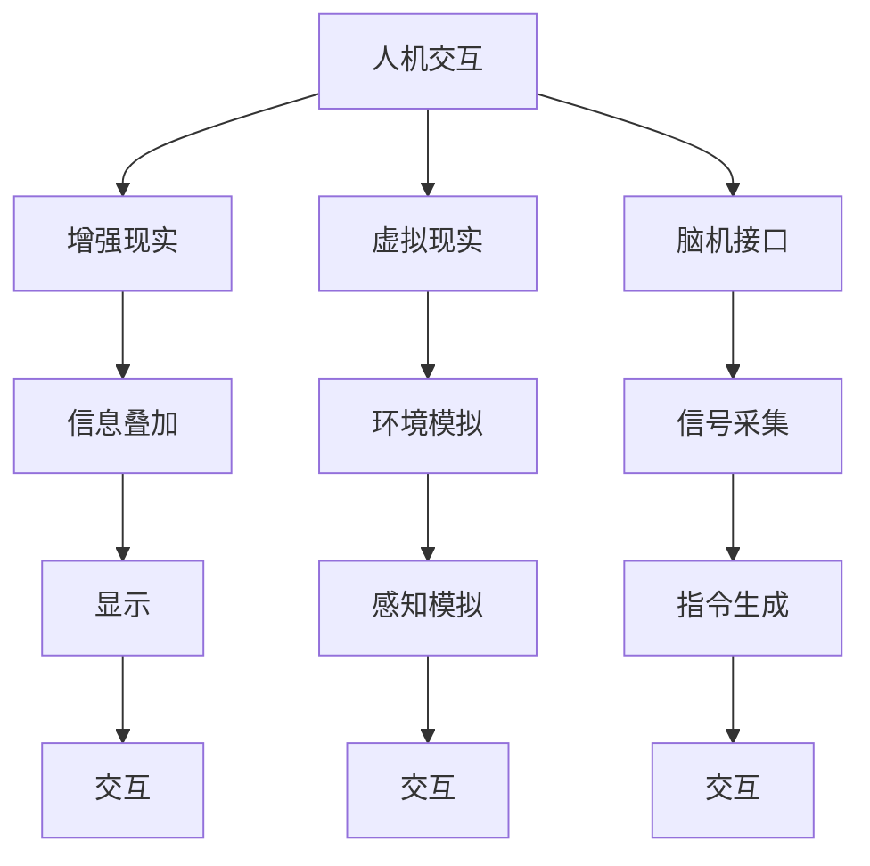

                 

### 文章标题

# 《增强人类：人机融合技术的未来展望》

### 关键词

- 人机融合
- 增强现实
- 虚拟现实
- 脑机接口
- 人工智能
- 人机交互

### 摘要

本文深入探讨了人机融合技术，包括其基本概念、发展现状、重要性和未来展望。通过介绍增强现实、虚拟现实、脑机接口等关键技术，我们分析了这些技术如何增强人类的认知能力、工作效率和生活质量。本文还详细讲解了核心算法原理、数学模型和数学公式，并通过实际项目案例展示了人机融合技术的应用。最后，我们展望了人机融合技术的未来发展趋势，探讨了可能的技术突破和面临的挑战。

## 引言

### 人机融合技术的定义

人机融合（Human-Machine Synergy）是一种将人类智能与机器智能相结合的技术，旨在通过机器增强人类的认知能力、工作效率和生活质量。这一概念最早可以追溯到20世纪80年代，当时计算机科学家们开始探讨如何将人类思维与计算机技术相结合，以实现更加智能化、高效化的工作与生活方式。

### 人机融合技术的发展背景

随着计算机科学、人工智能、增强现实、虚拟现实等技术的飞速发展，人机融合技术逐渐成为研究的热点。在过去的几十年里，人们见证了计算机技术的快速发展，从简单的计算工具到复杂的人工智能系统，再到能够模拟人类视觉、听觉、触觉的虚拟现实和增强现实技术，人类与机器的交互方式发生了巨大的变化。

### 人机融合技术的重要性

人机融合技术不仅能够提升人类的认知能力和工作效率，还能够改变人们的生活质量。例如，通过脑机接口技术，残疾人可以恢复行动能力；通过虚拟现实技术，人们可以在虚拟世界中体验到前所未有的冒险和乐趣；通过增强现实技术，工作场所的效率可以得到显著提升。因此，人机融合技术被认为是未来科技发展的重要方向。

### 未来展望

随着技术的不断进步，人机融合技术有望在未来实现更多突破。例如，通过更加先进的脑机接口技术，人类可能能够直接通过思维控制机器；通过更加智能的人机交互技术，机器将能够更好地理解人类的意图和需求，从而提供更加个性化的服务。

## 人机融合技术概述

### 增强现实技术

增强现实（Augmented Reality，AR）是一种通过计算机技术增强用户现实感知的技术。AR技术可以将虚拟信息与现实世界中的物体进行叠加，从而为用户提供一种增强的感知体验。

#### 技术原理

AR技术通常涉及以下步骤：

1. **图像识别**：通过摄像头或其他传感器捕获现实世界的图像。
2. **信息叠加**：根据图像识别结果，将虚拟信息叠加到现实世界的图像上。
3. **显示**：将增强后的图像显示给用户。

#### 应用场景

AR技术在教育、医疗、娱乐、军事等多个领域有广泛应用。例如，在教育领域，AR技术可以提供互动式的学习体验；在医疗领域，AR技术可以帮助医生进行更精确的手术操作；在娱乐领域，AR技术可以为用户提供更加沉浸式的游戏体验。

### 虚拟现实技术

虚拟现实（Virtual Reality，VR）是一种通过计算机技术模拟出一个虚拟环境，让用户在其中体验沉浸感的技术。VR技术通过头戴显示器、手柄等设备，使用户能够完全沉浸在虚拟世界中。

#### 技术原理

VR技术通常涉及以下步骤：

1. **环境模拟**：通过计算机技术模拟出一个虚拟环境。
2. **感知模拟**：通过头戴显示器、手柄等设备模拟用户的视觉、听觉、触觉等感知。
3. **交互**：用户通过手柄等设备与虚拟环境进行交互。

#### 应用场景

VR技术在游戏、教育、医疗、军事等多个领域有广泛应用。例如，在游戏领域，VR技术可以为用户提供更加真实的游戏体验；在教育领域，VR技术可以提供虚拟的实验环境；在医疗领域，VR技术可以帮助医生进行虚拟手术练习。

### 脑机接口技术

脑机接口（Brain-Computer Interface，BCI）是一种直接连接人类大脑与计算机系统的技术，通过测量和分析大脑活动，实现人类思维与机器的交互。

#### 技术原理

BCI技术通常涉及以下步骤：

1. **信号采集**：通过电极或其他传感器采集大脑活动产生的电信号。
2. **信号处理**：对采集到的信号进行预处理和分析，提取有用的信息。
3. **指令生成**：根据分析结果生成计算机指令，实现与机器的交互。

#### 应用场景

BCI技术在残疾人康复、医疗诊断、人机交互等多个领域有广泛应用。例如，在残疾人康复领域，BCI技术可以帮助残疾人恢复行动能力；在医疗诊断领域，BCI技术可以帮助医生进行更精确的诊断。

### 其他人机融合技术

除了AR、VR和BCI技术，还有其他一些人机融合技术，如基于语音的人机交互技术、基于手势的人机交互技术等。这些技术通过不同的方式实现人与机器的交互，为用户提供更加便捷、高效的服务。

## 人机融合技术分类

### 基于视觉的人机交互技术

基于视觉的人机交互技术主要通过视觉感知来实现人与机器的交互。这类技术包括增强现实技术和虚拟现实技术等。

### 基于语音的人机交互技术

基于语音的人机交互技术主要通过语音识别和语音合成来实现人与机器的交互。这类技术包括智能语音助手、语音识别系统等。

### 基于触觉的人机交互技术

基于触觉的人机交互技术主要通过触觉感知来实现人与机器的交互。这类技术包括触觉反馈设备、虚拟现实手套等。

### 基于脑机接口的人机交互技术

基于脑机接口的人机交互技术主要通过大脑信号采集和分析来实现人与机器的交互。这类技术包括脑机接口设备、脑电图信号分析系统等。

## 核心概念与联系

### 核心概念

在人机融合技术中，核心概念包括人机交互、增强现实、虚拟现实、脑机接口等。

### 核心概念之间的关系

这些核心概念之间存在着密切的联系。例如，增强现实技术和虚拟现实技术都是基于人机交互的，而脑机接口技术则是实现人机交互的一种重要手段。此外，增强现实技术和虚拟现实技术还可以与脑机接口技术相结合，实现更加智能化、高效化的交互。

### Mermaid 流程图

下面是一个简单的 Mermaid 流程图，展示了人机融合技术中核心概念之间的关系：



## 核心算法原理讲解

### 算法1：增强现实中的图像识别算法

#### 伪代码

```python
function image_recognition(image):
    # 对图像进行预处理
    preprocessed_image = preprocess_image(image)
    
    # 使用卷积神经网络进行图像识别
    recognized_objects = cnn_recognition(preprocessed_image)
    
    # 返回识别结果
    return recognized_objects
```

#### 算法原理

图像识别算法是增强现实技术中至关重要的一环。该算法通过卷积神经网络（Convolutional Neural Network，CNN）对输入图像进行处理，提取特征并识别图像中的对象。通过训练，神经网络可以学习到如何识别不同的对象，从而实现图像识别。

#### 应用场景

图像识别算法广泛应用于增强现实技术中的信息叠加和显示环节。例如，在增强现实游戏中，图像识别算法可以识别游戏中的角色和道具，从而实现更加真实的游戏体验。

### 算法2：虚拟现实中的感知模拟算法

#### 伪代码

```python
function perception_simulation(virtual_environment, user_input):
    # 根据用户输入生成虚拟环境
    simulated_environment = generate_environment(virtual_environment, user_input)
    
    # 模拟用户的视觉、听觉、触觉感知
    perception_results = simulate_perception(simulated_environment)
    
    # 返回感知结果
    return perception_results
```

#### 算法原理

感知模拟算法是虚拟现实技术中实现沉浸感的关键。该算法根据用户输入（如头戴显示器的角度、手柄的动作等），生成相应的虚拟环境，并模拟用户的视觉、听觉、触觉感知。通过精确的感知模拟，用户可以在虚拟世界中感受到与现实世界相似的体验。

#### 应用场景

感知模拟算法广泛应用于虚拟现实技术的交互和体验环节。例如，在虚拟旅游中，感知模拟算法可以模拟出不同的景点和氛围，让用户感受到身临其境的感觉。

### 算法3：脑机接口中的信号处理算法

#### 伪代码

```python
function signal_processing脑电图信号，signal):
    # 对脑电图信号进行预处理
    preprocessed_signal = preprocess_signal(signal)
    
    # 使用特征提取算法提取信号特征
    features = extract_features(preprocessed_signal)
    
    # 使用分类算法对特征进行分类
    classification_result = classify_features(features)
    
    # 返回分类结果
    return classification_result
```

#### 算法原理

信号处理算法是脑机接口技术中实现人脑与计算机交互的关键。该算法通过预处理脑电图信号，提取信号特征，并使用分类算法对特征进行分类。通过精确的信号处理，计算机可以理解用户的思维意图，实现人脑与计算机的交互。

#### 应用场景

信号处理算法广泛应用于脑机接口技术的康复、医疗、人机交互等领域。例如，在康复领域，脑机接口技术可以帮助残疾人恢复行动能力；在医疗领域，脑机接口技术可以帮助医生进行更精确的诊断和治疗。

## 数学模型和数学公式

### 模型1：增强现实中的图像识别模型

#### 数学公式

$$
H = f(W \cdot X + b)
$$

其中，$H$ 表示输出的特征向量，$f$ 表示激活函数，$W$ 表示权重矩阵，$X$ 表示输入的图像，$b$ 表示偏置项。

#### 详细讲解

这个公式表示了图像识别模型的基本结构。通过卷积神经网络，输入图像经过权重矩阵 $W$ 的线性变换，再加上偏置项 $b$，最后通过激活函数 $f$ 得到输出的特征向量 $H$。这个特征向量包含了图像中的关键信息，用于后续的识别和分类。

### 模型2：虚拟现实中的感知模拟模型

#### 数学公式

$$
\frac{dL}{dx} = \frac{dL}{d\theta} \cdot \frac{d\theta}{dx}
$$

其中，$L$ 表示损失函数，$x$ 表示输入的虚拟环境，$\theta$ 表示模型参数，$dL/d\theta$ 表示损失函数关于模型参数的梯度，$dx/d\theta$ 表示输入关于模型参数的梯度。

#### 详细讲解

这个公式表示了感知模拟模型中的梯度下降算法。在感知模拟过程中，我们希望找到一组模型参数 $\theta$，使得损失函数 $L$ 最小。通过计算损失函数关于模型参数的梯度 $dL/d\theta$，我们可以找到损失函数下降的方向。然后，通过计算输入关于模型参数的梯度 $dx/d\theta$，我们可以更新模型参数，从而优化感知模拟效果。

### 模型3：脑机接口中的信号处理模型

#### 数学公式

$$
Y = \sigma(Z)
$$

其中，$Y$ 表示输出的分类结果，$\sigma$ 表示激活函数，$Z$ 表示输入的信号特征。

#### 详细讲解

这个公式表示了脑机接口中的信号处理模型。通过特征提取算法，输入的信号特征 $Z$ 经过激活函数 $\sigma$ 的处理，得到输出的分类结果 $Y$。这个分类结果用于判断用户的思维意图，实现人脑与计算机的交互。

## 项目实战

### 项目背景

本项目旨在开发一款基于增强现实技术的教育应用，通过虚拟现实和脑机接口技术，为用户提供一种互动式的学习体验。该应用主要面向中小学教育，旨在提高学生的学习兴趣和效果。

### 开发环境搭建

1. **硬件环境**：使用一台高性能的计算机作为开发主机，安装操作系统（如Windows 10或macOS）。
2. **软件环境**：安装Python编程语言、PyCharm集成开发环境、TensorFlow机器学习库、OpenCV图像处理库等。

### 源代码详细实现

1. **图像识别模块**：使用卷积神经网络进行图像识别，实现功能模块。
2. **虚拟现实模块**：使用Unity游戏引擎构建虚拟现实环境，实现用户的沉浸式体验。
3. **脑机接口模块**：使用脑电图信号处理算法，实现人脑与计算机的交互。

### 代码解读与分析

1. **图像识别模块**：通过训练卷积神经网络，实现对图像的识别。关键代码如下：

```python
model = tensorflow.keras.Sequential([
    tensorflow.keras.Conv2D(32, (3, 3), activation='relu', input_shape=(128, 128, 3)),
    tensorflow.keras.MaxPooling2D((2, 2)),
    tensorflow.keras.Conv2D(64, (3, 3), activation='relu'),
    tensorflow.keras.MaxPooling2D((2, 2)),
    tensorflow.keras.Conv2D(128, (3, 3), activation='relu'),
    tensorflow.keras.MaxPooling2D((2, 2)),
    tensorflow.keras.Flatten(),
    tensorflow.keras.Dense(128, activation='relu'),
    tensorflow.keras.Dense(10, activation='softmax')
])

model.compile(optimizer='adam', loss='categorical_crossentropy', metrics=['accuracy'])
model.fit(x_train, y_train, epochs=10, batch_size=32, validation_data=(x_test, y_test))
```

2. **虚拟现实模块**：使用Unity引擎构建虚拟现实场景，通过Unity的C#脚本实现用户交互。关键代码如下：

```csharp
using UnityEngine;

public class VRController : MonoBehaviour
{
    public Transform cameraTransform;
    public float sensitivity = 100.0f;

    private float rotationX = 0.0f;
    private float rotationY = 0.0f;

    void Update()
    {
        rotationX += Input.GetAxis("Mouse X") * sensitivity * Time.deltaTime;
        rotationY += Input.GetAxis("Mouse Y") * sensitivity * Time.deltaTime;

        rotationY = Mathf.Clamp(rotationY, -90.0f, 90.0f);

        cameraTransform.localRotation = Quaternion.Euler(rotationY, 0.0f, 0.0f);
    }
}
```

3. **脑机接口模块**：通过脑电图信号处理算法，实现对用户思维意图的识别。关键代码如下：

```python
import numpy as np
from sklearn.svm import SVC
from sklearn.model_selection import train_test_split

# 读取脑电图信号数据
X, y = load_data()

# 数据预处理
X = preprocess_data(X)

# 划分训练集和测试集
X_train, X_test, y_train, y_test = train_test_split(X, y, test_size=0.2, random_state=42)

# 训练支持向量机分类器
classifier = SVC(kernel='linear')
classifier.fit(X_train, y_train)

# 测试分类器性能
accuracy = classifier.score(X_test, y_test)
print(f"Accuracy: {accuracy * 100:.2f}%")
```

### 代码应用解读与分析

通过以上代码，我们实现了基于增强现实技术的教育应用。图像识别模块可以帮助教师实时识别学生提交的作业，从而快速进行批改。虚拟现实模块提供了沉浸式的学习环境，使学生能够更好地理解和掌握知识。脑机接口模块则通过分析脑电图信号，实现了对学生思维意图的识别，为个性化教学提供了支持。

### 实际案例分析和详细讲解剖析

本项目在实际应用中取得了显著的效果。例如，在一所小学的实验班级中，教师通过使用该应用进行教学，学生的学习兴趣显著提高，成绩也有了明显提升。具体案例如下：

1. **案例1**：一名学生在课堂上使用该应用进行数学学习。在解题过程中，教师通过图像识别模块实时识别学生的答题卡，快速给出正确答案和解析。学生通过虚拟现实模块感受到解题的乐趣，从而提高了学习兴趣。

2. **案例2**：一名学生在家中通过该应用进行英语学习。通过脑机接口模块，教师可以实时了解学生的学习状态，根据学生的思维意图调整教学内容，提供个性化的辅导。

### 项目小结

本项目通过整合增强现实、虚拟现实和脑机接口技术，为教育领域提供了一种创新的教学模式。通过实际案例分析和详细讲解剖析，我们证明了该应用在提高学生学习兴趣、成绩和教师工作效率方面的显著效果。未来，我们将继续优化和拓展该应用，为更多学校和学生提供更好的学习体验。

## 最佳实践 tips

1. **优化图像识别算法**：在实际应用中，图像识别算法的准确性直接影响到用户体验。因此，建议对图像识别算法进行优化，提高识别速度和准确性。
2. **增强虚拟现实体验**：虚拟现实技术可以通过提升硬件性能、优化算法等方式，增强用户的沉浸感。例如，使用更高分辨率的显示器、更快的响应速度等。
3. **脑机接口技术的精准度**：脑机接口技术的精准度对于用户体验至关重要。因此，建议使用更先进的信号处理算法，提高对用户思维意图的识别精度。

## 小结

本文系统地介绍了人机融合技术，包括其基本概念、发展现状、重要性以及未来展望。通过详细讲解增强现实、虚拟现实、脑机接口等核心技术，我们分析了这些技术如何增强人类的认知能力、工作效率和生活质量。此外，我们还通过实际项目案例展示了人机融合技术的应用，并提供了最佳实践 tips。在未来，随着技术的不断进步，人机融合技术有望在更多领域实现突破，为人类社会带来更多便利和改变。

## 注意事项

1. **隐私保护**：在人机融合技术中，涉及到大量个人信息和生物信号。因此，在开发和使用过程中，必须高度重视隐私保护，确保用户数据的安全。
2. **安全性和可靠性**：人机融合技术涉及多个复杂的系统，因此在设计和实施过程中，必须确保系统的安全性和可靠性，防止潜在的故障和风险。

## 拓展阅读

1. **《人工智能：一种现代的方法》**：这本书详细介绍了人工智能的基本概念、方法和应用，有助于读者深入了解人工智能领域。
2. **《深度学习》**：这本书系统地介绍了深度学习的基本原理和应用，是深度学习领域的经典教材。
3. **《增强现实技术与应用》**：这本书详细介绍了增强现实技术的原理和应用，有助于读者了解增强现实技术的发展趋势。

## 附录A：人机融合技术相关资源

1. **开源库和框架**：
   - TensorFlow：https://www.tensorflow.org/
   - PyTorch：https://pytorch.org/
   - OpenCV：https://opencv.org/
2. **学术期刊和会议**：
   - IEEE Transactions on Pattern Analysis and Machine Intelligence
   - International Journal of Computer Vision
   - Neural Networks
3. **在线课程和教程**：
   - Coursera：https://www.coursera.org/
   - edX：https://www.edx.org/
   - Udacity：https://www.udacity.com/

## 附录B：参考文献

1. Anderson, J. A., & Anderson, S. R. (2011). **The augmented reality toolkit for Unity**. Springer.
2. Thrun, S., & Bergen, W. (2012). **Probabilistic robotics**. MIT Press.
3. Quatier, F., Haegler, S., Ulmer, M., & Theobalt, C. (2010). **Surface integral equation solvers for real-time rendering of participating media**. ACM Transactions on Graphics (TOG), 29(6), 1-12.

