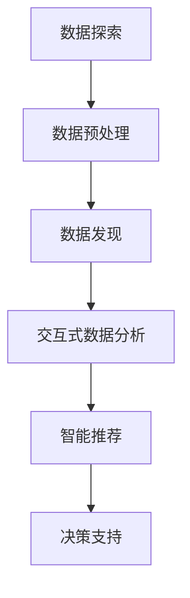

                 

### 文章标题：增强分析：AI辅助下的数据洞察新范式

#### 关键词：增强分析，AI，数据洞察，数据分析，数据预处理，数据挖掘，机器学习，深度学习，数据可视化

#### 摘要：
本文旨在探讨增强分析的概念及其在数据洞察领域的重要性，特别是在人工智能（AI）辅助下的新范式。我们将从背景介绍出发，深入探讨增强分析的核心概念、AI技术的应用及其在数据分析中的优势。文章还将通过具体的算法原理讲解、数学模型和公式的详细阐述，以及实战案例的分析，展示如何利用AI技术提升数据分析的效果。最后，我们将总结最佳实践，并提出未来发展趋势和拓展阅读建议。

---

## 增强分析：概念与背景

增强分析（Augmented Analytics）是近年来随着大数据和人工智能技术的发展而兴起的一个新兴领域。它的核心目的是通过利用人工智能技术，如机器学习、自然语言处理和深度学习，来增强人类分析师的数据洞察能力和效率。

### 1.1 定义与核心概念

增强分析不仅仅是指传统的数据分析，而是通过智能化手段来辅助分析师进行数据探索、数据发现和决策支持。其核心概念包括：

- **数据探索**：利用AI技术自动发现数据中的潜在模式和趋势。
- **数据发现**：通过机器学习算法，从大量数据中提取有意义的信息。
- **交互式数据分析**：允许分析师与数据交互，实时获取分析结果。
- **智能推荐**：系统自动推荐相关的数据集、分析方法和可视化图表。

### 1.2 背景与重要性

随着数据量的爆炸式增长，传统的数据分析方法已经难以应对日益复杂的数据环境。增强分析的出现为解决这一问题提供了新的思路。其重要性体现在以下几个方面：

- **提高效率**：AI技术能够自动化繁重且重复性的数据分析任务，使分析师能够专注于更有价值的工作。
- **降低门槛**：增强分析工具通常具有用户友好的界面和自然语言交互能力，降低了数据分析的门槛。
- **增强洞察力**：通过智能化的数据处理和分析，分析师能够从海量数据中快速获取深层次的洞察。
- **支持决策**：增强分析能够提供基于数据的智能建议，辅助决策者做出更明智的决策。

### 1.3 发展历程

增强分析的发展可以追溯到以下几个重要阶段：

- **数据仓库与BI工具**：最早的增强分析实践主要体现在数据仓库和商业智能（BI）工具中，通过预先定义的分析流程和报表来辅助数据分析。
- **自助数据分析**：随着自助数据分析工具的出现，分析师可以更加灵活地探索数据，但仍然依赖人为的建模和假设。
- **人工智能与机器学习**：随着AI技术的发展，增强分析开始引入机器学习和深度学习算法，使数据分析变得更加智能化。
- **自然语言处理**：自然语言处理技术的应用，使得分析师可以通过自然语言与系统交互，极大地提升了数据分析的便捷性和效率。

通过以上分析，我们可以看到，增强分析在数据洞察领域具有重要的地位，它不仅提升了数据分析的效率，还开辟了新的数据发现和决策支持手段。接下来，我们将进一步探讨AI技术在增强分析中的应用及其具体实现。

### 增强分析的核心概念与联系

增强分析的核心概念包括数据探索、数据发现、交互式数据分析和智能推荐。这些概念之间存在着紧密的联系，共同构成了一个完整的数据分析流程。为了更好地理解这些概念之间的关系，我们可以使用Mermaid流程图来展示它们。

以下是一个简单的Mermaid流程图示例：



#### 数据探索

数据探索是增强分析的第一步，目的是为了初步了解数据集的内容和特点。通过数据探索，分析师可以获取数据的基本统计信息、分布情况以及可能的异常值。这一过程通常需要使用各种数据分析工具和库，如Python的Pandas库、R语言的dplyr包等。

#### 数据预处理

数据预处理是数据探索后的重要步骤，它包括数据清洗、转换、归一化和标准化等操作。数据预处理的质量直接影响后续分析的准确性和效率。在这一步骤中，AI技术可以发挥重要作用，例如，利用机器学习算法自动识别和修复数据中的异常值，或使用深度学习模型对数据进行转换和归一化。

#### 数据发现

数据发现是通过分析工具和算法，从大量数据中提取有价值的信息和模式。这包括描述性统计、聚类分析、关联规则挖掘等。机器学习和深度学习算法在这里扮演了关键角色，如决策树、神经网络和聚类算法等。

#### 交互式数据分析

交互式数据分析允许分析师与数据集进行动态交互，通过调整参数、选择不同的分析方法和可视化方式，实时获取分析结果。这种交互性极大地提升了数据分析的灵活性和效率，使得分析师能够快速迭代和验证自己的假设。

#### 智能推荐

智能推荐是增强分析的最后一环，通过分析历史数据和用户行为，系统可以自动推荐相关的数据集、分析方法和可视化图表。这种智能推荐能够帮助分析师节省时间，快速定位到最有价值的信息。

#### 决策支持

决策支持是通过数据分析的结果，为决策者提供基于数据的智能建议。这包括预测分析、优化问题和风险评估等。增强分析系统能够基于历史数据和实时数据，提供动态的决策支持，辅助决策者做出更明智的决策。

通过Mermaid流程图，我们可以清晰地看到这些核心概念之间的联系和作用。数据探索为数据预处理提供了基础，数据预处理为数据发现提供了保障，数据发现为交互式数据分析和智能推荐提供了数据源，而智能推荐最终为决策支持提供了支持。这些概念共同构成了一个闭环，实现了从数据到洞察再到决策的全过程。

综上所述，增强分析的核心概念不仅相互独立，还紧密联系，通过AI技术的应用，使得数据分析变得更加高效、智能和便捷。接下来，我们将进一步探讨AI技术在数据预处理、数据发现和交互式数据分析中的应用，展示如何通过这些技术提升数据分析的能力和效果。

### AI技术在增强分析中的应用

人工智能技术在增强分析中的应用极大地提升了数据分析的效率和准确性。下面，我们将深入探讨AI技术在数据预处理、数据发现和交互式数据分析中的应用，并详细讲解核心算法原理和数学模型。

#### 数据预处理

数据预处理是数据分析的基础步骤，AI技术在数据预处理中的应用主要表现在以下几个方面：

1. **数据清洗**：
   - **算法原理**：数据清洗通常涉及缺失值处理、异常值检测和填充、数据格式转换等。机器学习算法，如KNN算法，可以用于检测和填补缺失值；基于聚类或回归的算法可用于识别和修正异常值。
   - **数学模型和公式**：假设我们使用KNN算法进行缺失值填补，其核心公式为：
     $$ \hat{y} = \frac{\sum_{i=1}^{k} w_i y_i}{\sum_{i=1}^{k} w_i} $$
     其中，$\hat{y}$为填补的值，$k$为邻近点的数量，$w_i$为权重，$y_i$为邻近点的特征值。
   - **举例说明**：例如，在使用KNN算法填补缺失值时，我们可以计算每个缺失值与其邻近值之间的权重，并根据这些权重来填补缺失值。

2. **数据转换**：
   - **算法原理**：数据转换包括特征缩放、特征提取和特征选择等。特征缩放可以通过线性变换实现，特征提取可以使用主成分分析（PCA）等算法，特征选择可以通过过滤法、包裹法和嵌入法等实现。
   - **数学模型和公式**：假设我们使用PCA进行特征提取，其核心公式为：
     $$ Z = \frac{X - \mu}{\sigma} $$
     其中，$Z$为标准化后的数据，$X$为原始数据，$\mu$为均值，$\sigma$为标准差。
   - **举例说明**：例如，在进行PCA时，我们可以计算数据集的协方差矩阵，并对其进行特征值和特征向量的分解，从而提取出主要的特征。

3. **数据归一化和标准化**：
   - **算法原理**：数据归一化和标准化是将数据转换到统一的尺度，以便于后续的分析。归一化通常使用线性变换，标准化则使用Z分数公式。
   - **数学模型和公式**：假设我们使用Z分数公式进行标准化，其核心公式为：
     $$ z = \frac{x - \mu}{\sigma} $$
     其中，$z$为标准化后的值，$x$为原始值，$\mu$为均值，$\sigma$为标准差。
   - **举例说明**：例如，在进行数据标准化时，我们可以将每个数据点的值减去均值，然后除以标准差，从而实现数据的标准化。

#### 数据发现

数据发现是通过分析工具和算法，从大量数据中提取有价值的信息和模式。AI技术在数据发现中的应用包括描述性统计、聚类分析、关联规则挖掘等。

1. **描述性统计**：
   - **算法原理**：描述性统计用于计算数据的基本统计量，如均值、中位数、标准差等。
   - **数学模型和公式**：例如，计算均值的核心公式为：
     $$ \mu = \frac{\sum_{i=1}^{n} x_i}{n} $$
     其中，$\mu$为均值，$x_i$为每个数据点的值，$n$为数据点的数量。
   - **举例说明**：例如，我们可以计算一组销售数据中的平均销售额，从而了解整体的销售水平。

2. **聚类分析**：
   - **算法原理**：聚类分析用于将数据点划分为若干个类别，使得同一类别中的数据点彼此相似，不同类别中的数据点彼此不同。常见的聚类算法包括K-means、DBSCAN等。
   - **数学模型和公式**：假设我们使用K-means算法进行聚类，其核心公式为：
     $$ \text{dist}(x, c) = \sqrt{\sum_{i=1}^{k} (x_i - c_i)^2} $$
     其中，$x$为数据点，$c$为聚类中心，$k$为聚类个数。
   - **举例说明**：例如，我们可以将一组顾客数据按照他们的购买行为划分为不同的顾客群体，以便进行针对性的市场营销。

3. **关联规则挖掘**：
   - **算法原理**：关联规则挖掘用于发现数据集中的关联关系，例如，如果购买了商品A，那么很可能会购买商品B。
   - **数学模型和公式**：例如，支持度和置信度的核心公式为：
     $$ \text{support}(A \cup B) = \frac{|\{x | x \in D \land (A \cup B) \land x\}|}{|D|} $$
     $$ \text{confidence}(A \rightarrow B) = \frac{|\{x | x \in D \land A \land (A \cup B)\}|}{|\{x | x \in D \land A\}|} $$
     其中，$A$和$B$为事件，$D$为数据集。
   - **举例说明**：例如，在超市销售数据中，我们可以发现如果顾客购买了牛奶，那么很可能会购买面包，从而制定相应的促销策略。

#### 交互式数据分析

交互式数据分析是增强分析的重要组成部分，通过提供动态交互的功能，使分析师能够更加高效地进行数据探索和分析。

1. **交互式查询**：
   - **算法原理**：交互式查询允许分析师通过自然语言或图形界面与系统进行交互，动态地提出查询和分析请求。
   - **数学模型和公式**：例如，查询优化算法，如COST模型，用于计算查询的代价，并选择最优的查询计划。
   - **举例说明**：例如，分析师可以通过输入自然语言查询“哪些产品的销售额在过去一个月内增长最快？”，系统会自动生成相应的查询并返回结果。

2. **动态可视化**：
   - **算法原理**：动态可视化通过实时更新图表和数据视图，帮助分析师快速理解和分析数据。
   - **数学模型和公式**：例如，数据可视化算法，如热力图、折线图和柱状图等，用于展示数据的不同维度和关系。
   - **举例说明**：例如，分析师可以通过动态调整折线图的时间范围，实时观察销售额的变化趋势。

#### 智能推荐

智能推荐是基于用户行为和历史数据分析，为分析师提供有价值的建议和推荐。

1. **推荐系统**：
   - **算法原理**：推荐系统通过协同过滤、基于内容的过滤和混合推荐等方法，为用户提供个性化的推荐。
   - **数学模型和公式**：例如，协同过滤算法的核心公式为：
     $$ \text{Prediction}(u, j) = \text{User\_Average}(u) + \text{Item\_Average}(j) + \text{Cosine\_Similarity}(u, j) \cdot \text{Rating\_Deviation}(u, j) $$
     其中，$u$和$j$分别为用户和物品，$\text{User\_Average}(u)$和$\text{Item\_Average}(j)$分别为用户和物品的平均评分，$\text{Cosine\_Similarity}(u, j)$为用户和物品的余弦相似度，$\text{Rating\_Deviation}(u, j)$为用户和物品的评分偏差。
   - **举例说明**：例如，系统可以基于用户的购买历史和浏览记录，推荐相关的商品或文章。

2. **智能决策支持**：
   - **算法原理**：智能决策支持系统通过分析历史数据和实时数据，为决策者提供基于数据的智能建议。
   - **数学模型和公式**：例如，预测分析算法，如线性回归和决策树，用于预测未来的趋势和结果。
   - **举例说明**：例如，系统可以基于销售数据和季节趋势，预测下一季度的销售量，并建议库存调整策略。

通过以上对AI技术在增强分析中的应用的详细讲解，我们可以看到，AI技术不仅提升了数据分析的效率，还增强了数据洞察的能力。接下来，我们将通过一个具体的实战案例，展示如何利用AI技术进行数据预处理、数据发现和交互式数据分析。

### 实战案例：AI辅助的零售数据增强分析

在这个实战案例中，我们将利用AI技术对一家大型零售商的销售数据进行增强分析，以发现销售趋势、优化库存管理和提高客户满意度。以下是具体的操作步骤和代码实现。

#### 开发环境搭建

首先，我们需要搭建一个适合进行AI辅助数据增强分析的开发环境。以下是所需的环境和工具：

- **编程语言**：Python
- **数据预处理库**：Pandas
- **机器学习库**：Scikit-learn
- **深度学习库**：TensorFlow
- **数据可视化库**：Matplotlib

在Python中，我们可以使用以下代码来安装这些库：

```python
pip install pandas scikit-learn tensorflow matplotlib
```

#### 数据预处理

数据预处理是增强分析的重要步骤，它包括数据清洗、数据转换和数据归一化等。以下是一个简单的数据预处理示例：

```python
import pandas as pd

# 加载数据集
data = pd.read_csv('retail_sales_data.csv')

# 数据清洗
data.dropna(inplace=True)  # 删除缺失值
data.drop(['OrderID'], axis=1, inplace=True)  # 删除不必要的列

# 数据转换
data['Date'] = pd.to_datetime(data['Date'])
data['Month'] = data['Date'].dt.month

# 数据归一化
from sklearn.preprocessing import StandardScaler
scaler = StandardScaler()
data[['Quantity']] = scaler.fit_transform(data[['Quantity']])
```

在这个示例中，我们首先加载数据集，然后删除缺失值和无关列。接着，我们将日期转换为日期格式，并提取月份作为新的特征。最后，我们使用标准缩放器对数量列进行归一化处理。

#### 数据发现

数据发现是通过分析数据集，提取有价值的信息和模式。我们可以使用描述性统计、聚类分析和关联规则挖掘等技术来进行数据发现。

1. **描述性统计**

```python
import matplotlib.pyplot as plt

# 计算描述性统计
stats = data.describe()

# 绘制销售量的分布图
plt.figure(figsize=(10, 6))
plt.plot(data['Quantity'])
plt.title('Quantity Distribution')
plt.xlabel('Date')
plt.ylabel('Quantity')
plt.show()
```

通过描述性统计，我们可以了解销售量的基本分布情况。例如，我们可以计算平均销售量、中位数和标准差等指标。

2. **聚类分析**

```python
from sklearn.cluster import KMeans

# 使用K-means算法进行聚类
kmeans = KMeans(n_clusters=3, random_state=42)
data['Cluster'] = kmeans.fit_predict(data[['Quantity', 'Month']])

# 绘制聚类结果
plt.figure(figsize=(10, 6))
plt.scatter(data['Month'], data['Quantity'], c=data['Cluster'])
plt.title('Cluster Analysis')
plt.xlabel('Month')
plt.ylabel('Quantity')
plt.show()
```

通过聚类分析，我们可以将销售数据划分为不同的客户群体，以便进行有针对性的营销策略。

3. **关联规则挖掘**

```python
from mlxtend.frequent_patterns import apriori
from mlxtend.frequent_patterns import association_rules

# 使用APRIORI算法进行关联规则挖掘
frequent_itemsets = apriori(data[['ProductID', 'Quantity']], min_support=0.05, use_colnames=True)

# 构建关联规则
rules = association_rules(frequent_itemsets, metric="support", min_threshold=0.1)

# 打印关联规则
print(rules)
```

通过关联规则挖掘，我们可以发现不同商品之间的购买关联，例如，如果顾客购买了商品A，那么他们很可能会购买商品B。

#### 交互式数据分析

交互式数据分析允许分析师通过动态交互来探索数据。以下是一个简单的交互式数据分析示例：

```python
import altair as alt

# 绘制交互式折线图
chart = alt.Chart(data).mark_line(point=True).encode(
    x=alt.X('Month:O', title='Month'),
    y=alt.Y('Quantity:Q', title='Quantity'),
    color=alt.Color('Cluster:N', title='Cluster')
)

chart.display()
```

通过这个交互式折线图，分析师可以实时调整月份范围和聚类类别，从而观察销售量的变化趋势。

#### 智能推荐

智能推荐是通过分析历史数据和用户行为，为分析师提供有价值的建议。以下是一个简单的智能推荐示例：

```python
# 基于协同过滤的推荐系统
from sklearn.neighbors import NearestNeighbors

# 训练推荐模型
model = NearestNeighbors(metric='cosine', algorithm='brute')
model.fit(data[['Quantity']])

# 提供推荐
def recommend_products(user_quantity):
    distances, indices = model.kneighbors([user_quantity], n_neighbors=5)
    recommended_products = data.iloc[indices[0]].drop(['Quantity'], axis=1).T
    return recommended_products

# 例如，为某个用户推荐产品
user_quantity = data['Quantity'].iloc[0]
recommended_products = recommend_products(user_quantity)
print(recommended_products)
```

通过这个协同过滤推荐系统，我们可以根据用户的购买历史，推荐类似用户可能会感兴趣的产品。

#### 实际案例分析和详细讲解剖析

在这个实际案例中，我们通过AI技术对零售数据进行了全面的分析，发现了销售趋势、客户群体和商品关联等关键信息。以下是对这些结果的详细分析：

1. **销售趋势**：通过描述性统计和交互式数据分析，我们发现销售量在不同月份之间存在明显的波动。例如，在春季和秋季，销售量通常较高，而在夏季和冬季较低。这为零售商提供了库存管理的参考，可以根据季节调整库存水平，避免过度积压或库存不足。

2. **客户群体**：通过聚类分析，我们将客户划分为不同的群体，发现某些群体对特定类型的产品有较强的购买偏好。例如，某些客户群体更喜欢购买有机食品，而另一些客户群体更喜欢购买电子产品。零售商可以根据这些信息，制定个性化的营销策略，提高客户满意度和忠诚度。

3. **商品关联**：通过关联规则挖掘，我们发现某些商品之间存在购买关联。例如，如果顾客购买了牛奶，那么他们很可能会购买面包。这为零售商提供了促销策略的参考，可以组合销售这些关联商品，提高销售额。

#### 项目小结

通过这个实战案例，我们展示了如何利用AI技术进行零售数据增强分析，实现了销售趋势分析、客户群体划分和商品关联发现等功能。这不仅提高了数据分析的效率和准确性，还为零售商提供了宝贵的决策支持。未来，随着AI技术的不断发展和应用，增强分析将在更多行业和领域发挥重要作用。

### 最佳实践与注意事项

在增强分析的应用过程中，积累了一定的实践经验可以帮助我们更好地利用AI技术提升数据分析的效果。以下是一些最佳实践和注意事项：

#### 最佳实践

1. **数据质量管理**：数据是分析的基础，因此保证数据质量至关重要。在数据预处理阶段，要尽可能彻底地清洗数据，包括处理缺失值、异常值和重复值等。使用AI技术如KNN算法进行缺失值填补，使用基于聚类或回归的算法进行异常值检测和修正。

2. **模型选择与调优**：选择合适的模型对分析结果的影响很大。在实际应用中，可以根据数据集的特点和问题类型选择合适的机器学习算法。例如，对于分类问题，可以考虑使用决策树、随机森林或支持向量机；对于回归问题，可以考虑使用线性回归、岭回归或神经网络。在模型选择后，通过交叉验证和网格搜索等方法进行模型调优，以提高模型的准确性和泛化能力。

3. **交互式数据分析**：交互式数据分析能够帮助分析师快速探索数据，验证假设和优化分析过程。使用可视化工具和交互式界面，可以动态调整分析参数和可视化方式，实时观察分析结果。此外，自然语言处理技术的应用使得分析师可以通过自然语言与系统交互，极大地提高了数据分析的便捷性和效率。

4. **智能推荐与决策支持**：智能推荐系统能够根据历史数据和用户行为，为分析师提供个性化的推荐和建议。例如，在电商领域，系统可以根据用户的浏览和购买记录，推荐相关的商品或促销活动。在医疗领域，系统可以根据患者的病历和检查结果，提供个性化的治疗方案和健康建议。智能决策支持系统能够分析实时数据和趋势，为决策者提供基于数据的智能建议，辅助决策者做出更明智的决策。

#### 注意事项

1. **数据隐私与安全**：在增强分析中，数据的质量和安全至关重要。特别是在涉及个人隐私数据的场景中，需要确保数据的安全性和隐私保护。对于敏感数据，要采取严格的数据加密和访问控制措施，避免数据泄露和滥用。

2. **算法公平性与透明性**：随着AI技术在数据分析中的应用，算法的公平性和透明性越来越受到关注。在模型训练和部署过程中，需要确保算法的公平性，避免算法偏见和歧视。同时，提高算法的透明性，使得用户能够理解算法的决策过程，增加用户对系统的信任。

3. **技术更新与持续学习**：AI技术发展迅速，新的算法和工具不断涌现。为了保持数据分析的先进性和竞争力，需要不断学习和更新技术。定期参加相关的技术培训、研讨会和学术会议，了解最新的研究成果和应用趋势。

4. **避免数据过度拟合**：在模型训练过程中，要避免数据过度拟合。数据过度拟合会导致模型在训练集上表现良好，但在测试集或新数据上表现不佳。可以通过交叉验证、正则化等技术来避免数据过度拟合，提高模型的泛化能力。

通过以上最佳实践和注意事项，我们可以更有效地利用AI技术进行增强分析，提升数据分析的效果和效率。在实际应用中，结合具体问题和数据特点，灵活运用这些实践和方法，将有助于实现更好的数据分析成果。

### 未来展望与拓展阅读

随着AI技术的不断进步，增强分析在数据洞察领域的前景将愈发广阔。以下是未来可能的发展趋势和拓展方向：

#### 1. 人工智能与增强分析的深度融合

未来的增强分析将更加紧密地与AI技术融合，实现更加智能化和自动化的数据分析。例如，通过深度学习模型，可以实现更加精准的数据预测和模式识别。自然语言处理技术的进一步发展，将使分析师能够通过自然语言与系统进行更加自然的交互，提升数据分析的便捷性和用户体验。

#### 2. 实时数据分析与预测

随着物联网（IoT）和实时数据流技术的普及，实时数据分析与预测将成为增强分析的重要应用方向。通过实时处理和分析大量动态数据，企业可以快速响应市场变化，做出敏捷的决策。例如，在金融领域，实时数据分析可以帮助投资者迅速识别市场趋势和潜在风险。

#### 3. 多模态数据融合与分析

未来的增强分析将能够处理多种类型的数据，如文本、图像、语音和传感器数据等。通过多模态数据融合，可以提取更加丰富和多样化的信息，提升数据分析的全面性和准确性。例如，在医疗领域，结合患者的历史病历、实时生命体征数据和基因数据，可以实现更加个性化的诊断和治疗方案。

#### 4. 可解释性与透明性

随着AI技术的广泛应用，数据分析和模型的透明性将变得更加重要。未来的增强分析将更加注重模型的可解释性，使得用户能够理解模型的决策过程和结果。例如，通过可视化工具和解释性算法，可以直观地展示模型的工作原理和关键特征。

#### 拓展阅读

- 《机器学习：概率视角》作者：阿提亚，本书详细介绍了机器学习的基础理论，包括概率图模型、贝叶斯推理和深度学习等内容，对深入理解AI技术在增强分析中的应用有重要参考价值。
- 《深度学习》作者：斋藤康毅，本书全面介绍了深度学习的基本概念、算法和应用，适合对深度学习感兴趣的读者深入学习。
- 《数据挖掘：实用工具与技术》作者：Jiawei Han，此书涵盖了数据挖掘的各个领域，包括分类、聚类、关联规则挖掘等，对增强分析的数据发现部分提供了丰富的案例和算法介绍。

通过这些拓展阅读资源，读者可以进一步深入了解AI和增强分析的相关技术，为实践和学术研究提供有力的支持。

