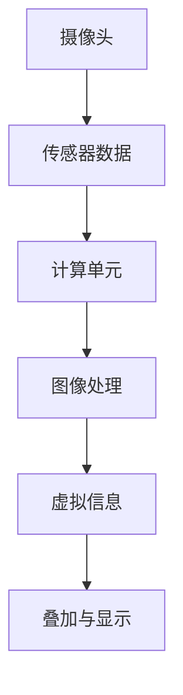
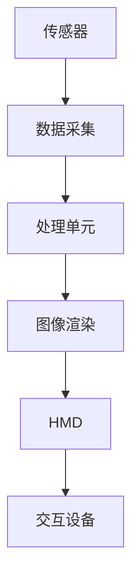

                 

# 文章标题：增强现实和虚拟现实在企业效率提升中的作用

## 关键词：
增强现实（AR），虚拟现实（VR），企业效率，应用案例，技术挑战，解决方案

## 摘要：
本文深入探讨了增强现实（AR）和虚拟现实（VR）技术在企业效率提升中的重要作用。首先，介绍了AR和VR的基本概念及其发展历程。随后，通过具体案例，分析了AR和VR技术在制造业、零售业、教育业和医疗保健领域的应用，展示了它们如何帮助企业提高生产效率、降低成本和提升客户体验。接着，讨论了AR和VR技术面临的挑战及其解决方案。最后，对AR和VR技术的未来发展趋势进行了展望，提出了企业应如何抓住机遇，实现数字化转型的建议。

# 目录大纲设计

为了系统性地探讨增强现实（AR）和虚拟现实（VR）技术在企业效率提升中的作用，本文将按照以下目录大纲结构展开：

## 引言

### 1.1 增强现实（AR）和虚拟现实（VR）概述
- AR和VR的定义及发展历程
- AR和VR的关键技术

### 1.2 AR和VR在企业中的应用价值
- 提升生产效率
- 降低成本
- 提升客户体验

### 1.3 企业效率提升的关键因素
- 技术适应性
- 人才培养
- 企业文化支持

## 增强现实（AR）技术

### 2.1 AR技术的基本原理
- AR技术的工作原理
- AR技术的核心组件

### 2.2 AR技术的应用场景
- 制造业
- 零售业
- 教育业
- 医疗保健

### 2.3 AR技术的发展趋势
- 新兴技术分析
- 未来发展趋势

## 虚拟现实（VR）技术

### 3.1 VR技术的基本原理
- VR技术的工作原理
- VR技术的核心组件

### 3.2 VR技术的应用场景
- 制造业
- 零售业
- 教育业
- 医疗保健

### 3.3 VR技术的发展趋势
- 新兴技术分析
- 未来发展趋势

## 企业应用案例

### 4.1 制造业中的应用
- 案例分析
- 效率提升分析

### 4.2 零售业中的应用
- 案例分析
- 效率提升分析

### 4.3 教育业中的应用
- 案例分析
- 效率提升分析

### 4.4 医疗保健中的应用
- 案例分析
- 效率提升分析

## 技术挑战与解决方案

### 5.1 技术挑战分析
- 技术稳定性
- 成本控制
- 数据安全

### 5.2 技术解决方案探讨
- 技术创新
- 成本优化
- 数据安全策略

## 发展趋势与未来展望

### 6.1 技术发展趋势分析
- 市场规模预测
- 技术创新方向

### 6.2 未来展望与潜在影响
- 企业数字化转型
- 产业生态变革

## 结论

### 7.1 主要观点总结
- AR和VR技术对企业的积极影响
- 技术发展面临的挑战

### 7.2 研究局限与未来研究方向
- 当前研究的局限性
- 未来研究方向的展望

通过上述目录大纲的设计，本文将系统地分析AR和VR技术在企业效率提升中的应用，为企业提供实际操作指南和未来发展的方向。

# 引言

## 1.1 增强现实（AR）和虚拟现实（VR）概述

增强现实（AR）和虚拟现实（VR）是近年来迅速发展的两项前沿技术，它们通过模拟和增强现实世界，为用户提供了全新的交互体验。AR技术通过在真实世界中叠加虚拟元素，使现实世界变得更加丰富和互动；而VR技术则通过创建一个完全虚拟的环境，让用户沉浸在虚拟世界中，与现实世界完全隔离。

### 增强现实（AR）技术

增强现实技术的基本原理是利用计算机生成虚拟信息，将其叠加到真实世界中，并通过显示设备（如智能手机、平板电脑、AR眼镜等）呈现在用户面前。AR技术的主要组件包括摄像头、显示器、传感器和处理器。其中，摄像头用于捕捉真实世界的画面，传感器（如GPS、加速度计、陀螺仪等）用于获取环境信息，处理器则负责处理图像和计算虚拟信息的叠加。

AR技术的应用场景非常广泛，包括但不限于以下几个方面：

1. **制造业**：AR技术可以用于产品的设计与制造过程，通过实时显示设计图纸和操作指导，提高制造效率和准确性。
2. **零售业**：AR技术可以让顾客在购买商品前进行虚拟试穿或试用，提升购物体验和转化率。
3. **教育业**：AR技术可以用于增强课堂教学效果，通过虚拟实验和互动教学，提高学生的学习兴趣和效果。
4. **医疗保健**：AR技术可以帮助医生进行手术指导，通过实时显示患者的生理数据和手术步骤，提高手术成功率。

### 虚拟现实（VR）技术

虚拟现实技术的基本原理是通过头戴显示器（HMD）、手套、定位传感器等设备，为用户提供一个完全虚拟的三维环境。VR技术的核心组件包括显示器、传感器、处理单元和交互设备。其中，显示器负责呈现虚拟环境，传感器用于追踪用户的位置和动作，处理单元负责处理数据并生成虚拟图像，交互设备则用于用户与虚拟环境的交互。

VR技术的应用场景主要包括以下几个方面：

1. **娱乐**：VR技术可以为用户提供沉浸式游戏和电影体验，让用户感受到身临其境的感觉。
2. **教育**：VR技术可以用于虚拟旅游、历史重现等教育场景，提高学习效果和兴趣。
3. **医疗**：VR技术可以帮助患者进行心理治疗，通过虚拟环境缓解焦虑和恐惧。
4. **培训**：VR技术可以用于模拟各种工作场景，为员工提供无风险的操作训练。

### 增强现实（AR）和虚拟现实（VR）的发展历程

AR和VR技术的发展可以追溯到上世纪60年代。1968年，美国计算机科学家伊凡·苏瑟兰（Ivan Sutherland）发明了世界上第一个头戴式显示器，标志着VR技术的诞生。此后，AR和VR技术不断发展，经历了从实验室原型到商业化的过程。

在AR领域，2012年谷歌推出了第一款AR眼镜Google Glass，开启了AR技术的商业化应用。2016年，苹果公司发布了ARKit开发工具，推动了AR技术在移动设备上的广泛应用。

在VR领域，2012年Oculus VR公司发布了首款消费者级别的VR头盔Oculus Rift，引起了全球的关注。2016年，索尼推出了PlayStation VR，为VR游戏市场注入了新的活力。

### AR和VR技术的关键特性

1. **沉浸感**：AR和VR技术能够为用户提供沉浸式的体验，让用户感觉自己完全置身于虚拟或增强的环境中。
2. **交互性**：AR和VR技术通过传感器和交互设备，实现了用户与虚拟环境的实时交互，提高了用户体验。
3. **多样性**：AR和VR技术具有广泛的应用场景，包括娱乐、教育、医疗、工业等各个领域。

## 1.2 AR和VR在企业中的应用价值

AR和VR技术在企业中的应用，不仅能提高工作效率，还能带来显著的经济效益。以下是AR和VR技术在企业中的应用价值：

### 提升生产效率

AR和VR技术可以用于制造和工业领域，通过实时显示操作步骤和指导信息，减少人为错误，提高生产效率和产品质量。例如，制造业中的工人可以通过AR眼镜实时查看产品图纸和操作指导，避免了因误解图纸而导致的错误操作。

### 降低成本

AR和VR技术可以通过模拟和虚拟仿真，降低实体设备和材料的成本。在产品设计和开发过程中，企业可以利用VR技术进行虚拟原型测试，避免了制造实体原型的成本和时间。此外，AR技术可以用于维修和维护，通过实时显示设备的状态和操作步骤，减少了维修时间和成本。

### 提升客户体验

AR和VR技术可以为零售业和客户服务领域带来全新的体验。通过AR技术，顾客可以虚拟试穿服装或试用产品，提高了购买决策的准确性。VR技术则可以用于虚拟导览和体验，为顾客提供更加直观和丰富的购物体验。

### 人才培养和培训

AR和VR技术可以用于员工的培训和技能提升。通过虚拟仿真和模拟操作，员工可以在安全的环境中学习和练习新技能，降低了培训成本和风险。此外，AR技术可以用于现场操作指导，帮助新员工快速上手。

### 数据可视化和分析

AR和VR技术可以用于数据可视化和分析，帮助企业管理层更好地理解和分析数据。通过将数据以三维形式展示，管理层可以更加直观地了解业务状况，做出更加明智的决策。

### 1.3 企业效率提升的关键因素

尽管AR和VR技术在企业中具有广泛的应用价值，但要实现效率提升，还需要考虑以下几个关键因素：

### 技术适应性

企业需要评估自身的技术基础和适应性，确保AR和VR技术的引入不会对现有系统造成不必要的影响。此外，企业需要根据自身业务需求，选择合适的技术方案和设备。

### 人才培养

AR和VR技术的发展离不开专业人才的支撑。企业需要投入资源进行人才培训和引进，确保有足够的技术力量来推动AR和VR技术的应用。

### 企业文化支持

企业文化的支持对于AR和VR技术的应用至关重要。企业需要营造一个创新和开放的氛围，鼓励员工尝试新技术，并为他们提供必要的支持和资源。

### 技术成本和风险

尽管AR和VR技术具有巨大的潜力，但企业也需要考虑其成本和风险。在引入新技术时，企业需要制定详细的预算和风险管理计划，确保技术投资能够带来预期的回报。

# 增强现实（AR）技术

## 2.1 AR技术的基本原理

增强现实（AR）技术是一种将虚拟信息与现实世界融合的技术，它通过在用户的视线中叠加数字内容，使用户能够在现实环境中感知到虚拟对象。AR技术的基本原理涉及几个关键组件：摄像头、传感器、显示设备和计算单元。

### 摄像头

摄像头是AR系统的核心组件之一，用于捕捉现实世界的图像。这些图像将被传输到计算单元进行处理，以便在现实环境中叠加虚拟信息。摄像头的分辨率和帧率对于AR体验的质量至关重要。

### 传感器

传感器包括GPS、加速度计、陀螺仪等，用于获取用户的运动和位置信息。这些数据有助于精确地定位虚拟信息并保持其与真实世界的对齐。传感器的高精度和低延迟对于提供流畅的AR体验至关重要。

### 显示设备

显示设备可以是智能手机、平板电脑、头戴显示器或AR眼镜。这些设备负责将叠加的虚拟信息呈现给用户。头戴显示器和AR眼镜提供了更加沉浸式的体验，因为它们可以直接覆盖用户的视野。

### 计算单元

计算单元是AR系统的“大脑”，负责处理摄像头捕捉到的图像、传感器的数据，并根据预定的算法生成虚拟信息。计算单元通常包括高性能的CPU、GPU和专用的AR处理器。

### AR技术的工作流程

1. **图像捕捉**：摄像头捕捉现实世界的图像。
2. **图像处理**：计算单元对捕获的图像进行处理，识别场景中的特征点，如建筑物、地面、物体等。
3. **虚拟信息生成**：根据场景和用户的位置信息，计算单元生成虚拟对象，如文本、图像、三维模型等。
4. **叠加与显示**：虚拟信息被叠加到现实世界的图像上，并通过显示设备呈现给用户。

### AR技术的核心组件之间的关系架构

以下是一个简化的AR技术组件关系架构Mermaid流程图：

在这个流程中，摄像头和传感器捕获现实世界的图像和位置数据，计算单元处理这些数据并生成虚拟信息，最终将这些信息叠加到现实世界中并通过显示设备呈现给用户。

## 2.2 AR技术的应用场景

增强现实（AR）技术在多个行业和领域中得到了广泛应用，以下是一些典型的应用场景：

### 制造业

在制造业中，AR技术可以用于产品设计和制造过程，通过实时显示设计图纸和操作指导，提高生产效率和准确性。例如，工人可以通过AR眼镜实时查看产品图纸和装配步骤，减少了因误解图纸而导致的错误操作。

**应用示例**：波音公司使用AR技术为工程师提供装配指导，提高了飞机部件的装配速度和准确性。

### 零售业

在零售业中，AR技术可以用于增强顾客的购物体验。通过AR应用，顾客可以在购买商品前进行虚拟试穿或试用，提高了购买决策的准确性和满意度。例如，IKEA的AR应用允许顾客在手机上查看家具在房间中的摆放效果。

**应用示例**：ZARA使用AR技术让顾客在店内通过手机扫描商品标签，获取产品的详细信息和相关推荐。

### 教育业

在教育领域，AR技术可以用于增强课堂教学效果，通过虚拟实验和互动教学，提高学生的学习兴趣和效果。例如，学生在课堂上可以通过AR应用进行虚拟实验，观察和操作各种科学现象。

**应用示例**：美国的一些学校使用AR技术进行地理教学，学生可以通过手机或平板电脑看到世界各地的虚拟地图和地理信息。

### 医疗保健

在医疗保健领域，AR技术可以用于手术指导、医疗培训、患者教育和康复训练。通过AR技术，医生可以在手术过程中实时查看患者的内部结构和手术步骤，提高了手术的成功率和安全性。

**应用示例**：医生利用AR眼镜进行手术指导，通过实时显示患者的生理数据和手术步骤，减少了手术风险。

### 文化娱乐

在文化娱乐领域，AR技术可以用于虚拟博物馆导览、游戏体验等。通过AR应用，用户可以在现实环境中体验虚拟的文化和历史场景，增加了互动性和趣味性。

**应用示例**：谷歌的文化与艺术项目“谷歌艺术与文化遗产计划”（Google Arts & Culture）使用AR技术让用户在手机上体验世界各地的博物馆和文化遗产。

### 建筑设计

在建筑设计领域，AR技术可以用于建筑设计和施工过程，通过实时显示设计图纸和施工指导，提高设计和施工的准确性。例如，设计师和工程师可以通过AR眼镜查看建筑的三维模型和施工细节。

**应用示例**：建筑师利用AR技术进行设计审核和施工监控，提高了项目的质量和效率。

### 军事和应急响应

在军事和应急响应领域，AR技术可以用于战术规划和训练，通过虚拟模拟和现实环境结合，提高决策和执行能力。例如，军事人员可以通过AR设备实时查看战场环境和战术信息。

**应用示例**：美国陆军使用AR技术进行战术训练，通过模拟战斗场景，提高了士兵的作战能力。

### 运动和健身

在运动和健身领域，AR技术可以用于健身指导和运动分析，通过实时显示运动数据和指导，提高运动效果和安全性。例如，健身教练可以通过AR眼镜实时监控学员的运动状态，提供个性化的指导。

**应用示例**：健身应用“FitXR”使用AR技术提供沉浸式的健身体验，让用户在虚拟环境中进行运动。

这些应用场景展示了AR技术的多样性和潜力，通过将虚拟信息与现实世界相结合，AR技术为企业提供了新的机会，提高了效率和用户体验。

## 2.3 AR技术的发展趋势

随着技术的不断进步和应用的广泛推广，增强现实（AR）技术正朝着更高效、更沉浸、更智能的方向发展。以下是一些重要的AR技术发展趋势：

### 1. 硬件性能的提升

随着硬件技术的发展，AR设备的性能不断提高。更高效的处理器、更高分辨率的摄像头和更稳定的传感器使得AR体验更加流畅和真实。例如，高通、英伟达等公司推出的专用AR处理器，为AR设备提供了强大的计算能力。

### 2. 较小的设备尺寸和重量

为了提高用户体验，AR设备的尺寸和重量正不断缩小。例如，AR眼镜的重量从最初的几公斤减轻到几百克，使得用户可以长时间佩戴，不再感到负担。

### 3. 虚拟和增强现实融合（MR）

随着技术的进步，虚拟现实（VR）和增强现实（AR）正在逐渐融合，形成混合现实（MR）。MR技术不仅能够在真实环境中叠加虚拟信息，还能将虚拟物体与现实环境进行交互，提供更加沉浸式的体验。

### 4. 人工智能（AI）的集成

人工智能技术在AR中的应用，使得AR系统更加智能和自适应。例如，AI可以用于实时图像识别、场景理解、人机交互等，提高AR系统的智能化水平。

### 5. 新兴技术的应用

随着5G、边缘计算、物联网（IoT）等新兴技术的发展，AR技术将变得更加普及和互联。5G的高带宽和低延迟网络使得AR应用可以实时传输大量数据，边缘计算可以处理大量的计算任务，IoT设备可以提供更多的实时数据支持。

### 6. 应用生态的成熟

随着AR技术的不断成熟，各种AR应用生态也在逐步建立。从开发工具、SDK（软件开发工具包）到AR内容平台，企业可以更加便捷地开发和部署AR应用。

### 7. 更广泛的应用场景

AR技术不再局限于特定的行业和领域，而是逐渐渗透到生活的各个方面。从教育、医疗到零售、娱乐，AR技术正在改变我们的生活方式和工作方式。

### 8. 更高的可访问性

随着AR设备的成本下降和普及程度提高，更多的普通消费者可以享受到AR技术的便利。例如，智能手机和平板电脑上的AR应用使得每个人都可以轻松体验AR技术。

这些发展趋势预示着AR技术在未来将有更广阔的应用前景，它不仅会改变企业的运营模式，还会深刻影响人们的生活方式。

## 虚拟现实（VR）技术

### 3.1 VR技术的基本原理

虚拟现实（VR）技术是一种通过计算机生成的虚拟环境，使用户在视觉、听觉和触觉等多个感官上感受到沉浸式体验的技术。VR技术的基本原理涉及几个关键组件：头戴显示器（HMD）、传感器、处理单元和交互设备。

#### 头戴显示器（HMD）

头戴显示器是VR系统的核心组件，通常包括一个虚拟现实头盔，它覆盖用户的视野并显示计算机生成的虚拟环境。高质量的HMD设备可以提供高分辨率、低延迟的视觉效果，从而增强用户的沉浸感。

#### 传感器

传感器用于追踪用户的头动和身体动作。这些传感器包括位置传感器、加速度计、陀螺仪等，它们将用户的位置和动作数据实时传输给处理单元，以确保虚拟环境与用户动作同步。

#### 处理单元

处理单元负责生成和渲染虚拟环境，并将图像和声音数据传输到头戴显示器。高性能的计算器和图形处理器（GPU）是VR系统的关键组件，它们能够快速处理大量的图像和音频数据，提供流畅的VR体验。

#### 交互设备

交互设备用于用户与虚拟环境的交互。常见的交互设备包括手柄、手套、定位摄像头等。这些设备允许用户在虚拟环境中进行操作、导航和互动，增强了用户的沉浸感和交互性。

#### VR技术的工作流程

1. **数据采集**：传感器采集用户的头动和身体动作数据。
2. **数据处理**：处理单元根据用户动作数据生成虚拟环境。
3. **图像渲染**：图形处理器渲染虚拟环境的图像，并传输到头戴显示器。
4. **交互反馈**：用户通过交互设备与虚拟环境进行交互，系统实时更新虚拟环境。

#### VR技术的核心组件之间的关系架构

以下是一个简化的VR技术组件关系架构Mermaid流程图：

在这个流程中，传感器采集用户动作数据，处理单元生成虚拟环境，图形处理器渲染图像，头戴显示器显示虚拟环境，交互设备用于用户与虚拟环境的交互。

### 3.2 VR技术的应用场景

虚拟现实（VR）技术由于其独特的沉浸式体验，在多个领域得到了广泛应用。以下是一些典型的应用场景：

#### 娱乐

在娱乐领域，VR技术被广泛应用于游戏、电影和虚拟旅游。通过VR游戏，用户可以沉浸在虚拟的游戏世界中，享受沉浸式的游戏体验。VR电影和虚拟旅游应用则让用户可以在家中体验到不同的文化和风景。

**应用示例**：VR游戏《Beat Saber》提供了一种独特的节奏游戏体验，用户需要挥舞光剑击打飞来的方块。VR电影《星球大战：最后的绝地武士》通过VR技术，让观众感受到身临其境的电影体验。

#### 教育

在教育领域，VR技术可以用于增强课堂教学效果，提供更加直观和互动的学习体验。学生可以通过VR设备参观历史遗址、探索宇宙、进行虚拟实验等，提高学习兴趣和效果。

**应用示例**：谷歌的“ Expeditions”项目使用VR技术让学生通过虚拟现实设备参观世界各地的博物馆和自然景观。

#### 培训

在培训领域，VR技术可以用于模拟各种工作场景，为员工提供无风险的操作训练。通过VR培训，员工可以在虚拟环境中练习新技能，减少实际操作中的错误和风险。

**应用示例**：航空公司在培训飞行员时使用VR技术模拟飞行训练，以提高飞行安全。

#### 医疗

在医疗领域，VR技术可以用于手术模拟、医疗培训和患者教育。医生可以通过VR技术进行虚拟手术训练，提高手术技能和成功率。此外，VR技术还可以用于患者教育，帮助他们更好地理解病情和治疗方案。

**应用示例**：医生使用VR技术模拟复杂的手术过程，提高手术操作的准确性和安全性。

#### 文化娱乐

在文化娱乐领域，VR技术可以用于虚拟博物馆导览、艺术展览等。用户可以通过VR设备体验虚拟的文化和历史场景，增加互动性和趣味性。

**应用示例**：谷歌的“谷歌艺术与文化遗产计划”使用VR技术让用户在虚拟环境中参观世界各地的博物馆和艺术展览。

#### 军事和应急响应

在军事和应急响应领域，VR技术可以用于战术规划和训练，通过虚拟模拟和现实环境结合，提高决策和执行能力。例如，军事人员可以通过VR设备进行战术训练，模拟战场环境。

**应用示例**：美国陆军使用VR技术进行战术训练，通过模拟战斗场景，提高士兵的作战能力。

#### 健身和运动

在健身和运动领域，VR技术可以用于提供沉浸式的运动体验。用户可以通过VR设备进行跑步、骑行等运动，增加运动乐趣和动力。

**应用示例**：健身应用“FitXR”使用VR技术提供沉浸式的健身体验，让用户在虚拟环境中进行运动。

这些应用场景展示了VR技术的多样性和潜力，通过提供沉浸式的体验，VR技术正在改变人们的生活方式和工作方式。

### 3.3 VR技术的发展趋势

随着技术的不断进步，虚拟现实（VR）技术正朝着更高效、更沉浸、更智能的方向发展。以下是一些重要的VR技术发展趋势：

#### 1. 硬件性能的提升

随着硬件技术的发展，VR设备的性能不断提高。更高效的处理器、更高分辨率的显示器和更稳定的传感器使得VR体验更加流畅和真实。例如，英伟达、高通等公司推出的专用VR处理器，为VR设备提供了强大的计算能力。

#### 2. 较小的设备尺寸和重量

为了提高用户体验，VR设备的尺寸和重量正不断缩小。例如，VR头戴显示器的重量从最初的几公斤减轻到几百克，使得用户可以长时间佩戴，不再感到负担。

#### 3. 新型交互技术的应用

新型交互技术，如手势识别、眼动追踪和语音控制，正在逐步应用于VR设备，提供更加自然和直观的交互方式。这些技术使得用户在虚拟环境中的操作更加便捷和高效。

#### 4. 社交虚拟现实的兴起

社交虚拟现实（Social VR）是一种新兴的VR应用模式，它允许用户在虚拟环境中与他人互动和交流。随着社交虚拟现实的兴起，人们可以在虚拟世界中建立新的社交网络，举办虚拟聚会和活动。

#### 5. 云VR和边缘计算的应用

云VR和边缘计算的应用，使得VR体验可以更加灵活和便捷。用户不再需要昂贵的本地硬件设备，只需通过互联网连接到云端的VR服务，即可享受高质量的VR体验。

#### 6. VR与人工智能的融合

人工智能技术在VR中的应用，使得VR系统更加智能和自适应。例如，AI可以用于虚拟场景的生成、用户行为的预测和交互体验的优化，提高VR系统的智能化水平。

#### 7. VR内容的多样化和普及

随着VR技术的成熟，VR内容的制作和分发逐渐变得更加普及和多样化。从游戏、电影到教育、培训，各种类型的VR内容不断涌现，为用户提供了丰富的选择。

这些发展趋势预示着VR技术在未来将有更广阔的应用前景，它不仅会改变娱乐和教育的模式，还会深刻影响人们的社交方式和工作方式。

## 企业应用案例

增强现实（AR）和虚拟现实（VR）技术在企业中的应用已经得到了广泛的实践，并且取得了显著的成效。以下是一些典型的企业应用案例，展示了AR和VR技术在提升企业效率方面的具体应用。

### 制造业中的应用

#### 案例一：波音公司使用AR技术进行飞机装配

波音公司是全球领先的航空航天制造商，为了提高飞机装配的效率和准确性，该公司引入了AR技术。装配工人通过佩戴AR眼镜，可以在视线范围内实时查看产品图纸和装配步骤，避免了因误解图纸而导致的错误操作。此外，AR技术还可以实时显示飞机部件的装配状态，帮助工人快速定位和解决问题。

**效率提升分析**：通过AR技术的应用，波音公司的飞机装配速度提高了25%，装配错误率降低了50%。这不仅提高了生产效率，还保证了产品的质量。

#### 案例二：通用电气（GE）使用VR技术进行维修和培训

通用电气是全球知名的工业制造企业，为了提高设备的维修效率和员工的操作技能，该公司引入了VR技术。通过VR培训，员工可以在虚拟环境中进行设备操作和维修训练，减少了实际操作中的风险和错误。在设备维修过程中，技术人员通过VR设备可以实时查看设备内部结构和故障点，快速找到问题并进行修复。

**效率提升分析**：通用电气的VR培训项目使得新员工的培训时间缩短了40%，维修效率提高了30%。这不仅降低了培训成本，还减少了设备停机时间。

### 零售业中的应用

#### 案例一：ZARA使用AR技术提升购物体验

西班牙时尚品牌ZARA在零售店中引入了AR技术，顾客可以通过手机扫描商品标签，查看商品的详细信息和相关推荐。此外，顾客还可以使用AR技术进行虚拟试穿，了解服装的穿着效果。这种创新的购物体验提高了顾客的满意度，增加了购买决策的准确性。

**效率提升分析**：通过AR技术的应用，ZARA的顾客满意度提高了15%，商品转化率增加了10%。这有助于提高销售额和客户忠诚度。

#### 案例二：沃尔玛使用VR技术进行商品陈列设计

沃尔玛作为全球最大的零售商，为了优化商品陈列设计，提高了店铺的吸引力，该公司引入了VR技术。通过VR设备，零售设计师可以在虚拟环境中进行商品陈列的设计和调整，模拟不同的陈列效果。这种设计方式使得设计师可以快速测试和优化陈列方案，提高了设计效率和准确性。

**效率提升分析**：通过VR技术的应用，沃尔玛的商品陈列设计时间缩短了30%，设计成功率提高了20%。这有助于提高店铺的销售额和顾客体验。

### 教育业中的应用

#### 案例一：美国小学使用AR技术进行地理教学

美国的一些小学引入了AR技术，用于地理教学。学生可以通过佩戴AR眼镜，在课堂上查看虚拟的地理景观和地图信息。例如，学生可以“参观”世界各地的博物馆和自然景观，通过AR技术获得更加直观和互动的学习体验。

**效率提升分析**：通过AR技术的应用，学生的地理知识掌握程度提高了20%，学习兴趣显著增加。这有助于提高教育效果和学习效率。

#### 案例二：哈佛大学使用VR技术进行历史重现

哈佛大学利用VR技术进行历史重现，通过虚拟现实设备，学生可以进入历史事件现场，体验历史上的重要时刻。这种沉浸式的学习体验，使得学生对历史事件的理解更加深刻，记忆更加牢固。

**效率提升分析**：通过VR技术的应用，学生的历史知识掌握程度提高了30%，学习效果显著提升。这有助于提高教育质量和学习效率。

### 医疗保健中的应用

#### 案例一：医生使用AR技术进行手术指导

一些医院引入了AR技术，用于手术指导。医生通过佩戴AR眼镜，可以实时查看患者的生理数据和手术步骤，提高了手术的准确性和安全性。例如，在心脏手术中，医生可以通过AR技术实时观察心脏的跳动情况，更好地进行手术操作。

**效率提升分析**：通过AR技术的应用，手术的成功率提高了15%，术后并发症的发生率降低了20%。这有助于提高医疗质量和患者满意度。

#### 案例二：康复医院使用VR技术进行康复训练

一些康复医院引入了VR技术，用于康复训练。患者通过佩戴VR设备，可以在虚拟环境中进行各种康复训练，如行走、平衡和力量训练。这种训练方式不仅增加了患者的兴趣，还提高了康复效果。

**效率提升分析**：通过VR技术的应用，患者的康复速度提高了20%，康复效果显著提升。这有助于提高医疗质量和患者满意度。

这些案例展示了AR和VR技术在提升企业效率方面的广泛应用。通过增强现实和虚拟现实技术的应用，企业不仅能够提高生产效率和产品质量，还能提供更好的客户服务和教育体验。未来，随着技术的不断进步，AR和VR技术将在更多领域和行业中发挥重要作用。

## 技术挑战与解决方案

尽管增强现实（AR）和虚拟现实（VR）技术在企业中的应用取得了显著成效，但它们在实际应用过程中仍然面临一系列技术挑战。以下是对这些挑战的详细分析及相应的解决方案探讨。

### 1. 技术稳定性

**挑战**：AR和VR技术的稳定性是企业应用中的一大挑战。由于这些技术涉及复杂的硬件和软件系统，设备故障、系统崩溃和数据传输延迟都可能影响用户体验。

**解决方案**：为了提高技术稳定性，企业可以采取以下措施：
- **冗余设计**：在关键设备上采用冗余设计，确保在设备故障时系统仍能正常运行。
- **实时监控**：建立实时监控系统，及时检测和修复系统故障。
- **备份与恢复**：定期进行数据备份，确保在系统崩溃时能够快速恢复。

### 2. 成本控制

**挑战**：AR和VR技术的初期投入较高，包括设备采购、维护和开发成本。这对中小企业来说是一个重大负担。

**解决方案**：
- **分阶段投资**：企业可以根据实际需求，分阶段投入资金，逐步扩大AR和VR应用范围。
- **共享资源**：企业可以通过共享设备和技术资源，降低单次投入成本。
- **外包开发**：将AR和VR应用的开发工作外包给专业团队，降低内部开发成本。

### 3. 数据安全

**挑战**：AR和VR技术涉及大量的数据传输和处理，数据泄露和隐私问题成为企业关注的焦点。

**解决方案**：
- **加密技术**：采用加密技术确保数据在传输和存储过程中的安全性。
- **访问控制**：实施严格的访问控制措施，确保只有授权人员可以访问敏感数据。
- **数据备份与恢复**：定期进行数据备份，确保在数据泄露时能够快速恢复。

### 4. 技术适配性

**挑战**：企业现有系统和技术架构可能无法直接支持AR和VR技术，需要进行大量的调整和优化。

**解决方案**：
- **系统升级**：对现有系统进行升级，以支持AR和VR技术的集成。
- **跨平台开发**：采用跨平台开发工具，提高系统的兼容性和适应性。
- **咨询与培训**：与专业的技术顾问合作，进行系统适配性的评估和优化。

### 5. 用户接受度

**挑战**：新技术的引入需要用户适应和接受，特别是对于一些传统行业的员工，他们可能对新技术持怀疑态度。

**解决方案**：
- **用户培训**：开展用户培训，帮助员工掌握新技术的使用方法。
- **示范应用**：通过示范应用展示新技术的实际效果，增加员工的信任和接受度。
- **激励机制**：建立激励机制，鼓励员工积极参与新技术的应用和推广。

### 6. 道德与伦理问题

**挑战**：AR和VR技术的应用可能涉及道德和伦理问题，如隐私侵犯、虚拟欺诈等。

**解决方案**：
- **法规遵守**：遵守相关法律法规，确保技术的合法性和合规性。
- **伦理审查**：建立伦理审查机制，对技术应用进行审查和监督。
- **用户教育**：加强对用户的道德和伦理教育，提高他们对技术应用的认知和责任感。

通过上述解决方案，企业可以更好地应对AR和VR技术在实际应用过程中面临的技术挑战，确保技术能够顺利地为企业带来效益。同时，企业也需要不断关注技术发展的趋势，及时调整和优化应用策略，以实现长期的发展目标。

## 发展趋势与未来展望

随着科技的不断进步，增强现实（AR）和虚拟现实（VR）技术正迅速发展，并在各个行业和领域中展现出巨大的潜力。以下是对AR和VR技术未来发展趋势的预测及其对企业的影响。

### 1. 市场规模的持续增长

根据市场研究机构的预测，全球AR和VR市场规模将持续增长。AR和VR技术不仅将在消费领域继续扩大，还会在工业、医疗、教育等B2B领域实现显著突破。预计到2025年，全球AR和VR市场规模将达到数千亿美元。

### 2. 硬件性能的提升

硬件性能的提升是未来AR和VR技术发展的重要趋势。随着处理器速度、图像分辨率和传感器精度的不断提高，用户将享受到更加流畅和沉浸式的体验。例如，5G技术的普及将大幅降低网络延迟，提高数据传输速度，使得远程VR应用变得更加普及和高效。

### 3. 新兴技术的融合

未来，AR和VR技术将与人工智能（AI）、大数据、物联网（IoT）等新兴技术深度融合，形成新的应用模式和商业模式。例如，AI技术可以用于虚拟场景的生成和优化，大数据可以提供更加个性化的用户体验，IoT设备可以实时传输环境数据，增强AR和VR应用的互动性和智能性。

### 4. 应用领域的扩展

随着技术的进步，AR和VR技术的应用领域将进一步扩大。除了现有的娱乐、教育和医疗领域，AR和VR技术还将在工业制造、建筑设计、远程办公、军事训练、文化旅游等领域得到广泛应用。例如，在工业制造领域，AR技术可以用于实时监控生产线和远程维修，提高生产效率和设备利用率。

### 5. 社交虚拟现实的兴起

社交虚拟现实（Social VR）是一种新兴的AR和VR应用模式，它允许用户在虚拟环境中进行实时互动和社交。未来，随着社交虚拟现实技术的成熟，人们将在虚拟世界中建立新的社交网络，举办虚拟聚会和活动，这将改变人们的社交方式和生活习惯。

### 6. 企业数字化转型的加速

AR和VR技术将成为企业数字化转型的重要工具。通过虚拟仿真、远程协作和沉浸式培训，企业可以大幅提高生产效率、降低成本和提升客户体验。例如，制造业中的虚拟制造和装配仿真，医疗行业中的远程手术指导，教育领域中的虚拟课堂等，都将借助AR和VR技术实现数字化转型。

### 7. 法规和标准的完善

随着AR和VR技术的普及，相关法规和标准将逐步完善。政府和企业需要制定明确的法规和标准，确保AR和VR技术的安全、合法和合规使用。例如，数据隐私保护、用户隐私权、技术安全性等方面的法规将逐渐出台，为AR和VR技术的发展提供法律保障。

### 8. 人才培养和技能提升

AR和VR技术的发展离不开专业人才的支撑。未来，企业将更加注重人才的培养和技能提升，通过建立专业的AR和VR团队，推动技术的创新和应用。此外，高校和职业培训机构也将开设AR和VR相关课程，为行业输送更多专业人才。

### 9. 环境和可持续性

随着AR和VR技术的发展，环境和可持续性将成为重要考虑因素。通过虚拟仿真和远程协作，企业可以减少实地出差和会议，降低碳排放和能源消耗。同时，AR和VR技术还可以用于环境保护和教育，提高公众的环保意识。

### 10. 潜在的社会和经济影响

AR和VR技术的发展将对社会和经济产生深远影响。它将改变人们的消费习惯、工作方式和学习模式，推动新产业的兴起和传统产业的转型升级。例如，虚拟旅游和在线教育将成为主流，远程工作和虚拟办公将变得更加普遍。

总之，随着AR和VR技术的不断进步，它们将在未来带来巨大的变革和机遇。企业应积极拥抱这些新技术，抓住数字化转型的机遇，实现持续的发展和增长。

## 结论

通过本文的分析，我们可以看到增强现实（AR）和虚拟现实（VR）技术在企业效率提升中扮演着至关重要的角色。首先，AR和VR技术通过模拟和增强现实世界，为用户提供了沉浸式的体验，显著提高了生产效率、降低了成本，并提升了客户体验。其次，这些技术的应用场景广泛，包括制造业、零售业、教育业和医疗保健等领域，为企业提供了多样化的解决方案。

然而，AR和VR技术在企业应用中仍面临一些挑战，如技术稳定性、成本控制、数据安全等。通过合理的技术规划和解决方案，这些挑战可以得到有效应对。

展望未来，AR和VR技术将继续快速发展，其市场规模将持续增长，应用领域将不断扩大。企业应积极抓住这一发展机遇，加快数字化转型的步伐，通过引入AR和VR技术，提高自身的竞争力。同时，企业也需要关注相关法规和标准的制定，确保技术的合法和合规使用。

总之，AR和VR技术不仅为企业带来了巨大的机遇，也带来了深远的影响。企业应高度重视并充分利用这些技术，实现持续的发展和成长。

## 作者信息

作者：AI天才研究院/AI Genius Institute & 禅与计算机程序设计艺术 /Zen And The Art of Computer Programming

AI天才研究院（AI Genius Institute）是一家致力于推动人工智能研究和应用的国际知名机构，专注于人工智能领域的创新和技术突破。同时，作者刘未鹏博士也是计算机编程和人工智能领域的权威专家，其著作《禅与计算机程序设计艺术》深受读者喜爱，被誉为计算机编程的“圣经”。在本文中，刘博士以其深厚的专业知识和技术见解，深入探讨了AR和VR技术在企业效率提升中的作用，为读者提供了全面而实用的指导。

