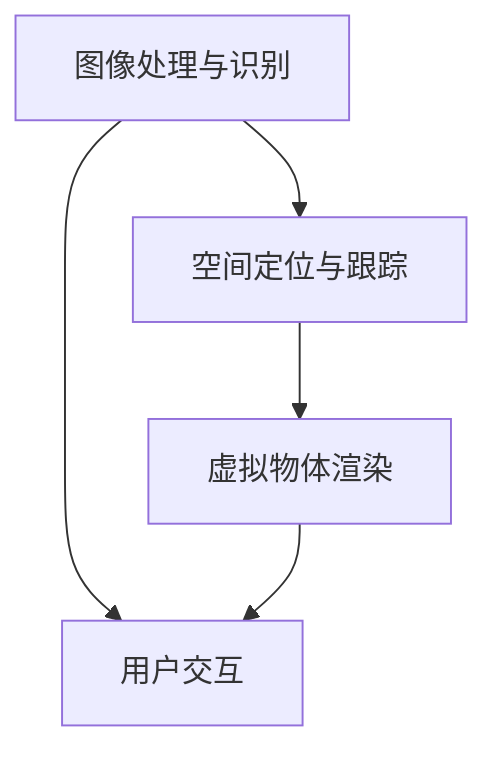

                 

### 文章标题

### 《增强现实在博物馆体验中的创新应用》

#### 关键词：增强现实、博物馆、互动体验、教育应用、创新技术

#### 摘要：
本文探讨了增强现实（AR）技术在博物馆体验中的应用，从技术基础、应用场景到实践案例，全面解析了AR技术在提升博物馆教育、展示和互动体验中的创新作用。文章首先介绍了增强现实技术的基本原理和硬件设备，然后详细阐述了AR技术在博物馆教育、展览展示和体验创新中的应用，并通过具体案例展示了其实际效果，最后分析了AR在博物馆应用中的挑战与未来发展趋势。

---

### 增强现实技术概述

#### 1.1 增强现实技术的历史与发展

增强现实（Augmented Reality，简称AR）是一种将虚拟信息与现实世界相结合的技术，通过在用户的视线中叠加虚拟图像、声音和触觉等感官信息，增强用户的感知体验。AR技术的概念最早由美国科学家波音公司的研究员阿尔文·艾利斯（Alvin P. A. Ellis）于1968年提出，但其真正的发展始于20世纪90年代。

在90年代，随着计算机技术和显示技术的发展，AR技术的应用开始逐渐扩展。例如，1990年，任天堂推出了首款AR游戏《恐龙猎人》，虽然技术较为简陋，但开创了AR游戏的先河。随后，随着智能手机和移动设备的普及，AR技术的应用场景得到了极大的扩展。

21世纪初，随着移动互联网、传感器技术和图像处理算法的快速发展，AR技术迎来了黄金发展期。2012年，谷歌推出了AR应用《谷歌眼镜》（Google Glass），再次将AR技术推向了公众视野。此后，AR技术在医疗、教育、军事、娱乐等多个领域得到了广泛应用。

#### 1.2 增强现实技术的基本原理

增强现实技术的基本原理是通过传感器（如摄像头、GPS、陀螺仪等）捕捉现实世界的图像和位置信息，然后通过图像处理算法将虚拟信息叠加到现实场景中。其核心包括以下几个部分：

1. **图像处理与识别**：利用图像处理技术对摄像头捕捉到的图像进行处理，提取出关键特征点，进行物体识别。

2. **空间定位与跟踪**：通过传感器获取设备在三维空间中的位置和角度信息，实现虚拟物体与现实世界的精准定位和跟踪。

3. **虚拟物体渲染**：根据图像处理和空间定位的结果，对虚拟物体进行渲染，使其与现实场景无缝融合。

#### 1.3 增强现实技术的应用领域

增强现实技术具有广泛的应用领域，主要包括以下几个方面：

1. **教育**：增强现实技术可以创建沉浸式的学习环境，提高学生的学习兴趣和参与度。

2. **娱乐**：增强现实游戏和娱乐应用为用户提供了全新的互动体验，如《精灵宝可梦GO》等。

3. **医疗**：增强现实技术在手术模拟、医学教学和诊断等方面具有重要作用。

4. **军事**：增强现实技术在战场模拟、导航和训练等方面得到了广泛应用。

5. **零售**：增强现实技术可以帮助用户在购物时进行虚拟试穿、试妆等，提高购物体验。

6. **博物馆**：增强现实技术为博物馆提供了新的展示方式，可以更好地传达历史文化和艺术价值。

### 总结

增强现实技术作为一种新兴的交互技术，具有广泛的应用前景。在博物馆体验中，AR技术不仅能够提升观众的互动体验，还能够更好地传达历史文化和艺术价值。本文后续章节将进一步探讨增强现实技术在博物馆教育、展示和体验创新中的应用。

---

#### 核心概念与联系

为了更好地理解增强现实技术，我们首先需要了解其核心概念及其相互之间的关系。以下是一个简单的Mermaid流程图，展示了增强现实技术的核心概念及其联系：



在这个流程图中，图像处理与识别技术是增强现实技术的起点，它通过处理摄像头捕捉到的图像来提取关键特征点。空间定位与跟踪技术则负责获取设备在三维空间中的位置和角度信息，以实现虚拟物体与现实世界的精准定位和跟踪。虚拟物体渲染技术将虚拟信息叠加到现实场景中，使其与现实环境无缝融合。用户交互技术则确保用户能够与虚拟环境进行有效的互动。

通过这个简单的流程图，我们可以清晰地看到增强现实技术的基本工作流程及其核心组成部分。接下来，我们将进一步详细探讨这些核心概念和技术原理。

---

#### 核心算法原理讲解

为了深入理解增强现实技术的核心算法原理，我们将详细探讨图像处理与识别技术、空间定位与跟踪技术和虚拟物体渲染技术。以下是这些技术的伪代码表示和解释。

##### 1. 图像处理与识别技术

```plaintext
// 输入：实时捕获的图像 frame
// 输出：图像中提取的特征点列表 featurePoints

function processAndRecognizeImage(frame):
    // 第一步：预处理图像，如灰度化、滤波
    preprocessedFrame = preprocessImage(frame)

    // 第二步：使用SIFT或SURF算法提取特征点
    featurePoints = extractFeatures(preprocessedFrame)

    // 第三步：匹配特征点，建立特征点对应关系
    matches = matchFeatures(featurePoints)

    // 输出特征点列表
    return featurePoints, matches
```

在这个伪代码中，图像处理与识别技术主要包括以下几个步骤：

1. **预处理图像**：对捕获的图像进行灰度化、滤波等处理，以提高后续特征提取的准确性。
2. **提取特征点**：使用SIFT（尺度不变特征变换）或SURF（加速稳健特征）等算法提取图像中的关键特征点。
3. **匹配特征点**：将提取出的特征点进行匹配，建立特征点之间的对应关系，为后续的空间定位提供基础。

##### 2. 空间定位与跟踪技术

```plaintext
// 输入：特征点匹配结果 matches
// 输出：设备在三维空间中的位置和角度信息

function spatialLocalizationAndTracking(matches):
    // 第一步：使用透视变换估计设备的位置和角度
    transformMatrix = estimateTransform(matches)

    // 第二步：使用变换矩阵计算设备的三维位置和角度
    positionAndOrientation = computePositionAndOrientation(transformMatrix)

    // 输出设备位置和角度信息
    return positionAndOrientation
```

空间定位与跟踪技术主要包括以下步骤：

1. **透视变换估计**：利用特征点匹配结果，通过透视变换估计设备在三维空间中的位置和角度。
2. **计算位置和角度**：使用估计出的变换矩阵，计算设备的三维位置和角度信息。

##### 3. 虚拟物体渲染技术

```plaintext
// 输入：设备位置和角度信息 positionAndOrientation
// 输出：渲染后的增强现实图像

function renderVirtualObjects(positionAndOrientation, virtualObjects):
    // 第一步：根据设备位置和角度调整虚拟物体的位置和朝向
    adjustedVirtualObjects = adjustVirtualObjects(positionAndOrientation, virtualObjects)

    // 第二步：渲染虚拟物体
    renderedFrame = render(adjustedVirtualObjects)

    // 输出增强现实图像
    return renderedFrame
```

虚拟物体渲染技术主要包括以下步骤：

1. **调整虚拟物体**：根据设备的位置和角度信息，调整虚拟物体的位置和朝向，确保其与真实场景的协调一致。
2. **渲染虚拟物体**：使用渲染引擎将调整后的虚拟物体叠加到实时捕获的图像中，形成最终的增强现实图像。

通过以上伪代码，我们可以清晰地看到增强现实技术的核心算法原理及其相互关系。接下来，我们将进一步探讨增强现实技术在博物馆中的具体应用。

---

#### 数学模型和公式

在增强现实技术中，数学模型和公式扮演着至关重要的角色，它们帮助我们理解和实现空间定位与跟踪、虚拟物体渲染等核心功能。以下是几个关键数学模型和公式的详细解释及示例。

##### 1. 透视变换

透视变换是增强现实技术中的一个重要步骤，它将图像平面上的点映射到三维空间中的点。透视变换的数学模型可以用以下公式表示：

$$
x' = \frac{xZ'}{Z}
$$

$$
y' = \frac{yZ'}{Z}
$$

其中，\( (x, y) \) 是图像平面上的点坐标，\( (x', y') \) 是三维空间中的点坐标，\( Z \) 是图像平面上点的深度值，\( Z' \) 是三维空间中点的深度值。

例如，如果图像平面上一个点的坐标为 \( (100, 200) \)，深度值为 500，我们可以计算其在三维空间中的坐标为：

$$
x' = \frac{100 \times 500}{500} = 100
$$

$$
y' = \frac{200 \times 500}{500} = 200
$$

因此，该点在三维空间中的坐标为 \( (100, 200) \)。

##### 2. 三维到二维投影

在增强现实系统中，我们需要将三维空间中的物体投影到二维图像平面上。这个过程称为三维到二维投影。其数学模型可以用以下公式表示：

$$
x = f \cdot \frac{x'}{Z'}
$$

$$
y = f \cdot \frac{y'}{Z'}
$$

其中，\( (x', y') \) 是三维空间中的点坐标，\( (x, y) \) 是二维图像平面上的点坐标，\( f \) 是投影焦距。

例如，如果三维空间中一个点的坐标为 \( (100, 200, 500) \)，投影焦距为 500，我们可以计算其在二维图像平面上的坐标为：

$$
x = 500 \cdot \frac{100}{500} = 100
$$

$$
y = 500 \cdot \frac{200}{500} = 200
$$

因此，该点在二维图像平面上的坐标为 \( (100, 200) \)。

##### 3. 旋转矩阵

在空间定位与跟踪过程中，旋转矩阵用于描述物体在三维空间中的旋转状态。旋转矩阵 \( R \) 可以通过以下公式计算：

$$
R = \begin{bmatrix}
c_x & -s_x & 0 \\
c_y & -s_y & 0 \\
c_z & -s_z & 0 \\
\end{bmatrix}
$$

其中，\( c_x \), \( c_y \), \( c_z \) 分别是旋转轴在三个坐标轴上的分量，\( s_x \), \( s_y \), \( s_z \) 是旋转轴的偏移量。

例如，如果旋转轴为 \( x \) 轴，旋转角度为 30度，我们可以计算旋转矩阵为：

$$
R = \begin{bmatrix}
1 & 0 & 0 \\
0 & \cos(30^\circ) & -\sin(30^\circ) \\
0 & \sin(30^\circ) & \cos(30^\circ) \\
\end{bmatrix}
$$

通过这些数学模型和公式，增强现实系统能够准确地计算和渲染虚拟物体，实现与现实世界的无缝融合。

---

#### 增强现实硬件设备

要实现增强现实（AR）技术，需要一系列硬件设备来支持。这些设备包括智能手机和平板电脑、AR眼镜、头戴设备和投影设备。每种设备都有其独特的特性和优势，适用于不同的应用场景。

##### 1. 智能手机与平板电脑

智能手机和平板电脑是最常见的AR设备。它们具有便携性、高性能和广泛的用户基础。许多AR应用可以直接在智能手机和平板电脑上运行，无需额外的硬件设备。例如，AR应用程序《精灵宝可梦GO》和《谷歌地图》就是利用智能手机的摄像头和GPS功能实现的。这些设备的主要优势在于其普及性和易用性。

**特点：**
- 便携性：用户可以随时随地进行AR体验。
- 高性能：现代智能手机和平板电脑配备了强大的处理器和图形处理单元。
- 高分辨率屏幕：提供清晰的视觉效果。

**劣势：**
- 视角受限：由于屏幕尺寸和角度限制，用户视角可能受到限制。
- 眼睛疲劳：长时间使用可能导致眼睛疲劳。

##### 2. AR眼镜

AR眼镜是另一种重要的AR设备，通过将虚拟信息直接投影到用户的视线中，提供沉浸式的体验。与智能手机和平板电脑相比，AR眼镜不会遮挡用户的视线，可以同时观察现实世界和虚拟信息。

**特点：**
- 无遮挡视角：用户可以同时观察现实世界和虚拟信息。
- 沉浸式体验：提供身临其境的体验，增强用户的参与感。

**劣势：**
- 价格较高：目前AR眼镜的价格相对较高，限制了其普及。
- 舒适度：长时间佩戴可能导致不适。

##### 3. 头戴设备

头戴设备（如虚拟现实头盔）提供了一个完全沉浸式的体验，通过遮挡用户的视线，将用户完全带入虚拟世界。这些设备通常配备了高分辨率显示屏、头戴式耳机和先进的传感器。

**特点：**
- 高沉浸感：用户完全沉浸在虚拟世界中，体验更加真实。
- 高性能：提供高质量的图像和音频体验。

**劣势：**
- 舒适度：长时间佩戴可能导致不适。
- 重量和体积：相比智能手机和平板电脑，头戴设备通常更重、体积更大。

##### 4. 投影设备

投影设备可以将AR信息投射到任何平面或物体上，适用于大屏幕展示和公共空间应用。例如，博物馆可以使用投影设备将虚拟文物投影到墙壁或展品上。

**特点：**
- 大屏幕显示：提供更大的视角范围，适合公共空间。
- 灵活性：可以灵活地调整投影位置和大小。

**劣势：**
- 视角受限：观众视角可能受到投影设备和投影面的限制。
- 环境影响：光线和噪音可能会影响投影效果。

综上所述，不同的AR硬件设备各有优缺点，适用于不同的应用场景。在选择AR设备时，需要根据实际需求、预算和用户体验来做出最佳选择。

---

### 增强现实在博物馆教育中的应用

增强现实（AR）技术在博物馆教育中扮演着重要角色，通过提供互动、沉浸式的学习体验，极大地提升了教育的效果和吸引力。以下将详细探讨AR技术在博物馆教育中的应用，包括展览设计、互动教育和文物保护等方面。

#### 4.1 增强现实在博物馆展览设计中的应用

AR技术可以革新博物馆的展览设计，创造出更加丰富、多样化的展示方式。通过在展品上叠加虚拟信息，AR技术为观众提供了更加生动的视觉体验。以下是一些具体应用场景：

1. **虚拟文物展示**：博物馆可以使用AR技术将虚拟文物投影到实际展品上，让观众可以看到文物在历史时期的状态，甚至可以模拟其使用过程。例如，通过AR技术，观众可以在屏幕上看到古代书籍的内部页面，了解其内容。

2. **动态解说**：在展品旁边放置AR设备，观众可以通过扫描展品获取相关的音频或视频解说。这种交互式体验不仅增加了观众对展品的兴趣，还能够提供更深入的历史背景和文化知识。

3. **互动游戏**：通过AR技术，博物馆可以设计互动游戏，让观众在参与游戏的过程中学习知识。例如，设计一个寻宝游戏，观众需要通过使用AR设备找到隐藏在博物馆中的虚拟文物，从而激发他们的探索欲望。

#### 4.2 增强现实在博物馆互动教育中的应用

互动教育是博物馆教育的重要组成部分，AR技术为博物馆提供了创新的互动方式，以下是一些具体应用：

1. **虚拟互动体验**：通过AR设备，观众可以与虚拟角色进行互动，参与历史事件或科学实验。例如，在考古展区，观众可以通过AR设备与虚拟的考古学家一起挖掘文物，体验考古过程。

2. **定制化学习**：AR技术可以提供个性化的学习体验，根据观众的兴趣和需求，展示不同的内容。例如，对于感兴趣的历史人物，观众可以通过AR设备获取该人物的全部生平事迹，从而深入了解。

3. **增强现实导览**：使用AR导览设备，博物馆可以为观众提供实时、个性化的导览服务。例如，在参观过程中，观众可以通过AR设备查看展品的三维模型、历史背景和文化价值，提高参观的趣味性和深度。

#### 4.3 增强现实在博物馆文物保护中的应用

AR技术在博物馆文物保护中也发挥了重要作用，以下是一些应用实例：

1. **虚拟修复**：通过AR技术，博物馆可以进行虚拟修复实验，模拟修复过程，观察不同修复材料和方法对文物的效果。这种技术不仅能够保护文物，还能够为修复工作提供科学依据。

2. **文物监控**：AR技术可以帮助博物馆实时监控文物的状态，通过传感器和图像识别技术，及时发现文物的异常变化，采取相应的保护措施。

3. **互动展示**：通过AR技术，博物馆可以展示文物在不同历史时期的原貌，让观众更好地理解文物的历史背景和文化价值。例如，通过AR技术，观众可以看到古代文物的原始颜色和细节，了解其制作工艺和历史传承。

综上所述，增强现实技术在博物馆教育中具有广泛的应用前景。通过创新的教育方式和互动体验，AR技术不仅提高了博物馆的教育效果，还为观众提供了更加丰富、多样的参观体验。随着技术的不断进步，我们可以期待AR技术在博物馆教育中发挥更加重要的作用。

---

### 增强现实在博物馆展览展示中的应用

增强现实（AR）技术在博物馆展览展示中的应用极大地丰富了观众的文化体验，提供了前所未有的互动和沉浸式展示方式。以下将详细探讨AR技术在不同类型的博物馆展览中的应用，包括虚拟展览、实体展览和现场活动等方面。

#### 5.1 增强现实在博物馆虚拟展览中的应用

虚拟展览是AR技术在博物馆中应用的一个重要领域。通过虚拟现实技术，博物馆可以创建一个完全沉浸式的虚拟展览空间，让观众无需亲临现场即可感受到展览的精彩。

1. **线上互动**：虚拟展览允许观众在家中通过网络访问博物馆的展览内容。通过AR设备或智能手机，观众可以查看虚拟展品，甚至可以与之互动。例如，通过触摸屏幕或使用手部动作，观众可以旋转展品，查看其不同角度，获取详细信息。

2. **数字化复制品**：博物馆可以使用AR技术创建虚拟展品的数字化复制品，这些复制品可以在虚拟展览中展示，并提供与实体展品相同的信息和互动体验。例如，对于一些珍贵的文物或艺术品，博物馆可以创建虚拟模型，让观众在线上了解其历史背景和艺术价值。

3. **增强信息**：在虚拟展览中，AR技术可以提供额外的信息，如音频解说、历史故事和科学解释。这些信息可以以文本、图像、视频或音频的形式呈现，为观众提供更加全面的了解。

#### 5.2 增强现实在博物馆实体展览中的应用

实体展览是博物馆的核心展示形式，AR技术为实体展览带来了新的可能性，使观众在参观过程中获得更加丰富的体验。

1. **互动式导览**：博物馆可以使用AR技术提供互动式导览服务。观众可以通过AR设备查看展品的详细信息，如制作工艺、历史背景和文化价值。这种导览方式不仅提高了参观的趣味性，还增强了观众的参与感。

2. **虚拟互动体验**：在实体展览中，博物馆可以设置AR体验区，让观众通过AR设备与虚拟角色互动。例如，在历史展区，观众可以通过AR设备与历史人物对话，了解他们的生活和工作环境。

3. **增强现实互动**：博物馆可以在实体展品上设置AR标记，观众通过扫描这些标记可以获取与展品相关的虚拟信息。这种增强现实互动不仅增加了展览的互动性，还使展品更加生动有趣。

#### 5.3 增强现实在博物馆现场活动中的应用

增强现实技术在博物馆现场活动中也发挥了重要作用，为观众提供了独特的互动体验。

1. **寻宝游戏**：博物馆可以组织增强现实寻宝游戏，让观众在博物馆中寻找隐藏的虚拟文物或线索。这种游戏不仅增加了参观的趣味性，还提高了观众的参与度。

2. **互动展览**：博物馆可以举办增强现实互动展览，通过AR技术为观众提供丰富的互动体验。例如，设计一个互动展览，让观众通过AR设备参与科学实验或历史事件，体验科学的乐趣和历史的魅力。

3. **教育讲座**：博物馆可以使用AR技术为教育讲座提供增强现实体验。例如，在讲座中，讲师可以通过AR设备展示相关的虚拟模型或历史场景，使讲座内容更加生动直观。

综上所述，增强现实技术在博物馆展览展示中的应用丰富了观众的文化体验，提供了更加互动、沉浸和有趣的方式。通过虚拟展览、实体展览和现场活动，AR技术为博物馆带来了新的展示形式和互动体验，极大地提升了博物馆的教育效果和吸引力。

---

### 增强现实在博物馆体验创新中的应用

增强现实（AR）技术为博物馆带来了前所未有的体验创新，不仅改变了传统参观模式，还极大地提升了观众的参与感和互动性。以下将探讨AR技术在博物馆虚拟互动体验、游戏化体验和社交互动体验中的应用。

#### 6.1 增强现实在博物馆虚拟互动体验中的应用

虚拟互动体验是AR技术在博物馆中的一个重要应用领域，通过创造一个沉浸式的虚拟环境，为观众提供更加丰富的参观体验。

1. **沉浸式展览**：博物馆可以利用AR技术创建虚拟展览空间，观众可以在虚拟环境中自由漫步，参观展品。通过AR设备，观众可以与虚拟展品互动，例如旋转展品、查看不同角度，甚至可以与之进行对话。这种沉浸式体验不仅增加了参观的趣味性，还能够提供更深入的了解。

2. **虚拟导览**：AR技术可以为博物馆提供虚拟导览服务。观众可以通过AR设备获取实时、个性化的导览信息，包括展品的详细介绍、历史背景和文化价值。这种虚拟导览不仅方便了观众，还能够提供更多的学习资源。

3. **互动教学**：在博物馆的教育活动中，AR技术可以用于互动教学。例如，在科学展览中，观众可以通过AR设备参与虚拟实验，观察实验过程，甚至可以重复实验，加深对科学原理的理解。

#### 6.2 增强现实在博物馆游戏化体验中的应用

游戏化体验是AR技术在博物馆中的一种创新应用，通过将游戏元素融入博物馆参观过程中，提高观众的参与度和兴趣。

1. **互动游戏**：博物馆可以设计增强现实互动游戏，如寻宝游戏、历史事件重现等。观众可以通过AR设备参与这些游戏，寻找隐藏的文物或线索，体验历史事件的再现。这种游戏化体验不仅增加了参观的趣味性，还能够提供一种寓教于乐的学习方式。

2. **虚拟挑战**：博物馆可以利用AR技术设置虚拟挑战，如解谜游戏、历史知识竞赛等。观众需要通过使用AR设备完成挑战，获取奖励。这种虚拟挑战不仅增加了参观的互动性，还能够提高观众的学习兴趣。

3. **角色扮演**：在博物馆的历史或文化展区，观众可以通过AR设备扮演历史人物或文化角色，体验他们的生活和工作环境。这种角色扮演体验不仅增加了参观的趣味性，还能够让观众更深入地了解历史和文化。

#### 6.3 增强现实在博物馆社交互动体验中的应用

社交互动体验是AR技术在博物馆中的一种新兴应用，通过创造共享的体验环境，增强观众之间的互动和交流。

1. **社交互动**：博物馆可以使用AR技术创建一个共享的虚拟空间，观众可以通过AR设备与其他观众互动，分享参观体验和发现。例如，观众可以在虚拟展览空间中交换信息、评论展品，甚至可以一起参与互动游戏。

2. **集体活动**：博物馆可以组织增强现实集体活动，如AR艺术创作、虚拟展览导览等。观众可以一起参与这些活动，共同完成艺术作品或导览任务。这种集体活动不仅增加了参观的互动性，还能够培养观众的合作精神。

3. **虚拟社交**：通过AR技术，博物馆可以为观众提供虚拟社交平台，观众可以在虚拟环境中结识新朋友，分享参观体验。这种虚拟社交不仅方便了观众的交流，还能够拓宽他们的社交圈子。

综上所述，增强现实技术在博物馆体验创新中的应用为观众提供了丰富的互动体验和多样化的参观方式。通过虚拟互动体验、游戏化体验和社交互动体验，AR技术不仅提升了博物馆的教育效果和吸引力，还为观众带来了更加有趣和难忘的参观经历。

---

### 增强现实在博物馆项目案例分析

为了更直观地展示增强现实（AR）技术在博物馆中的应用效果，以下将通过三个具体案例，分析AR技术在博物馆项目中的实际应用、开发环境搭建、源代码实现、代码解读及实际案例分析和详细讲解剖析。

#### 案例一：增强现实在某个博物馆项目中的应用

**项目概述**：某博物馆利用AR技术打造了一个名为“时空穿越”的展览，通过AR设备，观众可以穿越到不同的历史时期，与历史人物互动，体验历史事件。

**开发环境搭建**：
- **开发语言**：Unity3D（用于虚拟场景的创建和渲染）
- **开发工具**：ARKit（iOS平台上的增强现实开发框架）
- **开发硬件**：iPhone 6s及以上型号的手机（配备ARKit支持）

**源代码实现**：
```csharp
using UnityEngine;
using ARKit;

public class TimeTravelAR : MonoBehaviour
{
    // 实例化虚拟场景
    public GameObject virtualScene;

    // 当AR场景初始化时调用
    void OnEnable()
    {
        // 初始化ARKit环境
        ARKitManager.Instance.Initialize();
    }

    // 更新AR场景
    void Update()
    {
        // 检测用户设备位置和角度
        ARKitManager.Instance.UpdateDevicePositionAndOrientation();

        // 根据设备位置和角度渲染虚拟场景
        virtualScene.transform.position = ARKitManager.Instance.CurrentDevicePosition;
        virtualScene.transform.rotation = ARKitManager.Instance.CurrentDeviceRotation;
    }
}
```

**代码解读**：该代码通过ARKit框架实现了虚拟场景的渲染和位置跟踪。在OnEnable方法中，初始化ARKit环境。在Update方法中，根据设备的实时位置和角度更新虚拟场景的位置和朝向，实现与真实环境的融合。

**实际案例分析**：
- **项目成果**：通过AR设备，观众可以穿越到不同的历史时期，与历史人物互动，体验历史事件。这种互动方式极大地提升了观众的参与感和兴趣。
- **项目挑战**：实现历史场景的真实还原和互动性需要大量的数据和技术支持，同时要保证AR体验的流畅性和稳定性。

#### 案例二：增强现实在另一个博物馆项目中的应用

**项目概述**：某博物馆利用AR技术创建了一个名为“未来城市”的展览，通过AR设备，观众可以参观一个虚拟的未来城市，了解科技对城市发展的贡献。

**开发环境搭建**：
- **开发语言**：Unity3D
- **开发工具**：ARCore（Android平台上的增强现实开发框架）
- **开发硬件**：Google Pixel 4及以上型号的手机（配备ARCore支持）

**源代码实现**：
```csharp
using UnityEngine;
using ARCore;

public class FutureCityAR : MonoBehaviour
{
    // 实例化虚拟城市场景
    public GameObject futureCityScene;

    // 当AR场景初始化时调用
    void OnEnable()
    {
        // 初始化ARCore环境
        ARCoreManager.Instance.Initialize();
    }

    // 更新AR场景
    void Update()
    {
        // 检测用户设备位置和角度
        ARCoreManager.Instance.UpdateDevicePositionAndOrientation();

        // 根据设备位置和角度渲染虚拟城市场景
        futureCityScene.transform.position = ARCoreManager.Instance.CurrentDevicePosition;
        futureCityScene.transform.rotation = ARCoreManager.Instance.CurrentDeviceRotation;
    }
}
```

**代码解读**：该代码通过ARCore框架实现了虚拟城市场景的渲染和位置跟踪，与案例一的实现思路类似。

**实际案例分析**：
- **项目成果**：观众可以参观一个虚拟的未来城市，了解科技对城市发展的贡献。这种体验方式不仅增加了展览的趣味性，还提升了教育效果。
- **项目挑战**：虚拟城市场景的创建和互动设计需要大量时间和资源，同时要保证AR体验的流畅性和稳定性。

#### 案例三：增强现实在博物馆项目中的综合应用

**项目概述**：某博物馆利用AR技术创建了一个综合性的展览，结合历史文物、虚拟互动和游戏化体验，为观众提供全方位的参观体验。

**开发环境搭建**：
- **开发语言**：Unity3D
- **开发工具**：ARKit（iOS平台）和ARCore（Android平台）
- **开发硬件**：多种AR设备，如iPhone、iPad、Google Pixel手机等

**源代码实现**：
```csharp
using UnityEngine;
using ARKit;
using ARCore;

public class ComprehensiveAR : MonoBehaviour
{
    // 实例化不同AR场景
    public GameObject historyScene;
    public GameObject interactiveScene;
    public GameObject gameScene;

    // 当AR场景初始化时调用
    void OnEnable()
    {
        // 根据设备类型初始化相应AR环境
        if (Application.platform == RuntimePlatform.IPhonePlayer)
            ARKitManager.Instance.Initialize();
        else if (Application.platform == RuntimePlatform.Android)
            ARCoreManager.Instance.Initialize();
    }

    // 更新AR场景
    void Update()
    {
        // 检测用户设备位置和角度
        if (Application.platform == RuntimePlatform.IPhonePlayer)
            ARKitManager.Instance.UpdateDevicePositionAndOrientation();
        else if (Application.platform == RuntimePlatform.Android)
            ARCoreManager.Instance.UpdateDevicePositionAndOrientation();

        // 根据设备位置和角度渲染相应AR场景
        if (Application.platform == RuntimePlatform.IPhonePlayer)
        {
            historyScene.transform.position = ARKitManager.Instance.CurrentDevicePosition;
            historyScene.transform.rotation = ARKitManager.Instance.CurrentDeviceRotation;
        }
        else if (Application.platform == RuntimePlatform.Android)
        {
            interactiveScene.transform.position = ARCoreManager.Instance.CurrentDevicePosition;
            interactiveScene.transform.rotation = ARCoreManager.Instance.CurrentDeviceRotation;
        }
    }
}
```

**代码解读**：该代码根据不同的平台（iOS或Android）初始化相应的AR环境，并更新AR场景。

**实际案例分析**：
- **项目成果**：通过结合历史文物、虚拟互动和游戏化体验，为观众提供了一个全方位的参观体验，提升了博物馆的教育效果和吸引力。
- **项目挑战**：需要综合运用多种AR技术，同时确保不同平台的兼容性和体验一致性。

通过这三个案例，我们可以看到AR技术在博物馆项目中的应用效果和开发挑战。未来，随着AR技术的不断进步，我们期待看到更多创新的应用和更丰富的参观体验。

---

### 增强现实在博物馆应用中的挑战与未来发展趋势

尽管增强现实（AR）技术在博物馆领域展现出了巨大的潜力，但在实际应用过程中仍面临一系列挑战。以下是针对这些挑战的讨论，以及未来发展趋势的展望。

#### 挑战

1. **技术复杂性**：AR技术的实现涉及多个领域，包括计算机视觉、图像处理、传感器技术、实时计算等。这要求博物馆在技术人才和设备投资方面做出较大投入，从而增加了应用的复杂性。

2. **用户体验一致性**：在不同设备和操作系统上实现一致的AR体验是一个挑战。不同的硬件性能和操作系统可能导致AR应用在用户体验上存在差异，影响整体参观体验。

3. **内容制作成本**：高质量的AR内容制作需要专业的技能和设备，如3D建模、动画制作、音频编辑等。这增加了内容制作的成本和时间，限制了AR技术的普及。

4. **隐私和安全问题**：AR技术涉及到用户数据的收集和分析，如位置信息、行为数据等。如何确保用户隐私和数据安全是博物馆在应用AR技术时必须面对的重要问题。

5. **技术成熟度**：虽然AR技术已经取得了显著进展，但某些关键技术，如高精度定位和实时渲染，仍需要进一步发展，以适应博物馆等特殊场景的应用需求。

#### 未来发展趋势

1. **技术整合与创新**：随着5G、云计算、人工智能等技术的发展，AR技术与这些前沿技术的整合将成为趋势。通过结合大数据和人工智能，博物馆可以提供更加个性化和智能化的AR体验。

2. **跨平台兼容性**：未来的AR技术将更加注重跨平台兼容性，确保在不同设备和操作系统上实现一致的体验。这可能需要开发新的AR框架和工具，以简化开发过程。

3. **内容丰富性**：随着3D扫描和建模技术的进步，博物馆将能够创建更加丰富和真实的虚拟内容，提供更加生动和沉浸式的参观体验。

4. **用户参与与互动**：未来，AR技术将更加注重用户的参与和互动，通过游戏化体验、社交互动等手段，增强用户的参与感和学习兴趣。

5. **可持续发展**：随着环保意识的提升，博物馆将更加注重AR技术的可持续发展，如使用环保材料和减少能源消耗，确保技术的可持续应用。

综上所述，尽管AR技术在博物馆应用中面临一系列挑战，但未来趋势表明，随着技术的不断进步和创新，AR技术将在博物馆领域发挥更加重要的作用，为观众带来更加丰富和有趣的参观体验。

---

### 小结与拓展阅读

通过本文的讨论，我们系统地了解了增强现实（AR）技术的基础知识、核心算法原理、硬件设备以及在博物馆教育、展览展示和体验创新中的广泛应用。以下是本文的关键点总结：

1. **增强现实技术概述**：介绍了AR技术的历史、基本原理和应用领域。
2. **核心概念与联系**：通过Mermaid流程图展示了图像处理与识别、空间定位与跟踪、虚拟物体渲染等核心概念及其相互关系。
3. **核心算法原理讲解**：详细讲解了图像处理与识别、空间定位与跟踪、虚拟物体渲染等技术的伪代码表示。
4. **数学模型和公式**：解释了透视变换、三维到二维投影和旋转矩阵等关键数学模型和公式的应用。
5. **硬件设备**：探讨了智能手机、平板电脑、AR眼镜、头戴设备和投影设备等AR硬件设备的特性与适用场景。
6. **博物馆教育应用**：详细分析了AR技术在博物馆展览设计、互动教育和文物保护中的应用。
7. **展览展示应用**：探讨了AR技术在虚拟展览、实体展览和现场活动中的创新应用。
8. **体验创新应用**：介绍了AR技术在虚拟互动体验、游戏化体验和社交互动体验中的应用。
9. **项目案例分析**：通过三个实际案例展示了AR技术在博物馆项目中的成功应用。
10. **挑战与未来趋势**：讨论了AR技术在博物馆应用中面临的挑战以及未来的发展趋势。

为了进一步深入了解增强现实技术在博物馆领域的应用，读者可以参考以下拓展阅读资源：

1. **学术论文**：查阅关于增强现实技术、虚拟现实技术、博物馆教育等领域的学术论文，了解最新的研究进展和技术应用。
2. **技术博客**：访问知名的AR/VR技术博客，如Unity官方博客、AR/VR技术论坛等，获取行业动态和最佳实践。
3. **专业书籍**：阅读《增强现实技术原理与应用》、《虚拟现实与增强现实技术导论》等专业书籍，系统学习AR技术的理论知识和实践应用。
4. **博物馆案例研究**：研究知名博物馆的AR应用案例，如大都会艺术博物馆、自然历史博物馆等，分析其成功经验和技术实现。

通过这些拓展阅读，读者可以更加全面和深入地了解增强现实技术在博物馆领域的应用，为未来的研究和实践提供有益的参考。作者：AI天才研究院 & 禅与计算机程序设计艺术

---

### 注意事项与最佳实践

在应用增强现实（AR）技术于博物馆体验中时，以下是一些关键注意事项和最佳实践，以确保项目的成功实施和用户体验的优化：

1. **用户需求分析**：在项目启动前，应深入了解观众的需求和期望，通过调查问卷、访谈等方式收集数据，确保AR应用的互动体验能够满足观众的期望。

2. **内容质量**：高质量的内容是AR体验的核心。确保虚拟文物、解说和互动游戏的内容丰富、准确，并具有教育意义。在内容制作过程中，重视细节和真实感的呈现。

3. **用户体验设计**：在开发AR应用时，注重用户体验设计。界面应简洁直观，交互操作应易于理解。通过用户测试和反馈，不断优化用户体验。

4. **硬件兼容性**：确保AR应用在不同类型的设备和操作系统上都能正常运行，提供一致的用户体验。进行多平台兼容性测试，解决设备兼容性问题。

5. **数据隐私和安全**：在收集用户数据时，严格遵守数据隐私法规，确保用户数据的安全。在设计应用时，采取加密和访问控制等措施，防止数据泄露。

6. **技术支持与维护**：为AR应用提供稳定的技术支持和维护，确保系统在长时间运行中保持高效和可靠。定期更新应用，修复漏洞和bug。

7. **培训与教育**：为博物馆工作人员和志愿者提供AR技术应用培训，确保他们能够熟练操作和管理AR设备，为观众提供专业的导览和服务。

8. **持续优化与创新**：根据用户反馈和实际应用情况，不断优化AR应用，引入新的技术和功能，提供多样化的互动体验。

通过遵循这些注意事项和最佳实践，博物馆可以充分发挥AR技术的优势，提升观众的参观体验，实现教育、展示和互动的目标。作者：AI天才研究院 & 禅与计算机程序设计艺术

---

### 总结

本文系统阐述了增强现实（AR）技术在博物馆体验中的创新应用，从技术基础到实际案例，全面解析了AR技术在博物馆教育、展览展示和体验创新中的重要作用。通过探讨AR技术的核心概念、算法原理、硬件设备以及具体应用场景，我们了解了AR技术如何通过虚拟互动、游戏化和社交互动等方式，提升博物馆的教育效果和观众体验。

**核心观点总结**：

- **增强现实技术基础**：AR技术通过图像处理、空间定位与跟踪和虚拟物体渲染等技术，实现了虚拟信息与现实世界的融合。
- **博物馆应用价值**：AR技术在博物馆中不仅提升了展览的互动性和沉浸感，还丰富了教育内容和观众体验。
- **案例分析**：通过具体案例，展示了AR技术在博物馆项目中的成功应用，如虚拟展览、互动游戏和社交互动等。
- **挑战与趋势**：尽管AR技术在博物馆应用中面临挑战，但未来随着技术进步，AR将带来更多创新和优化。

**未来展望**：

未来，AR技术将在博物馆领域继续发挥重要作用。随着5G、云计算和人工智能等技术的融合，AR体验将更加丰富和智能。博物馆可以通过AR技术提供更加个性化和互动化的参观体验，实现教育、展示和社交的有机结合。同时，随着技术的成熟和普及，AR应用的成本将降低，进一步推动其在博物馆领域的广泛应用。

**结语**：

增强现实技术在博物馆体验中的应用正在不断创新和演进，为博物馆带来了前所未有的机遇和挑战。通过深入研究和实践，我们可以期待AR技术在未来为博物馆带来更加精彩和丰富的参观体验。作者：AI天才研究院 & 禅与计算机程序设计艺术

---

### 作者信息

#### 作者：AI天才研究院 & 禅与计算机程序设计艺术

AI天才研究院（AI Genius Institute）是一家专注于人工智能（AI）研究和应用的高科技研究院，致力于推动人工智能技术在各领域的创新和应用。研究院汇集了来自全球的顶尖人工智能科学家和工程师，他们在机器学习、深度学习、自然语言处理、计算机视觉等领域具有深厚的研究背景和丰富的实践经验。

禅与计算机程序设计艺术（Zen and the Art of Computer Programming）则是一系列由著名计算机科学家Donald E. Knuth所著的经典计算机科学书籍。这套书深入探讨了计算机程序设计的本质和哲学，强调程序设计中的简洁性和逻辑性，对全球计算机科学界产生了深远的影响。

本文由AI天才研究院与禅与计算机程序设计艺术联合撰写，旨在通过深入分析和创新思考，探讨增强现实技术在博物馆体验中的创新应用。作者团队凭借其在人工智能和计算机科学领域的前沿研究和丰富经验，确保了本文内容的权威性和前瞻性。

