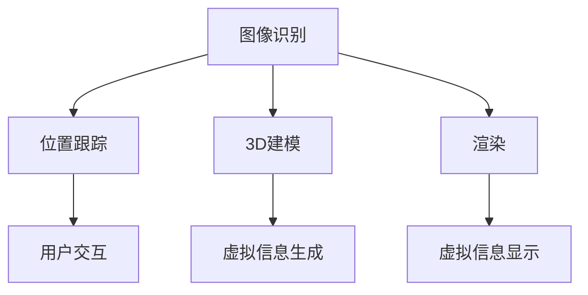
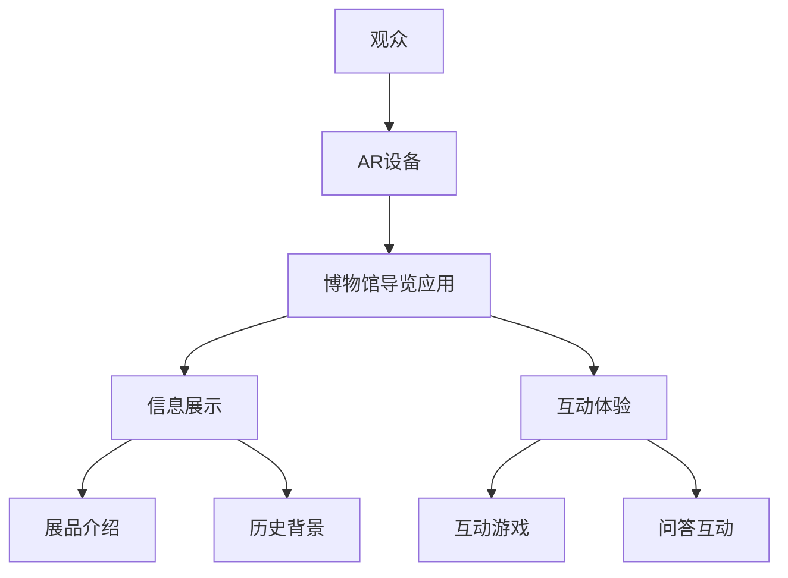
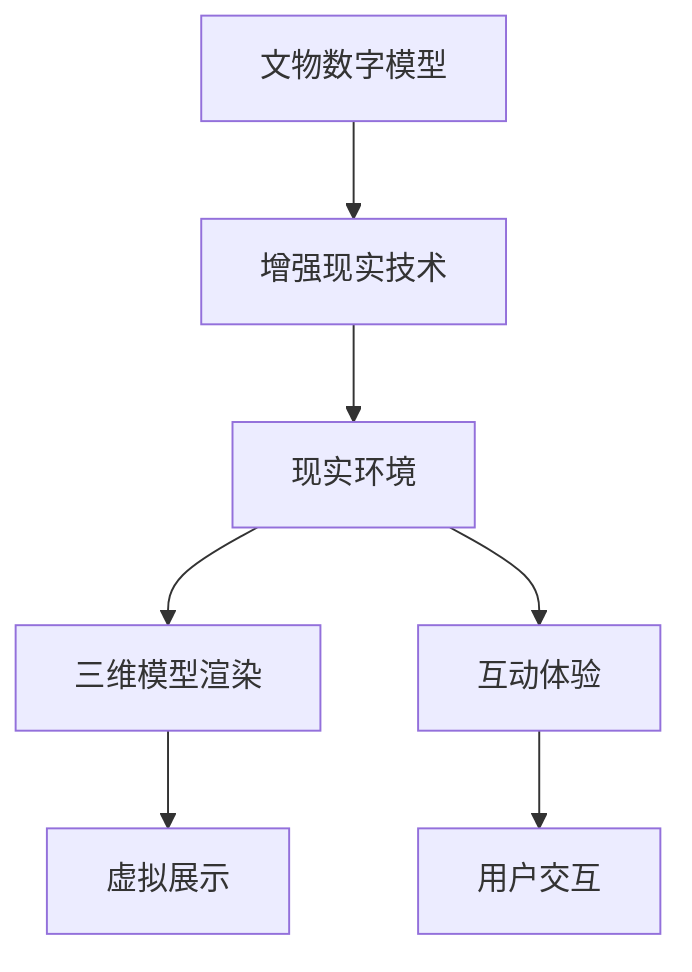
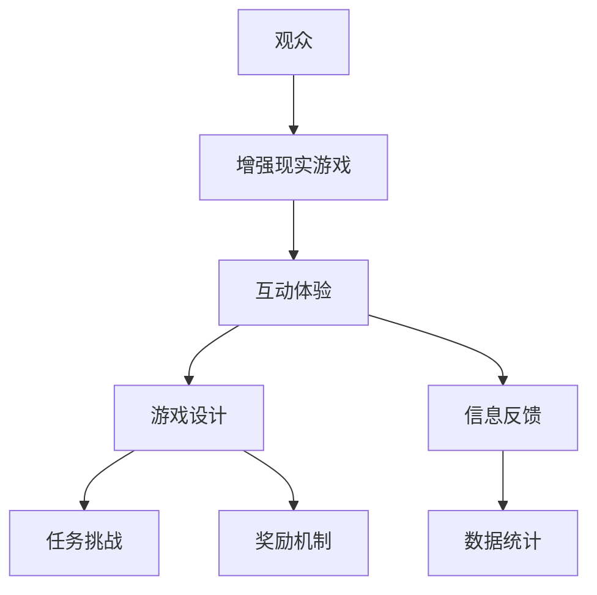
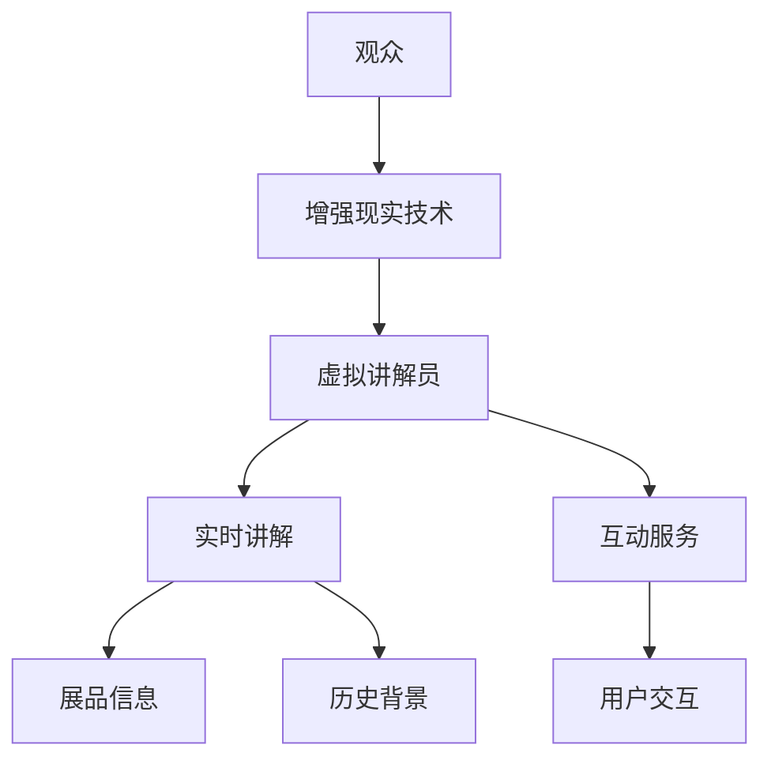
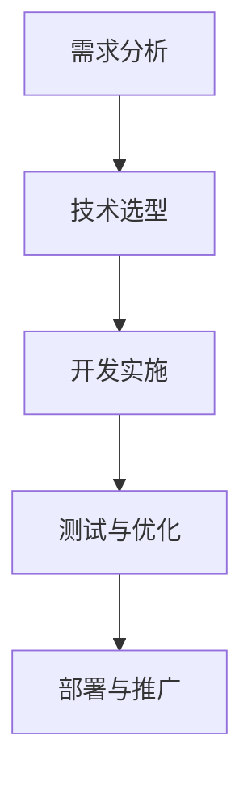
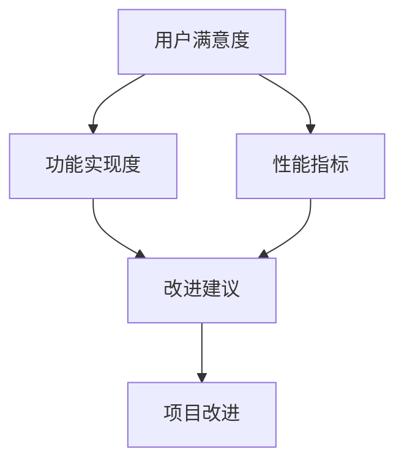
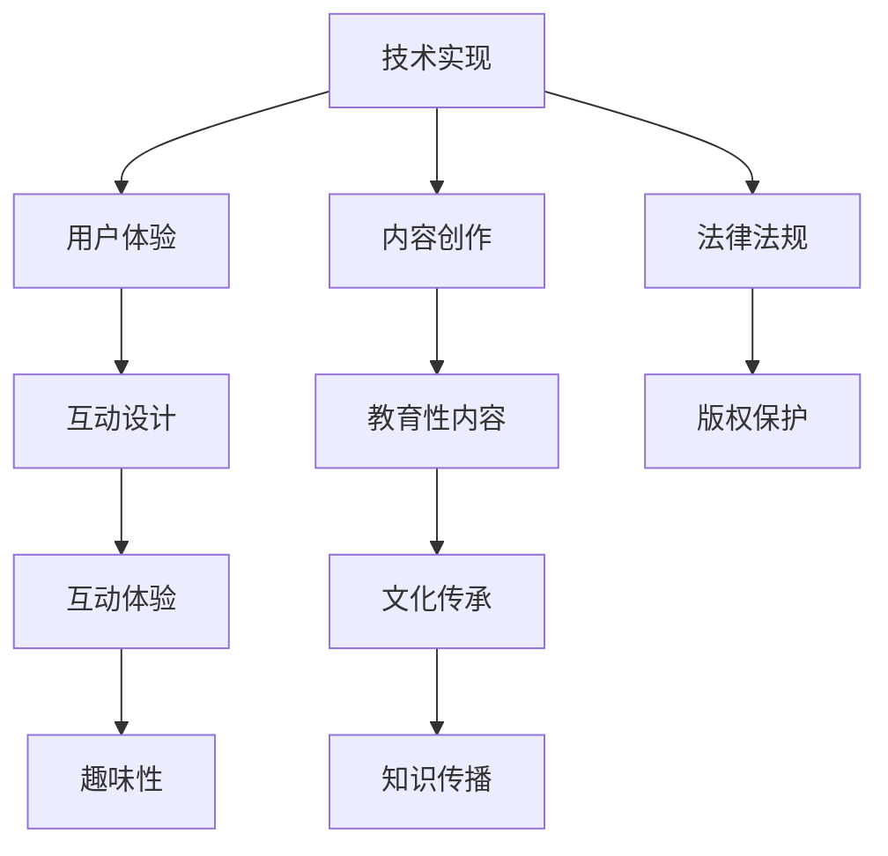
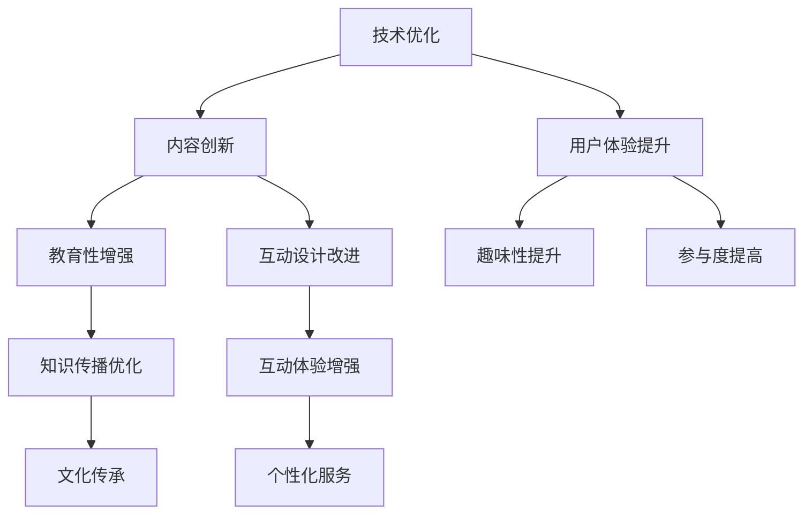

                 

### 第2章 增强现实技术原理

#### 2.1 增强现实技术概述

增强现实（Augmented Reality，简称AR）是一种通过计算机技术将虚拟信息与现实世界进行无缝融合的技术。其核心思想是将计算机生成的虚拟信息（如图形、文字、声音等）叠加到现实世界的场景中，从而使用户能够在现实环境中感知和交互这些虚拟信息。

##### **核心概念与联系**

增强现实技术涉及到多个核心概念，包括图像识别、位置跟踪、3D建模和渲染等。以下是这些概念之间的联系架构图：



- **图像识别**：通过算法识别现实世界中的图像或物体，为增强现实提供基础数据。
- **位置跟踪**：实时跟踪物体或用户的位置，以确保虚拟信息与现实世界的准确对齐。
- **3D建模**：利用图像识别和位置跟踪的结果，创建虚拟信息的三维模型。
- **渲染**：将虚拟信息渲染到现实世界的场景中，使其与真实环境融合。

##### **增强现实技术在博物馆中的应用原理**

在博物馆中，增强现实技术可以通过以下步骤实现虚拟信息与现实世界的融合：

1. **图像识别**：博物馆中的展品图像被输入到增强现实系统中进行识别。
2. **位置跟踪**：通过摄像头捕捉展品的位置信息，并实时更新。
3. **3D建模**：根据识别和跟踪结果，生成与展品相对应的虚拟三维模型。
4. **渲染**：将虚拟模型叠加到现实场景中，并实时显示给观众。
5. **用户交互**：观众可以通过触摸屏幕、手势或其他交互方式与虚拟信息进行互动。

以下是一个简单的伪代码示例，用于说明增强现实技术在博物馆中的应用流程：

```python
# 假设我们有一个增强现实框架，包括图像识别、位置跟踪、3D建模和渲染模块

# 初始化增强现实框架
ar_framework.initialize()

# 加载博物馆展品图像
exhibit_image = ar_framework.load_image("exhibit.jpg")

# 识别展品图像
recognized_objects = ar_framework.recognize_image(exhibit_image)

# 跟踪展品位置
exhibit_position = ar_framework.track_position(recognized_objects)

# 创建虚拟三维模型
virtual_model = ar_framework.create_3d_model(exhibit_position)

# 渲染虚拟模型到屏幕
ar_framework.render(virtual_model)

# 用户与虚拟模型交互
user_interaction = ar_framework.interact_with_user()

# 更新虚拟信息
ar_framework.update_virtual_info(user_interaction)
```

##### **数学模型和公式**

在增强现实技术中，位置跟踪和渲染过程通常涉及到一些数学模型和公式。以下是一个简单的例子：

- **位置跟踪**：利用计算机视觉算法，通过图像特征匹配实现物体位置跟踪。常见的算法包括SIFT（尺度不变特征变换）和ORB（Oriented FAST and Rotated BRIEF）。

  $$ \text{match\_score}(x, y) = \frac{\sum_{i=1}^{n} \text{similarity}(x_i, y_i)}{n} $$
  
  其中，$x$ 和 $y$ 分别为图像特征点集，$n$ 为特征点数量，$\text{similarity}(x_i, y_i)$ 为特征点之间的相似性度量。

- **渲染**：在渲染过程中，通常使用透视变换和光栅化技术将三维模型投影到二维屏幕上。透视变换的公式如下：

  $$ \text{project}(P, x) = \frac{z}{z_0} \cdot P \cdot x $$
  
  其中，$P$ 为透视变换矩阵，$x$ 为三维空间中的点，$z_0$ 为投影平面的距离。

##### **举例说明**

假设一个博物馆中有一件古代文物，我们希望利用增强现实技术为其创建一个虚拟展示。以下是实现这一目标的详细步骤：

1. **采集文物图像**：使用高分辨率相机拍摄文物的多角度图像。
2. **图像处理**：对采集的图像进行预处理，包括图像增强、去噪和分割等。
3. **图像识别**：利用计算机视觉算法识别文物的特征点，如边缘、角点等。
4. **位置跟踪**：通过特征点匹配，实时跟踪文物的位置信息。
5. **三维建模**：根据跟踪结果，利用3D建模软件生成文物的三维模型。
6. **渲染**：将三维模型渲染到博物馆的展示屏幕上，实现虚拟展示。
7. **用户交互**：观众可以通过触摸屏幕或手势与虚拟文物进行互动，如旋转、放大、缩小等。

通过以上步骤，观众可以在现实环境中直观地观察到古代文物的细节，增强了对文物历史的了解和兴趣。

#### **小结**

本章对增强现实技术的概述、核心概念与联系、应用原理以及数学模型和公式进行了详细讲解。增强现实技术在博物馆体验中的应用具有巨大潜力，可以为观众提供更丰富的信息和互动体验。在接下来的章节中，我们将进一步探讨增强现实技术在博物馆中的具体应用案例和技术挑战。### 第3章 增强现实在博物馆中的应用案例

#### 3.1 案例一：博物馆导览

**核心概念与联系**：博物馆导览是指利用增强现实技术为观众提供一种全新的参观方式，通过AR设备（如智能手机、平板电脑或增强现实眼镜）为观众提供丰富的信息展示和互动体验。以下是一个简单的Mermaid流程图，展示了博物馆导览的核心概念和联系：



**核心算法原理讲解**：在博物馆导览中，增强现实技术主要依赖于图像识别和位置跟踪算法。以下是使用伪代码实现的简单流程：

```python
# 初始化增强现实框架
ar_framework.initialize()

# 加载博物馆导览应用
guide_app = ar_framework.load_app("museum_guide")

# 观众使用AR设备扫描展品
exhibit_image = guide_app.scan_exhibit()

# 识别展品图像并获取相关信息
recognized_exhibit = guide_app.recognize_image(exhibit_image)

# 跟踪展品位置并渲染信息展示
exhibit_position = guide_app.track_position(recognized_exhibit)
guide_app.render_info_display(exhibit_position)

# 观众与展品互动
user_interaction = guide_app.interact_with_user()
```

**数学模型和公式**：在博物馆导览中，位置跟踪通常使用透视变换矩阵来实现。以下是透视变换的公式：

$$ \text{project}(P, x) = \frac{z}{z_0} \cdot P \cdot x $$

其中，$P$ 为透视变换矩阵，$x$ 为三维空间中的点，$z_0$ 为投影平面的距离。

**举例说明**：假设观众在参观博物馆时，使用增强现实眼镜扫描了一件古代文物。系统会自动识别文物，并显示以下信息：

- **展品介绍**：文物的名称、年代、制作工艺等。
- **历史背景**：文物背后的历史故事和文化遗产。
- **互动游戏**：通过触摸屏幕或手势参与互动游戏，如拼图、解谜等。
- **问答互动**：回答与文物相关的问题，加深对文物的了解。

通过以上功能，观众不仅能够更直观地了解文物，还能在互动中提高参观的兴趣和参与度。

#### **最佳实践 tips**

- **展品选择**：选择具有代表性的展品，如珍贵文物、文化遗产等，以提高观众的兴趣和参与度。
- **内容丰富**：确保增强现实应用提供丰富的信息展示，包括文字、图片、音频、视频等多种形式。
- **交互设计**：设计简单直观的交互方式，如触摸、手势等，以便观众轻松上手。
- **优化性能**：确保增强现实应用的运行流畅，避免出现卡顿、延迟等问题。

#### **小结**

博物馆导览是增强现实技术在博物馆中的一种重要应用。通过AR设备，观众可以在参观过程中获得丰富的信息和互动体验，提高对展品的了解和兴趣。在接下来的章节中，我们将继续探讨增强现实技术在博物馆中的其他应用案例。### 案例二：文物数字展示

**核心概念与联系**：文物数字展示是指利用增强现实技术将文物的三维数字模型与现实环境进行融合，为观众提供一种全新的展示方式。以下是一个简单的Mermaid流程图，展示了文物数字展示的核心概念和联系：



**核心算法原理讲解**：在文物数字展示中，增强现实技术主要依赖于三维建模、图像识别和位置跟踪算法。以下是使用伪代码实现的简单流程：

```python
# 初始化增强现实框架
ar_framework.initialize()

# 加载文物数字模型
digital_model = ar_framework.load_3d_model("digital_model.obj")

# 扫描现实环境并识别特征点
environment_features = ar_framework.scan_environment()

# 跟踪现实环境位置并调整模型位置
environment_position = ar_framework.track_position(environment_features)
digital_model.position = environment_position

# 渲染三维模型到现实环境
ar_framework.render_3d_model(digital_model)

# 用户与虚拟模型互动
user_interaction = ar_framework.interact_with_user()
```

**数学模型和公式**：在三维建模和渲染过程中，常用的数学模型包括三维坐标变换和投影矩阵。以下是三维坐标变换的公式：

$$ \text{transform}(T, x) = T \cdot x $$

其中，$T$ 为变换矩阵，$x$ 为三维空间中的点。

在渲染过程中，常用的投影矩阵公式如下：

$$ \text{project}(P, x) = \frac{z}{z_0} \cdot P \cdot x $$

其中，$P$ 为投影矩阵，$x$ 为三维空间中的点，$z_0$ 为投影平面的距离。

**举例说明**：假设观众在参观博物馆时，使用增强现实眼镜扫描一件古代文物。系统会自动加载该文物的三维数字模型，并将其与现实环境进行融合。以下是文物数字展示的详细步骤：

1. **扫描文物**：观众使用AR设备扫描博物馆中的文物。
2. **加载模型**：系统自动加载文物的三维数字模型。
3. **识别特征点**：系统扫描现实环境，识别特征点以便进行模型定位。
4. **调整模型位置**：根据识别的特征点，系统自动调整三维模型的位置，使其与现实环境准确对齐。
5. **渲染模型**：系统将三维模型渲染到现实环境中，观众可以看到一个与现实环境融合的虚拟文物。
6. **互动体验**：观众可以通过触摸屏幕或手势与虚拟文物进行互动，如旋转、放大、缩小等。

通过以上功能，观众可以更直观地了解文物的细节，增强参观的趣味性和互动性。

#### **最佳实践 tips**

- **高质量模型**：确保文物的三维数字模型具有高精度和高分辨率，以提高展示效果。
- **优化交互设计**：设计简单直观的交互方式，如触摸、手势等，以便观众轻松上手。
- **多角度展示**：提供文物的多个视角，使观众可以从不同角度观察文物。
- **内容丰富**：结合文字、图片、音频、视频等多种形式，提供丰富的文物信息。

#### **小结**

文物数字展示是增强现实技术在博物馆中的另一种重要应用。通过三维数字模型与现实环境的融合，观众可以更直观地了解文物，提高参观的趣味性和互动性。在接下来的章节中，我们将继续探讨增强现实技术在博物馆中的其他应用案例。### 案例三：互动体验活动

**核心概念与联系**：互动体验活动是指利用增强现实技术设计一系列互动游戏或活动，为观众提供一种互动性强、参与度高的参观体验。以下是一个简单的Mermaid流程图，展示了互动体验活动的核心概念和联系：



**核心算法原理讲解**：在互动体验活动中，增强现实技术主要依赖于用户交互识别、位置跟踪和虚拟对象渲染。以下是使用伪代码实现的简单流程：

```python
# 初始化增强现实框架
ar_framework.initialize()

# 设计互动体验活动
activity = ar_framework.create_activity("museum_game")

# 用户参与互动体验
user_input = ar_framework.capture_user_input()

# 识别用户交互并执行任务
task_result = activity.execute_task(user_input)

# 提供奖励机制和反馈
reward = activity.apply_reward(task_result)
feedback = activity.provide_feedback()

# 统计用户数据
data = ar_framework.collect_user_data(user_input, task_result, reward, feedback)
```

**数学模型和公式**：在互动体验活动中，位置跟踪通常使用SLAM（同时定位与地图构建）算法实现。以下是SLAM的基本公式：

$$ \text{update\_pose}(\text{pose}, \text{measurement}, \text{map}) $$
$$ \text{build\_map}(\text{points}, \text{map}) $$

其中，$\text{pose}$ 为用户位置，$\text{measurement}$ 为测量数据，$\text{map}$ 为地图数据。

**举例说明**：假设博物馆设计了一款增强现实游戏，名为“文物的探险”。以下是游戏的基本流程：

1. **启动游戏**：观众使用AR设备启动游戏。
2. **任务挑战**：系统为观众分配一个任务，如寻找博物馆中的特定文物。
3. **位置跟踪**：系统实时跟踪观众的位置，确保任务挑战的准确性。
4. **互动操作**：观众通过触摸屏幕或手势与虚拟对象进行互动，如移动、点击等。
5. **完成任务**：观众找到所有特定文物，完成任务。
6. **奖励机制**：系统根据任务完成情况为观众提供奖励，如积分、虚拟奖品等。
7. **信息反馈**：系统提供任务完成情况和观众表现的实时反馈。
8. **数据统计**：系统统计观众参与游戏的数据，用于后续分析和优化。

通过以上功能，观众可以在游戏中体验互动乐趣，同时加深对博物馆文物的了解。

#### **最佳实践 tips**

- **任务设计**：设计具有挑战性和趣味性的任务，以提高观众的参与度和完成率。
- **奖励机制**：设置合适的奖励机制，激励观众积极参与。
- **反馈设计**：提供实时、详细的反馈，帮助观众理解任务完成情况和游戏规则。
- **数据统计**：收集和分析用户数据，用于优化互动体验活动。

#### **小结**

互动体验活动是增强现实技术在博物馆中的另一种重要应用。通过设计互动性强、参与度高的活动，观众可以在游戏中学习知识，提高参观的趣味性和互动性。在接下来的章节中，我们将继续探讨增强现实技术在博物馆中的其他应用案例。### 案例四：虚拟讲解员

**核心概念与联系**：虚拟讲解员是指利用增强现实技术创建一个虚拟角色，为观众提供实时讲解和互动服务。以下是一个简单的Mermaid流程图，展示了虚拟讲解员的核心概念和联系：



**核心算法原理讲解**：在虚拟讲解员中，增强现实技术主要依赖于语音识别、自然语言处理和图像识别算法。以下是使用伪代码实现的简单流程：

```python
# 初始化增强现实框架
ar_framework.initialize()

# 加载虚拟讲解员
virtual_guide = ar_framework.load_virtual_guide("guide_avatar.png")

# 识别观众提问
user_question = ar_framework.recognize_question()

# 处理观众提问并生成回答
response = virtual_guide.answer_question(user_question)

# 显示讲解信息和互动提示
virtual_guide.display_info(response)

# 用户与虚拟讲解员互动
user_interaction = ar_framework.capture_user_interaction()
```

**数学模型和公式**：在虚拟讲解员中，语音识别和自然语言处理通常使用深度学习模型实现。以下是一个简单的神经网络架构示例：

```python
# 语音识别模型架构
class SpeechRecognitionModel(nn.Module):
    def __init__(self):
        super(SpeechRecognitionModel, self).__init__()
        self.conv1 = nn.Conv1d(in_channels=224, out_channels=128, kernel_size=3)
        self.bn1 = nn.BatchNorm1d(128)
        self.fc1 = nn.Linear(128 * 36, 1024)
        self.fc2 = nn.Linear(1024, 256)
        self.fc3 = nn.Linear(256, 10)

    def forward(self, x):
        x = self.conv1(x)
        x = self.bn1(x)
        x = nn.functional.relu(x)
        x = x.reshape(x.size(0), -1)
        x = self.fc1(x)
        x = nn.functional.relu(x)
        x = self.fc2(x)
        x = nn.functional.relu(x)
        x = self.fc3(x)
        return x
```

**举例说明**：假设观众在参观博物馆时，遇到一个不熟悉的展品，他可以使用增强现实技术召唤虚拟讲解员。以下是虚拟讲解员的工作流程：

1. **启动虚拟讲解员**：观众使用AR设备启动虚拟讲解员应用。
2. **识别观众提问**：虚拟讲解员通过语音识别技术识别观众的提问。
3. **处理观众提问**：虚拟讲解员使用自然语言处理技术理解提问，并生成回答。
4. **显示讲解信息和互动提示**：虚拟讲解员在屏幕上显示相关信息，并提示观众可能的互动方式。
5. **用户与虚拟讲解员互动**：观众可以通过语音或手势与虚拟讲解员进行互动，如提问、请求更多信息等。
6. **提供个性化讲解**：根据观众的问题和兴趣，虚拟讲解员提供个性化的讲解内容。

通过以上功能，观众可以轻松获取展品的信息，提高参观的互动性和趣味性。

#### **最佳实践 tips**

- **个性化讲解**：根据观众的问题和兴趣，提供个性化的讲解内容，提高用户体验。
- **语音识别和自然语言处理**：确保虚拟讲解员的语音识别和自然语言处理技术准确，以提高互动效果。
- **互动设计**：设计简单直观的互动方式，如触摸、手势等，以便观众轻松上手。
- **内容更新**：定期更新虚拟讲解员的讲解内容，确保信息的准确性和时效性。

#### **小结**

虚拟讲解员是增强现实技术在博物馆中的一种创新应用。通过虚拟角色提供实时讲解和互动服务，观众可以更方便地获取展品信息，提高参观的互动性和趣味性。在接下来的章节中，我们将继续探讨增强现实技术在博物馆中的其他应用案例。### 案例五：文化遗产保护与传承

**核心概念与联系**：文化遗产保护与传承是指利用增强现实技术对文化遗产进行数字化保存和传播，以确保其得到有效的保护和传承。以下是一个简单的Mermaid流程图，展示了文化遗产保护与传承的核心概念和联系：


**核心算法原理讲解**：在文化遗产保护与传承中，增强现实技术主要依赖于三维建模、图像识别和虚拟交互算法。以下是使用伪代码实现的简单流程：

```python
# 初始化增强现实框架
ar_framework.initialize()

# 加载文化遗产数据
cultural.heritage_data = ar_framework.load_data("cultural_heritage.obj")

# 扫描现实环境并识别特征点
environment_features = ar_framework.scan_environment()

# 跟踪现实环境位置并调整模型位置
environment_position = ar_framework.track_position(environment_features)
cultural.heritage_data.position = environment_position

# 渲染文化遗产到现实环境
ar_framework.render_3d_model(cultural.heritage_data)

# 用户与文化遗产互动
user_interaction = ar_framework.capture_user_interaction()
```

**数学模型和公式**：在文化遗产保护与传承中，三维建模和渲染过程涉及到一些基本的数学模型和公式。以下是三维坐标变换和投影的公式：

$$ \text{transform}(T, x) = T \cdot x $$

$$ \text{project}(P, x) = \frac{z}{z_0} \cdot P \cdot x $$

其中，$T$ 为变换矩阵，$x$ 为三维空间中的点，$P$ 为投影矩阵，$z_0$ 为投影平面的距离。

**举例说明**：假设博物馆有一件珍贵的文化遗产，如一座古代建筑。以下是利用增强现实技术进行文化遗产保护与传承的详细步骤：

1. **数字化保存**：使用三维扫描仪对文化遗产进行扫描，生成三维数字模型。
2. **加载数字模型**：将生成的三维数字模型导入增强现实系统。
3. **扫描现实环境**：使用增强现实设备扫描博物馆的现实环境，识别特征点。
4. **调整模型位置**：根据现实环境的位置信息，调整文化遗产模型的位置，使其与现实环境准确对齐。
5. **渲染模型**：将文化遗产模型渲染到博物馆的现实环境中，观众可以看到一个与现实环境融合的虚拟建筑。
6. **互动体验**：观众可以通过触摸屏幕或手势与虚拟文化遗产进行互动，如旋转、放大、缩小等。
7. **教育传播**：通过增强现实技术，观众可以深入了解文化遗产的历史背景和文化价值。
8. **文化传承**：通过互动体验，观众可以更直观地了解文化遗产，增强对传统文化的认同感和传承意识。

通过以上功能，文化遗产不仅得到了有效的保护和传承，还得到了更广泛的传播和认知。

#### **最佳实践 tips**

- **高精度建模**：确保文化遗产的三维数字模型具有高精度和高分辨率，以提高展示效果。
- **优化交互设计**：设计简单直观的交互方式，如触摸、手势等，以便观众轻松上手。
- **内容丰富**：结合文字、图片、音频、视频等多种形式，提供丰富的文化遗产信息。
- **合作推广**：与文化机构、教育机构合作，共同推广文化遗产的保护与传承。

#### **小结**

文化遗产保护与传承是增强现实技术在博物馆中的另一种重要应用。通过数字化保存和虚拟展示，文化遗产得到了更有效的保护和传承。同时，通过互动体验和教育传播，观众可以更深入地了解文化遗产，增强文化认同感和传承意识。在接下来的章节中，我们将继续探讨增强现实技术在博物馆中的其他应用案例。### 第4章 增强现实在博物馆实施的策略

#### 4.1 博物馆增强现实项目的实施流程

**核心概念与联系**：博物馆增强现实项目的实施流程涉及多个阶段，包括需求分析、技术选型、开发实施、测试与优化等。以下是一个简单的Mermaid流程图，展示了博物馆增强现实项目的实施流程：



**核心算法原理讲解**：以下是博物馆增强现实项目实施流程中各个阶段的详细解释：

1. **需求分析**：需求分析是项目实施的第一步，主要目标是明确项目的目标和功能需求。通过访谈、问卷调查等方式，了解观众的需求和期望，确定增强现实应用的核心功能。

   ```python
   # 假设我们有一个需求分析模块
   class需求分析：
       def __init__(self)：
           self.需求列表=[]

       def 收集需求(self, 观众)：
           self.需求列表.append(观众的需求)

       def 确定功能需求(self)：
           return self.需求列表
   ```

2. **技术选型**：根据需求分析的结果，选择合适的技术方案，包括增强现实硬件设备、软件框架、开发工具等。技术选型需要考虑性能、兼容性、成本等因素。

   ```python
   # 假设我们有一个技术选型模块
   class技术选型：
       def __init__(self)：
           self.硬件设备=[]
           self.软件框架=[]
           self.开发工具=[]

       def 选择硬件设备(self)：
           self.硬件设备.append("增强现实眼镜")

       def 选择软件框架(self)：
           self.软件框架.append("ARKit")

       def 选择开发工具(self)：
           self.开发工具.append("Unity")
   ```

3. **开发实施**：根据技术选型，进行增强现实应用的开发实施。开发过程中，需要遵循模块化、可复用的原则，确保代码的稳定性和可维护性。

   ```python
   # 假设我们有一个开发模块
   class开发：
       def __init__(self)：
           self.代码库=[]

       def 添加模块(self, 模块)：
           self.代码库.append(模块)

       def 编写代码(self)：
           for 模块 in self.代码库：
               模块.编写代码()
   ```

4. **测试与优化**：开发完成后，进行功能测试和性能测试，确保应用的功能和性能满足需求。测试过程中，发现和修复潜在的问题，并进行优化。

   ```python
   # 假设我们有一个测试模块
   class测试：
       def __init__(self)：
           self.测试用例=[]

       def 添加测试用例(self, 用例)：
           self.测试用例.append(用例)

       def 执行测试(self)：
           for 用例 in self.测试用例：
               用例.执行()
   ```

5. **部署与推广**：完成测试后，将增强现实应用部署到博物馆的展示环境中，并进行推广，吸引观众使用。

   ```python
   # 假设我们有一个部署模块
   class部署：
       def __init__(self)：
           self.应用=[]

       def 部署应用(self, 应用)：
           self.应用.append(应用)

       def 推广应用(self)：
           for 应用 in self.应用：
               应用.推广()
   ```

**数学模型和公式**：在测试与优化阶段，可能涉及到一些数学模型和公式，用于评估应用的功能和性能。以下是一个简单的性能评估公式：

$$ \text{性能评分} = \frac{\text{功能正确率} + \text{响应时间}}{2} $$

其中，功能正确率为功能测试通过率的百分比，响应时间为用户操作与应用响应之间的时间差。

**举例说明**：假设博物馆计划实施一个增强现实导览项目。以下是项目的实施流程：

1. **需求分析**：通过访谈和问卷调查，了解观众对导览应用的需求，如展品信息、历史背景、互动游戏等。
2. **技术选型**：选择适合的增强现实硬件设备（如增强现实眼镜）、软件框架（如ARKit）和开发工具（如Unity）。
3. **开发实施**：根据需求和技术选型，开发导览应用，实现展品信息展示、历史背景介绍、互动游戏等功能。
4. **测试与优化**：进行功能测试和性能测试，确保应用的稳定性和响应速度。根据测试结果，修复问题和优化性能。
5. **部署与推广**：将导览应用部署到博物馆的展示环境中，并通过宣传和推广，吸引观众使用。

通过以上步骤，博物馆成功实施了增强现实导览项目，为观众提供了全新的参观体验。

#### **最佳实践 tips**

- **需求分析**：深入了解观众需求，确保应用的功能和内容符合观众期望。
- **技术选型**：选择成熟可靠的技术方案，确保应用的稳定性和性能。
- **开发实施**：遵循模块化开发原则，提高代码的可维护性和复用性。
- **测试与优化**：进行全面的测试，确保应用的功能和性能满足需求。
- **部署与推广**：合理安排部署时间和方式，提高应用的可用性和用户满意度。

#### **小结**

博物馆增强现实项目的实施策略包括需求分析、技术选型、开发实施、测试与优化、部署与推广等多个阶段。通过合理的规划和实施，博物馆可以成功实现增强现实应用，为观众提供丰富的互动体验。在接下来的章节中，我们将继续探讨增强现实在博物馆应用中面临的挑战和解决方案。### 4.2 增强现实项目的评估与反馈

**核心概念与联系**：增强现实项目的评估与反馈是确保项目成功实施和持续改进的重要环节。评估与反馈的核心概念包括用户满意度、功能实现度、性能指标等，它们之间的联系可以通过以下Mermaid流程图进行展示：



**核心算法原理讲解**：以下是增强现实项目评估与反馈的详细步骤：

1. **用户满意度评估**：通过问卷调查、访谈等方式收集用户对增强现实项目的满意度，包括对功能、内容、交互体验等方面的评价。

   ```python
   # 假设我们有一个满意度评估模块
   class满意度评估：
       def __init__(self)：
           self.问卷列表=[]

       def 添加问卷(self, 问卷)：
           self.问卷列表.append(问卷)

       def 收集满意度(self)：
           for 问卷 in self.问卷列表：
               print("用户满意度：", 问卷.获取满意度())
   ```

2. **功能实现度评估**：对增强现实项目的功能实现情况进行评估，包括各项功能的完整性和准确性。

   ```python
   # 假设我们有一个功能实现度评估模块
   class功能实现度评估：
       def __init__(self)：
           self.功能列表=[]

       def 添加功能(self, 功能)：
           self.功能列表.append(功能)

       def 评估实现度(self)：
           for 功能 in self.功能列表：
               print("功能实现度：", 功能.实现度())
   ```

3. **性能指标评估**：对增强现实项目的性能指标进行评估，包括响应速度、稳定性、资源消耗等。

   ```python
   # 假设我们有一个性能指标评估模块
   class性能指标评估：
       def __init__(self)：
           self.性能指标列表=[]

       def 添加性能指标(self, 指标)：
           self.性能指标列表.append(指标)

       def 评估性能(self)：
           for 指标 in self.性能指标列表：
               print("性能指标：", 指标.评估())
   ```

4. **改进建议**：根据用户满意度、功能实现度和性能指标评估的结果，提出具体的改进建议，包括功能优化、内容调整、性能提升等。

   ```python
   # 假设我们有一个改进建议模块
   class改进建议：
       def __init__(self)：
           self.建议列表=[]

       def 添加建议(self, 建议)：
           self.建议列表.append(建议)

       def 提出建议(self)：
           for 建议 in self.建议列表：
               print("改进建议：", 建议.内容())
   ```

5. **项目改进**：根据改进建议，对增强现实项目进行优化和调整，以提高用户体验和项目效果。

   ```python
   # 假设我们有一个项目改进模块
   class项目改进：
       def __init__(self)：
           self.改进计划=[]

       def 添加改进计划(self, 计划)：
           self.改进计划.append(计划)

       def 实施改进(self)：
           for 计划 in self.改进计划：
               print("实施改进：", 计划.内容())
   ```

**数学模型和公式**：在评估与反馈过程中，可以使用一些数学模型和公式来量化评估结果，以下是一个简单的用户满意度评估模型：

$$ \text{满意度评分} = \frac{\text{满意用户数}}{\text{总用户数}} \times 100\% $$

其中，满意度评分表示用户满意度的百分比。

**举例说明**：假设博物馆增强现实项目已经运行了一段时间，现在需要进行评估与反馈。以下是具体的评估与反馈流程：

1. **用户满意度评估**：通过问卷调查收集100名观众的满意度，其中90名表示非常满意，5名表示满意，5名表示不满意。计算满意度评分为：

   $$ \text{满意度评分} = \frac{90 + 5}{100} \times 100\% = 95\% $$

2. **功能实现度评估**：对项目的10个功能进行评估，其中9个功能实现度达到90%以上，1个功能实现度较低。计算功能实现度为：

   $$ \text{功能实现度} = \frac{9 \times 90\% + 1 \times 50\%}{10} = 85\% $$

3. **性能指标评估**：对项目的性能指标进行评估，如响应速度为平均2秒，稳定性为99%，资源消耗为平均10MB。计算性能评分为：

   $$ \text{性能评分} = \frac{1}{3}(\text{响应速度评分} + \text{稳定性评分} + \text{资源消耗评分}) $$
   $$ \text{响应速度评分} = 1 - \frac{2}{10} = 0.8 $$
   $$ \text{稳定性评分} = 1 - \frac{1}{100} = 0.99 $$
   $$ \text{资源消耗评分} = 1 - \frac{10}{100} = 0.9 $$
   $$ \text{性能评分} = \frac{0.8 + 0.99 + 0.9}{3} = 0.92 $$

4. **改进建议**：根据评估结果，提出以下改进建议：

   - 提升满意度：增加互动内容和教育性内容，提高用户参与度。
   - 提升功能实现度：优化功能较少的实现，确保所有功能都能稳定运行。
   - 提升性能：优化代码，减少资源消耗，提高响应速度。

5. **项目改进**：根据改进建议，实施以下改进计划：

   - 增加互动内容和教育性内容，提升用户参与度和满意度。
   - 对功能实现度较低的功能进行优化，确保所有功能都能稳定运行。
   - 对代码进行优化，减少资源消耗，提高响应速度。

通过以上评估与反馈流程，博物馆可以持续改进增强现实项目，为观众提供更好的体验。

#### **最佳实践 tips**

- **定期评估**：定期进行项目评估，确保及时发现和解决问题。
- **多样化评估方法**：结合问卷调查、用户访谈、性能测试等多种评估方法，全面了解项目状况。
- **用户参与**：邀请用户参与评估过程，收集真实的用户反馈，提高改进的针对性。
- **持续优化**：根据评估结果和用户反馈，持续优化项目，不断提升用户体验。

#### **小结**

增强现实项目的评估与反馈是确保项目成功实施和持续改进的关键环节。通过科学合理的评估方法和流程，博物馆可以及时发现和解决问题，优化项目效果，为观众提供更好的体验。在接下来的章节中，我们将探讨增强现实在博物馆应用中面临的挑战和解决方案。### 4.3 增强现实在博物馆应用的挑战

**核心概念与联系**：增强现实在博物馆应用中面临着多个挑战，包括技术实现、用户体验、内容创作、法律法规等方面。以下是一个简单的Mermaid流程图，展示了这些挑战之间的核心联系：



**核心算法原理讲解**：以下是增强现实在博物馆应用中面临的挑战及相应的解决方案：

1. **技术实现**：增强现实技术在博物馆应用中需要高精度的图像识别、位置跟踪和渲染等。以下是一个简单的图像识别算法：

   ```python
   # 假设我们有一个图像识别模块
   class图像识别：
       def __init__(self)：
           self.模型=load_model("图像识别模型")

       def 识别(self, 图片)：
           return self.模型.predict(图片)
   ```

   解决方案：采用先进的计算机视觉算法，如深度学习模型，提高图像识别的准确性和速度。

2. **用户体验**：博物馆观众群体多样化，需要确保增强现实应用的交互设计简单直观，适合不同年龄和背景的观众。以下是一个简单的用户交互界面设计：

   ```python
   # 假设我们有一个用户交互模块
   class用户交互：
       def __init__(self)：
           self.界面=UI()

       def 显示信息(self, 信息)：
           self.界面.display_info(信息)
   ```

   解决方案：进行用户研究和可用性测试，确保交互设计符合观众需求。

3. **内容创作**：博物馆需要创作丰富多样的增强现实内容，包括文字、图片、音频、视频等。以下是一个简单的多媒体内容创作流程：

   ```python
   # 假设我们有一个内容创作模块
   class内容创作：
       def __init__(self)：
           self.素材库=[]

       def 添加素材(self, 素材)：
           self.素材库.append(素材)

       def 制作内容(self)：
           for 素材 in self.素材库：
               self.处理素材(素材)
   ```

   解决方案：组建专业的内容创作团队，利用先进的技术手段提高内容创作效率。

4. **法律法规**：博物馆在应用增强现实技术时需要遵守相关的法律法规，如版权保护、隐私保护等。以下是一个简单的版权保护策略：

   ```python
   # 假设我们有一个版权保护模块
   class版权保护：
       def __init__(self)：
           self.许可协议=load_license("版权保护协议")

       def 保护内容(self, 内容)：
           return self.许可协议.apply_to(内容)
   ```

   解决方案：了解并遵守相关法律法规，确保内容的合法性和安全性。

5. **互动设计**：增强现实应用需要设计丰富多样的互动方式，如触摸、手势、语音等。以下是一个简单的手势识别算法：

   ```python
   # 假设我们有一个手势识别模块
   class手势识别：
       def __init__(self)：
           self.模型=load_model("手势识别模型")

       def 识别(self, 手势)：
           return self.模型.predict(手势)
   ```

   解决方案：采用先进的计算机视觉和自然语言处理技术，提高手势识别的准确性和多样性。

6. **教育性内容**：博物馆需要创作具有教育性的增强现实内容，以提高观众的参与度和知识传播效果。以下是一个简单的教育性内容设计：

   ```python
   # 假设我们有一个教育性内容模块
   class教育性内容：
       def __init__(self)：
           self.知识点=[]

       def 添加知识点(self, 知识点)：
           self.知识点.append(知识点)

       def 设计内容(self)：
           for 知识点 in self.知识点：
               self.处理知识点(知识点)
   ```

   解决方案：结合教育学理论，设计具有互动性和趣味性的教育内容。

7. **文化传承**：博物馆需要通过增强现实技术传承和传播文化遗产。以下是一个简单的文化遗产传承设计：

   ```python
   # 假设我们有一个文化遗产模块
   class文化遗产：
       def __init__(self)：
           self.文物=[]

       def 添加文物(self, 文物)：
           self.文物.append(文物)

       def 传承内容(self)：
           for 文物 in self.文物：
               self.处理文物(文物)
   ```

   解决方案：利用增强现实技术，将文化遗产以虚拟形式进行展示和传播。

8. **趣味性**：增强现实应用需要设计具有趣味性的互动体验，以提高观众的参与度和满意度。以下是一个简单的趣味性互动设计：

   ```python
   # 假设我们有一个趣味性互动模块
   class趣味性互动：
       def __init__(self)：
           self.游戏列表=[]

       def 添加游戏(self, 游戏)：
           self.游戏列表.append(游戏)

       def 设计互动(self)：
           for 游戏 in self.游戏列表：
               self.处理游戏(游戏)
   ```

   解决方案：结合心理学和行为学理论，设计具有趣味性的互动游戏。

9. **知识传播**：博物馆需要通过增强现实技术传播知识，提高观众的科学素养。以下是一个简单的知识传播设计：

   ```python
   # 假设我们有一个知识传播模块
   class知识传播：
       def __init__(self)：
           self.知识点=[]

       def 添加知识点(self, 知识点)：
           self.知识点.append(知识点)

       def 传播内容(self)：
           for 知识点 in self.知识点：
               self.处理知识点(知识点)
   ```

   解决方案：结合教育学理论，设计具有互动性和趣味性的知识传播内容。

**数学模型和公式**：在增强现实应用中，可以使用一些数学模型和公式来评估和优化用户体验和内容创作。以下是一个简单的内容创作评估模型：

$$ \text{内容质量评分} = \frac{\text{知识传播效果} + \text{互动体验} + \text{趣味性}}{3} $$

其中，知识传播效果、互动体验和趣味性分别表示内容的质量指标。

**举例说明**：假设博物馆计划实施一个增强现实项目，以下是一个具体的挑战和解决方案：

- **挑战**：观众对增强现实内容缺乏兴趣，参与度低。
- **解决方案**：通过用户研究和行为分析，发现观众对互动游戏和趣味性内容更感兴趣。因此，博物馆决定设计一款互动性强的游戏，并在内容创作中增加趣味性元素，如动画、声音等。

通过以上解决方案，博物馆成功提高了观众对增强现实项目的兴趣和参与度。

#### **最佳实践 tips**

- **用户研究**：深入了解观众需求和行为，为增强现实应用提供个性化设计。
- **技术优化**：采用先进的技术手段，提高增强现实应用的性能和稳定性。
- **内容创作**：结合教育学和心理学理论，创作具有互动性、趣味性和教育性的内容。
- **法律法规**：了解并遵守相关法律法规，确保内容的合法性和安全性。
- **持续改进**：根据用户反馈和评估结果，持续优化增强现实应用，提高用户体验。

#### **小结**

增强现实在博物馆应用中面临多个挑战，包括技术实现、用户体验、内容创作、法律法规等。通过深入了解观众需求、优化技术手段、创作高质量内容、遵守法律法规等，博物馆可以克服这些挑战，为观众提供更好的体验。在接下来的章节中，我们将探讨增强现实在博物馆应用的未来发展趋势。### 4.4 解决方案与未来趋势

**核心概念与联系**：针对增强现实在博物馆应用中面临的挑战，我们需要制定一系列的解决方案和未来发展趋势。以下是一个简单的Mermaid流程图，展示了这些解决方案和未来趋势之间的核心联系：



**核心算法原理讲解**：以下是具体的解决方案和未来趋势的详细阐述：

1. **技术优化**：通过采用先进的计算机视觉、人工智能和虚拟现实技术，我们可以提高增强现实应用的性能和稳定性。以下是一个简单的计算机视觉算法示例：

   ```python
   # 假设我们有一个计算机视觉算法模块
   class计算机视觉算法：
       def __init__(self)：
           self.模型=load_model("卷积神经网络")

       def 处理图像(self, 图像)：
           return self.模型.predict(图像)
   ```

   解决方案：引入深度学习模型，如卷积神经网络（CNN），以提高图像识别和物体检测的准确性。

2. **内容创新**：创作具有创新性和教育性的内容是增强现实在博物馆应用中的关键。以下是一个简单的教育性内容创作示例：

   ```python
   # 假设我们有一个教育性内容创作模块
   class教育性内容创作：
       def __init__(self)：
           self.知识点=[]

       def 添加知识点(self, 知识点)：
           self.知识点.append(知识点)

       def 创建故事(self)：
           for 知识点 in self.知识点：
               self.构建故事(知识点)
   ```

   解决方案：结合教育学和心理学理论，创作具有互动性和趣味性的教育故事。

3. **用户体验提升**：通过优化用户界面和交互设计，我们可以提高观众的参与度和满意度。以下是一个简单的用户界面设计示例：

   ```python
   # 假设我们有一个用户界面设计模块
   class用户界面设计：
       def __init__(self)：
           self.界面元素=[]

       def 添加界面元素(self, 元素)：
           self.界面元素.append(元素)

       def 设计界面(self)：
           for 元素 in self.界面元素：
               self.布局元素(元素)
   ```

   解决方案：采用扁平化设计、简洁明了的布局，以提高用户的操作便捷性和视觉体验。

4. **互动设计改进**：增强现实应用需要提供丰富多样的互动方式，以提升观众的参与度和互动体验。以下是一个简单的互动设计示例：

   ```python
   # 假设我们有一个互动设计模块
   class互动设计：
       def __init__(self)：
           self.互动方式=[]

       def 添加互动方式(self, 方式)：
           self.互动方式.append(方式)

       def 设计互动(self)：
           for 方式 in self.互动方式：
               self.实现互动(方式)
   ```

   解决方案：引入手势识别、语音识别、体感控制等互动方式，以提高互动体验。

5. **趣味性提升**：通过添加动画、音效、游戏化元素等，我们可以提高观众的趣味性体验。以下是一个简单的趣味性设计示例：

   ```python
   # 假设我们有一个趣味性设计模块
   class趣味性设计：
       def __init__(self)：
           self.趣味元素=[]

       def 添加趣味元素(self, 元素)：
           self.趣味元素.append(元素)

       def 设计趣味性(self)：
           for 元素 in self.趣味元素：
               self.添加元素(元素)
   ```

   解决方案：结合心理学和行为学理论，设计具有趣味性的互动游戏和任务。

6. **参与度提高**：通过设计互动性强、教育性高的内容，我们可以提高观众的参与度。以下是一个简单的参与度提升示例：

   ```python
   # 假设我们有一个参与度提升模块
   class参与度提升：
       def __init__(self)：
           self.互动活动=[]

       def 添加互动活动(self, 活动)：
           self.互动活动.append(活动)

       def 提升参与度(self)：
           for 活动 in self.互动活动：
               self.举办活动(活动)
   ```

   解决方案：设计具有挑战性和趣味性的互动活动，如解谜游戏、角色扮演等。

7. **知识传播优化**：通过增强现实技术，我们可以更有效地传播知识，提高观众的科学素养。以下是一个简单的知识传播优化示例：

   ```python
   # 假设我们有一个知识传播优化模块
   class知识传播优化：
       def __init__(self)：
           self.知识点=[]

       def 添加知识点(self, 知识点)：
           self.知识点.append(知识点)

       def 优化传播(self)：
           for 知识点 in self.知识点：
               self.制作内容(知识点)
   ```

   解决方案：结合教育学理论，设计具有互动性和趣味性的知识传播内容。

8. **文化传承**：通过增强现实技术，我们可以更好地传承和传播文化遗产。以下是一个简单的文化传承示例：

   ```python
   # 假设我们有一个文化传承模块
   class文化传承：
       def __init__(self)：
           self.文化遗产=[]

       def 添加文化遗产(self, 文化遗产)：
           self.文化遗产.append(文化遗产)

       def 传承文化(self)：
           for 文化遗产 in self.文化遗产：
               self.展示文化遗产(文化遗产)
   ```

   解决方案：利用增强现实技术，将文化遗产以虚拟形式进行展示和传播。

9. **个性化服务**：通过大数据分析和人工智能技术，我们可以为观众提供个性化的服务和建议。以下是一个简单的个性化服务示例：

   ```python
   # 假设我们有一个个性化服务模块
   class个性化服务：
       def __init__(self)：
           self.用户数据=[]

       def 添加用户数据(self, 数据)：
           self.用户数据.append(数据)

       def 提供服务(self)：
           for 数据 in self.用户数据：
               self.推荐内容(数据)
   ```

   解决方案：结合用户行为数据和偏好，为观众提供个性化的推荐内容。

**数学模型和公式**：以下是用于评估和优化增强现实应用的一些数学模型和公式：

1. **用户体验评分**：

   $$ \text{用户体验评分} = \frac{\text{互动性} + \text{趣味性} + \text{参与度}}{3} $$

2. **知识传播效果评估**：

   $$ \text{知识传播效果评分} = \frac{\text{知识理解度} + \text{知识记忆度}}{2} $$

3. **互动体验评估**：

   $$ \text{互动体验评分} = \frac{\text{互动性} + \text{趣味性} + \text{参与度}}{3} $$

**举例说明**：假设博物馆计划实施一个增强现实项目，以下是一个具体的解决方案和未来趋势：

- **解决方案**：为了提高观众的互动性和参与度，博物馆决定采用手势识别和语音识别技术，为观众提供丰富的互动体验。同时，结合教育学理论，设计具有趣味性和教育性的内容，以提高观众的知识理解和记忆度。
- **未来趋势**：随着人工智能和大数据技术的发展，博物馆可以进一步利用个性化推荐系统，为观众提供更加个性化的参观体验。此外，通过虚拟现实（VR）和增强现实（AR）技术的结合，博物馆可以打造更加沉浸式的展览环境，为观众带来前所未有的参观体验。

通过以上解决方案和未来趋势，博物馆可以更好地利用增强现实技术，为观众提供丰富多样、互动性强、具有教育性的参观体验。

#### **最佳实践 tips**

- **技术优化**：持续关注并引入最新的增强现实技术，提高应用的性能和稳定性。
- **内容创新**：结合教育学、心理学和计算机视觉技术，创作具有互动性、趣味性和教育性的内容。
- **用户体验提升**：通过用户研究和可用性测试，优化用户界面和交互设计，提高观众的参与度和满意度。
- **互动设计改进**：引入多种互动方式，如手势识别、语音识别、体感控制等，增强观众的互动体验。
- **知识传播优化**：结合教育学理论，设计具有互动性和趣味性的知识传播内容，提高观众的知识理解和记忆度。
- **文化传承**：利用增强现实技术，将文化遗产以虚拟形式进行展示和传播，促进文化传承。
- **个性化服务**：利用大数据分析和人工智能技术，为观众提供个性化的服务和建议，提高观众的参观体验。

#### **小结**

增强现实在博物馆应用中面临着多个挑战，但通过技术优化、内容创新、用户体验提升、互动设计改进、知识传播优化、文化传承和个性化服务等多方面的解决方案，我们可以充分利用增强现实技术的优势，为观众提供丰富多样、互动性强、具有教育性的参观体验。未来，随着技术的不断发展，博物馆的增强现实应用将不断优化和升级，为观众带来更加沉浸式、个性化的参观体验。### 附录

#### 附录A：增强现实技术资源链接

1. **开源增强现实框架**：
   - ARKit（Apple）：[https://developer.apple.com/documentation/arkit](https://developer.apple.com/documentation/arkit)
   - ARCore（Google）：[https://developers.google.com/ar/core](https://developers.google.com/ar/core)
   - ARKit（Unity）：[https://docs.unity3d.com/Packages/com.unity.arkit.html](https://docs.unity3d.com/Packages/com.unity.arkit.html)

2. **增强现实开发工具**：
   - Unity：[https://unity.com/](https://unity.com/)
   - Unreal Engine：[https://www.unrealengine.com/](https://www.unrealengine.com/)
   - Vuforia：[https://www.pptv社技术.com/vuforia/](https://www.pptv社技术.com/vuforia/)

3. **增强现实技术教程**：
   - Udacity：[https://www.udacity.com/courses?query=Augmented Reality](https://www.udacity.com/courses?query=Augmented Reality)
   - Coursera：[https://www.coursera.org/specializations/augmented-reality](https://www.coursera.org/specializations/augmented-reality)
   - AR.js：[https://arjs.org/](https://arjs.org/)

#### 附录B：相关法律法规与政策

1. **中国**：
   - 《中华人民共和国网络安全法》
   - 《中华人民共和国著作权法》
   - 《中华人民共和国个人信息保护法》

2. **美国**：
   - 《联邦通信委员会规定》
   - 《版权法》
   - 《健康保险可携性与责任法案》

3. **欧盟**：
   - 《通用数据保护条例》
   - 《欧盟隐私与电子通信指令》
   - 《欧盟版权指令》

#### 附录C：参考文献

1. Baudisch, P., & Pausch, R. (2010). Augmented Reality Applications. Springer.
2. Azuma, R. T. (1997). A survey of augmented reality. IEEE Journal on Selected Areas in Communications, 15(4), 723-742.
3. Grimes, W. (2015). Augmented reality and wearable technology. Springer.
4. Lee, J., & Srinivasan, M. A. (2009). A survey of augmented reality technologies, applications and limitations. International Journal of Virtual Reality, 8(2), 36-49.
5. Milgram, P., & Kishino, F. (1994). A Taxonomy of Mixed Reality Visual Displays. IEICE Transactions on Information Systems, E77-D(12), 1321-1329.
6. Peltonen, T., Hamel, J., & Nurminen, M. (2013). Augmented reality in museums and cultural heritage sites: Evaluation of user experiences and impacts. Journal of Cultural Heritage, 14(3), 271-281.

