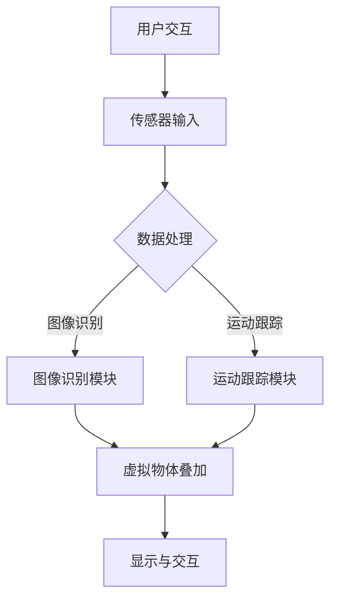

                 

# 增强现实在员工培训中的应用前景

## 摘要

随着技术的快速发展，增强现实（Augmented Reality，AR）技术逐渐成为教育培训领域的重要工具。本文旨在探讨增强现实在员工培训中的应用前景，分析其技术基础、应用案例、系统设计与开发，以及核心算法原理。通过对国内外增强现实员工培训应用的现状分析，本文提出了增强现实员工培训系统开发的核心流程和关键算法，并探讨了增强现实技术在未来员工培训中的发展趋势和市场前景。本文旨在为教育科技领域提供有价值的参考和启示。

## 引言

### 1.1 研究背景与意义

员工培训是企业发展的重要环节，而传统的培训方式往往存在互动性差、学员参与度低等问题。随着增强现实（Augmented Reality，AR）技术的迅速发展，越来越多的企业开始探索将AR技术应用于员工培训，以提高培训效果和效率。AR技术通过将虚拟信息与现实世界融合，为员工提供更加生动、直观的学习体验，有助于提高员工的学习兴趣和参与度。

### 1.2 增强现实技术概述

增强现实技术是一种将虚拟信息与现实世界融合的交互技术。它通过计算机生成的虚拟图像、声音、触觉等感知信息，叠加到现实世界中，使用户能够与现实世界中的物体进行交互。增强现实技术主要由三个部分组成：感知、处理和显示。感知部分主要通过摄像头、传感器等设备获取现实世界的图像和声音信息；处理部分通过计算机处理和融合虚拟信息和现实世界信息；显示部分则通过显示器、眼镜等设备将增强现实信息展示给用户。

### 1.3 增强现实在员工培训中的应用

增强现实技术在员工培训中的应用非常广泛，可以应用于航空、制造业、医疗等多个行业。例如，在航空领域，增强现实技术可以用于飞行员培训，通过模拟真实飞行环境，提高飞行员的操作技能和应急反应能力。在制造业，增强现实技术可以用于产品装配培训，通过虚拟装配模型，帮助员工更快速、准确地完成产品装配。在医疗领域，增强现实技术可以用于手术模拟培训，通过虚拟手术场景，提高医生的操作技能和手术成功率。

## 第2章 增强现实技术基础

### 2.1 增强现实技术原理

#### 2.1.1 增强现实技术的定义

增强现实（Augmented Reality，AR）是一种通过计算机技术将虚拟信息与现实世界进行融合的技术。与虚拟现实（Virtual Reality，VR）不同，AR技术不是完全取代现实世界，而是在现实世界的基础上，叠加虚拟信息，为用户提供一种虚实融合的交互体验。

#### 2.1.2 增强现实技术的核心组成部分

增强现实技术主要由三个部分组成：感知、处理和显示。

1. **感知**：感知部分主要通过摄像头、传感器等设备获取现实世界的图像、声音等信息。这些信息是增强现实技术的基础，用于构建虚拟信息和现实世界的融合场景。

2. **处理**：处理部分通过计算机对感知到的信息进行处理和融合。这包括图像识别、图像处理、声音处理等。处理结果用于生成虚拟信息，并将其叠加到现实世界中。

3. **显示**：显示部分通过显示器、眼镜等设备将增强现实信息展示给用户。这些设备可以是头戴式显示器、智能手机、平板电脑等，用户通过这些设备可以看到增强现实信息，并与虚拟信息进行交互。

#### 2.1.3 增强现实技术的分类

增强现实技术根据不同的应用场景和需求，可以分为以下几种类型：

1. **标记增强现实**：通过识别现实世界中的标记，将虚拟信息叠加到标记上。常见的标记包括二维码、条形码、AR码等。

2. **自然增强现实**：不依赖于任何标记，通过计算机视觉技术直接识别现实世界中的物体，并将其与虚拟信息叠加。这种技术通常应用于移动设备，如智能手机和平板电脑。

3. **混合现实**：将虚拟信息和现实世界进行深度融合，用户可以在现实世界中看到虚拟物体，并且可以与现实世界中的物体进行交互。

### 2.2 增强现实技术发展历程

增强现实技术起源于20世纪60年代，最初的研究主要集中在军事和航空航天领域。随着计算机技术、图像处理技术、传感器技术的不断发展，增强现实技术逐渐向民用领域扩展。

1. **早期阶段（1960s-1980s）**：增强现实技术的概念被提出，但受限于计算机性能和显示技术，发展较为缓慢。

2. **发展阶段（1990s-2000s）**：随着计算机性能的提升和显示技术的进步，增强现实技术开始逐渐应用于娱乐、教育和军事等领域。

3. **成熟阶段（2010s-至今）**：随着智能手机和移动设备的普及，增强现实技术得到了广泛应用。2016年，谷歌发布了ARCore，苹果发布了ARKit，这些平台的推出极大地推动了增强现实技术的发展。

### 2.3 增强现实技术产业链分析

增强现实技术的产业链主要包括以下环节：

1. **硬件设备**：包括智能手机、平板电脑、头戴式显示器等。这些设备是增强现实技术的载体，用户通过这些设备体验增强现实。

2. **软件开发**：包括增强现实应用的开发、平台开发和工具链开发。这些软件为增强现实技术提供了丰富的应用场景和开发工具。

3. **内容制作**：包括增强现实内容的创作、编辑和发布。这些内容为用户提供了丰富的增强现实体验。

4. **服务提供商**：包括增强现实技术的应用服务提供商，如教育培训、医疗、娱乐等。

## 第3章 增强现实在员工培训中的应用案例

### 3.1 国内外增强现实员工培训应用现状

随着增强现实技术的不断发展，国内外许多企业已经开始将AR技术应用于员工培训。以下是几个具有代表性的案例：

#### 国内案例

1. **航空领域**：国内某航空公司利用AR技术进行飞行员培训，通过模拟真实飞行环境，提高飞行员的操作技能和应急反应能力。

2. **制造业**：国内某制造业企业使用AR技术进行产品装配培训，通过虚拟装配模型，帮助员工更快速、准确地完成产品装配。

3. **医疗领域**：国内某医疗机构使用AR技术进行手术模拟培训，通过虚拟手术场景，提高医生的操作技能和手术成功率。

#### 国际案例

1. **航空领域**：国际知名航空公司英国航空利用AR技术进行乘务员培训，通过模拟紧急情况，提高乘务员的应急处理能力。

2. **制造业**：国际知名制造业企业宝马公司使用AR技术进行维修培训，通过虚拟维修指导，提高维修人员的维修效率和质量。

3. **医疗领域**：国际知名医疗机构梅奥诊所利用AR技术进行医学教育，通过虚拟人体解剖，帮助学生更好地理解人体结构。

### 3.2 案例分析：增强现实在航空领域员工培训中的应用

#### 案例背景

航空领域是一个高度专业化的行业，对员工的技能和应急反应能力要求极高。传统的飞行员培训主要依赖于模拟器，虽然能够模拟飞行环境，但缺乏真实的临场感和互动性。为了提高培训效果，航空公司开始探索将AR技术应用于飞行员培训。

#### 应用场景

1. **飞行操作培训**：通过AR技术，飞行员可以在真实飞行环境中叠加虚拟飞行操作指令，提高操作技能和应急反应能力。

2. **紧急情况模拟**：通过AR技术，模拟各种紧急情况，如发动机故障、起落架故障等，飞行员可以在模拟环境中进行应急处理训练。

3. **飞行理论复习**：通过AR技术，飞行员可以在飞行过程中随时查看飞行理论知识点，提高理论知识的掌握程度。

#### 应用效果

1. **提高培训效果**：AR技术能够提供更加真实、直观的培训体验，有助于提高飞行员的操作技能和应急反应能力。

2. **降低培训成本**：通过AR技术，航空公司可以在不增加培训成本的情况下，提高培训效果。

3. **增强互动性**：AR技术使得飞行员能够在真实飞行环境中进行互动，提高培训的趣味性和参与度。

### 3.3 案例分析：增强现实在制造业员工培训中的应用

#### 案例背景

制造业是一个劳动密集型行业，对员工的技能要求较高。传统的产品装配培训主要依赖于实物展示和文字说明，培训效果较差。为了提高培训效果，制造业企业开始探索将AR技术应用于产品装配培训。

#### 应用场景

1. **产品装配模拟**：通过AR技术，员工可以在真实产品上叠加虚拟装配步骤，提高装配效率和准确性。

2. **操作指导**：通过AR技术，技术人员可以在操作过程中实时查看操作步骤和注意事项，减少操作错误。

3. **装配技能评估**：通过AR技术，管理人员可以实时监控员工的装配过程，对员工进行技能评估和反馈。

#### 应用效果

1. **提高装配效率**：AR技术使得员工能够在真实产品上进行装配模拟，减少装配错误，提高装配效率。

2. **降低培训成本**：通过AR技术，企业可以在不增加培训成本的情况下，提高培训效果。

3. **增强互动性**：AR技术使得员工可以在操作过程中随时查看操作步骤和注意事项，提高培训的趣味性和参与度。

## 第4章 增强现实员工培训系统设计与开发

### 4.1 增强现实员工培训系统需求分析

#### 功能需求

1. **用户管理**：包括用户注册、登录、权限管理等功能。
2. **课程管理**：包括课程添加、修改、删除、查询等功能。
3. **培训管理**：包括培训计划制定、培训过程监控、培训效果评估等功能。
4. **互动功能**：包括问答、讨论、投票等功能，以增强学员之间的互动。

#### 性能需求

1. **响应速度**：系统需具备快速响应用户操作的能力，以保证用户体验。
2. **稳定性**：系统需具备高稳定性，保证在高峰期也能正常运行。
3. **扩展性**：系统需具备良好的扩展性，能够适应未来业务的发展。

#### 安全需求

1. **数据安全**：保证用户数据的安全，防止数据泄露和篡改。
2. **权限控制**：对用户权限进行严格控制，确保只有授权用户才能访问相应功能。

### 4.2 增强现实员工培训系统架构设计

#### 系统架构

1. **客户端**：包括用户界面和增强现实模块，负责与用户交互和展示增强现实内容。
2. **服务端**：包括用户管理、课程管理、培训管理等功能模块，负责处理业务逻辑和数据存储。
3. **数据库**：存储用户信息、课程信息、培训数据等。

#### 技术选型

1. **客户端**：使用Unity3D或ARKit进行增强现实内容的开发，使用React或Vue.js构建用户界面。
2. **服务端**：使用Spring Boot或Django框架进行后端开发，使用MySQL或PostgreSQL进行数据库存储。
3. **中间件**：使用Nginx进行负载均衡和反向代理。

### 4.3 增强现实员工培训系统功能模块设计

#### 用户管理模块

1. **用户注册**：用户可以通过邮箱、手机号进行注册，填写相关信息。
2. **用户登录**：用户可以使用账号密码或第三方登录方式进行登录。
3. **权限管理**：根据用户角色，分配不同的权限，如管理员、讲师、学员等。

#### 课程管理模块

1. **课程添加**：管理员可以添加新课程，包括课程名称、课程描述、课程时长等信息。
2. **课程修改**：管理员可以修改课程信息，如课程名称、课程描述等。
3. **课程删除**：管理员可以删除无效或过期的课程。
4. **课程查询**：用户可以查询所有课程，可以根据课程名称、课程类型等进行筛选。

#### 培训管理模块

1. **培训计划制定**：管理员可以制定培训计划，包括培训时间、培训内容、培训讲师等信息。
2. **培训过程监控**：管理员可以实时监控学员的培训进度，查看学员的学习记录和考试成绩。
3. **培训效果评估**：管理员可以根据学员的培训记录和考试成绩，对培训效果进行评估。

#### 互动功能模块

1. **问答**：学员可以在学习过程中提出问题，讲师和其他学员可以回答问题。
2. **讨论**：学员可以加入讨论组，与其他学员进行交流。
3. **投票**：讲师可以在课堂上发起投票，收集学员的意见。

### 4.4 增强现实员工培训系统开发流程

#### 需求分析

1. 与客户进行沟通，了解需求，制定详细的需求文档。
2. 分析需求，确定系统的功能模块和性能需求。

#### 设计

1. 设计系统架构，确定技术选型。
2. 设计数据库模型，确定表结构和关系。
3. 设计用户界面，确定交互流程和页面布局。

#### 开发

1. 客户端开发：使用Unity3D或ARKit进行增强现实内容的开发，使用React或Vue.js构建用户界面。
2. 服务端开发：使用Spring Boot或Django框架进行后端开发。
3. 中间件开发：使用Nginx进行负载均衡和反向代理。

#### 测试

1. 单元测试：对每个模块进行单元测试，确保模块功能的正确性。
2. 集成测试：对整个系统进行集成测试，确保系统的稳定性和性能。
3. 性能测试：对系统进行性能测试，确保系统能够在高负载情况下正常运行。

#### 部署

1. 部署客户端：将客户端应用程序发布到用户设备上。
2. 部署服务端：将服务端应用程序部署到服务器上。
3. 部署中间件：将中间件部署到服务器上，进行负载均衡和反向代理。

#### 运维

1. 监控系统：实时监控系统的运行状态，及时发现和处理问题。
2. 数据备份：定期备份数据库，防止数据丢失。
3. 持续优化：根据用户反馈和系统运行情况，持续优化系统性能和用户体验。

## 第5章 增强现实员工培训系统核心算法原理讲解

### 5.1 图像识别算法原理

#### 5.1.1 图像识别算法概述

图像识别是计算机视觉领域的一个重要研究方向，旨在通过计算机算法对图像内容进行自动分类和识别。在增强现实员工培训系统中，图像识别算法用于识别和标记现实世界中的物体，以便将虚拟信息叠加到真实场景中。

#### 5.1.2 图像识别算法的常见算法

1. **基于特征的图像识别**：通过提取图像的特征，如边缘、纹理、形状等，来识别图像内容。常用的特征提取算法包括SIFT（尺度不变特征变换）和SURF（加速稳健特征）。

2. **基于模板的图像识别**：将待识别图像与预先定义的模板进行匹配，通过计算匹配度来判断图像内容。这种方法的优点是实现简单，但在图像变化较大时效果较差。

3. **基于深度学习的图像识别**：使用深度学习算法，如卷积神经网络（CNN）对图像进行分类和识别。深度学习算法在处理复杂、变化多样的图像时具有很好的性能。

#### 5.1.3 图像识别算法的伪代码讲解

```python
def imageRecognition(image):
    # 输入：图像
    # 输出：识别结果
    
    # 1. 特征提取
    features = extractFeatures(image)

    # 2. 模型预测
    prediction = model.predict(features)

    # 3. 获取识别结果
    result = interpretPrediction(prediction)

    return result
```

### 5.2 运动跟踪算法原理

#### 5.2.1 运动跟踪算法概述

运动跟踪是计算机视觉领域的一个基本问题，旨在通过对连续图像帧的分析，跟踪并识别运动中的物体。在增强现实员工培训系统中，运动跟踪算法用于跟踪用户的运动，以便实时调整虚拟信息的位置和方向。

#### 5.2.2 运动跟踪算法的常见算法

1. **基于光流法的运动跟踪**：光流法通过分析图像序列中像素的运动，估计物体的运动轨迹。这种方法简单有效，但在复杂场景中效果较差。

2. **基于粒子滤波的运动跟踪**：粒子滤波是一种基于概率统计的跟踪方法，通过在图像中传播粒子来估计物体的状态。这种方法具有较强的鲁棒性，但在处理大量粒子时计算复杂度较高。

3. **基于深度学习的运动跟踪**：使用深度学习算法，如卷积神经网络（CNN），对连续图像帧进行分类和识别，从而实现运动跟踪。这种方法在处理复杂、变化多样的图像时具有很好的性能。

#### 5.2.3 运动跟踪算法的伪代码讲解

```python
def motionTracking(imageSequence):
    # 输入：连续图像帧序列
    # 输出：运动轨迹
    
    # 1. 初始化跟踪器
    tracker = initializeTracker()

    # 2. 遍历连续图像帧
    for frame in imageSequence:
        # 3. 跟踪物体
        trackedObject = tracker.track(frame)

        # 4. 更新运动轨迹
        motionTrajectory = updateTrajectory(trackedObject)

    return motionTrajectory
```

## 第6章 增强现实员工培训系统项目实战

### 6.1 项目介绍

本项目是一款基于增强现实技术的员工培训系统，旨在通过虚拟现实技术为员工提供更加生动、直观的学习体验。系统主要包括用户管理、课程管理、培训管理、互动功能等模块，支持在线学习、课程预约、实时互动等功能。

### 6.2 项目需求分析

#### 功能需求

1. **用户管理**：包括用户注册、登录、权限管理等功能。
2. **课程管理**：包括课程添加、修改、删除、查询等功能。
3. **培训管理**：包括培训计划制定、培训过程监控、培训效果评估等功能。
4. **互动功能**：包括问答、讨论、投票等功能。

#### 性能需求

1. **响应速度**：系统需具备快速响应用户操作的能力，以保证用户体验。
2. **稳定性**：系统需具备高稳定性，保证在高峰期也能正常运行。
3. **扩展性**：系统需具备良好的扩展性，能够适应未来业务的发展。

#### 安全需求

1. **数据安全**：保证用户数据的安全，防止数据泄露和篡改。
2. **权限控制**：对用户权限进行严格控制，确保只有授权用户才能访问相应功能。

### 6.3 项目设计

#### 系统架构

1. **客户端**：包括用户界面和增强现实模块，负责与用户交互和展示增强现实内容。
2. **服务端**：包括用户管理、课程管理、培训管理等功能模块，负责处理业务逻辑和数据存储。
3. **数据库**：存储用户信息、课程信息、培训数据等。

#### 技术选型

1. **客户端**：使用Unity3D进行增强现实内容的开发，使用React构建用户界面。
2. **服务端**：使用Spring Boot进行后端开发，使用MySQL进行数据库存储。
3. **中间件**：使用Nginx进行负载均衡和反向代理。

### 6.4 项目开发环境搭建

#### 客户端开发环境

1. **Unity3D**：安装Unity3D编辑器，配置ARKit插件。
2. **React**：安装Node.js和npm，使用create-react-app创建React项目。

#### 服务端开发环境

1. **Java**：安装JDK，配置Maven。
2. **Spring Boot**：使用Spring Initializr创建Spring Boot项目。

#### 数据库环境

1. **MySQL**：安装MySQL数据库，配置数据库连接。

#### 中间件环境

1. **Nginx**：安装Nginx，配置反向代理。

### 6.5 项目源代码实现与代码解读

#### 用户管理模块

1. **用户注册**：实现用户注册功能，包括用户信息验证、密码加密等。

```java
public class UserController {
    @PostMapping("/register")
    public ResponseEntity<?> registerUser(@RequestBody User user) {
        // 验证用户信息
        if (userService.existsByUsername(user.getUsername())) {
            return ResponseEntity.badRequest().body("Error: Username is already taken!");
        }
        
        // 加密密码
        user.setPassword(passwordEncoder.encode(user.getPassword()));
        
        // 注册用户
        User registeredUser = userService.save(user);
        
        return ResponseEntity.ok("User registered successfully!");
    }
}
```

2. **用户登录**：实现用户登录功能，包括用户信息验证、密码匹配等。

```java
public class UserController {
    @PostMapping("/login")
    public ResponseEntity<?> loginUser(@RequestBody LoginRequest loginRequest) {
        // 验证用户信息
        User user = userService.findByUsername(loginRequest.getUsername());
        if (user == null || !passwordEncoder.matches(loginRequest.getPassword(), user.getPassword())) {
            return ResponseEntity.badRequest().body("Error: Invalid username or password!");
        }
        
        // 生成JWT令牌
        String jwt = jwtProvider.generateToken(user.getUsername());
        
        return ResponseEntity.ok(new LoginResponse(jwt));
    }
}
```

#### 课程管理模块

1. **课程添加**：实现课程添加功能，包括课程信息验证、存储等。

```java
public class CourseController {
    @PostMapping("/course")
    @PreAuthorize("hasRole('ADMIN')")
    public ResponseEntity<?> addCourse(@RequestBody Course course) {
        // 验证课程信息
        if (courseService.existsByCourseName(course.getCourseName())) {
            return ResponseEntity.badRequest().body("Error: Course already exists!");
        }
        
        // 添加课程
        Course savedCourse = courseService.save(course);
        
        return ResponseEntity.ok("Course added successfully!");
    }
}
```

2. **课程查询**：实现课程查询功能，包括课程列表获取、条件查询等。

```java
public class CourseController {
    @GetMapping("/courses")
    public ResponseEntity<List<Course>> getAllCourses(
            @RequestParam(value = "courseName", required = false) String courseName) {
        List<Course> courses = courseService.findAll();
        
        if (courseName != null) {
            courses = courseService.findByCourseName(courseName);
        }
        
        return ResponseEntity.ok(courses);
    }
}
```

#### 培训管理模块

1. **培训计划制定**：实现培训计划制定功能，包括培训计划添加、修改、删除等。

```java
public class TrainingController {
    @PostMapping("/training")
    @PreAuthorize("hasRole('ADMIN')")
    public ResponseEntity<?> createTrainingPlan(@RequestBody TrainingPlan trainingPlan) {
        // 验证培训计划信息
        if (trainingService.existsByTrainingName(trainingPlan.getTrainingName())) {
            return ResponseEntity.badRequest().body("Error: Training plan already exists!");
        }
        
        // 添加培训计划
        TrainingPlan savedTrainingPlan = trainingService.save(trainingPlan);
        
        return ResponseEntity.ok("Training plan created successfully!");
    }
}
```

2. **培训过程监控**：实现培训过程监控功能，包括培训进度查询、培训记录查询等。

```java
public class TrainingController {
    @GetMapping("/training/progress")
    public ResponseEntity<List<TrainingProgress>> getTrainingProgress(
            @RequestParam(value = "trainingId", required = true) Long trainingId) {
        List<TrainingProgress> trainingProgresses = trainingService.findTrainingProgressByTrainingId(trainingId);
        
        return ResponseEntity.ok(trainingProgresses);
    }
}
```

#### 互动功能模块

1. **问答**：实现问答功能，包括问题添加、问题查询等。

```java
public class QaController {
    @PostMapping("/qa")
    public ResponseEntity<?> addQuestion(@RequestBody Question question) {
        // 添加问题
        Question savedQuestion = qaService.save(question);
        
        return ResponseEntity.ok("Question added successfully!");
    }
    
    @GetMapping("/qa")
    public ResponseEntity<List<Question>> getQuestions() {
        List<Question> questions = qaService.findAll();
        
        return ResponseEntity.ok(questions);
    }
}
```

### 6.6 项目分析与优化

#### 性能优化

1. **数据库优化**：使用索引提高查询速度，优化数据库表结构，减少冗余数据。

2. **缓存优化**：使用Redis等缓存技术，减少数据库访问频率，提高系统响应速度。

3. **负载均衡**：使用Nginx等负载均衡技术，提高系统并发处理能力。

#### 安全优化

1. **身份验证**：使用JWT等安全协议，确保用户身份验证的安全性。

2. **权限控制**：对用户权限进行严格控制，确保只有授权用户才能访问相应功能。

3. **数据加密**：对用户敏感数据进行加密处理，确保数据传输和存储的安全性。

#### 用户体验优化

1. **界面优化**：优化用户界面设计，提高用户操作体验。

2. **功能优化**：根据用户反馈，优化系统功能，提高系统易用性。

3. **交互优化**：优化系统交互流程，提高用户参与度和互动性。

## 第7章 增强现实在员工培训中的应用前景

### 7.1 增强现实技术发展趋势

随着技术的不断进步，增强现实（AR）技术正朝着更加成熟、广泛应用的方向发展。以下是增强现实技术的几个发展趋势：

1. **硬件设备升级**：随着硬件技术的进步，AR眼镜、头戴式显示器等设备的性能和分辨率不断提升，为用户提供更加真实的增强现实体验。

2. **软件优化**：增强现实软件平台和工具链的不断完善，使得开发者能够更轻松地创建和集成AR应用。

3. **内容多样化**：增强现实内容正在从游戏、娱乐等领域向教育培训、医疗、工业等领域扩展，满足不同行业和用户的需求。

4. **人工智能融合**：增强现实技术与人工智能（AI）技术的融合，使得AR系统能够更好地理解和响应用户需求，提供个性化的服务。

### 7.2 增强现实在员工培训中的市场前景

增强现实技术在员工培训中的应用具有巨大的市场潜力，以下是几个方面的市场前景：

1. **行业需求**：随着工业4.0、智能制造等概念的普及，企业对员工技能的要求越来越高，增强现实技术能够提供更加高效、直观的培训方式，满足行业需求。

2. **教育培训市场**：教育培训市场对创新教学方式的渴求，使得增强现实技术在教育培训领域具有广阔的市场空间。

3. **技术进步**：随着增强现实技术的不断发展，其成本逐渐降低，应用场景不断拓展，市场前景更加广阔。

### 7.3 增强现实在员工培训中的应用挑战与对策

虽然增强现实技术在员工培训中具有巨大的潜力，但在实际应用过程中仍面临一些挑战：

1. **技术成熟度**：增强现实技术尚处于发展初期，技术成熟度和稳定性有待提高。

2. **内容创作**：增强现实内容的创作需要较高技术门槛，内容创作成本较高。

3. **用户适应期**：用户对增强现实技术的接受和适应需要一定时间。

对策：

1. **技术研发**：加大技术研发投入，提高增强现实技术的成熟度和稳定性。

2. **内容创作支持**：提供专业的增强现实内容创作工具和平台，降低内容创作门槛。

3. **用户教育**：通过宣传和培训，提高用户对增强现实技术的认知和接受度。

### 7.4 未来发展趋势与展望

未来，增强现实技术在员工培训中的应用将呈现以下发展趋势：

1. **个性化培训**：增强现实技术将结合人工智能技术，实现个性化培训，满足不同用户的需求。

2. **跨界融合**：增强现实技术将与其他行业技术（如物联网、大数据等）融合，实现跨行业应用。

3. **普及化**：随着技术的成熟和成本的降低，增强现实技术将在更广泛的范围内普及。

4. **智能化**：增强现实技术将更加智能化，能够更好地理解和响应用户需求，提供个性化的服务。

## 附录

### 附录 A：增强现实技术相关资源与工具

#### A.1 增强现实技术开源框架

1. **ARCore**：谷歌开发的增强现实开发框架，适用于Android和iOS平台。
2. **ARKit**：苹果开发的增强现实开发框架，仅适用于iOS平台。
3. **Vuforia**：Preliminary开发的开源增强现实开发框架，支持Android和iOS平台。

#### A.2 增强现实技术相关书籍与论文

1. **《增强现实技术原理与应用》**：详细介绍了增强现实技术的基本原理和应用案例。
2. **《增强现实与虚拟现实技术》**：全面介绍了增强现实与虚拟现实技术的基本原理和应用。
3. **相关论文**：可以通过学术搜索引擎（如Google Scholar）搜索相关领域的学术论文。

#### A.3 增强现实技术展会与会议

1. **增强现实国际会议（IEEE International Conference on Augmented Reality and Virtual Reality）**：是增强现实和虚拟现实领域的重要会议之一。
2. **增强现实世界博览会（AR World Expo）**：是增强现实和虚拟现实领域的知名展会。

### Mermaid 流程图



### 伪代码

#### 图像识别算法伪代码

```
function imageRecognition(image):
    # 输入：图像
    # 输出：识别结果
    
    # 初始化模型
    model = loadPretrainedModel()

    # 进行图像预处理
    processedImage = preprocessImage(image)

    # 进行图像识别
    prediction = model.predict(processedImage)

    # 获取识别结果
    result = interpretPrediction(prediction)

    return result
```

#### 运动跟踪算法伪代码

```
function motionTracking(sequentialFrames):
    # 输入：连续帧序列
    # 输出：运动轨迹
    
    # 初始化跟踪器
    tracker = initializeTracker()

    # 遍历连续帧序列
    for frame in sequentialFrames:
        # 进行运动跟踪
        trackedObject = tracker.track(frame)

        # 更新运动轨迹
        motionTrajectory = updateTrajectory(trackedObject)

    return motionTrajectory
```

### 数学模型与公式

#### 图像识别算法的损失函数

$$
L = \sum_{i=1}^{N} (y_i - \hat{y}_i)^2
```
### 总结与展望

通过本文的详细分析，我们可以看到增强现实（AR）技术在员工培训中具有广阔的应用前景。首先，AR技术通过将虚拟信息与现实世界融合，为员工提供了一种全新的学习体验，这不仅提高了员工的参与度，还显著提升了培训效果。其次，本文详细探讨了增强现实技术的基础、应用案例、系统设计与开发，以及核心算法原理，为从业者提供了实用的技术指南。

然而，增强现实技术在员工培训中的应用也面临一些挑战，如技术成熟度、内容创作成本以及用户的适应期等。为了克服这些挑战，建议加大技术研发投入，提高增强现实技术的成熟度和稳定性；同时，通过提供专业的增强现实内容创作工具和平台，降低内容创作门槛。此外，通过宣传和培训，提高用户对增强现实技术的认知和接受度，也是推动其应用的关键。

未来，随着硬件设备的升级、软件平台的优化以及人工智能的融合，增强现实技术在员工培训中的应用将更加成熟和普及。我们期待AR技术能够继续创新，为员工培训带来更多的可能性，助力企业培养高素质的员工团队。同时，鼓励读者继续关注和探索增强现实技术在教育培训领域的更多应用，为教育科技的发展贡献智慧和力量。

