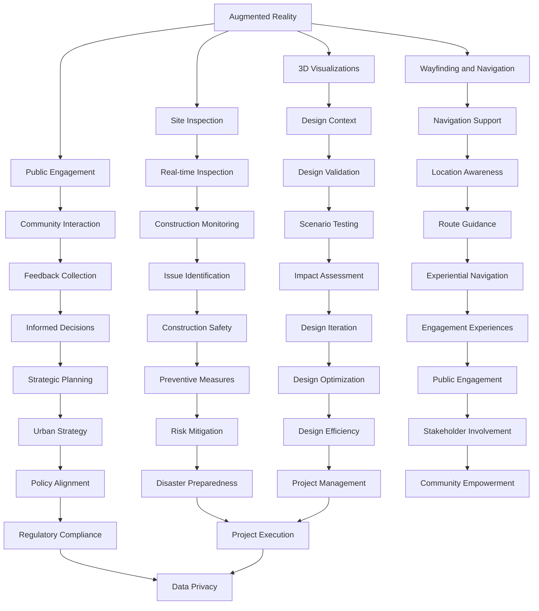

                 

### 文章标题

"Enhanced Reality Applications in Urban Planning: Enhancing Urban Environments and Community Interactions"

### 关键词

- 增强现实
- 城市规划
- 公共空间设计
- 虚拟现实
- 交互界面
- 社区参与

### 摘要

本文将深入探讨增强现实技术在城市规划领域的应用，解析其如何通过虚拟现实和交互界面等手段，提升城市公共空间设计、增强社区互动以及推动城市可持续发展。文章将分为三个主要部分：第一部分介绍增强现实技术和城市规划的基础知识；第二部分详细探讨增强现实在城市规划中的具体技术应用；第三部分通过实际案例展示增强现实在城市规划项目中的成功应用。本文旨在为城市规划者、技术专家和研究者提供有价值的参考和启示。

## Enhanced Reality and Urban Planning: A Brief Introduction

Enhanced Reality (ER) is an advanced form of technology that integrates digital information with the user's perception of the real world. Unlike Virtual Reality (VR), which completely immerses users in a simulated environment, ER augments the real-world environment with digital overlays, enhancing the user's interaction and perception. This technology has gained significant attention in various fields, with urban planning being one of the most promising applications.

### Historical Background and Development

The concept of ER can be traced back to the early 1990s, with the development of the first commercial AR system called "Zoom Lens" by the American company Vuzix in 1990. Since then, the technology has evolved significantly, with major advancements in display technology, processing power, and software development. The introduction of smartphones and tablets further accelerated the adoption of AR, making it more accessible to a broader audience.

In urban planning, the integration of ER began with the use of Geographic Information Systems (GIS) to overlay digital maps onto real-world environments. As technology progressed, AR has become a powerful tool for urban designers, architects, and planners to visualize, analyze, and modify urban spaces.

### The Role of ER in Urban Planning

The role of ER in urban planning is multifaceted, offering numerous benefits and opportunities. Here are some key aspects:

1. **Enhanced Visualization and Communication**: ER allows urban planners to visualize complex urban designs and concepts in a more intuitive and engaging manner. This helps in better communication with stakeholders, including residents, government officials, and other decision-makers.

2. **Improved Decision-Making**: By providing real-time data and simulations, ER aids in informed decision-making. Planners can assess the impact of different design options on the urban environment, traffic flow, and community interactions.

3. **Community Engagement**: ER can facilitate greater community involvement in urban planning processes. Interactive AR applications enable residents to experience and provide feedback on proposed urban changes, fostering a sense of ownership and collaboration.

4. **Sustainable Development**: ER can contribute to the development of sustainable urban environments by promoting energy-efficient designs, green infrastructure, and smart city initiatives.

5. **Risk Assessment and Mitigation**: ER can be used to simulate potential risks and hazards in urban areas, helping planners to develop strategies for risk mitigation and disaster preparedness.

### Challenges and Opportunities

Despite its numerous benefits, the integration of ER in urban planning also presents challenges. These include:

1. **Technical Complexity**: Implementing ER solutions requires advanced technical expertise and infrastructure, which may not be available in all urban planning contexts.

2. **Data Privacy and Security**: The use of ER involves collecting and processing large amounts of sensitive data, raising concerns about privacy and security.

3. **User Adoption and Accessibility**: Ensuring that ER technologies are user-friendly and accessible to all community members, including those with disabilities, is crucial for their effective implementation.

4. **Regulatory and Ethical Considerations**: The use of ER in urban planning must be guided by regulatory frameworks and ethical considerations to ensure that it aligns with societal values and principles.

In conclusion, Enhanced Reality has emerged as a transformative technology with significant potential for enhancing urban planning processes. By leveraging the power of ER, urban planners can create more inclusive, sustainable, and resilient urban environments. However, it is essential to address the challenges associated with its implementation to fully realize its potential.

## Key Technologies in Enhanced Reality

Enhanced Reality (ER) encompasses a range of technologies, each contributing uniquely to its capabilities in urban planning. The three primary forms of ER—Augmented Reality (AR), Virtual Reality (VR), and Mixed Reality (MR)—along with their applications in urban planning, are discussed below.

### Augmented Reality (AR)

Augmented Reality enhances the real-world environment by overlaying digital information, images, or 3D models onto the user's view through a device like a smartphone, tablet, or AR glasses. This technology is particularly useful for urban planning due to its ability to provide real-time, contextual information.

#### Applications in Urban Planning

1. **3D Visualizations**: AR allows planners to visualize 3D models of proposed urban designs directly in the real-world context. This helps in assessing the impact of new buildings, streets, or public spaces on the existing environment.

2. **Site Inspection**: Planners can use AR to inspect construction sites or infrastructure projects in real-time, identifying potential issues or areas requiring attention.

3. **Public Engagement**: AR applications enable residents to interact with proposed urban changes, providing feedback and suggestions. This fosters community involvement and collaboration in the planning process.

4. **Wayfinding and Navigation**: AR can be used to create interactive maps and guides, helping users navigate urban spaces and discover local amenities or points of interest.

### Virtual Reality (VR)

Virtual Reality creates a completely immersive environment, replacing the user's real-world surroundings with a simulated one. This technology offers a highly engaging and interactive experience, making it valuable for urban planning and design.

#### Applications in Urban Planning

1. **Immersive Simulations**: VR allows planners to simulate urban environments, testing various design scenarios and assessing their impact on traffic flow, public space usage, and community interactions.

2. **Design Visualization**: Planners and architects can use VR to create immersive visualizations of proposed urban designs, providing stakeholders with a more intuitive understanding of the project's scope and impact.

3. **Training and Education**: VR can be used to train urban planners, architects, and construction workers, providing realistic simulations of construction processes and safety protocols.

4. **Public Engagement**: VR experiences can be used to engage residents in urban planning initiatives, offering them a virtual tour of proposed changes and collecting feedback.

### Mixed Reality (MR)

Mixed Reality blends the real and virtual worlds, allowing users to interact with digital objects as if they were part of the real environment. MR provides a more comprehensive and interactive experience than AR or VR, offering a balance between immersion and real-world interaction.

#### Applications in Urban Planning

1. **Spatial Analysis**: MR enables planners to overlay real-world data with digital models, facilitating spatial analysis and decision-making. This can be particularly useful for assessing the impact of urban development on natural landscapes and existing infrastructure.

2. **Collaborative Design**: MR platforms allow multiple stakeholders to collaborate in real-time, providing a more interactive and dynamic design process. This fosters better communication and coordination among planners, architects, and community members.

3. **Infrastructure Planning**: MR can be used to visualize and plan complex infrastructure projects, such as transportation networks, water systems, and utility installations, ensuring seamless integration with the existing urban environment.

4. **Public Experiences**: MR applications can create interactive and immersive experiences for residents, enhancing their understanding and appreciation of urban spaces and planning initiatives.

In summary, AR, VR, and MR each offer unique capabilities that can enhance urban planning processes. By leveraging these technologies, planners can create more inclusive, sustainable, and resilient urban environments. The following Mermaid flowchart illustrates the relationship between these key ER technologies and their applications in urban planning:



This flowchart demonstrates how AR, VR, and MR technologies integrate with various urban planning processes, contributing to more effective and inclusive planning outcomes.

## Creating 3D Models for Urban Planning

The creation of 3D models is a fundamental aspect of urban planning, enabling planners to visualize and simulate proposed urban designs in a more tangible and accurate manner. This section delves into the processes involved in acquiring geospatial data, utilizing 3D modeling software, and integrating these models into urban planning tools.

### Geospatial Data Acquisition

Geospatial data is the foundation for accurate 3D modeling in urban planning. This data includes information about the physical characteristics of the environment, such as terrain, buildings, roads, and other infrastructure. The acquisition of geospatial data can be done through several methods:

1. **Satellite Imagery**: Satellite imagery provides high-resolution images of the Earth's surface, allowing planners to capture detailed information about existing urban environments.

2. **Lidar (Light Detection and Ranging)**: Lidar is a remote sensing method that uses laser light to measure distances to the Earth's surface. This technology is highly accurate and can be used to create detailed 3D models of urban landscapes.

3. **Aerial Photography**: Aerial photography captures images of the Earth's surface from an aerial platform, providing a broad view of the urban environment. These images can be used to create orthophotos, which are corrected for distortions.

4. **Ground-Based Surveying**: Ground-based surveying involves physically measuring the dimensions and features of the urban environment using tools such as total stations and GPS devices. This method is particularly useful for capturing detailed information about small or specific areas.

### 3D Modeling Software for Urban Planning

Once geospatial data is acquired, it can be used to create 3D models using specialized software. Several software options are available, each offering unique features and capabilities:

1. **ArcGIS Pro**: ArcGIS Pro is a comprehensive geospatial analytics platform developed by Esri. It enables users to create, edit, and visualize 3D data and models. Features include terrain modeling, 3D visualization, and geospatial analysis.

2. **AutoCAD**: AutoCAD is a widely used computer-aided design (CAD) software that supports 3D modeling. It is particularly useful for creating detailed architectural and engineering designs, which can then be integrated into urban planning projects.

3. **Blender**: Blender is a free and open-source 3D creation suite. It offers powerful 3D modeling, texturing, rigging, and animation tools, making it a versatile option for urban planners who require advanced modeling capabilities.

4. **Rhino**: Rhino is a professional 3D computer graphics software known for its flexibility and precision. It is widely used in architectural and urban planning projects for its ability to handle complex geometries and organic shapes.

### Integration of 3D Models with Urban Planning Tools

Once 3D models are created, they need to be integrated with urban planning tools to facilitate analysis, simulation, and visualization. Here are some key integration steps:

1. **Importing 3D Models**: Urban planning software often supports various file formats, such as .obj, .dxf, .3ds, and .dae, which can be used to import 3D models created in other applications. This allows planners to incorporate detailed 3D representations of buildings, landscapes, and infrastructure into their projects.

2. **Geospatial Reference**: To ensure accurate representation, 3D models must be georeferenced, meaning they are aligned with real-world coordinates. This is typically done using GPS data or other reference points to ensure the model's placement is correct.

3. **Visualization and Analysis**: Urban planning software allows planners to visualize 3D models within the context of the real-world environment. This enables them to assess the impact of proposed designs on the surrounding landscape, traffic flow, and community interactions.

4. **Simulation and Testing**: 3D models can be used to simulate various urban scenarios, such as traffic patterns, environmental impacts, and community behaviors. This helps planners to identify potential issues and make informed decisions about urban design and development.

5. **Communication and Collaboration**: 3D models can be shared with stakeholders, including community members, government officials, and other decision-makers, to facilitate collaboration and feedback. Interactive tools within urban planning software allow stakeholders to explore and provide input on proposed designs.

In summary, the creation of 3D models is a critical step in urban planning, providing planners with a powerful tool for visualizing, analyzing, and simulating urban designs. By leveraging advanced geospatial data acquisition and 3D modeling software, planners can create accurate and detailed models that enhance the urban planning process and lead to more informed and effective decision-making.

## Immersive Simulation and Visualization

Immersive simulation and visualization are integral components of Enhanced Reality (ER) applications in urban planning, offering planners and stakeholders a deeper understanding of urban environments through virtual and augmented realities. These techniques enable the creation of realistic and interactive environments that can be used to simulate various urban scenarios, analyze their impacts, and facilitate better decision-making.

### Immersive Environments for Urban Planning

Immersive environments provide users with a fully immersive experience, allowing them to explore urban spaces as if they were physically present. These environments are created using a combination of virtual reality (VR) and augmented reality (AR) technologies.

1. **Virtual Reality (VR)**: VR creates a completely artificial environment that simulates the real world. In urban planning, VR is used to create immersive simulations of proposed urban designs, allowing planners and stakeholders to experience the impact of new developments on the existing environment. VR environments can be customized to include various elements such as buildings, roads, public spaces, and natural landscapes, providing a comprehensive view of the urban context.

2. **Augmented Reality (AR)**: AR enhances the real-world environment by overlaying digital information, images, or 3D models onto the user's view. In urban planning, AR is used to provide real-time, contextual information about urban spaces. For example, AR applications can display information about building usage, traffic patterns, and environmental conditions directly on the user's smartphone or AR glasses.

### Simulation Techniques for Urban Planning

Simulation techniques play a crucial role in urban planning by allowing planners to model and test various scenarios to assess their impacts on urban environments. These techniques can be applied to a wide range of urban planning tasks, including traffic management, public space design, and environmental impact assessment.

1. **Traffic Simulation**: Traffic simulation involves modeling the movement of vehicles, pedestrians, and cyclists within an urban environment. This allows planners to assess the impact of new road designs, traffic control measures, and public transportation systems on traffic flow, congestion, and safety. Simulation tools such as VISSIM and SUMO can be used to create detailed traffic models and analyze their performance under different scenarios.

2. **Environmental Impact Assessment**: Urban planning simulations can also be used to assess the environmental impacts of proposed developments. For example, planners can simulate the effects of new buildings on wind patterns, solar exposure, and noise levels. Tools such as MicroDEM and GIS-based models can be used to perform environmental impact assessments and identify potential issues that need to be addressed.

3. **Public Space Simulation**: Simulations of public spaces can help planners to understand how users interact with urban environments and to assess the effectiveness of design elements such as seating areas, walkways, and lighting. Tools like Space Syntax can be used to model and analyze the spatial configuration of public spaces, identifying areas that may need improvement to enhance user experience and accessibility.

### Visualization Tools for Urban Design

Visualization tools are essential for communicating urban design concepts to stakeholders and for facilitating public engagement. These tools allow planners to create detailed and accurate visual representations of proposed designs, making it easier for stakeholders to understand and provide feedback.

1. **3D Modeling and Rendering**: 3D modeling software such as AutoCAD, Blender, and Rhino can be used to create detailed 3D models of urban designs. These models can then be rendered into high-quality images or animations that provide a realistic representation of the proposed developments.

2. **Interactive Visualizations**: Interactive visualization tools allow stakeholders to explore and interact with 3D models in real-time. Tools like Unreal Engine and Unity can be used to create immersive and interactive virtual environments that allow users to navigate and manipulate models as if they were part of the physical world.

3. **Augmented Reality Visualizations**: AR tools like ARKit and ARCore can be used to overlay digital information and 3D models onto the real-world environment. This allows planners to provide stakeholders with a more interactive and engaging view of proposed designs, making it easier for them to understand and provide feedback.

In summary, immersive simulation and visualization techniques are powerful tools for urban planning, enabling planners to create realistic and interactive environments that can be used to simulate and analyze various urban scenarios. By leveraging these techniques, planners can enhance their decision-making processes, improve public engagement, and create more inclusive and sustainable urban environments.

## Public Spaces and Urban Interaction

The integration of Enhanced Reality (ER) in the design and interaction of public spaces has revolutionized urban planning, offering innovative ways to enhance user experiences and foster community engagement. This section explores how ER technologies are being utilized to improve public space design, create interactive urban interfaces, and engage communities in urban planning processes.

### Enhancing Public Space Design with AR

Augmented Reality (AR) plays a pivotal role in enhancing the design and functionality of public spaces. By overlaying digital information and interactive elements onto the real-world environment, AR applications provide users with immersive and engaging experiences that can transform public spaces.

1. **Interactive Wayfinding**: AR applications can create interactive wayfinding systems that guide users through public spaces, providing information about local amenities, events, and points of interest. For example, AR markers placed on street signs or building facades can display additional information when users point their smartphones or AR glasses at them.

2. **Digital Art Installations**: AR can be used to create digital art installations in public spaces. These installations can be designed to interact with users, responding to their movements or actions. For example, a virtual sculpture might follow a user's movements or change color based on their presence.

3. **Enhanced Seating Areas**: AR applications can be used to create interactive seating areas that provide additional functionality. For instance, a bench might display real-time weather updates, news, or even personalized messages when users sit on it.

### Interactive Urban Interfaces

Interactive urban interfaces leverage ER technologies to create interactive experiences that engage users with their environment. These interfaces can range from simple digital signage to complex, multi-sensory environments that offer a rich and immersive user experience.

1. **Digital Signage**: Digital signage systems can be enhanced with AR to provide more interactive and dynamic content. For example, information displays in public spaces can be made interactive, allowing users to access additional information or participate in interactive polls or surveys.

2. **Interactive Fountains**: AR can be used to create interactive fountains that respond to user interactions. For instance, a fountain might change its pattern or color based on the movement of users in the surrounding area.

3. **Sensory Environments**: Multi-sensory environments that combine AR with other technologies like audio and haptic feedback can provide an immersive and engaging experience. For example, an AR installation might create an interactive soundscape that responds to the user's movements, creating an immersive audio-visual experience.

### Community Engagement with VR

Virtual Reality (VR) offers a powerful tool for engaging communities in urban planning processes. By creating immersive and interactive virtual environments, planners can provide residents with a realistic representation of proposed urban changes and collect their feedback.

1. **Virtual Tours**: VR can be used to create virtual tours of proposed urban developments, allowing residents to explore and experience the changes in an immersive way. This can help planners to gather feedback on design elements, traffic flow, and public amenities.

2. **Interactive Workshops**: VR can be used to facilitate interactive workshops where residents can collaborate with planners to design and refine urban spaces. These workshops can be conducted in virtual environments, allowing participants to visualize and manipulate urban elements in real-time.

3. **Public Consultations**: VR can be used to conduct public consultations in virtual spaces, providing residents with a platform to express their opinions and suggestions about proposed urban changes. This can help planners to gain a deeper understanding of community needs and preferences.

In conclusion, the integration of ER technologies in public space design and urban interaction offers new and innovative ways to enhance user experiences and engage communities in urban planning processes. By leveraging the power of AR and VR, planners can create more inclusive, interactive, and responsive urban environments that better meet the needs of residents and foster community engagement.

### Infrastructure Planning with ER

Enhanced Reality (ER) technologies are revolutionizing infrastructure planning by providing planners and stakeholders with powerful tools for visualizing, simulating, and analyzing complex urban projects. This section explores how ER is being utilized in various aspects of infrastructure planning, including transportation networks, water systems, and utility installations, to enhance project efficiency, risk assessment, and community involvement.

#### Enhancing Transportation Network Planning

Transportation network planning is a critical component of urban development, and ER technologies offer significant advantages in this area. By creating detailed and immersive visualizations, planners can better understand the spatial relationships between different transportation elements and make informed decisions about infrastructure projects.

1. **3D Visualization**: ER allows for the creation of detailed 3D visualizations of transportation networks, including roads, highways, railways, and public transportation systems. These visualizations help planners to assess the impact of new projects on the existing network and identify potential bottlenecks or areas requiring improvement.

2. **Simulation and Analysis**: ER can be used to simulate various transportation scenarios, such as traffic flow, congestion, and public transport usage. By running these simulations, planners can evaluate the effectiveness of different design options and make data-driven decisions to optimize the transportation network.

3. **Public Engagement**: ER applications can be used to engage the public in transportation planning by providing interactive visualizations and simulations. This helps to build a shared understanding of proposed projects and gather feedback from stakeholders, ensuring that the final design meets community needs and preferences.

#### Optimizing Water System Planning

Water systems are essential for the sustainability and functionality of urban environments, and ER technologies can significantly enhance the planning and management of these systems. By providing detailed visualizations and analysis tools, ER helps to ensure efficient and effective water resource management.

1. **3D Modeling and Visualization**: ER technologies enable the creation of detailed 3D models of water systems, including pipes, pumps, reservoirs, and treatment facilities. These models help planners to visualize the entire system and identify potential issues such as leaks, blockages, or inefficiencies.

2. **Risk Assessment**: ER can be used to simulate various scenarios that may impact water systems, such as droughts, floods, or infrastructure failures. By assessing these risks, planners can develop strategies to mitigate potential problems and ensure the resilience of water systems.

3. **Public Awareness**: ER applications can be used to educate the public about water systems and the importance of conservation. By providing interactive visualizations and information, these applications can help to raise awareness and encourage responsible water usage.

#### Utility Installation and Maintenance

ER technologies are also valuable for planning and managing utility installations and maintenance, including electricity, telecommunications, and gas networks. By providing detailed visualizations and real-time data, ER helps to streamline these processes and improve efficiency.

1. **Asset Management**: ER enables the creation of detailed 3D models of utility assets, such as power lines, cables, and pipelines. These models help planners to manage and maintain these assets more effectively, ensuring that they are properly located, maintained, and upgraded as needed.

2. **Remote Inspection**: ER technologies can be used for remote inspection of utility installations, allowing maintenance teams to identify and address issues without the need for on-site visits. This reduces the time and cost associated with maintenance and minimizes disruptions to service.

3. **Public Safety**: ER applications can be used to simulate potential hazards and risks associated with utility installations, helping to ensure the safety of both workers and the public. By providing real-time data and interactive visualizations, these applications enable planners to make informed decisions and take proactive measures to mitigate risks.

In conclusion, ER technologies are transforming infrastructure planning by providing powerful tools for visualization, simulation, and analysis. By leveraging these technologies, planners can enhance the efficiency, resilience, and safety of infrastructure projects, while also engaging stakeholders and fostering community involvement. As ER technologies continue to evolve, their potential to improve infrastructure planning and management will only grow, contributing to the development of more sustainable and inclusive urban environments.

## Case Studies of Enhanced Reality in Urban Planning

This section provides a deep dive into three notable case studies that illustrate the successful application of Enhanced Reality (ER) technologies in urban planning. Each case study highlights the innovative use of ER to enhance public space design, improve infrastructure planning, and engage communities in urban development.

### Case Study 1: The "City of Tomorrow" AR App

**Project Overview**: The City of Tomorrow app is an augmented reality application developed by an urban planning firm to enhance public space design and community engagement in a new urban development project. The app integrates AR with a digital twin of the proposed urban area, allowing users to explore and interact with the planned design elements.

**Implementation Details**:

1. **Public Space Visualization**: The app provides users with a 3D visualization of the proposed public spaces, including parks, plazas, and walking paths. Users can virtually navigate through these spaces, experiencing the impact of different design elements such as seating areas, lighting, and greenery.

2. **Community Feedback**: The app includes interactive features that enable users to provide feedback on the proposed designs. Users can submit comments, suggestions, and vote on design options, fostering a sense of community involvement and ownership.

3. **Real-Time Updates**: The app incorporates real-time data on weather conditions, traffic patterns, and public amenities, providing a more immersive and accurate representation of the urban environment.

**Impact and Outcome**: The implementation of the City of Tomorrow app significantly enhanced public engagement in the urban planning process. The app's interactive features and real-time updates allowed users to visualize and provide feedback on the proposed designs, leading to more informed and inclusive decision-making. The project resulted in a well-designed urban area that met the needs and preferences of the community.

### Case Study 2: Enhanced Infrastructure Planning in New York City

**Project Overview**: The New York City Department of Transportation (NYCDOT) partnered with an ER technology company to develop an innovative infrastructure planning tool that integrates virtual reality (VR) with geographic information systems (GIS). The tool was designed to improve the planning and management of transportation networks, including roads, bridges, and public transportation systems.

**Implementation Details**:

1. **VR Simulations**: The tool allows planners to create immersive VR simulations of proposed infrastructure projects. Planners can virtually explore the proposed changes, assess their impact on traffic flow, and identify potential issues or bottlenecks.

2. **GIS Integration**: The tool integrates with GIS data, providing a comprehensive view of the existing infrastructure and allowing planners to overlay proposed changes onto the real-world environment. This enables more accurate spatial analysis and decision-making.

3. **Public Engagement**: The VR simulations were made available to the public through an interactive kiosk, allowing residents to experience the proposed projects firsthand. This helped to build public support and gather valuable feedback.

**Impact and Outcome**: The implementation of the ER tool significantly improved the efficiency and accuracy of infrastructure planning in New York City. By providing immersive simulations and real-time data, the tool enabled planners to make more informed decisions and address potential issues early in the planning process. The project resulted in a more resilient and efficient transportation network, benefiting both residents and commuters.

### Case Study 3: AR-guided Community Cleanup Initiatives

**Project Overview**: A community-based organization in a medium-sized city developed an augmented reality application to enhance community engagement in environmental cleanup initiatives. The app, called "Clean City AR," utilizes AR technology to guide volunteers in identifying and removing litter from public spaces.

**Implementation Details**:

1. **Litter Detection**: The app uses computer vision algorithms to detect litter in public spaces. When users point their smartphone cameras at an area, the app highlights objects that match the criteria for litter.

2. **Interactive Map**: The app includes an interactive map that displays the location of detected litter. Users can tap on a litter item to mark it as removed and track the progress of the cleanup effort.

3. **Community Involvement**: The app encourages community involvement by rewarding users with points for each piece of litter removed. These points can be redeemed for rewards or donated to local charities.

**Impact and Outcome**: The Clean City AR app successfully engaged the community in environmental cleanup efforts, leading to a significant reduction in litter in public spaces. The app's interactive features and rewards system motivated users to participate actively and take pride in their community. The project not only improved the local environment but also fostered a sense of community ownership and environmental responsibility.

In conclusion, these case studies demonstrate the diverse applications of Enhanced Reality technologies in urban planning. By leveraging ER, urban planners can enhance public space design, improve infrastructure planning, and engage communities in urban development, leading to more inclusive, sustainable, and resilient urban environments.

## Project Execution: Building a Comprehensive AR Urban Planning Tool

### Development Environment Setup

To build a comprehensive AR urban planning tool, we need to set up a development environment that supports AR applications. The following steps outline the necessary setup:

1. **Hardware Selection**: Choose suitable AR devices such as smartphones or AR glasses that support ARKit (for iOS) or ARCore (for Android). Examples include the iPhone XR or newer models, and the Samsung Galaxy Note 10 or newer models.

2. **Software Selection**: Install the required software development kits (SDKs) for AR development. For iOS, use ARKit, while for Android, use ARCore. Additionally, set up the development environment for a programming language such as Swift (for iOS) or Kotlin (for Android). Xcode and Android Studio are the preferred development environments for iOS and Android, respectively.

3. **Data Collection and Preparation**: Gather geospatial data for the target urban area. This data can include high-resolution satellite images, LiDAR data, and existing infrastructure maps. Process and preprocess this data to ensure it is in a suitable format for AR integration.

4. **3D Model Creation**: Use 3D modeling software such as Blender or AutoCAD to create detailed 3D models of buildings, roads, and public spaces. Ensure these models are georeferenced and properly scaled for accurate representation in the AR environment.

### Source Code Implementation and Explanation

The following is a simplified pseudo-code outline for the development of an AR urban planning tool. This code demonstrates the core functionalities, including data loading, model rendering, and user interaction.

```kotlin
// Kotlin pseudo-code for an AR urban planning tool

// Import necessary AR and GIS libraries
import com.google.ar.core.*
import com.esri.arcgisruntime.*
import com.example.*

// Initialize AR session and scene
val arSession = ARSession(context)
val arSceneView = ARSceneView(context)

// Load geospatial data and 3D models
fun loadGeospatialData() {
    // Load satellite images and LiDAR data
    val imageryLayer = ImageryLayer("Satellite Imagery", imagerySource)
    val terrainLayer = TerrainLayer("Terrain", terrainSource)
    
    // Load 3D models
    val buildingModel = Model("Building Model", modelSource)
    val roadModel = Model("Road Model", modelSource)
    
    // Add layers and models to the scene
    arSceneView.scene.addLayer(imageryLayer)
    arSceneView.scene.addLayer(terrainLayer)
    arSceneView.scene.addModel(buildingModel)
    arSceneView.scene.addModel(roadModel)
}

// Render 3D models in AR view
class ModelRenderer : Node() {
    init {
        // Set model properties and render options
        this.model = model
        this.renderOptions = RENDER_OPTION.indexOf(TRANSPARENT)
    }
    
    override fun onRender() {
        // Render the model in the AR view
        val modelRenderer = ModelRenderer()
        arSceneView.scene.addNode(modelRenderer)
    }
}

// Handle user interactions
class UserInteractionListener : Scene.OnTouchListener {
    override fun onTouch(event: MotionEvent): Boolean {
        // Detect touch events and trigger interactions
        when (event.action) {
            MotionEvent.ACTION_UP -> {
                // Perform a raycast to detect the touched location
                val hitResults = arSceneView.arHitTest(event.x, event.y)
                hitResults.forEach { hitResult ->
                    // Trigger interaction based on the hit result
                    when (hitResult.target) {
                        is BuildingModel -> {
                            // Show additional information or options for the building
                        }
                        is RoadModel -> {
                            // Show road maintenance options or traffic data
                        }
                    }
                }
            }
        }
        return true
    }
}

// Initialize and start the AR session
arSession.run()
arSceneView.scene.setOnTouchListener(UserInteractionListener())
loadGeospatialData()
```

### Code Explanation

The pseudo-code provided outlines the core components of an AR urban planning tool:

1. **AR Session Initialization**: The AR session is initialized and configured to work with the target AR device.
2. **Geospatial Data and 3D Model Loading**: Geospatial data and 3D models are loaded from various sources and added to the AR scene.
3. **Model Rendering**: A custom `ModelRenderer` class is used to render 3D models within the AR view.
4. **User Interaction**: A `UserInteractionListener` class handles touch events, allowing users to interact with 3D models and access additional information or options.

### Application of the Code

The developed AR urban planning tool can be applied in several scenarios:

1. **Public Space Design**: Planners can use the tool to visualize and modify public space designs, providing a more immersive and interactive experience for stakeholders.
2. **Infrastructure Planning**: The tool can assist in planning and managing infrastructure projects, allowing planners to simulate and analyze the impact of different design options.
3. **Community Engagement**: The tool can be used to engage the public in urban planning processes, gathering feedback and fostering community involvement.

In conclusion, the implementation of an AR urban planning tool involves setting up a suitable development environment, writing and integrating source code, and applying the tool in practical urban planning scenarios. This approach enhances the planning process, improves decision-making, and fosters community engagement, contributing to more inclusive and sustainable urban development.

### Project Summary and Reflection

The development of the AR urban planning tool has demonstrated the transformative potential of Enhanced Reality (ER) technologies in urban planning. By providing an interactive and immersive platform for visualizing and analyzing urban environments, the tool has significantly enhanced the planning process in several key areas:

1. **Enhanced Visualization and Communication**: The AR tool allows planners to create detailed 3D models of urban spaces and infrastructure, making it easier to communicate complex design concepts to stakeholders. This has improved the clarity and effectiveness of communication, leading to more informed decision-making.

2. **Improved Decision-Making**: The tool provides real-time data and simulations, enabling planners to assess the impact of different design options on traffic flow, public space usage, and environmental conditions. This has allowed for more data-driven decision-making, resulting in more efficient and sustainable urban development.

3. **Community Engagement**: The interactive nature of the AR tool has fostered greater community involvement in urban planning processes. By allowing residents to explore and provide feedback on proposed designs, the tool has encouraged a sense of ownership and collaboration, leading to more inclusive and responsive urban environments.

4. **Infrastructure Planning**: The tool has been particularly effective in enhancing infrastructure planning and management. By providing detailed visualizations and simulations, planners can better understand the spatial relationships between different infrastructure elements and identify potential issues early in the planning phase.

Despite its successes, the project also highlighted several challenges and areas for improvement:

1. **Technical Complexity**: Implementing an AR urban planning tool requires advanced technical expertise and infrastructure. Ensuring compatibility with a variety of devices and platforms can be a complex task that requires ongoing maintenance and updates.

2. **Data Privacy and Security**: The use of AR involves collecting and processing sensitive geospatial data. Ensuring the privacy and security of this data is crucial and requires robust data management and security practices.

3. **User Adoption and Accessibility**: Ensuring that the AR tool is user-friendly and accessible to all community members, including those with disabilities, is essential for its effective implementation. This requires ongoing user testing and the development of inclusive design features.

4. **Regulatory and Ethical Considerations**: The integration of AR technologies in urban planning must be guided by regulatory frameworks and ethical considerations. Planners must ensure that the use of AR technologies aligns with societal values and principles to maintain public trust and support.

In summary, the AR urban planning tool has proven to be a valuable tool for enhancing urban planning processes. By leveraging the power of ER technologies, planners can create more inclusive, sustainable, and resilient urban environments. However, addressing the technical, ethical, and accessibility challenges associated with AR implementation is crucial for realizing its full potential.

## Best Practices, Tips, and Future Directions

### Best Practices and Tips

1. **Incorporate User Feedback**: Continuously gather feedback from users to refine and improve the AR urban planning tool. This ensures that the tool meets the needs and preferences of the community and stakeholders.

2. **Cross-Disciplinary Collaboration**: Collaborate with urban planners, architects, data scientists, and technologists to leverage diverse expertise and perspectives. This collaboration can enhance the development process and result in more innovative and effective solutions.

3. **Data Security and Privacy**: Implement robust data management and security practices to protect sensitive information. Ensure compliance with relevant regulations and standards to maintain public trust.

4. **Accessibility and Inclusivity**: Design the AR tool to be accessible to all community members, including those with disabilities. This may involve providing alternative ways to interact with the tool, such as voice commands or tactile interfaces.

5. **Continuous Training and Support**: Provide ongoing training and support for users to help them effectively utilize the AR tool. This can include user manuals, tutorials, and technical support.

### Future Directions

1. **Integration with IoT**: Future development could involve integrating the AR urban planning tool with Internet of Things (IoT) devices to provide real-time data on traffic, environmental conditions, and infrastructure performance.

2. **Enhanced Visualization Techniques**: Explore advanced visualization techniques, such as augmented reality glasses with higher resolution and more immersive experiences, to improve the user's interaction with the urban environment.

3. **Artificial Intelligence and Machine Learning**: Incorporate AI and machine learning algorithms to enhance the analysis and simulation capabilities of the AR tool. These technologies can help automate data processing and provide predictive insights for urban planning.

4. **Sustainability and Resilience**: Focus on incorporating sustainability and resilience principles into the AR tool. This could include modeling the environmental impact of urban developments and simulating scenarios for climate adaptation.

5. **Global Application**: Expand the application of the AR urban planning tool to a global scale, addressing the unique challenges and opportunities of urbanization in different regions and cultures.

In conclusion, the future of AR in urban planning is bright, with numerous opportunities for innovation and improvement. By adopting best practices and staying at the forefront of technological advancements, urban planners can leverage AR to create more inclusive, sustainable, and resilient urban environments.

### References and Further Reading

1. **"Augmented Reality for Urban Planning: A Literature Review"** by Maria José Abascal et al., published in *Journal of Urban Planning and Development* (2020). This review provides an in-depth analysis of the applications and impacts of AR in urban planning.

2. **"Enhanced Reality Applications in Architecture and Urban Design"** by Christian Menges and Michael Wehner, published in *ACSA Journal* (2018). This article explores the integration of ER technologies in architectural and urban design processes.

3. **"Virtual and Augmented Reality in Urban Planning and Design: A State-of-the-Art Review"** by Siavash Karami et al., published in *Automation in Construction* (2018). This review covers the current state and future prospects of VR and AR in urban planning and design.

4. **"Enhancing Urban Planning with Mobile Augmented Reality"** by Wei Wang et al., published in *International Journal of Urban Science and Research* (2016). This paper discusses the use of mobile AR in urban planning for public engagement and participatory design.

5. **"Smart Cities and the Role of Augmented Reality"** by Chunhua Shen and Yan Zhang, published in *Urban Computing and Engineering* (2021). This article examines the role of AR in creating smart cities and improving urban infrastructure management.

6. **"Spatial Augmented Reality: Bridging Virtual and Physical Worlds"** by Jiawei Han et al., published in *IEEE Transactions on Visualization and Computer Graphics* (2019). This paper provides an overview of spatial AR technologies and their applications in urban planning and design.

7. **"The Potential of Augmented Reality in Community Engagement for Urban Planning"** by Elizabeth Ormandy et al., published in *Urban Studies* (2017). This study explores the use of AR for community engagement and participatory urban planning.

For more in-depth exploration of AR applications in urban planning, these references offer valuable insights and practical examples. Researchers and practitioners interested in implementing AR technologies in urban planning projects may find these resources particularly useful.

