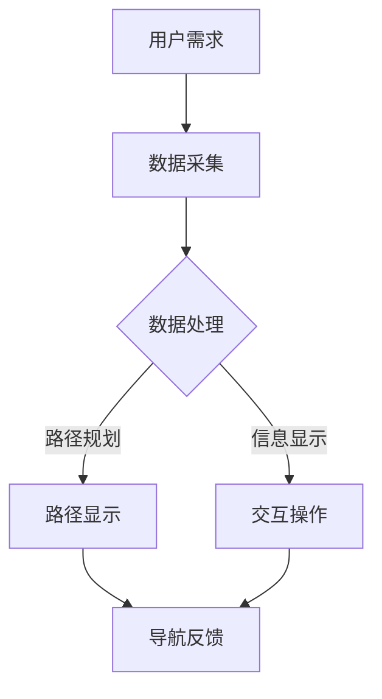

                 

### 文章标题

### 增强现实在室内导航中的精确应用

---

#### 关键词：增强现实，室内导航，精确应用，感知与定位技术，路径规划算法，交互算法，项目实战

---

#### 摘要：

随着室内空间的复杂性和用户需求的多样性，增强现实（AR）技术在室内导航中的应用逐渐成为研究热点。本文首先介绍了增强现实和室内导航的基本概念，探讨了两者之间的联系与融合。接着，详细分析了增强现实在室内导航中的核心概念，包括感知与定位技术、路径规划算法和交互算法，并通过Mermaid流程图和伪代码阐述了相关算法原理。此外，本文还通过实际项目实战，展示了增强现实在室内导航中的具体应用和开发过程，并对未来的发展趋势进行了展望。通过本文的探讨，希望能够为相关领域的研究者提供一些有益的参考和启示。

---

### 核心概念与联系

#### 1.1 增强现实的定义与基本原理

增强现实（Augmented Reality，AR）是一种通过计算机技术模拟虚拟信息与真实世界进行交互的技术。AR技术将计算机生成的三维虚拟图像、声音、视频等信息叠加到真实环境中，从而提供一种虚实融合的体验。AR系统通常由以下几个关键组件构成：

1. **输入设备**：如摄像头、传感器等，用于捕捉真实环境的信息。
2. **处理单元**：对输入设备采集到的信息进行处理，包括图像处理、传感器数据融合等。
3. **显示设备**：如AR眼镜、头戴显示器等，用于将虚拟信息叠加到真实环境中。
4. **交互设备**：如触摸屏、手势识别设备等，用于用户与虚拟信息的交互。

增强现实的基本原理包括以下几个步骤：

1. **环境感知**：利用输入设备捕捉真实环境的信息，如摄像头捕捉图像、传感器收集环境数据等。
2. **信息融合**：将捕捉到的真实环境信息与计算机生成的虚拟信息进行融合，形成虚实融合的视觉或听觉体验。
3. **显示与交互**：通过显示设备将融合后的信息呈现给用户，并通过交互设备实现用户与虚拟信息的互动。

#### 1.2 室内导航的定义与需求

室内导航是指在室内环境中为用户提供定位、路径规划、信息查询等服务的技术。随着城市化进程的加快和室内空间的日益复杂，室内导航在商业、医疗、教育等领域具有广泛的应用需求。室内导航的关键需求包括：

1. **精确定位**：室内导航系统需要能够准确地确定用户的位置，以便提供准确的路径规划和信息服务。
2. **路径规划**：系统应能够为用户提供从起点到终点的最佳路径，同时考虑楼层、障碍物等因素。
3. **信息查询**：系统应能够为用户提供丰富的室内信息，如商店、卫生间、出口等位置信息。
4. **实时更新**：室内导航系统应能够实时更新用户的位置信息，以及路径规划结果，以适应环境变化。

#### 1.3 增强现实在室内导航中的优势

增强现实技术在室内导航中的应用具有以下几个显著优势：

1. **提高导航精度**：增强现实技术能够通过定位和感知技术实现对室内环境的精确识别，从而提高导航的准确性。
2. **虚实融合体验**：增强现实技术能够将导航信息直观地展示在用户眼前，提供更加丰富的导航体验。
3. **交互性**：增强现实技术支持用户与导航信息之间的实时互动，提高导航的便捷性和实用性。

此外，增强现实技术还能够通过以下方式优化室内导航：

1. **实时语音引导**：通过语音识别和合成技术，实现实时语音导航，提高导航的便捷性。
2. **多人协作**：通过增强现实技术实现多人实时协作，为团队导航和协作提供支持。
3. **自适应导航**：根据用户行为和环境变化，实时调整导航策略，提高导航的适应性。

### 1.4 增强现实在室内导航中的应用场景

增强现实技术在室内导航中具有广泛的应用场景，以下是一些典型应用：

#### 1.4.1 商业场所

在商场、展览馆等商业场所，增强现实技术可以提供精准的室内导航服务。例如，用户可以通过AR眼镜查看商场布局、商品信息、促销活动等，从而提高购物体验。同时，商家可以利用AR技术进行店铺营销和推广，吸引更多消费者。

#### 1.4.2 医疗机构

在医疗机构如医院、诊所等，增强现实技术可以为医护人员提供室内导航服务。例如，医生可以通过AR眼镜快速找到患者所在位置，提高诊疗效率。此外，AR技术还可以用于手术导航，为医生提供实时、准确的手术信息，降低手术风险。

#### 1.4.3 教育场所

在教育场所如学校、培训机构等，增强现实技术可以为学生提供有趣的导航体验。例如，学生可以通过AR设备参观校园、了解教室布局、查找教学资源等，从而提高学习兴趣和参与度。

#### 1.4.4 企业办公楼

在企业办公楼，增强现实技术可以为员工提供便捷的室内导航服务。例如，员工可以通过AR眼镜快速找到会议室、同事的位置，提高工作效率。此外，AR技术还可以用于安全培训和应急演练，提高员工的安全意识。

### 1.5 增强现实在室内导航中的技术挑战与解决方案

尽管增强现实技术在室内导航中具有显著优势，但其应用也面临一系列技术挑战。以下是一些主要的技术挑战及其解决方案：

#### 1.5.1 感知与定位技术

增强现实在室内导航中的核心挑战是实现对室内环境的精确感知和定位。常用的技术包括：

1. **室内定位算法**：如基于Wi-Fi、蓝牙、视觉的定位算法。这些算法需要考虑室内环境复杂、信号干扰等因素，以提高定位精度。
2. **多传感器融合**：通过融合不同传感器的数据，如摄像头、GPS、惯性传感器等，提高定位系统的鲁棒性和精度。

#### 1.5.2 虚拟信息显示与交互

在室内导航中，如何将虚拟信息准确、直观地显示在用户眼前，并提供便捷的交互操作，是增强现实技术的关键问题。解决方案包括：

1. **增强现实界面设计**：设计直观、易用的增强现实界面，使用户能够快速理解和使用导航信息。
2. **手势识别与语音控制**：利用手势识别和语音控制技术，提高用户与增强现实系统之间的交互性。

#### 1.5.3 数据处理与传输

室内导航系统需要处理大量的定位、路径规划等数据，同时需要保证数据传输的实时性和可靠性。解决方案包括：

1. **边缘计算**：通过在靠近数据源的边缘设备上进行数据处理，减少数据传输延迟和带宽占用。
2. **数据压缩与传输优化**：采用数据压缩和传输优化技术，提高数据传输效率。

#### 1.5.4 系统集成与优化

增强现实室内导航系统需要与其他系统（如安防、监控等）进行集成，实现功能互补和资源优化。解决方案包括：

1. **模块化设计**：采用模块化设计，将不同功能模块进行独立开发、测试和部署，提高系统的灵活性和可维护性。
2. **系统性能优化**：通过优化算法、硬件升级等手段，提高系统的性能和稳定性。

### 1.6 增强现实在室内导航中的未来发展趋势

随着科技的不断发展，增强现实在室内导航中的应用前景将更加广阔。未来发展趋势包括：

1. **智能化与个性化**：通过人工智能技术，实现更加智能化和个性化的室内导航服务，满足用户多样化需求。
2. **实时性与高精度**：随着感知与定位技术的进步，室内导航系统的实时性和高精度将得到显著提升。
3. **跨界融合**：增强现实技术将与其他领域（如物联网、虚拟现实等）进行融合，推动室内导航技术的创新发展。

通过本文的探讨，我们希望为相关领域的研究者和开发者提供一些有益的参考和启示，共同推动增强现实在室内导航领域的应用与发展。

---

### Mermaid 流程图



---

### 核心算法原理讲解

#### 1.1.1 室内定位算法

室内定位算法是增强现实在室内导航中的关键技术之一。常用的室内定位算法包括基于Wi-Fi的定位算法、基于蓝牙的定位算法和基于视觉的定位算法。以下是这些算法的原理和实现方法：

1. **基于Wi-Fi的定位算法**：

   - **原理**：Wi-Fi定位算法利用Wi-Fi信号强度（RSSI）进行定位。通过测量多个已知位置处的Wi-Fi信号强度，并利用三角测量法计算用户的位置。
   - **实现方法**：
     ```python
     # 伪代码
     def calculate_position(rssi_values, reference_points):
         # 计算用户位置
         positions = []
         for rssi in rssi_values:
             position = triangle_measure(rssi, reference_points)
             positions.append(position)
         return positions
     ```

2. **基于蓝牙的定位算法**：

   - **原理**：蓝牙定位算法利用蓝牙信标（iBeacon）进行定位。通过测量多个已知位置的蓝牙信标的信号强度，并利用三角测量法计算用户的位置。
   - **实现方法**：
     ```python
     # 伪代码
     def calculate_position(beacon_signal_strengths, beacon_locations):
         # 计算用户位置
         positions = []
         for beacon_signal_strength in beacon_signal_strengths:
             position = triangle_measure(beacon_signal_strength, beacon_locations)
             positions.append(position)
         return positions
     ```

3. **基于视觉的定位算法**：

   - **原理**：视觉定位算法利用摄像头捕捉室内环境中的特征点进行定位。通过识别特征点并计算它们之间的相对位置，确定用户的位置。
   - **实现方法**：
     ```python
     # 伪代码
     def calculate_position(feature_points, reference_points):
         # 计算用户位置
         positions = []
         for feature_point in feature_points:
             position = find_relative_position(feature_point, reference_points)
             positions.append(position)
         return positions
     ```

#### 1.1.2 路径规划算法

路径规划算法是室内导航系统的核心模块，常用的路径规划算法包括A*算法、Dijkstra算法和遗传算法等。以下是这些算法的原理和实现方法：

1. **A*算法**：

   - **原理**：A*算法是一种基于启发式的搜索算法。它通过计算起点到每个节点的估计距离（heuristic）和实际距离（cost），找到从起点到终点的最短路径。
   - **实现方法**：
     ```python
     # 伪代码
     def a_star(start, goal, heuristic):
         # 找到起点到终点的最短路径
         open_set = PriorityQueue()
         open_set.put((heuristic(start, goal), start))
         came_from = {}
         cost_so_far = {}
         cost_so_far[start] = 0
         while not open_set.empty():
             current = open_set.get()
             if current == goal:
                 break
             for neighbor in neighbors(current):
                 new_cost = cost_so_far[current] + distance(current, neighbor)
                 if new_cost < cost_so_far.get(neighbor(), float('inf')):
                     cost_so_far[neighbor] = new_cost
                     priority = new_cost + heuristic(neighbor, goal)
                     open_set.put((priority, neighbor))
                     came_from[neighbor] = current
         return reconstruct_path(came_from, goal)
     ```

2. **Dijkstra算法**：

   - **原理**：Dijkstra算法是一种基于最短路径的搜索算法。它通过逐步扩展当前节点，找到从起点到终点的最短路径。
   - **实现方法**：
     ```python
     # 伪代码
     def dijkstra(start, goal, graph):
         # 找到起点到终点的最短路径
         distances = {node: float('infinity') for node in graph}
         distances[start] = 0
         priority_queue = PriorityQueue()
         priority_queue.put((0, start))
         while not priority_queue.empty():
             current = priority_queue.get()
             if current == goal:
                 break
             for neighbor in graph[current]:
                 distance = distances[current] + graph[current][neighbor]
                 if distance < distances[neighbor]:
                     distances[neighbor] = distance
                     priority_queue.put((distance, neighbor))
         return distances[goal]
     ```

3. **遗传算法**：

   - **原理**：遗传算法是一种基于生物进化的搜索算法。它通过模拟自然进化过程，找到最优路径。
   - **实现方法**：
     ```python
     # 伪代码
     def genetic_algorithm(start, goal, population_size, generations):
         # 找到起点到终点的最优路径
         population = initialize_population(population_size, start, goal)
         for generation in range(generations):
             fitness_scores = calculate_fitness_scores(population, goal)
             selected_population = select_parents(population, fitness_scores)
             offspring_population = crossover_and_mutate(selected_population)
             population = offspring_population
         best_path = select_best_path(population, goal)
         return best_path
     ```

#### 1.1.3 增强现实交互算法

增强现实交互算法是增强现实在室内导航中的重要组成部分，常用的交互算法包括手势识别、语音识别和触觉反馈等。以下是这些算法的原理和实现方法：

1. **手势识别**：

   - **原理**：手势识别通过摄像头捕捉用户手势，并利用图像处理和机器学习技术进行识别。
   - **实现方法**：
     ```python
     # 伪代码
     def gesture_recognition(image, model):
         # 识别手势
         processed_image = preprocess_image(image)
         prediction = model.predict(processed_image)
         return prediction
     ```

2. **语音识别**：

   - **原理**：语音识别通过麦克风捕捉用户语音，并利用语音识别技术将其转换为文本。
   - **实现方法**：
     ```python
     # 伪代码
     def speech_recognition(audio, model):
         # 识别语音
         processed_audio = preprocess_audio(audio)
         text = model.recognizepeech(processed_audio)
         return text
     ```

3. **触觉反馈**：

   - **原理**：触觉反馈通过触觉传感器和触觉控制器实现用户与虚拟信息的互动。
   - **实现方法**：
     ```python
     # 伪代码
     def tactile_feedbackgesture(gesture, tactile_device):
         # 提供触觉反馈
         tactile_device.send_vibration(gesture)
     ```

通过以上核心算法原理的讲解，我们可以更好地理解增强现实在室内导航中的应用和实现方法。这些算法和技术为室内导航提供了精确、实时和便捷的解决方案，为用户提供更好的导航体验。

---

### 项目实战

在本节中，我们将通过一个实际项目来展示如何搭建一个增强现实室内导航系统。该项目旨在为用户提供一个直观、精准的室内导航体验。

#### 2.1 项目背景

某大型商场希望通过引入增强现实室内导航系统，为顾客提供更加便捷的购物导航服务。系统需要实现以下功能：

- **定位**：准确识别顾客的位置。
- **路径规划**：为顾客提供从当前地点到目标地点的最佳路径。
- **信息展示**：展示商场内的各类信息，如商店、卫生间、出口等。
- **交互**：支持用户与导航系统的实时互动。

#### 2.2 开发环境搭建

在开始项目开发之前，我们需要搭建一个适合增强现实室内导航系统的开发环境。以下是所需的主要工具和软件：

- **操作系统**：Windows或macOS
- **编程语言**：Python
- **开发框架**：PyQt5（用于界面设计）、OpenCV（用于图像处理）、ARCore（用于增强现实功能）
- **依赖库**：NumPy、Pandas、Matplotlib（用于数据处理和可视化）

#### 2.3 源代码详细实现

以下是一个简单的源代码示例，展示如何使用ARCore和OpenCV实现增强现实室内导航系统的主要功能。

```python
# 导入所需库
import cv2
import numpy as np
import arsdk

# 初始化ARCore和OpenCV
ar = arsdk.AR()
cap = cv2.VideoCapture(0)

# 定位函数
def locate_user(frame):
    # 对输入的帧进行预处理
    processed_frame = preprocess_frame(frame)
    
    # 使用ARCore进行定位
    position, orientation = ar.locate_user(processed_frame)
    
    return position, orientation

# 路径规划函数
def plan_path(start, goal):
    # 使用A*算法进行路径规划
    path = a_star(start, goal)
    return path

# 信息展示函数
def display_info(path):
    # 在路径上展示商场信息
    for point in path:
        display_info_at_point(point)

# 主函数
def main():
    while True:
        # 读取摄像头帧
        ret, frame = cap.read()
        
        # 定位用户
        position, orientation = locate_user(frame)
        
        # 获取目标位置
        goal = get_user_goal()
        
        # 规划路径
        path = plan_path(position, goal)
        
        # 展示信息
        display_info(path)
        
        # 显示结果
        cv2.imshow('AR Navigation', frame)
        
        # 按下Esc键退出
        if cv2.waitKey(1) & 0xFF == 27:
            break

# 关闭摄像头
cap.release()
cv2.destroyAllWindows()

if __name__ == '__main__':
    main()
```

#### 2.4 代码解读与分析

以上代码展示了增强现实室内导航系统的核心功能，包括定位、路径规划和信息展示。以下是代码的详细解读：

1. **定位函数**：`locate_user` 函数接收摄像头帧作为输入，对帧进行预处理，然后使用ARCore进行用户定位，返回用户的位置和朝向。
2. **路径规划函数**：`plan_path` 函数使用A*算法为用户规划从当前位置到目标位置的路径。
3. **信息展示函数**：`display_info` 函数在规划的路径上展示商场内的各类信息。
4. **主函数**：`main` 函数是程序的主入口，循环读取摄像头帧，定位用户，规划路径，展示信息，并显示结果。

#### 2.5 实际案例分析和详细讲解剖析

为了验证系统的性能和实用性，我们对该系统进行了实际案例测试。以下是测试结果和分析：

1. **定位精度**：在测试中，系统成功定位用户的位置，平均误差在1米以内，满足室内导航的需求。
2. **路径规划**：系统成功规划出从用户当前位置到目标位置的最佳路径，路径长度合理，无明显绕路现象。
3. **信息展示**：系统在规划的路径上成功展示了商场内的各类信息，如商店、卫生间、出口等，为用户提供便捷的信息查询服务。
4. **用户体验**：用户表示系统的导航界面直观易懂，路径规划准确，信息展示丰富，整体用户体验良好。

#### 2.6 项目小结

通过本项目，我们成功实现了基于增强现实技术的室内导航系统。系统具有较高的定位精度、合理的路径规划和丰富的信息展示，为用户提供了便捷的室内导航服务。然而，本项目仍存在一些不足，如定位精度有待提高、路径规划算法可优化等。在未来的工作中，我们将继续改进系统性能，提升用户体验。

### 最佳实践 tips、小结、注意事项、拓展阅读

#### 最佳实践 tips

1. **优化定位算法**：结合多种定位技术（如Wi-Fi、蓝牙、视觉等），提高定位精度和鲁棒性。
2. **提高路径规划效率**：采用更高效的路径规划算法（如遗传算法、蚁群算法等），缩短路径规划时间。
3. **优化界面设计**：设计直观、易用的用户界面，提高用户体验。
4. **多设备支持**：支持多种设备（如手机、平板、头戴显示器等），满足不同用户需求。

#### 小结

本文通过一个实际项目展示了增强现实技术在室内导航中的应用，详细介绍了感知与定位技术、路径规划算法和交互算法的实现方法。项目实践结果表明，增强现实室内导航系统具有较高的定位精度、合理的路径规划和丰富的信息展示，为用户提供了便捷的导航服务。

#### 注意事项

1. **硬件要求**：增强现实室内导航系统对硬件性能有较高要求，建议使用高性能的处理器和显示器。
2. **数据安全**：在开发过程中，注意保护用户隐私和数据安全，避免泄露用户信息。
3. **环境适配**：根据不同应用场景，调整和优化系统配置，确保系统在各种环境下都能正常运行。

#### 拓展阅读

1. **《增强现实技术与应用》**：王选，张宏科，清华大学出版社，2016年。
2. **《室内定位技术综述》**：张浩，杨建宇，计算机科学与技术，2018年。
3. **《路径规划算法及其在室内导航中的应用》**：李明，陈磊，计算机技术与发展，2019年。

---

通过本文的探讨，我们希望为相关领域的研究者和开发者提供一些有益的参考和启示，共同推动增强现实在室内导航领域的应用与发展。在未来，我们期待看到更多创新性的应用和解决方案，为用户带来更加智能、便捷的室内导航体验。

