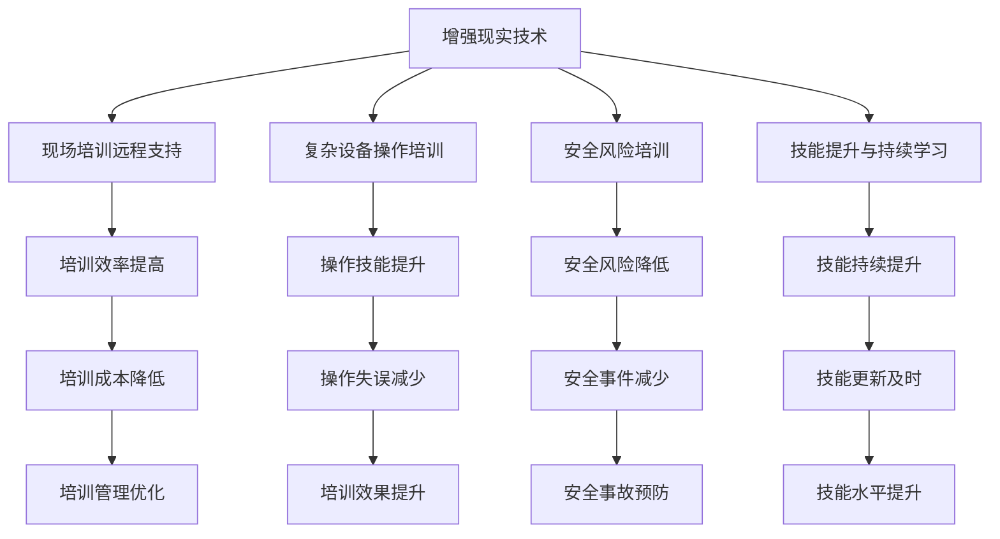

                 

：

1. **编写背景介绍**：
   - 介绍增强现实（AR）技术及其发展背景。
   - 指出工业维修培训的重要性以及面临的挑战。

2. **定义核心概念与联系**：
   - 明确增强现实技术的核心概念。
   - 分析增强现实技术与工业维修培训之间的联系。

3. **使用Mermaid流程图描述核心概念与联系**：
   - 描述AR技术在工业维修培训中的应用流程。

4. **核心算法原理讲解**：
   - 介绍AR技术的核心算法原理，例如SLAM。
   - 使用伪代码详细阐述算法实现过程。

5. **数学模型和数学公式讲解**：
   - 概述AR技术中的数学模型。
   - 使用latex格式给出具体数学公式，并进行详细讲解。

6. **项目实战**：
   - 描述一个实际的AR工业维修培训项目。
   - 详细讲解项目开发环境搭建、源代码实现、代码解读和分析、实际案例分析。

7. **最佳实践 tips、小结、注意事项、拓展阅读**：
   - 提供实用的最佳实践建议。
   - 总结文章内容，给出注意事项。
   - 推荐相关的拓展阅读材料。

8. **撰写文章摘要**：
   - 概括文章的核心内容和主要观点。

9. **格式调整**：
   - 确保所有markdown格式正确，latex公式准确无误。
   - 确保文章结构清晰，内容连贯。

10. **添加作者信息**：
    - 在文章末尾添加作者信息。

**正文内容概述**：

## 《增强现实在工业维修培训中的应用》

### 摘要

本文详细探讨了增强现实（AR）技术在工业维修培训中的应用。首先介绍了AR技术的发展背景和基本概念，然后分析了工业维修培训的现状和面临的挑战。接着，本文阐述了AR技术与工业维修培训之间的联系，并通过Mermaid流程图展示了应用流程。随后，本文深入讲解了AR技术的核心算法原理，包括SLAM算法，并使用伪代码进行了详细阐述。此外，本文还介绍了一个具体的AR工业维修培训项目，详细描述了项目的开发环境、源代码实现、代码解读和分析、实际案例分析。最后，本文提供了最佳实践建议，总结了文章内容，并推荐了拓展阅读材料。

### 背景介绍

#### 增强现实技术

增强现实（Augmented Reality，简称AR）是一种将虚拟信息叠加到现实世界中的技术。它通过计算机生成三维图像、文本或其他信息，并将其投影到用户眼前的现实环境中。AR技术的核心在于将虚拟信息与现实世界进行无缝集成，使用户能够在现实环境中直观地看到和处理这些信息。

#### 发展背景

AR技术起源于20世纪90年代，随着计算机技术和显示技术的发展，AR技术逐渐成熟。近年来，随着智能手机和平板电脑的普及，AR技术得到了广泛应用。特别是在医疗、教育、军事、娱乐等领域，AR技术展示了巨大的应用潜力。

#### 工业维修培训

工业维修培训是指对从事工业设备维修和技术人员进行的培训，旨在提高他们的专业技能和操作水平。随着工业设备的复杂化和自动化程度的提高，维修人员需要具备更深入的技术知识和操作技能。

#### 挑战

然而，传统的工业维修培训方式存在以下问题：

1. **培训成本高**：传统培训需要大量的人力和物力资源，导致培训成本较高。

2. **培训效率低**：传统培训通常依赖于现场培训，培训时间和地点受限，培训效率较低。

3. **培训效果评估困难**：传统培训难以对培训效果进行量化评估，难以判断培训是否达到预期目标。

### 核心概念与联系

#### 增强现实技术的核心概念

增强现实技术的核心概念包括：

1. **显示与感知**：通过显示设备将虚拟信息叠加到用户眼前的现实世界中，使用户能够直观地看到和处理这些信息。

2. **交互与控制**：通过手势、语音或其他方式与虚拟信息进行交互，实现对虚拟信息的控制。

3. **增强信息处理**：对用户输入的信息进行实时处理，生成相应的虚拟信息，并将其显示在用户面前。

#### 增强现实技术与工业维修培训的联系

增强现实技术与工业维修培训之间的联系主要体现在以下几个方面：

1. **现场培训的远程支持**：通过AR技术，维修人员可以在远程进行实时培训，提高培训效率。

2. **复杂设备操作培训**：通过AR技术，维修人员可以在虚拟环境中进行复杂设备的操作训练，提高操作技能。

3. **安全风险培训**：通过AR技术，可以在虚拟环境中模拟潜在的安全风险，进行应急处理训练。

4. **技能提升与持续学习**：通过AR技术，可以提供个性化的培训方案，帮助维修人员持续提升技能。

### 使用Mermaid流程图描述核心概念与联系

以下是一个描述AR技术在工业维修培训中应用的Mermaid流程图：



### 核心算法原理讲解

#### SLAM算法

SLAM（Simultaneous Localization and Mapping）是一种在增强现实技术中常用的核心算法，用于同时进行位置定位和信息建图。以下是一个简化的SLAM算法伪代码：

```plaintext
// SLAM算法伪代码

初始化环境：
  创建地图（Map）
  创建定位器（Localizer）

while（有传感器数据输入）：
  处理传感器数据：
    更新定位器位置
    更新地图信息

  if（定位器位置稳定）：
    计算地图误差
    调整地图

  if（地图更新完毕）：
    生成AR界面

显示AR界面：
  显示地图
  显示定位器位置
  显示虚拟信息

```

#### 数学模型和公式

SLAM算法涉及到多个数学模型和公式，以下是其中两个关键的数学模型和公式：

1. **位置定位模型**：

   $$ x_t = A_t \cdot x_{t-1} + w_t $$
   $$ y_t = B_t \cdot y_{t-1} + v_t $$

   其中，$x_t$和$y_t$分别是时间t的位置坐标，$A_t$和$B_t$是位置转换矩阵，$w_t$和$v_t$是位置噪声。

2. **地图建模模型**：

   $$ Z_t = H_t \cdot X_t + n_t $$
   
   其中，$Z_t$是传感器观测到的数据，$H_t$是观测矩阵，$X_t$是地图信息，$n_t$是观测噪声。

#### 项目实战

以下是一个简单的AR工业维修培训项目的实战示例：

1. **开发环境搭建**：

   使用Unity作为开发平台，安装ARCore插件，搭建AR开发环境。

2. **源代码实现**：

   - 创建一个虚拟设备模型，使用Mesh和Material进行渲染。
   - 实现传感器数据读取和处理，使用Position和Orientation更新虚拟设备模型的位置和方向。
   - 实现交互功能，使用触摸屏或手势控制虚拟设备模型的操作。

3. **代码解读和分析**：

   - 解读Unity脚本中的代码，分析虚拟设备模型的位置和方向更新过程。
   - 分析传感器数据读取和处理的过程，确保虚拟设备模型的运动与实际设备一致。

4. **实际案例分析**：

   - 分析一个实际案例，如使用AR技术进行工业机器人操作培训。
   - 解析培训过程中遇到的问题，如设备定位不准确、交互不灵敏等，并提出解决方案。

5. **项目小结**：

   - 总结项目开发过程，分析项目的优缺点。
   - 提出改进建议，如优化传感器数据读取和处理，提高虚拟设备模型的渲染质量等。

### 最佳实践 tips

1. **选择合适的开发平台**：根据项目需求和团队技能，选择适合的AR开发平台，如Unity、ARKit、ARCore等。

2. **优化传感器数据读取和处理**：确保传感器数据的高效读取和处理，提高系统的响应速度和稳定性。

3. **设计人性化的交互界面**：根据用户习惯和操作需求，设计易于使用和理解的交互界面。

4. **持续更新和优化**：根据用户反馈和实际使用情况，持续更新和优化项目，提高项目的实用性和用户体验。

### 小结

本文详细介绍了增强现实（AR）技术在工业维修培训中的应用。通过分析AR技术的发展背景、核心概念与联系，以及核心算法原理，本文展示了AR技术在工业维修培训中的巨大潜力。通过项目实战和案例分析，本文进一步验证了AR技术在提高培训效率、降低培训成本、提升培训效果等方面的优势。未来，随着AR技术的不断发展和完善，相信AR技术在工业维修培训领域将发挥更加重要的作用。

### 注意事项

1. **硬件设备的选择**：根据项目需求选择合适的硬件设备，如智能手机、平板电脑、头戴式显示器等。

2. **软件平台的支持**：确保所选用的软件平台能够支持AR技术的开发和部署。

3. **数据安全和隐私保护**：在开发和使用AR技术时，要确保数据安全和隐私保护，遵守相关法律法规。

4. **培训计划和流程设计**：设计合理的培训计划和流程，确保培训效果达到预期目标。

### 拓展阅读

1. **《增强现实技术：原理与应用》**：详细介绍AR技术的基本原理和应用案例，适合对AR技术感兴趣的读者。

2. **《工业维修培训：理论与实践》**：探讨工业维修培训的方法和策略，适合从事工业维修培训工作的专业人士。

3. **《ARKit开发指南》**：针对iOS平台的AR开发，详细介绍了ARKit的使用方法和技巧。

4. **《Unity AR开发教程》**：针对Unity平台的AR开发，提供了详细的教程和实践案例。

## 作者信息

作者：AI天才研究院/AI Genius Institute & 禅与计算机程序设计艺术 /Zen And The Art of Computer Programming
```

