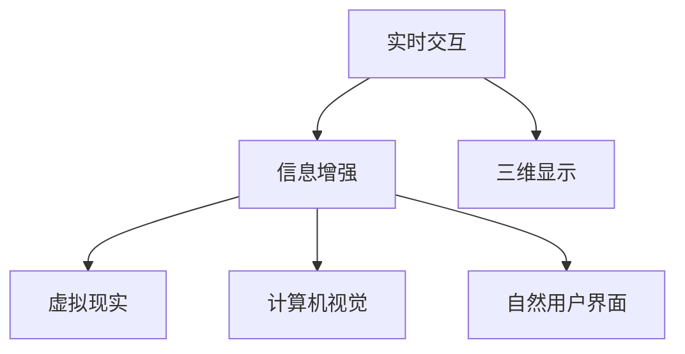
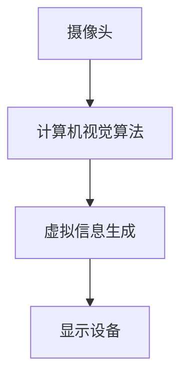

                 

### 《增强现实在工业设备维护中的可视化应用》

---

## 文章标题：增强现实在工业设备维护中的可视化应用

关键词：增强现实，工业设备维护，可视化应用，AR技术，工业4.0，故障诊断

摘要：本文探讨了增强现实（AR）技术在工业设备维护中的应用，通过引入AR技术，实现设备维护的智能化和可视化，提高了维护效率和准确性。文章首先介绍了增强现实技术的背景和发展，然后分析了工业设备维护的挑战和需求，接着详细阐述了AR技术在设备维护中的应用场景、核心算法原理、数学模型，并提供了实际案例研究。最后，文章总结了AR技术在工业设备维护中的技术挑战与未来展望。

---

### 引言

随着工业4.0的到来，智能制造成为企业竞争的关键。工业设备的高效维护对于生产线的稳定运行至关重要。传统的设备维护方法存在许多局限性，如效率低、错误率高、难以实时监控等。为了解决这些问题，增强现实（AR）技术应运而生。

AR技术通过虚拟现实和现实世界的结合，提供了全新的交互方式和信息呈现方式。在工业设备维护中，AR技术可以实现以下目标：

1. **提高维护效率**：通过实时指导，减少维护时间和错误率。
2. **增强故障诊断能力**：利用AR技术，维护人员可以更加直观地了解设备状态，快速定位故障点。
3. **降低维护成本**：通过智能化的维护方案，减少人力和物力资源的浪费。

本文将深入探讨AR技术在工业设备维护中的应用，包括技术概述、应用场景、算法原理、数学模型以及实际案例研究，为工业设备维护提供新的思路和方法。

### 增强现实技术概述

#### 核心概念与联系

增强现实（Augmented Reality，简称AR）是一种将虚拟信息与现实世界相结合的技术。它通过摄像头捕捉现实环境，然后在现实环境中叠加虚拟信息，如文字、图像、三维模型等。AR技术的核心概念包括：

1. **实时交互**：用户可以通过移动设备或眼镜等设备与虚拟信息进行实时交互。
2. **信息增强**：虚拟信息与现实世界的融合，使现实环境中的物体或场景得到增强。
3. **三维显示**：通过三维模型和图像的显示，提供更加直观的交互体验。

AR技术与其他技术的联系紧密，如：

1. **虚拟现实（Virtual Reality，简称VR）**：VR是一种完全沉浸式的虚拟环境，用户无法感知现实环境。而AR则是将虚拟信息叠加到现实环境中。
2. **计算机视觉**：计算机视觉是AR技术的核心组成部分，它通过图像处理和模式识别技术，实现现实环境的识别和理解。
3. **自然用户界面**：AR技术通过手势、语音等自然交互方式，提高了人机交互的效率。

下面是一个简单的Mermaid流程图，展示了AR技术核心概念之间的关系：



#### 技术发展历程

增强现实技术的发展历程可以追溯到上世纪90年代。以下是一些重要的里程碑：

1. **1990年**：波音公司首次提出了增强现实的概念，并在军事模拟训练中应用。
2. **2000年**：日本索尼公司推出了首款基于AR技术的头盔设备，实现了虚拟信息与现实环境的叠加。
3. **2008年**：苹果公司发布了第一个AR应用程序“ARforGoogleMaps”，标志着AR技术开始进入大众视野。
4. **2012年**：谷歌发布了Google Glass，使得AR技术更加贴近普通用户。
5. **至今**：AR技术在医疗、教育、工业等多个领域得到广泛应用，成为智能化时代的重要技术之一。

#### 技术原理与架构

增强现实技术的核心原理是通过摄像头捕捉现实环境，然后利用计算机视觉算法进行处理，最终将虚拟信息叠加到现实环境中。其架构主要包括以下几个部分：

1. **摄像头**：用于捕捉现实环境中的图像。
2. **计算机视觉算法**：包括图像处理、模式识别等，用于对捕捉到的图像进行分析和处理。
3. **虚拟信息生成**：根据处理后的图像，生成相应的虚拟信息，如文字、图像、三维模型等。
4. **显示设备**：将虚拟信息叠加到现实环境中，通常使用头戴式显示器或智能手机屏幕。

以下是一个简单的Mermaid流程图，展示了增强现实技术的原理与架构：



### 工业设备维护背景及需求

#### 工业设备维护概述

工业设备维护是指通过定期检查、保养、修理等措施，确保设备处于良好运行状态，从而保证生产线的稳定运行。工业设备维护通常包括以下几个方面：

1. **定期检查**：对设备进行定期检查，及时发现潜在故障。
2. **保养**：对设备进行润滑、清洁、更换部件等保养工作，延长设备使用寿命。
3. **修理**：对设备进行故障修复，恢复设备的功能。

工业设备维护对于企业的生产至关重要。良好的维护可以减少设备故障率，提高生产效率，降低维修成本，延长设备寿命。

#### 维护中的挑战与需求

随着工业设备的复杂化和智能化，传统的维护方式面临着许多挑战：

1. **效率低**：传统的维护方法通常需要人工巡检，效率较低，容易漏检。
2. **错误率高**：人工巡检容易受到主观因素的影响，导致错误率高。
3. **难以实时监控**：传统的维护方式难以实现实时监控，无法及时发现设备故障。
4. **数据不完整**：维护过程中的数据记录通常不完整，难以进行数据分析和优化。

为了解决这些问题，工业设备维护迫切需要引入新技术，以提高维护效率和准确性。增强现实（AR）技术的引入，为工业设备维护提供了新的解决方案：

1. **提高维护效率**：通过AR技术，可以实现实时指导和监控，减少维护时间和错误率。
2. **增强故障诊断能力**：利用AR技术，维护人员可以更加直观地了解设备状态，快速定位故障点。
3. **实现数据可视化**：AR技术可以将维护数据可视化，帮助企业进行数据分析和优化。

### 增强现实在工业设备维护中的应用

#### 应用场景介绍

增强现实技术在工业设备维护中的应用非常广泛，主要包括以下几个场景：

1. **维护指导与教程**：通过AR技术，将设备的操作步骤、维护方法等以虚拟信息的形式叠加到现实环境中，为维护人员提供实时指导。
2. **故障诊断与预测**：通过AR技术，维护人员可以实时了解设备的状态，快速定位故障点，并进行故障诊断和预测。
3. **维护数据可视化**：通过AR技术，将设备维护过程中的数据以可视化的形式展示，帮助企业进行数据分析和优化。

下面将详细探讨这些应用场景。

#### 维护指导与教程

在工业设备维护中，维护人员需要了解设备的操作方法和维护流程。传统的教程和操作手册通常存在以下问题：

1. **难以理解**：文字和图片描述难以直观地传达复杂的操作流程。
2. **不便于携带**：操作手册通常需要纸质打印，不便于携带和查找。
3. **难以实时指导**：在维护过程中，维护人员难以实时获取操作指导。

通过增强现实技术，这些问题可以得到有效解决。具体应用包括：

1. **虚拟教程**：将设备的操作步骤、维护方法等以虚拟信息的形式叠加到现实环境中，通过头戴式显示器或智能手机屏幕，为维护人员提供实时指导。
2. **增强现实标记**：在设备的关键部位贴上AR标记，维护人员通过AR设备扫描标记，即可获取该部位的操作指导和维护方法。

以下是一个简单的应用场景示例：

- **场景**：一名维护人员需要更换一台生产线的传感器。
- **操作步骤**：
  1. 维护人员佩戴AR眼镜。
  2. 使用AR眼镜扫描传感器。
  3. AR眼镜显示传感器更换的步骤和注意事项。
  4. 维护人员按照AR眼镜的指导完成传感器更换。

#### 故障诊断与预测

在工业设备维护中，故障诊断和预测是一个关键环节。传统的故障诊断方法通常需要依赖经验和技术人员，存在以下问题：

1. **依赖人工判断**：故障诊断主要依赖于技术人员的主观判断，容易产生误判。
2. **效率低**：故障诊断通常需要手动检查多个设备参数，效率较低。
3. **难以实时监控**：传统的故障诊断方法难以实现实时监控，无法及时发现故障。

通过增强现实技术，可以实现以下目标：

1. **实时监控**：通过AR技术，维护人员可以实时了解设备的状态，快速定位故障点。
2. **数据可视化**：将设备运行数据以可视化的形式展示，帮助维护人员快速识别故障。
3. **智能诊断**：利用计算机视觉和机器学习技术，对设备运行数据进行智能分析，预测潜在故障。

以下是一个简单的应用场景示例：

- **场景**：生产线上一台设备突然出现故障。
- **操作步骤**：
  1. 维护人员通过AR眼镜扫描故障设备。
  2. AR眼镜显示设备运行数据和历史记录。
  3. 利用计算机视觉和机器学习技术，AR眼镜对设备运行数据进行实时分析，预测故障原因。
  4. 维护人员根据AR眼镜的指导，快速定位故障点并进行修复。

#### 维护数据可视化

在工业设备维护中，数据的可视化对于分析和优化至关重要。传统的数据记录和展示方式存在以下问题：

1. **数据不完整**：维护过程中的数据记录通常不完整，难以进行数据分析和优化。
2. **难以直观展示**：文字和表格难以直观地展示维护数据。
3. **数据分析困难**：传统的数据分析方法难以处理大规模的维护数据。

通过增强现实技术，可以实现以下目标：

1. **数据可视化**：将设备维护数据以可视化的形式展示，帮助维护人员快速了解设备状态。
2. **实时数据更新**：通过AR技术，实时更新维护数据，使维护人员能够及时获取最新的设备信息。
3. **智能数据分析**：利用计算机视觉和机器学习技术，对维护数据进行智能分析，发现潜在问题和优化方案。

以下是一个简单的应用场景示例：

- **场景**：维护人员需要分析一条生产线的设备维护情况。
- **操作步骤**：
  1. 维护人员通过AR眼镜扫描生产线。
  2. AR眼镜显示生产线的设备维护数据，包括设备故障率、维修时间、保养周期等。
  3. 利用计算机视觉和机器学习技术，AR眼镜对设备维护数据进行分析，生成设备维护报告。
  4. 维护人员根据设备维护报告，制定优化方案，提高生产线的维护效率。

### 核心算法原理讲解

#### 图像识别与追踪

图像识别与追踪是增强现实技术的核心组成部分，它使得虚拟信息能够准确地叠加到现实环境中。下面将介绍图像识别与追踪的核心算法原理。

1. **图像识别**：
   - **目标检测**：通过卷积神经网络（CNN）或其他深度学习模型，对图像进行目标检测，确定图像中的关键区域。
   - **特征提取**：提取图像特征，如边缘、纹理等，用于后续的匹配和追踪。
   - **分类与定位**：对提取的特征进行分类和定位，确定目标的位置和类别。

2. **图像追踪**：
   - **光流法**：利用图像序列中像素的运动轨迹，追踪目标的位置和运动状态。
   - **卡尔曼滤波**：结合预测和观测信息，对目标的位置和速度进行估计。
   - **粒子滤波**：通过粒子分布模型，对目标的位置和运动状态进行估计。

以下是一个简单的伪代码，用于描述图像识别与追踪的基本流程：

```python
def image_recognition_and_tracking(image_sequence):
    # 初始化
    previous_image = image_sequence[0]
    target_detected = False
    target_position = None

    # 循环处理图像序列
    for image in image_sequence[1:]:
        # 目标检测
        target区域 = detect_target(image)

        # 特征提取
        target_features = extract_features(target区域)

        # 分类与定位
        target_position = classify_and_locate(target_features)

        # 更新状态
        if target_detected:
            track_target(target_position, previous_image, image)

        # 更新上一帧
        previous_image = image

    return target_position
```

#### 空间映射与数据融合

空间映射与数据融合是增强现实技术的另一个核心组成部分，它使得虚拟信息能够在正确的空间位置进行叠加。下面将介绍空间映射与数据融合的核心算法原理。

1. **空间映射**：
   - **三维重建**：通过多个视角的图像，利用结构光、激光扫描等技术，重建场景的三维模型。
   - **空间变换**：利用几何变换、透视变换等方法，将虚拟信息映射到场景中的正确位置。
   - **视线追踪**：根据用户的视线方向，实时调整虚拟信息的位置和角度，提供沉浸式体验。

2. **数据融合**：
   - **多源数据融合**：整合来自不同传感器（如摄像头、激光雷达、惯性测量单元等）的数据，提高数据的准确性和可靠性。
   - **数据加权**：根据不同传感器的精度和可靠性，对数据加权处理，提高融合结果的质量。
   - **卡尔曼滤波**：结合预测和观测信息，对数据融合结果进行滤波处理，提高数据的平滑性和鲁棒性。

以下是一个简单的伪代码，用于描述空间映射与数据融合的基本流程：

```python
def space_mapping_and_data_fusion(sensor_data, virtual_data):
    # 三维重建
    scene_model = reconstruct_3d_model(sensor_data)

    # 空间变换
    virtual_data = transform_to_scene(virtual_data, scene_model)

    # 数据融合
    fused_data = data_fusion(sensor_data, virtual_data)

    return fused_data
```

#### 数学模型与数学公式

在增强现实技术中，数学模型和数学公式用于描述和实现图像识别与追踪、空间映射与数据融合等核心算法。以下是一些常用的数学模型和数学公式。

1. **图像识别与追踪**：
   - **卷积神经网络（CNN）**：
     $$ \text{CNN}(\text{image}) = \text{激活函数}(\text{卷积}(\text{滤波器}(\text{image}))) $$
   - **光流法**：
     $$ v(x, y) = \frac{\partial I}{\partial t} $$
   - **卡尔曼滤波**：
     $$ \hat{x}_{k|k-1} = F_k \hat{x}_{k-1|k-1} $$
     $$ P_{k|k-1} = F_k P_{k-1|k-1} F_k^T + Q_k $$
     $$ K_k = P_{k|k-1} H_k^T (H_k P_{k|k-1} H_k^T + R_k)^{-1} $$
     $$ \hat{x}_{k|k} = \hat{x}_{k|k-1} + K_k (y_k - H_k \hat{x}_{k|k-1}) $$
     $$ P_{k|k} = (I - K_k H_k) P_{k|k-1} $$

2. **空间映射与数据融合**：
   - **三维重建**：
     $$ \text{scene_model} = \text{reconstruct_3d_model}(\text{images}) $$
   - **空间变换**：
     $$ \text{virtual_data} = \text{transform_to_scene}(\text{virtual_data}, \text{scene_model}) $$
   - **数据融合**：
     $$ \text{fused_data} = \text{data_fusion}(\text{sensor_data}, \text{virtual_data}) $$

   其中，$F_k$ 为状态转移矩阵，$P_{k|k-1}$ 为状态协方差矩阵，$Q_k$ 为过程噪声协方差矩阵，$K_k$ 为卡尔曼增益，$R_k$ 为观测噪声协方差矩阵，$H_k$ 为观测矩阵，$\hat{x}_{k|k-1}$ 和 $\hat{x}_{k|k}$ 分别为预测状态和观测状态，$y_k$ 为观测值。

### 可视化技术应用

#### 可视化技术概述

可视化技术是将数据或信息以图形、图像、图表等形式展示，帮助人们更好地理解和分析数据。在增强现实（AR）技术中，可视化技术具有重要作用，能够将复杂的设备维护数据以直观、易懂的方式呈现，提高维护效率和准确性。

可视化技术的主要作用包括：

1. **数据展示**：将设备维护数据以图表、图像等形式展示，使数据更加直观。
2. **趋势分析**：通过可视化技术，可以实时分析设备维护数据的趋势，预测潜在故障。
3. **决策支持**：可视化技术可以帮助维护人员快速了解设备状态，制定优化维护策略。

#### 可视化技术在工业设备维护中的应用

1. **维护数据可视化**：
   - **设备状态监控**：通过AR技术，将设备的实时运行数据以图表、图像等形式展示，监控设备的状态。
   - **故障历史记录**：将设备的故障历史数据以图表、图像等形式展示，帮助维护人员了解设备的故障情况。

2. **故障信息的可视化**：
   - **故障诊断**：将设备的故障信息以图表、图像等形式展示，帮助维护人员快速定位故障点。
   - **故障原因分析**：通过可视化技术，对故障原因进行详细分析，提供故障诊断报告。

3. **维护流程的可视化**：
   - **维护步骤指导**：通过AR技术，将设备的维护步骤以虚拟信息的形式展示，指导维护人员按照正确的步骤进行操作。
   - **维护流程监控**：将设备的维护流程以图表、图像等形式展示，监控维护的进度和质量。

### 实际案例研究

为了更好地理解增强现实技术在工业设备维护中的应用，下面将介绍一个实际案例研究。

#### 案例介绍

该案例是一个制造企业，其生产线上的关键设备需要进行定期维护。为了提高维护效率和准确性，企业引入了增强现实（AR）技术。

#### 应用方案

1. **维护数据可视化**：企业通过AR技术，将设备的实时运行数据和故障历史数据以图表、图像等形式展示，帮助维护人员监控设备状态和故障情况。

2. **故障诊断与预测**：企业利用AR技术，将设备的故障信息以图表、图像等形式展示，帮助维护人员快速定位故障点，并预测潜在故障。

3. **维护流程指导**：企业通过AR技术，将设备的维护步骤以虚拟信息的形式展示，为维护人员提供实时指导。

#### 案例分析与解读

1. **维护数据可视化**：
   - **设备状态监控**：通过AR技术，维护人员可以实时监控设备的运行状态，如温度、压力、速度等。当设备参数异常时，AR系统会立即发出警报，提醒维护人员进行检查。
   - **故障历史记录**：通过AR技术，维护人员可以查看设备的故障历史记录，了解设备过去出现的故障情况。这有助于他们更好地预测未来可能的故障。

2. **故障诊断与预测**：
   - **故障诊断**：当设备出现故障时，维护人员通过AR眼镜扫描设备，AR系统会自动分析设备运行数据和历史记录，快速定位故障点。同时，AR系统还会提供故障原因分析和解决方案建议。
   - **故障预测**：通过分析设备的运行数据，AR系统可以预测未来可能的故障。这使企业可以提前安排维护工作，减少设备停机时间。

3. **维护流程指导**：
   - **维护步骤指导**：通过AR技术，维护人员可以按照AR眼镜的实时指导，按照正确的步骤进行设备维护。这减少了维护过程中的人为错误，提高了维护效率。
   - **维护流程监控**：企业通过AR技术，可以监控维护的进度和质量。这有助于确保维护工作按照计划进行，提高维护效果。

#### 案例效果评估

1. **提高维护效率**：通过AR技术，维护人员可以实时获取设备状态和故障信息，快速定位故障点，减少了维护时间和错误率。

2. **增强故障诊断能力**：AR技术使维护人员能够更加直观地了解设备状态，提高了故障诊断的准确性。

3. **降低维护成本**：通过智能化的维护方案和实时监控，企业可以减少人力和物力资源的浪费，降低了维护成本。

4. **提升用户体验**：通过AR技术，维护人员可以获得更加直观的维护指导，提升了用户体验。

### 技术挑战与未来展望

#### 技术挑战

尽管增强现实（AR）技术在工业设备维护中具有巨大潜力，但在实际应用中仍面临一些技术挑战：

1. **准确性问题**：AR系统的准确性受到传感器精度、图像识别算法等因素的影响，可能导致虚拟信息与现实环境的不匹配。

2. **实时性挑战**：在高速生产环境中，实现实时数据采集、处理和显示是一个挑战，需要高效的数据处理算法和快速的硬件支持。

3. **安全性问题**：AR技术涉及敏感数据的处理和传输，需要确保数据的安全性，防止数据泄露和恶意攻击。

4. **硬件成本**：高精度的AR设备通常价格昂贵，限制了其在中小企业中的应用。

#### 未来展望

未来，AR技术在工业设备维护中的应用有望进一步发展：

1. **算法优化**：通过改进图像识别、追踪、数据融合等算法，提高AR系统的准确性和实时性。

2. **硬件升级**：随着硬件技术的进步，AR设备将变得更加高效、稳定和廉价，降低应用门槛。

3. **智能化升级**：结合人工智能（AI）技术，实现自动化维护和预测性维护，提高设备的可靠性。

4. **跨平台应用**：未来，AR技术将不仅仅局限于特定的设备或平台，而是实现跨平台、跨设备的应用，提高维护的灵活性和可扩展性。

### 总结

本文介绍了增强现实（AR）技术在工业设备维护中的应用，包括技术概述、应用场景、核心算法原理、数学模型、实际案例研究和未来展望。通过引入AR技术，可以实现设备维护的智能化和可视化，提高维护效率和准确性。未来，随着技术的不断进步，AR技术将在工业设备维护中发挥更大的作用。

### 附录

#### 最佳实践 Tips

1. **选择合适的AR设备**：根据实际需求，选择适合的AR设备，如头戴式显示器、智能手机等。
2. **优化算法和数据处理**：通过改进图像识别、追踪、数据融合等算法，提高AR系统的性能。
3. **保障数据安全**：确保数据传输和存储的安全，防止数据泄露和恶意攻击。
4. **制定详细的维护计划**：根据设备的运行情况和历史数据，制定详细的维护计划，确保维护工作的有序进行。

#### 注意事项

1. **设备维护前，确保AR系统正常运行**。
2. **使用AR设备时，注意设备的正确佩戴和操作**。
3. **及时更新和维护AR系统，确保其稳定性和准确性**。

#### 拓展阅读

1. **《增强现实技术原理与应用》**：详细介绍了增强现实技术的原理和应用场景。
2. **《工业设备维护与故障诊断》**：介绍了工业设备维护的基本方法和故障诊断技术。
3. **《人工智能与大数据在工业中的应用》**：探讨了人工智能和大数据技术在工业设备维护中的应用。

### 作者信息

作者：AI天才研究院/AI Genius Institute & 禅与计算机程序设计艺术 /Zen And The Art of Computer Programming

