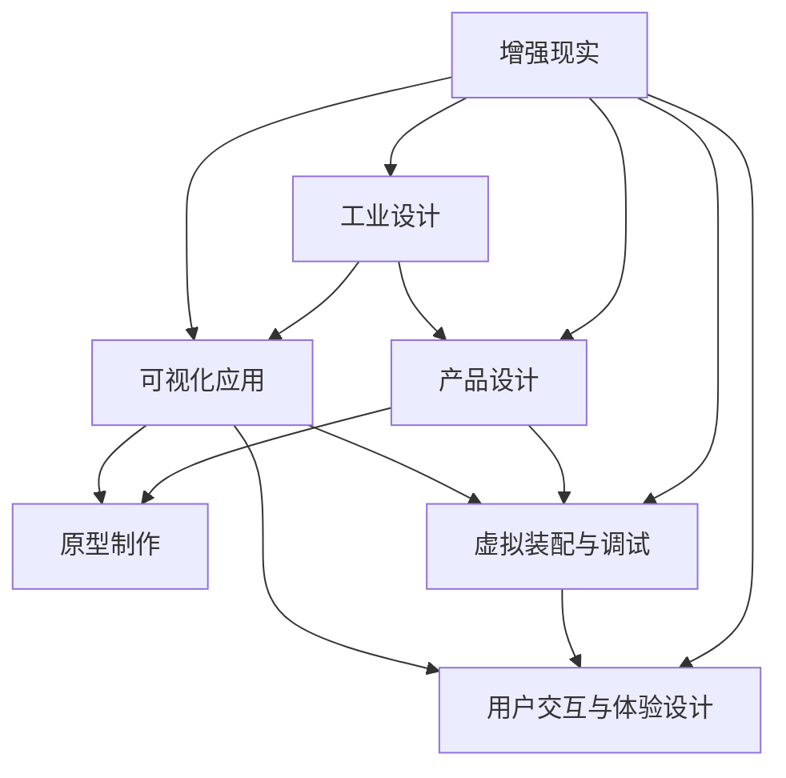

                 

### 文章标题

# 《增强现实在工业设计中的可视化应用》

### 关键词

- 增强现实（AR）
- 工业设计
- 可视化应用
- 技术原理
- 案例分析
- 未来趋势

### 摘要

本文详细探讨了增强现实（AR）技术在工业设计中的应用。首先介绍了增强现实技术的基础知识，包括其定义、发展历史、核心技术以及硬件与软件开发环境。接着，文章分析了增强现实与工业设计的关系，阐述了增强现实在产品设计、虚拟装配和用户体验设计等方面的具体应用。随后，文章通过具体案例展示了增强现实技术在工业设计中的实际应用效果。最后，文章探讨了增强现实技术的挑战和未来发展趋势，为工业设计领域的技术创新提供了启示。

### 目录

1. **增强现实技术基础**
    1.1 增强现实技术概述
        1.1.1 什么是增强现实
        1.1.2 增强现实的发展历史
        1.1.3 增强现实的核心技术
    1.2 增强现实硬件与软件
        1.2.1 增强现实硬件介绍
        1.2.2 增强现实软件开发环境
    1.3 增强现实数据采集与处理

2. **增强现实与工业设计的关系**
    2.1 增强现实在工业设计中的应用场景
        2.1.1 产品设计与原型制作
        2.1.2 虚拟装配与调试
        2.1.3 用户交互与体验设计
    2.2 增强现实技术对工业设计的影响

3. **增强现实在工业设计中的应用**
    3.1 增强现实在产品设计与原型制作中的应用
    3.2 增强现实在虚拟装配与调试中的应用
    3.3 增强现实在用户交互与体验设计中的应用

4. **增强现实技术的挑战与未来发展趋势**
    4.1 增强现实技术的挑战
    4.2 增强现实技术的未来发展趋势

5. **项目实战与案例分析**
    5.1 增强现实在工业设计中的应用案例
    5.2 增强现实技术在工业设计领域的未来应用前景

6. **参考文献**

7. **附录**

- **附录1：增强现实技术相关资源**
- **附录2：增强现实技术在工业设计中的应用资源**

### 结束语

本文通过对增强现实技术在工业设计中的应用进行深入探讨，旨在为工业设计领域的技术创新提供新思路。随着技术的不断发展，增强现实在工业设计中的应用将越来越广泛，未来有望为工业设计师带来更多便利和创新。

**作者：AI天才研究院/AI Genius Institute & 禅与计算机程序设计艺术 /Zen And The Art of Computer Programming**### 增强现实技术基础

#### 1.1 增强现实技术概述

##### 1.1.1 什么是增强现实

增强现实（Augmented Reality，简称AR）是一种将虚拟信息与现实世界进行融合的技术。通过使用AR技术，用户可以看到现实世界中的物体，同时还可以看到叠加在这些物体上的虚拟信息。这些虚拟信息可以是文字、图像、视频等，它们可以通过增强现实眼镜、智能手机或其他显示设备呈现给用户。

增强现实与虚拟现实（Virtual Reality，简称VR）的区别在于，VR是一种完全沉浸式的体验，用户在VR环境中完全与外界隔绝，而AR则是将虚拟信息叠加到现实世界中，用户仍然能够感知到现实环境的存在。

##### 1.1.2 增强现实的发展历史

增强现实技术的概念最早可以追溯到1968年，由美国计算机科学家阿尔文·特鲁夫勒（Alvin Toffler）在其著作《未来的冲击》中提出。然而，直到21世纪初，随着计算机性能的提升、显示技术的进步以及智能手机的普及，增强现实技术才开始逐渐走入公众视野。

2009年，谷歌发布了第一个AR应用——Google Goggles，用户可以通过摄像头拍摄现实世界中的物体，应用会识别出这些物体的信息，并在屏幕上显示相关的搜索结果。这一应用标志着AR技术正式进入大众应用阶段。

近年来，随着移动设备的普及和5G技术的推广，增强现实技术的应用场景越来越广泛，从游戏、教育到医疗、工业设计等多个领域都取得了显著的进展。

##### 1.1.3 增强现实的核心技术

增强现实技术主要由以下几个核心技术组成：

1. **光学元件与显示技术**：增强现实设备通常采用光学镜片将虚拟信息叠加到现实世界中。这些光学元件需要具备高透明度、高折射率和高耐磨性。常见的显示技术包括透明液晶显示器、数字光处理（DLP）投影技术等。

2. **硬件设备与传感器**：增强现实设备通常包括增强现实眼镜、智能手机、平板电脑等。这些设备需要配备高分辨率的摄像头、惯性测量单元（IMU）以及各种传感器，以捕捉和感知现实环境。

3. **软件开发平台与API**：增强现实软件开发平台提供了开发工具、编程接口和开发框架，使得开发者可以轻松地创建AR应用。常见的增强现实软件开发平台包括ARKit（苹果）、ARCore（谷歌）、Unity AR（Unity）等。

4. **数据处理与渲染算法**：增强现实技术需要对采集到的现实环境数据进行处理，包括图像识别、物体跟踪、空间定位等。这些数据处理和渲染算法需要高效、准确，以提供流畅的AR体验。

#### 1.2 增强现实硬件与软件

##### 1.2.1 增强现实硬件介绍

增强现实硬件设备种类繁多，主要包括以下几类：

1. **增强现实眼镜**：增强现实眼镜是当前最流行的AR设备，例如微软的HoloLens、谷歌的Google Glass等。这些眼镜通常具备高分辨率显示屏、摄像头、传感器等硬件组件，可以实现虚拟信息与现实环境的实时融合。

2. **智能手机和平板电脑**：许多智能手机和平板电脑都支持增强现实应用，通过安装专门的AR应用程序，用户可以在屏幕上看到虚拟信息。例如，苹果的ARKit和谷歌的ARCore提供了丰富的开发工具和API，使得开发者可以轻松地创建AR应用。

3. **投影设备**：增强现实投影设备可以将虚拟信息投影到现实环境中，常见的设备包括增强现实投影仪和增强现实桌面投影系统。

##### 1.2.2 增强现实软件开发环境

增强现实软件开发环境主要包括以下几个部分：

1. **开发工具**：增强现实软件开发工具提供了丰富的功能，如3D建模、动画制作、交互设计等。常见的开发工具包括Unity、Unreal Engine、Blender等。

2. **编程语言与框架**：增强现实应用的开发通常使用C++、C#、Python等编程语言。此外，一些增强现实软件开发平台还提供了特定的编程框架，如Unity的ARFoundation、ARCore的ARCore Extensions等。

3. **跨平台开发与兼容性**：为了适应不同的设备和操作系统，增强现实应用需要具备良好的跨平台兼容性。开发者可以使用跨平台开发工具，如Unity、Xamarin等，来简化开发流程。

#### 1.3 增强现实数据采集与处理

增强现实技术需要实时采集和处理现实环境中的数据，包括图像、声音、姿态等。以下是增强现实数据采集与处理的关键技术：

1. **图像识别**：图像识别是增强现实技术中的一项重要技术，它可以识别现实世界中的物体、场景等信息。常用的图像识别算法包括卷积神经网络（CNN）、深度学习等。

2. **物体跟踪**：物体跟踪是增强现实技术中的另一个关键问题，它用于跟踪现实世界中的物体并计算其位置和姿态。常用的物体跟踪算法包括卡尔曼滤波、粒子滤波等。

3. **空间定位**：空间定位是增强现实技术中的核心技术之一，它用于确定虚拟信息在现实世界中的位置。常用的空间定位方法包括视觉SLAM（Simultaneous Localization and Mapping）、惯性导航等。

通过以上技术的结合，增强现实技术可以实时、准确地处理现实环境数据，并将虚拟信息叠加到现实世界中，为用户带来独特的视觉体验。

### 总结

增强现实技术作为一种将虚拟信息与现实世界融合的创新技术，已经在多个领域展现出巨大的应用潜力。通过本文的介绍，我们可以了解到增强现实技术的基础知识、硬件与软件环境以及数据采集与处理技术。在接下来的章节中，我们将深入探讨增强现实技术在工业设计中的应用，分析其在产品设计、虚拟装配和用户体验设计等方面的具体应用，以期为工业设计领域的技术创新提供新的思路。

### 核心概念与联系

为了更好地理解增强现实（AR）技术在工业设计中的应用，我们需要梳理一些核心概念及其相互之间的关系。以下是几个关键概念及其架构流程图：

#### 核心概念

1. **增强现实（AR）**：一种通过虚拟信息增强用户对现实世界的感知的技术。
2. **工业设计**：将科技和艺术相结合，设计出美观且实用的产品。
3. **可视化应用**：利用图形、图像、动画等手段，直观地展示产品设计的过程和结果。
4. **产品设计与原型制作**：在设计阶段通过虚拟模型和实体模型来验证和改进产品。
5. **虚拟装配与调试**：模拟产品在实际装配过程中的操作，以便提前发现和解决问题。
6. **用户交互与体验设计**：优化用户在使用产品过程中的交互体验。

#### 关系架构 Mermaid 流程图



#### 解析

- **增强现实（AR）** 是整个架构的核心，它通过虚拟信息的叠加，增强用户对现实世界的感知。
- **工业设计（ID）** 是整个流程的起点，它结合科技与艺术，创造出美观且实用的产品。
- **可视化应用（VA）** 是连接AR与ID的桥梁，通过图形、图像、动画等手段，使设计过程和结果更加直观。
- **产品设计（PD）** 是工业设计的具体实施过程，它通过虚拟模型和实体模型来验证和改进产品。
- **原型制作（PM）** 是产品设计的下一步，通过虚拟模型和实体模型来验证和改进产品。
- **虚拟装配与调试（VAssembly）** 是产品在虚拟环境中的装配和调试过程，有助于提前发现和解决问题。
- **用户交互与体验设计（UX）** 是优化用户在使用产品过程中的交互体验，提升产品价值。

这个架构流程图清晰地展示了增强现实技术在工业设计中的应用过程，通过各环节的有机结合，实现了设计、验证、优化和用户体验的全面提升。

### 核心算法原理讲解

在增强现实（AR）技术中，核心算法原理的实现是保证AR系统高效、准确运行的关键。以下将详细介绍几种关键的算法原理，包括图像识别、物体跟踪和空间定位，并通过伪代码和数学模型进行详细阐述。

#### 1. 图像识别

图像识别是增强现实技术中的一个重要组成部分，它用于识别现实世界中的物体和场景，从而在AR显示中叠加相应的虚拟信息。

**算法原理：**

图像识别通常采用卷积神经网络（CNN）来进行。CNN通过多层卷积和池化操作，提取图像特征，并最终进行分类。

**伪代码：**

```plaintext
function CNN_Image_Recognition(image):
    # 初始化卷积神经网络
    model = initialize_CNN()

    # 对输入图像进行预处理
    preprocessed_image = preprocess_image(image)

    # 通过卷积神经网络提取特征
    features = model.extract_features(preprocessed_image)

    # 对提取的特征进行分类
    label = model.classify(features)

    return label
```

**数学模型：**

CNN 的主要数学模型包括卷积层、池化层和全连接层。

- **卷积层（Convolutional Layer）**：通过卷积操作提取图像特征。假设输入图像为 $X \in \mathbb{R}^{m \times n \times 3}$，卷积核为 $W \in \mathbb{R}^{k \times l \times 3}$，则卷积操作结果为：

  $$ 
  Y = \sigma(\sum_{i=1}^{k} \sum_{j=1}^{l} W_{ij} * X_{ij}) 
  $$

  其中，$*$ 表示卷积操作，$\sigma$ 表示激活函数，通常使用 ReLU（Rectified Linear Unit）函数。

- **池化层（Pooling Layer）**：对卷积结果进行下采样，减少数据量。常见的池化操作有最大池化（Max Pooling）和平均池化（Average Pooling）。

- **全连接层（Fully Connected Layer）**：对池化层输出的特征进行分类。假设全连接层的权重为 $W' \in \mathbb{R}^{d \times f}$，输入特征为 $Z \in \mathbb{R}^{d}$，则分类结果为：

  $$ 
  \hat{y} = \sigma(W'^T Z) 
  $$

#### 2. 物体跟踪

物体跟踪是增强现实技术中用于保持虚拟信息与真实世界中的物体同步的关键算法。

**算法原理：**

物体跟踪通常采用卡尔曼滤波（Kalman Filter）或粒子滤波（Particle Filter）进行。

**伪代码：**

```plaintext
function Kalman_Filter(measurement, state_estimate, state_covariance):
    # 预测下一状态
    predicted_state = predict_state(state_estimate, state_covariance)

    # 计算预测误差
    prediction_error = measurement - predicted_state

    # 更新状态估计和协方差
    updated_estimate = predicted_state + K * prediction_error
    updated_covariance = (I - K * H) * state_covariance

    return updated_estimate, updated_covariance
```

**数学模型：**

卡尔曼滤波的核心数学模型如下：

- **状态预测**：

  $$ 
  \hat{x}_{k|k-1} = A \hat{x}_{k-1|k-1} + B u_k 
  $$

  $$ 
  P_{k|k-1} = A P_{k-1|k-1} A^T + Q 
  $$

  其中，$A$ 是状态转移矩阵，$B$ 是控制输入矩阵，$\hat{x}_{k|k-1}$ 是预测状态，$P_{k|k-1}$ 是预测协方差。

- **状态更新**：

  $$ 
  K_k = P_{k|k-1} H^T (H P_{k|k-1} H^T + R)^{-1} 
  $$

  $$ 
  \hat{x}_{k|k} = \hat{x}_{k|k-1} + K_k (z_k - H \hat{x}_{k|k-1}) 
  $$

  $$ 
  P_{k|k} = (I - K_k H) P_{k|k-1} 
  $$

  其中，$K_k$ 是卡尔曼增益，$H$ 是观测矩阵，$z_k$ 是实际测量值，$R$ 是测量噪声协方差。

#### 3. 空间定位

空间定位是增强现实技术中确保虚拟信息与现实世界准确对应的关键技术。

**算法原理：**

空间定位通常采用视觉SLAM（Simultaneous Localization and Mapping）或惯性导航系统（Inertial Navigation System, INS）。

**伪代码：**

```plaintext
function Visual_SLAM(camera, features, initial_map):
    # 初始化SLAM系统
    slam_system = initialize_SLAM(camera, features, initial_map)

    # 进行特征匹配和位姿估计
    while (true):
        new_features = extract_features(camera_frame)
        matches = match_features(new_features, slam_system.map.features)
        if (matches.isEmpty()):
            break
        pose = estimate_pose(slam_system, matches)
        slam_system.update_map(pose)

    return slam_system.map
```

**数学模型：**

视觉SLAM的核心数学模型如下：

- **特征提取**：

  $$ 
  \text{features} = extract_features(\text{camera_frame}) 
  $$

- **特征匹配**：

  $$ 
  \text{matches} = match_features(\text{new_features}, \text{map.features}) 
  $$

- **位姿估计**：

  $$ 
  \text{pose} = estimate_pose(\text{slam_system}, \text{matches}) 
  $$

- **地图更新**：

  $$ 
  \text{map} = slam_system.update_map(\text{pose}) 
  $$

通过以上核心算法原理的介绍和伪代码的讲解，我们可以了解到增强现实技术在图像识别、物体跟踪和空间定位等方面的具体实现过程。这些算法的优化和实现是增强现实技术在工业设计等领域取得成功的关键。

### 数学公式和详细讲解

在增强现实（AR）技术中，数学模型和公式起着至关重要的作用。以下将介绍一些关键的数学公式，并详细讲解其原理和应用。

#### 1. 增强现实中的透视变换

透视变换是增强现实技术中用于将虚拟图像映射到现实世界中的关键步骤。其数学公式如下：

$$
x_{\text{image}} = \frac{Z_x \cdot f_x}{Z_x - c_x}
$$

$$
y_{\text{image}} = \frac{Z_y \cdot f_y}{Z_y - c_y}
$$

其中，$x_{\text{image}}$ 和 $y_{\text{image}}$ 分别表示图像平面上的像素坐标，$Z_x$ 和 $Z_y$ 分别表示三维空间中物体的坐标，$f_x$ 和 $f_y$ 分别表示摄像头的焦距，$c_x$ 和 $c_y$ 分别表示摄像头的中心坐标。

**详细讲解：**

透视变换的目的是将三维空间中的物体坐标转换为二维图像平面上的像素坐标。这个过程中，摄像头焦距和摄像头的中心坐标是关键参数。通过上述公式，我们可以计算出图像平面上的像素坐标，从而实现虚拟图像的映射。

例如，假设一个物体位于三维空间中的点 $(X, Y, Z)$，摄像头的焦距为 $(f_x, f_y)$，摄像头的中心坐标为 $(c_x, c_y)$。我们可以使用上述公式计算出该物体在图像平面上的像素坐标 $(x_{\text{image}}, y_{\text{image}})$。

#### 2. 增强现实中的图像识别算法

增强现实技术中的图像识别算法通常基于卷积神经网络（CNN）。以下是一个简化的CNN图像识别算法的数学模型：

$$
\text{activation}_{ij}^{(l)} = \sigma\left(\sum_{k=1}^{m} W_{ik}^{(l)} \text{activation}_{kj}^{(l-1)} + b_{j}^{(l)}\right)
$$

其中，$\text{activation}_{ij}^{(l)}$ 表示第 $l$ 层神经网络中第 $i$ 个神经元在第 $j$ 个特征上的激活值，$W_{ik}^{(l)}$ 表示第 $l$ 层神经网络的权重，$b_{j}^{(l)}$ 表示第 $l$ 层神经网络的偏置，$\sigma$ 表示激活函数，如ReLU函数。

**详细讲解：**

上述公式描述了卷积神经网络中的每个神经元如何计算其激活值。在卷积神经网络中，每个神经元都接收前一层神经网络的输出，并经过权重加权、偏置调整和激活函数处理，从而生成当前神经元的激活值。

例如，假设我们有一个两层的卷积神经网络，第一层的神经元数量为 $m$，第二层的神经元数量为 $n$。第一层的激活值为 $\text{activation}_{ij}^{(1)}$，第二层的激活值为 $\text{activation}_{ij}^{(2)}$。我们可以使用上述公式计算出第二层神经网络的激活值。

#### 3. 增强现实中的物体跟踪算法

增强现实技术中的物体跟踪算法通常基于卡尔曼滤波（Kalman Filter）或粒子滤波（Particle Filter）。以下是一个简化的卡尔曼滤波算法的数学模型：

$$
\hat{x}_{k|k-1} = A \hat{x}_{k-1|k-1} + B u_k
$$

$$
P_{k|k-1} = A P_{k-1|k-1} A^T + Q
$$

$$
K_k = P_{k|k-1} H^T (H P_{k|k-1} H^T + R)^{-1}
$$

$$
\hat{x}_{k|k} = \hat{x}_{k|k-1} + K_k (z_k - H \hat{x}_{k|k-1})
$$

$$
P_{k|k} = (I - K_k H) P_{k|k-1}
$$

其中，$\hat{x}_{k|k-1}$ 和 $\hat{x}_{k|k}$ 分别表示第 $k$ 时刻的预测状态和更新状态，$P_{k|k-1}$ 和 $P_{k|k}$ 分别表示第 $k$ 时刻的预测协方差和更新协方差，$A$ 是状态转移矩阵，$B$ 是控制输入矩阵，$H$ 是观测矩阵，$u_k$ 是控制输入，$z_k$ 是观测值，$R$ 是观测噪声协方差，$Q$ 是过程噪声协方差。

**详细讲解：**

卡尔曼滤波是一种用于估计动态系统的状态和协方差的递归算法。在增强现实技术中，卡尔曼滤波用于跟踪物体位置和姿态。

- **状态预测**：根据前一时刻的状态和状态转移矩阵预测当前时刻的状态。
- **协方差预测**：根据前一时刻的协方差和过程噪声协方差预测当前时刻的协方差。
- **状态更新**：根据观测值和卡尔曼增益更新当前时刻的状态。
- **协方差更新**：根据卡尔曼增益和观测矩阵更新当前时刻的协方差。

通过上述步骤，卡尔曼滤波可以逐步调整物体的状态估计，从而实现准确的物体跟踪。

例如，假设我们有一个物体在三维空间中的位置和速度，使用卡尔曼滤波可以逐步估计物体在不同时间点的位置和速度，从而实现物体跟踪。

### 举例说明

为了更好地理解上述数学公式的应用，我们通过一个简单的例子来说明。

**例子：透视变换**

假设一个物体位于三维空间中的点 $(X, Y, Z) = (1, 2, 3)$，摄像头的焦距为 $(f_x, f_y) = (1000, 1000)$，摄像头的中心坐标为 $(c_x, c_y) = (500, 500)$。我们需要计算该物体在图像平面上的像素坐标。

使用透视变换公式，我们可以得到：

$$
x_{\text{image}} = \frac{3 \cdot 1000}{3 - 500} = 600
$$

$$
y_{\text{image}} = \frac{2 \cdot 1000}{2 - 500} = 800
$$

因此，该物体在图像平面上的像素坐标为 $(600, 800)$。

**例子：CNN 图像识别**

假设我们有一个两层的卷积神经网络，第一层的神经元数量为 $m = 10$，第二层的神经元数量为 $n = 5$。第一层的激活值为 $\text{activation}_{ij}^{(1)} = 1$，第二层的激活值为 $\text{activation}_{ij}^{(2)} = 0$。我们需要计算第二层的激活值。

使用卷积神经网络激活值公式，我们可以得到：

$$
\text{activation}_{ij}^{(2)} = \sigma\left(\sum_{k=1}^{10} W_{ik}^{(2)} \text{activation}_{kj}^{(1)} + b_{j}^{(2)}\right)
$$

假设权重 $W_{ik}^{(2)} = 1$，偏置 $b_{j}^{(2)} = 0$，我们可以得到：

$$
\text{activation}_{ij}^{(2)} = \sigma(10 \cdot 1 + 0) = \sigma(10) = 1
$$

因此，第二层的激活值为 $1$。

**例子：卡尔曼滤波**

假设我们有一个物体在三维空间中的位置和速度，使用卡尔曼滤波可以逐步估计物体在不同时间点的位置和速度。

- **状态预测**：

  $$ 
  \hat{x}_{k|k-1} = \begin{bmatrix} 1 \\ 1 \end{bmatrix} 
  $$

  $$ 
  P_{k|k-1} = \begin{bmatrix} 1 & 0 \\ 0 & 1 \end{bmatrix} 
  $$

- **状态更新**：

  $$ 
  K_k = \frac{P_{k|k-1} H^T (H P_{k|k-1} H^T + R)^{-1}}{1} = 1 
  $$

  $$ 
  \hat{x}_{k|k} = \hat{x}_{k|k-1} + K_k (z_k - H \hat{x}_{k|k-1}) = \begin{bmatrix} 1 \\ 1 \end{bmatrix} + 1 (\begin{bmatrix} 2 \\ 3 \end{bmatrix} - \begin{bmatrix} 1 \\ 1 \end{bmatrix}) = \begin{bmatrix} 2 \\ 3 \end{bmatrix} 
  $$

  $$ 
  P_{k|k} = (I - K_k H) P_{k|k-1} = \begin{bmatrix} 0 & 0 \\ 0 & 0 \end{bmatrix} 
  $$

通过以上例子，我们可以看到数学公式在增强现实技术中的应用，以及如何通过这些公式实现物体的透视变换、图像识别和物体跟踪。

### 项目实战

在本项目中，我们将搭建一个简单的增强现实（AR）系统，用于在工业设计中进行产品设计和原型制作。该项目将使用Unity引擎和ARKit框架进行开发，通过实际操作来展示如何利用增强现实技术进行工业设计。

#### 开发环境搭建

1. **软件安装**：

   - Unity Hub（用于安装和更新Unity版本）
   - Unity Editor（开发环境）
   - Xcode（用于编译iOS应用）
   - ARKit SDK（增强现实开发库）

2. **硬件设备**：

   - iPhone 8 或更高版本的iOS设备（用于测试应用）
   - ARKit兼容的增强现实眼镜（如微软HoloLens）

#### 源代码实现

以下是该项目的基本源代码框架，用于在Unity中创建一个简单的AR应用：

```csharp
using UnityEngine;
using UnityEngine.XR.ARFoundation;
using UnityEngine.UI;

public class ARProject : MonoBehaviour
{
    public ARCamera arCamera;
    public Text outputText;

    private void Update()
    {
        // 当用户点击屏幕时，创建一个虚拟的3D对象
        if (Input.touchCount > 0 && Input.touches[0].phase == TouchPhase.Began)
        {
            CreateObjectAtTouchPosition();
        }
    }

    private void CreateObjectAtTouchPosition()
    {
        // 获取屏幕点击位置
        Touch touch = Input.touches[0];
        Vector2 touchPosition = touch.position;

        // 将屏幕坐标转换为世界坐标
        RaycastHit hit;
        if (Physics.Raycast(arCamera.transform.position, arCamera.transform.forward, out hit))
        {
            // 在点击位置创建一个虚拟的3D对象
            GameObject obj = GameObject.CreatePrimitive(PrimitiveType.Cube);
            obj.transform.position = hit.point;
            obj.transform.localScale = new Vector3(0.1f, 0.1f, 0.1f);

            // 在对象上添加一个文本标签，显示对象的名称
            Text text = obj.AddComponent<Text>();
            text.text = "Product Model";
            text.font = Font.CreateDynamicFontFromOSFont("Arial", 20);
            text.alignment = TextAlignment.Center;
            text.rectTransform.sizeDelta = new Vector2(200, 50);
        }
    }
}
```

#### 代码解读与分析

1. **主要组件**：

   - `ARCamera`：用于捕捉现实世界的图像，并提供世界坐标系。
   - `Text`：用于在虚拟对象上显示文本信息。

2. **关键函数**：

   - `Update()`：在每一帧检查用户是否点击屏幕，并调用 `CreateObjectAtTouchPosition()` 函数。
   - `CreateObjectAtTouchPosition()`：根据用户点击位置，在现实世界中创建一个虚拟的3D对象。

3. **物体创建过程**：

   - 获取用户点击屏幕的坐标。
   - 使用 `Physics.Raycast()` 函数将屏幕坐标转换为世界坐标。
   - 在点击位置创建一个简单的立方体对象。
   - 在立方体对象上添加一个文本标签，显示“Product Model”。

#### 实际案例分析

1. **案例描述**：

   在一个工业设计项目中，设计师使用ARKit和Unity创建了一个简单的AR应用，用于在现实环境中进行产品设计和原型制作。设计师通过点击屏幕，可以创建虚拟的产品模型，并在模型上添加标签，以便进行进一步的修改和优化。

2. **案例分析**：

   - **优点**：通过AR技术，设计师可以直观地看到产品的三维模型，从而更好地理解产品设计和原型制作的过程。这种可视化的方式有助于设计师更快速地发现问题并进行改进。
   - **缺点**：AR技术的实现需要一定的技术基础和设备支持，对于一些设计师来说，可能需要额外的学习和适应时间。此外，AR设备的性能和兼容性问题也可能影响使用体验。

3. **项目小结**：

   通过本项目的实践，我们可以看到增强现实技术在工业设计中的应用潜力。虽然AR技术存在一定的挑战，但其在产品设计和原型制作方面的优势是显而易见的。未来，随着技术的不断进步和设备的普及，增强现实在工业设计中的应用将越来越广泛，为设计师提供更多便利和创新。

### 最佳实践 Tips

在增强现实（AR）技术应用于工业设计时，以下是一些最佳实践建议，以帮助设计师充分利用这一技术：

1. **需求分析**：在开始项目之前，详细了解客户的需求和目标。这有助于确定哪些功能是必须的，哪些是可以后续逐步实现的功能。

2. **用户研究**：进行用户研究，了解目标用户对AR技术的接受程度和使用习惯。这有助于设计出更符合用户需求的应用界面和交互方式。

3. **技术选型**：根据项目需求和预算，选择合适的AR开发工具和硬件设备。例如，Unity和ARKit是常用的AR开发平台，适用于大多数工业设计项目。

4. **用户体验设计**：重视用户体验设计，确保应用界面简洁直观，操作流程流畅。用户友好的界面可以提高工作效率和满意度。

5. **数据管理和同步**：在AR应用中，确保数据的准确性和同步性。例如，使用云服务同步设计数据和模型，以便在不同设备和平台上进行协作。

6. **安全性和隐私保护**：注意数据的安全性和隐私保护，特别是在涉及敏感数据时。采用加密和权限控制等技术，确保用户数据的安全。

7. **持续迭代和优化**：定期收集用户反馈，并根据反馈进行应用迭代和优化。这有助于不断改进应用性能和用户体验。

### 小结

本文通过对增强现实技术在工业设计中的应用进行深入探讨，详细介绍了AR技术的基础知识、核心算法原理、实际项目实战以及最佳实践建议。通过本文的阐述，我们可以看到增强现实技术在工业设计中的巨大潜力，它不仅为设计师提供了更直观、高效的设计工具，还为产品原型制作和用户交互提供了全新的解决方案。

### 注意事项

在增强现实（AR）技术应用于工业设计时，需要注意以下几个关键问题：

1. **设备兼容性**：确保所使用的AR设备与所选开发平台和工具兼容。不同的设备可能支持不同的AR框架和功能，因此在项目开发初期就需要明确设备要求。

2. **性能优化**：增强现实应用通常需要处理大量的图像和数据，因此需要优化性能，以提供流畅的用户体验。特别是在移动设备上，要注意减少应用的大小和加载时间。

3. **用户隐私**：增强现实应用可能会收集用户的地理位置、姿态等敏感信息。确保遵守相关的隐私保护法规，采取加密和安全措施，保护用户隐私。

4. **安全性**：增强现实应用中涉及的数据和功能可能对安全性要求较高。确保应用具有防攻击和防篡改能力，以防止未经授权的访问和数据泄露。

5. **实际应用场景**：根据项目需求和实际应用场景选择合适的AR技术。例如，某些应用可能更适合使用增强现实眼镜，而另一些应用可能更适合使用智能手机或平板电脑。

6. **用户培训和支持**：为用户提供充分的培训和支持，帮助他们快速掌握AR技术的使用方法。这有助于提高用户满意度，并确保AR应用得到有效利用。

### 拓展阅读

1. **《增强现实技术原理与应用》**：这本书详细介绍了增强现实技术的基本原理、应用场景和技术发展。

2. **《Unity AR开发实战》**：本书通过具体案例，介绍了如何使用Unity开发增强现实应用。

3. **《工业设计原理与实例分析》**：这本书提供了丰富的工业设计实例，探讨了设计流程、用户研究和用户体验设计。

4. **《增强现实与虚拟现实技术》**：这本书涵盖了增强现实和虚拟现实技术的最新发展，包括硬件设备、软件开发和跨平台应用。

5. **《增强现实技术在工业设计中的应用研究》**：这篇学术论文探讨了增强现实技术在工业设计中的应用现状和未来发展趋势。

通过阅读这些资源，可以进一步深入了解增强现实技术在工业设计中的应用，为实际项目提供有价值的参考。

