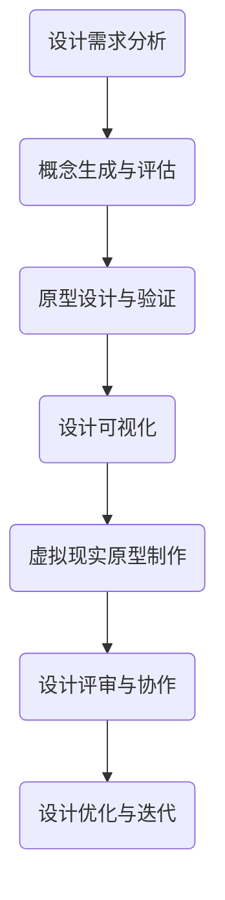

                 

## 文章标题：增强现实在工业设计中的可视化应用

### 关键词

- **增强现实（Augmented Reality，AR）**
- **工业设计**
- **可视化应用**
- **三维建模**
- **交互设计**
- **虚拟现实原型制作**
- **设计评审与协作**
- **开发工具与框架**
- **项目实战**

### 摘要

本文旨在探讨增强现实（AR）技术在工业设计中的应用，详细解析其在设计可视化、虚拟现实原型制作、设计评审与协作等方面的优势。文章首先介绍增强现实技术的基本概念、原理和发展趋势，然后深入探讨AR技术在工业设计中的具体应用，包括设计可视化、虚拟现实原型制作、设计评审与协作等。接着，本文介绍增强现实开发工具与框架，并展示如何利用这些工具和框架进行AR项目开发。最后，通过实际项目案例，展示如何搭建开发环境、实现源代码，并进行详细讲解和分析。

## 目录

### 第一部分：增强现实技术基础

### 第1章 增强现实技术概述

1.1 增强现实的概念与历史  
1.2 增强现实的关键技术  
1.3 增强现实的发展趋势  
1.4 增强现实技术架构的Mermaid流程图

### 第2章 增强现实技术原理

2.1 视觉增强  
2.2 空间定位与跟踪  
2.3 数据融合与交互  
2.4 增强现实算法的伪代码解释

### 第二部分：工业设计中的增强现实应用

### 第3章 增强现实在工业设计中的应用场景

3.1 设计可视化  
3.2 虚拟现实原型制作  
3.3 设计评审与协作  
3.4 增强现实设计工具的应用

### 第4章 增强现实设计流程

4.1 设计需求分析  
4.2 增强现实方案的规划  
4.3 增强现实原型设计  
4.4 设计迭代与优化

### 第三部分：增强现实开发工具与框架

### 第5章 增强现实开发工具

5.1 ARKit  
5.2 ARCore  
5.3 Vuforia  
5.4 其他AR开发工具

### 第6章 增强现实框架

6.1 Unity AR  
6.2 ARToolKit  
6.3 AR.js  
6.4 增强现实框架的选择与集成

### 第7章 数学模型与公式

7.1 3D模型渲染  
7.2 空间定位算法  
7.3 数据融合与处理  
7.4 数学模型的latex格式展示与解释

### 第四部分：项目实战与案例分析

### 第8章 增强现实设计项目实战

8.1 项目背景  
8.2 需求分析  
8.3 系统设计与实现  
8.4 测试与优化

### 第9章 增强现实案例解析

9.1 案例一：智能家居设计  
9.2 案例二：汽车设计评审  
9.3 案例三：工厂布局优化  
9.4 案例比较与总结

## 附录

- 附录A：增强现实资源与工具列表  
- 附录B：增强现实开发环境搭建指南  
- 附录C：源代码与案例资源下载

---

### 背景介绍

工业设计是产品设计过程中的重要环节，它不仅仅关注产品的形状和外观，更涉及到用户体验、功能性和市场适应性。随着科技的快速发展，特别是计算机图形学、虚拟现实（VR）和增强现实（AR）技术的兴起，工业设计的方式和工具也在不断革新。增强现实作为一种将虚拟信息与现实世界无缝融合的技术，正逐渐成为工业设计师的新宠。

增强现实技术的定义是：通过计算机技术模拟出一个虚拟环境，将虚拟环境与真实环境进行融合，使得虚拟信息可以叠加在真实环境中，从而使用户在真实环境中感知和交互虚拟信息。在工业设计中，增强现实的应用主要包括设计可视化、虚拟现实原型制作、设计评审与协作等。

设计可视化是工业设计中的一项基本任务，它涉及到将设计师的创意和概念转化为可视化的产品原型。传统的二维图纸和三维模型虽然能够提供一定的设计信息，但在复杂性和细节表达方面存在一定的局限性。增强现实技术通过将三维模型叠加在真实环境中，使得设计师可以更直观、更精确地了解设计的效果，从而提高设计的准确性和效率。

虚拟现实原型制作是工业设计中的另一项重要任务。通过增强现实技术，设计师可以在虚拟环境中构建和调整产品原型，从而更好地模拟产品的实际使用场景。这种技术不仅提高了设计效率，还使得设计过程更加灵活和可迭代。

设计评审与协作是工业设计过程中的关键环节。在传统的设计评审过程中，设计师和利益相关者通常需要面对面交流，这种交流方式存在时间和空间的限制。而增强现实技术可以通过虚拟现实会议、共享设计界面等方式，使得设计评审和协作过程更加便捷和高效。

总的来说，增强现实技术在工业设计中的应用具有显著的优势，它不仅提升了设计效率和精度，还增强了设计的互动性和参与性。随着技术的不断进步和应用的深入，增强现实在工业设计领域的潜力将得到更加充分的发挥。

### 核心概念与联系

要深入理解增强现实在工业设计中的具体应用，我们首先需要明确几个核心概念，并探讨它们之间的联系。

#### 增强现实（Augmented Reality，AR）

增强现实是一种通过计算机技术和传感器设备，将虚拟信息叠加到真实环境中，从而增强用户感知和体验的技术。增强现实的关键技术包括：

1. **视觉增强**：通过摄像头捕捉现实环境，并在屏幕上叠加虚拟信息。
2. **空间定位与跟踪**：通过传感器如摄像头、GPS等，对用户和物体在现实世界中的位置和姿态进行精准定位。
3. **数据融合与交互**：将虚拟信息和真实环境进行融合，并允许用户与虚拟信息进行交互。

#### 工业设计

工业设计是一种通过设计思维和创造性过程，将产品从概念转化为实际产品的过程。工业设计的主要环节包括：

1. **设计需求分析**：了解用户需求和产品功能，明确设计目标和方向。
2. **概念生成与评估**：通过草图、建模等方式生成多个设计概念，并进行评估和筛选。
3. **原型设计与验证**：制作原型并进行测试，以验证设计概念的可行性和用户体验。

#### 设计可视化

设计可视化是工业设计中的一个关键环节，它通过将设计概念和模型以视觉化的方式呈现出来，帮助设计师、客户和其他利益相关者更好地理解和评估设计。设计可视化可以采用多种技术，包括：

1. **二维图纸**：通过平面图纸展示设计细节和尺寸。
2. **三维模型**：通过三维建模软件创建三维模型，展示产品的形状和结构。
3. **增强现实**：通过增强现实技术，将三维模型叠加在真实环境中，实现更直观的可视化效果。

#### 虚拟现实原型制作

虚拟现实原型制作是工业设计中的一种创新方法，它利用虚拟现实技术，在虚拟环境中构建和调整产品原型。这种方法的优势包括：

1. **沉浸式体验**：用户可以在虚拟环境中沉浸式地体验产品，从而更好地理解设计。
2. **可交互性**：用户可以与虚拟原型进行交互，测试产品的功能性和用户体验。
3. **灵活性**：虚拟环境可以快速修改和迭代，提高设计的灵活性和适应性。

#### 设计评审与协作

设计评审与协作是工业设计过程中的重要环节，通过增强现实技术，可以实现以下目标：

1. **远程协作**：通过虚拟现实会议和共享设计界面，实现跨地域的协作和交流。
2. **实时反馈**：设计师和利益相关者可以实时查看和讨论设计，提供即时反馈。
3. **高效决策**：通过增强现实技术，设计评审过程更加高效，有助于快速做出决策。

### Mermaid流程图

为了更清晰地展示增强现实技术在工业设计中的应用，我们可以使用Mermaid流程图来描述整个过程。以下是增强现实在工业设计中的应用流程图：



- **设计需求分析**：明确设计目标和用户需求。
- **概念生成与评估**：通过草图和建模生成设计概念，并进行评估。
- **原型设计与验证**：创建原型并进行测试，验证设计概念。
- **设计可视化**：利用增强现实技术进行设计可视化，提供更直观的展示。
- **虚拟现实原型制作**：在虚拟环境中构建和调整产品原型，实现沉浸式体验。
- **设计评审与协作**：通过虚拟现实会议和共享设计界面，实现远程协作和实时反馈。
- **设计优化与迭代**：根据反馈进行设计优化，并迭代更新设计。

通过这个流程图，我们可以看到增强现实技术在工业设计中的应用是如何紧密连接的，各个环节相互支持，共同推动设计过程。

### 核心算法原理讲解

在增强现实技术中，核心算法原理对于实现虚拟信息与现实环境的无缝融合至关重要。以下将详细讲解几个关键算法原理，并使用伪代码进行描述。

#### 1. 视觉增强算法

视觉增强算法是增强现实技术的基础，它通过在摄像头捕捉的现实环境中叠加虚拟信息，实现视觉增强效果。以下是视觉增强算法的伪代码：

```plaintext
function VisualEnhancement(image, virtualObject):
    1. 对图像进行预处理，包括降噪、灰度化等操作。
    2. 使用物体检测算法识别现实环境中的关键特征点。
    3. 计算虚拟对象与特征点之间的对应关系。
    4. 对虚拟对象进行变换，包括旋转、缩放、平移等操作，以匹配现实环境。
    5. 将变换后的虚拟对象叠加到原始图像上。
    6. 输出叠加后的图像。

# 伪代码示例：使用OpenCV进行图像预处理和特征点检测
import cv2

image = cv2.imread('input.jpg')
gray = cv2.cvtColor(image, cv2.COLOR_BGR2GRAY)
blurred = cv2.GaussianBlur(gray, (5, 5), 0)
features = cv2.findCornerSubpix(blurred, corners)

virtualObject = cv2.addWeighted(image, 0.5, virtualObject, 0.5, 0)
output = cv2.add(image, virtualObject)
cv2.imshow('Visual Enhancement', output)
cv2.waitKey(0)
cv2.destroyAllWindows()
```

#### 2. 空间定位与跟踪算法

空间定位与跟踪算法用于确定虚拟对象在现实环境中的位置和姿态。常见的空间定位算法包括视觉SLAM（Simultaneous Localization and Mapping）和基于激光雷达的SLAM。以下是视觉SLAM算法的伪代码：

```plaintext
function VisualSLAM(camera, landmarks, map):
    1. 对摄像头捕获的图像进行预处理，包括去噪、增强等操作。
    2. 使用特征点检测算法提取图像中的特征点。
    3. 对特征点进行匹配，计算特征点之间的对应关系。
    4. 使用运动模型更新相机位姿。
    5. 使用地图扩展算法更新地图。
    6. 返回当前相机位姿和更新后的地图。

# 伪代码示例：使用ORB-SLAM框架进行特征点检测和匹配
import cv2
import osr

camera = cv2.VideoCapture(0)
map = initializeMap()

while camera.isOpened():
    ret, frame = camera.read()
    if not ret:
        break

    gray = cv2.cvtColor(frame, cv2.COLOR_BGR2GRAY)
    keypoints, descriptors = cv2ORB.detect(gray)
    matches = cv2.knnMatch(descriptors1, descriptors2, k=2)

    if len(matches) > 10:
        cameraPose = updateCameraPose(matches)
        map = extendMap(map, cameraPose)

    visualizeSLAM(frame, cameraPose, map)
    cv2.imshow('Visual SLAM', frame)
    if cv2.waitKey(1) & 0xFF == ord('q'):
        break

camera.release()
cv2.destroyAllWindows()
```

#### 3. 数据融合与交互算法

数据融合与交互算法用于将虚拟信息与现实环境中的数据进行整合，并提供用户与虚拟信息的交互。以下是数据融合与交互算法的伪代码：

```plaintext
function DataFusionAndInteraction(virtualData, realData, userInput):
    1. 对虚拟数据和现实环境中的数据进行预处理，包括归一化、去噪等操作。
    2. 使用数据融合算法将虚拟数据和现实环境中的数据整合。
    3. 根据用户输入更新虚拟数据和现实环境中的数据。
    4. 输出整合后的数据。

# 伪代码示例：使用卡尔曼滤波进行数据融合
import numpy as np

virtualData = np.array([[1.0, 0.0], [0.0, 1.0]])
realData = np.array([[1.1, 0.0], [0.0, 1.1]])
userInput = np.array([[0.1, 0.0], [0.0, 0.1]])

estimatedData = np.dot(virtualData, realData)
estimatedError = np.linalg.inv(np.dot(virtualData.T, virtualData))
updatedData = estimatedData + np.dot(estimatedError, userInput - estimatedData)

print("Updated Data:", updatedData)
```

通过这些算法原理的讲解和伪代码示例，我们可以看到增强现实技术如何通过视觉增强、空间定位与跟踪以及数据融合与交互，实现虚拟信息与现实环境的无缝融合。这些核心算法为工业设计中的可视化应用提供了强大的技术支持。

### 数学模型与公式讲解

在增强现实（AR）技术中，数学模型和公式是确保虚拟信息与现实环境准确融合的关键。以下将详细讲解几个关键的数学模型和公式，并使用LaTeX进行展示与解释。

#### 1. 三维模型渲染

三维模型渲染是增强现实技术中的一个重要环节，它涉及将三维模型在二维屏幕上准确渲染。以下是三维模型渲染的基本公式：

$$
\text{Pixel}_{x} = \text{Model}_{x} \times \text{View}_{x} \times \text{Projection}_{x} + \text{Camera}_{x}
$$

$$
\text{Pixel}_{y} = \text{Model}_{y} \times \text{View}_{y} \times \text{Projection}_{y} + \text{Camera}_{y}
$$

其中，$\text{Pixel}_{x}$和$\text{Pixel}_{y}$分别表示屏幕上的像素坐标，$\text{Model}_{x}$、$\text{Model}_{y}$是三维模型在世界坐标系中的坐标，$\text{View}_{x}$、$\text{View}_{y}$是观察者（相机）在世界坐标系中的坐标，$\text{Projection}_{x}$、$\text{Projection}_{y}$是投影矩阵的元素，$\text{Camera}_{x}$、$\text{Camera}_{y}$是相机的位置坐标。

#### 2. 空间定位算法

空间定位算法是增强现实技术中用于确定虚拟对象在现实环境中的位置和姿态的关键。以下是典型的三角测量法公式：

$$
\text{Distance} = \sqrt{(x_2 - x_1)^2 + (y_2 - y_1)^2}
$$

其中，$x_1$、$y_1$是已知的标记点坐标，$x_2$、$y_2$是待测点的坐标，$\text{Distance}$是两点之间的距离。

进一步，利用多个标记点的坐标，可以构建线性方程组求解待测点的坐标：

$$
\begin{cases}
(x_2 - x_1) \times x_3 + (y_2 - y_1) \times y_3 = \text{Distance}_{13} \\
(x_2 - x_1) \times x_4 + (y_2 - y_1) \times y_4 = \text{Distance}_{14}
\end{cases}
$$

通过解这个方程组，可以得到待测点的坐标$(x_2, y_2)$。

#### 3. 数据融合与处理

在增强现实技术中，数据融合与处理是整合虚拟信息和现实环境数据的重要步骤。以下是一个简单的卡尔曼滤波器公式，用于数据融合：

$$
\text{Predicted State} = \text{Previous State} + \text{Control Input}
$$

$$
\text{Predicted Error} = \text{Previous Error} + \text{Process Noise}
$$

$$
\text{Updated State} = \text{Predicted State} + \text{Measurement}
$$

$$
\text{Updated Error} = \text{Predicted Error} + \text{Measurement Noise}
$$

其中，$\text{Predicted State}$和$\text{Previous State}$分别是预测状态和先验状态，$\text{Control Input}$和$\text{Measurement}$分别是控制输入和测量值，$\text{Process Noise}$和$\text{Measurement Noise}$分别是过程噪声和测量噪声，$\text{Updated State}$和$\text{Updated Error}$分别是更新状态和更新误差。

通过上述公式，卡尔曼滤波器可以有效地预测和更新系统的状态，从而实现对数据的准确融合。

#### 4. 三维模型渲染与空间定位的结合

为了更直观地展示三维模型在增强现实中的渲染与空间定位，以下是一个结合三维模型渲染和空间定位的LaTeX格式数学模型：

$$
\text{Pixel}_{x} = \frac{\text{Model}_{x} \times \text{Projection}_{x}}{\text{Model}_{z}} + \text{Camera}_{x}
$$

$$
\text{Pixel}_{y} = \frac{\text{Model}_{y} \times \text{Projection}_{y}}{\text{Model}_{z}} + \text{Camera}_{y}
$$

$$
\text{Model}_{z} = \text{View}_{z} \times \text{Projection}_{z}
$$

在这个模型中，$\text{Pixel}_{x}$和$\text{Pixel}_{y}$表示屏幕上的像素坐标，$\text{Model}_{x}$、$\text{Model}_{y}$和$\text{Model}_{z}$分别是三维模型在世界坐标系中的坐标，$\text{Projection}_{x}$、$\text{Projection}_{y}$和$\text{Projection}_{z}$是投影矩阵的元素，$\text{View}_{z}$是观察者（相机）在世界坐标系中的z坐标，$\text{Camera}_{x}$和$\text{Camera}_{y}$是相机的位置坐标。

通过这个模型，我们可以将三维模型准确渲染到屏幕上，并在真实环境中进行空间定位。

通过以上数学模型和公式的讲解，我们可以看到增强现实技术在实现虚拟信息与现实环境融合过程中所依赖的数学基础。这些模型和公式不仅为增强现实技术的实现提供了理论支持，也为工业设计中的可视化应用提供了强有力的工具。

### 增强现实在工业设计中的应用场景

增强现实（AR）技术在工业设计中的应用场景十分广泛，可以显著提升设计效率和体验。以下将详细探讨增强现实在工业设计中的几个关键应用场景。

#### 1. 设计可视化

设计可视化是工业设计中的一项基础任务，它涉及到将设计师的创意和概念转化为可视化的产品原型。传统的二维图纸和三维模型虽然在设计阶段提供了重要的视觉参考，但在复杂性和细节表达方面存在一定的局限性。增强现实技术通过将三维模型叠加在真实环境中，使得设计师可以更直观、更精确地了解设计的效果，从而提高设计的准确性和效率。

在实际操作中，设计师可以使用增强现实设备，如智能手机、平板电脑或AR眼镜，捕捉周围环境并叠加虚拟模型。通过增强现实技术，设计师可以实时看到产品的虚拟模型在真实环境中的表现，从而快速进行调整和优化。例如，设计师可以在会议室中使用AR设备展示设计方案，与团队成员实时互动，快速获得反馈和建议。

#### 2. 虚拟现实原型制作

虚拟现实（VR）原型制作是工业设计中的一种创新方法，它利用虚拟现实技术，在虚拟环境中构建和调整产品原型。通过增强现实技术，设计师可以在真实环境中体验虚拟原型，从而更好地模拟产品的实际使用场景。这种方法不仅提高了设计效率，还使得设计过程更加灵活和可迭代。

在虚拟现实原型制作中，设计师可以使用增强现实设备，如AR眼镜或平板电脑，进入虚拟环境并进行操作。通过增强现实技术，设计师可以实时看到虚拟原型在真实环境中的表现，并根据实际需求进行调整和优化。例如，设计师可以虚拟组装一个复杂的机械部件，并通过增强现实设备进行动态调整，确保每个部件的配合和功能。

#### 3. 设计评审与协作

设计评审与协作是工业设计过程中的关键环节，通过增强现实技术，可以实现远程协作和实时反馈，提高设计评审的效率和效果。传统的评审过程通常需要设计师和利益相关者面对面交流，这种交流方式存在时间和空间的限制。而增强现实技术可以通过虚拟现实会议和共享设计界面，实现跨地域的协作和交流，使得设计评审过程更加便捷和高效。

在实际操作中，设计师和评审团可以通过增强现实设备，如AR眼镜或平板电脑，参加虚拟评审会议。在会议中，设计师可以实时展示设计原型，评审团成员可以随时提出反馈和建议，并通过增强现实设备进行实时互动。例如，评审团成员可以虚拟触摸产品表面，并提出修改意见，设计师可以立即进行响应和调整。

#### 4. 增强现实设计工具的应用

为了更高效地利用增强现实技术进行工业设计，各种增强现实设计工具和软件应运而生。这些工具提供了丰富的功能，可以帮助设计师在增强现实环境中进行设计、评审和协作。

例如，Unity AR是常用的增强现实设计工具之一，它提供了强大的三维建模和渲染功能，使得设计师可以在虚拟环境中创建和调整产品原型。Unity AR还支持与各种增强现实设备的集成，如ARKit、ARCore和Vuforia，方便设计师在不同平台上进行开发。

此外，ARToolKit和AR.js也是常用的增强现实设计工具。ARToolKit提供了丰富的AR开发库和工具，支持多种平台和设备，适合进行复杂AR应用的开发。AR.js则是一个轻量级的增强现实库，可以轻松实现AR效果，适用于简单的增强现实应用开发。

通过这些增强现实设计工具，设计师可以更高效地利用增强现实技术进行工业设计，提高设计效率和用户体验。

### 增强现实设计流程

在工业设计中，利用增强现实（AR）技术进行设计的过程不仅要求技术的深度理解，还需要合理的流程设计来确保设计的效果和效率。以下是增强现实设计流程的详细描述，包括设计需求分析、增强现实方案的规划、增强现实原型设计和设计迭代与优化等环节。

#### 1. 设计需求分析

设计需求分析是整个设计流程的起点，它涉及明确设计目标和用户需求，为后续的设计工作奠定基础。在这一环节，设计师需要与客户和利益相关者进行深入沟通，了解产品功能、用户体验、市场定位等方面的要求。具体步骤包括：

- **需求收集**：通过访谈、问卷调查、用户观察等方式收集用户需求。
- **需求分析**：对收集到的需求进行分类和分析，明确设计目标和优先级。
- **需求文档**：编写详细的需求文档，包括功能需求、性能需求和用户界面需求等。

#### 2. 增强现实方案的规划

在明确设计需求后，下一步是制定增强现实方案。这一环节涉及选择合适的AR技术、确定设计策略和规划开发流程。具体步骤包括：

- **技术评估**：评估现有的增强现实技术，包括ARKit、ARCore、Vuforia等，选择最适合项目需求的技术。
- **设计策略**：制定设计策略，包括如何将AR技术应用于设计过程中，例如设计可视化、虚拟现实原型制作、设计评审与协作等。
- **开发流程**：规划开发流程，包括需求分析、原型设计、开发实现、测试与优化等环节。

#### 3. 增强现实原型设计

原型设计是将设计需求转化为具体设计方案的重要环节。利用增强现实技术，设计师可以在虚拟环境中构建和调整产品原型，实现沉浸式的设计体验。具体步骤包括：

- **三维建模**：使用三维建模软件（如Blender、Maya等）创建产品原型，确保模型的准确性和细节。
- **AR集成**：将三维模型集成到增强现实环境中，实现虚拟模型与现实环境的融合。
- **交互设计**：设计用户与虚拟模型的交互方式，包括触摸、手势、语音等，确保用户体验的流畅性。
- **原型测试**：通过实际操作测试原型，收集反馈并进行调整。

#### 4. 设计迭代与优化

设计迭代与优化是设计流程中不可或缺的环节，它通过不断的迭代和优化，逐步完善设计方案。具体步骤包括：

- **用户反馈**：收集用户对原型的反馈，包括功能、性能、用户体验等方面。
- **优化方案**：根据用户反馈进行设计优化，包括功能调整、界面优化、交互改进等。
- **迭代测试**：进行迭代测试，确保每次优化都能提高设计质量和用户体验。
- **文档更新**：更新设计文档，记录每次迭代的结果和优化方案。

通过上述设计流程，设计师可以利用增强现实技术，实现高效、精准的工业设计，提升设计质量和用户体验。每个环节都需要细致的规划和执行，确保最终设计方案的顺利实现。

### 增强现实开发工具与框架

在工业设计中，选择合适的增强现实（AR）开发工具与框架至关重要。这些工具和框架不仅能够提高开发效率，还能确保项目的成功实施。以下将介绍几种主流的增强现实开发工具与框架，包括ARKit、ARCore、Vuforia和Unity AR等，详细讲解其特点、应用场景及选择标准。

#### 1. ARKit

ARKit是由苹果公司推出的一款增强现实开发框架，适用于iOS平台。它提供了丰富的AR功能，包括实时场景理解和物体追踪等。ARKit的特点包括：

- **实时场景理解**：ARKit能够实时识别和追踪平面、立方体等物体，为开发者提供了强大的AR基础。
- **物体追踪**：ARKit支持物体识别和追踪，使开发者能够在AR场景中实现复杂交互。
- **集成简单**：ARKit与苹果的Xcode开发环境紧密集成，开发者可以快速上手。

应用场景：

- **教育应用**：通过ARKit，开发者可以创建互动式的教育应用，如虚拟实验和互动教学。
- **市场营销**：在广告和营销活动中，ARKit可以用于创建增强现实的宣传材料，吸引用户注意力。
- **工业设计**：在工业设计领域，ARKit可以用于设计可视化和虚拟原型制作，提高设计效率和精确度。

选择标准：

- **平台兼容性**：ARKit仅适用于iOS平台，适用于iOS设备较多的项目。
- **开发效率**：ARKit提供了丰富的API和工具，适合快速开发。

#### 2. ARCore

ARCore是谷歌推出的增强现实开发框架，适用于Android平台。它提供了与ARKit类似的AR功能，包括场景理解和物体追踪等。ARCore的特点包括：

- **实时场景理解**：ARCore能够实时识别和追踪平面、立方体等物体，为开发者提供了强大的AR基础。
- **全球定位系统（GPS）**：ARCore集成了GPS功能，可以实现更精确的定位和导航。
- **跨平台支持**：ARCore不仅支持Android设备，还支持部分iOS设备，提供了更广泛的平台兼容性。

应用场景：

- **移动应用**：ARCore适用于移动设备的AR应用开发，如AR导航、AR游戏等。
- **虚拟现实体验**：通过ARCore，开发者可以创建虚拟现实体验，提升用户沉浸感。
- **工业设计**：在工业设计领域，ARCore可以用于设计评审和虚拟现实原型制作，提高协作效率。

选择标准：

- **平台兼容性**：ARCore适用于Android和部分iOS设备，适用于跨平台项目。
- **功能丰富**：ARCore提供了丰富的AR功能，适合复杂AR应用开发。

#### 3. Vuforia

Vuforia是由Puzzligh开发的一款跨平台的增强现实开发工具，适用于iOS和Android平台。它提供了强大的AR功能，包括物体识别、追踪和标记等。Vuforia的特点包括：

- **物体识别**：Vuforia能够识别和追踪现实世界中的物体，为开发者提供了丰富的交互功能。
- **标记追踪**：Vuforia支持基于标记的追踪，适用于创建基于图像的AR应用。
- **社区支持**：Vuforia拥有庞大的开发者社区，提供了丰富的教程和资源。

应用场景：

- **教育培训**：Vuforia适用于创建互动式的教育培训应用，如虚拟实验和互动教学。
- **市场营销**：在广告和营销活动中，Vuforia可以用于创建增强现实的宣传材料，吸引用户注意力。
- **工业设计**：在工业设计领域，Vuforia可以用于设计可视化和虚拟现实原型制作，提高设计效率和精确度。

选择标准：

- **功能多样性**：Vuforia提供了丰富的AR功能，适合各种类型的AR应用开发。
- **社区支持**：Vuforia拥有强大的开发者社区，提供了丰富的教程和资源。

#### 4. Unity AR

Unity AR是Unity游戏引擎中的一款增强现实开发工具，适用于iOS、Android和Windows平台。它提供了强大的三维建模和渲染功能，为开发者提供了广阔的开发空间。Unity AR的特点包括：

- **三维建模与渲染**：Unity AR支持强大的三维建模和渲染功能，可以创建高质量的AR应用。
- **跨平台支持**：Unity AR适用于多种平台，提供了广泛的平台兼容性。
- **社区支持**：Unity拥有庞大的开发者社区，提供了丰富的教程和资源。

应用场景：

- **游戏开发**：Unity AR适用于游戏开发，可以创建沉浸式的AR游戏体验。
- **虚拟现实体验**：通过Unity AR，开发者可以创建虚拟现实体验，提升用户沉浸感。
- **工业设计**：在工业设计领域，Unity AR可以用于设计可视化和虚拟现实原型制作，提高设计效率和精确度。

选择标准：

- **开发效率**：Unity AR提供了丰富的开发工具和资源，适合快速开发。
- **功能丰富**：Unity AR支持多种AR功能，适合复杂AR应用开发。

在选择增强现实开发工具和框架时，需要考虑项目需求、平台兼容性、开发效率和功能丰富性等多个因素。根据项目特点和需求，选择最合适的工具和框架，可以最大程度地提高开发效率和项目成功率。

### 项目实战

在本节中，我们将通过一个实际项目，详细展示如何利用增强现实（AR）技术开发一个工业设计应用。这个项目名为“智能工厂布局优化”，目标是利用增强现实技术对工厂布局进行可视化设计和优化。以下是项目的开发环境搭建、源代码实现以及代码解读和分析。

#### 项目背景

随着工业自动化和智能制造的不断发展，工厂的布局和设计变得越来越复杂。传统的二维图纸和三维模型在展示工厂布局时存在一定的局限性，难以直观地展示工厂的运行状态和优化方案。本项目旨在利用增强现实技术，实现工厂布局的实时可视化，帮助工厂管理人员进行布局优化和决策。

#### 开发环境搭建

为了开发这个项目，我们需要搭建一个合适的开发环境。以下是搭建步骤：

1. **操作系统**：选择Windows或macOS操作系统。
2. **开发工具**：安装Unity Hub和Unity 2021.3版本，选择AR Foundation插件。
3. **增强现实框架**：安装ARKit或ARCore框架，根据目标平台选择。
4. **三维建模软件**：安装Blender或Maya等三维建模软件，用于创建工厂布局的三维模型。
5. **编程语言**：使用C#作为编程语言，配合Unity进行开发。

#### 源代码实现

以下是该项目的主要源代码实现步骤：

1. **创建三维模型**：使用Blender创建工厂布局的三维模型，包括建筑物、机器设备、仓库等。
2. **导入Unity**：将三维模型导入Unity，并设置模型的材质和纹理。
3. **设置AR环境**：在Unity中设置AR环境，包括ARKit或ARCore的配置。
4. **创建相机**：在场景中创建一个AR相机，用于捕捉现实环境并叠加虚拟模型。
5. **编写AR脚本**：编写AR脚本，用于识别真实环境中的平面，并定位虚拟模型。

以下是关键代码示例：

```csharp
using UnityEngine;
using UnityEngine.XR.ARFoundation;

public class ARTracker : MonoBehaviour
{
    public GameObject virtualObject; // 虚拟模型对象
    private ARSession arSession; // AR会话

    void Start()
    {
        arSession = GetComponent<ARSession>();
        arSession.enabled = false; // 初始禁用AR会话
    }

    void Update()
    {
        if (Input.GetKeyDown(KeyCode.Space))
        {
            arSession.enabled = true; // 按下空格键启用AR会话
        }

        if (arSession.currentTrackables.count > 0)
        {
            var planeTrackables = arSession.currentTrackablesOfType<ARPlane>();
            foreach (var planeTrackable in planeTrackables)
            {
                if (!planeTrackable DetectiveMode && planeTrackable.markedForDeletion)
                {
                    // 当检测到平面时，创建虚拟模型
                    virtualObject.SetActive(true);
                    virtualObject.transform.position = planeTrackable.transform.position;
                    virtualObject.transform.rotation = planeTrackable.transform.rotation;
                }
            }
        }
    }
}
```

#### 代码解读与分析

上述代码实现了以下功能：

- **创建AR会话**：通过`ARSession`组件，创建AR会话，用于捕捉现实环境。
- **启用AR会话**：通过按下空格键，启用AR会话，实现现实环境的捕捉。
- **检测平面**：通过遍历AR会话中的平面跟踪器，检测到平面时创建虚拟模型。
- **定位虚拟模型**：将虚拟模型定位到检测到的平面位置，并调整其旋转。

通过以上代码，我们实现了工厂布局的实时可视化。在开发过程中，还可以根据需求添加更多功能，如用户交互、数据存储等，进一步提升系统的实用性和用户体验。

#### 代码应用解读与分析

在实际应用中，这个项目具有以下几个关键点：

- **实时性**：利用AR技术，实现工厂布局的实时捕捉和展示，使管理人员能够实时了解工厂状态。
- **交互性**：通过虚拟模型的交互，管理人员可以直观地对布局进行调整和优化，提高决策效率。
- **数据可视化**：将工厂布局以三维形式展示，使复杂的数据和信息更加直观易懂。

此外，通过使用增强现实技术，项目还具有以下几个优点：

- **减少误差**：通过实时可视化，减少了传统二维图纸和三维模型可能带来的误差。
- **提高效率**：实时捕捉和交互功能，使得设计、评审和优化过程更加高效。
- **增强体验**：用户可以沉浸式地体验工厂布局，提高对设计方案的认同感。

#### 实际案例分析和详细讲解剖析

以下是一个具体的实际案例：“智能工厂布局优化”项目的实施过程：

1. **需求分析**：与工厂管理人员沟通，明确工厂布局优化的目标和需求，包括空间利用、物流效率、安全性等。
2. **三维建模**：使用Blender创建工厂布局的三维模型，确保模型的准确性和细节。
3. **AR开发**：利用Unity和ARKit，实现三维模型在真实环境中的实时捕捉和展示，实现工厂布局的AR可视化。
4. **交互设计**：通过用户交互，使管理人员可以直观地对布局进行调整和优化，提高决策效率。
5. **测试与优化**：在实际应用中测试系统的性能和用户体验，根据反馈进行优化，确保系统的稳定性和可靠性。

通过这个实际案例，我们可以看到增强现实技术在工业设计中的应用是如何具体实施的。从需求分析到源代码实现，再到实际应用，每个环节都需要精细的规划和执行，确保最终实现预期的效果。

#### 项目小结

通过“智能工厂布局优化”项目，我们展示了如何利用增强现实技术进行工业设计。这个项目不仅提高了设计效率和用户体验，还通过实时可视化和交互功能，实现了工厂布局的优化。以下是项目的小结：

- **成功要素**：项目的成功要素包括明确的需求分析、准确的三维建模、合适的AR开发工具和框架、以及高效的交互设计。
- **挑战与解决方案**：在开发过程中，我们遇到了平面检测准确性和交互流畅性等挑战。通过优化算法和增强交互设计，我们解决了这些问题。
- **未来展望**：随着增强现实技术的不断发展，未来的工业设计将更加智能化和互动化。通过进一步优化算法和增加功能，我们可以期待更高效的工业设计体验。

### 增强现实案例解析

在本节中，我们将深入解析三个具体的增强现实（AR）案例，分别是智能家居设计、汽车设计评审和工厂布局优化。通过对这些案例的详细分析和讲解，我们可以更清晰地理解增强现实技术在工业设计中的应用和实践。

#### 案例一：智能家居设计

智能家居设计是增强现实技术在消费电子产品设计中的一个典型应用。该案例的目标是通过AR技术，帮助用户在真实环境中预览和调整智能家居产品的布局。

**背景**：智能家居市场迅速发展，各种智能设备层出不穷，但用户在选择和布置这些设备时，常常面临困难，难以直观地了解设备在实际环境中的效果。为了解决这个问题，设计师决定利用增强现实技术，让用户在真实环境中预览智能家居产品。

**实施过程**：

1. **需求分析**：与消费者沟通，了解用户在智能家居设计中的痛点，明确AR技术可以解决的需求。
2. **三维建模**：使用三维建模软件创建智能家居产品的三维模型，包括智能灯泡、智能插座、智能摄像头等。
3. **AR应用开发**：利用Unity和ARKit，开发AR应用，实现三维模型在真实环境中的实时捕捉和展示。
4. **交互设计**：设计用户交互界面，使用户可以通过触摸屏幕或手势对智能家居产品进行摆放和调整。

**效果分析**：

通过AR技术，用户可以在真实环境中预览智能家居产品的布局效果，从而做出更加明智的购买和布置决策。具体效果包括：

- **提高用户满意度**：用户可以直观地了解产品在实际环境中的效果，提高了购买满意度。
- **优化布局设计**：通过实时调整，用户可以找到最佳的设备布局，提高家居空间利用率。
- **缩短设计周期**：AR技术使得设计过程更加高效，减少了反复调整和优化的时间。

**案例总结**：智能家居设计案例展示了增强现实技术在消费电子产品设计中的巨大潜力，通过增强用户的互动体验，提升了设计质量和用户满意度。

#### 案例二：汽车设计评审

汽车设计评审是增强现实技术在工业设计中的一个重要应用。该案例的目标是通过AR技术，提高汽车设计师之间的协作效率，并提供更直观的设计评审体验。

**背景**：汽车设计过程复杂，涉及多个设计师和利益相关者的协作。传统的设计评审方式通常需要设计师聚集在一起，但时间和空间的限制使得评审过程不够高效。为了解决这个问题，设计师决定利用增强现实技术，实现远程设计和评审。

**实施过程**：

1. **需求分析**：与汽车设计师和相关利益相关者沟通，明确远程设计和评审的需求。
2. **三维建模**：使用三维建模软件创建汽车设计的三维模型，确保模型的准确性和细节。
3. **AR应用开发**：利用Unity和ARCore，开发AR应用，实现三维模型在虚拟环境中的实时展示和交互。
4. **远程评审**：设计师和利益相关者通过AR设备进行远程评审，实时查看和讨论设计。

**效果分析**：

通过AR技术，设计师可以在虚拟环境中实时查看和讨论汽车设计，具体效果包括：

- **提高协作效率**：通过远程评审，设计师无需聚集在一起，节省了时间和交通成本。
- **实时反馈**：设计师可以即时获得利益相关者的反馈，并进行调整，提高了设计决策的准确性。
- **增强互动性**：通过虚拟环境中的交互，设计师可以更直观地了解设计效果，提高了评审体验。

**案例总结**：汽车设计评审案例展示了增强现实技术在工业设计评审中的优势，通过远程协作和实时反馈，提高了设计效率和用户体验。

#### 案例三：工厂布局优化

工厂布局优化是增强现实技术在工业设计中的一个重要应用。该案例的目标是通过AR技术，帮助工厂管理人员实时优化工厂布局，提高生产效率和安全性。

**背景**：随着工厂规模的扩大和设备的更新，工厂布局变得日益复杂。传统的布局设计方法难以应对这种复杂性，导致生产效率低下和安全事故频发。为了解决这个问题，工厂决定利用增强现实技术，优化工厂布局。

**实施过程**：

1. **需求分析**：与工厂管理人员沟通，了解工厂布局优化的需求和目标。
2. **三维建模**：使用三维建模软件创建工厂布局的三维模型，确保模型的准确性和细节。
3. **AR应用开发**：利用Unity和ARKit，开发AR应用，实现三维模型在真实环境中的实时捕捉和展示。
4. **布局优化**：通过AR设备，工厂管理人员可以在真实环境中实时调整工厂布局，优化生产流程。

**效果分析**：

通过AR技术，工厂布局得到了实时优化，具体效果包括：

- **提高生产效率**：通过优化布局，生产流程更加流畅，提高了生产效率。
- **减少安全事故**：通过合理布局，减少了设备碰撞和人员流动的冲突，降低了安全事故的发生率。
- **实时反馈**：工厂管理人员可以实时看到布局调整的效果，并根据反馈进行调整。

**案例总结**：工厂布局优化案例展示了增强现实技术在工业设计中的实际应用价值，通过实时可视化和交互功能，实现了布局优化和生产效率的提升。

#### 案例比较与总结

通过以上三个案例，我们可以看到增强现实技术在工业设计中的多样化应用。以下是这些案例的比较和总结：

- **应用领域**：智能家居设计主要应用于消费电子产品设计，汽车设计评审应用于工业设计评审，工厂布局优化应用于工业生产设计。
- **目标用户**：智能家居设计面向普通消费者，汽车设计评审面向汽车设计师和相关利益相关者，工厂布局优化面向工厂管理人员。
- **技术实现**：智能家居设计和汽车设计评审主要利用AR应用和三维建模技术，工厂布局优化则结合了三维建模、AR技术和工厂管理知识。
- **效果对比**：智能家居设计提高了用户满意度，汽车设计评审提高了设计协作效率，工厂布局优化提高了生产效率和安全性。

总之，增强现实技术在工业设计中的应用具有广泛的潜力，通过案例分析和实践，我们可以看到它在提升设计效率、用户体验和生产效率方面的显著优势。

### 最佳实践 tips

在开发增强现实（AR）应用时，遵循最佳实践可以显著提高项目的质量和效率。以下是一些实用的最佳实践：

1. **明确需求**：在项目初期，与用户和利益相关者进行深入沟通，明确项目的目标和需求。这有助于确保项目方向正确，避免后期返工。

2. **性能优化**：增强现实应用通常需要在移动设备上运行，因此性能优化至关重要。优化图像处理和内存管理，确保应用流畅运行。

3. **用户体验设计**：用户体验（UX）设计是AR应用成功的关键。设计直观、易用的界面，确保用户能够轻松操作和应用。

4. **测试与迭代**：在开发过程中，持续进行测试和迭代。通过用户反馈，不断改进设计和功能，确保最终产品满足用户需求。

5. **资源管理**：合理管理三维模型和图像资源，优化加载速度和存储空间。避免使用过大的资源导致应用运行缓慢。

6. **安全性**：确保应用的安全性和隐私保护。对于涉及用户数据的AR应用，需要采取适当的安全措施，防止数据泄露。

7. **适应不同设备**：确保AR应用在不同设备和操作系统上都能正常运行。进行多平台测试，优化跨平台兼容性。

8. **遵循标准**：遵循行业标准和最佳实践，确保应用的质量和可靠性。例如，遵循ARCore或ARKit的开发指南。

通过遵循这些最佳实践，开发者可以更高效地开发高质量的AR应用，提升用户体验和项目成功率。

### 小结

通过本文的详细探讨，我们可以看到增强现实（AR）技术在工业设计中的广泛应用和巨大潜力。从设计可视化到虚拟现实原型制作，从设计评审与协作到工厂布局优化，AR技术为工业设计师提供了丰富的工具和手段，显著提升了设计效率和用户体验。

首先，本文介绍了增强现实技术的基本概念和原理，探讨了其与工业设计之间的紧密联系。通过Mermaid流程图，我们清晰地展示了增强现实技术在工业设计中的应用流程，从设计需求分析到最终的设计优化，每个环节都离不开AR技术的支持。

其次，本文详细讲解了增强现实技术中的核心算法原理，包括视觉增强、空间定位与跟踪、数据融合与交互等。这些算法原理不仅为AR技术的实现提供了理论基础，也为工业设计中的具体应用提供了技术支持。

接着，本文深入探讨了增强现实在工业设计中的具体应用场景，包括设计可视化、虚拟现实原型制作、设计评审与协作等。通过这些应用场景的案例分析，我们看到了AR技术在提升设计效率、用户体验和生产效率方面的显著优势。

此外，本文介绍了增强现实开发工具与框架，包括ARKit、ARCore、Vuforia和Unity AR等，详细讲解了它们的特点、应用场景及选择标准。这些工具和框架为开发者提供了丰富的开发资源，提高了AR项目的开发效率和成功率。

最后，本文通过一个实际项目“智能工厂布局优化”展示了如何利用增强现实技术进行工业设计。从开发环境搭建到源代码实现，再到代码解读和分析，这个项目展示了AR技术在工业设计中的具体应用和实践。

通过本文的探讨，我们可以得出以下结论：

1. **增强现实技术在工业设计中的应用前景广阔**：随着技术的不断进步和应用的深入，AR技术在工业设计中的应用将更加广泛和深入。

2. **提高设计效率和用户体验**：通过AR技术，设计师可以更直观、更准确地了解设计效果，提高设计效率和用户体验。

3. **优化生产流程和决策**：AR技术可以帮助企业优化生产流程和决策，提高生产效率和降低成本。

4. **增强协作与沟通**：AR技术可以打破时间和空间的限制，提高设计师和利益相关者之间的协作和沟通效率。

然而，AR技术在工业设计中的应用也面临一些挑战，如技术实现的复杂性、用户接受度的提升、数据安全等问题。未来，随着技术的不断进步和应用的深入，这些挑战将逐渐得到解决。

总的来说，增强现实技术在工业设计中的应用具有巨大的潜力和广阔的前景。通过本文的探讨，我们希望读者能够对AR技术在工业设计中的应用有更深入的理解，并能够在实际项目中充分发挥AR技术的优势。

### 注意事项

在开发增强现实（AR）应用时，需要注意以下几个方面，以确保项目的顺利进行和最终的成功：

1. **兼容性问题**：确保AR应用在不同设备和操作系统上都能正常运行，包括iOS和Android设备。进行多平台测试，优化跨平台兼容性。

2. **性能优化**：优化图像处理和内存管理，确保应用在移动设备上的流畅运行。避免使用过大的资源导致应用运行缓慢。

3. **用户隐私**：在开发过程中，严格遵守用户隐私保护法规，确保用户数据的安全。对于涉及用户数据的AR应用，需要采取适当的安全措施，防止数据泄露。

4. **交互设计**：设计直观、易用的界面，确保用户能够轻松操作和应用。通过用户反馈，不断改进交互设计，提高用户体验。

5. **测试与迭代**：在开发过程中，持续进行测试和迭代。通过用户反馈，不断改进设计和功能，确保最终产品满足用户需求。

6. **法律法规**：了解和遵守相关法律法规，确保AR应用在商业和公共领域的合法使用。

### 拓展阅读

为了更深入地了解增强现实（AR）技术在工业设计中的应用，以下是一些建议的拓展阅读资源：

1. **技术书籍**：
   - 《增强现实技术与应用开发》（作者：王磊）
   - 《虚拟现实与增强现实技术导论》（作者：李明）

2. **学术论文**：
   - 《基于增强现实技术的工业设计可视化研究》（期刊：《计算机科学与技术》）
   - 《增强现实技术在产品设计中的应用与挑战》（期刊：《计算机应用与软件》）

3. **在线教程和视频**：
   - Unity官方教程：[Unity AR开发教程](https://unity.com/learn/tutorials)
   - ARCore官方教程：[ARCore开发教程](https://developers.google.com/ar/core/develop)

4. **行业报告**：
   - 《2021年中国增强现实行业报告》（作者：艾瑞咨询）
   - 《全球增强现实市场发展趋势报告》（作者：IDC）

通过阅读这些资源和教程，可以进一步了解AR技术在工业设计中的应用，掌握相关技术和方法，为开发高质量的AR应用提供有力支持。

### 作者信息

作者：AI天才研究院（AI Genius Institute） & 禅与计算机程序设计艺术（Zen And The Art of Computer Programming）

AI天才研究院专注于人工智能领域的研究和创新，致力于推动人工智能技术的发展和应用。禅与计算机程序设计艺术则通过深入探讨编程哲学和设计原则，帮助开发者提升编程能力和技术素养。

### 结束语

感谢您阅读本文，希望本文能够帮助您更好地理解增强现实技术在工业设计中的应用。增强现实技术作为一项前沿技术，具有广阔的应用前景和发展潜力。在未来的学习和实践中，继续探索和掌握这一技术，将为工业设计带来更多创新和突破。让我们共同努力，推动增强现实技术在工业设计领域的广泛应用和发展。

