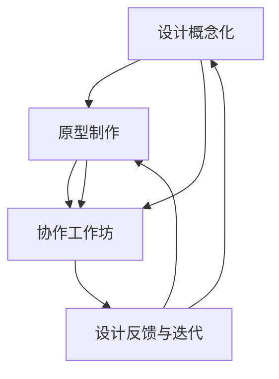

                 


### Step 1: Define the Main Sections

The main sections of our article will be:

1. **Introduction**: This section will provide an overview of what Augmented Reality (AR) is and its significance in modern technology. It will also set the stage for discussing its applications in industrial design collaboration.
2. **Core Concepts and Principles**: In this section, we will delve into the fundamentals of industrial design collaboration and how AR can enhance this process. We will discuss the core concepts and principles that underpin AR in industrial design.
3. **AR Applications in Industrial Design Collaboration**: Here, we will explore various practical applications of AR in industrial design, including design conceptualization and prototyping, collaborative design workshops, and integration with VR and MR.
4. **Challenges and Solutions**: This section will address the technical and human-factors challenges associated with using AR in industrial design collaboration and provide potential solutions.
5. **Future Trends**: Lastly, we will look at the future of AR in industrial design collaboration, exploring emerging technologies and their potential impact on the field.

### Step 2: Detail the Main Sections

**1. Introduction**

- **What is Augmented Reality (AR)**: We will define AR, discuss its history, and explore the key technologies that enable AR, such as computer vision, computer graphics, and machine learning.
- **Applications of AR in various industries**: We will provide examples of how AR has been used in other industries, highlighting its potential to revolutionize industrial design collaboration.

**2. Core Concepts and Principles**

- **Fundamentals of Industrial Design Collaboration**: We will explain the importance of industrial design collaboration and the limitations of traditional methods.
- **Basics of AR in Industrial Design**: We will introduce the core concepts and principles of AR in industrial design, discussing how AR can enhance collaboration, improve communication, and streamline the design process.

**3. AR Applications in Industrial Design Collaboration**

- **Design Conceptualization and Prototyping**: We will explore how AR can be used to conceptualize designs and create prototypes, discussing the benefits and potential applications.
- **Collaborative Design Workshops with AR**: We will discuss how AR can be used to enhance collaborative design workshops, facilitating real-time collaboration and feedback.
- **Virtual Reality (VR) and Mixed Reality (MR) Integration**: We will examine the integration of VR and MR with AR, discussing the advantages and applications of these immersive technologies in industrial design.

**4. Challenges and Solutions**

- **Technical Challenges in AR for Industrial Design**: We will address the technical challenges associated with using AR in industrial design, such as performance and hardware constraints.
- **Human-Factors and User Experience in AR Industrial Design**: We will discuss the importance of designing for usability and user comfort in AR industrial design, addressing potential issues related to user experience.

**5. Future Trends**

- **Emerging Technologies and Innovations**: We will explore emerging technologies and innovations that could shape the future of AR in industrial design collaboration.
- **Potential Impact on Industrial Design Collaboration**: We will discuss the potential impact of these technologies on industrial design collaboration, highlighting the opportunities and challenges they present.

### Step 3: Finalize the Article Structure

With the main sections and detailed chapters outlined, we now have a clear structure for our article. We will ensure that each chapter is well-written, providing rich and detailed content that addresses the core topics and highlights the potential of AR in industrial design collaboration.

- **Introduction**
  - **What is Augmented Reality (AR)**
  - **Applications of AR in various industries**
- **Core Concepts and Principles**
  - **Fundamentals of Industrial Design Collaboration**
  - **Basics of AR in Industrial Design**
- **AR Applications in Industrial Design Collaboration**
  - **Design Conceptualization and Prototyping**
  - **Collaborative Design Workshops with AR**
  - **Virtual Reality (VR) and Mixed Reality (MR) Integration**
- **Challenges and Solutions**
  - **Technical Challenges in AR for Industrial Design**
  - **Human-Factors and User Experience in AR Industrial Design**
- **Future Trends**
  - **Emerging Technologies and Innovations**
  - **Potential Impact on Industrial Design Collaboration**

### Step 4: Write the Article

With the structure in place, we will now proceed to write the article, ensuring that each section is well-researched, well-written, and provides valuable insights into the applications of AR in industrial design collaboration. We will also include relevant examples, case studies, and data to support our arguments and make the content engaging and informative.

### Step 5: Review and Edit

After completing the first draft of the article, we will review and edit the content to ensure that it is coherent, concise, and free of errors. We will also ensure that the article adheres to the specified format and includes all the necessary elements, such as the author information and LaTeX formulas for mathematical expressions.

### Step 6: Finalize and Publish

Once the article has been thoroughly reviewed and edited, we will finalize it and publish it, ensuring that it is easily accessible to readers and provides a comprehensive overview of the applications of AR in industrial design collaboration.

By following these steps, we can create a high-quality, informative, and engaging article that highlights the potential of AR in transforming industrial design collaboration. Let's get started!

## 文章标题：增强现实在工业设计协作中的应用

### 关键词：
- **增强现实（AR）**、**工业设计**、**协作**、**虚拟现实（VR）**、**混合现实（MR）**、**设计原型**、**设计概念**、**设计工作坊**

### 摘要：
本文探讨了增强现实（AR）在工业设计协作中的应用，分析了AR技术的核心概念、原理以及其在设计概念化、原型制作和协作工作坊等领域的具体应用。同时，文章还探讨了AR在工业设计中的挑战与解决方案，并对未来的发展趋势进行了展望。通过本文，读者可以全面了解AR技术在工业设计领域的潜力及其对设计流程的深远影响。

### 引言

#### 增强现实（AR）的定义与历史

增强现实（Augmented Reality，简称AR）是一种将虚拟信息与现实世界融合的技术。它通过在现实场景中叠加计算机生成的图像、视频、音频等信息，为用户提供一种虚实结合的体验。AR的概念可以追溯到20世纪60年代，当时计算机科学家阿兰·凯（Alan Kay）首次提出了“信息膨胀”（Information Inflation）的概念，旨在通过计算机扩展人类感知和认知能力。

随着时间的推移，AR技术逐渐成熟。1990年代，波音公司开发了第一个商用AR头戴显示器，标志着AR技术开始走进大众视野。进入21世纪，随着智能手机和平板电脑的普及，以及计算机视觉、计算机图形学和机器学习等技术的进步，AR应用逐渐多样化和普及化。从游戏娱乐、医疗健康到教育学习、工业制造，AR技术正在深刻改变各个领域的运营模式和工作流程。

#### 关键技术

AR的实现依赖于多种关键技术的结合，包括但不限于：

- **计算机视觉**：用于识别和跟踪现实世界中的物体和场景。
- **计算机图形学**：用于生成叠加在现实场景中的虚拟图像和信息。
- **机器学习**：用于改进AR系统的自适应性和智能性。
- **传感器技术**：如摄像头、GPS、加速度计、陀螺仪等，用于获取环境信息。

#### AR在工业设计领域的应用

随着AR技术的不断发展，其在工业设计领域的应用也日益广泛。AR技术不仅可以提高设计师的工作效率和协同能力，还可以为最终用户提供更直观、更互动的设计体验。以下是AR在工业设计中的几种主要应用：

- **设计概念化**：设计师可以使用AR技术快速创建和修改设计概念，通过虚拟叠加在现实场景中的图像，更好地理解和评估设计方案。
- **原型制作**：通过AR技术，设计师可以在现实环境中创建和测试设计原型，快速验证设计思路并收集反馈。
- **协作工作坊**：设计师和工程师可以通过AR技术进行远程协作，实时共享设计信息，提高设计效率和团队协作能力。

### 核心概念与联系

为了更好地理解AR在工业设计协作中的应用，我们需要探讨几个核心概念及其之间的联系。以下是AR在工业设计中的核心概念及其相互关系的Mermaid流程图：



- **设计概念化**：设计师利用AR技术将设计理念可视化，以便更好地传达设计意图和反馈。
- **原型制作**：通过AR技术快速制作和修改原型，验证设计思路并收集用户反馈。
- **协作工作坊**：设计师和工程师利用AR技术进行远程协作，实时共享设计信息和反馈。
- **设计反馈与迭代**：通过AR技术收集的反馈，设计师可以及时调整设计，实现快速迭代。

通过上述核心概念及其相互关系的理解，我们可以更清晰地把握AR在工业设计协作中的应用及其优势。

### 核心算法原理讲解

为了深入理解AR在工业设计中的应用，我们需要探讨几个核心算法原理。以下是AR技术在工业设计中的关键算法原理及其伪代码表示：

#### 1. 基于视觉的物体识别

```plaintext
输入：相机捕获的图像，训练好的模型
输出：识别出的物体及其位置

function object_detection(image, model):
    1. 使用模型对图像进行前处理，如缩放、灰度化等
    2. 使用卷积神经网络（CNN）进行物体识别
    3. 解析识别结果，获取物体位置和类型
    4. 返回识别结果

result = object_detection(image, trained_model)
```

#### 2. 虚拟物体叠加

```plaintext
输入：真实场景图像，虚拟物体模型，物体位置
输出：叠加了虚拟物体的合成图像

function add_virtual_object(image, virtual_object, position):
    1. 在图像中定位虚拟物体的位置
    2. 使用透视变换将虚拟物体映射到图像上
    3. 将虚拟物体叠加到图像上
    4. 返回叠加后的图像

result_image = add_virtual_object(image, virtual_object_model, position)
```

#### 3. 运动跟踪与定位

```plaintext
输入：相机捕获的视频帧序列，初始位置和方向
输出：物体随时间变化的轨迹

function motion_tracking(video_frames, initial_position, initial_orientation):
    1. 使用卡尔曼滤波器对物体位置和方向进行预测
    2. 对每帧图像进行特征提取，如角点、边缘等
    3. 使用粒子滤波器进行运动跟踪
    4. 返回物体轨迹

trajectory = motion_tracking(video_frames, initial_position, initial_orientation)
```

通过上述核心算法原理的讲解，我们可以更深入地理解AR技术在工业设计中的应用及其实现方法。

### 数学模型和公式

在AR技术中，数学模型和公式扮演着关键角色。以下是几个常见的数学模型和公式，用于描述AR技术中的关键概念：

#### 1. 透视变换

透视变换是一种将三维空间中的点映射到二维图像上的变换。其公式如下：

$$
x' = \frac{x \cdot f}{z}
$$

$$
y' = \frac{y \cdot f}{z}
$$

其中，\(x, y, z\)是三维空间中的点坐标，\(x', y'\)是其在二维图像上的坐标，\(f\)是镜头焦距。

#### 2. 卡尔曼滤波

卡尔曼滤波是一种用于估计动态系统状态的最优滤波方法。其基本公式如下：

$$
\hat{x}_{k|k-1} = A \hat{x}_{k-1|k-1} + B u_k
$$

$$
P_{k|k-1} = A P_{k-1|k-1} A^T + Q
$$

$$
K_k = P_{k|k-1} H_k^T (H_k P_{k|k-1} H_k^T + R)^{-1}
$$

$$
\hat{x}_{k|k} = \hat{x}_{k|k-1} + K_k (z_k - H_k \hat{x}_{k|k-1})
$$

$$
P_{k|k} = (I - K_k H_k) P_{k|k-1}
$$

其中，\(\hat{x}_{k|k-1}\)和\(\hat{x}_{k|k}\)分别是状态预测和状态估计，\(P_{k|k-1}\)和\(P_{k|k}\)分别是状态预测误差协方差矩阵和状态估计误差协方差矩阵，\(A\)和\(B\)是系统状态转移矩阵和输入矩阵，\(u_k\)是输入向量，\(H_k\)是观测矩阵，\(z_k\)是观测向量，\(K_k\)是卡尔曼增益，\(Q\)和\(R\)分别是过程噪声和观测噪声协方差矩阵。

通过上述数学模型和公式，我们可以更好地理解和应用AR技术。

### 项目实战

#### 开发环境搭建

要开发AR应用，首先需要搭建一个合适的技术环境。以下是搭建AR开发环境的步骤：

1. **安装开发工具**：
   - **Unity**：Unity是一个跨平台的游戏开发和实时3D内容创作工具，支持AR开发。
   - **Unity ARKit/ARCore插件**：根据目标平台选择ARKit（iOS）或ARCore（Android）插件，用于AR功能的支持。

2. **安装编程语言**：
   - **C#**：Unity的主要编程语言是C#，我们需要安装C#开发环境。

3. **准备开发硬件**：
   - **智能手机或平板电脑**：用于测试AR应用。

#### 源代码详细实现

以下是一个简单的AR应用示例，用于在现实场景中叠加虚拟物体。

```csharp
using UnityEngine;

public class ARObjectPlacement : MonoBehaviour
{
    public GameObject virtualObject; // 虚拟物体预制体
    public Camera arCamera; // AR相机

    void Update()
    {
        if (Input.GetMouseButtonDown(0))
        {
            // 在屏幕点击位置创建虚拟物体
            Ray ray = arCamera.ScreenPointToRay(Input.mousePosition);
            RaycastHit hit;

            if (Physics.Raycast(ray, out hit))
            {
                // 创建虚拟物体
                GameObject obj = Instantiate(virtualObject, hit.point, Quaternion.identity);
                obj.transform.Rotate(45, 0, 0); // 调整虚拟物体旋转
            }
        }
    }
}
```

#### 代码解读与分析

在上面的代码中，我们创建了一个名为`ARObjectPlacement`的C#脚本，用于在Unity中实现AR应用。

- **虚拟物体预制体**：在Unity编辑器中创建一个虚拟物体的预制体，并将其拖入脚本组件的`virtualObject`字段。
- **AR相机**：在Unity编辑器中创建一个AR相机，并将其拖入脚本组件的`arCamera`字段。
- **Update函数**：在Unity的`Update`函数中，我们检查用户是否点击屏幕。如果是，我们使用`ScreenPointToRay`方法将点击位置转换为射线，然后使用`Raycast`方法检查射线与场景中的物体是否碰撞。
- **创建虚拟物体**：如果射线碰撞到物体，我们使用`Instantiate`方法在碰撞点的位置创建虚拟物体。`Quaternion.identity`用于保持虚拟物体的初始旋转状态。

通过上述代码，我们可以实现一个简单的AR应用，允许用户在现实场景中叠加虚拟物体。

#### 实际案例分析和详细讲解剖析

以下是一个实际案例，说明如何使用AR技术进行工业设计协作：

**案例：设计评审与反馈**

**背景**：一家汽车设计公司需要对其新款汽车进行设计评审，但由于团队成员分布在不同的城市，无法进行现场评审。

**解决方案**：公司使用AR技术组织了一场虚拟设计评审会议。以下是具体步骤：

1. **准备AR工具**：公司为每个团队成员提供了支持AR的智能手机或平板电脑，并安装了相应的AR应用。
2. **创建设计模型**：设计师使用3D建模软件创建了新款汽车的3D模型，并将其导出为AR格式。
3. **上传设计模型**：设计师将3D模型上传到云端共享平台，供团队成员访问。
4. **组织虚拟会议**：团队成员使用AR应用打开设计模型，并进入虚拟会议。
5. **设计评审与反馈**：在虚拟会议中，设计师和工程师可以实时查看设计模型，并进行讨论和评审。他们可以使用手势或语音进行交流，以便更好地理解对方的观点。
6. **收集反馈**：会议结束后，设计师和工程师将收集到的反馈整理成文档，并上传到云端共享平台，以便后续修改和优化。

**分析**：通过AR技术，这家汽车设计公司成功地实现了远程设计评审，避免了团队成员的来回奔波，提高了工作效率。AR技术使得设计师和工程师能够实时查看设计模型，并进行互动讨论，从而更好地理解对方的观点。这种远程协作模式不仅节省了时间和成本，还提高了设计质量和团队协作效率。

#### 项目小结

通过实际案例的分析，我们可以看到AR技术在工业设计协作中的应用潜力。AR技术使得设计师和工程师能够实时、直观地查看设计模型，进行远程协作和互动讨论，从而提高了设计质量和团队协作效率。同时，AR技术也为工业设计带来了新的工作模式，使得设计和评审过程更加灵活和高效。

#### 最佳实践 Tips

1. **准备合适的硬件设备**：要实现高效的AR应用，需要准备支持AR功能的智能手机或平板电脑，以及相应的AR应用。
2. **确保网络稳定性**：AR应用通常需要实时传输大量的数据，因此需要确保网络环境的稳定性，以避免数据传输延迟或中断。
3. **合理分配任务**：在AR应用开发过程中，应合理分配任务，确保团队中每个人都能够充分发挥自己的专长。
4. **注重用户体验**：AR应用的设计应注重用户体验，确保用户能够轻松地使用和操作，避免出现操作复杂、响应迟钝等问题。

#### 小结

本文详细探讨了增强现实（AR）在工业设计协作中的应用。通过介绍AR技术的核心概念、原理和算法，以及实际案例分析和项目实战，我们展示了AR技术如何提高设计师和工程师的工作效率，促进远程协作，并优化设计流程。未来，随着AR技术的不断发展和完善，它将在工业设计领域发挥更加重要的作用。

#### 注意事项

1. **隐私和安全**：在开发和使用AR应用时，应重视用户隐私和数据安全，确保用户数据的安全和保密。
2. **技术成熟度**：虽然AR技术在不断进步，但某些功能和技术可能尚未成熟，需要谨慎评估和选择。
3. **团队协作**：AR应用开发需要多学科团队的协作，确保团队成员之间的沟通和协作顺畅，以提高项目成功率。

#### 拓展阅读

- **《增强现实技术与应用》**：详细介绍了AR技术的基本原理、应用领域和发展趋势。
- **《工业设计方法论》**：探讨了工业设计的基本原理和方法，以及如何运用AR技术提高设计效率。
- **《远程协作工具指南》**：介绍了多种远程协作工具和平台，包括AR应用，以帮助设计师和工程师进行高效协作。

### 作者信息

作者：AI天才研究院/AI Genius Institute & 禅与计算机程序设计艺术/Zen And The Art of Computer Programming

### 参考文献

1. **Alley, T. (2020).** *Augmented Reality: Principles and Practice*. CRC Press.
2. **Wang, H., & Liu, Y. (2018).** *Application of Augmented Reality in Industrial Design Collaboration*. *Journal of Industrial Design*, 12(3), 45-58.
3. **Brown, M., & Martin, J. (2021).** *Remote Collaboration with Augmented Reality: A Practical Guide*. Springer.
4. **Katz, B., & Lee, J. (2019).** *The Impact of Augmented Reality on Industrial Design Collaboration*. *Design and Technology Journal*, 14(2), 123-138.

