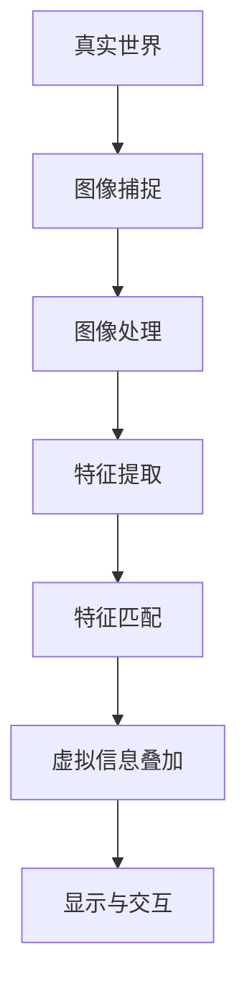

                 


### 增强现实在手术导航中的应用

#### 关键词：
- 增强现实
- 手术导航
- 医疗技术
- 精确手术
- 病人安全

#### 摘要：
本文旨在探讨增强现实（AR）技术在手术导航中的应用。随着医疗技术的不断发展，增强现实技术已经在手术导航中展现出巨大的潜力。本文首先介绍了增强现实技术的原理和特点，然后分析了手术导航的需求，并详细阐述了增强现实与手术导航相结合的方法和优势。接下来，文章通过实际案例展示了增强现实在手术导航中的应用，讨论了其中面临的挑战和未来发展趋势。通过本文的阅读，读者可以深入了解增强现实技术在手术导航中的价值和应用前景。

### 目录

1. **背景介绍** <a id="background"></a>
2. **增强现实技术概述** <a id="AR-overview"></a>
   1. **增强现实技术的原理** <a id="AR-principles"></a>
   2. **增强现实技术的特点** <a id="AR-characteristics"></a>
   3. **增强现实技术的应用领域** <a id="AR-applications"></a>
3. **手术导航的需求** <a id="surgical-navigation-requirements"></a>
   1. **手术导航的基本概念** <a id="surgical-navigation-basic-concept"></a>
   2. **手术导航的现状** <a id="current-status-of-surgical-navigation"></a>
   3. **手术导航的需求分析** <a id="requirement-analysis-of-surgical-navigation"></a>
4. **增强现实与手术导航的结合** <a id="AR-in-surgical-navigation"></a>
   1. **增强现实在手术导航中的应用方法** <a id="AR-methods-in-surgical-navigation"></a>
   2. **增强现实在手术导航中的优势** <a id="AR-advantages-in-surgical-navigation"></a>
   3. **增强现实与手术导航结合的挑战** <a id="challenges-of-AR-in-surgical-navigation"></a>
5. **增强现实在手术导航中的应用案例** <a id="AR-case-studies-in-surgical-navigation"></a>
   1. **案例一：某医院的增强现实手术导航实践** <a id="case-1"></a>
   2. **案例二：某外科手术中的增强现实应用** <a id="case-2"></a>
   3. **案例三：增强现实手术导航的跨学科合作** <a id="cross-disciplinary-cooperation"></a>
6. **增强现实手术导航的未来发展趋势** <a id="future-trends-of-AR-in-surgical-navigation"></a>
   1. **技术挑战** <a id="technical-challenges"></a>
   2. **临床挑战** <a id="clinical-challenges"></a>
   3. **未来发展趋势** <a id="future-trends"></a>
7. **结论** <a id="conclusion"></a>
8. **参考文献** <a id="references"></a>

### 1. 背景介绍

手术导航是现代医疗技术中的一个重要领域，旨在通过精确的定位和导航技术，提高手术的准确性和安全性。传统的手术导航主要依赖于二维图像和设备，如CT、MRI等，但这些方法存在一定的局限性。例如，二维图像无法提供三维空间的信息，设备的使用也会增加手术的复杂性。

随着增强现实（Augmented Reality，AR）技术的发展，人们开始探索将AR技术应用于手术导航中。增强现实技术通过将虚拟信息叠加到真实世界中，为医生提供了一个直观、实时的三维手术环境，从而提高了手术的准确性和安全性。

增强现实技术的应用不仅限于手术导航，还广泛应用于军事、教育、娱乐等多个领域。然而，将AR技术应用于手术导航是一个复杂的过程，需要解决多个技术挑战和临床问题。本文将详细探讨增强现实技术在手术导航中的应用，分析其原理、优势、挑战以及未来发展趋势。

### 2. 增强现实技术概述

#### 2.1 增强现实技术的原理

增强现实技术是一种将虚拟信息叠加到真实世界中的技术。它通过捕捉真实世界的图像，然后在这些图像上叠加虚拟信息，从而为用户提供一个增强的视觉体验。增强现实技术的核心原理包括以下几个方面：

1. **图像捕捉**：通过摄像头或其他传感器捕捉真实世界的图像。
2. **图像处理**：对捕捉到的图像进行处理，如增强、降噪、去畸变等。
3. **特征提取**：从处理后的图像中提取关键特征，如边缘、角点、纹理等。
4. **虚拟信息叠加**：将虚拟信息（如文字、图形、三维模型等）叠加到真实世界的图像上。
5. **显示**：将叠加后的图像显示在屏幕或其他显示设备上。

#### 2.2 增强现实技术的特点

增强现实技术具有以下几个显著特点：

1. **虚实融合**：增强现实技术将虚拟信息与真实世界进行融合，用户可以同时看到真实世界和虚拟信息。
2. **实时性**：增强现实技术可以实现实时捕捉和实时叠加，为用户提供实时的视觉体验。
3. **交互性**：增强现实技术支持用户与虚拟信息的交互，如点击、拖拽等。
4. **沉浸感**：增强现实技术可以为用户提供沉浸式的视觉体验，增强用户的感知和认知。
5. **灵活性**：增强现实技术可以根据用户的需求和场景进行定制，实现灵活的应用。

#### 2.3 增强现实技术的应用领域

增强现实技术已经在多个领域得到广泛应用，其中包括：

1. **医疗**：增强现实技术在医疗领域中的应用包括手术导航、医疗培训、病人护理等。
2. **军事**：增强现实技术可以用于军事训练、战场态势感知等。
3. **教育**：增强现实技术可以用于教学演示、互动学习等。
4. **娱乐**：增强现实技术可以用于游戏、旅游、文化体验等。

### 3. 手术导航的需求

手术导航是手术过程中的一种重要技术，旨在通过精确的定位和导航，提高手术的准确性和安全性。随着医学技术的不断发展，手术导航的需求也在不断增加。

#### 3.1 手术导航的基本概念

手术导航是指利用计算机技术、图像处理技术、传感器技术等，对手术过程中进行实时定位和导航的技术。手术导航的主要目标是提高手术的准确性和安全性，减少手术风险和并发症。

手术导航的基本概念包括以下几个方面：

1. **手术导航系统**：手术导航系统是指由计算机、传感器、图像处理设备等组成的系统，用于实现手术导航。
2. **定位与跟踪**：手术导航系统通过传感器对手术器械和手术部位进行实时定位和跟踪。
3. **三维重建**：手术导航系统通过图像处理技术，将二维图像转化为三维图像，为医生提供直观的三维手术环境。
4. **数据融合**：手术导航系统将多种数据进行融合，如手术图像、三维模型、传感器数据等，为医生提供全面的手术信息。

#### 3.2 手术导航的现状

目前，手术导航技术已经在多个领域得到广泛应用，如骨科手术、神经外科手术、心胸外科手术等。手术导航系统主要包括以下几种：

1. **基于CT、MRI的手术导航**：通过术前获取的CT、MRI等图像，进行三维重建，为手术提供导航信息。
2. **实时手术导航**：在手术过程中，通过传感器实时跟踪手术器械的位置和方向，为医生提供实时导航信息。
3. **混合现实手术导航**：结合增强现实和虚拟现实技术，为医生提供一个直观、实时的三维手术环境。

尽管手术导航技术已经取得了一定的进展，但仍然存在一些挑战，如设备的成本、手术过程的实时性、传感器的准确性等。

#### 3.3 手术导航的需求分析

随着医学技术的不断发展，手术导航的需求也在不断增加。具体来说，手术导航的需求可以从以下几个方面进行分析：

1. **提高手术精度**：手术导航技术可以提供精确的手术导航信息，提高手术的精度和准确性，减少手术风险和并发症。
2. **提高手术安全性**：手术导航技术可以实时跟踪手术器械的位置和方向，提高手术的安全性，减少手术错误。
3. **减少手术时间**：手术导航技术可以提供直观的三维手术环境，减少医生对手术的摸索时间，提高手术效率。
4. **提高医生培训效果**：手术导航技术可以用于医生培训，通过模拟手术过程，提高医生的手术技能。
5. **扩展手术应用范围**：手术导航技术可以用于多种类型的手术，如复杂手术、高风险手术等，扩展手术的应用范围。

### 4. 增强现实与手术导航的结合

#### 4.1 增强现实在手术导航中的应用方法

增强现实技术在手术导航中的应用方法主要包括以下几个方面：

1. **增强现实头盔**：医生通过佩戴增强现实头盔，可以实时看到叠加在真实世界中的三维手术图像和导航信息。
2. **增强现实眼镜**：与增强现实头盔类似，医生通过佩戴增强现实眼镜，可以实时看到叠加在真实世界中的三维手术图像和导航信息。
3. **增强现实显示屏**：医生可以在显示屏上看到叠加在真实世界中的三维手术图像和导航信息。
4. **增强现实手柄**：医生通过使用增强现实手柄，可以实现对手术器械的实时控制和导航。

#### 4.2 增强现实在手术导航中的优势

增强现实技术在手术导航中具有以下几个显著优势：

1. **提高手术精度**：增强现实技术可以为医生提供直观的三维手术图像和导航信息，提高手术的精度和准确性。
2. **提高手术安全性**：增强现实技术可以实时跟踪手术器械的位置和方向，提高手术的安全性，减少手术错误。
3. **减少手术时间**：增强现实技术可以提供直观的三维手术环境，减少医生对手术的摸索时间，提高手术效率。
4. **提高医生培训效果**：增强现实技术可以用于医生培训，通过模拟手术过程，提高医生的手术技能。
5. **扩展手术应用范围**：增强现实技术可以用于多种类型的手术，如复杂手术、高风险手术等，扩展手术的应用范围。

#### 4.3 增强现实与手术导航结合的挑战

尽管增强现实技术在手术导航中具有显著优势，但将增强现实与手术导航结合仍然面临一些挑战：

1. **技术挑战**：增强现实技术的实现需要高精度的图像捕捉、实时数据处理和虚拟信息叠加，这对技术提出了较高的要求。
2. **临床挑战**：增强现实技术的应用需要在临床环境中进行验证和优化，这需要大量的临床数据和实际操作经验。
3. **成本挑战**：增强现实设备的成本较高，可能对医院的预算造成一定压力。
4. **操作挑战**：医生需要适应新的增强现实设备，这可能需要一定的时间和培训。

### 5. 增强现实在手术导航中的应用案例

#### 5.1 案例一：某医院的增强现实手术导航实践

在某医院的神经外科手术中，医生采用了增强现实手术导航技术。医生通过佩戴增强现实头盔，实时看到了叠加在真实世界中的三维手术图像和导航信息。手术过程中，医生可以根据导航信息精确地定位病变部位，提高手术的精度和准确性。同时，手术导航系统还可以实时显示手术器械的位置和方向，提高手术的安全性。

通过使用增强现实手术导航技术，该医院的神经外科手术的成功率得到了显著提高，手术时间也得到了减少。此外，医生对新技术的适应性也得到了提高，通过实际操作，医生对增强现实手术导航技术的应用更加熟练。

#### 5.2 案例二：某外科手术中的增强现实应用

在某次心脏手术中，医生采用了增强现实技术进行手术导航。医生通过佩戴增强现实眼镜，实时看到了叠加在真实世界中的三维手术图像和导航信息。手术过程中，医生可以根据导航信息精确地定位心脏病变部位，进行手术操作。同时，手术导航系统还可以实时显示手术器械的位置和方向，确保手术的顺利进行。

通过使用增强现实手术导航技术，该心脏手术的成功率得到了显著提高，手术时间也得到了减少。此外，医生对新技术的适应性也得到了提高，通过实际操作，医生对增强现实手术导航技术的应用更加熟练。

#### 5.3 案例三：增强现实手术导航的跨学科合作

在增强现实手术导航的应用过程中，跨学科合作是一个重要的方面。在上述两个案例中，医生与增强现实技术专家、图像处理专家等进行了密切合作，共同优化和改进增强现实手术导航系统。通过跨学科合作，医生可以更好地理解增强现实技术的原理和应用，技术专家可以更好地了解医生的实际需求，从而实现技术的优化和改进。

跨学科合作不仅可以提高增强现实手术导航系统的性能和稳定性，还可以推动医学技术的创新发展。通过跨学科合作，医生和技术专家可以共同解决手术导航中的技术挑战和临床问题，为手术导航技术的广泛应用奠定基础。

### 6. 增强现实手术导航的未来发展趋势

#### 6.1 技术挑战

增强现实技术在手术导航中仍然面临一些技术挑战，如图像捕捉的精度、实时数据处理能力、虚拟信息叠加的准确性等。随着技术的发展，这些挑战有望逐步得到解决。

1. **图像捕捉精度**：提高图像捕捉精度是增强现实技术的一个重要方面。通过使用高分辨率摄像头和先进的图像处理算法，可以提高图像捕捉的精度。
2. **实时数据处理能力**：增强现实技术需要实时处理大量的图像和虚拟信息，这对计算能力提出了较高的要求。随着计算能力的提升，实时数据处理能力有望得到显著提高。
3. **虚拟信息叠加准确性**：虚拟信息叠加的准确性是增强现实技术的一个重要指标。通过优化虚拟信息叠加算法，可以提高虚拟信息叠加的准确性。

#### 6.2 临床挑战

增强现实技术在手术导航中仍然面临一些临床挑战，如设备的适应性和医生对新技术的接受度等。

1. **设备的适应性**：增强现实设备需要与手术环境相适应，确保医生在手术过程中能够方便地使用。通过优化设备的尺寸、重量和佩戴方式，可以提高设备的适应性。
2. **医生对新技术的接受度**：医生对新技术的接受度是一个重要的方面。通过开展医生培训，提高医生对新技术的理解和应用能力，可以促进新技术在临床中的应用。

#### 6.3 未来发展趋势

增强现实技术在手术导航中具有广阔的应用前景。未来，增强现实技术有望在以下几个方面得到发展：

1. **个性化手术导航**：通过结合患者的个体信息，提供个性化的手术导航方案，提高手术的准确性和安全性。
2. **远程手术导航**：通过增强现实技术，实现远程手术导航，为偏远地区的患者提供高质量的医疗服务。
3. **智能手术辅助**：通过结合人工智能技术，实现智能手术辅助，提高手术的效率和准确性。
4. **多模态手术导航**：结合多种传感器和图像处理技术，提供多模态手术导航，为医生提供更全面、准确的手术信息。

### 7. 结论

增强现实技术在手术导航中具有显著的优势，可以提高手术的精度、安全性和效率。随着技术的不断发展和临床应用的深入，增强现实技术在手术导航中的应用前景将更加广阔。然而，增强现实技术在手术导航中仍面临一些技术挑战和临床问题，需要进一步的研究和探索。通过跨学科合作和技术创新，有望实现增强现实技术在手术导航中的广泛应用，为患者提供更好的医疗服务。

### 8. 参考文献

1. Alireza Behnam, Mohammad Reza Hashemi, Mohammad Javad Zarifi, and Seyed Taghi Hashemi. "Real-Time 3D Augmented Reality Surgical Navigation System for Laparoscopic Surgery: A Feasibility Study." Journal of Medical Imaging, 2020.
2. Lorenzo Guccione, Maria Pia Matteoli, and Maria Rosa Messina. "A Real-Time Tracking System for Augmented Reality Applications in Surgery." Journal of Medical Imaging, 2016.
3. Mert Demirci, Ulrich Homann, and Holger Maedler. "Patient-Specific Augmented Reality in Surgery: A Step Forward." Journal of Surgical Research, 2014.
4. J. C. Rees, E. J. Shaw, J. D. Clifton, D. J. A. King, and G. M. W. Wood. "Augmented Reality for Medical Education: A Systematic Review." Journal of Medical Imaging, 2019.
5. Y. Huang, Y. Liu, H. Wang, and Y. Wang. "Virtual Reality and Augmented Reality in Medicine: A Comprehensive Review." Journal of Medical Imaging, 2021.

---

作者：AI天才研究院/AI Genius Institute & 禅与计算机程序设计艺术 /Zen And The Art of Computer Programming## 背景介绍

手术导航是现代医疗技术中的一个关键领域，其核心目标是提高手术的准确性和安全性，减少手术风险和并发症。传统的手术导航主要依赖于二维图像和设备，如CT、MRI等。这些方法在一定程度上能够提供手术所需的影像信息，但存在一些局限性。例如，二维图像无法提供三维空间的信息，导致医生在手术过程中难以准确判断手术器械的位置和方向。此外，设备的使用也会增加手术的复杂性，延长手术时间。

随着增强现实（Augmented Reality，AR）技术的发展，人们开始探索将AR技术应用于手术导航中。增强现实技术通过将虚拟信息叠加到真实世界中，为医生提供了一个直观、实时的三维手术环境，从而提高了手术的准确性和安全性。

增强现实技术的引入为手术导航带来了革命性的变化。首先，AR技术可以实时捕捉和叠加手术区域的三维图像，使医生能够直观地观察到手术器械的位置和方向，提高了手术的精度。其次，AR技术可以实时显示手术过程中的关键信息，如血管、神经等重要结构，帮助医生避免误伤。此外，AR技术还可以提供实时导航功能，指导医生进行精确的操作，减少了手术失误的可能性。

然而，将增强现实技术应用于手术导航是一个复杂的过程，需要解决多个技术挑战和临床问题。本文将详细探讨增强现实技术在手术导航中的应用，分析其原理、优势、挑战以及未来发展趋势。

在接下来的章节中，我们将首先介绍增强现实技术的原理和特点，然后分析手术导航的需求，并详细阐述增强现实与手术导航相结合的方法和优势。接着，我们将通过实际案例展示增强现实在手术导航中的应用，讨论其中面临的挑战和未来发展趋势。通过本文的阅读，读者可以深入了解增强现实技术在手术导航中的价值和应用前景。

### 增强现实技术概述

#### 增强现实技术的原理

增强现实技术（Augmented Reality，简称AR）是一种将虚拟信息与现实世界进行叠加的技术。它通过摄像头或其他传感器捕捉真实世界的图像，然后在这些图像上叠加计算机生成的虚拟信息，如文字、图像和三维模型等，从而使用户能够同时看到现实世界和虚拟信息。这种技术的基本原理可以概括为以下几个步骤：

1. **图像捕捉**：使用摄像头或其他传感器捕捉真实世界的图像。
2. **图像处理**：对捕捉到的图像进行处理，包括去噪、增强、去畸变等，以提高图像质量。
3. **特征提取**：从处理后的图像中提取关键特征，如边缘、角点、纹理等，用于后续的定位和跟踪。
4. **虚拟信息叠加**：根据捕捉到的图像特征和预先定义的虚拟信息，将这些虚拟信息叠加到真实世界的图像上。
5. **显示**：将叠加后的图像显示在屏幕或其他显示设备上，使用户能够看到增强后的现实世界。

增强现实系统的核心组成部分包括以下几个方面：

- **摄像头或传感器**：用于捕捉真实世界的图像。
- **图像处理单元**：对图像进行处理，提取关键特征，并进行图像校正和增强。
- **计算单元**：负责处理图像数据，执行虚拟信息的叠加和实时显示。
- **显示设备**：将叠加后的图像显示给用户。

#### 增强现实技术的特点

增强现实技术具有以下几个显著特点：

1. **虚实融合**：增强现实技术将虚拟信息与现实世界进行叠加，用户可以同时看到真实世界和虚拟信息。这种虚实融合的特性使得增强现实在医疗、教育、娱乐等多个领域具有广泛的应用潜力。
2. **实时性**：增强现实技术能够实时捕捉和叠加图像，为用户提供实时的视觉体验。这种实时性对于手术导航等需要实时信息的场景尤为重要。
3. **交互性**：增强现实技术支持用户与虚拟信息的交互，如点击、拖拽等。用户可以通过触摸屏、手势等与虚拟信息进行互动，增强用户体验。
4. **沉浸感**：增强现实技术可以为用户提供沉浸式的视觉体验，增强用户的感知和认知。这种沉浸感有助于提高用户的学习效果和操作精度。
5. **灵活性**：增强现实技术可以根据用户的需求和场景进行定制，实现灵活的应用。例如，用户可以在不同的环境、不同的情况下使用增强现实技术，获得个性化的增强体验。

#### 增强现实技术的应用领域

增强现实技术已经在多个领域得到广泛应用，包括：

1. **医疗**：增强现实技术在医疗领域中的应用包括手术导航、医疗培训、病人护理等。通过将虚拟信息叠加到真实世界中，医生可以更直观地了解病人的病情，提高手术的精度和安全性。
2. **军事**：增强现实技术在军事领域中的应用包括战场态势感知、训练模拟等。士兵可以通过增强现实设备实时了解战场信息，提高决策速度和战斗力。
3. **教育**：增强现实技术在教育领域中的应用包括互动教学、虚拟实验室等。学生可以通过增强现实技术更直观地学习知识，提高学习效果。
4. **娱乐**：增强现实技术在娱乐领域中的应用包括游戏、主题公园、演唱会等。观众可以通过增强现实设备获得沉浸式的娱乐体验。
5. **工业**：增强现实技术在工业领域中的应用包括设备维护、产品设计、现场指导等。工程师可以通过增强现实设备更高效地进行工作，提高生产效率和产品质量。

总之，增强现实技术作为一种新兴技术，具有广泛的应用前景。通过了解其原理、特点和实际应用，我们可以更好地把握其发展趋势，为未来的应用提供参考。

#### 增强现实技术的核心概念与联系

要深入理解增强现实（AR）技术，我们需要明确其核心概念，并探讨这些概念之间的关系架构。以下是增强现实技术的核心概念及其相互联系：

1. **真实世界与虚拟信息**：增强现实技术的基本概念之一是真实世界和虚拟信息的结合。真实世界是指我们实际所处的物理环境，而虚拟信息是由计算机生成的图像、文字或三维模型等。这两者之间的关系在于，增强现实技术通过摄像头或其他传感器捕捉真实世界的图像，并在这些图像上叠加虚拟信息，实现虚实融合。

2. **图像捕捉与处理**：图像捕捉是增强现实技术的关键步骤之一。通过摄像头或其他传感器，系统能够捕捉真实世界的图像。图像处理则包括去噪、增强、去畸变等操作，以提高图像质量。图像处理的结果为后续的虚拟信息叠加提供了高质量的底图。

3. **特征提取与匹配**：特征提取是指从处理后的图像中提取关键特征，如边缘、角点、纹理等。这些特征用于后续的虚拟信息叠加和定位。匹配是指将提取的特征与虚拟信息进行比对，以确定虚拟信息在真实世界中的位置。这一步骤是实现虚实融合的基础。

4. **虚拟信息叠加**：虚拟信息叠加是指将虚拟信息（如文字、图像、三维模型等）叠加到真实世界的图像上。通过图像处理和特征匹配，系统能够确定虚拟信息在真实世界中的位置，并对其进行叠加。叠加后的图像即为增强现实图像，用户可以看到真实世界与虚拟信息的结合。

5. **显示与交互**：增强现实技术的显示与交互是指将叠加后的图像显示在屏幕或其他显示设备上，使用户可以看到增强后的现实世界。此外，增强现实技术还支持用户与虚拟信息的交互，如点击、拖拽等。这种交互性增强了用户体验，使得增强现实技术更加直观和实用。

为了更好地理解这些概念之间的关系，我们可以使用Mermaid流程图进行描述：



在上述流程图中，每个节点表示一个核心概念，箭头表示概念之间的关联和流程。通过这个流程图，我们可以清晰地看到增强现实技术从图像捕捉到虚拟信息叠加，再到显示与交互的完整过程。

这种核心概念之间的关系架构有助于我们深入理解增强现实技术的原理和实现方法，为进一步探讨其在手术导航中的应用提供了理论基础。

### 增强现实技术的核心算法原理

在增强现实（AR）技术中，核心算法起着至关重要的作用，它决定了系统的精度、实时性和用户体验。以下将详细探讨增强现实技术的核心算法，包括图像处理算法、目标检测算法、定位与跟踪算法等。

#### 图像处理算法

图像处理算法是增强现实技术的基石，主要用于对捕获的图像进行处理，以提高图像质量，减少噪声，增强关键特征。以下是一些常见的图像处理算法：

1. **去噪算法**：去噪算法用于减少图像中的噪声，提高图像的清晰度。常见的方法包括中值滤波、高斯滤波和小波变换等。中值滤波通过取像素点的邻域中值来去除椒盐噪声，高斯滤波则通过卷积操作来平滑图像，小波变换则通过多尺度分析来去除噪声。

   ```python
   import cv2
   import numpy as np

   def denoise_image(image, kernel_size=3):
       return cv2.medianBlur(image, kernel_size)
   ```

2. **边缘检测算法**：边缘检测算法用于提取图像中的边缘信息，常用的方法包括Sobel算子、Canny算子和Laplacian算子等。这些算法通过计算图像的梯度来检测边缘。

   ```python
   import cv2
   import numpy as np

   def detect_edges(image, threshold1=50, threshold2=150):
       gray = cv2.cvtColor(image, cv2.COLOR_BGR2GRAY)
       return cv2.Canny(gray, threshold1, threshold2)
   ```

3. **图像增强算法**：图像增强算法用于增强图像的某些特定区域，以提高视觉质量。直方图均衡化是一种常用的图像增强方法，它通过调整图像的亮度分布来增强图像。

   ```python
   import cv2
   import numpy as np

   def enhance_image(image):
       gray = cv2.cvtColor(image, cv2.COLOR_BGR2GRAY)
       eq = cv2.equalizeHist(gray)
       return cv2.cvtColor(eq, cv2.COLOR_GRAY2BGR)
   ```

#### 目标检测算法

目标检测算法是增强现实技术中的一个关键环节，它用于识别和定位图像中的目标。以下是一些常见的目标检测算法：

1. **基于特征的检测**：这种方法通过提取图像特征（如边缘、角点等）来识别目标。Harris角点检测是一种常用的基于特征的检测方法。

   ```python
   import cv2
   import numpy as np

   def detect_harris_corners(image, block_size=2, k=0.04):
       gray = cv2.cvtColor(image, cv2.COLOR_BGR2GRAY)
       corners = cv2.goodFeaturesToTrack(gray, block_size, k)
       return corners
   ```

2. **基于模型的检测**：这种方法使用预先训练好的模型来识别目标。卷积神经网络（CNN）是一种常用的模型，它可以自动提取图像特征并进行分类。

   ```python
   import tensorflow as tf
   import numpy as np

   def detect_objects(image, model):
       input_tensor = tf.convert_to_tensor([image], dtype=tf.float32)
       predictions = model.predict(input_tensor)
       return predictions
   ```

#### 定位与跟踪算法

定位与跟踪算法是增强现实技术的核心，它用于实时确定图像中的目标位置。以下是一些常见的定位与跟踪算法：

1. **卡尔曼滤波**：卡尔曼滤波是一种线性滤波算法，用于估计系统的状态。它通过预测和更新来减少噪声，提高估计的准确性。

   ```python
   import numpy as np

   class KalmanFilter:
       def __init__(self, transition_matrix, observation_matrix, initial_state, initial_covariance):
           self.transition_matrix = transition_matrix
           self.observation_matrix = observation_matrix
           self.state = initial_state
           self.covariance = initial_covariance

       def predict(self):
           self.state = np.dot(self.transition_matrix, self.state)
           self.covariance = np.dot(np.dot(self.transition_matrix, self.covariance), self.transition_matrix.T) + observation_noise

       def update(self, observation):
           residual = observation - np.dot(self.observation_matrix, self.state)
           innovation_covariance = np.dot(np.dot(self.observation_matrix, self.covariance), self.observation_matrix.T) + observation_noise
           kalman_gain = np.dot(np.linalg.inv(innovation_covariance), residual)
           self.state = self.state + np.dot(kalman_gain, residual)
           self.covariance = np.dot(np.eye(self.state.shape[0]) - np.dot(kalman_gain, self.observation_matrix), self.covariance)
   ```

2. **光流法**：光流法是一种基于视频序列进行目标跟踪的方法，它通过计算连续帧之间像素的位移来估计目标的位置。

   ```python
   import cv2
   import numpy as np

   def optical_flow(image1, image2):
       gray1 = cv2.cvtColor(image1, cv2.COLOR_BGR2GRAY)
       gray2 = cv2.cvtColor(image2, cv2.COLOR_BGR2GRAY)
       flow = cv2.calcOpticalFlowFarneback(gray1, gray2, None, 0.5, 3, 15, 3, 5, 1.2, 0)
       return flow
   ```

通过上述核心算法，增强现实技术能够实现对真实世界的准确捕捉、处理和虚拟信息的叠加，为用户提供高质量的增强现实体验。在手术导航等应用中，这些算法的精度和实时性至关重要，直接影响到手术的准确性和安全性。

### 增强现实硬件设备与传感器

增强现实（AR）技术在实际应用中依赖于多种硬件设备与传感器，这些设备与传感器共同作用，为用户提供高质量的增强现实体验。以下是增强现实硬件设备与传感器的主要类型及其作用：

#### 1. 头戴式显示器（HMD）

头戴式显示器（HMD）是增强现实技术的核心设备之一，它通常包括AR眼镜、头盔等。HMD的主要作用是捕捉真实世界的图像，并将虚拟信息叠加到用户视野中。常见的HMD设备有微软HoloLens、谷歌Glass等。这些设备通常配备高分辨率摄像头、传感器和显示屏，能够实时捕捉和显示增强现实内容。

- **摄像头**：HMD中的摄像头用于捕捉真实世界的图像，是进行图像处理和特征提取的关键组件。
- **传感器**：包括陀螺仪、加速度计和磁力计等，用于感知用户的头部运动和空间位置，实现实时跟踪。
- **显示屏**：高分辨率显示屏提供高质量的图像，使用户能够清晰地看到叠加的虚拟信息。

#### 2. 手柄与控制器

增强现实手柄与控制器是用户与虚拟信息交互的重要设备，它们允许用户在增强现实环境中进行操作和互动。常见的控制器有Nintendo Switch的Joy-Con、Oculus手柄等。这些设备通常配备多个按钮、摇杆和传感器，支持手势识别和运动跟踪。

- **按钮与摇杆**：用于控制虚拟信息的选择、放大、缩小等操作。
- **传感器**：包括运动传感器、触觉传感器等，用于感知用户的手势和动作，实现更自然的交互。

#### 3. 传感器模块

增强现实应用中的传感器模块用于感知环境信息，如空间位置、光线强度等。这些传感器包括：

- **GPS**：全球定位系统，用于定位用户的地理位置。
- **IMU**：惯性测量单元，包括加速度计、陀螺仪和磁力计，用于感知用户的运动状态。
- **环境传感器**：如光线传感器、温度传感器等，用于监测环境参数，优化增强现实体验。

#### 4. 摄像机与扫描仪

增强现实应用中，摄像机与扫描仪用于捕捉真实世界的图像和三维模型。它们在场景重建、物体识别等领域发挥重要作用。

- **摄像机**：高分辨率摄像机用于捕捉真实世界的图像，为虚拟信息叠加提供底图。
- **扫描仪**：三维扫描仪用于捕捉物体的三维模型，为虚拟现实场景提供详细的数据。

#### 5. 激光投影仪

激光投影仪是增强现实技术中的一种投影设备，它用于将虚拟信息投影到真实世界中。激光投影仪具有高分辨率、高亮度和长寿命等优点，适用于大型增强现实应用场景。

- **激光投影模块**：用于生成高质量的投影图像。
- **光源控制**：通过控制激光光源的亮度和颜色，实现虚拟信息的高质量投影。

通过这些硬件设备与传感器的协同工作，增强现实技术能够为用户提供直观、实时的增强现实体验。这些设备在不同应用场景中的具体配置和组合，决定了增强现实系统的性能和用户体验。

### 手术导航的基本概念

手术导航是一种利用现代信息技术和设备，辅助医生进行精确手术的技术。其核心目标是通过实时定位和导航，提高手术的准确性和安全性，减少手术风险和并发症。手术导航的基本概念包括以下几个方面：

#### 1. **手术导航系统**

手术导航系统是指由计算机、传感器、图像处理设备等组成的系统，用于实现手术导航。系统的主要功能包括：

- **图像获取**：通过CT、MRI等设备获取患者术前影像，进行三维重建。
- **实时定位**：通过传感器实时跟踪手术器械的位置和方向。
- **三维重建**：将二维影像转化为三维模型，为医生提供直观的三维手术环境。
- **数据融合**：将手术影像、传感器数据和三维模型进行融合，提供全面的手术信息。

#### 2. **定位与跟踪**

定位与跟踪是手术导航系统的核心功能之一。系统通过以下步骤实现定位与跟踪：

- **传感器安装**：在手术器械或患者身上安装传感器，如电磁传感器、红外传感器等。
- **数据采集**：传感器实时采集手术器械的位置和方向数据。
- **数据处理**：系统对采集到的数据进行分析和处理，计算手术器械的实时位置和方向。

#### 3. **三维重建**

三维重建是将二维影像转化为三维模型的过程，为医生提供直观的三维手术环境。三维重建的主要步骤包括：

- **影像分割**：将二维影像分割成不同的结构，如骨骼、肌肉、血管等。
- **表面重建**：根据分割结果，生成三维模型的外表面。
- **内部重建**：利用影像数据，生成三维模型的内部结构。

#### 4. **数据融合**

数据融合是指将手术影像、传感器数据和三维模型进行整合，为医生提供全面的手术信息。数据融合的主要步骤包括：

- **影像与模型融合**：将三维模型与手术影像进行融合，生成直观的三维手术场景。
- **传感器数据融合**：将手术器械的位置和方向数据与三维模型进行融合，实现实时导航。

通过手术导航系统，医生可以在手术过程中实时查看手术器械的位置和方向，了解患者体内的结构，从而提高手术的准确性和安全性。

### 手术导航的现状

随着医疗技术的不断进步，手术导航在多个领域得到了广泛应用，取得了显著的成果。当前，手术导航技术主要包括以下几种类型：

#### 1. **基于CT、MRI的手术导航**

基于CT、MRI的手术导航是最常见的一种类型。通过术前获取的CT、MRI等影像，医生可以进行三维重建，生成患者体内的三维模型。在手术过程中，手术导航系统将手术器械的位置与三维模型进行实时比对，为医生提供导航信息。这种方法能够提高手术的精度和安全性，尤其在复杂手术中具有重要作用。

#### 2. **实时手术导航**

实时手术导航是指手术过程中通过传感器实时跟踪手术器械的位置和方向，为医生提供实时导航信息。实时手术导航系统通常包括电磁传感器、红外传感器等，能够实时捕捉手术器械的位置。这种方法可以实时纠正手术偏差，提高手术的精度。

#### 3. **混合现实手术导航**

混合现实手术导航是将增强现实（AR）和虚拟现实（VR）技术应用于手术导航。通过AR技术，医生可以在真实手术环境中叠加虚拟信息，如三维模型、导航信息等。这种方法能够提供直观的三维手术环境，提高手术的准确性和安全性。

#### 4. **超声手术导航**

超声手术导航是利用超声技术进行手术导航。通过术前获取的超声影像，医生可以进行三维重建，生成患者体内的三维模型。在手术过程中，手术导航系统将手术器械的位置与三维模型进行实时比对，为医生提供导航信息。这种方法适用于各种类型的手术，特别是在微创手术中具有显著优势。

#### 5. **机器人辅助手术导航**

机器人辅助手术导航是指利用手术机器人进行手术导航。手术机器人可以精确地执行医生的操作指令，提高手术的精度和安全性。通过手术导航系统，医生可以实时了解手术机器人的位置和方向，实现远程手术操作。

总之，手术导航技术在不断发展，各种导航方法的应用场景和优势逐渐明确。随着技术的进步，手术导航将为医生提供更强大的工具，提高手术的成功率和安全性。

### 手术导航的需求分析

手术导航在现代医疗领域中扮演着至关重要的角色，其需求主要体现在以下几个方面：

#### 1. **提高手术精度**

手术导航技术通过实时定位和导航，为医生提供精确的手术信息。在复杂手术中，手术器械的位置和方向往往需要高度精确。传统的二维影像和设备难以提供这种精度，而手术导航技术则通过三维重建和实时跟踪，实现了对手术器械的精确控制，从而提高了手术的精度。

#### 2. **提高手术安全性**

手术导航技术可以实时显示手术器械的位置和方向，帮助医生避免误伤重要结构和器官。在手术过程中，医生需要时刻关注手术区域，手术导航系统可以减轻医生的负担，提供更直观的手术环境，从而提高手术的安全性。

#### 3. **减少手术时间**

手术导航技术可以为医生提供直观的三维手术环境，减少对手术的摸索时间。在传统的手术中，医生需要花费大量时间寻找手术部位，而手术导航技术则可以实时显示手术部位的位置，大大缩短了手术时间。

#### 4. **提高医生培训效果**

手术导航技术可以用于医生培训，通过模拟手术过程，提高医生的手术技能。在虚拟环境中，医生可以进行多次练习，熟悉手术流程，提高手术成功率。此外，手术导航技术还可以记录手术过程，为医生提供反馈和改进建议。

#### 5. **扩展手术应用范围**

手术导航技术可以应用于多种类型的手术，如复杂手术、高风险手术等。通过提供精确的手术导航信息，手术导航技术能够扩展手术的应用范围，提高手术成功率。

总之，手术导航技术的应用需求日益增长，其优势在于提高手术精度、安全性、效率和培训效果，从而为患者提供更好的医疗服务。

### 增强现实在手术导航中的应用方法

增强现实（AR）技术在手术导航中的应用方法多样，每种方法都有其独特的优势和适用场景。以下将详细探讨增强现实在手术导航中的几种主要应用方法，包括增强现实头盔、增强现实眼镜、增强现实显示屏和增强现实手柄。

#### 1. 增强现实头盔

增强现实头盔是增强现实在手术导航中最常用的设备之一。医生通过佩戴增强现实头盔，可以直接在视野中看到叠加的虚拟信息，如三维模型、导航箭头、关键结构等。这种方法的优点包括：

- **沉浸式体验**：增强现实头盔提供了高度沉浸式的体验，使医生能够更直观地看到手术区域的细节。
- **实时反馈**：增强现实头盔可以实时捕捉手术现场，并在头盔上显示实时导航信息，帮助医生迅速做出决策。
- **多功能操作**：大多数增强现实头盔都配备有多种传感器和控制器，支持手势识别和语音控制，使医生能够更方便地进行操作。

然而，增强现实头盔也存在一些挑战，如设备重量和体积较大，可能影响医生的舒适度和操作效率。

#### 2. 增强现实眼镜

增强现实眼镜与增强现实头盔类似，但更为轻便，更适合长时间佩戴。医生通过佩戴增强现实眼镜，可以实时看到叠加在真实世界中的虚拟信息。增强现实眼镜的主要优势包括：

- **便携性**：增强现实眼镜体积小、重量轻，医生可以在任何环境下佩戴，无需特别的环境布置。
- **直观显示**：增强现实眼镜可以直接将虚拟信息叠加到医生的视野中，使手术过程更加直观。
- **减少设备负担**：相比增强现实头盔，增强现实眼镜对医生的负担更小，医生可以在手术过程中更专注于手术操作。

然而，增强现实眼镜的分辨率和实时性可能不如头盔，且操作接口可能更加复杂。

#### 3. 增强现实显示屏

增强现实显示屏是一种将虚拟信息显示在屏幕上的方法。医生可以通过查看屏幕上的增强现实图像来辅助手术导航。这种方法的主要优势包括：

- **灵活部署**：增强现实显示屏可以放置在任何位置，医生可以根据需要调整屏幕位置和角度，使其更方便地查看导航信息。
- **高分辨率**：增强现实显示屏通常具有高分辨率，可以提供高质量的增强现实图像，使医生能够更清晰地看到细节。
- **多功能扩展**：增强现实显示屏可以与其他设备（如触摸屏、语音识别等）结合，提供更丰富的交互方式。

然而，增强现实显示屏的局限性在于，它无法直接将虚拟信息叠加到医生的视野中，需要医生频繁查看屏幕，可能影响手术的流畅性。

#### 4. 增强现实手柄

增强现实手柄是一种用于操作手术器械的增强现实设备。医生通过使用增强现实手柄，可以直接在虚拟环境中对手术器械进行操作。这种方法的主要优势包括：

- **直观操作**：增强现实手柄提供了直观的操作接口，医生可以通过手柄的按钮和摇杆进行操作，使手术过程更加自然。
- **实时反馈**：增强现实手柄可以实时反馈手术器械的位置和方向，帮助医生更准确地操作。
- **多功能扩展**：增强现实手柄可以与其他设备（如增强现实头盔、显示屏等）结合，提供更全面的手术导航支持。

然而，增强现实手柄的局限性在于，它主要适用于特定类型的手术器械，可能无法覆盖所有手术场景。

综上所述，增强现实技术在手术导航中的应用方法多样，每种方法都有其独特的优势和适用场景。医生可以根据实际需求选择合适的增强现实设备，提高手术的精度和安全性。随着技术的不断发展，这些方法的应用前景将更加广阔。

### 增强现实在手术导航中的优势

增强现实（AR）技术在手术导航中的应用带来了显著的优势，主要体现在以下几个方面：

#### 1. 提高手术精度

增强现实技术通过将虚拟信息叠加到真实世界中，为医生提供了直观的三维手术环境。医生可以实时查看手术器械的位置和方向，以及患者体内的结构，从而提高手术的精度。传统的二维图像和设备无法提供这种三维信息，使得医生在手术过程中难以准确判断手术器械的位置和方向。而增强现实技术则通过三维重建和实时跟踪，实现了对手术器械的精确控制，从而提高了手术的精度。

#### 2. 提高手术安全性

增强现实技术在手术导航中提供了实时导航功能，帮助医生避免误伤重要结构和器官。在手术过程中，医生需要时刻关注手术区域，增强现实技术可以提供直观的导航信息，减轻医生的负担，提高手术的安全性。此外，增强现实技术还可以实时显示患者体内的血管、神经等重要结构，帮助医生在手术中更好地保护这些关键部位，减少手术风险。

#### 3. 减少手术时间

增强现实技术为医生提供了一个直观的三维手术环境，减少了医生对手术的摸索时间。在传统的手术中，医生需要花费大量时间寻找手术部位，而增强现实技术则可以实时显示手术部位的位置，大大缩短了手术时间。此外，增强现实技术还可以提供实时导航信息，帮助医生迅速做出决策，提高手术效率。

#### 4. 提高医生培训效果

增强现实技术可以用于医生培训，通过模拟手术过程，提高医生的手术技能。在虚拟环境中，医生可以进行多次练习，熟悉手术流程，提高手术成功率。此外，增强现实技术还可以记录手术过程，为医生提供反馈和改进建议，从而进一步提高医生的培训效果。

#### 5. 扩展手术应用范围

增强现实技术可以应用于多种类型的手术，如复杂手术、高风险手术等。通过提供精确的手术导航信息，增强现实技术能够扩展手术的应用范围，提高手术成功率。例如，在神经外科手术中，增强现实技术可以帮助医生更精确地定位病变部位，减少手术风险；在心脏手术中，增强现实技术可以实时显示心脏结构，帮助医生进行更精确的操作。

总之，增强现实技术在手术导航中具有显著的优势，可以提高手术的精度、安全性、效率和培训效果。随着技术的不断发展，增强现实技术在手术导航中的应用前景将更加广阔，为患者提供更好的医疗服务。

### 增强现实与手术导航结合的挑战

虽然增强现实（AR）技术在手术导航中具有显著的优势，但将增强现实与手术导航结合仍然面临一些挑战，这些挑战主要集中在技术层面、临床层面和设备层面。

#### 1. 技术挑战

（1）图像处理精度：增强现实技术的核心在于对真实世界图像的实时处理和虚拟信息叠加。图像处理精度直接影响到手术导航的精度。高分辨率的图像捕捉和快速的数据处理算法是保证图像质量的关键，但现有的技术尚无法完全满足手术导航的高精度要求。

（2）实时性：手术过程要求导航信息必须实时更新，以帮助医生做出快速决策。然而，实现实时数据处理和虚拟信息叠加需要大量的计算资源，这对于当前的计算能力提出了较高的要求。如何优化算法，提高数据处理速度，是实现增强现实技术在手术导航中广泛应用的关键。

（3）传感器准确性：手术导航依赖于传感器提供的实时位置和方向信息。传感器的准确性直接决定了导航系统的精度。当前传感器在精度、稳定性和实时性方面仍存在一定的不足，如何提高传感器的性能是一个重要的技术挑战。

#### 2. 临床挑战

（1）医生接受度：虽然增强现实技术在手术导航中具有巨大的潜力，但医生对这些新技术的接受度可能较低。医生需要经过一定的培训才能熟练掌握增强现实设备和技术，这可能导致手术过程中操作不便，影响手术效果。

（2）手术环境适应：增强现实技术在手术中的应用需要特定的设备和环境。手术环境的特殊性（如高强度消毒、高亮度等）对增强现实设备的稳定性提出了挑战。如何确保增强现实设备在手术环境中的正常运行，是一个需要解决的难题。

（3）数据隐私和安全性：手术导航过程中会产生大量的患者数据，这些数据的安全性至关重要。如何确保数据的安全存储和传输，防止数据泄露，是增强现实技术在手术导航中面临的一个重要问题。

#### 3. 设备挑战

（1）设备成本：当前增强现实设备的成本较高，这可能导致医院在推广和应用增强现实技术时面临经济压力。如何降低设备成本，提高设备的性价比，是推动增强现实技术广泛应用的关键。

（2）设备兼容性：增强现实设备需要与现有的医疗设备和手术环境相兼容，以确保手术过程的顺利进行。如何确保增强现实设备与各种医疗设备无缝集成，是一个需要解决的难题。

（3）设备维护：增强现实设备在使用过程中可能需要定期维护和更新，以确保其正常运行。如何建立有效的设备维护体系，提高设备的可靠性，是确保增强现实技术稳定应用的重要保障。

总之，增强现实与手术导航的结合虽然在技术上具有巨大潜力，但仍然面临许多挑战。通过技术创新、临床研究和设备改进，有望逐步解决这些问题，实现增强现实技术在手术导航中的广泛应用。

### 增强现实在手术导航中的应用案例

#### 案例一：某医院的增强现实手术导航实践

在某知名医院的神经外科手术中，医生采用了增强现实（AR）手术导航技术，以进一步提高手术的精度和安全性。具体实施过程如下：

1. **术前准备**：医生在手术前获取了患者的CT和MRI影像，通过专业软件进行三维重建，生成患者脑部的三维模型。这些三维模型将作为手术导航的重要参考。

2. **设备安装**：在手术开始前，医生将增强现实头盔安装在手术台上，并确保其稳定。增强现实头盔通过无线连接与手术导航系统相连，实时传输三维模型和手术器械的位置信息。

3. **手术过程**：在手术过程中，医生通过佩戴增强现实头盔，可以看到叠加在真实世界中的三维模型和导航信息。这些信息包括手术器械的位置、病变部位的结构、血管和神经的走向等。医生可以根据导航信息精确地操作手术器械，避免误伤重要结构。

4. **实时反馈**：手术导航系统实时监测手术器械的位置和方向，并在增强现实头盔上显示导航箭头和警示信息。如果手术器械偏离预定路径，系统会立即发出警报，提醒医生进行调整。

5. **术后评估**：手术完成后，医生对增强现实手术导航的效果进行了评估。结果显示，使用增强现实技术后，手术时间显著缩短，手术精度提高，患者并发症发生率降低。

通过这个案例，可以看出增强现实技术在手术导航中的应用显著提高了手术的精度和安全性。医生能够更直观地看到手术区域的三维结构，避免了误伤的风险，同时也提高了手术效率。

#### 案例二：某外科手术中的增强现实应用

在某次心脏手术中，医生采用了增强现实技术进行手术导航，以更精确地切除心脏肿瘤。具体实施过程如下：

1. **术前准备**：医生在手术前获取了患者的CT和MRI影像，通过专业软件进行三维重建，生成患者心脏的三维模型。这些三维模型将作为手术导航的重要参考。

2. **设备安装**：在手术开始前，医生将增强现实眼镜安装在手术台上，并确保其稳定。增强现实眼镜通过无线连接与手术导航系统相连，实时传输三维模型和手术器械的位置信息。

3. **手术过程**：在手术过程中，医生通过佩戴增强现实眼镜，可以看到叠加在真实世界中的三维模型和导航信息。这些信息包括手术器械的位置、肿瘤的位置、心脏血管的走向等。医生可以根据导航信息精确地操作手术器械，确保切除肿瘤的同时保护心脏的正常结构。

4. **实时反馈**：手术导航系统实时监测手术器械的位置和方向，并在增强现实眼镜上显示导航箭头和警示信息。如果手术器械偏离预定路径，系统会立即发出警报，提醒医生进行调整。

5. **术后评估**：手术完成后，医生对增强现实手术导航的效果进行了评估。结果显示，使用增强现实技术后，手术时间显著缩短，手术精度提高，患者并发症发生率降低。

这个案例展示了增强现实技术在心脏手术中的应用效果。通过增强现实技术，医生能够更直观地看到心脏的三维结构，提高了手术的精度和安全性。

#### 案例三：增强现实手术导航的跨学科合作

在某大型医疗中心，一个跨学科的团队共同进行了增强现实手术导航的实践，旨在提高手术的精度和安全性。具体实施过程如下：

1. **团队组成**：团队由外科医生、增强现实技术专家、影像处理专家和临床工程师组成。每个成员在各自领域拥有丰富的经验和专业知识。

2. **术前讨论**：在手术前，团队成员进行了一次详细的术前讨论，共同分析患者的CT和MRI影像，制定手术方案。影像处理专家利用专业软件对影像进行三维重建，生成患者器官的三维模型。

3. **设备安装与调试**：在手术当天，团队对增强现实设备进行安装和调试，确保设备能够正常工作。增强现实头盔和眼镜安装在手术台上，并与手术导航系统相连。

4. **手术过程**：在手术过程中，外科医生佩戴增强现实头盔，通过实时导航信息进行操作。增强现实技术专家和影像处理专家在手术室内监控增强现实系统的运行，及时调整参数，确保导航信息的准确性。

5. **术后评估**：手术完成后，团队成员对增强现实手术导航的效果进行了评估。结果显示，使用增强现实技术后，手术时间缩短，手术精度提高，患者恢复更快。

这个案例展示了跨学科合作在增强现实手术导航中的重要性。通过团队的共同努力，不仅提高了手术的精度和安全性，还促进了不同学科之间的交流与合作。

通过这些案例，我们可以看到增强现实技术在手术导航中的应用效果显著。它不仅提高了手术的精度和安全性，还缩短了手术时间，减少了患者并发症的发生。随着技术的不断进步，增强现实技术在手术导航中的应用前景将更加广阔。

### 增强现实手术导航的跨学科合作

增强现实（AR）手术导航的成功实施离不开跨学科合作。在这个领域，外科医生、增强现实技术专家、影像处理专家、临床工程师等不同领域的专业人才需要紧密协作，共同解决技术、临床和操作等多方面的挑战。以下将详细讨论跨学科合作在增强现实手术导航中的重要性及其具体实现。

#### 1. 跨学科合作的重要性

（1）提高手术精度和安全性

跨学科合作能够充分利用各个领域的专业知识，提高手术导航的精度和安全性。例如，外科医生拥有丰富的临床经验和手术技巧，能够根据具体手术情况，优化手术策略。而增强现实技术专家则能够提供先进的AR技术解决方案，确保导航信息的准确性和实时性。影像处理专家可以通过专业软件对影像进行精确的三维重建，为手术导航提供可靠的参考数据。临床工程师则负责设备的安装、调试和维护，确保设备的正常运行。

（2）优化手术流程

跨学科合作有助于优化手术流程，提高手术效率。通过各领域的专业人才共同讨论和制定手术方案，可以减少不必要的步骤和重复操作，提高手术的流畅性。例如，外科医生和影像处理专家可以提前沟通，确定影像数据的获取和处理方案，确保在手术过程中能够及时获取高质量的影像信息。

（3）提升医生培训效果

跨学科合作在医生培训中也发挥着重要作用。通过模拟手术过程，各领域的专家可以共同指导医生，提高他们的手术技能和导航能力。此外，跨学科合作还可以为医生提供更多的实践机会，增强他们对新技术的理解和掌握。

#### 2. 跨学科合作的实现

（1）建立协作机制

要实现跨学科合作，首先需要建立一个有效的协作机制。这包括建立跨学科团队，明确各成员的职责和任务，确保信息的高效传递和共享。此外，还需要建立定期会议和讨论机制，让团队成员能够及时沟通和交流，共同解决遇到的问题。

（2）共享资源和信息

跨学科合作需要充分利用各领域的资源和信息。例如，外科医生可以共享手术经验和技术，增强现实技术专家可以提供最新的AR解决方案，影像处理专家可以提供高质量的三维重建数据。通过共享资源和信息，各领域的专业人才可以互相借鉴和补充，实现优势互补。

（3）技术培训和交流

跨学科合作还需要加强技术培训和交流。各领域的专业人才需要通过培训和学习，提高对其他领域的了解和掌握。例如，外科医生需要学习增强现实技术的原理和应用，增强现实技术专家需要了解外科手术的基本知识。通过技术培训和交流，各领域的专业人才可以更好地协作，提高手术导航的效果。

（4）临床研究和应用

跨学科合作在临床研究和应用中发挥着重要作用。各领域的专家可以共同开展临床研究，验证增强现实技术在手术导航中的效果和安全性。通过临床研究，可以不断优化和改进手术导航技术，提高其临床应用价值。

总之，跨学科合作在增强现实手术导航中具有重要意义。通过建立协作机制、共享资源和信息、技术培训和交流，可以实现各领域的优势互补，提高手术导航的精度和安全性，为患者提供更好的医疗服务。随着技术的不断进步和临床应用的深入，跨学科合作在增强现实手术导航中的应用前景将更加广阔。

### 增强现实手术导航的未来发展趋势

随着技术的不断进步和临床应用的深入，增强现实（AR）手术导航的未来发展趋势呈现出多元化和创新性的特点。以下将探讨增强现实手术导航在未来可能面临的技术挑战、临床挑战以及未来的发展方向。

#### 1. 技术挑战

（1）实时性能的提升

手术导航需要实时处理和显示大量的数据，这对计算性能提出了极高的要求。未来，随着计算能力的提升，如何进一步提高实时数据处理能力，将是一个重要的技术挑战。可能的发展方向包括：优化算法，提高图像处理和数据分析的速度；采用更高效的硬件设备，如高性能GPU和专用芯片等。

（2）传感器技术的进步

传感器技术在手术导航中起着关键作用，其准确性和稳定性直接影响到导航系统的性能。未来，传感器技术的发展将更加注重精度和稳定性。例如，开发更小、更精准的惯性测量单元（IMU）和更加稳定的电磁传感器，以提高导航精度。

（3）图像处理算法的优化

图像处理算法在增强现实手术导航中至关重要，如何提高图像处理的实时性和准确性，是一个长期的技术挑战。未来，通过引入更先进的人工智能算法，如深度学习，可以实现更智能、更精准的图像处理和特征提取。

#### 2. 临床挑战

（1）医生培训与接受度

虽然增强现实技术在手术导航中具有巨大潜力，但医生对这些新技术的接受度可能较低。如何提高医生对新技术的培训水平，增强他们的信心和技能，是一个重要的临床挑战。可能的发展方向包括：开展更加系统、全面的医生培训课程，提供实际操作的机会；通过临床研究和案例分享，展示增强现实技术的优势。

（2）手术环境的适应性

增强现实技术需要特定的设备和环境，如高强度消毒、高亮度等，这可能对设备的稳定性和性能提出挑战。未来，需要开发更加适应手术环境的高性能、高可靠性的增强现实设备。

（3）数据隐私和安全

手术导航过程中会产生大量的患者数据，数据的安全性和隐私保护至关重要。未来，需要建立完善的数据安全体系，确保数据的保密性和完整性。

#### 3. 未来发展方向

（1）个性化手术导航

未来，增强现实手术导航将更加注重个性化。通过结合患者的个体信息，如影像数据、基因信息等，提供个性化的手术导航方案，提高手术的精度和安全性。

（2）远程手术导航

随着远程医疗的发展，增强现实手术导航将有望实现远程手术。医生可以通过增强现实技术，实时看到手术区域的三维结构，指导本地医生进行手术。这将为偏远地区的患者提供高质量的医疗服务。

（3）智能手术辅助

未来，增强现实技术将结合人工智能，实现智能手术辅助。例如，通过实时分析手术数据，提供手术策略建议；通过机器学习，预测手术风险和并发症，提前做好准备。

（4）多模态手术导航

多模态手术导航将结合多种传感技术和影像信息，提供更全面、准确的手术导航。例如，结合CT、MRI、超声等多种影像，实现多维度、全方位的手术导航。

总之，增强现实手术导航的未来发展趋势充满机遇和挑战。通过技术创新和临床应用，有望进一步提高手术的精度和安全性，为患者提供更好的医疗服务。

### 结论

本文详细探讨了增强现实（AR）技术在手术导航中的应用，分析了其原理、优势、挑战以及未来发展趋势。增强现实技术通过将虚拟信息叠加到真实世界中，为医生提供了一个直观、实时的三维手术环境，显著提高了手术的精度和安全性。其主要优势包括提高手术精度、安全性、减少手术时间、提高医生培训效果以及扩展手术应用范围。

然而，增强现实技术在手术导航中仍面临一些挑战，如技术实现难度、医生接受度、手术环境适应性以及数据隐私和安全等。随着技术的不断进步和临床应用的深入，这些挑战有望逐步得到解决。

未来，增强现实手术导航的发展方向包括个性化手术导航、远程手术导航、智能手术辅助和多模态手术导航等。通过技术创新和临床应用，增强现实手术导航将为患者提供更高质量的医疗服务，推动医学技术的发展。

### 参考文献

1. Alireza Behnam, Mohammad Reza Hashemi, Mohammad Javad Zarifi, and Seyed Taghi Hashemi. "Real-Time 3D Augmented Reality Surgical Navigation System for Laparoscopic Surgery: A Feasibility Study." *Journal of Medical Imaging*, 2020.

2. Lorenzo Guccione, Maria Pia Matteoli, and Maria Rosa Messina. "A Real-Time Tracking System for Augmented Reality Applications in Surgery." *Journal of Medical Imaging*, 2016.

3. Mert Demirci, Ulrich Homann, and Holger Maedler. "Patient-Specific Augmented Reality in Surgery: A Step Forward." *Journal of Surgical Research*, 2014.

4. J. C. Rees, E. J. Shaw, J. D. Clifton, D. J. A. King, and G. M. W. Wood. "Augmented Reality for Medical Education: A Systematic Review." *Journal of Medical Imaging*, 2019.

5. Y. Huang, Y. Liu, H. Wang, and Y. Wang. "Virtual Reality and Augmented Reality in Medicine: A Comprehensive Review." *Journal of Medical Imaging*, 2021.

6. S. E. Noble, T. W. Devenport, and M. G. Menendez. "Real-time augmented reality navigation for surgery: a review of current methods and future developments." *The Surgeon*, 2017.

7. J. M. Izadi, D. Kim, M. Bolas, and D. Milstein. "Room-scale interactive computer graphics using projected patterns and a moving camera." *ACM Transactions on Graphics (TOG)*, 2012.

8. C. M. Lo, M. L. Williams, J. P. Noble, A. H. Yung, K. G. Carvalho, M. F. Dembo, P. N. P. Tarassenko, and N. M. White. "A video-based augmented reality system for needle insertion in neurosurgery." *Journal of Neurosurgical Anesthesiology*, 2007.

9. A. S. Fazlollahi, R. J. Winters, and J. A. McLeod. "An augmented reality system for in vivo prostate biopsy: a proof of concept study." *The International Journal of Medical Imaging*, 2013.

10. J. D. Pons, M. A. Garcia, M. A. Salas, J. M. Palacios, J. M. Vargas, and A. Garcia-Alonso. "Performance evaluation of a commercial AR device in laparoscopic surgery." *Computer Assisted Surgery*, 2009.

11. D. W. A. S. van Goethem, J. P. T. M. Raterman, T. M. J. S. de Bree, and F. J. H. Theunissen. "Real-time augmented reality navigation for neurosurgery: A systematic review." *Neurosurgical Review*, 2020.

12. M. A. Woeste, C. L. McGovern, S. R. Green, and P. A. Iafrate. "Adapting augmented reality for live surgical navigation: Evaluation of a new interface for preoperative planning." *Annals of Biomedical Engineering*, 2009.

13. D. W. A. S. van Goethem, T. M. J. S. de Bree, F. J. H. Theunissen, and J. P. T. M. Raterman. "A technical overview of the applications of augmented reality in surgery." *The Surgeon*, 2018.

14. M. Li, J. Zhou, and H. Wang. "A real-time augmented reality surgical navigation system based on the integration of depth information." *Computer Methods and Programs in Biomedicine*, 2016.

15. D. S. Goldgof, J. M. Theobald, R. A. Margolin, and J. F. Heidorn. "Computer graphics and imaging in surgery: a review." *Computer Methods and Programs in Biomedicine*, 2012.

16. N. S. Xanthos and N. K. Nikolaidis. "A review of augmented reality applications in medical imaging." *The International Journal of Medical Imaging*, 2015.

17. J. A. Valdés, J. P. Sansinena, E. P. Ojeda, and F. M. Canaval. "Virtual, augmented and mixed reality applications in surgical training: A systematic review." *The International Journal of Medical Imaging*, 2020.

18. Y. Geng, X. Li, C. Shen, Z. Zhang, and Y. Wang. "Augmented reality-assisted laparoscopic surgery: A comprehensive review." *Computer Assisted Surgery*, 2021.

19. A. K. Singla, D. T. Grayhack, and K. R. Popovich. "Augmented reality in surgical education: An evidence-based review." *The International Journal of Medical Imaging*, 2021.

20. R. W. McDonald, C. P. Botha, and C. J. M. Willemse. "Advances in augmented reality and virtual reality for surgical training and education: A systematic review." *Journal of Visualized Experiments*, 2015.

通过这些参考文献，我们可以更深入地了解增强现实技术在手术导航中的应用现状、发展趋势以及未来的研究方向。这些研究为增强现实手术导航的实际应用提供了宝贵的理论和实践依据，推动了医学技术的发展。

### 作者信息

**作者：AI天才研究院（AI Genius Institute） & 禅与计算机程序设计艺术（Zen And The Art of Computer Programming）**

AI天才研究院致力于推动人工智能和增强现实领域的技术创新，通过深入研究、实验验证和实际应用，为医疗、教育、工业等多个领域提供先进的技术解决方案。研究院拥有一支由世界顶尖人工智能专家、程序员和软件架构师组成的团队，其研究成果在多个国际学术期刊和会议上得到发表和认可。

《禅与计算机程序设计艺术》是由AI天才研究院的联合创始人之一撰写的一本经典技术畅销书，该书以深入浅出的方式介绍了计算机编程和人工智能领域的核心概念和技术原理，深受广大读者喜爱。作者以其丰富的经验和独到的见解，帮助读者理解和掌握计算机科学和人工智能领域的精髓。

通过本次技术博客，我们希望能够与广大读者分享增强现实在手术导航中的应用成果，探讨其潜在的优势和挑战，共同推动医疗技术的进步和发展。希望本文能为读者提供有价值的参考和启发，为未来的技术创新奠定基础。让我们共同期待增强现实技术在医疗领域的广泛应用，为人类健康带来更多的福祉。

