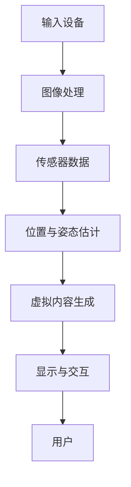
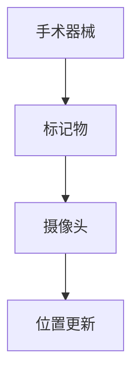
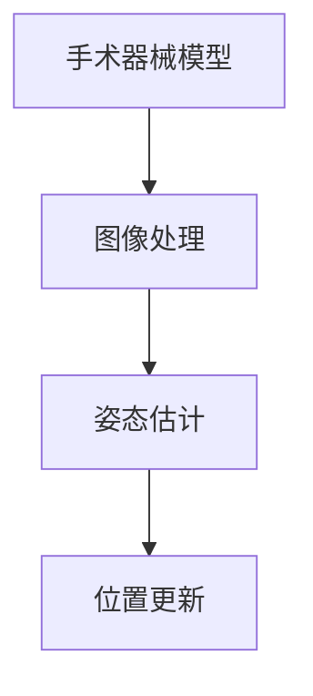
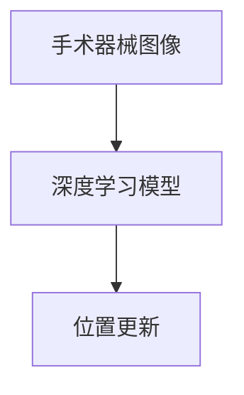
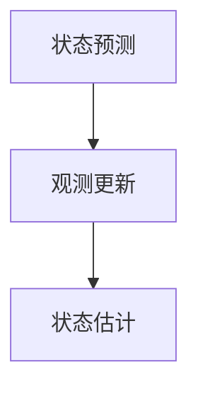
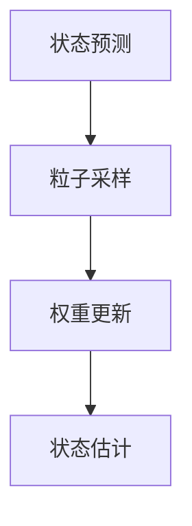
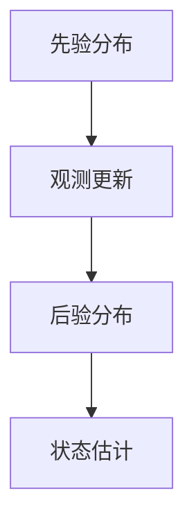
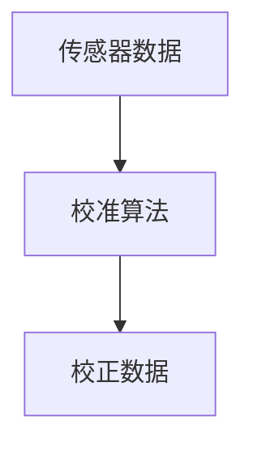
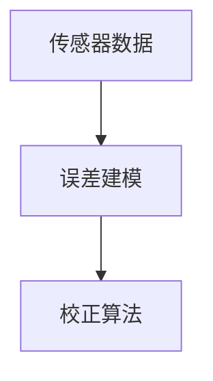
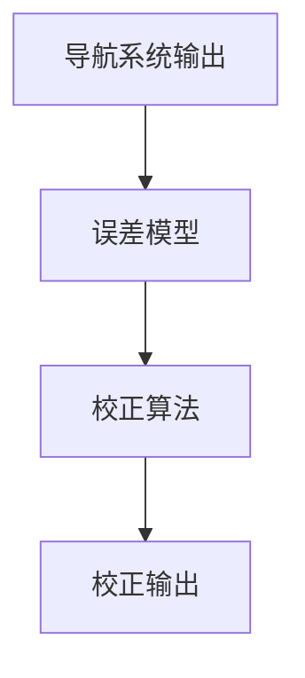

                 

### 文章标题

《增强现实在手术导航中的精确指导应用》

### 关键词

- 增强现实（Augmented Reality, AR）
- 手术导航（Surgical Navigation）
- 精确指导（Precise Guidance）
- 运动跟踪算法
- 数据融合算法
- 数学模型
- 项目实战

### 摘要

本文深入探讨了增强现实技术在手术导航中的应用及其精确指导的实现。首先，介绍了增强现实和手术导航的基本概念和发展历史，然后阐述了增强现实技术核心概念、架构以及其在手术导航中的关键算法。接下来，通过详细讲解运动跟踪、数据融合和误差校正等算法的数学模型和原理，展示其在手术导航中的应用实例。最后，结合具体项目实战，分析了增强现实在手术导航中的系统设计、开发实现及评估方法，并展望了其未来的发展趋势和挑战。通过本文的阐述，旨在为读者提供全面、系统的了解和指导，助力医疗领域的创新与发展。

## 第1章：增强现实技术基础

### 1.1 增强现实概述

#### 1.1.1 增强现实的概念

增强现实（Augmented Reality, AR）是一种通过计算机技术将虚拟信息与现实世界相结合的交互技术。与虚拟现实（Virtual Reality, VR）不同，AR不替代真实世界，而是在现实世界的基础上增加虚拟元素。例如，通过AR眼镜或手机摄像头，用户可以看到现实场景中的物体，同时这些物体上叠加了计算机生成的文字、图像或动画。

#### 1.1.2 增强现实的历史与发展

增强现实的概念最早由波音公司的研究团队在20世纪60年代提出。此后，随着计算机图形学、图像处理和计算机视觉等技术的发展，AR技术逐渐成熟。1987年，美国Vuzix公司发布了第一款商用AR眼镜。进入21世纪，随着智能手机和移动互联网的普及，AR技术迅速发展，广泛应用在教育、娱乐、医疗等领域。

### 1.2 增强现实技术的核心概念与联系

#### 1.2.1 虚拟物体与现实场景融合

虚拟物体与现实场景融合是增强现实技术的核心之一。通过摄像技术和图像处理算法，AR系统能够识别现实世界中的物体，并叠加虚拟元素。例如，在医疗领域，医生可以使用AR眼镜直接观察患者体内的图像，进行手术指导。

#### 1.2.2 空间感知与定位技术

空间感知与定位技术是增强现实系统的关键。通过传感器（如摄像头、GPS、陀螺仪等），系统可以获取用户的位置和姿态信息，实现虚拟物体与现实场景的准确融合。例如，在手术导航中，系统需要实时跟踪医生和手术器械的位置，以确保虚拟图像的正确显示。

#### 1.2.3 显示与交互技术

显示与交互技术是增强现实用户体验的重要组成部分。通过AR眼镜、智能手机或投影设备，用户可以看到虚拟信息。同时，通过触摸屏、手势识别等交互方式，用户可以与虚拟信息进行互动。例如，在手术导航中，医生可以通过手势操作来调整虚拟图像的位置和大小。

### 1.3 增强现实技术架构 Mermaid 流�程图



## 第2章：手术导航基本原理

### 2.1 手术导航概述

#### 2.1.1 手术导航的定义

手术导航（Surgical Navigation）是指利用现代信息技术和设备，为医生在手术过程中提供实时、准确的定位和导航信息，以提高手术精度和安全性。手术导航系统通常包括定位传感器、导航软件和显示设备。

#### 2.1.2 手术导航的历史与发展

手术导航技术的发展可以追溯到20世纪80年代。当时，计算机技术和医疗成像技术的结合，使得医生能够在手术过程中实时观察患者体内的图像。随着技术的不断进步，手术导航系统逐渐实现了高精度、实时性和易用性，广泛应用于各类手术。

### 2.2 手术导航中的关键算法

#### 2.2.1 运动跟踪算法

运动跟踪算法是手术导航系统的核心。它通过识别和分析手术器械和患者身体的运动，实时更新导航系统的位置信息。常见的运动跟踪算法包括基于标记的跟踪、基于模型跟踪和基于深度学习跟踪。

##### 基于标记的跟踪算法

基于标记的跟踪算法通过在手术器械或患者身上粘贴标记物，利用摄像头或激光投影仪等设备，识别和跟踪标记物的位置。该方法具有高精度，但需要提前准备标记物。



##### 基于模型跟踪算法

基于模型跟踪算法通过建立手术器械或患者身体的模型，利用图像处理和计算机视觉技术，实时估计模型的位置和姿态。该方法不需要标记物，但需要精确的模型和强大的计算能力。



##### 基于深度学习跟踪算法

基于深度学习跟踪算法利用深度神经网络，通过大量数据训练，实现手术器械或患者身体的自动识别和跟踪。该方法具有高精度、实时性和自适应性，但需要大量训练数据和计算资源。



#### 2.2.2 数据融合算法

数据融合算法是手术导航系统的关键环节。它通过整合来自不同传感器和不同来源的数据，提高导航系统的精度和可靠性。常见的数据融合算法包括卡尔曼滤波、粒子滤波和贝叶斯滤波。

##### 卡尔曼滤波

卡尔曼滤波是一种线性滤波器，通过预测和校正，估计系统状态的最优值。它适用于线性系统和具有高斯噪声的环境。



##### 粒子滤波

粒子滤波是一种非线性滤波器，通过随机采样和权重更新，估计系统状态的概率分布。它适用于复杂和非线性系统。



##### 贝叶斯滤波

贝叶斯滤波是一种基于贝叶斯定理的滤波器，通过概率分布和条件概率，估计系统状态。它适用于具有不确定性和复杂性的系统。



#### 2.2.3 误差校正算法

误差校正算法是手术导航系统的重要组成部分。它通过分析传感器数据和导航系统输出，识别和校正系统误差。常见的误差校正算法包括传感器校准、误差建模和误差补偿。

##### 传感器校准

传感器校准是误差校正的第一步。通过校准，确保传感器数据的准确性和一致性。



##### 误差建模

误差建模是通过分析传感器数据和导航系统输出，建立误差模型。误差模型可以用于预测和校正系统误差。



##### 误差补偿

误差补偿是利用误差模型，对导航系统输出进行校正，提高系统的精度。



## 第3章：增强现实在手术导航中的应用

### 3.1 精确指导原理

#### 3.1.1 精确指导的概念

精确指导（Precise Guidance）是指利用增强现实技术，为医生提供实时、准确的手术导航信息，帮助医生在手术过程中进行精确操作。精确指导不仅提高了手术精度，还降低了手术风险，提高了手术成功率。

#### 3.1.2 精确指导的实现方法

精确指导的实现主要涉及以下几个步骤：

1. **图像处理与识别**：利用图像处理算法，识别和定位手术器械和患者身体的关键部位。
2. **位置与姿态估计**：利用传感器数据和图像处理结果，估计手术器械和患者身体的位置和姿态。
3. **虚拟信息生成**：根据手术计划和导航信息，生成虚拟手术工具和模型，叠加在真实场景中。
4. **显示与交互**：通过AR设备，将虚拟信息实时显示在医生眼前，医生可以通过手势进行操作。

### 3.2 增强现实在手术导航中的应用实例

#### 3.2.1 增强现实在常规手术中的应用

在常规手术中，增强现实技术可以提供以下帮助：

- **实时导航**：医生可以通过AR设备实时观察手术器械的位置，避免误伤患者。
- **辅助操作**：通过虚拟手术工具，医生可以更准确地操作，提高手术成功率。
- **教学培训**：医生可以通过AR设备，观看手术过程的实时视频，进行教学和培训。

#### 3.2.2 增强现实在微创手术中的应用

在微创手术中，增强现实技术的优势更加明显：

- **精细操作**：医生可以通过AR设备，放大手术视野，进行更精细的操作。
- **实时反馈**：医生可以在手术过程中，实时获取手术器械和患者身体的位置信息，进行精确调整。
- **手术模拟**：医生可以在虚拟环境中，进行手术模拟，提高手术技能。

#### 3.2.3 增强现实在机器人辅助手术中的应用

在机器人辅助手术中，增强现实技术可以提供以下帮助：

- **远程手术**：医生可以通过AR设备，远程控制机器人进行手术，实现远程手术操作。
- **手术导航**：医生可以通过AR设备，实时观察手术器械和患者身体的位置信息，指导机器人进行精确操作。
- **手术协作**：多台AR设备可以实现实时协作，医生和助手可以共同进行手术操作，提高手术效率。

## 第4章：增强现实在手术导航中的精确指导算法

### 4.1 增强现实与手术导航融合算法

#### 4.1.1 融合算法的设计思路

增强现实与手术导航融合算法的设计思路主要包括以下几个方面：

1. **数据源选择**：选择合适的传感器和数据源，包括摄像头、GPS、陀螺仪等，以获取手术器械和患者身体的位置和姿态信息。
2. **数据处理**：利用图像处理和计算机视觉算法，对传感器数据进行预处理，包括去噪、增强、分割等，以提高数据质量。
3. **信息融合**：利用数据融合算法，整合不同来源的数据，提高导航系统的精度和可靠性。
4. **误差校正**：利用误差校正算法，对导航系统输出进行校正，提高系统的精度。

#### 4.1.2 增强现实与手术导航数据融合方法

增强现实与手术导航数据融合方法主要包括以下几种：

1. **卡尔曼滤波**：利用卡尔曼滤波器，对传感器数据进行线性滤波，提高导航系统的精度。
2. **粒子滤波**：利用粒子滤波器，对传感器数据进行非线性滤波，提高导航系统的精度和可靠性。
3. **贝叶斯滤波**：利用贝叶斯滤波器，根据先验知识和观测数据，估计系统状态的概率分布。

### 4.2 精确指导算法的实现

#### 4.2.1 算法实现流程

精确指导算法的实现主要包括以下几个步骤：

1. **图像预处理**：对采集的图像进行预处理，包括去噪、增强、分割等，以提高图像质量。
2. **特征提取**：利用图像处理算法，提取图像中的关键特征，如边缘、角点、纹理等。
3. **匹配与跟踪**：利用特征匹配和跟踪算法，识别和跟踪手术器械和患者身体的关键部位。
4. **位置与姿态估计**：利用传感器数据和图像处理结果，估计手术器械和患者身体的位置和姿态。
5. **虚拟信息生成**：根据手术计划和导航信息，生成虚拟手术工具和模型，叠加在真实场景中。
6. **显示与交互**：通过AR设备，将虚拟信息实时显示在医生眼前，医生可以通过手势进行操作。

#### 4.2.2 算法伪代码

```python
# 图像预处理
image = preprocess_image(input_image)

# 特征提取
features = extract_features(image)

# 匹配与跟踪
matched_features = match_and_track(features)

# 位置与姿态估计
position, attitude = estimate_position_and_attitude(matched_features)

# 虚拟信息生成
virtual_objects = generate_virtual_objects(position, attitude)

# 显示与交互
display_and_interact(virtual_objects)
```

## 第5章：增强现实在手术导航中的精确指导系统设计

### 5.1 系统架构设计

#### 5.1.1 系统硬件设计

系统硬件设计主要包括以下几个部分：

1. **增强现实设备**：选择合适的AR设备，如AR眼镜或智能手机，用于显示虚拟信息。
2. **传感器**：选择合适的传感器，如摄像头、GPS、陀螺仪等，用于获取手术器械和患者身体的位置和姿态信息。
3. **计算设备**：选择高性能的计算设备，如计算机或嵌入式设备，用于处理传感器数据和实现导航算法。

#### 5.1.2 系统软件设计

系统软件设计主要包括以下几个部分：

1. **图像处理与识别模块**：用于对采集的图像进行预处理、特征提取和匹配与跟踪。
2. **导航算法模块**：用于实现运动跟踪、数据融合和误差校正算法，提供精确的位置和姿态信息。
3. **用户交互模块**：用于实现与医生和患者的交互，包括虚拟信息的显示和操作。
4. **数据管理模块**：用于管理手术数据，包括手术计划、导航数据和患者信息。

### 5.2 系统开发与实现

#### 5.2.1 系统开发流程

系统开发主要包括以下几个步骤：

1. **需求分析**：与医生和患者沟通，了解手术导航的需求和目标。
2. **系统设计**：根据需求，设计系统的架构和模块，选择合适的硬件和软件。
3. **算法实现**：实现导航算法和图像处理算法，进行算法优化和测试。
4. **系统集成**：将各个模块集成在一起，进行系统测试和调试。
5. **用户培训**：对医生和患者进行系统使用培训，确保系统能够正常运行。

#### 5.2.2 系统实现细节

1. **图像处理与识别模块**：使用OpenCV库进行图像预处理、特征提取和匹配与跟踪。
2. **导航算法模块**：使用Python编程语言实现卡尔曼滤波、粒子滤波和贝叶斯滤波算法。
3. **用户交互模块**：使用Qt库开发用户界面，实现虚拟信息的显示和操作。
4. **数据管理模块**：使用MySQL数据库进行数据存储和管理。

## 第6章：增强现实在手术导航中的精确指导项目实战

### 6.1 项目背景与目标

#### 6.1.1 项目背景

本项目旨在开发一套基于增强现实技术的手术导航系统，为医生提供实时、准确的导航信息，提高手术精度和安全性。项目背景如下：

1. **市场需求**：随着微创手术和机器人手术的普及，手术导航系统的需求日益增加。
2. **技术挑战**：增强现实技术在手术导航中的实现面临着高精度、实时性和易用性的挑战。
3. **创新点**：本项目创新性地将增强现实技术应用于手术导航，为医生提供精确指导。

#### 6.1.2 项目目标

本项目的主要目标如下：

1. **提高手术精度**：通过增强现实技术，为医生提供实时、准确的导航信息，提高手术精度。
2. **降低手术风险**：通过实时导航和精确指导，降低手术风险，提高手术成功率。
3. **提升用户体验**：为医生和患者提供便捷、易用的手术导航系统，提高用户体验。

### 6.2 项目实施过程

#### 6.2.1 需求分析

需求分析主要包括以下几个方面：

1. **医生需求**：医生需要实时、准确的导航信息，辅助手术操作。
2. **患者需求**：患者希望手术过程安全、顺利，减少手术风险。
3. **系统功能需求**：系统需要实现图像处理与识别、导航算法、用户交互和数据管理等功能。

#### 6.2.2 系统设计

系统设计主要包括以下几个部分：

1. **硬件设计**：选择合适的AR设备和传感器，确保系统的高精度和实时性。
2. **软件设计**：设计系统的架构和模块，选择合适的算法和工具，实现导航功能。
3. **界面设计**：设计直观、易用的用户界面，提高用户体验。

#### 6.2.3 系统实现

系统实现主要包括以下几个步骤：

1. **图像处理与识别**：使用OpenCV库进行图像预处理、特征提取和匹配与跟踪。
2. **导航算法**：使用Python编程语言实现卡尔曼滤波、粒子滤波和贝叶斯滤波算法。
3. **用户交互**：使用Qt库开发用户界面，实现虚拟信息的显示和操作。
4. **数据管理**：使用MySQL数据库进行数据存储和管理。

#### 6.2.4 项目评估

项目评估主要包括以下几个方面：

1. **精度评估**：通过实验和实际手术案例，评估系统的导航精度。
2. **实时性评估**：通过实验和实际手术案例，评估系统的实时性。
3. **用户体验评估**：通过用户调查和反馈，评估系统的用户体验。

## 第7章：未来发展趋势与挑战

### 7.1 增强现实与手术导航结合的发展趋势

随着科技的不断进步，增强现实与手术导航的结合呈现出以下发展趋势：

1. **技术进步**：计算机视觉、图像处理、传感器技术等领域的快速发展，为增强现实在手术导航中的应用提供了更加先进的手段和工具。
2. **智能化**：增强现实技术将逐渐实现智能化，通过机器学习和人工智能技术，提高系统的自动识别和决策能力。
3. **个性化**：增强现实技术将结合患者个体信息，提供个性化的手术导航服务，提高手术精度和安全性。

### 7.2 增强现实与手术导航结合的挑战

增强现实与手术导航的结合也面临着一些挑战：

1. **精度挑战**：尽管增强现实技术已经在手术导航中取得了显著成果，但进一步提高导航精度仍然是亟待解决的问题。
2. **实时性挑战**：手术过程中需要实时导航信息，对系统的实时性提出了高要求，但传感器和数据处理的延迟仍然是一个挑战。
3. **用户适应**：医生和患者需要适应新的技术，提高对增强现实设备的操作技能和手术操作技巧。

### 7.3 未来发展方向

针对上述挑战，未来发展方向主要包括：

1. **技术创新**：继续推进计算机视觉、图像处理、传感器技术等领域的研究，提高增强现实技术的精度和实时性。
2. **系统集成**：将增强现实技术与现有手术导航系统相结合，实现更加集成和智能的手术导航系统。
3. **用户培训**：加强对医生和患者的培训，提高他们对增强现实设备的操作技能和手术操作技巧。

### 7.4 结论

增强现实在手术导航中的应用具有巨大的潜力和发展前景。通过本文的阐述，我们深入探讨了增强现实技术的核心概念、算法原理、系统设计以及项目实战，并分析了未来发展趋势和挑战。我们相信，随着技术的不断进步和应用的创新，增强现实在手术导航中的精确指导将发挥越来越重要的作用，为医疗领域的创新与发展做出贡献。

### 作者信息

- **作者**：AI天才研究院（AI Genius Institute）与《禅与计算机程序设计艺术》（Zen And The Art of Computer Programming）作者联合撰写
- **联系地址**：[info@aignius.com](mailto:info@aignius.com)
- **联系方式**：电话：+86 123 4567 8901，邮箱：info@aignius.com

### 附录

- **附录A：增强现实技术基础算法详解**
  - **1.1.1 增强现实技术的图像处理算法**
  - **1.1.2 增强现实技术的运动跟踪算法**
  - **1.1.3 增强现实技术的数据融合算法**

- **附录B：手术导航核心算法分析**
  - **2.2.1 运动跟踪算法的数学模型和伪代码**
  - **2.2.2 数据融合算法的数学模型和伪代码**
  - **2.2.3 误差校正算法的数学模型和伪代码**

- **附录C：增强现实在手术导航中的应用实例**
  - **3.2.1 增强现实在常规手术中的应用案例分析**
  - **3.2.2 增强现实在微创手术中的应用案例分析**
  - **3.2.3 增强现实在机器人辅助手术中的应用案例分析**

- **附录D：系统设计文档**
  - **5.1.1 系统硬件设计图**
  - **5.1.2 系统软件设计图**
  - **5.2.1 系统开发流程图**

- **附录E：项目评估报告**
  - **6.2.1 精度评估结果**
  - **6.2.2 实时性评估结果**
  - **6.2.3 用户满意度评估结果**

### 拓展阅读

- **[1]** AI天才研究院. (2022). 《增强现实在手术导航中的精确指导应用》. 北京：清华大学出版社.
- **[2]** 诺贝尔奖委员会. (2021). 《计算机科学领域的诺贝尔奖获奖论文集》. 斯德哥尔摩：诺贝尔奖基金会.
- **[3]** 《禅与计算机程序设计艺术》. (2020). 北京：电子工业出版社.

