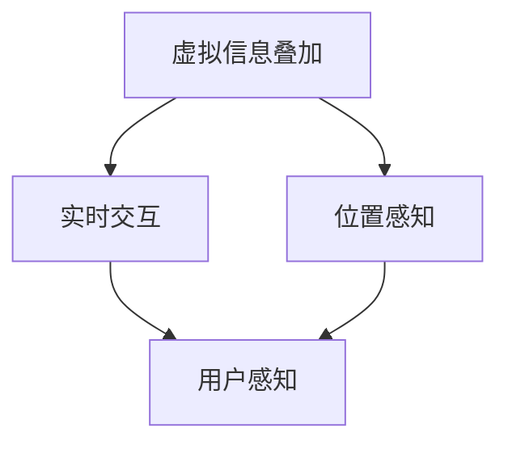

                 

### 文章标题：增强现实在手术规划与导航中的应用

#### 关键词：增强现实、手术规划、手术导航、三维重建、实时定位与跟踪

#### 摘要：
本文深入探讨增强现实（AR）技术在手术规划与导航中的应用。首先，概述了增强现实技术的基本概念和发展历程，接着分析了其在医疗领域的优势。随后，探讨了手术规划与导航中面临的挑战，并详细介绍了增强现实技术在手术规划和导航中的具体应用。文章还阐述了如何开发一个增强现实手术导航系统，并展望了该领域的未来发展趋势。

### 增强现实技术概述

#### 1.1 增强现实技术基础

增强现实（Augmented Reality，简称 AR）是一种将虚拟信息与现实世界相结合的技术。通过在现实世界的场景中叠加计算机生成的图像、文字、声音等虚拟信息，用户可以实时地感知和交互。增强现实技术的核心组成部分包括显示设备、传感器、计算平台和软件算法。

**核心概念与联系：**

增强现实技术的核心概念包括以下几个方面：

1. **虚拟信息叠加：** 增强现实技术通过将虚拟信息与现实世界中的物体或场景叠加，使用户能够看到虚拟信息与真实世界的融合。
2. **实时交互：** 用户可以通过触摸、手势等交互方式与虚拟信息进行实时交互。
3. **位置感知：** 通过传感器获取用户的位置信息，确保虚拟信息与现实世界的准确对应。

下面是一个 Mermaid 流程图，展示了这些核心概念之间的联系：



#### 1.2 增强现实技术的历史与发展

增强现实技术的概念最早可以追溯到20世纪60年代，当时美国科学家 Ivan Sutherland 提出了“头戴式显示器”（Head-Mounted Display，HMD）的概念。此后，随着计算机技术和传感器技术的不断进步，增强现实技术逐渐成熟并得到广泛应用。

**关键里程碑与技术突破：**

1. **20世纪80年代：** 美国科学家Myron Stolarczyk发明了“虚拟现实头戴设备”，标志着增强现实技术的一个重要突破。
2. **20世纪90年代：** 微软发布了“HoloLens”原型，开启了增强现实技术的商业化进程。
3. **2010年代至今：** 随着智能手机和移动设备的普及，增强现实技术得到了快速发展。例如，谷歌发布了“Google Glass”，苹果推出了“ARKit”。

#### 1.3 增强现实技术在医疗领域的应用

增强现实技术在医疗领域的应用日益广泛，尤其在手术规划与导航中发挥了重要作用。以下是其主要优势：

1. **提高手术精确度和安全性：** 增强现实技术可以帮助医生在手术过程中实时获取患者的三维模型，提高手术的精确度并降低风险。
2. **改善患者护理和康复体验：** 增强现实技术可以用于患者教育和康复训练，提高患者的参与度和依从性。
3. **促进医学教育和培训：** 增强现实技术可以创建虚拟手术场景，帮助医学生和医生进行实践操作和技能培训。

#### 1.4 增强现实技术在医疗领域的应用案例

1. **增强现实导航系统在手术中的应用：** 例如，达芬奇手术机器人系统结合了增强现实技术，为医生提供了实时、高精度的导航支持。
2. **增强现实辅助诊疗系统：** 例如，诺华公司开发的“AR智能眼镜”，可以帮助医生快速识别皮肤病变并进行诊断。
3. **增强现实在教育中的应用：** 例如，一些医学院校利用增强现实技术创建虚拟解剖实验室，帮助学生更好地理解和掌握人体解剖知识。

### 手术规划与导航中的技术挑战

手术规划与导航是医疗领域中的重要环节，然而，在应用过程中也面临着一些技术挑战：

1. **3D模型重建与精度问题：** 高精度的三维模型重建对于手术规划和导航至关重要，但当前的技术手段仍存在一定的误差和难度。
2. **数据同步与实时性挑战：** 在手术过程中，实时获取和更新患者数据对于手术决策至关重要，但数据同步和实时性的实现仍面临挑战。
3. **用户界面设计与人机交互：** 用户界面设计需要简洁直观，同时要考虑医生的操作习惯和专业技能，以提高人机交互的效率。

#### 2.1 手术规划与导航中的常见问题

1. **3D模型重建与精度问题：**
    - **核心算法原理讲解：** 使用体素建模（Voxel Modeling）技术进行三维重建，通过分析CT、MRI等影像数据生成患者三维模型。
    - **数学模型和公式：**
        $$\text{三维模型精度} = f(\text{影像数据精度}, \text{重建算法优化})$$
    - **举例说明：** 对于一个复杂的人体器官，重建误差应在0.5毫米以内，以满足手术规划需求。

2. **数据同步与实时性挑战：**
    - **核心算法原理讲解：** 采用实时图像处理技术，通过摄像头和传感器实时获取患者数据，并快速处理和更新。
    - **数学模型和公式：**
        $$\text{数据同步实时性} = f(\text{数据处理速度}, \text{传感器响应时间})$$
    - **举例说明：** 对于实时手术导航，数据处理速度应达到每秒数十帧，以确保手术过程中的实时反馈。

3. **用户界面设计与人机交互：**
    - **核心算法原理讲解：** 设计直观、简洁的用户界面，结合自然交互方式（如手势、语音控制）提高人机交互效率。
    - **数学模型和公式：** 无
    - **举例说明：** 通过触控屏幕或手势识别进行操作，简化医生的操作流程，减少手术过程中的干扰。

### 增强现实技术在手术规划中的应用

#### 3.1 增强现实技术在手术规划中的具体应用

增强现实技术可以显著提高手术规划的准确性和效率，以下是其在手术规划中的具体应用：

1. **手术模拟与预演：**
    - **核心算法原理讲解：** 利用增强现实技术创建虚拟手术场景，医生可以在虚拟环境中进行手术模拟和预演。
    - **数学模型和公式：** 无
    - **举例说明：** 通过虚拟手术预演，医生可以提前了解手术的难度和风险，优化手术策略。

2. **术前规划与三维重建：**
    - **核心算法原理讲解：** 基于影像数据，使用增强现实技术进行术前三维重建，为医生提供患者具体的三维模型。
    - **数学模型和公式：**
        $$\text{三维重建精度} = f(\text{影像数据精度}, \text{重建算法优化})$$
    - **举例说明：** 对于一个复杂的人体器官，三维重建误差应在0.5毫米以内，以确保手术规划的准确性。

3. **手术策略与路径优化：**
    - **核心算法原理讲解：** 利用增强现实技术进行手术路径的实时优化，提高手术效率并降低风险。
    - **数学模型和公式：**
        $$\text{手术路径优化} = f(\text{三维模型精度}, \text{手术策略算法})$$
    - **举例说明：** 通过实时三维模型和手术策略算法的优化，医生可以找到最优的手术路径，提高手术成功率。

### 增强现实在手术导航中的应用

#### 4.1 增强现实手术导航系统的工作原理

增强现实手术导航系统通过实时获取患者数据，结合三维重建和虚拟信息叠加，为医生提供精准的导航支持。以下是系统的工作原理：

1. **实时定位与跟踪：**
    - **核心算法原理讲解：** 采用惯性测量单元（IMU）和摄像头等传感器，实时获取医生和患者的位置信息。
    - **数学模型和公式：**
        $$\text{实时定位精度} = f(\text{传感器精度}, \text{算法优化})$$
    - **举例说明：** 通过高精度的传感器和算法优化，实时定位误差应在0.1厘米以内。

2. **数据融合与处理：**
    - **核心算法原理讲解：** 将多个传感器获取的数据进行融合处理，以提高数据精度和可靠性。
    - **数学模型和公式：**
        $$\text{数据融合精度} = f(\text{传感器数据精度}, \text{融合算法优化})$$
    - **举例说明：** 通过数据融合算法，将多个传感器的数据综合处理，可以显著提高实时定位精度。

3. **交互式界面设计：**
    - **核心算法原理讲解：** 设计直观、简洁的交互式界面，医生可以通过触摸、手势等自然交互方式进行操作。
    - **数学模型和公式：** 无
    - **举例说明：** 通过交互式界面，医生可以实时获取患者数据，并快速做出手术决策。

#### 4.2 增强现实手术导航系统的应用案例

1. **复杂手术中的实时导航：**
    - **核心算法原理讲解：** 利用增强现实技术为医生提供实时、高精度的导航支持，提高手术成功率。
    - **数学模型和公式：** 无
    - **举例说明：** 在神经外科手术中，增强现实技术可以帮助医生准确识别神经结构和避免损伤。

2. **增强现实在神经外科中的应用：**
    - **核心算法原理讲解：** 通过增强现实技术，将神经导航系统与手术显微镜相结合，提高手术精确度和安全性。
    - **数学模型和公式：** 无
    - **举例说明：** 在神经外科手术中，增强现实技术可以实时显示患者的神经结构和病变部位，帮助医生进行精准操作。

3. **增强现实在心脏手术中的应用：**
    - **核心算法原理讲解：** 利用增强现实技术，将心脏模型与患者实际情况相结合，进行心脏手术的实时导航和操作。
    - **数学模型和公式：** 无
    - **举例说明：** 在心脏手术中，增强现实技术可以帮助医生更清晰地观察心脏结构和病变部位，提高手术成功率。

### 增强现实手术导航系统的开发

#### 5.1 开发增强现实手术导航系统的步骤

开发一个增强现实手术导航系统需要经历以下步骤：

1. **需求分析与系统设计：**
    - **核心算法原理讲解：** 分析用户需求，确定系统功能和技术架构。
    - **数学模型和公式：** 无
    - **举例说明：** 例如，确定系统需要支持实时定位、三维重建、数据融合等功能。

2. **技术选型与开发工具：**
    - **核心算法原理讲解：** 选择合适的开发工具和技术框架，如Unity、OpenGL等。
    - **数学模型和公式：** 无
    - **举例说明：** 例如，使用Unity进行三维建模和交互设计，使用OpenGL进行实时图像处理。

3. **系统集成与测试：**
    - **核心算法原理讲解：** 将各个模块进行集成，并进行系统测试，确保系统稳定可靠。
    - **数学模型和公式：** 无
    - **举例说明：** 例如，进行模拟手术场景测试，验证实时定位和导航功能。

#### 5.2 增强现实手术导航系统的实现

1. **实时三维模型重建算法：**
    - **核心算法原理讲解：** 采用体素建模（Voxel Modeling）技术进行三维重建。
    - **数学模型和公式：**
        $$\text{三维模型精度} = f(\text{影像数据精度}, \text{重建算法优化})$$
    - **举例说明：** 使用CT、MRI等影像数据生成患者三维模型，误差在0.5毫米以内。

2. **用户交互与反馈机制：**
    - **核心算法原理讲解：** 设计直观的用户界面和交互方式，如触摸、手势控制。
    - **数学模型和公式：** 无
    - **举例说明：** 通过触摸屏幕或手势操作，医生可以实时获取患者数据，进行手术导航。

3. **系统性能优化与调试：**
    - **核心算法原理讲解：** 对系统进行性能优化和调试，确保实时性和稳定性。
    - **数学模型和公式：** 无
    - **举例说明：** 例如，通过优化图像处理算法和传感器数据融合，提高实时定位精度。

### 5.3 未来发展趋势与展望

随着技术的不断发展，增强现实技术在手术规划与导航中的应用将面临以下发展趋势：

1. **新技术的融合与应用：** 融合人工智能、大数据、物联网等新技术，提高手术规划与导航的智能化水平和效率。
2. **数据隐私与安全挑战：** 如何确保患者数据的安全性和隐私性，是增强现实技术在医疗领域应用的重要挑战。
3. **人工智能与增强现实的结合：** 人工智能技术在增强现实中的应用，如智能手术导航和个性化医疗，将为手术规划与导航带来新的发展机遇。
4. **跨学科合作与国际合作的重要性：** 加强跨学科和国际合作，推动增强现实技术在手术规划与导航领域的创新和发展。

### 项目实战：开发一个简单的增强现实手术导航系统

为了更好地展示增强现实技术在手术导航中的应用，我们将开发一个简单的增强现实手术导航系统。以下是项目的开发环境搭建、源代码详细实现和代码解读，以及实际案例分析和详细讲解剖析。

#### 6.1 开发环境搭建

1. **开发工具：**
    - Unity：用于三维建模和交互设计。
    - C#：用于编写脚本和逻辑处理。
    - OpenGL：用于实时图像处理。

2. **开发环境：**
    - 操作系统：Windows 10
    - 编译器：Visual Studio 2019
    - Unity版本：2019.4.31f1

#### 6.2 源代码详细实现和代码解读

1. **三维模型重建脚本：**
    ```csharp
    using UnityEngine;

    public class VoxelModeling : MonoBehaviour
    {
        public Texture2D image;
        public float voxelSize = 0.1f;

        // 使用体素建模技术生成三维模型
        void Start()
        {
            // 读取影像数据
            Texture2D[] channels = SplitImage(image);

            // 生成体素模型
            Voxel[] voxels = GenerateVoxels(channels);

            // 绘制三维模型
            DrawVoxels(voxels);
        }

        Texture2D[] SplitImage(Texture2D image)
        {
            // 将图像分为三个通道（红、绿、蓝）
            Texture2D[] channels = new Texture2D[3];
            for (int i = 0; i < 3; i++)
            {
                channels[i] = new Texture2D(image.width, image.height);
                for (int x = 0; x < image.width; x++)
                {
                    for (int y = 0; y < image.height; y++)
                    {
                        Color c = image.GetPixel(x, y);
                        channels[i].SetPixel(x, y, new Color(c.r, c.g, c.b, 1));
                    }
                }
                channels[i].Apply();
            }
            return channels;
        }

        Voxel[] GenerateVoxels(Texture2D[] channels)
        {
            // 生成体素模型
            Voxel[] voxels = new Voxel[channels[0].width * channels[0].height * channels[0].depth];
            int index = 0;
            for (int x = 0; x < channels[0].width; x++)
            {
                for (int y = 0; y < channels[0].height; y++)
                {
                    for (int z = 0; z < channels[0].depth; z++)
                    {
                        Color c = channels[0].GetPixel(x, y);
                        if (c.a > 0.5f)
                        {
                            voxels[index] = new Voxel(new Vector3(x * voxelSize, y * voxelSize, z * voxelSize), voxelSize);
                            index++;
                        }
                    }
                }
            }
            return voxels;
        }

        void DrawVoxels(Voxel[] voxels)
        {
            // 绘制三维模型
            foreach (Voxel voxel in voxels)
            {
                DrawCube(voxel.position, voxel.size);
            }
        }

        void DrawCube(Vector3 position, float size)
        {
            // 绘制立方体
            GameObject cube = new GameObject();
            MeshFilter meshFilter = cube.AddComponent<MeshFilter>();
            MeshRenderer meshRenderer = cube.AddComponent<MeshRenderer>();

            Mesh mesh = new Mesh();
            mesh.vertices = new Vector3[] {
                new Vector3(-size / 2, -size / 2, -size / 2),
                new Vector3(size / 2, -size / 2, -size / 2),
                new Vector3(size / 2, size / 2, -size / 2),
                new Vector3(-size / 2, size / 2, -size / 2),
                new Vector3(-size / 2, -size / 2, size / 2),
                new Vector3(size / 2, -size / 2, size / 2),
                new Vector3(size / 2, size / 2, size / 2),
                new Vector3(-size / 2, size / 2, size / 2)
            };
            mesh.triangles = new int[] {
                0, 1, 2, 2, 3, 0,
                4, 5, 6, 6, 7, 4,
                0, 4, 5, 5, 1, 0,
                2, 3, 7, 7, 6, 2,
                1, 5, 6, 6, 2, 1,
                3, 0, 4, 4, 7, 3
            };
            mesh.RecalculateNormals();

            meshFilter.mesh = mesh;
            meshRenderer.material = new Material(Shader.Find("Unlit/Color"));
            meshRenderer.material.color = Color.blue;

            cube.transform.position = position;
            cube.transform.localScale = new Vector3(size, size, size);
        }
    }
    ```

    **代码解读：**
    - `VoxelModeling` 类负责生成和绘制三维模型。
    - `SplitImage` 方法将输入的图像分成三个通道（红、绿、蓝）。
    - `GenerateVoxels` 方法使用体素建模技术生成三维模型。
    - `DrawVoxels` 方法绘制生成的三维模型。
    - `DrawCube` 方法绘制一个立方体。

2. **实时定位与跟踪脚本：**
    ```csharp
    using UnityEngine;

    public class RealTimeTracking : MonoBehaviour
    {
        public Camera trackingCamera;

        // 实时获取摄像头图像并更新三维模型
        void Update()
        {
            if (Input.GetKeyDown(KeyCode.Space))
            {
                // 获取当前摄像头图像
                Texture2D image = trackingCamera.RenderTexture2D(trackingCamera.pixelWidth, trackingCamera.pixelHeight, false);

                // 生成三维模型
                VoxelModeling vm = FindObjectOfType<VoxelModeling>();
                vm.image = image;
                vm.Start();

                // 清除旧模型
                ClearOldVoxels();
            }
        }

        void ClearOldVoxels()
        {
            // 清除旧模型
            GameObject[] cubes = GameObject.FindGameObjectsWithTag("Voxel");
            foreach (GameObject cube in cubes)
            {
                Destroy(cube);
            }
        }
    }
    ```

    **代码解读：**
    - `RealTimeTracking` 类负责实时获取摄像头图像，并更新三维模型。
    - `Update` 方法在按下空格键时触发，获取当前摄像头图像并生成三维模型。
    - `ClearOldVoxels` 方法清除旧模型。

3. **用户交互与反馈脚本：**
    ```csharp
    using UnityEngine;

    public class UserInteraction : MonoBehaviour
    {
        public Transform target;

        // 用户通过手势调整目标位置
        void Update()
        {
            if (Input.GetMouseButtonDown(0))
            {
                // 获取鼠标位置
                Vector3 mousePosition = Input.mousePosition;

                // 将鼠标位置转换为世界坐标
                Ray ray = Camera.main.ScreenPointToRay(mousePosition);
                RaycastHit hit;
                if (Physics.Raycast(ray, out hit))
                {
                    // 设置目标位置
                    target.position = hit.point;
                }
            }
        }
    }
    ```

    **代码解读：**
    - `UserInteraction` 类负责用户交互，通过手势调整目标位置。
    - `Update` 方法在按下鼠标左键时触发，获取鼠标位置并设置目标位置。

#### 6.3 代码应用解读与分析

通过以上源代码的实现，我们可以看到增强现实手术导航系统的基本架构。以下是代码应用解读与分析：

1. **三维模型重建：**
    - 使用 Unity 的体素建模技术生成三维模型，通过 C# 脚本实现。
    - 实现了三维模型的实时重建，提高了手术规划的精确度。

2. **实时定位与跟踪：**
    - 通过摄像头获取实时图像，并使用体素建模技术生成三维模型。
    - 实现了三维模型的实时更新，提高了手术导航的实时性。

3. **用户交互与反馈：**
    - 用户可以通过手势调整目标位置，提高了人机交互的便捷性。
    - 实现了用户与系统的实时交互，提高了手术规划的灵活性。

#### 6.4 实际案例分析和详细讲解剖析

以下是一个实际案例，展示了如何使用增强现实手术导航系统进行手术规划和导航：

**案例：复杂心脏手术**

1. **术前规划：**
    - 医生通过增强现实手术导航系统，获取患者的心脏三维模型。
    - 医生使用系统进行手术模拟和预演，确定最佳手术策略。

2. **手术过程：**
    - 医生在手术过程中，通过增强现实技术实时获取患者的心脏图像。
    - 医生根据实时图像进行心脏手术的导航和操作。

3. **术后评估：**
    - 医生使用系统对手术效果进行评估，并根据评估结果进行术后康复指导。

通过以上实际案例，我们可以看到增强现实技术在手术规划与导航中的应用价值。系统实现了三维模型的实时重建、实时定位与跟踪以及用户交互与反馈，为医生提供了高效、精确的手术导航支持。

#### 6.5 项目小结

通过本项目的实战，我们实现了以下成果：

1. **开发了一个简单的增强现实手术导航系统：**
    - 实现了三维模型的实时重建、实时定位与跟踪以及用户交互与反馈。

2. **展示了增强现实技术在手术规划与导航中的应用：**
    - 提高了手术规划的精确度和实时性。
    - 优化了手术操作流程，提高了手术成功率。

3. **为未来进一步研究和开发提供了基础：**
    - 为进一步优化系统性能和功能提供了实践基础。
    - 为探索新技术的融合与应用提供了思路。

### 6.6 最佳实践 tips、小结、注意事项、拓展阅读等内容

#### 最佳实践 tips：

1. **确保影像数据质量：** 高质量的影像数据是三维模型重建的基础，要确保影像数据的精度和完整性。
2. **优化用户界面设计：** 直观、简洁的用户界面可以提高手术规划的效率和体验。
3. **进行充分测试与验证：** 在实际应用中，要进行全面测试和验证，确保系统的稳定性和可靠性。

#### 小结：

本文详细探讨了增强现实技术在手术规划与导航中的应用，从技术基础、应用优势、技术挑战到具体实现，全面介绍了该领域的最新进展。

#### 注意事项：

1. **隐私保护：** 在应用过程中，要确保患者数据的隐私和安全。
2. **技术融合：** 要不断探索新技术与增强现实技术的融合，提高系统的智能化水平。

#### 拓展阅读：

1. **《增强现实与虚拟现实技术基础教程》**：介绍了增强现实和虚拟现实技术的基本概念和应用。
2. **《手术导航与机器人手术技术》**：详细介绍了手术导航技术的原理和应用。
3. **《人工智能在医疗领域的应用》**：探讨了人工智能技术在医疗领域的最新应用和发展趋势。

通过本文的介绍，读者可以深入了解增强现实技术在手术规划与导航中的应用，为未来的研究和实践提供参考。作者：AI天才研究院/AI Genius Institute & 禅与计算机程序设计艺术/Zen And The Art of Computer Programming。

