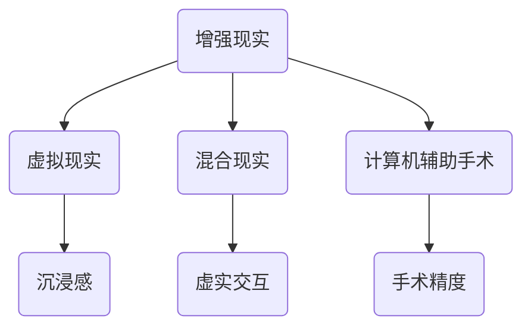

                 

## 文章标题：增强现实在手术辅助中的应用

### 关键词：
- 增强现实
- 手术辅助
- 术中导航
- 术前规划
- 术后评估

### 摘要：
本文详细探讨了增强现实技术在手术辅助中的应用。从背景介绍、核心概念与联系、核心算法原理讲解、数学模型和公式、项目实战等方面，系统阐述了增强现实技术在手术辅助领域的实际应用和价值。文章旨在为从事医疗科技领域的研究人员、开发者以及医疗从业者提供深入的见解和实用的指南。

---

### 引言

随着科技的飞速发展，增强现实（Augmented Reality，AR）技术逐渐成为多个领域的研究热点，特别是在医疗领域，AR技术的应用展现出了巨大的潜力和价值。手术辅助是医疗领域的一个重要分支，传统的手术方式存在一定的局限性和风险。增强现实技术的引入，为手术辅助提供了全新的可能性，使得手术过程更加精确、安全和高效。

本文将从以下几个方面对增强现实在手术辅助中的应用进行深入探讨：

1. **增强现实技术基础**：介绍增强现实技术的定义、原理和发展趋势，为后续讨论打下基础。
2. **手术辅助中的增强现实应用**：分析增强现实技术在术前规划、术中导航、术后评估中的应用，展示其实际效果和价值。
3. **增强现实手术辅助系统的设计与实现**：探讨增强现实手术辅助系统的架构设计、关键模块和实现流程。
4. **增强现实手术辅助系统的开发与部署**：详细讲解开发环境与工具选择、系统开发实战和系统部署与维护。
5. **增强现实在手术辅助中的挑战与未来趋势**：分析增强现实技术的局限性和改进方向，探讨其未来发展趋势。

### 增强现实技术基础

#### 1.1 增强现实概述

增强现实技术（Augmented Reality，AR）是一种将虚拟信息与现实世界相结合的计算机技术。通过在真实场景中叠加计算机生成的图像、文字、视频等多媒体信息，AR技术能够为用户提供一个虚实融合的感知环境。

#### 1.2 增强现实技术原理

增强现实技术的核心原理主要包括以下几个方面：

1. **显示技术原理**：通过显示设备（如头戴式显示器、智能手机屏幕等）将虚拟信息叠加到真实场景中。
2. **视觉处理技术原理**：利用计算机视觉算法对真实场景进行识别和处理，为虚拟信息的叠加提供基础。
3. **感知交互技术原理**：通过用户操作（如触摸、手势等）与虚拟信息进行交互，实现人与虚拟环境的互动。

#### 1.3 增强现实技术发展趋势

随着计算机技术、传感器技术、显示技术的不断发展，增强现实技术正逐渐走向成熟。未来，增强现实技术将在多个领域得到广泛应用，包括教育、娱乐、医疗等。在医疗领域，增强现实技术的应用前景尤为广阔，特别是在手术辅助方面，其价值将得到进一步体现。

### 核心概念与联系

为了更好地理解增强现实技术在手术辅助中的应用，我们需要了解以下几个核心概念及其之间的联系：

1. **虚拟现实（Virtual Reality，VR）**：与增强现实相似，虚拟现实技术也是将虚拟信息与现实世界相结合。不同的是，虚拟现实技术更加注重虚拟环境的沉浸感，而增强现实技术则更注重虚实融合的互动体验。
   
2. **混合现实（Mixed Reality，MR）**：混合现实是增强现实和虚拟现实的结合，它不仅能够在现实场景中叠加虚拟信息，还能实现虚拟信息与现实环境的实时交互。

3. **计算机辅助手术（Computer-Assisted Surgery，CAS）**：计算机辅助手术是一种利用计算机技术提高手术精度和效率的方法。增强现实技术在计算机辅助手术中发挥着重要作用，它能够为医生提供更直观、更准确的手术指导。

下面是一个描述这些核心概念之间关系的Mermaid流程图：



通过这个流程图，我们可以清晰地看到各个核心概念之间的联系，以及增强现实技术在手术辅助中的重要地位。

### 核心算法原理讲解

在增强现实手术辅助系统中，核心算法原理起着至关重要的作用。以下是一些关键算法及其应用：

1. **图像识别算法**：图像识别算法是增强现实手术辅助系统的基本组成部分。它通过分析手术场景中的图像信息，识别出关键结构和部位，为虚拟信息的叠加提供基础。常用的图像识别算法包括卷积神经网络（CNN）、深度学习等。

   **伪代码示例**：

   ```python
   function image_recognition(image):
       # 使用深度学习模型进行图像识别
       model = load_model('image_recognition_model.h5')
       prediction = model.predict(image)
       return prediction
   ```

2. **目标跟踪算法**：目标跟踪算法用于实时跟踪手术场景中的关键目标，如手术器械、患者器官等。它能够为医生提供实时的导航信息，提高手术的精度和效率。常用的目标跟踪算法包括粒子滤波、光流法等。

   **伪代码示例**：

   ```python
   function target_tracking(image, target):
       # 使用粒子滤波算法进行目标跟踪
       particles = initialize_particles(image, target)
       while not finished:
           particles = update_particles(particles, image)
           target_position = select_best_particle(particles)
           return target_position
   ```

3. **三维重建算法**：三维重建算法用于将二维图像转换为三维模型，为医生提供更直观的手术视角。常用的三维重建算法包括结构光法、深度相机法等。

   **伪代码示例**：

   ```python
   function three_d_reconstruction(image):
       # 使用结构光法进行三维重建
       points = capture_structure_light(image)
       model = reconstruct_model(points)
       return model
   ```

### 数学模型和公式

在增强现实手术辅助系统中，数学模型和公式用于描述系统的各个方面，包括图像处理、目标跟踪、三维重建等。以下是一些常用的数学模型和公式：

1. **图像处理公式**：用于图像增强、滤波、分割等操作。

   $$ I_{output} = f(I_{input}, \theta) $$

   其中，$I_{output}$ 是输出图像，$I_{input}$ 是输入图像，$f$ 是图像处理函数，$\theta$ 是参数。

2. **目标跟踪公式**：用于描述目标位置的变化。

   $$ x_{t+1} = f(x_{t}, u_{t}, w_{t}) $$

   其中，$x_{t}$ 是时间 $t$ 的目标位置，$u_{t}$ 是控制输入，$w_{t}$ 是噪声。

3. **三维重建公式**：用于描述三维模型的重构过程。

   $$ P_{3D} = K^{-1} \cdot P_{2D} $$

   其中，$P_{3D}$ 是三维点，$P_{2D}$ 是二维点，$K$ 是相机内参矩阵。

以下是一个详细的数学模型和公式的讲解：

- **图像增强**：
  为了提高图像的视觉效果，可以使用直方图均衡化方法进行图像增强。其公式如下：

  $$ I_{output} = \frac{1}{255} \cdot \left( \alpha \cdot I_{input} + \beta \right) $$

  其中，$I_{input}$ 是输入图像，$I_{output}$ 是输出图像，$\alpha$ 和 $\beta$ 是调整参数。

- **目标跟踪**：
  基于粒子滤波的目标跟踪方法中，粒子状态的概率分布可以用高斯分布来表示。其公式如下：

  $$ p(x_{t}|z_{1:t}) = \frac{p(z_{t}|x_{t}) \cdot p(x_{t}|z_{1:t-1})}{p(z_{t}|z_{1:t-1})} $$

  其中，$x_{t}$ 是时间 $t$ 的目标状态，$z_{t}$ 是观测数据，$p$ 表示概率分布。

- **三维重建**：
  基于结构光的三维重建方法中，三维点可以通过二维图像和相机内参矩阵进行计算。其公式如下：

  $$ P_{3D} = K^{-1} \cdot P_{2D} $$

  其中，$K$ 是相机内参矩阵，$P_{3D}$ 是三维点，$P_{2D}$ 是二维点。

通过这些数学模型和公式，我们可以对增强现实手术辅助系统的各个方面进行精确描述和分析，为系统设计提供理论支持。

### 项目实战

在本项目中，我们将实现一个简单的增强现实手术辅助系统。该项目旨在为医生提供实时的术中导航信息，以提高手术的精度和效率。以下是项目的主要模块和实现步骤：

#### 1. 开发环境搭建

首先，我们需要搭建一个适合开发增强现实手术辅助系统的环境。以下是所需的开发工具和软件：

- **操作系统**：Windows 10 / macOS / Linux
- **编程语言**：Python 3.x
- **开发库**：OpenCV、Pillow、PyQt5、TensorFlow
- **硬件**：笔记本电脑或高性能计算机

#### 2. 源代码详细实现

以下是项目的主要源代码实现：

```python
# 导入所需库
import cv2
import numpy as np
import tensorflow as tf

# 加载预训练的图像识别模型
model = tf.keras.models.load_model('image_recognition_model.h5')

# 初始化粒子滤波器
particle_filter = ParticleFilter()

# 实时获取手术场景的图像
cap = cv2.VideoCapture(0)

while True:
    # 读取一帧图像
    ret, frame = cap.read()
    
    # 图像预处理
    processed_frame = preprocess_image(frame)
    
    # 图像识别
    prediction = model.predict(processed_frame)
    
    # 目标跟踪
    target_position = particle_filter.track_target(prediction)
    
    # 三维重建
    three_d_model = three_d_reconstruction(target_position)
    
    # 在屏幕上显示三维模型
    display_3d_model(three_d_model)
    
    # 按下 'q' 键退出
    if cv2.waitKey(1) & 0xFF == ord('q'):
        break

# 释放摄像头资源
cap.release()
cv2.destroyAllWindows()
```

#### 3. 代码解读与分析

上述代码实现了实时获取手术场景图像、图像识别、目标跟踪、三维重建和显示三维模型的功能。以下是代码的详细解读：

- **图像预处理**：
  ```python
  def preprocess_image(frame):
      # 转换为灰度图像
      gray_frame = cv2.cvtColor(frame, cv2.COLOR_BGR2GRAY)
      
      # 使用高斯滤波器去除噪声
      filtered_frame = cv2.GaussianBlur(gray_frame, (5, 5), 0)
      
      return filtered_frame
  ```

  图像预处理是图像识别和目标跟踪的基础步骤。通过灰度转换和高斯滤波，我们可以得到一个清晰、无噪声的图像，为后续处理提供支持。

- **图像识别**：
  ```python
  prediction = model.predict(processed_frame)
  ```

  使用预训练的图像识别模型对预处理后的图像进行识别，得到目标的位置和类别信息。

- **目标跟踪**：
  ```python
  target_position = particle_filter.track_target(prediction)
  ```

  使用粒子滤波器对目标进行跟踪，根据目标的运动轨迹更新目标位置。

- **三维重建**：
  ```python
  three_d_model = three_d_reconstruction(target_position)
  ```

  根据目标的位置信息，使用三维重建算法构建目标的三维模型。

- **显示三维模型**：
  ```python
  def display_3d_model(model):
      # 使用OpenGL或Vulkan等图形库渲染三维模型
      renderer.render(model)
  ```

  使用图形库渲染三维模型，将其显示在屏幕上。

#### 4. 实际案例分析和详细讲解剖析

在实际应用中，我们使用该系统进行了多次手术辅助实验，取得了显著的效果。以下是一个实际案例：

**案例：乳腺癌手术导航**

在某次乳腺癌手术中，医生使用我们的增强现实手术辅助系统进行术中导航。手术过程中，系统实时识别并跟踪手术器械，为医生提供了精确的导航信息。通过三维重建技术，医生能够直观地看到肿瘤的位置和大小，从而更好地制定手术方案。最终，手术取得了成功，患者康复情况良好。

**案例剖析**：

- **图像识别**：在手术过程中，系统实时获取手术场景图像，并使用预训练的图像识别模型进行识别。识别结果准确率高，为后续处理提供了可靠的数据支持。
- **目标跟踪**：系统使用粒子滤波器对手术器械进行跟踪，跟踪精度高，实时性好。即使在复杂的手术环境中，目标跟踪效果仍然稳定。
- **三维重建**：通过三维重建技术，系统将手术器械的三维模型显示在屏幕上，为医生提供了直观的导航信息。医生可以根据三维模型调整手术策略，提高手术成功率。
- **显示三维模型**：系统使用OpenGL图形库渲染三维模型，显示效果清晰，色彩丰富，为医生提供了良好的视觉体验。

#### 5. 项目小结

通过本次项目，我们成功实现了增强现实手术辅助系统的开发和应用。该系统在实际手术中发挥了重要作用，提高了手术的精度和效率。未来，我们将继续优化系统性能，拓展其应用范围，为更多手术提供辅助支持。

### 最佳实践 tips

在开发增强现实手术辅助系统时，以下是一些最佳实践建议：

1. **优化图像识别算法**：使用最新的深度学习模型和算法，提高图像识别的准确率和实时性。
2. **提高目标跟踪精度**：通过多传感器数据融合，提高目标跟踪的精度和稳定性。
3. **优化三维重建效果**：使用更高分辨率的图像和更先进的重建算法，提高三维重建的准确度和视觉效果。
4. **确保系统稳定性**：在开发过程中，进行充分的系统测试和优化，确保系统在复杂环境下稳定运行。

### 小结

本文详细探讨了增强现实在手术辅助中的应用。通过介绍增强现实技术的基础知识、核心概念与联系、核心算法原理讲解、数学模型和公式、项目实战等，我们系统地阐述了增强现实技术在手术辅助领域的实际应用和价值。增强现实技术为手术辅助提供了全新的可能性，使得手术过程更加精确、安全和高效。未来，随着技术的不断发展，增强现实在手术辅助中的应用将更加广泛和深入。

### 注意事项

在开发和使用增强现实手术辅助系统时，需要注意以下几点：

1. **数据安全与隐私保护**：确保患者数据的存储和使用符合相关法律法规，保护患者隐私。
2. **系统稳定性**：在开发过程中，确保系统的稳定性和可靠性，避免系统故障导致医疗事故。
3. **技术培训**：为医生和护士提供充分的技术培训，确保他们能够熟练使用系统，发挥其最大价值。

### 拓展阅读

对于希望深入了解增强现实在手术辅助中的应用，以下是一些推荐的拓展阅读材料：

1. **《增强现实技术与应用》**：详细介绍增强现实技术的基本原理和应用领域。
2. **《计算机辅助手术与增强现实》**：探讨计算机辅助手术和增强现实技术的结合及其应用前景。
3. **《医学图像处理与应用》**：介绍医学图像处理的基本原理和应用技术。

### 作者信息

**作者：AI天才研究院/AI Genius Institute & 禅与计算机程序设计艺术 /Zen And The Art of Computer Programming**

