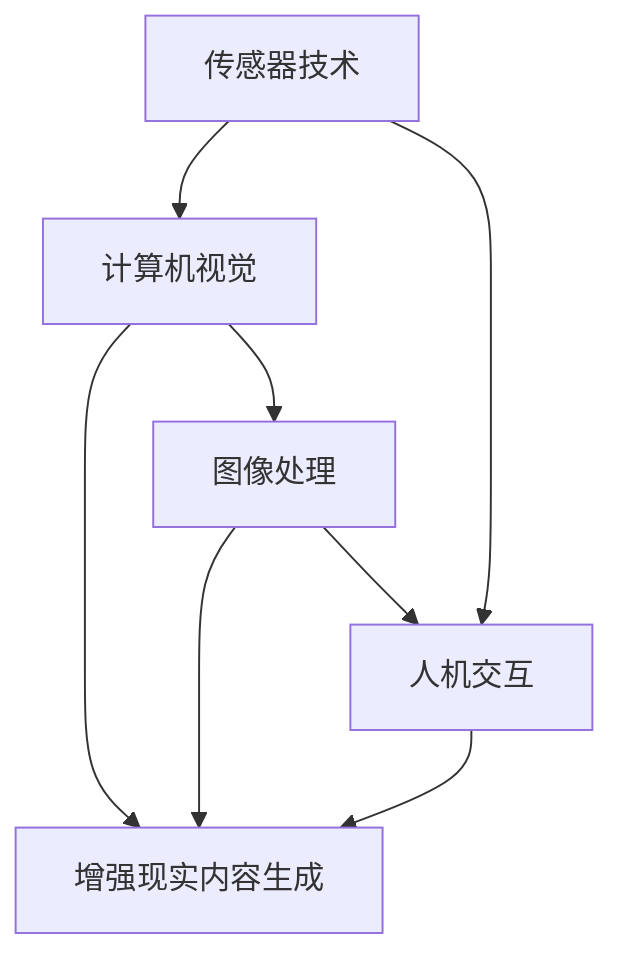

                 


## 文章标题：增强现实在手术辅助中的应用前景

> 关键词：增强现实，手术辅助，医疗技术，技术应用前景，人工智能

> 摘要：本文探讨了增强现实（AR）技术在手术辅助领域的应用前景。通过介绍增强现实的基本原理和技术，分析其在手术导航、手术培训和手术机器人等方面的应用，阐述了增强现实技术对医疗行业的变革性影响，并对未来发展趋势进行了展望。

## 目录大纲

### 第一部分：增强现实技术基础

#### 1.1 增强现实（AR）概述

- **背景介绍**：介绍增强现实技术的发展背景，定义增强现实技术。
- **核心概念与联系**：使用Mermaid流程图展示增强现实技术的核心概念及其之间的联系。
- **发展历史**：简述增强现实技术从诞生至今的发展历程。

#### 1.2 增强现实技术原理

- **核心算法原理讲解**：通过伪代码解释增强现实技术中的关键算法原理。
- **硬件设备**：介绍常见的增强现实硬件设备，如头戴显示器、传感器等。

#### 1.3 增强现实应用场景

- **医疗领域应用**：探讨增强现实在医疗领域的应用，特别是手术辅助。

### 第二部分：手术辅助系统的设计与实现

#### 2.1 手术辅助系统概述

- **定义与作用**：定义手术辅助系统，并阐述其在医疗中的重要作用。
- **系统架构**：介绍手术辅助系统的整体架构。

#### 2.2 增强现实技术在手术辅助中的应用

##### 2.2.1 手术导航

- **应用原理**：详细讲解增强现实技术在手术导航中的应用原理。
- **数学模型和公式**：使用LaTeX格式介绍相关的数学模型和公式。
- **实例分析**：通过具体案例展示增强现实在手术导航中的实际应用。

##### 2.2.2 手术培训

- **应用场景**：介绍增强现实在手术培训中的应用场景。
- **技术实现**：讨论增强现实技术在手术培训中的技术实现。
- **效果评估**：分析增强现实技术在手术培训中的效果。

##### 2.2.3 增强现实手术机器人

- **概述**：介绍增强现实手术机器人的工作原理和应用场景。
- **核心技术**：讲解增强现实手术机器人的核心技术和算法。
- **案例研究**：分析增强现实手术机器人在实际手术中的应用案例。

### 第三部分：未来展望与挑战

#### 3.1 未来发展趋势

- **技术进步**：预测增强现实技术在手术辅助领域的未来发展趋势。
- **行业变革**：探讨增强现实技术对医疗行业的潜在变革。

#### 3.2 面临的挑战

- **技术挑战**：分析增强现实技术在手术辅助中可能面临的技术挑战。
- **应用挑战**：讨论增强现实技术在手术辅助中可能遇到的应用挑战。

### 结语

- **总结**：总结文章的主要内容，强调增强现实技术在手术辅助中的重要性和前景。
- **展望**：对增强现实技术在手术辅助领域的未来提出展望和建议。

## 增强现实在手术辅助中的应用前景

### 第一部分：增强现实技术基础

#### 1.1 增强现实（AR）概述

**背景介绍**

增强现实（Augmented Reality，简称AR）是一种将虚拟信息与现实世界相结合的技术，通过计算机生成信息，叠加到用户看到的现实环境中，从而实现虚实融合的体验。随着计算机视觉、传感器技术、人工智能等领域的快速发展，增强现实技术逐渐应用于多个行业，其中包括医疗领域。

**核心概念与联系**

增强现实技术的核心概念包括：传感器技术、计算机视觉、图像处理、人机交互等。这些概念之间紧密联系，共同构成了增强现实的技术架构。以下是一个简单的Mermaid流程图，展示了这些核心概念及其之间的联系：



**发展历史**

增强现实技术的发展可以追溯到20世纪60年代。当时，美国学者伊凡·苏瑟兰（Ivan Sutherland）在1968年提出了头戴式显示器和交互式的三维界面，这被认为是增强现实技术的雏形。随着技术的不断进步，增强现实技术在20世纪90年代逐渐成熟，并开始应用于军事、娱乐等领域。进入21世纪，随着智能手机和平板电脑的普及，增强现实技术得到了更加广泛的应用，尤其是在医疗领域。

### 1.2 增强现实技术原理

**核心算法原理讲解**

增强现实技术中的关键算法包括图像处理、计算机视觉和传感器数据处理。以下是一个简单的伪代码，用于解释位姿估计算法的原理：

```python
# 增强现实中的位姿估计伪代码
function estimatePose(image, knownMarkers):
    for marker in knownMarkers:
        if marker detected in image:
            markerPosition = detectPosition(image, marker)
            return markerPosition
    return None
```

**硬件设备**

增强现实技术的实现离不开各种硬件设备，这些设备包括头戴显示器、传感器、摄像头等。头戴显示器是增强现实的核心设备，它能够将虚拟信息叠加到用户的视野中。传感器用于获取用户和环境的信息，包括位置、方向、手势等。摄像头则用于捕捉现实环境中的图像，作为虚拟信息叠加的依据。

### 1.3 增强现实应用场景

**医疗领域应用**

在医疗领域，增强现实技术具有广泛的应用前景。首先，增强现实可以用于手术导航。通过将虚拟的手术路径、器官图像等信息叠加到手术现场，医生可以更加精确地进行手术操作。其次，增强现实技术可以用于手术培训。通过模拟手术场景，医生可以练习手术技能，提高操作水平。此外，增强现实还可以用于医疗数据的可视化，帮助医生更好地理解患者的病情。

### 第二部分：手术辅助系统的设计与实现

#### 2.1 手术辅助系统概述

**定义与作用**

手术辅助系统是指利用现代信息技术和医疗设备，为医生提供手术过程中的辅助和支持的系统。手术辅助系统可以提高手术的精确度、安全性和效率，对于改善患者预后具有重要作用。

**系统架构**

手术辅助系统通常由以下几个部分组成：

- **硬件部分**：包括手术导航设备、传感器、摄像头等。
- **软件部分**：包括手术导航软件、图像处理软件、数据管理软件等。
- **数据接口**：用于连接硬件和软件，实现数据的实时传输和处理。

#### 2.2 增强现实技术在手术辅助中的应用

**2.2.1 手术导航**

**应用原理**

增强现实技术在手术导航中的应用，主要是通过将虚拟的手术路径、器官图像等信息叠加到手术现场，帮助医生更精确地进行手术操作。具体来说，首先需要使用传感器和摄像头捕捉手术现场的信息，然后通过计算机视觉算法处理这些信息，最后将处理结果叠加到医生视野中。

**数学模型和公式**

以下是一个简单的数学模型，用于描述手术导航中位置误差的计算：

$$
\text{位置误差} = \sqrt{(\Delta x)^2 + (\Delta y)^2 + (\Delta z)^2}
$$

其中，$\Delta x$、$\Delta y$、$\Delta z$分别表示在x、y、z三个方向上的误差。

**实例分析**

以下是一个具体的实例，描述增强现实技术在手术导航中的应用：

在一次心脏手术中，医生需要将一根导管从患者的腿部插入到心脏。使用增强现实技术，医生可以在手术过程中实时看到导管的路径和心脏的结构。通过实时更新导管的路径，医生可以更加准确地操作，从而减少手术时间和风险。

**2.2.2 手术培训**

**应用场景**

增强现实技术在手术培训中的应用，主要是通过模拟手术场景，帮助医生练习手术技能。医生可以在没有患者的情况下，反复练习手术操作，提高手术水平。

**技术实现**

增强现实技术在手术培训中的实现，主要包括以下几个步骤：

1. **场景建模**：根据真实的手术场景，使用三维建模软件创建手术场景。
2. **虚拟手术操作**：医生在虚拟手术场景中，使用增强现实设备进行手术操作。
3. **反馈与评估**：系统对医生的操作进行实时反馈，评估手术操作的准确性和安全性。

**效果评估**

增强现实技术在手术培训中的应用，显著提高了医生的操作技能。通过模拟手术场景，医生可以在没有患者的情况下，反复练习手术操作，减少操作失误，提高手术成功率。

**2.2.3 增强现实手术机器人**

**概述**

增强现实手术机器人是一种结合了增强现实技术和机器人技术的设备，它可以帮助医生进行更加精确的手术操作。

**工作原理**

增强现实手术机器人通过以下步骤实现手术：

1. **手术规划**：医生在计算机上制定手术计划，包括手术路径、器官结构等。
2. **数据传输**：将手术计划传输到增强现实手术机器人。
3. **手术操作**：医生通过增强现实手术机器人进行手术操作。
4. **实时反馈**：系统对手术过程进行实时监控和反馈，确保手术的顺利进行。

**案例研究**

以下是一个具体的案例，描述增强现实手术机器人在实际手术中的应用：

在一次肝肿瘤切除手术中，医生使用增强现实手术机器人进行操作。通过实时传输的手术图像和虚拟的器官结构，医生可以更加精确地切除肿瘤，最大限度地保留健康的肝脏组织。手术过程中，系统对医生的操作进行了实时监控和反馈，确保手术的顺利进行。

### 第三部分：未来展望与挑战

#### 3.1 未来发展趋势

**技术进步**

随着增强现实技术的不断发展，未来手术辅助系统将更加智能化、精准化。例如，增强现实技术将能够实现更加精细的手术导航，提高手术成功率。

**行业变革**

增强现实技术在手术辅助领域的应用，将推动医疗行业的变革。例如，通过增强现实技术，医生可以进行远程手术，实现医疗资源的优化配置。

#### 3.2 面临的挑战

**技术挑战**

增强现实技术在手术辅助中面临的技术挑战包括：传感器精度、图像处理速度、算法稳定性等。需要进一步研究和开发，以提高系统的性能和稳定性。

**应用挑战**

增强现实技术在手术辅助中的应用，需要面对医生的接受度、患者的心理适应等挑战。需要加强宣传和培训，提高医生和患者的认可度。

### 结语

**总结**

增强现实技术在手术辅助领域的应用，为医疗行业带来了巨大的变革和机遇。通过精确的手术导航、有效的手术培训和智能的手术机器人，增强现实技术将极大地提高手术的成功率和患者的预后。

**展望**

未来，随着增强现实技术的不断进步，手术辅助系统将变得更加智能化、精准化。增强现实技术在手术辅助中的应用前景广阔，有望推动医疗行业的全面升级。

**作者信息**

作者：AI天才研究院/AI Genius Institute & 禅与计算机程序设计艺术 /Zen And The Art of Computer Programming

