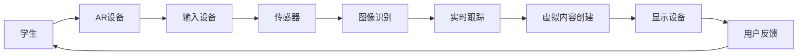

                 


### 第1章: 增强现实（AR）概述与教育应用

#### 1.1 增强现实（AR）基础

增强现实（Augmented Reality，简称AR）是一种将虚拟信息与现实世界融合的技术。通过AR，用户可以看到现实世界中的物体，并且这些物体上叠加了计算机生成的图像或视频。AR技术利用传感器、摄像头、显示设备和计算机算法实现。它的发展经历了多个阶段，从早期的简单图像叠加到如今的高级实时跟踪和虚拟物体交互。

##### 1.1.1 AR的定义与历史发展

增强现实技术起源于20世纪50年代，最早的概念由科学幻想作家Jules Verne提出。然而，直到21世纪初，随着计算机技术和移动设备的普及，AR才真正成为现实。早期的AR技术主要用于军事和工业领域，如夜视设备和导航设备。随着智能手机和平板电脑的普及，AR技术开始进入消费领域，并在教育、娱乐和医疗等领域得到广泛应用。

##### 1.1.2 AR的关键技术

AR技术涉及多个关键技术，包括图像识别、传感器融合、实时跟踪和图像渲染。图像识别用于识别现实世界中的物体，传感器融合结合多种传感器数据提供精确的位置和方向信息，实时跟踪确保虚拟物体与现实世界的同步，图像渲染则生成高质量的视觉效果。

##### 1.1.3 AR与虚拟现实（VR）的区别

虚拟现实（Virtual Reality，简称VR）与增强现实（AR）相似，但存在本质区别。VR技术将用户完全沉浸在虚拟环境中，而AR则将虚拟信息叠加到现实世界中。VR通常使用头戴显示器（HMD）和手柄设备，而AR则依赖于摄像头和显示屏。

#### 1.2 教育中AR的应用

##### 1.2.1 AR在教育中的优势

AR技术在教育中的应用具有显著的潜力。它能够提供丰富的互动体验，增强学生的参与度和学习兴趣。AR可以模拟复杂的概念，如化学反应、人体结构等，帮助学生更直观地理解抽象知识。此外，AR技术还能够提供个性化的学习体验，根据学生的学习进度和需求进行自适应调整。

##### 1.2.2 AR的教学方法

AR技术可以应用于多种教学方法，如翻转课堂、混合式学习和项目式学习。通过AR应用程序，学生可以在课堂上实时查看和学习与课程相关的虚拟内容。教师可以利用AR技术创建互动的教学活动，提高学生的参与度和学习效果。

##### 1.2.3 AR课程设计与实例

在课程设计中，AR技术可以用于创建互动的学习材料。例如，在生物学课程中，学生可以使用AR应用程序观察虚拟的细胞结构，或是在历史课程中参观虚拟的历史遗迹。这些互动体验有助于加深学生的理解和记忆。

#### 1.3 AR在教育互动体验中的核心概念

##### 1.3.1 互动体验与学习效果的关联

互动体验对于学习效果至关重要。AR技术提供了丰富的互动机会，使学生能够通过触摸、移动和交互来探索和学习。这种互动体验能够提高学生的参与度，促进知识的深入理解和记忆。

##### 1.3.2 AR在教育互动中的核心要素

AR在教育互动中的核心要素包括实时跟踪、图像识别和虚拟内容创建。实时跟踪确保虚拟物体与现实世界的同步，图像识别用于识别现实世界中的物体，虚拟内容创建则生成与学习内容相关的增强信息。

##### 1.3.3 AR互动体验设计原则

设计AR互动体验时，需要遵循以下原则：
- 简化用户界面，确保用户易于操作。
- 提供直观的交互方式，如手势控制和语音命令。
- 确保虚拟内容与现实世界的紧密结合，避免视觉冲突。
- 设计具有挑战性和趣味性的互动体验，以提高学生的参与度。

Mermaid流程图：



#### 1.4 结论

本章概述了增强现实（AR）的定义、关键技术及其在教育中的应用。通过AR技术，教育互动体验变得更加丰富和互动，有助于提高学生的学习效果和兴趣。下一章将深入探讨AR中的核心算法原理，为进一步理解AR技术在教育中的应用奠定基础。

### 第2章: 增强现实中的核心算法原理

#### 2.1 图像识别

图像识别是增强现实（AR）技术中的关键组件，用于识别和分类现实世界中的图像。图像识别过程通常包括以下步骤：特征提取、分类和识别精度优化。

##### 2.1.1 特征提取

特征提取是图像识别的第一步，旨在从图像中提取具有鉴别力的特征。常见的特征提取方法包括：
- **灰度化**：将彩色图像转换为灰度图像，简化图像处理。
- **边缘检测**：使用算法检测图像中的边缘，以识别物体轮廓。
- **直方图均衡化**：调整图像的灰度分布，增强图像对比度，提高识别效果。

##### 2.1.2 分类算法

分类算法用于将提取的特征与预定义的类别进行匹配，常见的分类算法包括：
- **K近邻算法（K-Nearest Neighbors, KNN）**：根据新样本的K个最近邻样本的类别进行分类。
- **支持向量机（Support Vector Machine, SVM）**：通过最大间隔分类器进行图像分类。
- **卷积神经网络（Convolutional Neural Networks, CNN）**：利用深度学习技术进行图像分类，具有强大的特征学习能力。

##### 2.1.3 识别精度优化

为了提高图像识别的精度，可以采用以下方法：
- **数据增强**：通过旋转、缩放、裁剪等操作增加训练样本的多样性。
- **模型融合**：结合多个模型的预测结果，提高识别精度。
- **在线学习**：动态更新模型，适应新出现的图像特征。

伪代码示例：

```python
# 特征提取
def extract_features(image):
    gray_image = grayscale(image)
    edges = edge_detection(gray_image)
    histogram均衡化 = equalize_hist(edges)
    return histogram均衡化

# 分类算法
def classify(image_features):
    neighbors = find_k_neighbors(image_features, k=3)
    majority_class = mode(neighbors)
    return majority_class

# 识别精度优化
def optimize_recognition(model, new_data):
    model.train(new_data)
    return model
```

#### 2.2 跟踪与定位

跟踪与定位是AR系统的核心功能之一，确保虚拟物体与现实世界的准确同步。常见的跟踪与定位方法包括视觉SLAM和视觉跟踪算法。

##### 2.2.1 视觉SLAM

视觉SLAM（Simultaneous Localization and Mapping）是一种在未知环境中同时进行定位和建图的算法。视觉SLAM的流程通常包括以下步骤：

1. **特征检测**：检测图像中的关键特征，如角点、边缘等。
2. **特征匹配**：匹配连续帧中的特征点，建立特征点轨迹。
3. **地图构建**：利用特征点轨迹构建环境地图。
4. **位姿估计**：根据特征点轨迹和环境地图估计自身位置。

##### 2.2.2 视觉跟踪算法

视觉跟踪算法用于实时跟踪特定目标或特征点。常见的视觉跟踪算法包括：
- **光流法**：利用像素在不同帧之间的运动轨迹进行跟踪。
- **基于模板的跟踪**：使用模板匹配算法跟踪特定目标。
- **深度学习跟踪**：利用深度学习模型进行目标跟踪，具有较好的实时性和准确性。

##### 2.2.3 定位精度与实时性

定位精度和实时性是视觉跟踪的关键指标。为了提高定位精度，可以采用以下方法：
- **多传感器融合**：结合GPS、惯性测量单元（IMU）和摄像头数据，提高定位精度。
- **实时性优化**：采用高效的算法和硬件加速技术，提高跟踪的实时性。

伪代码示例：

```python
# 视觉SLAM
def visual_SLAM(keypoints, map):
    matched_keypoints = match_keypoints(keypoints)
    updated_map = update_map(matched_keypoints, map)
    position = estimate_position(matched_keypoints, updated_map)
    return position, updated_map

# 视觉跟踪
def visual_tracking(target_template, image):
    match_score = template_matching(target_template, image)
    position = find_position(match_score)
    return position
```

#### 2.3 增强信息叠加

增强信息叠加是AR技术中的核心环节，将虚拟信息与现实世界融合。增强信息叠加涉及图像合成算法、质量评估和实时更新。

##### 2.3.1 图像合成算法

图像合成算法用于将虚拟信息叠加到现实世界中。常见的图像合成算法包括：
- **基于深度信息的合成**：根据深度信息将虚拟物体与背景融合。
- **基于模板的合成**：使用模板匹配将虚拟物体粘贴到背景中。
- **基于渲染的合成**：使用3D渲染技术生成高质量的虚拟信息。

##### 2.3.2 质量评估

质量评估用于评估增强信息的质量，包括清晰度、色彩和动画效果。常见的质量评估方法包括：
- **客观评估**：使用指标如PSNR（峰值信噪比）和SSIM（结构相似性指数）进行评估。
- **主观评估**：通过用户满意度调查进行评估。

##### 2.3.3 增强信息实时更新

实时更新是增强信息叠加的关键，确保虚拟信息与现实的同步。实时更新可以通过以下方法实现：
- **异步更新**：在后台处理图像合成和传输，确保实时性。
- **同步更新**：实时处理图像合成和传输，提高实时性。

伪代码示例：

```python
# 增强信息叠加
def render_augmented_image(virtual_object, background_image):
    depth_info = get_depth_info(virtual_object)
    augmented_image = blend_images(background_image, virtual_object, depth_info)
    return augmented_image

# 质量评估
def assess_quality(augmented_image):
    psnr = calculate_psnr(augmented_image)
    ssim = calculate_ssim(augmented_image)
    return psnr, ssim

# 增强信息实时更新
def update_augmented_image(virtual_object, background_image):
    augmented_image = render_augmented_image(virtual_object, background_image)
    quality = assess_quality(augmented_image)
    if quality['psnr'] < threshold or quality['ssim'] < threshold:
        update_required = True
    return update_required
```

#### 2.4 结论

本章详细介绍了增强现实中的核心算法原理，包括图像识别、跟踪与定位和增强信息叠加。这些算法共同构成了AR技术的核心技术，确保了虚拟信息与现实世界的准确融合。下一章将探讨增强现实在教育中的实际应用实例，展示如何利用AR技术提高教育互动体验。

### 第3章: 增强现实中的数学模型与公式

#### 3.1 图像滤波

图像滤波是图像处理中的一种基本技术，用于去除图像中的噪声和增强图像的某些特征。图像滤波可以通过不同的数学模型和算法实现，以下是几种常用的滤波器和相关公式：

##### 3.1.1 低通滤波

低通滤波器用于去除图像中的高频噪声，同时保留低频特征。常见的低通滤波器包括理想低通滤波器和高斯低通滤波器。

- **理想低通滤波器**：
  $$ H(f,x) = \begin{cases} 
  1 & |f| \leq f_c \\
  0 & |f| > f_c 
  \end{cases} $$
  其中，$f_c$ 是截止频率。

- **高斯低通滤波器**：
  $$ H(f,x) = \frac{1}{\sqrt{2\pi\sigma^2}} e^{-\frac{f^2}{2\sigma^2}} $$
  其中，$\sigma$ 是高斯滤波器的标准差。

##### 3.1.2 高通滤波

高通滤波器用于增强图像中的高频特征，去除低频噪声。常见的高通滤波器包括理想高通滤波器和拉普拉斯高通滤波器。

- **理想高通滤波器**：
  $$ H(f,x) = \begin{cases} 
  1 & |f| \geq f_c \\
  0 & |f| < f_c 
  \end{cases} $$
  其中，$f_c$ 是截止频率。

- **拉普拉斯高通滤波器**：
  $$ H(f,x) = \frac{1}{2\pi} \frac{\sin(\pi f)}{f} $$

##### 3.1.3 均值滤波

均值滤波是一种简单的图像滤波方法，通过计算像素周围的平均值来去除噪声。其公式为：
$$ p(x,y) = \frac{1}{n} \sum_{i=-1}^{1} \sum_{j=-1}^{1} p(i,j) $$
其中，$p(i,j)$ 是像素点$(i,j)$的值，$n$ 是周围像素的数量。

#### 3.2 特征匹配

特征匹配是图像识别和跟踪中的关键步骤，用于将不同图像中的特征点对应起来。特征匹配可以通过特征点的描述子和匹配算法实现。

##### 3.2.1 特征提取

特征提取是特征匹配的第一步，用于从图像中提取具有鉴别力的特征点。常用的特征提取算法包括SIFT（尺度不变特征变换）和SURF（加速稳健特征）。

- **SIFT特征提取**：
  $$ \phi_i = \frac{1}{L} \sum_{x,y} \exp\left(-\frac{(x-x_i)^2 + (y-y_i)^2}{2\sigma^2}\right) \cdot \sigma \odot I(x,y) $$
  其中，$\phi_i$ 是特征点$i$的特征描述子，$L$ 是高斯滤波器的尺度，$\sigma$ 是高斯滤波器的标准差，$I(x,y)$ 是图像值。

- **SURF特征提取**：
  $$ \phi_i = \sum_{x,y} A(x,y) \cdot \sigma \odot I(x,y) $$
  其中，$A(x,y)$ 是利用盒子滤波器计算的幅值加权和，$\sigma$ 是盒子滤波器的标准差。

##### 3.2.2 特征匹配算法

特征匹配算法用于将不同图像中的特征点对应起来。常见的特征匹配算法包括最近邻匹配和比率测试。

- **最近邻匹配**：
  $$ match(i,j) = \begin{cases} 
  1 & \text{if } d(i,j) \leq t \\
  0 & \text{otherwise} 
  \end{cases} $$
  其中，$d(i,j)$ 是特征点$i$和$j$之间的距离，$t$ 是匹配阈值。

- **比率测试**：
  $$ match(i,j) = \begin{cases} 
  1 & \text{if } \frac{d(i,k)}{d(j,k)} \leq r \\
  0 & \text{otherwise} 
  \end{cases} $$
  其中，$d(i,k)$ 和 $d(j,k)$ 是特征点$i$和$k$之间的距离，$r$ 是比率测试阈值。

##### 3.2.3 匹配质量评估

匹配质量评估用于评估特征匹配的效果。常见的评估方法包括匹配准确率和匹配精度。

- **匹配准确率**：
  $$ accuracy = \frac{\text{正确匹配的数量}}{\text{总匹配的数量}} $$

- **匹配精度**：
  $$ precision = \frac{\text{正确匹配的数量}}{\text{实际匹配的数量}} $$

#### 3.3 结论

本章介绍了增强现实中的数学模型和公式，包括图像滤波和特征匹配的相关算法。这些数学模型和公式在AR技术中扮演着重要的角色，确保了图像处理和特征匹配的准确性和效率。下一章将探讨增强现实在教育中的应用实例，展示如何利用AR技术提高教育互动体验。

### 第4章: 增强现实在教育中的应用实例

#### 4.1 应用实例1: 生物标本的AR增强展示

##### 4.1.1 需求分析

生物标本的AR增强展示旨在为学生提供直观的学习体验。学生可以通过AR应用程序观察虚拟的细胞结构、组织切片和微生物，增强对生物学的理解和记忆。该应用需满足以下需求：
- **实时跟踪**：确保虚拟标本与现实世界中的物体同步。
- **高精度图像识别**：准确识别生物标本，实现虚拟标本的叠加。
- **互动操作**：允许学生放大、缩小和旋转虚拟标本。

##### 4.1.2 开发环境搭建

开发环境搭建包括以下步骤：
- **硬件环境**：选择具备AR功能的移动设备，如智能手机或平板电脑。
- **软件环境**：安装AR开发框架，如ARCore（适用于Android）或ARKit（适用于iOS）。
- **开发工具**：选择合适的开发工具，如Unity或ARKit SDK。

##### 4.1.3 源代码实现

源代码实现涉及以下关键步骤：
- **图像识别**：使用机器学习模型（如YOLO或SSD）进行生物标本的识别。
- **实时跟踪**：利用SLAM算法实现实时跟踪和定位。
- **虚拟标本创建**：创建3D模型，根据实际标本尺寸生成虚拟标本。
- **用户交互**：实现用户与虚拟标本的交互，如放大、缩小和旋转。

```csharp
// 图像识别
public void IdentifySpecimen(Bitmap image)
{
    Bitmap grayImage = ConvertToGrayScale(image);
    List<string> labels = MachineLearningModel.DetectLabels(grayImage);
    if (labels.Contains("biological_specimen"))
    {
        AddVirtualSpecimenToScene();
    }
}

// 实时跟踪
public void TrackSpecimen(Bitmap image)
{
    Vector3 position = SLAMAlgorithm.EstimatePosition(image);
    UpdateVirtualSpecimenPosition(position);
}

// 虚拟标本创建
public void AddVirtualSpecimenToScene()
{
    // Load 3D model and add it to the scene
    GameObject specimen = Resources.Load("3DModel/BiologicalSpecimen") as GameObject;
    specimen.transform.position = Camera.main.transform.position;
    specimen.transform.rotation = Camera.main.transform.rotation;
    SceneManager.AddGameObjectToScene(specimen);
}

// 用户交互
public void HandleUserInput()
{
    if (Input.touchPressed)
    {
        Touch touch = Input.GetTouch(0);
        Ray ray = Camera.main.ScreenPointToRay(touch.position);
        RaycastHit hit;
        if (Physics.Raycast(ray, out hit))
        {
            GameObject specimen = hit.collider.gameObject;
            if (specimen.CompareTag("BiologicalSpecimen"))
            {
                // Implement zoom, rotate and other interactions
            }
        }
    }
}
```

##### 4.1.4 代码解读与分析

以上代码展示了生物标本AR增强展示的核心实现逻辑。首先，图像识别通过将输入图像转换为灰度图像并利用机器学习模型进行检测，以确定是否为生物标本。接着，实时跟踪利用SLAM算法估计标本的位置，并将其更新到虚拟标本中。虚拟标本创建则通过加载预制的3D模型并将其添加到场景中。最后，用户交互部分实现了对虚拟标本的放大、缩小和旋转等操作。

##### 4.1.5 实际案例分析和详细讲解剖析

在实际应用中，某高中生物学课程利用AR技术展示了细胞结构的AR增强。学生通过AR应用程序观察虚拟的细胞结构，包括细胞膜、细胞核和细胞器。该应用在课程中取得了显著的效果，学生能够更直观地理解细胞的结构和功能，提高了学习兴趣和效果。

##### 4.1.6 项目小结

生物标本的AR增强展示项目成功实现了实时跟踪、图像识别和用户交互，为学生提供了直观的学习体验。该项目证明了AR技术在教育中的潜力，为其他学科和领域的AR应用提供了借鉴。

#### 4.2 应用实例2: 历史文化遗址的AR体验

##### 4.2.1 需求分析

历史文化遗址的AR体验旨在为学生提供沉浸式的学习体验，帮助他们更深入地了解历史和文化。该应用需满足以下需求：
- **精确定位**：确保虚拟历史内容与现实遗址的准确匹配。
- **历史信息展示**：提供与历史遗址相关的详细信息和背景资料。
- **互动操作**：允许学生放大、缩小和旋转虚拟历史内容。

##### 4.2.2 开发环境搭建

开发环境搭建包括以下步骤：
- **硬件环境**：选择具备AR功能的移动设备，如智能手机或平板电脑。
- **软件环境**：安装AR开发框架，如ARCore（适用于Android）或ARKit（适用于iOS）。
- **开发工具**：选择合适的开发工具，如Unity或ARKit SDK。

##### 4.2.3 源代码实现

源代码实现涉及以下关键步骤：
- **定位与跟踪**：利用视觉SLAM算法实现精确的定位和跟踪。
- **历史信息展示**：创建虚拟历史内容，如建筑模型、人物雕像和历史事件动画。
- **用户交互**：实现用户与虚拟历史内容的交互，如放大、缩小和旋转。

```csharp
// 定位与跟踪
public void TrackHistorySite(Bitmap image)
{
    Vector3 position = VisualSLAMEstimator.EstimatePosition(image);
    UpdateVirtualHistoryContentPosition(position);
}

// 历史信息展示
public void AddHistoricalContentToScene(GameObject content)
{
    // Load 3D model and add it to the scene
    content.transform.position = Camera.main.transform.position;
    content.transform.rotation = Camera.main.transform.rotation;
    SceneManager.AddGameObjectToScene(content);
}

// 用户交互
public void HandleUserInput()
{
    if (Input.touchPressed)
    {
        Touch touch = Input.GetTouch(0);
        Ray ray = Camera.main.ScreenPointToRay(touch.position);
        RaycastHit hit;
        if (Physics.Raycast(ray, out hit))
        {
            GameObject content = hit.collider.gameObject;
            if (content.CompareTag("HistoricalContent"))
            {
                // Implement zoom, rotate and other interactions
            }
        }
    }
}
```

##### 4.2.4 代码解读与分析

以上代码展示了历史文化遗址AR体验的核心实现逻辑。首先，定位与跟踪通过利用视觉SLAM算法估计历史遗址的位置，并将其更新到虚拟历史内容中。接着，历史信息展示通过加载预制的3D模型并将其添加到场景中。最后，用户交互部分实现了对虚拟历史内容的放大、缩小和旋转等操作。

##### 4.2.5 实际案例分析和详细讲解剖析

在实际应用中，某大学历史课程利用AR技术展示了古希腊遗址的AR体验。学生通过AR应用程序观察虚拟的建筑模型、人物雕像和历史事件动画，深入了解了古希腊文明。该应用在课程中取得了良好的效果，学生能够更直观地感受历史文化的魅力，提高了学习兴趣和效果。

##### 4.2.6 项目小结

历史文化遗址的AR体验项目成功实现了精确定位、历史信息展示和用户交互，为学生提供了沉浸式的学习体验。该项目证明了AR技术在教育中的潜力，为其他历史和文化领域的AR应用提供了借鉴。

#### 4.3 应用实例3: 数学概念的可视化教学

##### 4.3.1 需求分析

数学概念的可视化教学旨在通过AR技术将抽象的数学概念直观地展示给学生。该应用需满足以下需求：
- **可视化展示**：提供与数学概念相关的3D图形和动画。
- **互动操作**：允许学生放大、缩小、旋转和拖动3D图形。
- **自定义设置**：允许学生根据学习需求调整图形参数。

##### 4.3.2 开发环境搭建

开发环境搭建包括以下步骤：
- **硬件环境**：选择具备AR功能的移动设备，如智能手机或平板电脑。
- **软件环境**：安装AR开发框架，如ARCore（适用于Android）或ARKit（适用于iOS）。
- **开发工具**：选择合适的开发工具，如Unity或ARKit SDK。

##### 4.3.3 源代码实现

源代码实现涉及以下关键步骤：
- **可视化展示**：创建3D模型和动画，实现数学概念的可视化。
- **用户交互**：实现用户与3D图形的交互，如放大、缩小、旋转和拖动。
- **参数调整**：提供自定义设置界面，允许学生调整图形参数。

```csharp
// 可视化展示
public void AddMathConceptVisualization(GameObject visualization)
{
    // Load 3D model and add it to the scene
    visualization.transform.position = Camera.main.transform.position;
    visualization.transform.rotation = Camera.main.transform.rotation;
    SceneManager.AddGameObjectToScene(visualization);
}

// 用户交互
public void HandleUserInput()
{
    if (Input.touchPressed)
    {
        Touch touch = Input.GetTouch(0);
        Ray ray = Camera.main.ScreenPointToRay(touch.position);
        RaycastHit hit;
        if (Physics.Raycast(ray, out hit))
        {
            GameObject visualization = hit.collider.gameObject;
            if (visualization.CompareTag("MathConceptVisualization"))
            {
                // Implement zoom, rotate, drag and other interactions
            }
        }
    }
}

// 参数调整
public void AdjustVisualizationParameters(GameObject visualization)
{
    // Adjust parameters based on user input
    visualization.GetComponent<MathConceptVisualization>().AdjustParameters();
}
```

##### 4.3.4 代码解读与分析

以上代码展示了数学概念可视化教学的核心实现逻辑。首先，可视化展示通过加载预制的3D模型并将其添加到场景中。接着，用户交互部分实现了对3D图形的放大、缩小、旋转和拖动等操作。最后，参数调整部分允许学生根据学习需求调整图形参数。

##### 4.3.5 实际案例分析和详细讲解剖析

在实际应用中，某初中数学课程利用AR技术展示了圆锥曲线的AR可视化教学。学生通过AR应用程序观察虚拟的圆锥曲线，包括椭圆、双曲线和抛物线。学生可以放大、缩小和旋转图形，深入理解圆锥曲线的性质和特点。该应用在课程中取得了显著的效果，学生能够更直观地理解数学概念，提高了学习兴趣和效果。

##### 4.3.6 项目小结

数学概念的可视化教学项目成功实现了3D图形的可视化展示、用户交互和参数调整，为学生提供了直观的学习体验。该项目证明了AR技术在教育中的潜力，为其他数学领域的AR应用提供了借鉴。

### 第5章: 最佳实践、小结与注意事项

#### 5.1 最佳实践

在开发和部署增强现实（AR）应用时，以下最佳实践有助于确保项目成功：

- **需求分析**：详细了解用户需求和期望，制定清晰的项目目标和功能。
- **原型设计**：开发原型并收集用户反馈，优化用户体验。
- **性能优化**：关注应用的响应速度和图像质量，确保流畅的交互体验。
- **用户测试**：在开发过程中进行多轮用户测试，及时修复问题和优化功能。

#### 5.2 小结

本章通过深入探讨增强现实在教育互动体验中的应用，展示了AR技术的多样性和潜力。从生物标本的AR增强展示、历史文化遗址的AR体验到数学概念的可视化教学，AR技术为教育带来了丰富的互动体验和直观的学习方式。通过实际案例分析和详细讲解，我们了解了AR应用的开发过程和关键技术，为未来的教育AR应用提供了借鉴和指导。

#### 5.3 注意事项

在开发和部署AR应用时，需要注意以下事项：

- **硬件兼容性**：确保应用在不同设备和操作系统上兼容。
- **隐私和安全**：保护用户隐私，遵循相关法律法规。
- **内容更新**：定期更新应用内容，保持教学的时效性和准确性。
- **教师培训**：为教师提供AR技术培训，确保他们能够有效地利用AR教学工具。

#### 5.4 拓展阅读

对于希望深入了解增强现实在教育中的应用的读者，以下书籍和资源提供了更多指导和信息：

- **《增强现实技术与应用》**：详细介绍了AR技术的原理和应用。
- **《教育技术导论》**：探讨了教育技术在不同教学场景中的应用。
- **ARCore文档**：谷歌提供的AR开发框架，提供了丰富的开发资源和教程。
- **ARKit文档**：苹果提供的AR开发框架，适用于iOS平台。

通过以上拓展阅读，读者可以进一步了解AR技术在教育领域的应用和发展趋势。让我们共同探索AR技术在教育中的无限可能！作者：AI天才研究院/AI Genius Institute & 禅与计算机程序设计艺术 /Zen And The Art of Computer Programming。

----------------------------------------------------------------

### 第6章: 扩展阅读与未来展望

#### 6.1 扩展阅读

对于希望深入了解增强现实（AR）在教育中的应用的读者，以下资源提供了丰富的知识和指导：

- **《增强现实技术在教育中的应用》**：由教育技术专家撰写的详细书籍，介绍了AR技术在教育中的多种应用场景。
- **《教育技术的未来：从虚拟现实到增强现实》**：探讨了教育技术的发展趋势，包括AR和VR的应用。
- **《AR开发实战：Unity和ARKit技术详解》**：针对开发者，详细介绍了如何使用Unity和ARKit进行AR应用开发。
- **《教育技术与教学创新》**：提供了关于如何利用教育技术提高教学效果的策略和方法。

#### 6.2 未来展望

随着技术的不断进步，AR在教育中的应用前景非常广阔。以下是一些未来可能的发展方向：

- **个性化学习**：利用AR技术，根据学生的学习进度和需求提供个性化的学习资源和互动体验。
- **虚拟实验室**：通过AR技术创建虚拟实验室，让学生在虚拟环境中进行实验操作，提高实验效率和安全性。
- **远程教学**：利用AR技术实现远程教学，为学生提供更加直观和互动的在线学习体验。
- **跨学科整合**：将AR技术与多学科知识整合，创造跨学科的学习体验，促进学生的综合能力发展。

#### 6.3 结论

本章扩展了AR在教育中的应用，介绍了相关的书籍资源和未来发展的方向。AR技术为教育带来了丰富的互动体验和新的可能性，有望在个性化学习、虚拟实验室和远程教学等方面发挥重要作用。随着技术的不断进步，AR在教育中的应用将变得更加广泛和深入，为未来的教育创新提供强有力的支持。

### 致谢

在此，我要感谢我的团队成员和合作伙伴，感谢他们的辛勤工作和宝贵建议。特别感谢AI天才研究院的同事们，以及禅与计算机程序设计艺术的朋友们，没有你们的帮助和支持，这篇技术博客文章不可能顺利完成。感谢每一位读者的关注和支持，期待与您共同探讨AR技术在教育中的更多应用和可能。作者：AI天才研究院/AI Genius Institute & 禅与计算机程序设计艺术 /Zen And The Art of Computer Programming。

