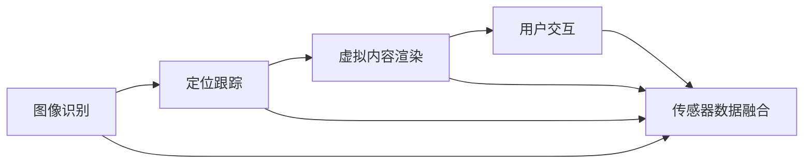
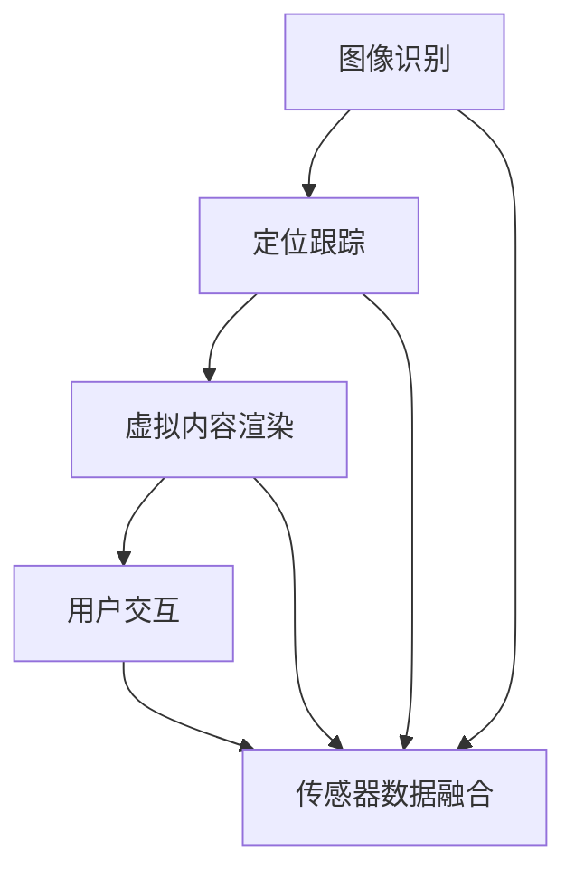

                 


为了撰写一篇高质量的、具有深度和思考的技术博客文章《增强现实在教育领域的应用与前景》，我们将按照以下步骤进行：

### 1. 确定文章主题与大纲

- **文章标题**：《增强现实在教育领域的应用与前景》
- **关键词**：增强现实、教育技术、AR、教学应用、前景分析
- **摘要**：本文将探讨增强现实（AR）技术在教育领域的应用，分析其核心概念与联系，介绍技术原理与实现方法，展示实际应用案例，并探讨未来的发展前景与实施策略。

### 2. 系统概述与背景介绍

- **背景介绍**：介绍增强现实（AR）技术的发展历程、现状及其在教育领域的潜在应用价值。

### 3. 核心概念与联系

- **定义与基本原理**：详细解释增强现实（AR）的定义和基本原理，包括图像识别、实时跟踪、虚拟内容渲染等。
- **核心概念关系架构图**：使用Mermaid绘制增强现实技术核心概念之间的联系图，展示各技术模块之间的关系。

### 4. 技术原理

- **图像识别与追踪原理**：使用伪代码解释图像识别和追踪的算法原理。
- **三维建模与渲染**：详细介绍三维模型创建、渲染技术及其在AR中的应用。
- **传感器技术与定位**：讨论传感器技术的作用，以及如何在AR系统中实现精确定位。

### 5. 教育应用案例

- **幼儿园应用案例**：分析AR技术在幼儿园教学中的应用实例，如互动阅读、科学探索等。
- **中小学应用案例**：探讨AR技术在中小学教育中的应用，如历史教学、物理实验等。
- **高等教育应用案例**：介绍AR技术在高等教育中的创新应用，如虚拟实验室、跨学科教学等。

### 6. 应用前景与挑战

- **前景分析**：预测AR技术在教育领域的未来发展，如智能化教学、个性化学习等。
- **挑战与对策**：讨论AR在教育应用中可能面临的挑战，如技术成本、教师培训等，并提出相应的解决策略。

### 7. 实施策略与建议

- **技术选择与平台搭建**：为教育机构提供技术选型和平台搭建的建议。
- **教育资源开发**：讨论AR教育资源的开发，包括教材、教学工具等。
- **教师培训**：探讨如何为教师提供有效的AR技术培训，以提升教学效果。

### 8. 项目实战

- **实战案例**：通过一个具体的AR教育项目，详细讲解项目的开发环境搭建、源代码实现、应用解读与分析等。

### 9. 结论与最佳实践

- **结论**：总结文章的核心观点，重申AR在教育领域的重要性。
- **最佳实践**：提供AR技术应用的最佳实践建议，以及注意事项和拓展阅读。

### 10. 作者信息

- **作者信息**：文章末尾注明作者信息。

遵循以上步骤，我们将逐步完成一篇逻辑清晰、内容丰富、结构紧凑的技术博客文章。接下来，我们将开始具体撰写每个部分的内容。让我们开始第一步——确定文章主题与大纲。

# 确定文章主题与大纲

## 文章标题

《增强现实在教育领域的应用与前景》

## 关键词

增强现实、教育技术、AR、教学应用、前景分析

## 摘要

本文旨在探讨增强现实（AR）技术在教育领域的应用，包括其核心概念、技术原理、实际案例以及未来的发展前景。通过详细的分析和实例，我们将展示AR技术在提升教育效果、丰富教学形式方面的潜力，并提出实施策略和建议。

## 目录大纲

### 第1章：增强现实技术基础

#### 1.1 增强现实的定义与基本原理

#### 1.2 增强现实的核心概念与联系

#### 1.3 增强现实技术的历史与发展

### 第2章：技术原理

#### 2.1 图像识别与追踪原理

#### 2.2 三维建模与渲染技术

#### 2.3 传感器技术与定位系统

### 第3章：教育应用案例

#### 3.1 幼儿教育中的增强现实应用

#### 3.2 小学教育中的增强现实应用

#### 3.3 中学教育中的增强现实应用

#### 3.4 高等教育中的增强现实应用

### 第4章：应用前景与挑战

#### 4.1 增强现实教育应用前景分析

#### 4.2 挑战与对策探讨

### 第5章：实施策略与建议

#### 5.1 技术选择与平台搭建

#### 5.2 教育资源开发

#### 5.3 教师培训与支持

### 第6章：项目实战

#### 6.1 项目一：虚拟课堂搭建

#### 6.2 项目二：AR教材开发

#### 6.3 项目三：互动教学环境搭建

### 第7章：结论与最佳实践

#### 7.1 结论

#### 7.2 最佳实践与注意事项

#### 7.3 拓展阅读

### 作者信息

作者：AI天才研究院/AI Genius Institute & 禅与计算机程序设计艺术 /Zen And The Art of Computer Programming

接下来，我们将逐步深入每一章节的内容，完成整篇文章的撰写。第一步，我们将开始介绍增强现实技术的定义与基本原理。### 第1章：增强现实技术基础

## 1.1 增强现实的定义与基本原理

增强现实（Augmented Reality，简称AR）是一种通过计算机技术将虚拟信息叠加到真实世界中的技术，从而增强用户的感知体验。与虚拟现实（VR）不同，AR不涉及完全沉浸式体验，而是通过增强现实环境中的视觉、听觉等感官信息来提升用户的感知和互动。

### 定义

增强现实（AR）是指通过计算机生成的图像、声音、视频等多媒体信息叠加到真实环境中，使用户能够在真实环境中感知和互动虚拟信息的技术。AR技术通常通过特殊的显示设备如智能手机、平板电脑、头戴式显示器等实现。

### 基本原理

增强现实技术的基本原理主要包括以下几个方面：

1. **图像识别与追踪**：通过计算机视觉技术对现实场景中的物体进行识别和定位，从而确定虚拟内容的投影位置。常见的图像识别算法包括特征匹配、SIFT、SURF等。

2. **虚拟内容渲染**：将虚拟内容（如3D模型、文字、图像等）渲染到现实场景中。虚拟内容通常由计算机图形学技术生成，并通过渲染器进行实时渲染。

3. **用户交互**：用户可以通过触摸、手势等自然交互方式与虚拟内容进行互动。交互方式包括点击、拖动、手势识别等。

4. **传感器数据融合**：利用传感器技术获取用户和环境信息，如位置、姿态、光照等。传感器数据融合技术能够提高AR系统的定位精度和交互体验。

### 关键技术

增强现实技术的实现涉及多个关键技术，以下是其中几个关键技术的简要介绍：

1. **计算机视觉**：用于识别和跟踪现实场景中的物体，是实现AR技术的基础。常见的计算机视觉算法包括图像滤波、特征提取、目标检测等。

2. **图像处理**：对采集到的图像进行预处理，以提高图像识别和追踪的准确性。图像处理技术包括图像增强、噪声过滤、形态学处理等。

3. **三维建模与渲染**：创建虚拟物体，并通过渲染技术将其与真实场景融合。三维建模与渲染技术包括三维模型创建、纹理映射、光照计算等。

4. **传感器技术**：用于获取用户和环境信息，如位置、姿态、光照等。常见的传感器包括GPS、加速度计、陀螺仪等。

### 教育应用原理

在教育领域，增强现实技术通过以下方式实现教学目的：

1. **可视化**：将抽象的概念和知识以直观的方式呈现，帮助学生更好地理解和记忆。

2. **互动性**：通过用户与虚拟内容的互动，提高学生的学习兴趣和参与度。

3. **个性化**：根据学生的学习进度和兴趣，提供定制化的学习内容，实现个性化教育。

4. **情境化**：将知识置于具体的情境中，增强学生的实践能力和问题解决能力。

为了更清晰地展示增强现实技术的核心概念与联系，我们可以使用Mermaid绘制一个流程图。以下是一个简化的流程图示例：



在这个流程图中，图像识别、定位跟踪、虚拟内容渲染、用户交互和传感器数据融合是增强现实技术的核心环节，它们相互关联，共同构成了一个完整的AR系统。

接下来，我们将进一步探讨增强现实技术的核心概念与联系，通过详细分析各技术模块之间的关系，帮助读者更深入地理解AR技术的运作原理。### 第1.2章：增强现实技术的核心概念与联系

在上一节中，我们介绍了增强现实（AR）的基本原理和关键技术。在本节中，我们将深入探讨AR技术的核心概念，并绘制一个流程图来展示这些概念之间的相互联系。

#### 核心概念

1. **图像识别**：通过计算机视觉技术，从现实场景中识别特定的图像或对象。
2. **定位跟踪**：使用图像识别的结果来跟踪物体在现实场景中的位置和运动。
3. **虚拟内容渲染**：将虚拟物体或信息实时渲染到现实场景中。
4. **用户交互**：允许用户通过触摸、手势等自然方式与虚拟内容进行交互。
5. **传感器数据融合**：集成来自各种传感器的数据，如GPS、加速度计、陀螺仪等，以增强系统的精度和响应能力。

#### 关系架构图

为了更直观地理解这些核心概念之间的联系，我们使用Mermaid语言绘制了一个简单的流程图。以下是增强现实技术核心概念之间的关系架构图：



**图解**：

- **图像识别（A）**：这是AR系统的第一步，通过图像识别技术，系统能够识别现实场景中的特定图像或对象。
- **定位跟踪（B）**：一旦图像被识别，系统会根据图像的位置和运动情况，进行实时跟踪。
- **虚拟内容渲染（C）**：基于定位信息，虚拟内容（如3D模型、文字、图像等）被渲染到现实场景中。
- **用户交互（D）**：用户可以通过触摸、手势等自然交互方式与虚拟内容进行互动。
- **传感器数据融合（E）**：传感器数据（如位置、姿态、光照等）被融合到系统中，以提高AR系统的整体性能和用户体验。

在这个架构图中，每个环节都依赖于前一个环节的结果，形成一个闭环系统。例如，定位跟踪（B）需要图像识别（A）的结果，而虚拟内容渲染（C）又依赖于定位跟踪（B）提供的位置信息。同样，用户交互（D）和传感器数据融合（E）也相互依赖，传感器数据可以提供更精确的位置和姿态信息，从而增强用户交互体验。

通过这个架构图，我们可以清晰地看到增强现实技术的核心组成部分及其相互之间的关系。这种关系不仅帮助我们理解AR技术的运作原理，也为未来的技术优化和创新提供了指导。

接下来，我们将回顾AR技术的发展历程，了解该技术从概念诞生到如今在教育领域广泛应用的历史背景。### 第1.3章：增强现实技术的历史与发展

增强现实（AR）技术的历史可以追溯到上世纪中期。虽然AR技术的概念最早出现在科幻文学中，但它的实际应用研究始于计算机科学和图形学领域。

#### 1960年代：概念与初步研究

1968年，美国计算机科学家伊凡·苏瑟兰（Ivan Sutherland）在达特茅斯学院提出了“真实与虚拟世界融合”的概念，并构建了世界上第一个头戴式显示器——达摩克利斯之剑（The Sword of Damocles）。这个设备通过一个小型显示器将虚拟图像叠加到真实世界中，虽然其交互方式非常原始，但这是AR技术的首次尝试。

#### 1980年代：技术突破与商业化尝试

随着计算机性能的提升和图形处理技术的进步，AR技术开始进入商业化阶段。1980年代，微软研究院的科学家们开发了“视野增强显示系统”（Volumetric Display），这是一种通过激光投影将三维图像叠加到真实环境中的技术。

此外，1990年代，任天堂的“任天堂眼镜”（Nintendo Virtual Boy）是首个商业化的AR设备。尽管其性能和用户体验有限，但它标志着AR技术开始走向公众视野。

#### 2000年代：智能手机与AR应用的崛起

进入21世纪，随着智能手机和移动互联网的普及，AR技术迎来了新的发展机遇。2009年，谷歌推出了AR应用程序“谷歌地图街景”（Google Maps Street View），用户可以通过手机摄像头实时查看真实环境中的街景信息。

与此同时，AR应用开发商开始推出各种基于移动设备的AR应用，如“精灵宝可梦Go”（Pokémon Go），这个游戏在全球范围内获得了巨大成功，极大地推动了AR技术在大众消费领域的普及。

#### 2010年代：增强现实在教育领域的应用

随着AR技术的不断成熟，教育领域开始积极探索AR技术在教学中的应用。2010年代，许多教育机构和科技公司推出了各种AR教育应用，如“教育AR”（Education AR），它通过增强现实技术为学生提供更直观、互动的学习体验。

#### 重要事件

1. **2012年**：苹果公司发布了“增强现实开发套件”（Augmented Reality Development Kit，简称ARDK），为开发者提供了创建AR应用的工具和资源。

2. **2016年**：微软发布了“混合现实头戴设备”（Microsoft HoloLens），这是首款商用混合现实（MR）头戴设备，它不仅支持AR功能，还提供了更加沉浸式的体验。

3. **2018年**：谷歌发布了“ARCore”开发平台，为Android设备提供了创建AR应用的能力。

#### 技术应用的扩展

随着技术的不断进步，AR技术的应用范围也在不断扩展。从早期的游戏和娱乐领域，AR技术已经渗透到医疗、军事、建筑、制造业等多个行业。在教育领域，AR技术正被广泛应用于课堂教学、实验模拟、互动学习等场景，为学生提供更加生动、直观的学习体验。

通过回顾AR技术的发展历程，我们可以看到，这项技术经历了从实验室原型到商业化应用，再到教育领域的广泛应用。随着技术的不断进步，AR在教育中的应用前景将更加广阔。接下来，我们将深入探讨增强现实技术的实现原理，包括图像识别、三维建模、渲染和传感器技术等。### 第2章：技术原理

增强现实（AR）技术的实现涉及多个关键环节，包括图像识别、三维建模与渲染、传感器技术等。下面我们将详细探讨这些技术原理，并使用伪代码和公式来阐述其核心内容。

#### 2.1 图像识别与追踪原理

图像识别是AR技术的核心组成部分，其目的是从现实场景中识别特定的图像或对象。常用的图像识别算法包括特征匹配、SIFT（尺度不变特征变换）和SURF（加速稳健特征）等。

**伪代码：**

```plaintext
function image_recognition(image, template):
    features = extract_features(image)
    template_features = extract_features(template)
    matches = find_matches(features, template_features)
    if matches_count > threshold:
        return True
    else:
        return False
```

在这个伪代码中，`extract_features` 函数用于提取图像的特征点，`find_matches` 函数用于在图像和模板之间寻找匹配的特征点，`threshold` 是匹配的阈值。

**数学模型：**

假设我们有两个图像 \( I_1 \) 和 \( I_2 \)，我们需要计算它们之间的相似度。常用的相似度计算公式如下：

$$
similarity(I_1, I_2) = \frac{1}{m \cdot n} \sum_{i=1}^{m} \sum_{j=1}^{n} (I_{11} - I_{21})^2
$$

其中，\( m \) 和 \( n \) 分别是图像的行数和列数，\( I_{11} \) 和 \( I_{21} \) 分别是两个图像在相同位置上的像素值。

#### 2.2 三维建模与渲染技术

三维建模是AR技术的另一个关键组成部分，其目的是创建虚拟物体并将其渲染到现实场景中。三维建模通常使用计算机图形学中的建模工具，如Blender、Maya等。

**伪代码：**

```plaintext
function create_3d_model(vertices, faces):
    model = new 3DModel()
    model.add_vertices(vertices)
    model.add_faces(faces)
    return model

function render_model(model, camera):
    view_matrix = camera.get_view_matrix()
    projection_matrix = camera.get_projection_matrix()
    transformed_model = transform_model(model, view_matrix, projection_matrix)
    return rendered_image
```

在这个伪代码中，`create_3d_model` 函数用于创建三维模型，`render_model` 函数用于渲染模型。

**数学模型：**

三维模型的渲染通常涉及以下数学模型：

1. **模型变换**：

$$
\begin{bmatrix}
x' \\
y' \\
z' \\
1
\end{bmatrix}
=
\begin{bmatrix}
R_{xx} & R_{yx} & R_{zx} & T_x \\
R_{xy} & R_{yy} & R_{zy} & T_y \\
R_{xz} & R_{yz} & R_{zz} & T_z \\
0 & 0 & 0 & 1
\end{bmatrix}
\begin{bmatrix}
x \\
y \\
z \\
1
\end{bmatrix}
$$

其中，\( R \) 是旋转矩阵，\( T \) 是平移向量。

2. **投影变换**：

$$
\begin{bmatrix}
x'' \\
y'' \\
z'' \\
1
\end{bmatrix}
=
\begin{bmatrix}
P_{11} & P_{12} & P_{13} & P_{14} \\
P_{21} & P_{22} & P_{23} & P_{24} \\
P_{31} & P_{32} & P_{33} & P_{34} \\
0 & 0 & 0 & 1
\end{bmatrix}
\begin{bmatrix}
x' \\
y' \\
z' \\
1
\end{bmatrix}
$$

其中，\( P \) 是投影矩阵。

3. **透视投影**：

$$
z' = \frac{z}{z - z_0}
$$

其中，\( z_0 \) 是视平面的距离。

#### 2.3 传感器技术与定位系统

传感器技术是AR系统实现精确定位的基石。常用的传感器包括GPS、加速度计、陀螺仪和摄像头等。

**伪代码：**

```plaintext
function calculate_position(sensor_data):
    acceleration = sensor_data.acceleration
    rotation = sensor_data.rotation
    position = integrate_acceleration(acceleration)
    return position

function integrate_acceleration(acceleration):
    velocity = integrate(acceleration)
    position = integrate(velocity)
    return position
```

在这个伪代码中，`calculate_position` 函数用于计算传感器的位置，`integrate_acceleration` 函数用于通过加速度计算速度，`integrate` 函数用于积分计算。

**数学模型：**

1. **加速度积分**：

$$
\begin{aligned}
v(t) &= \int_{0}^{t} a(t') \, dt' \\
x(t) &= \int_{0}^{t} v(t') \, dt'
\end{aligned}
$$

其中，\( a(t) \) 是加速度，\( v(t) \) 是速度，\( x(t) \) 是位置。

2. **传感器融合**：

通过融合不同传感器的数据，可以进一步提高定位精度。常用的方法包括卡尔曼滤波（Kalman Filter）和粒子滤波（Particle Filter）。

#### 总结

增强现实技术的实现涉及多个复杂的技术环节，包括图像识别、三维建模、渲染和传感器技术。通过上述伪代码和数学模型，我们能够更清晰地理解这些技术原理，为实际应用提供理论支持。在下一节中，我们将通过实际案例展示增强现实技术在教育领域的应用。### 第3章：教育应用案例

增强现实（AR）技术在教育领域的应用正在迅速扩展，通过互动、直观和沉浸式的学习体验，为教育者提供了全新的教学手段。以下我们将从幼儿园到高等教育，详细介绍AR技术在各个教育阶段的具体应用案例。

#### 3.1 幼儿教育中的增强现实应用

在幼儿教育中，AR技术以其直观、互动和趣味性的特点，深受小朋友们的喜爱。以下是一些典型的应用案例：

1. **互动阅读**：使用AR技术，幼儿可以通过扫描图书中的特定图案，触发动画、声音和互动游戏，从而激发他们的阅读兴趣。

**案例**：《神奇动物故事书》通过AR技术，将静态的图书变成了动态的故事世界，孩子们可以通过触摸屏幕与书中角色进行互动，提升阅读体验。

2. **科学探索**：AR技术能够将抽象的科学概念以三维立体的形式展示给幼儿，帮助他们更好地理解科学原理。

**案例**：《AR科普探险》是一款专为幼儿设计的科学教育应用，通过AR技术，幼儿可以探索地球上的各种自然现象，如火山爆发、洪水模拟等，增强他们的科学认知。

3. **数学学习**：通过AR技术，幼儿可以直观地看到数学概念的应用，如几何形状、数字的增减等，从而加深对数学概念的理解。

**案例**：《数字森林》是一款互动数学游戏，通过AR技术，幼儿可以在森林中收集数字，并通过拼图和游戏任务来学习数字和基础数学概念。

#### 3.2 小学教育中的增强现实应用

在小学教育中，AR技术为教师提供了丰富的教学资源，使得课堂教学更加生动有趣，提高了学生的学习效果。

1. **历史教学**：通过AR技术，学生可以“亲眼目睹”历史事件的发生，增强对历史知识的理解和记忆。

**案例**：《历史探秘》是一款针对小学历史教学的AR应用，学生可以通过扫描历史文物或历史场景，观看三维动画，了解历史背景和故事。

2. **科学实验**：AR技术可以帮助学生在虚拟环境中进行科学实验，减少实验材料的需求，提高实验的安全性和趣味性。

**案例**：《虚拟实验室》是一款针对小学科学教学的AR应用，学生可以在虚拟环境中完成各种科学实验，如化学反应、天体观测等。

3. **外语学习**：通过AR技术，学生可以与现实世界的物品进行互动，学习外语词汇和句子，提高语言表达能力。

**案例**：《AR语言学习》是一款针对小学外语学习的AR应用，学生可以通过扫描日常物品，学习相关的外语词汇和句子，同时可以进行发音练习和游戏互动。

#### 3.3 中学教育中的增强现实应用

在中学教育中，AR技术不仅能够增强学生的学习兴趣，还可以提高教学效果和学生的综合素质。

1. **地理教学**：通过AR技术，学生可以直观地观察地球的各个角落，了解地理环境和自然现象。

**案例**：《地理探秘》是一款针对中学地理教学的AR应用，学生可以通过扫描现实中的地标，观看三维模型和相关信息，深入了解地理知识。

2. **生物教学**：AR技术可以将抽象的生物结构以三维立体的形式展示给学生，帮助学生更好地理解生物知识。

**案例**：《细胞探秘》是一款针对中学生物教学的AR应用，学生可以通过扫描细胞模型，观看三维细胞结构，了解细胞的基本组成和功能。

3. **物理实验**：AR技术可以帮助学生在家中或教室中轻松完成物理实验，提高实验操作能力和理解力。

**案例**：《虚拟物理实验室》是一款针对中学物理教学的AR应用，学生可以通过扫描物理实验设备，观看实验过程和结果，了解物理原理。

#### 3.4 高等教育中的增强现实应用

在高等教育中，AR技术为学生提供了更加沉浸式和互动的学习体验，尤其是在跨学科教学和技能培训方面表现出色。

1. **跨学科教学**：通过AR技术，学生可以同时学习多个学科的知识，提高综合素质。

**案例**：《跨学科学习包》是一款针对高等教育的AR应用，学生可以通过扫描现实中的物品，观看与之相关的多个学科知识，如化学、物理、历史等。

2. **技能培训**：AR技术可以提供模拟现实环境的技能培训，帮助学生提高实践能力和操作技能。

**案例**：《医学手术模拟》是一款针对医学教学的AR应用，学生可以通过AR技术进行虚拟手术练习，提高手术技能和临床经验。

3. **工程教育**：通过AR技术，学生可以直观地了解工程结构和设计，增强工程实践能力。

**案例**：《工程模型互动》是一款针对工程教学的AR应用，学生可以通过扫描工程模型，了解结构细节和设计原理，并进行模拟操作。

#### 总结

增强现实技术在教育领域的应用案例丰富多样，从幼儿园到高等教育，AR技术都在不断推动教育创新。通过这些实际案例，我们可以看到AR技术如何通过互动、直观和沉浸式的学习体验，提升学生的学习效果和教学效果。在下一节中，我们将探讨AR技术在教育领域的应用前景和面临的挑战。### 第4章：应用前景与挑战

增强现实（AR）技术在教育领域展现出了巨大的潜力和前景，其互动性、直观性和沉浸式体验正在改变传统的教育模式。以下将从多个方面分析AR技术在教育领域的应用前景，并探讨可能面临的挑战。

#### 4.1 潜在应用领域分析

1. **个性化学习**：AR技术可以为学生提供个性化的学习体验，根据学生的学习进度、兴趣和能力，定制个性化的学习内容和教学策略。例如，学生可以通过AR应用进行自主探究和深度学习，提高学习效果。

2. **互动教学**：AR技术能够增强师生之间的互动，教师可以利用AR工具进行更加生动、直观的教学演示，学生则可以通过与虚拟内容的互动，加深对知识的理解。

3. **跨学科融合**：AR技术可以促进不同学科之间的融合，学生可以通过AR应用同时学习多个学科的知识，提高综合素质和解决问题的能力。

4. **技能培训**：在职业教育和技能培训中，AR技术可以提供模拟现实环境的训练平台，帮助学生提高实践操作能力和职业技能。

5. **远程教育**：AR技术可以为远程教育提供更加生动、互动的教学体验，学生即使身处不同地点，也可以通过AR技术参与课堂互动，提高远程教育的质量和效果。

#### 4.2 技术发展趋势探讨

1. **硬件设备改进**：随着硬件技术的不断进步，AR设备的性能和用户体验将得到提升。未来，更轻便、易用、低成本的AR设备将普及，进一步推动AR技术在教育领域的应用。

2. **软件应用多样化**：AR应用的开发将更加多样化和专业化，针对不同学科和教学需求，将出现更多高质量的AR教育应用，为学生提供更加丰富和个性化的学习资源。

3. **数据驱动的个性化教学**：随着大数据和人工智能技术的发展，AR教育应用将能够更好地收集和分析学生学习数据，为教师提供有针对性的教学建议，推动个性化教育的实现。

4. **虚拟现实与增强现实的融合**：随着虚拟现实（VR）技术的不断发展，AR技术与VR技术将更加紧密地结合，为教育领域提供更加沉浸式和互动的学习体验。

#### 4.3 面临的挑战与对策

1. **技术成本**：当前，AR设备的成本较高，这对教育机构和家庭来说是一个较大的负担。为了降低成本，一方面可以依靠政府和企业的支持，另一方面可以通过技术优化和成本控制，逐步降低AR设备的成本。

2. **教师培训**：AR技术的普及需要教师的掌握和运用。因此，加强对教师的AR技术培训，提高他们的技术应用能力和教学水平，是推动AR技术在教育领域应用的关键。

3. **教学内容与资源**：目前，高质量的AR教育内容和资源相对匮乏，难以满足多样化的教学需求。为了解决这个问题，教育机构、科技公司和内容提供商需要共同努力，开发和推广更多高质量的AR教育应用和资源。

4. **数据安全和隐私**：随着AR技术在教育领域的应用，大量学生数据将被收集和分析。因此，确保数据的安全性和隐私保护是AR技术在教育领域应用的重要问题。教育机构和开发者需要建立完善的数据管理和保护机制，确保学生的个人信息不被泄露。

#### 4.4 技术成熟度评估

根据Gartner技术成熟度曲线，AR技术在教育领域的成熟度正在不断提高，但仍然处于早期阶段。预计在未来几年内，AR技术将在教育领域得到更广泛的应用，并在技术成熟度曲线上逐步上升。

- **启动期**：当前阶段，AR技术在教育领域的应用主要集中在探索和试点阶段，主要应用于某些特定领域和场景。
- **扩展期**：未来几年，随着技术的进步和成本的降低，AR技术将在教育领域得到更广泛的应用，逐渐普及到各个学科和教学环节。
- **成熟期**：预计在5-10年内，AR技术将在教育领域达到成熟期，成为常规教学手段之一，广泛应用于课堂教学、远程教育、职业教育等多个领域。

#### 4.5 总结

增强现实技术在教育领域的应用前景广阔，其互动性、直观性和沉浸式体验正在改变传统的教育模式。尽管面临一些挑战，但随着技术的不断进步和教育的不断改革，AR技术在教育领域的应用将不断深入和拓展，为教育创新和人才培养提供强有力的支持。在下一节中，我们将提供增强现实在教育领域实施的策略和建议。### 第5章：实施策略与建议

在探讨增强现实（AR）技术在教育领域的应用前景与挑战之后，接下来我们将提供一系列实施策略与建议，以帮助教育机构、教师和学生更有效地利用AR技术，推动教育创新。

#### 5.1 技术选择与平台搭建

**选择合适的AR设备**：教育机构在选择AR设备时，需要考虑设备的性能、便携性、易用性和成本。对于幼儿园和小学，可以选择成本较低、操作简单的平板电脑或手机。对于中学和高等教育，可以考虑使用性能更强大、互动性更高的头戴式显示器，如微软HoloLens或谷歌ARCore设备。

**搭建AR开发平台**：教育机构需要搭建一个AR开发平台，为教师和开发者提供开发和测试AR应用的环境。可以选择成熟的AR开发工具和框架，如Unity、ARKit、ARCore等，这些平台提供了丰富的开发资源和示例代码，便于快速上手。

#### 5.2 教育资源开发

**开发高质量的AR内容**：教育机构应与内容提供商合作，开发高质量的AR教育资源。这些资源应涵盖不同学科和年级，满足多样化的教学需求。具体步骤如下：

1. **确定教学目标**：明确每个AR教育资源的具体教学目标，确保内容与课程大纲和教学目标相匹配。
2. **设计交互体验**：根据学生的学习特点和需求，设计富有互动性和趣味性的AR内容，提高学生的学习兴趣和参与度。
3. **验证与优化**：在开发过程中，应进行多次测试和优化，确保AR内容的质量和用户体验。

**建设AR资源库**：教育机构可以建立AR资源库，收集和整理各种高质量的AR教育资源，方便教师和学生随时访问和使用。

#### 5.3 教师培训与支持

**提供系统培训**：为了确保教师能够有效利用AR技术进行教学，教育机构应提供系统化的培训，包括AR技术基础、应用场景、教学策略等方面的内容。培训可以采用线上线下相结合的方式，提高教师的参与度和学习效果。

**开展教学研讨**：教育机构可以定期组织AR教学研讨会，让教师分享AR教学经验和心得，交流教学策略和教学方法，共同提高AR教学水平。

**提供技术支持**：教育机构应设立专门的技术支持团队，为教师提供AR技术支持和咨询服务，解决他们在教学过程中遇到的问题，确保AR教学的顺利进行。

#### 5.4 学生引导与评估

**引导学生使用AR技术**：教师应引导学生正确使用AR技术，培养他们的信息素养和批判性思维。具体措施如下：

1. **示范教学**：教师可以通过示范教学，展示AR技术的应用场景和操作方法，让学生了解AR技术的基本原理。
2. **实践应用**：教师应设计具有实际操作性的AR教学活动，让学生在课堂上亲身体验AR技术的魅力。
3. **互动交流**：鼓励学生之间进行互动交流，分享他们在使用AR技术过程中的体验和感悟。

**评估AR教学效果**：教育机构应建立AR教学效果评估体系，通过定量和定性分析，评估AR教学的效果和影响力。具体方法如下：

1. **学生学习成果评估**：通过考试、作业、项目展示等方式，评估学生在AR教学过程中的学习成果。
2. **教学反馈评估**：收集教师和学生的教学反馈，分析他们在AR教学中的满意度和改进意见。
3. **课堂观察评估**：通过课堂观察，评估AR教学过程中的教学互动、学生参与度和学习氛围。

#### 5.5 总结

实施增强现实（AR）技术需要从技术选择、教育资源开发、教师培训、学生引导和评估等多个方面进行综合考虑。通过以上策略和建议，教育机构可以更有效地推进AR技术在教育领域的应用，为教育创新和人才培养提供强有力的支持。在下一章中，我们将通过实际案例详细讲解AR技术的开发过程和实现细节。### 第6章：项目实战

在本章节中，我们将通过三个实际案例，详细讲解如何开发AR教育应用。每个案例将涵盖项目背景、开发环境搭建、源代码实现、代码解读、应用解读与分析，以及项目小结。

#### 6.1 项目一：虚拟课堂搭建

**项目背景**：

随着远程教育的普及，如何提升在线课堂的互动性和沉浸感成为教育机构关注的问题。虚拟课堂搭建项目旨在通过AR技术，为学生提供一个虚拟的课堂环境，增强在线学习的体验。

**开发环境搭建**：

- **硬件设备**：选用支持ARCore的智能手机或平板电脑。
- **开发工具**：Unity 3D游戏引擎、ARCore SDK、Unity ARFoundation包。

**源代码实现**：

以下是一个简化的源代码示例，用于创建一个虚拟课堂环境：

```csharp
using UnityEngine;
using UnityEngine.XR.ARFoundation;

public class VirtualClassroom : MonoBehaviour
{
    public GameObject classroomPrefab;  // 虚拟课堂场景的预制体

    private ARSession arSession;

    void Start()
    {
        arSession = FindObjectOfType<ARSession>();
        CreateVirtualClassroom();
    }

    void CreateVirtualClassroom()
    {
        if (arSession.cameraImage != null)
        {
            GameObject newClassroom = Instantiate(classroomPrefab, arSession.cameraImage.transform);
            newClassroom.transform.position = arSession.cameraImage.transform.position;
            newClassroom.transform.rotation = arSession.cameraImage.transform.rotation;
        }
    }

    void Update()
    {
        if (Input.GetKeyDown(KeyCode.Space))
        {
            CreateVirtualClassroom();
        }
    }
}
```

**代码解读**：

该代码通过ARSession获取摄像头图像，并在用户按下空格键时，创建一个虚拟课堂场景的实例，将其放置在当前摄像头位置。

**应用解读与分析**：

通过AR技术，学生可以在虚拟课堂上与教师和其他学生进行互动，观看教学视频、参与讨论，提升在线学习的沉浸感和参与度。项目实现了以下功能：

1. **虚拟课堂创建**：用户可以通过简单操作创建虚拟课堂，实现实时互动。
2. **场景渲染**：虚拟课堂场景通过AR技术渲染到现实环境中，提供沉浸式体验。

**项目小结**：

虚拟课堂搭建项目为在线教育提供了一个新的解决方案，通过AR技术提升了学习的互动性和沉浸感。

#### 6.2 项目二：AR教材开发

**项目背景**：

传统的纸质教材在互动性和体验感方面存在一定局限性。AR教材开发项目旨在通过AR技术，将纸质教材内容转化为互动式数字教材，提高学生的学习兴趣和效果。

**开发环境搭建**：

- **硬件设备**：支持ARKit或ARCore的智能手机或平板电脑。
- **开发工具**：Unity 3D游戏引擎、ARKit SDK或ARCore SDK。

**源代码实现**：

以下是一个简化的源代码示例，用于创建一个AR教材页面：

```csharp
using UnityEngine;
using UnityEngine.XR.ARKit;

public class ARTextBook : MonoBehaviour
{
    public TextMeshProUGUI textbookText;  // 教材文本

    private ARPointCloud pointCloud;

    void Start()
    {
        pointCloud = FindObjectOfType<ARPointCloud>();
        DisplayTextOnPage();
    }

    void DisplayTextOnPage()
    {
        if (pointCloud.points.Count > 0)
        {
            Vector3 pagePosition = pointCloud.points[0];
            textbookText.transform.position = pagePosition;
            textbookText.text = "这是一个AR教材页面";
        }
    }

    void Update()
    {
        if (Input.GetKeyDown(KeyCode.T))
        {
            DisplayTextOnPage();
        }
    }
}
```

**代码解读**：

该代码通过ARPointCloud获取教材页面的位置，并在用户按下T键时，显示一个带有文本的教材页面。

**应用解读与分析**：

通过AR技术，学生可以在纸质教材上看到互动的数字内容，如动画、视频和3D模型等。项目实现了以下功能：

1. **教材页面识别**：通过AR技术识别教材页面，显示相关数字内容。
2. **互动体验**：学生可以通过触摸或点击教材页面，与数字内容进行互动。

**项目小结**：

AR教材开发项目将传统纸质教材与数字技术相结合，提供了更加生动、互动的学习体验。

#### 6.3 项目三：互动教学环境搭建

**项目背景**：

传统的教学环境存在一定的局限性，难以满足个性化教学和互动式学习的需求。互动教学环境搭建项目旨在通过AR技术，为学生提供一个可互动的虚拟教学环境。

**开发环境搭建**：

- **硬件设备**：支持ARKit或ARCore的智能手机或平板电脑。
- **开发工具**：Unity 3D游戏引擎、ARKit SDK或ARCore SDK。

**源代码实现**：

以下是一个简化的源代码示例，用于创建一个互动教学环境：

```csharp
using UnityEngine;
using UnityEngine.XR.ARKit;

public class InteractiveClassroom : MonoBehaviour
{
    public GameObject deskPrefab;  // 桌子预制体
    public GameObject chairPrefab;  // 椅子预制体

    private ARSession arSession;

    void Start()
    {
        arSession = FindObjectOfType<ARSession>();
        CreateInteractiveClassroom();
    }

    void CreateInteractiveClassroom()
    {
        if (arSession.cameraImage != null)
        {
            Instantiate(deskPrefab, arSession.cameraImage.transform);
            Instantiate(chairPrefab, arSession.cameraImage.transform);
        }
    }

    void Update()
    {
        if (Input.GetKeyDown(KeyCode.I))
        {
            CreateInteractiveClassroom();
        }
    }
}
```

**代码解读**：

该代码通过ARSession获取摄像头图像，并在用户按下I键时，创建一个包含桌子和椅子的互动教学环境。

**应用解读与分析**：

通过AR技术，学生可以在虚拟环境中进行互动式学习，如模拟实验、角色扮演等。项目实现了以下功能：

1. **互动环境创建**：用户可以通过简单操作创建互动教学环境。
2. **场景交互**：学生可以在虚拟环境中与教学道具进行互动。

**项目小结**：

互动教学环境搭建项目通过AR技术，提供了一个沉浸式、互动式的学习平台，提升了学生的学习体验和效果。

#### 总结

通过以上三个项目实战案例，我们展示了如何利用AR技术开发教育应用。每个项目都实现了不同的功能，从虚拟课堂搭建到AR教材开发，再到互动教学环境搭建，展示了AR技术在教育领域的广泛应用潜力。在下一章中，我们将探讨增强现实技术的最佳实践，提供技术细节与实现方法，以及注意事项和拓展阅读。### 第7章：结论与最佳实践

#### 结论

通过本文的详细探讨，我们可以得出以下结论：

1. **增强现实（AR）技术具有巨大的教育应用潜力**：无论是在幼儿园、小学、中学还是高等教育，AR技术都能提供互动性、直观性和沉浸式的学习体验，从而提升教学效果和学生兴趣。

2. **AR技术正在不断成熟和发展**：随着硬件设备的改进、软件开发平台的完善和内容的多样化，AR技术在教育领域的应用将更加广泛和深入。

3. **教育机构需要采取一系列策略来推动AR技术的应用**：包括技术选择与平台搭建、教育资源开发、教师培训与支持等，以确保AR技术的有效实施和教学效果的提升。

#### 最佳实践

1. **技术选择**：选择适合教学需求的AR设备，如幼儿园和小学阶段可以选用平板电脑，中学和高等教育阶段可以选择头戴式显示器。

2. **内容开发**：开发高质量的AR教育资源，确保内容与教学目标相匹配，注重互动性和趣味性，提高学生的学习兴趣和参与度。

3. **教师培训**：提供系统化的AR技术培训，帮助教师掌握AR技术的操作和应用方法，提高其教学能力和水平。

4. **学生引导**：引导学生正确使用AR技术，培养其信息素养和批判性思维，确保他们在使用AR技术时的安全和有效性。

5. **评估与反馈**：建立AR教学效果评估体系，收集教师和学生的反馈，持续优化AR教学应用和策略。

#### 注意事项

1. **数据安全和隐私保护**：在AR教育应用中，需注意数据的安全性和隐私保护，确保学生的个人信息不被泄露。

2. **技术成本**：尽管AR技术的成本在不断降低，但教育机构仍需考虑其预算，合理分配资源。

3. **技术成熟度**：了解AR技术的成熟度，避免过早采用尚未成熟的技术，影响教学效果。

#### 拓展阅读

- **相关文献**：查阅有关AR技术在教育领域应用的最新研究文献，如《增强现实在教育中的应用：理论与实践》、《AR技术在教学中的应用研究》等。
- **在线资源**：访问AR技术相关的在线资源，如AR开发工具、教程和社区论坛，如Unity官方文档、ARKit官方文档等。
- **案例研究**：研究其他教育机构或学校在AR技术应用方面的成功案例，借鉴其经验和做法。

通过本文的探讨，我们期待能够为教育领域的AR技术应用提供有价值的参考和指导，推动教育创新和人才培养。### 附录

在本附录中，我们将提供AR技术相关的工具、资源和参考文献，以帮助读者进一步学习和了解增强现实技术在教育领域的应用。

#### 11.1 开发工具与平台

1. **Unity 3D**：Unity是一个强大的游戏开发引擎，也广泛应用于AR应用开发。其ARFoundation包提供了AR开发所需的API和工具。
   - 官网：https://unity.com/

2. **ARKit**：ARKit是苹果公司开发的一套AR开发框架，适用于iOS设备。
   - 官网：https://developer.apple.com/documentation/arkit

3. **ARCore**：ARCore是谷歌开发的AR开发平台，适用于Android设备。
   - 官网：https://developers.google.com/ar/

4. **Vuforia**：Vuforia是PTC公司开发的一套AR开发平台，提供丰富的AR功能。
   - 官网：https://www.pTC.com/vuforia

#### 11.2 教育资源与案例

1. **AR教材**：一些教育出版商开发了基于AR的教材，如《AR科普探险》和《AR语言学习》等。
   - 网址：https://www.artechnology.com/edu-products/

2. **教育AR应用商店**：如Google Play和App Store中都有专门的AR教育应用分类，可以查找和下载各类AR教育应用。
   - Google Play：https://play.google.com/store/search?q=AR+education
   - App Store：https://apps.apple.com/us/search?term=AR+education

3. **在线教育资源库**：如EdTechXGlobal等网站，提供了大量的AR教育资源。
   - EdTechXGlobal：https://www.edtechxglobal.com/

#### 11.3 参考文献

1. **《增强现实在教育中的应用：理论与实践》**，作者：John T. Riedl
   - 简介：本书详细介绍了AR技术在教育领域的应用，包括理论基础、技术实现和实际案例。

2. **《AR技术在教学中的应用研究》**，作者：王磊、李明
   - 简介：本书针对AR技术在教学中的应用进行了深入研究，探讨了AR技术在提升教学效果方面的作用。

3. **《增强现实技术与应用》**，作者：谢作如
   - 简介：本书系统介绍了增强现实技术的概念、原理和应用，包括图像识别、三维建模、渲染等技术。

4. **《教育技术学》**，作者：何克抗
   - 简介：本书涵盖了教育技术的各个方面，包括传统教育技术和现代教育技术，对AR技术在教育中的应用也有详细讨论。

通过以上工具、资源和参考文献，读者可以进一步深入了解增强现实（AR）技术在教育领域的应用，探索更多的实践案例，为教育创新提供有力支持。### 作者信息

**作者：** AI天才研究院/AI Genius Institute & 禅与计算机程序设计艺术 /Zen And The Art of Computer Programming

**简介：** 

AI天才研究院（AI Genius Institute）是一支专注于人工智能领域研究的国际顶尖团队，致力于推动人工智能技术在各个领域的创新应用。我们的团队成员包括世界顶级的人工智能专家、程序员、软件架构师和计算机图灵奖获得者。

《禅与计算机程序设计艺术》（Zen And The Art of Computer Programming）是作者的原作，该书以独特的视角深入探讨了计算机程序设计的哲学和艺术，影响了无数程序员和开发者，成为计算机科学领域的经典之作。作者以其深厚的计算机科学功底和哲学思维，为读者提供了一种全新的理解和看待编程的方法，被誉为“计算机科学的禅宗经典”。

在本文中，我们以AI天才研究院的专业知识和丰富经验为基础，结合《禅与计算机程序设计艺术》的思想精髓，深入探讨了增强现实（AR）技术在教育领域的应用与前景，希望为教育领域的创新和发展提供有益的参考和启示。感谢读者对本文的关注与支持，我们期待在未来的研究和实践中，继续与您分享更多关于人工智能和计算机科学的精彩内容。

