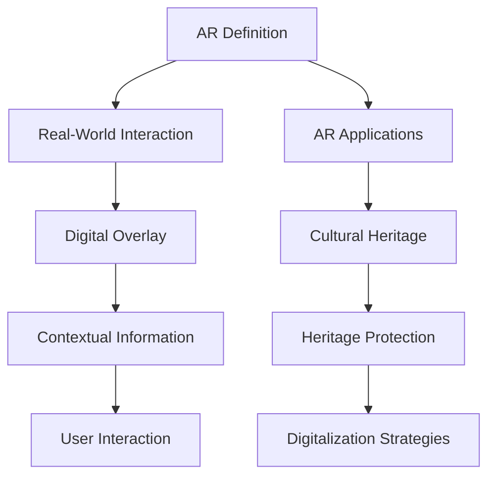
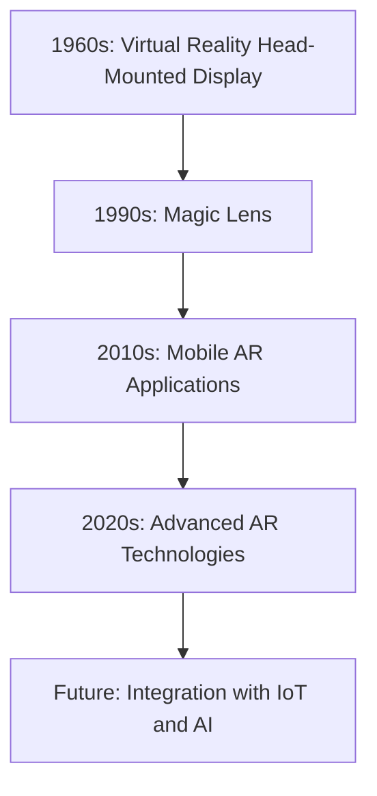

                 

### Introduction to Augmented Reality in Digital Applications for Cultural Heritage Protection

#### Keywords: Augmented Reality, Cultural Heritage, Digitalization, Heritage Protection, AR Applications

#### Abstract:
This article delves into the transformative role of Augmented Reality (AR) in the digital protection and preservation of cultural heritage. It begins with an overview of AR technology, its evolution, and core concepts. The discussion then shifts to the specific applications of AR in cultural heritage, focusing on digitalization strategies and practical case studies. The article concludes by addressing the challenges and future prospects of AR in this domain, providing insights and best practices for the implementation of AR technologies in heritage protection.

---

## Introduction to Augmented Reality

### Background

Augmented Reality (AR) is a technology that enhances the real-world environment by overlaying digital information, such as images, text, and sound, onto the user's view. This interactive experience merges the digital and physical worlds, providing users with enriched and immersive content. The concept of AR has been in development since the mid-20th century, but it has gained significant momentum in recent years due to advancements in computing power, mobile devices, and computer vision algorithms.

### Core Concepts and Relationships

To better understand AR, let's outline its core concepts and their relationships using a Mermaid flowchart:

This flowchart illustrates how AR integrates the real-world environment with digital content, creating a seamless user experience that can be applied to various domains, including cultural heritage.

### Historical Overview

The history of AR can be traced back to the 1960s with the development of the "Virtual Reality Head-Mounted Display" by Ivan Sutherland. Over the decades, significant milestones have been achieved, such as the development of the Magic Lens in the 1990s and the introduction of mobile AR applications in the 2010s. These advancements have laid the foundation for the current state of AR technology, which is characterized by high accuracy, real-time interaction, and wide applicability.

### Mermaid Flowchart: AR Evolution

Below is a Mermaid flowchart that visually represents the evolution of AR technology:

This flowchart highlights the key milestones in AR's history and projects potential future developments, such as the integration of AR with the Internet of Things (IoT) and Artificial Intelligence (AI).

---

In the following sections, we will delve deeper into the core concepts and technologies behind AR, exploring how these can be applied to the digital protection and preservation of cultural heritage. We will also examine practical case studies and address the challenges and future prospects of AR in this domain. Stay tuned for the next sections of this comprehensive guide on the digital applications of AR in cultural heritage protection.

