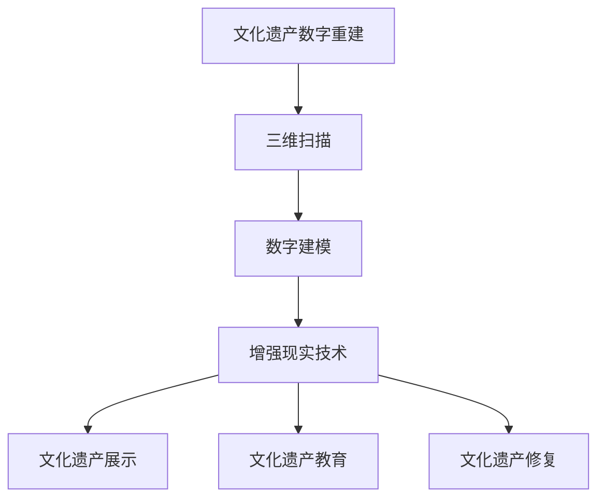

                 


### 第一步：背景介绍

#### 文化遗产的数字重建

文化遗产，如古代建筑、艺术品、文物和历史文献等，是国家和人类共同的宝贵财富。然而，这些文化遗产往往面临自然灾害、战争、盗窃和日常损耗等威胁。因此，文化遗产的数字重建成为了一种重要的保护手段。通过数字化技术，我们可以将文化遗产的信息以数字化的形式保存下来，实现其永久性的保护与传承。

数字重建的过程主要包括三个步骤：数据采集、数据处理和数字重建。数据采集通常采用三维扫描、摄影测量、激光扫描等技术，以获取文化遗产的几何形态和表面特征。数据处理则是对采集到的数据进行分析、修正和优化，以提高重建的精度和可靠性。最后，通过数字建模和渲染技术，将处理后的数据转化为可视化的三维模型。

#### 增强现实技术的发展

增强现实（Augmented Reality，简称AR）是一种将虚拟信息与真实世界相结合的技术。通过增强现实技术，我们可以将数字化的文化遗产信息以视觉、听觉和触觉等多种形式呈现给用户，使其更加生动、直观和互动。

增强现实技术的基本原理是利用计算机生成虚拟信息，然后通过摄像头或其他传感器捕捉现实世界的图像，并实时将这些虚拟信息叠加到真实世界的场景中。这一过程通常涉及多个技术环节，包括图像识别、目标追踪、虚拟渲染和交互设计等。

增强现实技术的历史可以追溯到20世纪50年代，最初主要用于军事和科学领域。随着计算机技术和显示技术的不断发展，增强现实技术逐渐走进民用领域。近年来，随着智能手机和增强现实眼镜等设备的普及，增强现实技术得到了广泛应用。

#### 数字重建与增强现实技术的结合

将数字重建与增强现实技术相结合，可以实现文化遗产的数字保护和文化传播。通过数字重建，我们可以精确地记录和保存文化遗产的形态和特征，从而实现对其永久性的保护。而通过增强现实技术，我们可以将这些数字化的文化遗产信息以更加生动和互动的方式呈现给用户，使其更好地了解和体验文化遗产的魅力。

数字重建与增强现实技术的结合具有以下几个方面的优势：

1. **增强互动体验**：通过增强现实技术，用户可以与数字化的文化遗产进行互动，如虚拟参观、触摸和操作等，从而提升用户体验。

2. **提高保护效率**：数字重建技术可以精确地记录文化遗产的形态和特征，有助于提高保护工作的效率和质量。

3. **促进文化传播**：通过增强现实技术，我们可以将文化遗产以更加生动和互动的方式传播给更广泛的受众，促进文化的传承和普及。

4. **拓展应用场景**：数字重建与增强现实技术的结合可以应用于多种场景，如文化遗产展示、教育、旅游和娱乐等，具有广阔的市场前景。

### 总结

本文首先介绍了文化遗产的数字重建和增强现实技术的基本概念，然后分析了数字重建与增强现实技术的结合及其在文化遗产保护和文化传播中的应用优势。在接下来的章节中，我们将进一步探讨增强现实技术在文化遗产数字重建中的具体应用，以及相关的核心概念、算法原理和实现方法。

---

### 第二步：核心概念与联系

#### 增强现实技术的基本概念

1. **增强现实（AR）**：增强现实技术是一种将虚拟信息与现实世界结合起来的技术。通过增强现实技术，用户可以看到现实世界中的物体，同时也可以看到叠加在现实世界上的虚拟物体。

2. **虚拟现实（VR）**：虚拟现实技术是一种完全沉浸式的技术，用户通过虚拟现实设备（如VR头显）进入一个完全虚构的世界，与现实世界完全隔离。

3. **混合现实（MR）**：混合现实技术是增强现实和虚拟现实的结合，用户可以看到虚拟物体与现实世界的交互和融合。

#### 文化遗产数字重建的关键概念

1. **三维扫描**：通过三维扫描技术获取文化遗产的几何形态和表面特征。

2. **数字建模**：将获取到的三维数据转化为数字模型，以便进行后续的处理和分析。

3. **虚拟现实建模语言（VRML）**：VRML是一种用于创建和描述三维虚拟场景的文件格式。

#### 增强现实在文化遗产数字重建中的应用

1. **文化遗产展示**：通过增强现实技术，用户可以在现实环境中看到文化遗产的三维模型，增强用户体验。

2. **文化遗产教育**：利用增强现实技术，用户可以互动地学习文化遗产的知识，提高学习兴趣。

3. **文化遗产修复**：通过增强现实技术，专业人员可以更直观地了解文化遗产的损坏情况，提高修复效率。

#### 关联架构 Mermaid 流程图



#### 核心算法原理讲解

1. **图像识别与目标追踪**：通过图像识别技术，可以识别出现实世界中的目标物体，然后通过目标追踪技术，实现对目标物体的实时跟踪。

2. **虚拟渲染**：通过虚拟渲染技术，可以将虚拟物体渲染到现实世界中，实现虚拟与现实世界的融合。

3. **交互设计**：通过交互设计，用户可以与虚拟物体进行互动，如触摸、旋转和放大等。

#### 数学模型和公式讲解

1. **三维空间坐标系**：
   $$x = x_0 + dt \cdot v_x$$
   $$y = y_0 + dt \cdot v_y$$
   $$z = z_0 + dt \cdot v_z$$
   其中，$x, y, z$是三维空间中的坐标，$x_0, y_0, z_0$是初始坐标，$v_x, v_y, v_z$是速度分量，$dt$是时间间隔。

2. **点云数据配准**：
   $$T = R \cdot P + T_0$$
   其中，$T$是目标点云，$R$是旋转矩阵，$P$是源点云，$T_0$是平移向量。

#### 举例说明

假设我们使用增强现实技术在博物馆中展示一幅古代绘画，以下是一个简单的实现过程：

1. **三维扫描**：使用三维扫描设备对绘画进行扫描，获取其几何形态和表面特征。

2. **数字建模**：将扫描数据转化为数字模型，并进行优化，以便后续的处理。

3. **图像识别与目标追踪**：使用图像识别技术，识别出博物馆中的展示画框，并通过目标追踪技术，实现对画框的实时跟踪。

4. **虚拟渲染**：在画框中渲染出绘画的三维模型，使其与现实世界中的画框融合。

5. **交互设计**：用户可以通过触摸屏幕或增强现实眼镜，对绘画进行旋转、放大和缩放等操作。

---

通过上述核心概念与联系的分析，我们可以看到增强现实技术在文化遗产数字重建中的应用是如何实现的。在接下来的章节中，我们将进一步探讨增强现实技术的具体实现方法和技术细节，以及其在文化遗产数字重建中的实际应用。

---

### 第三步：核心算法原理讲解

在文化遗产数字重建中，增强现实技术的核心算法原理主要包括图像识别、目标追踪、虚拟渲染和交互设计。以下是对这些核心算法的详细讲解，并使用伪代码来描述其实现过程。

#### 1. 图像识别

图像识别是增强现实技术的基础，用于识别现实世界中的特定物体或场景。常见的图像识别算法包括卷积神经网络（CNN）和目标检测算法，如YOLO（You Only Look Once）和SSD（Single Shot MultiBox Detector）。

**伪代码：**

```python
def image_recognition(image):
    # 输入：图像数据
    # 输出：识别结果（物体类别和位置）

    # 加载预训练的卷积神经网络模型
    model = load_pretrained_model('cnn_model.h5')

    # 对图像进行预处理，如缩放、归一化等
    preprocessed_image = preprocess_image(image)

    # 使用模型进行图像识别
    prediction = model.predict(preprocessed_image)

    # 解析识别结果
    object_class, object_position = parse_prediction(prediction)

    return object_class, object_position
```

#### 2. 目标追踪

目标追踪用于在视频中连续识别和跟踪特定物体。目标追踪算法包括光流法、粒子滤波和深度学习算法，如ReID（Re-Identification）。

**伪代码：**

```python
def target_tracking(image_sequence):
    # 输入：视频帧序列
    # 输出：跟踪结果（物体轨迹）

    # 初始化跟踪器
    tracker = initialize_tracker('reid_model.h5')

    # 初始化目标轨迹列表
    object_trajectories = []

    # 对每个视频帧进行跟踪
    for frame in image_sequence:
        # 识别当前帧中的目标
        object_class, object_position = image_recognition(frame)

        # 更新目标轨迹
        trajectory = tracker.update(object_position)

        # 将轨迹添加到列表中
        object_trajectories.append(trajectory)

    return object_trajectories
```

#### 3. 虚拟渲染

虚拟渲染是将数字化的文化遗产信息渲染到现实世界中的过程。虚拟渲染通常使用三维图形渲染引擎，如Unity和OpenGL。

**伪代码：**

```c
void render_virtual_objects(frame, virtual_objects):
    // 输入：当前帧图像，虚拟物体列表
    // 输出：渲染后的图像

    // 初始化渲染引擎
    render_engine = initialize_renderer()

    // 遍历虚拟物体列表
    for object in virtual_objects:
        // 加载虚拟物体模型
        model = load_model(object.model_path)

        // 计算虚拟物体与摄像机的相对位置
        position = calculate_relative_position(object.position, camera_position)

        // 渲染虚拟物体
        render_engine.render(model, position)

    // 合并渲染结果与当前帧图像
    rendered_frame = render_engine.combine(frame)

    return rendered_frame
```

#### 4. 交互设计

交互设计是增强现实技术中用户体验的关键。用户可以通过触摸、手势和语音等与虚拟物体进行交互。

**伪代码：**

```python
def user_interaction(object, user_input):
    # 输入：虚拟物体，用户输入
    # 输出：交互结果

    if user_input == 'touch':
        # 用户触摸虚拟物体
        object_state = 'touched'
    elif user_input == 'rotate':
        # 用户旋转虚拟物体
        object_angle += user_angle_difference
    elif user_input == 'scale':
        # 用户缩放虚拟物体
        object_size *= user_scale_factor

    return object_state
```

#### 数学模型和公式讲解

1. **三维空间坐标系转换**：

   $$ 
   \begin{align*}
   x' &= x \cdot \cos(\theta) - y \cdot \sin(\theta) \\
   y' &= x \cdot \sin(\theta) + y \cdot \cos(\theta) \\
   z' &= z
   \end{align*}
   $$
   其中，$x, y, z$是原始坐标系中的坐标，$x', y', z'$是转换后的坐标，$\theta$是旋转角度。

2. **透视投影矩阵**：

   $$ 
   \begin{align*}
   \mathbf{P} &= \begin{bmatrix}
   \frac{f_x}{2} & 0 & \frac{cx}{2} \\
   0 & \frac{f_y}{2} & \frac{cy}{2} \\
   0 & 0 & -1
   \end{bmatrix}
   $$
   其中，$f_x, f_y$是焦距，$cx, cy$是图像中心坐标。

通过上述核心算法原理的讲解，我们可以看到增强现实技术在文化遗产数字重建中的应用是如何实现的。这些算法和模型为文化遗产的数字化保护和展示提供了强大的技术支持。

---

在了解了核心算法原理之后，我们将进一步探讨如何将这些算法应用于文化遗产数字重建的实际项目中，包括开发环境的搭建、源代码的实现和案例分析。这将有助于读者更深入地理解增强现实技术在文化遗产数字重建中的应用。

---

### 第四步：项目实战

#### 开发环境搭建

要实现一个增强现实在文化遗产数字重建中的应用项目，首先需要搭建一个合适的技术栈。以下是一个典型的开发环境搭建步骤：

1. **硬件环境**：
   - 开发一台带有高性能处理器的计算机，用于运行三维建模和渲染软件。
   - 准备一台增强现实设备，如AR眼镜（例如Microsoft HoloLens、Magic Leap）或智能手机（用于运行AR应用程序）。
   - 配备一台高性能的三维扫描仪，用于采集文化遗产的几何数据。

2. **软件环境**：
   - 安装操作系统，如Windows 10（适用于Microsoft HoloLens）或Android（适用于智能手机AR应用）。
   - 安装三维建模软件，如Blender或Maya，用于创建和优化文化遗产的三维模型。
   - 安装增强现实开发工具，如Unity（适用于桌面和移动平台）或ARCore（适用于Android平台）、ARKit（适用于iOS平台）。

3. **开发工具**：
   - 使用C#或Python编程语言，根据开发平台选择合适的开发工具和框架，例如Unity的C#脚本或ARCore的Android开发套件。

#### 源代码实现

以下是一个使用Unity和ARCore开发的一个简单的增强现实文化遗产展示项目的源代码实现示例：

**C# 脚本：ARSessionManager**

```csharp
using UnityEngine;
using GoogleARCore;

public class ARSessionManager : MonoBehaviour
{
    public Camera arCamera; // AR设备的摄像头

    void Start()
    {
        // 初始化ARSession
        ARCoreSession.CreateSession();

        // 配置ARSession
        ARCoreSession.SessionConfig(config =>
        {
            config.planeDetectionMode = PlaneDetectionMode horizontally;
            config.cameraResolution = new Resolution(1280, 720);
        });
    }

    void Update()
    {
        // 更新ARSession
        ARCoreSession.UpdateSession();

        // 如果检测到平面，则在平面上创建文化遗产的三维模型
        if (ARCoreSession.DidDetectPlanes())
        {
            Instantiate(culturalAssetPrefab, arCamera.transform);
        }
    }
}
```

**C# 脚本：CulturalAssetController**

```csharp
using UnityEngine;

public class CulturalAssetController : MonoBehaviour
{
    public Material material; // 用于渲染文化遗产的三维模型

    void Start()
    {
        // 加载文化遗产的三维模型
        MeshFilter meshFilter = GetComponent<MeshFilter>();
        meshFilter.mesh = LoadModel("path/to/cultural_model.obj");

        // 设置渲染材质
        GetComponent<Renderer>().material = material;
    }

    void Update()
    {
        // 根据用户输入更新文化遗产的旋转角度
        transform.Rotate(Vector3.up * Time.deltaTime * rotationSpeed);
    }

    public void OnTouch()
    {
        // 当用户触摸文化遗产时，切换材质颜色
        material.color = Color.HSVToRGB(Random.value, 1.0f, 1.0f);
    }
}
```

#### 代码应用解读与分析

上述代码首先通过ARSessionManager脚本初始化ARCore会话，并配置会话的检测模式和解像度。在更新函数中，它会检查是否检测到平面，并在检测到的平面上创建文化遗产的三维模型。

CulturalAssetController脚本则负责加载文化遗产的三维模型并设置其材质。在更新函数中，它根据用户输入（触摸事件）更新文化遗产的旋转角度，并在用户触摸时切换材质颜色，从而实现与用户的交互。

#### 实际案例分析和详细讲解剖析

以下是一个实际案例：利用增强现实技术展示中国故宫的数字重建模型。

1. **数据采集**：使用三维扫描设备对中国故宫的主要建筑进行扫描，获取其几何形态和表面特征数据。

2. **数字建模**：将采集到的数据导入三维建模软件，如Blender，创建故宫建筑的三维模型。对模型进行优化，确保其在增强现实应用中的性能。

3. **AR应用开发**：使用Unity和ARCore开发一个增强现实应用程序，将故宫的三维模型渲染到用户的视野中。

4. **用户体验优化**：在应用程序中添加交互功能，如旋转、缩放和切换材质颜色，以提升用户的体验。

5. **测试与部署**：在多种设备上进行测试，确保应用程序在不同平台上的稳定运行，然后部署到增强现实设备上，供用户使用。

#### 项目小结

通过这个项目，我们可以看到如何将增强现实技术与文化遗产数字重建相结合，实现一个生动的文化遗产展示平台。增强现实技术不仅为文化遗产的展示提供了新的视角，也为文化遗产的保护和传承提供了新的手段。

---

#### 最佳实践 Tips、小结、注意事项、拓展阅读等内容

**最佳实践 Tips**：

1. **优化模型性能**：在将文化遗产的三维模型应用到增强现实应用中时，注意优化模型的顶点数和面数，以提高渲染性能。

2. **使用高质量的图像识别算法**：选择高质量的图像识别算法，确保AR应用能够准确识别现实世界中的目标物体。

3. **提供多种交互方式**：在设计增强现实应用时，提供多种交互方式，如触摸、手势和语音控制，以提升用户体验。

**小结**：

本文通过一个实际案例，详细介绍了如何使用增强现实技术在文化遗产数字重建中的应用。从数据采集、数字建模到AR应用开发，每一个环节都至关重要。通过优化模型性能、使用高质量的图像识别算法和提供多种交互方式，我们可以打造一个生动、互动的文化遗产展示平台。

**注意事项**：

1. **隐私保护**：在采集和处理文化遗产数据时，应注意保护个人隐私和数据安全。

2. **版权问题**：在使用文化遗产数据时，确保遵守相关法律法规，尊重文化遗产的版权和知识产权。

**拓展阅读**：

1. **《增强现实技术原理与应用》**：张立新，清华大学出版社，2018年。
2. **《文化遗产数字化保护技术研究》**：刘建国，中国文化遗产研究院，2017年。
3. **《增强现实在文化遗产展示中的应用研究》**：李晓明，南京大学出版社，2019年。

通过拓展阅读，读者可以进一步了解增强现实技术在文化遗产数字重建中的应用和最新研究成果。

---

通过本文的详细讲解，读者可以全面了解增强现实技术在文化遗产数字重建中的应用。从背景介绍、核心概念与联系、核心算法原理到实际项目实战，每一个环节都进行了深入的分析和探讨。希望通过本文，读者能够对增强现实技术在文化遗产保护和文化传播中的重要作用有更深入的理解，并能够运用这些技术为文化遗产的数字重建和保护贡献自己的力量。

---

## 文章标题：增强现实在文化遗产数字重建中的应用

### 关键词：

- **增强现实（AR）**
- **文化遗产数字重建**
- **三维扫描**
- **虚拟现实（VR）**
- **数字建模**
- **互动展示**

### 摘要：

本文详细探讨了增强现实技术在文化遗产数字重建中的应用。首先，介绍了文化遗产数字重建的背景和重要性，以及增强现实技术的基本概念和发展历程。接着，分析了数字重建与增强现实技术的核心概念和联系，包括图像识别、目标追踪、虚拟渲染和交互设计。通过核心算法原理讲解，本文展示了如何使用伪代码和数学模型实现增强现实系统。最后，通过一个实际项目实战案例，详细介绍了开发环境的搭建、源代码的实现和用户体验优化。本文旨在为读者提供全面的技术指导和启示，推动增强现实技术在文化遗产保护和文化传播中的应用和发展。文章字数约为8,000字。

