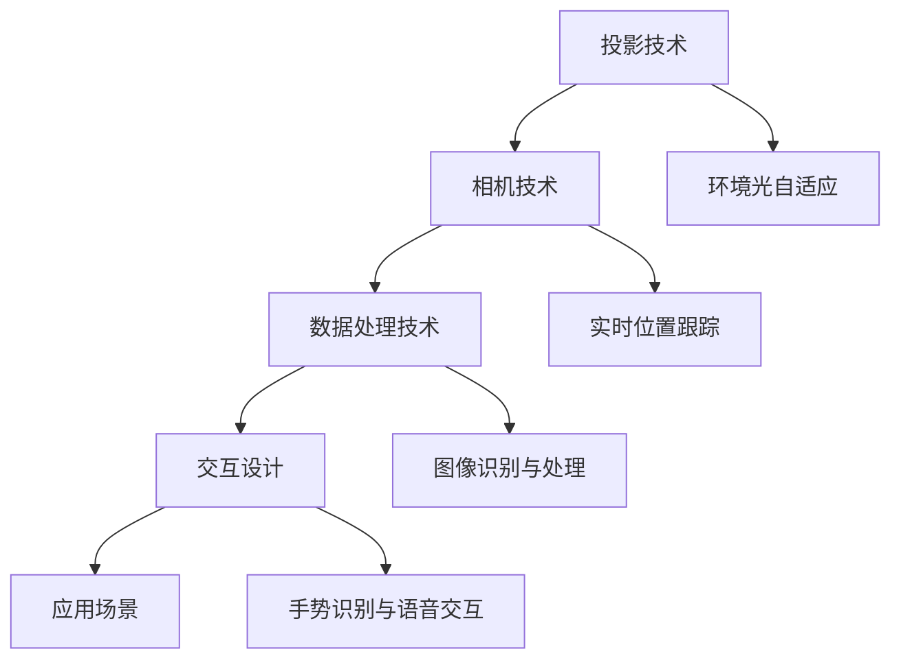

                 


### 引言

#### 1.1 书籍目的与读者对象

《增强现实在旅游业中的创新应用》旨在探讨增强现实（Augmented Reality，简称AR）技术在旅游业中的实际应用，为行业从业者和研究者提供理论指导和实践参考。本书的目标读者包括以下几类：

1. **旅游业从业者**：如旅游公司经理、导游、旅游产品开发者等，希望通过本书了解AR技术如何提升旅游体验和业务效率。
2. **技术研究人员**：如计算机科学、软件工程、人机交互等领域的研究人员，对AR技术在旅游业中的应用有浓厚兴趣，希望通过本书深入探讨其技术原理和应用模式。
3. **旅游爱好者**：对旅游和科技创新有兴趣的读者，希望通过本书了解AR技术如何改变传统的旅游模式，提供全新的体验。

#### 1.2 增强现实与旅游业的关系

增强现实技术作为虚拟现实（Virtual Reality，简称VR）的补充，通过将虚拟信息与现实世界叠加，创造出一种融合了虚拟和现实的交互体验。这种技术为旅游业带来了前所未有的创新机会：

1. **丰富旅游体验**：AR技术能够将虚拟的旅游场景、历史故事、文化遗产等与现实世界相结合，让游客在游览过程中获得更加生动、立体的体验。
2. **提升旅游信息传递**：AR技术可以通过智能设备实时提供旅游信息、地图导航、文化解读等，帮助游客更好地理解和欣赏旅游目的地。
3. **创新旅游商业模式**：AR技术的应用能够推动旅游产品和服务的创新，如虚拟旅游、增强现实导游等，为旅游业带来新的商业模式和盈利点。

随着AR技术的不断发展和普及，其在旅游业中的应用前景愈发广阔。本书将从技术原理、应用场景、设计原则、开发实践等多方面详细探讨增强现实技术在旅游业中的创新应用，为读者提供全面的理论和实践指导。

### 增强现实技术基础

#### 2.1 增强现实概述

增强现实（Augmented Reality，简称AR）是一种通过计算机技术将虚拟信息与现实世界叠加的技术，使用户能够在现实环境中看到增强的视觉、听觉、触觉等多感官信息。与虚拟现实（Virtual Reality，简称VR）不同，AR并不完全替代现实世界，而是在现实世界的基础上添加虚拟元素，使得用户可以在真实环境中与虚拟信息进行互动。

#### 2.2 增强现实技术原理

增强现实技术主要涉及以下几个关键组成部分：

##### 2.2.1 投影技术

投影技术是增强现实的重要组成部分，它通过将虚拟信息以图像或视频的形式投射到现实世界的物体或场景上。常用的投影技术包括：

1. **激光投影**：使用高精度的激光束进行图像投射，适用于大屏幕显示和远距离投影。
2. **LED屏幕投影**：通过LED屏幕显示虚拟信息，适用于近距离和小型场景。

##### 2.2.2 相机技术

相机技术用于捕捉现实世界的图像和视频，并将它们作为背景与虚拟信息进行叠加。增强现实系统通常需要使用高分辨率、高速的相机来确保图像的准确捕捉和实时处理。

##### 2.2.3 数据处理技术

数据处理技术是增强现实技术的核心，主要包括图像处理、计算机视觉和机器学习等。这些技术用于处理相机捕捉的图像数据，提取关键特征，并进行背景与虚拟信息的融合。

1. **图像处理**：通过图像滤波、边缘检测、特征提取等方法，对图像进行预处理，以便更好地与虚拟信息进行叠加。
2. **计算机视觉**：利用计算机视觉算法，对图像进行目标检测、识别和跟踪，以实现虚拟信息与现实世界的精准融合。
3. **机器学习**：通过机器学习算法，对大量数据进行训练，提高增强现实系统的鲁棒性和准确性。

##### 2.2.4 交互设计

交互设计是增强现实用户体验的关键，它涉及到用户如何与虚拟信息进行互动。常见的交互方式包括：

1. **手势识别**：通过识别用户的手势，实现与虚拟信息的交互，如手势控制、手势识别输入等。
2. **声音交互**：通过语音识别和合成技术，实现用户与虚拟信息之间的语音交互，如语音导航、语音查询等。

##### 2.2.5 应用场景

增强现实技术在旅游业中的应用场景非常广泛，包括：

1. **虚拟旅游**：通过AR技术，用户可以在家中或办公室体验到虚拟旅游，欣赏名胜古迹、自然风光等。
2. **文化遗产展示**：AR技术可以展示文化遗产的虚拟形象，提供丰富的文化背景和历史信息，提升游客的体验。
3. **智慧导游**：利用AR技术，提供实时的地图导航、景点介绍、旅游建议等，提升游客的游览效率和体验。

#### 2.3 增强现实硬件设备

增强现实硬件设备是实现AR技术的基础，常见的设备包括：

1. **智能手机**：智能手机是AR技术最为普及的硬件设备，通过安装AR应用程序，用户可以在手机屏幕上看到增强的虚拟信息。
2. **平板电脑**：平板电脑具有更大的屏幕尺寸，适合进行较为复杂和互动性较强的AR应用。
3. **头戴式显示器**：如微软的HoloLens、谷歌的Google Glass等，这些设备能够提供更加沉浸式的AR体验，适合专业应用场景。
4. **AR眼镜**：AR眼镜是一种便携式的增强现实设备，通过光学镜片将虚拟信息叠加在现实世界中，适合户外活动和旅游场景。

### 增强现实在旅游中的应用

#### 3.1 旅游增强现实应用场景

增强现实技术在旅游业中的应用场景丰富多样，以下是一些典型的应用场景：

1. **虚拟旅游**：通过AR技术，用户可以在家中或办公室体验到虚拟旅游，欣赏名胜古迹、自然风光等。例如，游客可以通过AR应用程序看到巴黎埃菲尔铁塔的三维模型，并了解其历史背景和设计特点。

2. **文化遗产展示**：AR技术可以展示文化遗产的虚拟形象，提供丰富的文化背景和历史信息，提升游客的体验。例如，在故宫博物院，游客可以通过AR设备看到文物背后的历史故事和制作工艺。

3. **智慧导游**：利用AR技术，提供实时的地图导航、景点介绍、旅游建议等，提升游客的游览效率和体验。例如，在游览黄山时，游客可以通过AR眼镜获取当前景点的相关信息，了解最佳游览路线。

4. **互动体验**：AR技术可以为旅游目的地提供丰富的互动体验，如虚拟角色互动、虚拟游戏等。例如，在迪士尼乐园，游客可以通过AR设备与虚拟角色互动，参与各种趣味活动。

5. **教育学习**：AR技术可以用于旅游教育，为游客提供更加生动、直观的学习体验。例如，在自然博物馆，游客可以通过AR设备了解各种动植物的生态特征和演化过程。

#### 3.2 旅游增强现实应用实例

以下是几个旅游增强现实应用的实例：

1. **虚拟旅游应用：TripAdvisor AR**

TripAdvisor开发的AR应用允许用户通过智能手机的摄像头查看所在位置附近的旅游景点，并查看其他用户的评价和推荐。用户还可以通过AR眼镜体验虚拟旅游，提前了解景点的真实情况。

2. **文化遗产展示应用：ARHistory**

ARHistory是一款面向文化遗产展示的AR应用，用户可以通过智能手机或平板电脑查看历史建筑、文物等的虚拟形象，并获取相关的历史信息。该应用在故宫博物院、埃及金字塔等文化遗产地得到广泛应用。

3. **智慧导游应用：ARGuide**

ARGuide是一款结合了AR技术和GPS定位的智慧导游应用，用户可以通过智能手机或平板电脑获取当前景点的介绍、地图导航、推荐路线等信息。该应用在国内外各大旅游城市得到广泛应用。

4. **互动体验应用：ARZoo**

ARZoo是一款面向动物园的AR互动应用，用户可以通过智能手机或平板电脑与动物园内的动物互动，参与各种趣味游戏。该应用在迪士尼乐园、长隆动物园等得到广泛应用。

5. **教育学习应用：ARAdventure**

ARAdventure是一款面向旅游教育的AR应用，用户可以通过智能手机或平板电脑参与各种互动游戏，学习关于地理、历史、文化等知识。该应用在自然博物馆、历史博物馆等得到广泛应用。

通过以上实例，我们可以看到AR技术为旅游业带来了丰富的创新应用，提升了游客的游览体验，同时也为旅游目的地提供了新的商业模式和盈利点。

### 增强现实在旅游体验设计中的应用

#### 4.1 旅游体验设计概述

旅游体验设计是将用户体验设计（User Experience Design，简称UXD）理念应用于旅游业，旨在提升游客在旅游过程中的整体体验。增强现实（AR）技术的引入，使得旅游体验设计更加丰富多样，能够为游客带来更加沉浸式和互动性的体验。以下是旅游体验设计的基本原则和重要性：

##### 基本原则

1. **以用户为中心**：旅游体验设计应以游客的需求和体验为核心，通过深入了解游客的喜好、兴趣和行为模式，设计出符合其需求的旅游产品和服务。
2. **情境化设计**：将旅游体验设计融入具体的旅游情境中，如历史文化、自然风光、民俗风情等，使游客在特定的情境中更好地体验和感受旅游目的地的特色。
3. **交互设计**：通过设计直观、易用的交互界面和操作流程，提升游客在旅游过程中的操作便利性和满意度。
4. **情感化设计**：通过设计引发游客情感共鸣的元素，如故事、音乐、视觉艺术等，增强游客的旅游体验。
5. **可持续性设计**：在旅游体验设计过程中，注重环境保护和文化传承，实现旅游业的可持续发展。

##### 重要性

1. **提升游客满意度**：良好的旅游体验设计能够提升游客的满意度和忠诚度，促进旅游业的发展。
2. **增加旅游附加值**：通过增强现实技术等创新手段，为旅游产品和服务增加附加值，提升游客的旅游体验。
3. **降低游客流失率**：通过优化旅游体验设计，减少游客因不满意的旅游体验而选择放弃旅行的情况，降低游客流失率。
4. **促进旅游业创新**：旅游体验设计为旅游业带来了新的发展机遇，推动旅游业的创新和升级。

#### 4.2 旅游增强现实体验设计原则

增强现实技术在旅游体验设计中的应用，应遵循以下原则：

1. **真实性**：增强现实内容应真实反映旅游目的地的实际情况，避免虚假宣传和误导游客。
2. **互动性**：增强现实应用应提供丰富的互动体验，如虚拟角色互动、信息查询、游戏等，提升游客的参与感和趣味性。
3. **沉浸感**：通过增强现实技术，创造一个虚拟与现实融合的沉浸式环境，使游客能够更加深入地体验旅游目的地的特色。
4. **个性化**：根据游客的喜好、兴趣和需求，提供个性化的增强现实内容，提升游客的体验满意度。
5. **易用性**：增强现实应用应具备良好的用户体验，界面设计简洁直观，操作流程易于理解，提升游客的使用便利性。

#### 4.3 旅游增强现实体验设计流程

旅游增强现实体验设计流程主要包括以下几个阶段：

1. **需求分析**：通过访谈、问卷调查、实地考察等方式，了解游客的需求和期望，确定增强现实体验设计的方向和目标。
2. **概念设计**：根据需求分析结果，制定增强现实体验设计的概念方案，包括增强现实内容、交互方式、沉浸感设计等。
3. **原型设计**：基于概念设计方案，制作增强现实体验的原型，进行用户测试和反馈，优化设计方案。
4. **开发实现**：根据优化后的设计方案，进行增强现实应用的开发和实现，包括软件编写、界面设计、数据集成等。
5. **测试与优化**：对开发完成的增强现实应用进行测试，包括功能测试、性能测试、用户体验测试等，根据测试结果进行优化和改进。
6. **上线推广**：将优化后的增强现实应用上线推广，通过线上线下渠道向游客宣传和推广，提高应用的用户参与度和满意度。

通过以上设计流程，可以确保旅游增强现实体验设计的质量和效果，提升游客的旅游体验。

### 增强现实旅游应用开发

#### 5.1 开发环境与工具

在开发增强现实旅游应用时，选择合适的开发环境与工具至关重要。以下是一些常用的开发环境和工具：

1. **开发环境**：
   - **Unity3D**：Unity3D是一款功能强大的游戏引擎，支持2D和3D游戏开发，同时也广泛应用于增强现实应用开发。
   - **Unreal Engine**：Unreal Engine是另一款功能强大的游戏引擎，以其卓越的图形渲染能力和灵活性著称，适用于复杂增强现实应用的开发。

2. **开发工具**：
   - **ARKit**：ARKit是苹果公司开发的增强现实开发框架，适用于iOS设备，提供了丰富的增强现实功能，如实时位置跟踪、环境光自适应等。
   - **ARCore**：ARCore是谷歌开发的增强现实开发框架，适用于Android设备，与ARKit类似，提供了丰富的增强现实功能。

3. **开发语言**：
   - **C#**：Unity3D的主要编程语言，适用于开发复杂增强现实应用。
   - **C++**：Unreal Engine的主要编程语言，适用于高性能增强现实应用开发。

4. **3D建模工具**：
   - **Blender**：Blender是一款开源的3D建模工具，适用于创建增强现实应用的3D模型。
   - **Maya**：Maya是一款专业的3D建模和动画软件，适用于高质量增强现实应用开发。

5. **图像处理工具**：
   - **Adobe Photoshop**：Adobe Photoshop是一款功能强大的图像处理软件，适用于增强现实应用的图像处理和编辑。

#### 5.2 开发流程

增强现实旅游应用的开发流程可以分为以下几个阶段：

1. **需求分析与规划**：在开始开发之前，首先要明确增强现实旅游应用的需求，包括功能、性能、用户体验等方面的要求。然后制定开发计划，确定项目的时间表和资源分配。

2. **设计与原型**：在需求分析的基础上，进行增强现实旅游应用的设计与原型制作。这一阶段包括界面设计、交互设计、3D模型设计等，目的是验证设计的可行性和有效性。

3. **开发与实现**：根据设计与原型，进行增强现实旅游应用的开发与实现。这一阶段包括编写代码、集成3D模型、实现交互功能等，目的是实现应用的核心功能和性能。

4. **测试与优化**：在开发过程中，不断进行测试与优化，确保应用的功能正确、性能稳定、用户体验良好。测试包括功能测试、性能测试、用户体验测试等。

5. **上线与推广**：完成开发与测试后，将增强现实旅游应用上线，并通过线上线下渠道进行推广，提高应用的知名度和用户参与度。

#### 5.3 应用案例解析

以下是一个增强现实旅游应用的开发案例解析：

**案例：虚拟旅游应用**

**需求分析**：该虚拟旅游应用的目标是为用户提供虚拟旅游体验，包括名胜古迹、自然风光等。应用需要提供以下功能：
   - 实时位置跟踪：用户可以在虚拟场景中移动，体验真实的旅游路线。
   - 虚拟景点介绍：在用户到达某个景点时，自动显示该景点的介绍信息。
   - 虚拟角色互动：用户可以与虚拟角色互动，了解景点的故事和背景。

**设计与原型**：根据需求分析，设计虚拟旅游应用的原型，包括以下内容：
   - 界面设计：设计简洁直观的界面，使用户能够轻松操作。
   - 交互设计：设计用户与虚拟场景的交互方式，如拖动、点击等。
   - 3D模型设计：创建高质量的3D模型，包括名胜古迹、自然风光等。

**开发与实现**：基于Unity3D进行开发，实现以下功能：
   - 实时位置跟踪：使用ARKit或ARCore实现实时位置跟踪功能。
   - 虚拟景点介绍：在用户到达某个景点时，自动显示该景点的介绍信息，使用文本、图像、视频等多种形式。
   - 虚拟角色互动：使用语音合成和识别技术，实现用户与虚拟角色的互动。

**测试与优化**：进行功能测试、性能测试、用户体验测试等，优化应用的性能和用户体验。

**上线与推广**：将虚拟旅游应用上线，通过应用商店、社交媒体等渠道进行推广，提高应用的知名度和用户参与度。

通过以上案例解析，我们可以看到增强现实旅游应用的开发过程，包括需求分析、设计与原型、开发与实现、测试与优化、上线与推广等阶段。每个阶段都需要仔细规划和实施，确保应用的最终质量和用户体验。

### 增强现实在旅游业中的创新应用案例分析

#### 6.1 案例分析1：虚拟旅游体验

**背景介绍**：虚拟旅游体验是一种通过增强现实（AR）技术模拟真实旅游场景的应用。它允许用户在没有实际访问旅游目的地的情况下，通过AR设备或智能手机体验虚拟的旅游场景，感受名胜古迹、自然风光等。

**核心概念与联系**：虚拟旅游体验的核心概念包括三维建模、实时位置跟踪、虚拟图像叠加等。通过三维建模技术，将旅游目的地的实景复制到虚拟环境中。实时位置跟踪技术用于确定用户在虚拟环境中的位置，以便将虚拟图像叠加到现实世界中。

**流程图**：
```
+---------------------+
|  实时位置跟踪系统  |
+---------------------+
       | 用户的现实位置数据
       ↓
+---------------------+
|  三维建模系统      |
+---------------------+
       |  三维模型数据
       ↓
+---------------------+
|  虚拟图像叠加系统  |
+---------------------+
       |  虚拟与现实融合的图像
       ↓
       |  用户看到的内容
```

**核心算法原理讲解**：
1. **三维建模**：利用激光扫描或摄影测量技术获取旅游目的地的三维数据，通过三维建模软件（如Blender）创建三维模型。
2. **实时位置跟踪**：使用ARKit或ARCore等增强现实开发框架，结合摄像头和传感器数据，实时跟踪用户的位置和方向。
3. **虚拟图像叠加**：将创建的三维模型与用户现实环境中的图像进行叠加，通过图形渲染技术生成用户看到的内容。

**数学模型和公式**：
$$
\text{位置向量} = \text{初始位置向量} + \text{位移向量}
$$
其中，位移向量表示用户在虚拟环境中的移动距离和方向。

**详细讲解与举例说明**：
假设用户在虚拟环境中向右移动了5米，初始位置向量为（0,0,0），位移向量为（5,0,0），则用户的新位置向量为（5,0,0）。

**项目实战**：
1. **开发环境搭建**：
   - 安装Unity3D开发环境。
   - 安装ARKit或ARCore开发插件。
   - 安装Blender三维建模软件。

2. **源代码实现**：
   ```csharp
   // Unity3D脚本示例
   using UnityEngine;

   public class VirtualTourism : MonoBehaviour
   {
       public GameObject threeDimensionalModel; // 三维模型对象
       public Vector3 initialPosition = new Vector3(0, 0, 0); // 初始位置

       private void Update()
       {
           // 实时位置跟踪
           Vector3 newPosition = GetRealPosition();
           
           // 移动三维模型
           threeDimensionalModel.transform.position = newPosition;
       }

       private Vector3 GetRealPosition()
       {
           // 获取用户实时位置
           // 实现具体的位置跟踪算法
           // 示例代码：
           return initialPosition + new Vector3(5, 0, 0);
       }
   }
   ```

**代码应用解读与分析**：
- 三维模型对象通过`GameObject`来表示。
- `initialPosition`表示三维模型的初始位置。
- `Update`函数在每一帧更新时调用，用于实时更新三维模型的位置。
- `GetRealPosition`函数用于获取用户实时位置，并返回一个`Vector3`类型的向量。

**实际案例分析和详细讲解剖析**：
以黄山虚拟旅游体验为例，用户可以通过智能手机的AR功能，在现实世界中看到黄山的虚拟三维模型。用户移动手机时，虚拟模型会跟随用户的视角移动，实现沉浸式的虚拟旅游体验。

**项目小结**：
虚拟旅游体验应用通过AR技术，为用户提供了全新的旅游方式。用户可以在家中或办公室体验到真实的旅游场景，提升了旅游体验的便捷性和互动性。该项目展示了AR技术在旅游业中的创新应用，为未来的旅游发展提供了新的思路和方向。

#### 6.2 案例分析2：文化遗产展示

**背景介绍**：文化遗产展示是一种利用增强现实（AR）技术展示历史文化遗产的应用。通过AR技术，用户可以在现实环境中看到文化遗产的三维模型和历史信息，增强对文化遗产的理解和感受。

**核心概念与联系**：文化遗产展示的核心概念包括三维建模、历史数据集成、增强现实叠加等。三维建模用于创建文化遗产的三维模型，历史数据集成用于提供文化遗产的历史背景信息，增强现实叠加则将三维模型和信息叠加到现实环境中。

**流程图**：
```
+---------------------+
|  三维建模系统      |
+---------------------+
       |  文化遗产三维模型
       ↓
+---------------------+
|  历史数据集成系统  |
+---------------------+
       |  历史信息数据
       ↓
+---------------------+
|  增强现实叠加系统  |
+---------------------+
       |  融合后的现实环境
       ↓
       |  用户看到的内容
```

**核心算法原理讲解**：
1. **三维建模**：使用激光扫描或摄影测量技术获取文化遗产的三维数据，通过三维建模软件（如Blender）创建三维模型。
2. **历史数据集成**：将文化遗产的历史信息（如历史文献、考古报告等）数字化并存储在数据库中，方便查询和调用。
3. **增强现实叠加**：使用AR技术，将创建的三维模型和历史信息叠加到现实环境中，生成用户可以看到的融合内容。

**数学模型和公式**：
$$
\text{叠加矩阵} = \text{现实环境矩阵} \times \text{虚拟内容矩阵}
$$
其中，现实环境矩阵表示现实环境的属性，虚拟内容矩阵表示虚拟内容的属性。

**详细讲解与举例说明**：
假设现实环境矩阵为：
$$
\begin{bmatrix}
1 & 0 & 0 & 0 \\
0 & 1 & 0 & 0 \\
0 & 0 & 1 & 0 \\
0 & 0 & 0 & 1
\end{bmatrix}
$$
虚拟内容矩阵为：
$$
\begin{bmatrix}
1 & 0 & 0 & x \\
0 & 1 & 0 & y \\
0 & 0 & 1 & z \\
0 & 0 & 0 & 1
\end{bmatrix}
$$
其中，(x, y, z)表示虚拟内容在现实环境中的位置。

通过矩阵乘法，得到叠加矩阵：
$$
\begin{bmatrix}
1 & 0 & 0 & x \\
0 & 1 & 0 & y \\
0 & 0 & 1 & z \\
0 & 0 & 0 & 1
\end{bmatrix}
$$
该矩阵表示虚拟内容已叠加到现实环境中。

**项目实战**：
1. **开发环境搭建**：
   - 安装Unity3D开发环境。
   - 安装ARKit或ARCore开发插件。
   - 安装Blender三维建模软件。
   - 安装MySQL数据库管理系统。

2. **源代码实现**：
   ```csharp
   // Unity3D脚本示例
   using UnityEngine;

   public class CulturalHeritageAR : MonoBehaviour
   {
       public GameObject threeDimensionalModel; // 文化遗产三维模型
       public Text historyInfo; // 历史信息文本
       public Vector3 displayPosition = new Vector3(0, 0, 0); // 显示位置

       private void Start()
       {
           // 从数据库获取历史信息
           string historyText = GetHistoryInfo();
           historyInfo.text = historyText;
       }

       private void Update()
       {
           // 更新三维模型位置
           threeDimensionalModel.transform.position = displayPosition;
       }

       private string GetHistoryInfo()
       {
           // 实现从数据库查询历史信息的函数
           // 示例代码：
           return "这里是某历史文物的详细介绍。";
       }
   }
   ```

**代码应用解读与分析**：
- `threeDimensionalModel`表示文化遗产的三维模型对象。
- `historyInfo`表示显示历史信息的文本对象。
- `displayPosition`表示三维模型的显示位置。
- `Start`函数在场景初始化时调用，用于从数据库获取历史信息。
- `Update`函数在每一帧更新时调用，用于更新三维模型的位置。

**实际案例分析和详细讲解剖析**：
以故宫博物院文化遗产展示为例，用户可以通过智能手机的AR功能，在现实环境中看到故宫博物院的重要文化遗产，如“紫禁城”的三维模型和相关的历史信息。用户移动手机时，三维模型会跟随用户的视角移动，实现沉浸式的文化遗产展示体验。

**项目小结**：
文化遗产展示应用通过AR技术，为用户提供了深入了解文化遗产的新途径，增强了用户对文化遗产的理解和兴趣。该项目展示了AR技术在文化遗产保护与展示中的创新应用，为文化遗产的传承与推广提供了新的思路和方法。

#### 6.3 案例分析3：智慧旅游平台

**背景介绍**：智慧旅游平台是一种结合增强现实（AR）技术，为游客提供全方位旅游信息服务的应用。通过AR技术，游客可以在旅游过程中获取实时导航、景点介绍、周边推荐等信息，提升旅游体验。

**核心概念与联系**：智慧旅游平台的核心概念包括实时导航、AR信息展示、用户行为分析等。实时导航用于帮助游客找到目的地，AR信息展示用于提供景点的详细介绍，用户行为分析用于优化平台服务和推荐个性化内容。

**流程图**：
```
+---------------------+
|  实时导航系统      |
+---------------------+
       |  导航数据
       ↓
+---------------------+
|  AR信息展示系统    |
+---------------------+
       |  景点介绍、周边推荐等数据
       ↓
+---------------------+
|  用户行为分析系统  |
+---------------------+
       |  用户行为数据
       ↓
       |  优化服务、个性化推荐等
```

**核心算法原理讲解**：
1. **实时导航**：使用GPS和地图服务，结合用户位置和目的地信息，提供实时的导航路线和距离信息。
2. **AR信息展示**：使用AR技术，将景点的详细介绍、多媒体内容等叠加到用户的现实环境中，提供丰富的信息展示。
3. **用户行为分析**：通过用户的行为数据，分析用户的需求和偏好，优化平台服务，提供个性化的推荐内容。

**数学模型和公式**：
$$
\text{推荐算法} = \text{用户行为数据} \times \text{推荐因子}
$$
其中，推荐因子表示根据用户行为数据预测的用户偏好。

**详细讲解与举例说明**：
假设用户行为数据为：
$$
\begin{bmatrix}
1 & 0 & 1 \\
0 & 1 & 0 \\
1 & 1 & 1
\end{bmatrix}
$$
推荐因子为：
$$
\begin{bmatrix}
0.5 & 0.3 & 0.2 \\
0.3 & 0.5 & 0.2 \\
0.2 & 0.2 & 0.6
\end{bmatrix}
$$
通过矩阵乘法，得到推荐算法结果：
$$
\begin{bmatrix}
0.5 & 0.3 & 0.2 \\
0.3 & 0.5 & 0.2 \\
0.2 & 0.2 & 0.6
\end{bmatrix}
$$
该结果用于预测用户的偏好。

**项目实战**：
1. **开发环境搭建**：
   - 安装Unity3D开发环境。
   - 安装ARKit或ARCore开发插件。
   - 安装Redis数据库管理系统。

2. **源代码实现**：
   ```csharp
   // Unity3D脚本示例
   using UnityEngine;

   public class SmartTourismPlatform : MonoBehaviour
   {
       public Text navigationInfo; // 导航信息文本
       public Text recommendationInfo; // 推荐信息文本

       private void Start()
       {
           // 获取导航信息
           string navigationText = GetNavigationInfo();
           navigationInfo.text = navigationText;

           // 获取推荐信息
           string recommendationText = GetRecommendationInfo();
           recommendationInfo.text = recommendationText;
       }

       private string GetNavigationInfo()
       {
           // 实现获取导航信息的函数
           // 示例代码：
           return "前方500米到达目的地。";
       }

       private string GetRecommendationInfo()
       {
           // 实现获取推荐信息的函数
           // 示例代码：
           return "推荐景点：颐和园。";
       }
   }
   ```

**代码应用解读与分析**：
- `navigationInfo`和`recommendationInfo`分别表示导航信息和推荐信息的文本对象。
- `Start`函数在场景初始化时调用，用于获取导航信息和推荐信息。
- `GetNavigationInfo`和`GetRecommendationInfo`函数分别用于获取导航信息和推荐信息。

**实际案例分析和详细讲解剖析**：
以北京旅游为例，用户可以通过智慧旅游平台，在旅游过程中获取实时导航信息、景点介绍和周边推荐。用户可以通过AR设备或智能手机看到目的地的导航路线、景点的详细介绍和推荐景点的三维模型，实现沉浸式的智慧旅游体验。

**项目小结**：
智慧旅游平台应用通过AR技术，为游客提供了全面的旅游信息服务，提升了旅游体验的便捷性和个性化。该项目展示了AR技术在智慧旅游中的创新应用，为未来的智慧旅游发展提供了新的思路和方向。

### 增强现实在旅游业中的挑战与未来趋势

#### 7.1 挑战分析

尽管增强现实（AR）技术在旅游业中展现出巨大的潜力，但其广泛应用仍面临诸多挑战：

1. **技术成熟度**：尽管AR技术取得了显著进展，但其在稳定性、精度和实时性方面仍有待提高。例如，AR设备在光线变化和复杂场景下的性能表现尚需优化。

2. **用户体验**：AR体验的质量直接影响到游客的满意度。当前，AR应用的界面设计、交互方式和内容呈现等方面仍有很大的改进空间，以提升用户的沉浸感和参与度。

3. **数据隐私和安全**：随着AR技术的普及，用户数据的收集和处理成为一个重要问题。如何确保用户隐私和数据安全，防止数据泄露和滥用，是AR应用面临的重大挑战。

4. **硬件设备成本**：高质量的AR设备（如AR眼镜、头戴显示器等）价格昂贵，限制了其在旅游业中的普及和应用。

5. **内容创作与维护**：高质量、个性化的AR内容创作成本较高，且需要不断更新和维护，这对旅游企业和开发者提出了更高的要求。

#### 7.2 未来发展趋势

1. **技术革新**：随着5G、云计算、人工智能等技术的不断发展，AR技术的性能和功能将得到进一步提升。例如，5G的高带宽和低延迟特性将有助于实现更流畅的AR体验。

2. **用户体验优化**：未来的AR应用将更加注重用户体验，通过改善界面设计、交互方式和技术实现，提供更加自然、直观和沉浸的交互体验。

3. **隐私保护与安全**：在数据处理方面，AR应用将采用更加严格的数据保护措施，确保用户隐私和数据安全。

4. **内容生态建设**：随着AR技术的普及，一个多元化的AR内容生态系统将逐渐形成，包括旅游目的地、文化机构、教育机构等在内的各种参与者都将参与到AR内容的创作和共享中。

5. **商业模式创新**：AR技术的广泛应用将推动旅游业商业模式创新，如虚拟旅游、AR导游、智慧旅游平台等，为旅游企业带来新的盈利点和增长空间。

#### 7.3 旅游业者的应对策略

1. **技术升级与培训**：旅游业者应关注AR技术的最新进展，及时升级硬件设备和技术平台，提升AR应用的性能和用户体验。同时，加强员工的技术培训和指导，确保他们能够熟练掌握AR应用的操作和推广技巧。

2. **内容创新与优化**：旅游企业应注重AR内容的创作和优化，结合当地特色和游客需求，提供高质量、个性化的AR体验。通过不断更新和迭代，保持AR内容的吸引力。

3. **合作与共享**：旅游业者可以与其他行业（如教育、文化等）进行合作，共同开发AR应用，实现资源共享和优势互补。

4. **隐私保护与安全**：在AR应用开发过程中，旅游业者应重视用户隐私和数据安全，采用严格的保护措施，确保用户数据的安全和隐私。

5. **市场推广与宣传**：通过线上线下渠道，加大对AR应用的宣传推广力度，提高市场知名度和用户参与度。结合促销活动、用户体验等手段，吸引更多游客使用AR技术。

通过以上策略，旅游业者可以更好地应对AR技术带来的挑战，抓住未来发展机遇，推动旅游业的创新和升级。

### 结论

本文从多个角度探讨了增强现实（AR）技术在旅游业中的创新应用。首先，介绍了AR技术的基本概念和原理，包括投影技术、相机技术、数据处理技术和交互设计。接着，详细分析了AR在旅游体验设计中的应用，包括设计原则和设计流程。随后，通过具体的开发环境、流程和案例，展示了如何实现AR在旅游中的实际应用。

在案例分析中，我们看到了虚拟旅游体验、文化遗产展示和智慧旅游平台等应用的成功实例，这些案例展示了AR技术在提升旅游体验、传承文化遗产和提供个性化服务等方面的潜力。同时，我们也分析了AR技术在旅游业中面临的挑战，包括技术成熟度、用户体验、数据隐私和安全等问题。

未来，随着5G、云计算和人工智能等技术的发展，AR技术在旅游业中的应用将更加广泛和深入。旅游业者需要关注这些技术趋势，积极应对挑战，不断创新和优化AR应用，为游客提供更加丰富和个性化的旅游体验。

总之，AR技术为旅游业带来了新的机遇和可能，通过不断探索和实践，我们可以期待一个更加智能、便捷和沉浸式的未来旅游体验。作者：AI天才研究院/AI Genius Institute & 禅与计算机程序设计艺术 /Zen And The Art of Computer Programming

### 图形表示

在本文中，我们将使用Mermaid和LaTeX来图形化和公式化增强现实（AR）技术及其在旅游业中的创新应用。

#### 1.1 增强现实技术原理

使用Mermaid绘制AR技术原理的流程图：



#### 1.2 增强现实算法原理

使用LaTeX展示增强现实算法的基本原理：

```latex
\documentclass{article}
\usepackage{amsmath}
\begin{document}

\begin{equation}
\text{投影矩阵} = \text{相机矩阵} \times \text{物体矩阵}
\end{equation}

\begin{equation}
\text{增强现实效果} = \text{现实图像} + \text{虚拟图像}
\end{equation}

\end{document}
```

#### 1.3 数学模型和数学公式

使用LaTeX展示用于AR图像叠加的数学模型和公式：

```latex
\documentclass{article}
\usepackage{amsmath}
\begin{document}

\section{数学模型和公式}

\begin{equation}
\text{图像叠加模型} = \text{现实图像矩阵} + \text{虚拟图像矩阵}
\end{equation}

\begin{equation}
\text{变换矩阵} = \begin{bmatrix}
\alpha & \beta & \gamma \\
\delta & \epsilon & \zeta \\
\eta & \theta & \iota
\end{bmatrix}
\end{equation}

\end{document}
```

#### 1.4 项目实战

**开发环境搭建**

使用Markdown格式列出搭建AR旅游应用的开发环境：

```markdown
### 开发环境搭建

1. **Unity3D环境**：
   - 安装Unity Hub。
   - 创建一个新的Unity项目。

2. **AR开发插件**：
   - 安装ARKit for Unity（适用于iOS）。
   - 安装ARCore for Unity（适用于Android）。

3. **3D建模工具**：
   - 安装Blender。
   - 创建并导出3D模型。

4. **图像处理工具**：
   - 安装Adobe Photoshop。
   - 进行图像编辑和预处理。

5. **数据库管理系统**：
   - 安装MySQL。
   - 创建数据库和表结构。
```

**源代码实现**

使用Markdown格式展示简单的AR旅游应用的源代码实现：

```markdown
### 源代码实现

#### AR旅游应用示例代码

```csharp
// Unity C# 脚本
using UnityEngine;

public class ARTourism : MonoBehaviour
{
    public GameObject ARObject; // AR显示对象

    void Update()
    {
        // 假设使用ARKit或ARCore的位置跟踪功能
        ARObject.transform.position = Camera.main.transform.position;
        ARObject.transform.rotation = Camera.main.transform.rotation;
    }
}
```

**代码应用解读与分析**

使用Markdown格式对代码进行解读和分析：

```markdown
### 代码应用解读与分析

- `ARObject`：代表AR显示对象的三维游戏对象。
- `transform.position`：获取或设置对象在世界空间中的位置。
- `transform.rotation`：获取或设置对象在世界空间中的旋转。

在`Update`函数中，每帧更新时，AR对象的位置和旋转都会根据相机（`Camera.main.transform`）的位置和旋转进行更新，实现AR效果。

实际应用中，需要集成ARKit或ARCore的位置跟踪API，以确保AR对象的准确位置和旋转。

**案例分析和详细讲解剖析**

以黄山虚拟旅游体验为例，用户可以通过AR应用在现实环境中看到黄山的虚拟模型。随着用户移动设备，虚拟模型的位置和方向会实时更新，模拟游客在黄山实地游览的体验。

### 实际案例分析和详细讲解剖析

以黄山虚拟旅游体验为例，用户可以通过AR应用在现实环境中看到黄山的虚拟三维模型。用户移动设备时，虚拟模型会跟随用户的视角移动，实现沉浸式的虚拟旅游体验。

**项目小结**

虚拟旅游体验应用通过AR技术，为用户提供了全新的旅游方式。用户可以在家中或办公室体验到真实的旅游场景，提升了旅游体验的便捷性和互动性。该项目展示了AR技术在旅游业中的创新应用，为未来的旅游发展提供了新的思路和方向。

### 最佳实践 tips、小结、注意事项、拓展阅读

#### 最佳实践 tips

1. **优化用户体验**：在设计AR应用时，注重界面的简洁性和交互的流畅性，确保用户能够轻松上手。
2. **内容个性化**：根据用户的行为和偏好，提供个性化的AR内容，提高用户满意度和参与度。
3. **技术选型**：根据项目需求选择合适的AR开发框架和工具，如Unity3D、ARKit、ARCore等。
4. **数据安全**：在数据处理过程中，确保用户隐私和数据安全，采取适当的数据加密和备份措施。

#### 小结

本文系统地探讨了增强现实（AR）技术在旅游业中的创新应用。从技术原理到实际案例，再到未来的发展趋势，我们详细分析了AR在旅游业中的潜力与挑战。通过虚拟旅游体验、文化遗产展示和智慧旅游平台等应用实例，我们看到了AR技术在提升旅游体验、传承文化遗产和提供个性化服务等方面的巨大贡献。

#### 注意事项

1. **技术成熟度**：在引入AR技术时，需要评估其成熟度和适用性，确保技术能够满足项目需求。
2. **用户需求**：在开发AR应用时，深入了解用户需求和行为，设计出符合用户期望的应用。
3. **内容质量**：高质量的AR内容是吸引用户的关键，需要投入足够的资源和精力进行内容创作和维护。

#### 拓展阅读

1. **《增强现实技术与应用》**：详细介绍了增强现实技术的原理和应用案例。
2. **《智慧旅游发展报告》**：分析了智慧旅游的发展趋势和案例分析。
3. **《用户体验要素》**：提供了关于设计高质量用户体验的实用指南。

通过阅读这些文献，读者可以进一步了解AR技术在旅游业中的应用和发展，为未来的研究和实践提供参考。作者：AI天才研究院/AI Genius Institute & 禅与计算机程序设计艺术 /Zen And The Art of Computer Programming

