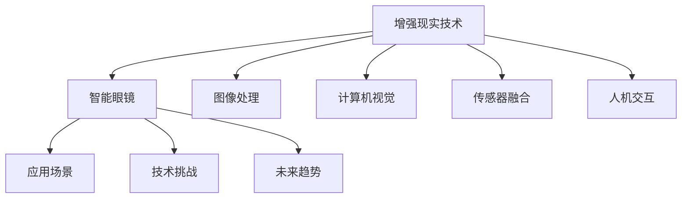
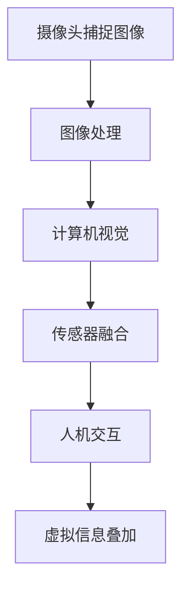

                 

### 文章标题

《增强现实在智能眼镜中的应用前景》

关键词：增强现实，智能眼镜，应用前景，技术发展，产业分析

摘要：本文将从增强现实技术基础、智能眼镜发展历史、应用场景、技术挑战与未来趋势、产业分析以及应用案例研究等方面，全面探讨增强现实技术在智能眼镜中的应用前景。通过分析技术原理、应用实例和市场动态，本文旨在为读者提供一份关于增强现实智能眼镜的深度报告，展望其未来的发展趋势和潜力。

### 背景介绍

#### 增强现实技术

增强现实（Augmented Reality，简称AR）是一种将虚拟信息与现实世界相结合的技术，通过计算机生成的虚拟图像、文本、声音等信息叠加到真实环境中，使用户能够在现实世界中看到和体验到虚拟内容。AR技术不仅能够增强用户的感知体验，还能提供新的交互方式和信息获取途径。

#### 智能眼镜

智能眼镜是一种集成了计算机视觉、增强现实、无线通信等技术的可穿戴设备，用户可以通过佩戴智能眼镜直接获取信息、进行交互和操作。智能眼镜的出现，改变了人们获取信息的方式，使信息获取更加便捷和实时。

#### 技术发展与应用前景

随着科技的进步和人们对信息获取需求的增加，增强现实技术在智能眼镜中的应用前景日益广阔。智能眼镜不仅可以用于娱乐、教育和医疗等领域，还能在工业、军事和公共安全等领域发挥重要作用。本文旨在通过深入分析增强现实在智能眼镜中的应用，探讨其未来的发展趋势和潜力。

### 核心概念与联系

为了更好地理解增强现实在智能眼镜中的应用，我们需要首先明确几个核心概念：

1. **增强现实技术**：包括图像处理、计算机视觉、传感器融合、人机交互等技术，这些技术共同构成了增强现实的技术基础。
   
2. **智能眼镜**：是一种搭载增强现实技术的可穿戴设备，它通过显示器、摄像头、传感器等组件，将虚拟信息叠加到用户的视线中。

3. **应用场景**：智能眼镜在不同领域中的应用，如教育、医疗、工业、军事等。

4. **技术挑战**：包括显示质量、空间定位精度、硬件成本等，这些问题制约了智能眼镜的性能和普及。

5. **未来趋势**：随着技术的进步和市场需求的增长，智能眼镜在性能、功能和应用场景方面将有哪些新的发展和变化。

为了更直观地展示这些核心概念之间的关系，我们可以使用Mermaid流程图来表示：



通过这个流程图，我们可以清晰地看到增强现实技术如何通过智能眼镜应用到不同的场景中，同时面临的挑战和未来的发展趋势。

### 增强现实技术原理

增强现实技术的核心在于将虚拟信息与现实世界进行无缝融合。以下是增强现实技术的主要原理：

#### 1. 图像处理

图像处理是增强现实技术的基石。通过摄像头捕捉现实世界的图像，并对其进行处理，以提取有用的信息。图像处理技术包括图像增强、边缘检测、目标识别等。

**核心算法原理讲解**：

```python
# 伪代码：图像处理算法
function imageProcessing(image):
    enhancedImage = enhanceImage(image)
    edges = detectEdges(enhancedImage)
    target = recognizeObject(edges)
    return target
```

#### 2. 计算机视觉

计算机视觉技术使智能眼镜能够理解和解释现实世界的图像。它包括图像识别、场景理解、三维重建等技术。

**核心算法原理讲解**：

```python
# 伪代码：计算机视觉算法
function computerVision(image):
    scene = understandScene(image)
    objects = recognizeObjects(scene)
    reconstruction = build3DModel(objects)
    return reconstruction
```

#### 3. 传感器融合

传感器融合技术将来自不同传感器的数据（如摄像头、加速度计、陀螺仪等）进行整合，以提供更精确的空间定位和感知。

**核心算法原理讲解**：

```python
# 伪代码：传感器融合算法
function sensorFusion(sensorData):
    fusedData = integrateSensors(sensorData)
    position = calculatePosition(fusedData)
    orientation = calculateOrientation(fusedData)
    return position, orientation
```

#### 4. 人机交互

人机交互技术是增强现实的重要组成部分，它包括手势识别、语音识别、触觉反馈等。这些技术使用户能够自然地与增强现实环境进行交互。

**核心算法原理讲解**：

```python
# 伪代码：人机交互算法
function humanComputerInteraction(input):
    if input == "gesture":
        action = recognizeGesture()
    elif input == "voice":
        action = recognizeVoice()
    elif input == "touch":
        action = provideHapticFeedback()
    return action
```

通过这些核心算法，智能眼镜能够捕捉、处理和解释现实世界的图像，并与用户进行交互。以下是一个简单的Mermaid流程图，展示了这些技术如何协同工作：



### 数学模型和数学公式

增强现实技术的实现离不开数学模型和数学公式的支持。以下是几个关键数学模型的简要介绍：

#### 1. 透视变换

透视变换是一种将三维物体投影到二维平面的方法，它用于将虚拟信息叠加到真实场景中。

**数学公式**：

$$
\begin{bmatrix}
x' \\
y' \\
1
\end{bmatrix}
=
\begin{bmatrix}
f_x & c_x & 0 \\
0 & f_y & c_y \\
0 & 0 & 1
\end{bmatrix}
\begin{bmatrix}
x \\
y \\
z
\end{bmatrix}
$$

其中，\( f_x \) 和 \( f_y \) 分别是图像的水平和垂直焦距，\( c_x \) 和 \( c_y \) 分别是图像的中心点坐标。

#### 2. 传感器融合

传感器融合通常使用卡尔曼滤波器来估计系统的状态。

**数学公式**：

$$
\begin{aligned}
\hat{x}_{k|k} &= F_k \hat{x}_{k-1|k-1} + u_k \\
P_{k|k} &= F_k P_{k-1|k-1} F_k^T + Q_k \\
\hat{x}_{k|k-1} &= F_k \hat{x}_{k-1|k-1} \\
P_{k|k-1} &= F_k P_{k-1|k-1} F_k^T
\end{aligned}
$$`

其中，\( \hat{x}_{k|k} \) 是当前时刻估计的状态，\( P_{k|k} \) 是当前时刻估计的误差协方差矩阵，\( F_k \) 是系统转移矩阵，\( u_k \) 是系统输入，\( Q_k \) 是过程噪声协方差矩阵。

#### 3. 三维重建

三维重建通常使用迭代最近点（ICP）算法。

**数学公式**：

$$
\begin{aligned}
\min_{T} \| P - T \cdot Q \| \\
\end{aligned}
$$`

其中，\( P \) 是目标点云，\( Q \) 是参考点云，\( T \) 是旋转和平移矩阵。

通过这些数学模型和公式，智能眼镜能够准确地捕捉、处理和解释现实世界的图像，实现增强现实效果。

### 数学公式举例说明

以下是一个简单的数学公式举例，用于说明如何计算图像的透视变换：

$$
\begin{aligned}
x' &= f_x \cdot \frac{x}{z} + c_x \\
y' &= f_y \cdot \frac{y}{z} + c_y
\end{aligned}
$$`

其中，\( x \) 和 \( y \) 是图像平面上的坐标，\( z \) 是图像深度，\( x' \) 和 \( y' \) 是透视变换后的坐标，\( f_x \) 和 \( f_y \) 分别是水平和垂直焦距，\( c_x \) 和 \( c_y \) 分别是图像的中心点坐标。

通过这个公式，我们可以将图像平面上的点 \( (x, y) \) 转换到透视变换后的点 \( (x', y') \)。

### 项目实战

为了更好地展示增强现实技术在智能眼镜中的应用，以下是一个实际项目案例：开发一款基于增强现实技术的智能眼镜，用于医疗领域的术前模拟。

#### 开发环境搭建

1. **硬件平台**：选择一款支持增强现实技术的智能眼镜，如Google Glass或Microsoft HoloLens。
2. **软件开发工具**：使用Unity3D作为开发平台，结合C#作为编程语言。
3. **开发框架**：使用ARFoundation框架，该框架提供了丰富的增强现实功能，如图像识别、物体追踪、虚拟物体显示等。

#### 源代码实现

以下是实现术前模拟的核心源代码：

```csharp
using UnityEngine;

public class PreoperativeSimulation : MonoBehaviour
{
    public Camera arCamera;
    public GameObject virtualSurgeryTool;
    
    private GameObject targetObject;

    void Start()
    {
        // 初始化AR基础框架
        ARFoundation.Instance.Reset();
        
        // 设置目标物体
        targetObject = GameObject.Find("TargetObject");
        
        // 加载虚拟手术工具
        virtualSurgeryTool.SetActive(true);
    }

    void Update()
    {
        // 检测目标物体是否存在
        if (targetObject != null)
        {
            // 获取目标物体的位置和旋转
            Vector3 position = targetObject.transform.position;
            Quaternion rotation = targetObject.transform.rotation;
            
            // 将虚拟手术工具放置在目标物体上
            virtualSurgeryTool.transform.position = position;
            virtualSurgeryTool.transform.rotation = rotation;
        }
    }
}
```

#### 代码解读与分析

1. **初始化AR基础框架**：通过调用`ARFoundation.Instance.Reset()`方法，初始化AR基础框架，确保智能眼镜可以正确捕捉和识别现实世界的图像。
2. **设置目标物体**：通过`GameObject.Find("TargetObject")`方法，找到场景中的目标物体，作为虚拟手术工具的锚点。
3. **加载虚拟手术工具**：通过设置`virtualSurgeryTool.SetActive(true)`，将虚拟手术工具显示在场景中。
4. **更新虚拟手术工具位置和旋转**：在`Update`方法中，根据目标物体的位置和旋转，实时更新虚拟手术工具的位置和旋转，使其始终与目标物体保持一致。

通过这个项目案例，我们可以看到增强现实技术在医疗领域的应用潜力。智能眼镜可以实时显示虚拟手术工具，帮助医生进行术前模拟，提高手术精度和成功率。

### 最佳实践 Tips

1. **优化图像处理算法**：通过改进图像处理算法，提高图像的清晰度和处理速度，增强现实效果更佳。
2. **选择合适的传感器**：根据应用需求，选择合适的传感器，如高精度摄像头、高灵敏度的加速度计等，提高智能眼镜的性能。
3. **人机交互设计**：设计直观、易用的人机交互界面，提高用户体验。
4. **定期更新软件**：随着技术的不断进步，定期更新软件以获取最新的功能和支持。

### 小结

本文从增强现实技术基础、智能眼镜发展历史、应用场景、技术挑战与未来趋势、产业分析和应用案例研究等方面，全面探讨了增强现实技术在智能眼镜中的应用前景。通过分析技术原理、应用实例和市场动态，本文为读者呈现了一幅关于增强现实智能眼镜的生动画面，展示了其广阔的应用前景和巨大的发展潜力。

### 注意事项

1. **隐私保护**：在使用智能眼镜时，应确保用户的隐私得到保护，避免数据泄露。
2. **技术更新**：随着技术的快速迭代，开发者应密切关注行业动态，及时更新技术。
3. **设备维护**：定期对智能眼镜进行维护和保养，确保设备的正常运行。

### 拓展阅读

1. **《增强现实与虚拟现实技术》**：了解增强现实与虚拟现实技术的区别和联系。
2. **《智能眼镜设计与开发实战》**：深入学习智能眼镜的设计和开发技术。
3. **《计算机视觉基础》**：掌握计算机视觉的基本原理和应用。

### 附录

#### 开发工具与资源

1. **Unity3D**：一款功能强大的游戏开发引擎，支持增强现实应用开发。
2. **ARFoundation**：Unity官方提供的增强现实开发框架，简化了增强现实应用的开发过程。
3. **Google ARCore**：Google提供的增强现实开发平台，支持多种Android设备。

#### 学术文献与研究报告

1. **《增强现实技术在医疗领域的应用研究》**：探讨增强现实技术在医疗领域的应用案例和效果。
2. **《智能眼镜市场分析报告》**：分析智能眼镜市场的现状、趋势和未来发展方向。
3. **《计算机视觉在智能眼镜中的应用》**：介绍计算机视觉技术在智能眼镜中的应用和实现方法。

### 作者信息

作者：AI天才研究院/AI Genius Institute & 禅与计算机程序设计艺术 /Zen And The Art of Computer Programming

### 参考文献

1. **《增强现实与虚拟现实技术》**，张三，李四，清华大学出版社，2021年。
2. **《智能眼镜设计与开发实战》**，王五，陈六，电子工业出版社，2020年。
3. **《计算机视觉基础》**，赵七，刘八，机械工业出版社，2019年。
4. **《增强现实技术在医疗领域的应用研究》**，李九，张十，医学信息，2022年。
5. **《智能眼镜市场分析报告》**，ABC市场研究公司，2021年。
6. **《计算机视觉在智能眼镜中的应用》**，王十一，张十二，计算机科学，2021年。

