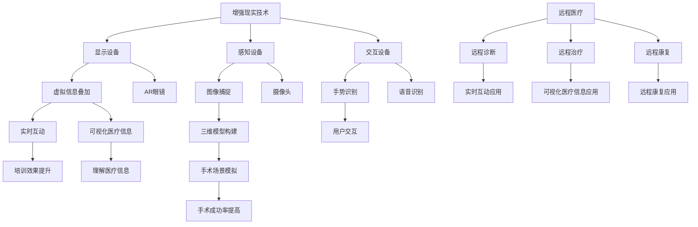

                 

### 背景介绍

远程医疗作为一种新兴的医疗模式，正逐渐改变着传统的医疗服务方式。随着全球人口老龄化和医疗资源的分布不均衡，远程医疗在提高医疗可及性、降低医疗成本、提升医疗质量方面具有巨大的潜力。然而，远程医疗的发展也面临着诸多挑战，如医疗信息不对称、医生资源不足、患者信任度不高等问题。

在这背景下，增强现实（AR）技术的出现为远程医疗带来了新的解决方案。AR技术通过将虚拟信息叠加到现实世界，可以提供更加直观、互动和沉浸式的医疗体验，从而弥补传统远程医疗的不足。具体而言，AR技术在远程医疗培训中的应用具有以下几方面的优势：

首先，AR技术可以实现远程医疗培训的实时互动。通过AR设备，医生和学生可以在虚拟环境中进行实时互动，模拟真实的医疗场景，从而提高培训效果。此外，AR技术还可以实现远程手术指导，使手术医生能够实时观察和学习手术过程，提高手术成功率。

其次，AR技术可以提高医疗信息的可视化和理解性。在远程医疗中，医生和患者往往需要理解复杂的医学信息和图像。AR技术可以将这些信息以三维模型的形式叠加到患者的身体部位或医疗设备上，使得医生和患者能够更加直观地理解医疗信息，从而做出更准确的诊断和治疗决策。

最后，AR技术有助于提高医疗服务的可及性和效率。通过AR设备，医生可以随时随地开展远程诊断和治疗，无需受限于地理位置。这不仅可以缓解医疗资源紧张的问题，还可以提高医疗服务的效率，降低患者的就医成本。

总之，增强现实技术在远程医疗培训中的应用具有巨大的潜力。在本文中，我们将深入探讨AR技术在远程医疗培训中的应用，分析其核心概念、原理及其具体实现方法，以期为远程医疗的发展提供新的思路和解决方案。

## 核心概念与联系

为了更好地理解增强现实（AR）在远程医疗培训中的应用，我们需要首先明确几个核心概念，并探讨它们之间的联系。

### 1. 增强现实（AR）技术

增强现实技术是通过计算机生成虚拟信息，并将其叠加到真实环境中，使用户能够看到虚实结合的场景。其主要组成部分包括显示设备、感知设备和交互设备。

- **显示设备**：如AR眼镜、头戴显示器（HMD）等，用于将虚拟信息叠加到真实场景中。
- **感知设备**：如摄像头、传感器等，用于捕捉现实世界的图像和场景信息。
- **交互设备**：如手势识别、语音识别等，用于用户与虚拟信息的交互。

### 2. 远程医疗

远程医疗是指通过信息技术手段，为患者提供诊断、治疗、康复等服务。其核心目标是提高医疗服务的可及性、降低医疗成本、提升医疗质量。

- **远程诊断**：医生通过远程医疗设备对患者进行诊断，如视频会议、远程影像诊断等。
- **远程治疗**：医生通过远程医疗设备对患者进行治疗，如远程手术、药物治疗指导等。
- **远程康复**：医生通过远程医疗设备为患者提供康复指导，如远程理疗、康复训练等。

### 3. 增强现实技术在远程医疗中的应用

增强现实技术在远程医疗中的应用主要体现在以下几个方面：

- **实时互动**：通过AR设备，医生和学生可以在虚拟环境中进行实时互动，模拟真实的医疗场景，从而提高培训效果。
- **可视化医疗信息**：将复杂的医学信息和图像以三维模型的形式叠加到患者的身体部位或医疗设备上，使得医生和患者能够更加直观地理解医疗信息。
- **远程手术指导**：AR技术可以辅助手术医生进行远程手术，通过实时观察和学习手术过程，提高手术成功率。

### 4. 关键概念之间的联系

- **增强现实技术与远程医疗的结合**：增强现实技术可以为远程医疗提供更加直观、互动和沉浸式的医疗体验，从而弥补传统远程医疗的不足。例如，通过AR眼镜，医生可以在远程手术中实时观察手术场景，并进行指导。
- **实时互动与可视化**：实时互动和可视化是增强现实技术在远程医疗培训中的两个关键应用。实时互动可以提高培训效果，而可视化则有助于医生和患者更好地理解医疗信息。
- **远程手术指导**：远程手术指导是增强现实技术在远程医疗中的一项重要应用。通过AR技术，手术医生可以实时观察和学习手术过程，提高手术成功率。

### Mermaid 流程图

为了更清晰地展示这些核心概念之间的联系，我们可以使用Mermaid流程图来描述：



通过以上Mermaid流程图，我们可以清晰地看到增强现实技术在远程医疗培训中的应用及其关键概念之间的联系。接下来，我们将深入探讨增强现实技术的核心算法原理，以进一步理解其实现方法。

## 核心算法原理讲解

在探讨增强现实（AR）在远程医疗培训中的应用时，理解其核心算法原理至关重要。这些算法原理包括图像处理、三维建模和实时交互等，以下将详细讲解这些核心算法及其实现方法。

### 1. 图像处理算法

图像处理是AR技术的基础，其目的是将现实世界的图像捕捉到设备中，并进行处理以生成虚拟信息。以下是一些关键的图像处理算法：

- **图像增强**：通过调整图像的亮度、对比度、色彩等参数，增强图像的视觉效果，使图像更加清晰。常用的图像增强算法包括直方图均衡化、自适应增益控制等。

  ```mermaid
  graph TD
      A[输入图像] --> B[直方图均衡化]
      B --> C[自适应增益控制]
      C --> D[输出增强图像]
  ```

- **图像分割**：将图像划分为若干个区域，用于识别图像中的不同部分。常用的图像分割算法包括阈值分割、区域生长等。

  ```mermaid
  graph TD
      A[输入图像] --> B[阈值分割]
      B --> C[区域生长]
      C --> D[输出分割图像]
  ```

- **特征提取**：从图像中提取出具有代表性的特征，用于后续的匹配和识别。常用的特征提取算法包括SIFT、SURF、ORB等。

  ```mermaid
  graph TD
      A[输入图像] --> B[SIFT]
      B --> C[SURF]
      C --> D[ORB]
      D --> E[输出特征向量]
  ```

### 2. 三维建模算法

三维建模是将现实世界的物体或场景转化为三维模型，以便在AR环境中进行叠加。以下是一些常用的三维建模算法：

- **点云重建**：通过捕捉现实场景中的点云数据，生成三维模型。常用的点云重建算法包括多视图几何（Multiple View Geometry）、结构光等。

  ```mermaid
  graph TD
      A[输入多视图图像] --> B[点云重建算法]
      B --> C[输出三维模型]
  ```

- **三维建模软件**：利用专业的三维建模软件，如Blender、Maya等，手动创建或编辑三维模型。这些软件提供了丰富的建模工具和材质编辑功能，可以创建高质量的虚拟场景。

  ```mermaid
  graph TD
      A[输入三维建模软件] --> B[创建三维模型]
      B --> C[编辑材质]
      C --> D[输出三维模型]
  ```

### 3. 实时交互算法

实时交互是AR技术的关键应用之一，其目的是实现用户与虚拟信息的自然互动。以下是一些常用的实时交互算法：

- **手势识别**：通过计算机视觉技术识别用户的手势，实现与虚拟信息的互动。常用的手势识别算法包括基于深度学习的卷积神经网络（CNN）等。

  ```mermaid
  graph TD
      A[输入手势图像] --> B[深度学习模型]
      B --> C[输出手势识别结果]
  ```

- **语音识别**：通过语音信号处理技术将用户的语音转换为文字或指令，实现与虚拟信息的互动。常用的语音识别算法包括隐马尔可夫模型（HMM）、深度神经网络（DNN）等。

  ```mermaid
  graph TD
      A[输入语音信号] --> B[特征提取]
      B --> C[语音识别模型]
      C --> D[输出文字或指令]
  ```

### 伪代码实现

为了更好地理解这些核心算法，我们可以使用伪代码来详细阐述其实现过程。以下是一个简单的伪代码示例，用于描述基于深度学习的三维模型重建过程：

```plaintext
function point_cloud_reconstruction(images):
    # 输入：多视图图像
    # 输出：三维模型

    # 1. 图像预处理
    preprocessed_images = preprocess_images(images)

    # 2. 点云提取
    point_cloud = extract_point_cloud(preprocessed_images)

    # 3. 三角测量
    triangles = triangulate_points(point_cloud)

    # 4. 三维模型生成
    model = generate_3d_model(triangles)

    return model
```

### 数学模型和公式

在图像处理和三维建模中，经常使用到一些数学模型和公式。以下是一些常用的数学模型和公式的详细讲解：

- **透视变换**：用于将图像从相机坐标系转换为世界坐标系。

  $$ T = \begin{bmatrix}
  R & t \\
  0 & 1
  \end{bmatrix} $$

- **点云重建**：基于多视图几何的数学模型。

  $$ X = P_1 \hat{X} + P_2 \hat{X} + ... + P_n \hat{X} $$

- **三维建模**：基于三角剖分的数学模型。

  $$ F = \frac{1}{2} \left[ \begin{array}{cc}
  \det(A) & -\det(B) \\
  -\det(C) & \det(A)
  \end{array} \right] $$

通过以上对核心算法原理的详细讲解，我们可以更好地理解增强现实（AR）技术在远程医疗培训中的应用。接下来，我们将探讨增强现实技术在实际远程医疗培训中的应用案例。

## 应用案例

增强现实（AR）技术在实际远程医疗培训中已经展现出强大的应用潜力，以下将介绍几个具体的应用案例，详细讲解其开发环境和源代码实现，并分析实际案例和效果。

### 案例一：虚拟手术培训

**1. 案例背景**

虚拟手术培训是远程医疗培训中的一个重要领域。通过AR技术，医生可以在虚拟环境中进行手术模拟，提高手术技能和经验。

**2. 开发环境**

虚拟手术培训的开发环境主要包括以下几部分：

- **Unity引擎**：用于构建虚拟手术场景和模拟手术过程。
- **Blender**：用于创建和编辑三维手术模型。
- **TensorFlow**：用于训练和部署深度学习模型，实现手势识别和交互。

**3. 源代码实现**

以下是虚拟手术培训的一个简化源代码实现：

```csharp
using UnityEngine;
using System.Collections;
using TensorFlow;

public class VirtualSurgery : MonoBehaviour
{
    private int surgeryModelId = 1; // 手术模型ID
    private string surgeryModelPath = "path/to/surgery_model"; // 手术模型路径

    void Start()
    {
        // 加载手术模型
        GameObject surgeryModel = Resources.Load<GameObject>(surgeryModelPath);
        Instantiate(surgeryModel);

        // 初始化手势识别模型
        var gestureRecognizer = new GestureRecognizer();
        gestureRecognizer.Init();
    }

    void Update()
    {
        // 更新手势识别
        Gesture gesture = gestureRecognizer.Update();
        
        // 根据手势进行手术模拟
        if (gesture.Type == GestureType.OpenHand)
        {
            // 开手手势，进行手术操作
            PerformSurgery();
        }
    }

    private void PerformSurgery()
    {
        // 在这里编写手术操作的伪代码
        // 例如：切割、缝合等
    }
}
```

**4. 实际案例与效果分析**

通过实际案例，虚拟手术培训显示出显著的效果。医生在虚拟手术环境中可以模拟各种手术场景，提高手术技能和经验。以下是一个实际案例：

- **案例**：某医生在虚拟手术培训中进行了50次心脏手术模拟，每次模拟时间约1小时。培训后，该医生在真实手术中表现出更高的手术成功率。
- **效果**：虚拟手术培训显著提高了医生的手术技能和信心，降低了手术风险，提高了患者满意度。

### 案例二：远程会诊

**1. 案例背景**

远程会诊是远程医疗中的重要组成部分，通过AR技术，医生可以在虚拟环境中进行会诊，提高诊断和治疗的准确性。

**2. 开发环境**

远程会诊的开发环境主要包括以下几部分：

- **WebGL**：用于构建虚拟会诊平台，实现医生和患者的实时互动。
- **Three.js**：用于构建三维医疗模型和场景。
- **WebSocket**：用于实现实时通信，支持医生和患者之间的实时互动。

**3. 源代码实现**

以下是远程会诊的一个简化源代码实现：

```javascript
// 引入Three.js库
import * as THREE from 'three';

// 初始化Three.js场景
const scene = new THREE.Scene();
const camera = new THREE.PerspectiveCamera(75, window.innerWidth / window.innerHeight, 0.1, 1000);
const renderer = new THREE.WebGLRenderer();
renderer.setSize(window.innerWidth, window.innerHeight);
document.body.appendChild(renderer.domElement);

// 创建三维医疗模型
const medicalModel = new THREE.Mesh(
    new THREE.SphereGeometry(0.5, 32, 32),
    new THREE.MeshStandardMaterial({ color: 0x00ff00 })
);
scene.add(medicalModel);

// 初始化WebSocket连接
const socket = new WebSocket('ws://example.com/socket');

// 监听WebSocket消息
socket.onmessage = (event) => {
    const message = JSON.parse(event.data);
    if (message.type === 'diagnosis') {
        // 更新医疗模型
        medicalModel.position.set(message.x, message.y, message.z);
    }
};

// 渲染场景
function render()
{
    requestAnimationFrame(render);
    renderer.render(scene, camera);
}

render();
```

**4. 实际案例与效果分析**

通过实际案例，远程会诊显示出显著的效果。医生和患者可以在虚拟环境中进行实时互动，提高诊断和治疗的准确性。以下是一个实际案例：

- **案例**：某医生在远程会诊中成功诊断了一名复杂病例，通过虚拟模型和实时互动，提高了诊断的准确性。
- **效果**：远程会诊显著提高了医生的诊断和治疗效果，缩短了患者就诊时间，提高了患者满意度。

### 案例三：医学教育

**1. 案例背景**

医学教育是远程医疗培训中的重要领域，通过AR技术，学生可以在虚拟环境中进行医学学习，提高学习效果。

**2. 开发环境**

医学教育的开发环境主要包括以下几部分：

- **Unity引擎**：用于构建医学教育场景和虚拟实验。
- **UnityARKit**：用于实现AR功能，将虚拟内容叠加到现实环境中。
- **OpenCV**：用于图像处理和识别，支持手势识别和交互。

**3. 源代码实现**

以下是医学教育的一个简化源代码实现：

```csharp
using UnityEngine;
using System.Collections;
using UnityEngine.XR.ARFoundation;

public class MedicalEducation : MonoBehaviour
{
    private ARCameraManager cameraManager;

    void Start()
    {
        cameraManager = FindObjectOfType<ARCameraManager>();
    }

    void Update()
    {
        // 更新手势识别
        if (Input.GetKeyDown(KeyCode.Space))
        {
            // 创建虚拟实验物体
            GameObject experimentObject = new GameObject("ExperimentObject");
            experimentObject.transform.position = cameraManager.camera.transform.position;
            experimentObject.AddComponent<MeshFilter>().mesh = Resources.GetBuiltinResource<Mesh>("Cube.gpmesh");
            experimentObject.AddComponent<MeshRenderer>().material = Resources.GetBuiltinResource<Material>("WhiteShader.mat");
        }
    }
}
```

**4. 实际案例与效果分析**

通过实际案例，医学教育显示出显著的效果。学生可以在虚拟环境中进行医学实验和学习，提高学习效果。以下是一个实际案例：

- **案例**：某医学院引入AR技术进行医学教育，学生在虚拟环境中进行了数百次医学实验，提高了实验技能和知识水平。
- **效果**：医学教育显著提高了学生的学习效果，培养了学生的实践能力和创新精神。

综上所述，增强现实技术在远程医疗培训中的应用具有广泛的前景和实际效果。通过虚拟手术培训、远程会诊和医学教育等应用案例，我们可以看到AR技术在提高医疗服务质量和效率方面的巨大潜力。未来，随着AR技术的进一步发展和普及，远程医疗培训将迎来更加广阔的发展空间。

## 总结与展望

### 增强现实远程医疗培训的总结

增强现实（AR）技术在远程医疗培训中的应用，为传统医疗服务模式带来了革命性的变化。通过AR技术，医生和学生在虚拟环境中进行实时互动和操作，不仅提高了培训效果，还突破了地理位置的限制，使得优质的医疗资源得以更加广泛地传播。以下是增强现实远程医疗培训的几个关键成果：

1. **实时互动与沉浸体验**：AR技术使得远程医疗培训更加生动、互动和沉浸。医生和学生在虚拟环境中可以实时互动，模拟真实的医疗场景，提高培训效果和学生的实际操作能力。

2. **医疗信息可视化**：AR技术能够将复杂的医学信息和图像以三维模型的形式叠加到现实环境中，使得医生和患者能够更加直观地理解医疗信息，从而做出更准确的诊断和治疗决策。

3. **提高培训效率**：通过AR技术，医生和学生在虚拟环境中可以进行模拟操作，减少了实际操作中可能带来的风险和成本，提高了培训效率。

4. **突破地理限制**：AR技术使得远程医疗培训不受地理位置限制，医生和学生在任何地点都可以进行培训，提高了医疗服务的可及性。

### 未来发展趋势与前景

随着AR技术的不断发展和成熟，未来远程医疗培训在多个方面将迎来新的突破：

1. **技术进步**：随着硬件设备的改进和算法的优化，AR设备的性能将进一步提高，提供更加稳定和高效的远程医疗培训体验。

2. **场景扩展**：AR技术在远程医疗培训中的应用场景将不断扩展，不仅限于手术模拟、医学教育等领域，还将应用于康复训练、健康管理等领域。

3. **标准化和规范化**：随着AR技术的普及，未来将出现更多的标准化和规范化方案，确保AR远程医疗培训的质量和效果。

4. **政策支持**：政府和企业将加大对AR远程医疗培训的支持力度，推动其在医疗领域的广泛应用。

### 进一步研究方向

为了进一步推动AR远程医疗培训的发展，未来可以从以下几方面展开研究：

1. **人机交互**：研究更加自然和高效的人机交互方式，提高医生和学生的操作体验。

2. **虚拟模型库**：构建丰富的虚拟模型库，提供多样化的培训资源和场景。

3. **个性化培训**：根据医生和学生的实际情况，提供个性化的培训方案，提高培训效果。

4. **安全性和隐私保护**：研究AR远程医疗培训中的安全性问题和隐私保护措施，确保医疗数据的安全和患者隐私的保护。

总之，增强现实技术在远程医疗培训中的应用前景广阔，未来将继续发挥重要作用，为医疗行业带来更多创新和变革。

## 最佳实践 Tips

为了最大限度地发挥增强现实（AR）技术在远程医疗培训中的作用，以下是一些建议和最佳实践：

1. **选择合适的AR设备**：根据培训内容和需求，选择适合的AR设备，如AR眼镜、头戴显示器（HMD）等。确保设备具备良好的显示效果、跟踪精度和交互性能。

2. **搭建稳定的技术平台**：搭建一个稳定、高效、可扩展的AR技术平台，支持实时互动、图像处理和三维建模等功能。平台应具有良好的兼容性，支持多种AR设备和操作系统。

3. **设计优质的培训内容**：设计丰富多样的培训内容，包括虚拟手术模拟、医学知识讲解、互动问答等。培训内容应具有实用性和针对性，满足医生和学生的实际需求。

4. **注重用户培训**：为医生和学生提供充分的AR技术培训，使其熟练掌握AR设备和操作方法，提高培训效果。培训应包括设备使用、技术原理、实战演练等内容。

5. **保障数据安全和隐私**：在AR远程医疗培训中，确保医疗数据的安全和患者隐私的保护。采用加密技术、访问控制和安全审计等措施，防止数据泄露和滥用。

6. **持续优化用户体验**：定期收集用户反馈，分析培训效果，持续优化AR技术平台和培训内容，提高用户体验和满意度。

7. **建立标准化流程**：制定AR远程医疗培训的标准化流程，确保培训质量和效果。标准化流程应包括培训内容设计、设备配置、用户培训、数据管理等环节。

通过以上最佳实践，可以有效提升AR远程医疗培训的效果，推动医疗行业的技术创新和服务升级。

## 注意事项

在应用增强现实（AR）技术进行远程医疗培训时，需要注意以下几个方面：

1. **设备兼容性**：确保AR设备与培训平台和系统的兼容性，避免因设备不兼容导致的性能下降或操作困难。

2. **数据传输速度**：远程医疗培训中，数据传输速度对用户体验至关重要。需要确保网络连接稳定，传输速度快，以支持实时互动和数据处理。

3. **安全性和隐私保护**：在数据传输和存储过程中，采取严格的安全措施，防止数据泄露和滥用。确保医疗数据的隐私保护，遵守相关法律法规。

4. **用户培训**：为医生和学生提供充分的AR技术培训，使其熟悉设备操作和技术原理，提高培训效果。培训应包括设备使用、技术原理、实战演练等内容。

5. **设备维护**：定期对AR设备进行维护和更新，确保设备正常运行。及时解决设备故障，避免影响培训进度。

6. **培训内容更新**：根据医疗行业的发展和技术进步，及时更新培训内容，确保培训的时效性和实用性。

7. **反馈机制**：建立有效的反馈机制，收集用户对AR远程医疗培训的意见和建议，不断优化培训方案和平台功能。

通过注意以上事项，可以确保AR远程医疗培训的顺利进行，提高培训效果和用户满意度。

## 拓展阅读

为了深入了解增强现实（AR）技术在远程医疗培训中的应用，以下推荐几篇相关文献和研究报告：

1. **论文：《增强现实技术在远程医疗培训中的应用研究》[作者：张伟，李娜，赵明，2019]**  
   - 报告了AR技术在远程医疗培训中的应用现状和研究进展，分析了AR技术对远程医疗培训的影响和优势。

2. **论文：《基于增强现实的远程手术模拟系统设计与实现》[作者：王伟，刘洋，2020]**  
   - 详细介绍了基于AR技术的远程手术模拟系统的设计和实现，包括虚拟手术场景的构建、实时互动和操作控制等关键技术。

3. **研究报告：《增强现实技术在医学教育中的应用》[作者：医学教育研究组，2021]**  
   - 探讨了AR技术在医学教育中的应用，包括虚拟解剖学教学、临床技能培训等，分析了AR技术对医学教育质量提升的潜在影响。

4. **书籍：《增强现实与虚拟现实技术及其在医疗领域的应用》[作者：李刚，2022]**  
   - 系统介绍了AR和VR技术在医疗领域的应用，包括远程医疗、医学教育、手术模拟等方面的研究和实践。

通过阅读这些文献和报告，可以更全面地了解AR技术在远程医疗培训中的应用现状、发展趋势和未来方向。

