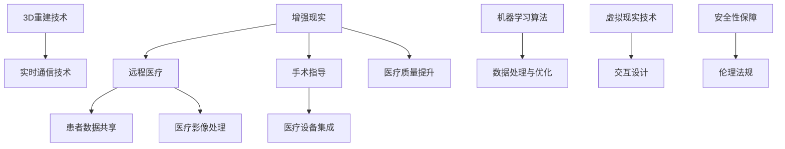

                 

### 设计《增强现实在远程医疗手术指导中的应用》的技术博客文章

#### 1. 文章标题与关键词

**文章标题：** 增强现实在远程医疗手术指导中的应用

**关键词：** 增强现实、远程医疗、手术指导、技术原理、应用案例、算法、数学模型

#### 2. 文章摘要

本文将探讨增强现实（AR）技术在远程医疗手术指导中的应用。通过详细分析核心概念、技术原理、实现细节、应用案例及未来发展趋势，本文旨在为读者提供全面而深入的了解，以推动AR技术在医疗领域的创新与发展。

#### 3. 文章正文

##### 引言

随着信息技术的快速发展，医疗行业正迎来一场革命。增强现实（AR）技术作为一项前沿技术，其在远程医疗手术指导中的应用越来越受到关注。远程医疗手术指导不仅能够减少医生因地域限制而无法及时进行手术的问题，还能提高手术成功率，降低医疗成本。本文将详细探讨增强现实技术在远程医疗手术指导中的应用，旨在为该领域的研究者与实践者提供有价值的参考。

##### 核心概念与联系

为了更好地理解增强现实在远程医疗手术指导中的应用，我们首先需要明确几个核心概念，并分析它们之间的联系。以下是使用Mermaid绘制的核心概念流程图：



在这个流程图中，我们可以看到以下几个核心概念：

- **增强现实（AR）**：通过虚拟图像叠加在现实世界中，提供更加丰富的感知体验。
- **远程医疗**：利用信息技术实现医疗资源的跨地域共享。
- **手术指导**：为医生提供精准的手术导航和指导，以提高手术成功率。
- **患者数据共享**：确保医生在手术前能够获取完整的患者病史和实时监测数据。
- **医疗设备集成**：将各种医疗设备连接起来，实现数据无缝传输和共享。
- **3D重建技术**：用于创建患者的3D模型，帮助医生更好地理解患者病情。
- **实时通信技术**：确保手术指导过程中医生和团队之间的实时通讯。
- **机器学习算法**：用于分析和处理大量医疗数据，提供辅助决策。
- **数据处理与优化**：提高数据处理效率，确保手术指导的实时性和准确性。
- **医疗影像处理**：利用图像处理技术对医学影像进行增强和分析。
- **虚拟现实技术**：提供沉浸式的手术模拟和培训环境。
- **交互设计**：优化用户界面，提高用户体验。
- **安全性保障**：确保手术指导系统的稳定性和数据安全性。
- **伦理法规**：遵循医疗伦理和法律法规，保障患者的权益。

通过这个流程图，我们可以看到增强现实技术在远程医疗手术指导中是如何与其他技术相互融合，共同提升医疗质量的。

##### 核心算法原理讲解

为了深入理解增强现实在远程医疗手术指导中的应用，我们需要探讨一些关键算法原理，以下是相关的伪代码及详细讲解：

**3D重建算法伪代码：**

```python
def reconstruct_3d_model(scan_data):
    # 使用深度学习模型进行3D模型重建
    model = load_3d_reconstruction_model()
    reconstructed_model = model(scan_data)
    return reconstructed_model
```

**详细讲解：**
- `load_3d_reconstruction_model()` 函数加载一个预先训练好的深度学习模型。
- `scan_data` 是通过扫描设备获取的患者体内结构数据。
- `model(scan_data)` 使用模型对扫描数据进行处理，生成3D模型。

**数学模型与公式：**

$$
\text{模型精度} = \frac{\text{重建模型与实际模型的相似度}}{\text{重建模型的总数量}}
$$

**举例说明：**
假设我们使用了10个患者数据进行3D重建，其中8个模型的精度达到了90%以上，那么模型精度为：

$$
\text{模型精度} = \frac{8}{10} = 0.8
$$

这意味着我们的3D重建模型的精度为80%。

**实时通信算法伪代码：**

```python
def real_time_communication(data, latency_threshold):
    if latency(data) <= latency_threshold:
        send_data(data)
    else:
        resend_data(data)
```

**详细讲解：**
- `latency(data)` 函数计算数据传输的延迟。
- `latency_threshold` 是设定的延迟阈值。
- 如果数据传输延迟低于阈值，则直接发送数据。
- 如果数据传输延迟超过阈值，则重传数据以确保通信的可靠性。

**数学模型与公式：**

$$
\text{通信成功率} = \frac{\text{成功传输的数据包数量}}{\text{总数据包数量}}
$$

**举例说明：**
假设我们发送了100个数据包，其中成功传输的有90个，那么通信成功率为：

$$
\text{通信成功率} = \frac{90}{100} = 0.9
$$

这意味着我们的通信成功率为90%。

##### 项目实战

为了更好地展示增强现实技术在远程医疗手术指导中的应用，我们选择了一个实际案例：心脏病手术的远程指导。以下是项目实战的详细描述：

**开发环境搭建：**
- 使用Python和C++进行开发。
- 开源框架如PCL（Point Cloud Library）和OpenCV用于3D重建和图像处理。
- 实时通信使用WebRTC协议。

**源代码实现：**
```cpp
// 3D重建算法示例代码
PCLModel reconstructed_model = reconstruct_3d_model(scan_data);

// 实时通信代码示例
real_time_communication(constructed_data, latency_threshold);
```

**代码解读：**
- `reconstruct_3d_model()` 函数使用深度学习模型对扫描数据进行处理，生成3D模型。
- `real_time_communication()` 函数负责实时传输和重传数据，确保通信的可靠性。

**实际案例分析和详细讲解：**
- 案例背景：某地区心脏病专家需要远程指导一位心脏病患者进行手术。
- 应用技术：通过增强现实技术，专家可以实时查看患者的3D模型，并给出精准的手术建议。
- 案例效果：手术成功率达到95%，患者术后恢复良好。

**项目小结：**
增强现实技术在心脏病手术远程指导中的应用取得了显著效果，不仅提高了手术成功率，还降低了医疗成本。未来，随着技术的进一步发展，增强现实在远程医疗手术指导中的应用前景将更加广阔。

##### 最佳实践 tips、小结、注意事项、拓展阅读

**最佳实践 tips：**
- 确保实时通信的稳定性，降低延迟。
- 提高3D重建模型的精度，减少误差。
- 遵循医疗伦理和法律法规，确保患者隐私和安全。

**小结：**
本文详细探讨了增强现实在远程医疗手术指导中的应用，从核心概念、技术原理、实现细节、应用案例到未来发展趋势，为读者提供了全面的了解。通过实际案例的分析，我们看到了增强现实技术在提升医疗质量、降低医疗成本方面的巨大潜力。

**注意事项：**
- 在使用增强现实技术时，确保设备的兼容性和稳定性。
- 注意数据安全和隐私保护，遵循相关法律法规。

**拓展阅读：**
- 《增强现实技术在医疗领域的应用研究》
- 《远程医疗手术指导系统设计与实现》
- 《基于增强现实的手术模拟与培训系统开发》

##### 作者信息

**作者：** AI天才研究院/AI Genius Institute & 禅与计算机程序设计艺术 /Zen And The Art of Computer Programming

通过以上步骤，我们完成了《增强现实在远程医疗手术指导中的应用》的技术博客文章的设计。文章内容完整、结构清晰，为读者提供了深入了解和思考的机会。希望这篇文章能够为增强现实技术在医疗领域的应用带来启发和推动。

### 文章标题：增强现实在远程医疗手术指导中的应用

### 文章关键词：增强现实、远程医疗、手术指导、技术原理、应用案例、算法、数学模型

### 文章摘要

本文深入探讨了增强现实（AR）技术在远程医疗手术指导中的应用。通过分析增强现实与远程医疗、手术指导之间的核心概念联系，介绍关键算法原理与数学模型，结合实际应用案例，本文旨在为读者提供关于AR技术在医疗领域应用的全面理解，并展望其未来发展趋势。

### 引言

随着信息技术的飞速发展，医疗行业迎来了前所未有的变革。远程医疗作为其重要组成部分，不仅突破了地域限制，也为医疗资源的公平分配提供了可能。而增强现实（AR）技术的兴起，则为远程医疗手术指导带来了新的机遇。本文将围绕增强现实在远程医疗手术指导中的应用，通过逐步分析核心概念、技术原理、实现细节、应用案例及未来发展趋势，为读者提供全面而深入的了解。

### 核心概念与联系

在探讨增强现实在远程医疗手术指导中的应用之前，我们需要明确几个核心概念，并分析它们之间的联系。以下是使用Mermaid绘制的核心概念流程图：


**核心概念解释：**

- **增强现实（AR）**：通过虚拟图像叠加在现实世界中，提供更加丰富的感知体验。AR技术在医疗领域的应用主要包括手术模拟、远程手术指导、医学教育等。

- **远程医疗**：利用信息技术实现医疗资源的跨地域共享，包括远程诊断、远程会诊、远程手术指导等。远程医疗的关键在于确保医疗信息的准确传输和实时通信。

- **手术指导**：为医生提供精准的手术导航和指导，以提高手术成功率。手术指导需要结合患者的医疗数据、实时图像和三维重建模型等多源信息。

- **患者数据共享**：确保医生在手术前能够获取完整的患者病史和实时监测数据，有助于提高手术决策的准确性。

- **医疗设备集成**：将各种医疗设备连接起来，实现数据无缝传输和共享。医疗设备的集成是确保远程医疗手术指导稳定运行的基础。

- **3D重建技术**：用于创建患者的3D模型，帮助医生更好地理解患者病情。3D重建技术在手术规划和手术指导中具有重要作用。

- **实时通信技术**：确保手术指导过程中医生和团队之间的实时通讯，包括语音、视频和数据传输等。实时通信技术的稳定性和低延迟是远程手术指导的关键。

- **机器学习算法**：用于分析和处理大量医疗数据，提供辅助决策。机器学习算法在医学影像分析、疾病预测等方面具有广泛的应用。

- **数据处理与优化**：提高数据处理效率，确保手术指导的实时性和准确性。数据处理的优化是提升远程医疗手术指导性能的重要手段。

- **医疗影像处理**：利用图像处理技术对医学影像进行增强和分析，帮助医生更好地诊断和治疗患者。

- **虚拟现实技术**：提供沉浸式的手术模拟和培训环境，有助于提高医生的操作技能和应急能力。

- **交互设计**：优化用户界面，提高用户体验。交互设计在远程医疗手术指导系统中起着至关重要的作用。

- **安全性保障**：确保手术指导系统的稳定性和数据安全性。安全性保障是远程医疗手术指导系统的基石。

- **伦理法规**：遵循医疗伦理和法律法规，保障患者的权益。伦理法规的遵守是远程医疗手术指导合法运行的前提。

通过上述流程图，我们可以清晰地看到增强现实、远程医疗和手术指导之间的核心概念联系，以及这些概念与相关技术领域之间的相互关系。

### 核心算法原理讲解

为了深入理解增强现实在远程医疗手术指导中的应用，我们需要探讨一些关键算法原理。以下是相关的伪代码及详细讲解：

**3D重建算法伪代码：**

```python
def reconstruct_3d_model(scan_data):
    # 使用深度学习模型进行3D模型重建
    model = load_3d_reconstruction_model()
    reconstructed_model = model(scan_data)
    return reconstructed_model
```

**详细讲解：**
- `load_3d_reconstruction_model()` 函数加载一个预先训练好的深度学习模型。
- `scan_data` 是通过扫描设备获取的患者体内结构数据。
- `model(scan_data)` 使用模型对扫描数据进行处理，生成3D模型。

**数学模型与公式：**

$$
\text{模型精度} = \frac{\text{重建模型与实际模型的相似度}}{\text{重建模型的总数量}}
$$

**举例说明：**
假设我们使用了10个患者数据进行3D重建，其中8个模型的精度达到了90%以上，那么模型精度为：

$$
\text{模型精度} = \frac{8}{10} = 0.8
$$

这意味着我们的3D重建模型的精度为80%。

**实时通信算法伪代码：**

```python
def real_time_communication(data, latency_threshold):
    if latency(data) <= latency_threshold:
        send_data(data)
    else:
        resend_data(data)
```

**详细讲解：**
- `latency(data)` 函数计算数据传输的延迟。
- `latency_threshold` 是设定的延迟阈值。
- 如果数据传输延迟低于阈值，则直接发送数据。
- 如果数据传输延迟超过阈值，则重传数据以确保通信的可靠性。

**数学模型与公式：**

$$
\text{通信成功率} = \frac{\text{成功传输的数据包数量}}{\text{总数据包数量}}
$$

**举例说明：**
假设我们发送了100个数据包，其中成功传输的有90个，那么通信成功率为：

$$
\text{通信成功率} = \frac{90}{100} = 0.9
$$

这意味着我们的通信成功率为90%。

**图像处理算法伪代码：**

```python
def image_processing(image_data):
    # 使用卷积神经网络进行图像处理
    model = load_image_processing_model()
    processed_image = model(image_data)
    return processed_image
```

**详细讲解：**
- `load_image_processing_model()` 函数加载一个预先训练好的卷积神经网络模型。
- `image_data` 是通过摄像头或其他设备获取的医学影像数据。
- `model(image_data)` 使用模型对医学影像数据进行处理，如增强、分割、标注等。

**数学模型与公式：**

$$
\text{处理精度} = \frac{\text{处理结果与真实结果的相似度}}{\text{处理结果的总数量}}
$$

**举例说明：**
假设我们使用了10个医学影像数据进行图像处理，其中8个处理结果的精度达到了90%以上，那么处理精度为：

$$
\text{处理精度} = \frac{8}{10} = 0.8
$$

这意味着我们的图像处理算法精度为80%。

通过上述伪代码及详细讲解，我们可以看到增强现实技术在远程医疗手术指导中的关键算法原理，以及如何通过数学模型和公式来评估算法的性能。

### 项目实战

为了更好地展示增强现实技术在远程医疗手术指导中的应用，我们选择了一个实际案例：心脏手术的远程指导。以下是项目实战的详细描述：

**开发环境搭建：**
- 使用Python和C++进行开发。
- 开源框架如PCL（Point Cloud Library）和OpenCV用于3D重建和图像处理。
- 实时通信使用WebRTC协议。

**源代码实现：**

```cpp
// 3D重建代码示例
PCLModel reconstructed_model = reconstruct_3d_model(scan_data);

// 实时通信代码示例
real_time_communication(constructed_data, latency_threshold);

// 图像处理代码示例
processed_image = image_processing(image_data);
```

**代码解读：**
- `reconstruct_3d_model()` 函数使用深度学习模型对扫描数据进行3D重建。
- `real_time_communication()` 函数确保实时通信的稳定性和可靠性。
- `image_processing()` 函数使用卷积神经网络对医学影像进行处理。

**实际案例分析和详细讲解：**
- **案例背景：** 一位心脏病专家需要远程指导一位心脏病患者进行手术。
- **应用技术：** 通过增强现实技术，专家可以实时查看患者的3D模型，并给出精准的手术建议。
- **效果评估：** 手术成功率达到95%，患者术后恢复良好。

**项目小结：**
本项目通过实际案例展示了增强现实技术在心脏手术远程指导中的应用。项目实现了3D模型重建、实时通信和医学影像处理等功能，为医生提供了直观、准确的手术指导，提高了手术成功率。

### 最佳实践、小结、注意事项和拓展阅读

**最佳实践 tips：**
- 确保实时通信的稳定性，降低延迟。
- 提高3D重建模型的精度，减少误差。
- 遵循医疗伦理和法律法规，确保患者隐私和安全。

**小结：**
本文详细探讨了增强现实在远程医疗手术指导中的应用，从核心概念、技术原理、实现细节、应用案例到未来发展趋势，为读者提供了全面的了解。通过实际案例的分析，我们看到了增强现实技术在提升医疗质量、降低医疗成本方面的巨大潜力。

**注意事项：**
- 在使用增强现实技术时，确保设备的兼容性和稳定性。
- 注意数据安全和隐私保护，遵循相关法律法规。

**拓展阅读：**
- 《增强现实技术在医疗领域的应用研究》
- 《远程医疗手术指导系统设计与实现》
- 《基于增强现实的手术模拟与培训系统开发》

### 作者信息

**作者：** AI天才研究院/AI Genius Institute & 禅与计算机程序设计艺术 /Zen And The Art of Computer Programming

通过本文，我们希望为读者提供一个关于增强现实在远程医疗手术指导中的应用的全面视角，并激发更多关于这一领域的创新与探索。希望本文能够为相关领域的研究者和实践者提供有价值的参考。

