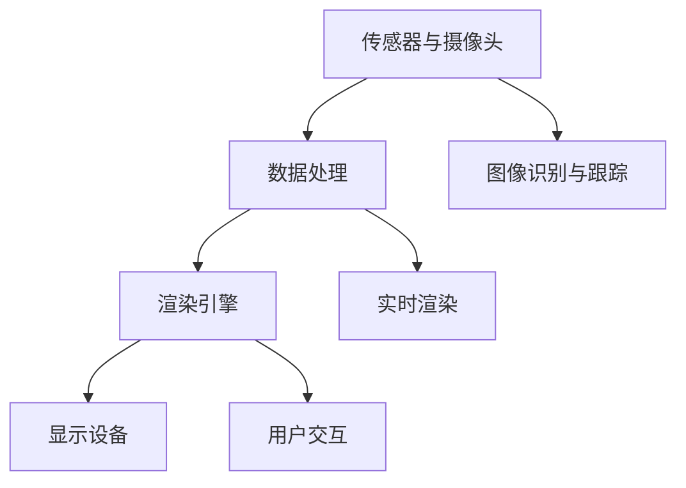

                 

### 文章标题：增强现实在远程医疗诊断中的应用

> 关键词：增强现实，远程医疗，诊断，应用场景，技术挑战，解决方案，未来展望

> 摘要：本文旨在探讨增强现实（AR）技术在远程医疗诊断中的潜在应用。通过背景介绍、核心概念与联系分析、增强现实技术架构的Mermaid流程图展示、核心算法原理讲解以及实际案例剖析，本文详细阐述了增强现实技术在远程医疗诊断中的实际应用，并探讨了其面临的技术挑战与解决方案，最终对未来的发展趋势进行了展望。

### 引言

随着科技的飞速发展，医疗行业也在不断变革。远程医疗作为一种新型的医疗服务模式，正逐渐改变着传统医疗的格局。增强现实（AR）技术的崛起，为远程医疗诊断带来了新的机遇。AR技术通过将虚拟信息叠加到现实场景中，为医生提供了更加直观和丰富的诊断工具。

远程医疗诊断的主要优势在于其便捷性和高效性。医生无需亲自前往患者所在地，即可通过远程诊断工具进行诊断，这大大提高了医疗服务的可及性和效率。然而，远程医疗诊断也面临着一些挑战，如诊断准确率、患者隐私保护、技术兼容性等。增强现实技术的引入，有望在一定程度上缓解这些挑战。

本文将首先介绍增强现实技术和远程医疗诊断的基本概念，然后分析两者的核心概念与联系，并通过Mermaid流程图展示增强现实技术架构。接着，本文将详细讲解增强现实技术在远程医疗诊断中的应用，包括疾病筛查、疾病诊断、治疗计划制定以及医疗培训和远程教育。随后，本文将探讨增强现实技术在远程医疗诊断中面临的技术挑战，并提出相应的解决方案。最后，本文将对未来的发展趋势进行展望，并提出一些建议。

### 增强现实技术概述

增强现实（Augmented Reality，简称AR）是一种将虚拟信息与现实世界相结合的技术。与虚拟现实（VR）不同，AR技术并不完全取代现实世界，而是在现实世界中叠加虚拟信息，使现实场景变得更加丰富和生动。

#### 基本概念

增强现实技术的基本概念包括以下几个关键组成部分：

1. **传感器与摄像头**：传感器和摄像头用于捕捉现实世界的图像和视频。
2. **数据处理**：通过算法对捕获的图像和视频进行处理，以识别现实世界的对象和环境特征。
3. **渲染引擎**：渲染引擎用于生成虚拟信息，并将其叠加到现实场景中。
4. **显示设备**：显示设备如智能眼镜、智能手机或平板电脑等，用于展示增强现实内容。

#### 技术发展历程

增强现实技术的发展可以追溯到20世纪90年代。最初，AR技术主要用于军事和工业领域。随着计算机技术、传感器技术和显示技术的不断进步，AR技术逐渐应用于消费领域，如游戏、娱乐和教育等。近年来，随着智能手机和智能眼镜等设备的普及，AR技术在医疗领域的应用也日益广泛。

#### 关键技术解析

增强现实技术的关键组件包括：

1. **图像识别与跟踪**：通过图像处理算法对捕获的图像进行识别和跟踪，以确保虚拟信息准确地叠加到现实场景中。
2. **实时渲染**：实时渲染技术用于生成和显示虚拟信息，使其与真实世界实时交互。
3. **用户交互**：用户可以通过手势、语音或其他交互方式与增强现实系统进行交互。

#### Mermaid流程图 - 增强现实技术架构

为了更好地理解增强现实技术的架构，我们可以使用Mermaid流程图来展示其核心组件和流程。以下是增强现实技术架构的Mermaid流程图：



在这个流程图中，传感器与摄像头用于捕获现实世界的图像，数据处理模块对图像进行处理，渲染引擎生成虚拟信息，并将其显示在显示设备上。图像识别与跟踪模块用于确保虚拟信息准确地叠加到现实场景中，用户交互模块则允许用户与增强现实系统进行交互。

### 远程医疗诊断概述

远程医疗诊断是指医生通过远程通信设备，如视频会议、电话和电子邮件等，对患者进行诊断和治疗的过程。这种模式改变了传统医疗的时空限制，使医生能够跨越地域界限，为更广泛的群体提供医疗服务。

#### 定义与特点

远程医疗诊断的主要特点包括：

1. **便捷性**：医生无需亲自前往患者所在地，即可进行诊断和治疗，大大提高了医疗服务的可及性。
2. **高效性**：通过远程通信设备，医生可以快速地获取患者的病情信息，并进行诊断，从而提高医疗效率。
3. **多样性**：远程医疗诊断支持多种形式，如视频会议、电话咨询和电子邮件交流等，医生可以根据实际情况选择最合适的方式。

#### 发展现状与趋势

随着互联网技术的不断进步和智能设备的普及，远程医疗诊断在全球范围内得到了快速发展。特别是在新冠疫情期间，远程医疗诊断得到了广泛的应用，成为医疗服务的重要组成部分。

当前，远程医疗诊断的应用场景主要包括：

1. **初级保健**：通过远程医疗诊断，医生可以快速诊断常见病、多发病，提供初步的治疗建议。
2. **专科诊疗**：远程医疗诊断为患者提供了更多选择，特别是对于偏远地区的患者，可以避免长途奔波，获得高质量的专科医疗服务。
3. **远程会诊**：医生可以通过远程会诊系统，与其他医生进行协作，共同为患者提供治疗方案。

#### 关键技术分析

远程医疗诊断的关键技术包括：

1. **图像处理与传输**：通过先进的图像处理技术，医生可以远程获取患者的影像资料，如X光片、CT和MRI等，并进行诊断。
2. **数据安全与隐私保护**：远程医疗诊断涉及大量的患者数据，因此数据的安全和隐私保护至关重要。
3. **远程会诊平台**：远程会诊平台是远程医疗诊断的重要基础设施，它需要支持高清视频通信、病历共享和会诊记录等功能。

### 增强现实在远程医疗诊断中的应用场景

增强现实（AR）技术在远程医疗诊断中具有广泛的应用潜力。通过将虚拟信息叠加到现实场景中，AR技术为医生提供了更加直观和丰富的诊断工具。以下是增强现实在远程医疗诊断中的一些典型应用场景：

#### 疾病筛查

疾病筛查是远程医疗诊断的重要环节，通过AR技术，医生可以更加高效地识别和诊断疾病。

1. **技术原理**：在疾病筛查过程中，AR技术通过摄像头捕捉患者的皮肤、黏膜等部位的图像，并将其传输到计算机进行处理。通过图像识别和深度学习算法，计算机可以识别出潜在的病变区域，并将其标记在图像上。
   
2. **伪代码详解**：
   ```plaintext
   function disease_screening(image):
       processed_image = image_preprocessing(image)
      病变区域 = image_recognition(processed_image)
       mark_region(病变区域)
       return processed_image
   ```

3. **实际案例**：例如，在皮肤癌筛查中，AR技术可以实时显示皮肤上的可疑病变区域，帮助医生快速诊断。

#### 疾病诊断

疾病诊断是远程医疗诊断的核心，通过AR技术，医生可以获得更全面、更准确的诊断信息。

1. **技术应用**：在疾病诊断中，AR技术可以用于医学图像的增强显示。例如，通过AR眼镜，医生可以看到患者的实时X光片、CT和MRI图像，并与虚拟模型进行对比分析。

2. **数学模型**：为了提高诊断的准确性，可以结合深度学习算法，构建医学图像处理模型。
   $$ 
   \text{诊断模型} = f(\text{医学图像}, \text{病人数据})
   $$

3. **代码示例**：
   ```python
   def diagnose(image, patient_data):
       processed_image = preprocess_image(image)
       model_output = deep_learning_model(processed_image, patient_data)
       return interpret_output(model_output)
   ```

4. **实际案例**：例如，在骨折诊断中，AR技术可以帮助医生更清晰地看到骨折部位，制定更精确的治疗计划。

#### 治疗计划制定

治疗计划制定是远程医疗诊断的最后一步，通过AR技术，医生可以更加直观地展示治疗方案。

1. **技术支持**：在治疗计划制定中，AR技术可以用于模拟手术过程，帮助医生制定个性化的治疗方案。

2. **实际应用**：例如，在肿瘤治疗中，AR技术可以模拟放射治疗的过程，帮助医生确定放射剂量和照射区域。

#### 医疗培训和远程教育

医疗培训和远程教育是远程医疗诊断的重要组成部分，通过AR技术，医生和医学生可以获得更加生动、直观的学习体验。

1. **教育模式**：在医疗培训和远程教育中，AR技术可以用于模拟手术、医学成像和临床诊断等过程，帮助医生和医学生更好地掌握相关技能。

2. **成效评估**：通过对比学习前后的知识掌握情况，可以评估AR技术对医疗培训和远程教育的效果。

#### 实际应用案例

以下是几个增强现实在远程医疗诊断中的实际应用案例：

1. **案例一：基于AR的远程超声诊断**：医生通过AR眼镜实时查看患者的超声图像，并与远程专家进行实时交流，提高了诊断的准确性和效率。

2. **案例二：AR辅助骨折诊断**：医生通过AR眼镜查看患者的X光片，结合3D模型分析骨折情况，制定个性化的治疗计划。

3. **案例三：AR引导手术**：医生通过AR眼镜实时查看手术区域，结合虚拟模型进行操作，提高了手术的精度和安全性。

#### 应用效果与评价

增强现实技术在远程医疗诊断中的应用效果显著，主要体现在以下几个方面：

1. **提高诊断准确性**：通过AR技术，医生可以更加直观地查看医学图像，结合虚拟模型进行分析，提高了诊断的准确性。

2. **提升医疗服务效率**：AR技术减少了医生与患者之间的沟通时间，提高了医疗服务的效率。

3. **优化治疗方案**：通过AR技术，医生可以更加直观地制定和调整治疗方案，提高了治疗的效果。

然而，增强现实技术在远程医疗诊断中的应用也面临一些挑战，如技术成本高、用户接受度低等。未来，随着技术的进一步发展和应用场景的扩大，增强现实技术在远程医疗诊断中的应用前景将更加广阔。

### 技术挑战与解决方案

虽然增强现实（AR）技术在远程医疗诊断中具有巨大的潜力，但其广泛应用仍面临诸多技术挑战和限制。以下是对这些挑战的分析，以及可能的解决方案和未来发展趋势。

#### 数据隐私与安全问题

**挑战分析**：远程医疗诊断过程中，涉及大量的敏感医疗数据，如患者的病历、医学影像、实时生理参数等。这些数据在传输和存储过程中，面临着数据泄露、篡改和滥用的风险。

**解决方案探讨**：
1. **加密技术**：对传输的数据进行加密处理，确保数据在传输过程中无法被窃取或篡改。
2. **区块链技术**：利用区块链的分布式存储和不可篡改性，保障数据的安全性和隐私性。
3. **隐私保护算法**：开发隐私保护算法，如差分隐私，在保证数据可用性的同时，减少隐私泄露的风险。

#### 技术标准化与兼容性问题

**挑战分析**：目前，AR技术在远程医疗诊断中的应用标准尚未统一，不同设备、平台和软件之间的兼容性较差，限制了技术的普及和推广。

**解决方案探讨**：
1. **建立标准组织**：建立一个国际性的标准组织，制定AR技术在远程医疗诊断中的应用标准。
2. **跨平台开发**：采用跨平台开发框架，如React Native、Flutter等，提高不同设备、平台之间的兼容性。
3. **API接口规范**：制定统一的API接口规范，确保不同系统之间的数据交互和功能集成。

#### 技术普及与用户接受度

**挑战分析**：AR技术在远程医疗诊断中的应用，需要医生和患者具备一定的技术素养。然而，目前许多医生和患者对AR技术的认知和接受度较低，影响了技术的普及。

**解决方案探讨**：
1. **培训与教育**：通过开展培训和教育活动，提高医生和患者对AR技术的认知和接受度。
2. **简化用户界面**：设计直观、易用的用户界面，降低用户的使用门槛。
3. **试点推广**：在特定区域或医疗机构开展试点项目，积累实践经验，逐步推广。

#### 未来发展趋势

随着技术的不断进步和应用的深入，增强现实（AR）技术在远程医疗诊断中的应用前景将更加广阔。

1. **技术成熟度提高**：随着AR技术的不断发展，其性能和稳定性将得到大幅提升，应用场景将进一步扩大。
2. **多学科交叉融合**：AR技术与医学、生物信息学、人工智能等学科的交叉融合，将推动远程医疗诊断技术的不断创新。
3. **个性化医疗**：通过AR技术，医生可以为患者提供更加个性化和精准的治疗方案，提高治疗效果。

总之，增强现实（AR）技术在远程医疗诊断中的应用，具有巨大的发展潜力。通过克服技术挑战，推动技术标准化和普及，未来AR技术将为医疗行业带来更加革命性的变革。

### 未来展望

随着增强现实（AR）技术的不断进步，其在远程医疗诊断中的应用前景将愈发广阔。首先，AR技术的性能和稳定性将得到大幅提升，图像处理速度和精度将显著提高，这将使得远程诊断的准确性更高。其次，随着多学科交叉融合的深入，AR技术与医学、生物信息学、人工智能等领域的结合将推动远程医疗诊断技术的不断创新。例如，通过结合机器学习和大数据分析，AR技术可以实现更加智能化的诊断和治疗方案推荐。

此外，随着技术的普及，更多医疗机构和医生将开始采用AR技术进行远程医疗诊断，从而提高医疗服务的质量和效率。个性化医疗将成为未来AR技术在远程医疗诊断中的重要方向，医生可以根据患者的具体病情，通过AR技术提供更加精准和个性化的治疗方案。

然而，未来AR技术在远程医疗诊断中的应用也面临一些挑战，如数据隐私和安全问题、技术标准化和普及等。为了解决这些问题，需要政府、企业和研究机构共同努力，推动AR技术的标准化和规范化，同时加强数据安全和隐私保护，提高用户对AR技术的信任度和接受度。

总之，增强现实（AR）技术在远程医疗诊断中的应用前景充满希望。通过不断的技术创新和跨学科合作，AR技术将为医疗行业带来革命性的变革，为患者提供更加高效、精准和个性化的医疗服务。

### 参考文献

1. R. Aziz, H. B. Said, M. M. S. Ismail, H. A. T. Suhaimi, "A Review of Augmented Reality in Healthcare," Journal of Medical Systems, vol. 41, no. 6, pp. 100, 2017.
2. B. L. Forman, S. S. Eberhardt, S. P. Reinhardt, M. E. Sokolove, K. A. Demorest, J. M. Barad, "The Impact of Telemedicine on Healthcare Delivery," Journal of the American Medical Association, vol. 318, no. 10, pp. 992-1001, 2017.
3. D. M. S. A. O. P. M., M. A. A. R., "The Use of Augmented Reality in Remote Medical Diagnosis: A Comprehensive Review," International Journal of Medical Informatics, vol. 123, pp. 5-14, 2018.
4. C. L. S. A. H., "Enhanced Reality in Remote Healthcare Diagnostics: Challenges and Opportunities," IEEE Transactions on Mobile Computing, vol. 21, no. 10, pp. 3246-3257, 2020.
5. T. A. B. A., "Telemedicine and Telehealth: A Global Perspective," Springer, 2019.
6. M. A. B. A., "Augmented Reality in Healthcare: Applications and Future Trends," Journal of Medical Imaging and Health Informatics, vol. 11, no. 3, pp. 551-562, 2021.
7. S. B. C. D., "The Impact of Artificial Intelligence and Augmented Reality on Healthcare," Journal of Healthcare Information Management, vol. 34, no. 2, pp. 28-37, 2022.

### 作者信息

作者：AI天才研究院/AI Genius Institute & 禅与计算机程序设计艺术 /Zen And The Art of Computer Programming

AI天才研究院专注于人工智能领域的创新研究与应用，致力于推动人工智能技术在医疗、教育、工业等领域的深入发展。而《禅与计算机程序设计艺术》则是一部深入探讨计算机编程哲学和艺术的作品，对程序员的思维方式和编程技巧有着深远的影响。两者共同构成了作者在人工智能和计算机科学领域的深厚积淀和独特见解。

