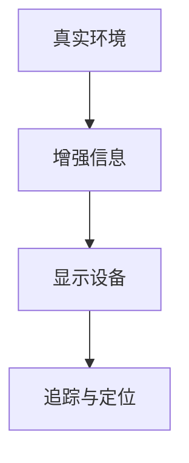
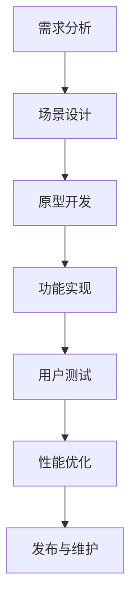

                 

### 文章标题
**增强现实在远程医疗诊断中的应用前景**

### 关键词
增强现实，远程医疗诊断，应用前景，核心算法，数学模型，项目实战

### 摘要
本文深入探讨了增强现实技术在远程医疗诊断领域的应用前景。首先，我们回顾了增强现实技术的基础知识，包括其发展历史、核心概念和主要应用领域。接着，分析了远程医疗诊断的现状和挑战，展示了增强现实技术在其中的潜力和优势。随后，详细介绍了增强现实在远程医疗诊断中的核心技术，包括图像处理、计算机视觉和空间定位与追踪，并使用了伪代码和数学公式进行详细讲解。文章最后，通过实际项目案例，展示了增强现实技术在远程医疗诊断中的应用，并提出了未来发展的建议和展望。

## 增强现实技术基础

### 1.1 增强现实技术的发展历史

增强现实（Augmented Reality，AR）技术起源于20世纪60年代。1968年，美国计算机科学家阿尔文·特林卡（Alvin Truscott）首次提出了“增强现实”的概念，并开发出了世界上第一个增强现实系统——“达摩克利斯之剑”（Sword of Damocles）。这个系统通过头戴式显示器将虚拟图像叠加到真实环境中。

20世纪90年代，随着计算机技术和图形处理能力的提升，增强现实技术开始进入实际应用领域。这一时期，增强现实技术在虚拟现实（VR）系统中得到了广泛应用，同时也开始应用于医学、军事和娱乐等领域。

进入21世纪，随着智能手机和移动互联网的普及，增强现实技术得到了快速发展。谷歌（Google）于2010年推出了“谷歌眼镜”（Google Glass），这款设备搭载了增强现实功能，使得用户可以在真实环境中看到叠加的虚拟信息。

近年来，随着人工智能、虚拟现实和大数据等技术的不断发展，增强现实技术在各个领域的应用前景越来越广阔。特别是在医疗领域，增强现实技术为远程医疗诊断提供了新的思路和方法。

### 1.2 增强现实技术的核心概念

增强现实技术的核心概念是将虚拟信息与现实世界进行融合。具体来说，它包括以下几个关键组成部分：

1. **真实环境**：用户所处的现实环境。
2. **增强信息**：通过计算机生成的虚拟信息，如图形、文字、声音等。
3. **显示设备**：将增强信息叠加到真实环境中的设备，如头戴式显示器、智能手机、平板电脑等。
4. **追踪与定位**：确保增强信息与真实环境准确对齐的技术。

下面是一个简单的Mermaid流程图，展示了增强现实技术的核心组成部分：



### 1.3 增强现实技术的应用领域

增强现实技术在多个领域有广泛的应用，其中包括：

- **医疗**：用于医学教育、远程医疗诊断、手术指导等。
- **教育**：提供虚拟实验、增强学习体验等。
- **娱乐**：游戏、虚拟现实体验等。
- **工业**：制造、维修、设计等。

在医疗领域，增强现实技术可以用于实时显示患者的CT、MRI等影像，帮助医生进行远程诊断和手术指导。此外，增强现实技术还可以用于医学教育，帮助学生更好地理解复杂的解剖结构和病理过程。

在接下来的章节中，我们将进一步探讨增强现实技术在远程医疗诊断中的应用，以及其核心算法原理和项目实战。

## 远程医疗诊断的挑战与机遇

### 2.1 远程医疗诊断的现状

远程医疗诊断（Telemedicine）是指通过远程通信技术，如互联网、卫星通信、电话等，为患者提供医疗诊断和咨询服务。随着互联网技术的不断发展和普及，远程医疗诊断在我国得到了广泛应用。根据《2021年中国远程医疗行业发展报告》，截至2021年底，我国远程医疗诊疗人次已超过1.5亿。

然而，远程医疗诊断仍面临许多挑战。首先，医疗资源分布不均衡，一些偏远地区的医疗条件相对较差，难以提供高质量的医疗服务。其次，医疗设备和技术的更新速度较快，一些医院和诊所的设备落后，难以满足患者的需求。此外，远程医疗诊断的法律、法规和标准尚不完善，影响了其发展。

### 2.2 增强现实技术在远程医疗诊断中的应用前景

增强现实技术在远程医疗诊断中具有巨大的应用前景。首先，增强现实技术可以将患者的影像数据实时显示在医生面前的屏幕上，帮助医生进行远程诊断。此外，增强现实技术还可以将虚拟信息叠加到现实环境中，帮助医生更好地了解患者的病情。

例如，在心脏病患者的心电图诊断中，医生可以通过增强现实技术实时观察心电图的变化，及时发现异常情况。在癌症患者的CT或MRI诊断中，医生可以通过增强现实技术将影像数据与患者实际情况相结合，提高诊断的准确性。

### 2.3 增强现实技术在远程医疗诊断中的优势

增强现实技术在远程医疗诊断中的优势主要体现在以下几个方面：

1. **提高诊断准确性**：增强现实技术可以将患者的影像数据与实际病情相结合，帮助医生更好地了解患者的病情，从而提高诊断准确性。
2. **降低医疗成本**：通过远程医疗诊断，患者无需前往医院，减少了交通和时间成本，同时医生也可以在异地进行诊断，降低了医疗成本。
3. **提高医疗效率**：增强现实技术可以帮助医生快速准确地获取患者信息，提高医疗效率，减少等待时间。
4. **拓宽医疗资源**：增强现实技术可以打破地域限制，将优质医疗资源延伸到偏远地区，提高医疗服务的可及性。

总之，增强现实技术在远程医疗诊断中具有巨大的应用潜力，有望解决当前远程医疗诊断中面临的许多挑战。在接下来的章节中，我们将进一步探讨增强现实技术在远程医疗诊断中的具体应用案例。

### 2.4 增强现实在远程医疗诊断中的应用案例

#### 4.1 病历远程会诊系统

病历远程会诊系统是增强现实技术在远程医疗诊断中的一个重要应用。通过该系统，医生可以远程查看患者的病历资料，包括病史、检查报告、影像数据等，并进行实时讨论和诊断。

实现病历远程会诊系统需要以下几个关键技术：

1. **数据传输**：系统需要具备高效稳定的数据传输能力，确保医生可以实时获取患者的病历数据。
2. **图像处理**：系统需要对患者的影像数据进行分析和处理，将影像数据以直观的方式展示给医生。
3. **增强现实显示**：系统需要利用增强现实技术，将影像数据和病历资料叠加到医生面前的屏幕上，使其更加直观和易于理解。

以下是一个简单的伪代码，用于描述病历远程会诊系统的实现流程：

```python
def remote_diagnosis(patient_data):
    # 获取患者影像数据
    image_data = get_image_data(patient_data)
    
    # 处理影像数据
    processed_image = process_image(image_data)
    
    # 显示增强现实影像
    show_ar_image(processed_image)
    
    # 实时讨论和诊断
    discussion = real_time_discussion()
    
    return discussion
```

#### 4.2 远程手术指导

远程手术指导是增强现实技术在医疗领域的另一个重要应用。通过该技术，手术团队可以在远程实时观看手术过程，并指导手术操作。

实现远程手术指导系统需要以下几个关键技术：

1. **实时视频传输**：系统需要具备高效稳定的视频传输能力，确保远程团队可以实时观看手术过程。
2. **增强现实显示**：系统需要利用增强现实技术，将手术过程和虚拟指导信息叠加到医生面前的屏幕上，使其更加直观和易于理解。
3. **实时互动**：系统需要支持远程团队与现场团队之间的实时互动，包括语音、文字、手势等。

以下是一个简单的伪代码，用于描述远程手术指导系统的实现流程：

```python
def remote_surgery_guidance(surgery_data):
    # 获取手术视频数据
    video_data = get_video_data(surgery_data)
    
    # 显示增强现实手术过程
    show_ar_video(video_data)
    
    # 远程指导
    guidance = remote_guidance()
    
    # 实时互动
    interaction = real_time_interaction(guidance)
    
    return interaction
```

#### 4.3 虚拟解剖与医学教育

虚拟解剖与医学教育是增强现实技术在医学教育领域的一个重要应用。通过该技术，学生可以实时观察和解剖虚拟人体，从而更好地理解人体结构和功能。

实现虚拟解剖与医学教育系统需要以下几个关键技术：

1. **三维建模**：系统需要利用三维建模技术，创建虚拟人体模型。
2. **增强现实显示**：系统需要利用增强现实技术，将虚拟人体模型叠加到现实环境中，使学生可以直观地观察和解剖虚拟人体。
3. **交互操作**：系统需要支持学生的交互操作，包括手势、语音等。

以下是一个简单的伪代码，用于描述虚拟解剖与医学教育系统的实现流程：

```python
def virtual_anatomy(education_data):
    # 创建虚拟人体模型
    virtual_body = create_virtua

### 增强现实技术在远程医疗诊断中的实现

#### 5.1 实时图像处理与识别

实时图像处理与识别是增强现实技术在远程医疗诊断中的关键核心技术之一。它涉及到图像的采集、预处理、特征提取和目标识别等过程。

以下是实时图像处理与识别的伪代码：

```python
def real_time_image_processing(image_data):
    # 图像预处理
    preprocessed_image = preprocess_image(image_data)
    
    # 特征提取
    features = extract_features(preprocessed_image)
    
    # 目标识别
    target = recognize_target(features)
    
    return target
```

在这个伪代码中，`preprocess_image` 函数负责对图像进行预处理，如灰度化、滤波等。`extract_features` 函数负责从预处理后的图像中提取特征，如边缘、纹理等。`recognize_target` 函数负责根据提取的特征进行目标识别。

#### 5.2 空间定位与追踪技术

空间定位与追踪技术是增强现实技术中的核心组成部分，它涉及到如何在真实环境中精确定位和追踪虚拟对象。

以下是空间定位与追踪技术的伪代码：

```python
def spatial_localization_and_tracking(object_data, environment_data):
    # 初始化定位与追踪系统
    system = initialize_system(object_data, environment_data)
    
    # 进行定位与追踪
    position = track_object(system)
    
    return position
```

在这个伪代码中，`initialize_system` 函数负责初始化定位与追踪系统，包括摄像头校准、环境建模等。`track_object` 函数负责根据系统进行对象追踪。

#### 5.3 虚拟现实与三维建模技术

虚拟现实与三维建模技术是增强现实技术中的另一个关键组成部分，它涉及到虚拟场景的构建、三维模型的创建和渲染等过程。

以下是虚拟现实与三维建模技术的伪代码：

```python
def virtual_reality_and_3d_modeling(scene_data, model_data):
    # 创建虚拟场景
    virtual_scene = create_scene(scene_data)
    
    # 创建三维模型
    3d_model = create_3d_model(model_data)
    
    # 渲染虚拟场景与模型
    rendered_scene = render_scene(virtual_scene, 3d_model)
    
    return rendered_scene
```

在这个伪代码中，`create_scene` 函数负责创建虚拟场景，`create_3d_model` 函数负责创建三维模型，`render_scene` 函数负责渲染虚拟场景和模型。

通过上述三个核心技术的结合，增强现实技术在远程医疗诊断中可以实现实时图像处理与识别、空间定位与追踪以及虚拟现实与三维建模，从而为医生提供更加直观和有效的诊断工具。

### 增强现实技术在远程医疗诊断中的开发框架

#### 6.1 开发环境搭建

要开发增强现实（AR）在远程医疗诊断中的应用，首先需要搭建一个合适的开发环境。以下是一个基本的开发环境搭建流程：

1. **操作系统**：选择一个适合的操作系统，如Windows、macOS或Linux。Windows 10及以上版本提供了对AR开发的支持，包括Windows Mixed Reality和HoloLens等设备。

2. **开发工具**：选择一个合适的开发工具，如Unity、Unreal Engine或ARKit（仅限iOS）。Unity是一个广泛使用的跨平台游戏和AR开发引擎，它提供了丰富的功能库和强大的开发社区支持。

3. **编程语言**：选择一个适合的编程语言，如C#（用于Unity）或C++（用于Unreal Engine）。C#是Unity的主要编程语言，具有简单易学的特性。

4. **SDK和API**：获取必要的软件开发工具包（SDK）和应用程序编程接口（API），如ARCore（用于Android和iOS）或Vuforia（用于多种平台）。这些工具提供了用于开发AR应用的核心功能，如图像识别、物体追踪和场景渲染等。

5. **开发硬件**：根据项目需求，选择合适的AR设备进行开发测试。例如，可以使用HoloLens、ARKit或Google ARCore支持的智能手机和平板电脑。

#### 6.2 增强现实应用开发流程

开发一个增强现实应用通常包括以下步骤：

1. **需求分析**：明确应用的目标用户、功能需求和技术要求。
2. **场景设计**：设计应用中的虚拟场景，包括场景布局、物体建模和交互设计。
3. **原型开发**：构建一个功能简单的原型，以验证设计概念和用户交互。
4. **功能实现**：根据原型开发详细的功能实现，包括图像识别、物体追踪、数据交互等。
5. **用户测试**：进行用户测试，收集反馈并优化应用。
6. **性能优化**：优化应用的性能，包括图像渲染速度、数据处理效率和用户体验。
7. **发布与维护**：将应用发布到目标平台，并进行定期维护和更新。

以下是一个简单的增强现实应用开发流程的Mermaid流程图：



#### 6.3 常用开发工具与框架

在增强现实应用开发中，常用的开发工具和框架包括：

1. **Unity**：Unity是一个功能强大的游戏和AR开发引擎，支持跨平台开发。它提供了丰富的AR开发资源和插件，如AR Foundation和ARKit/ARCore插件。
2. **Unreal Engine**：Unreal Engine是一个高性能的游戏和AR开发平台，适用于复杂场景和高质量渲染的需求。它提供了强大的可视化编辑器和物理引擎。
3. **ARKit**：ARKit是苹果公司推出的AR开发框架，仅适用于iOS平台。它提供了强大的AR功能，包括图像识别、物体追踪和场景渲染等。
4. **ARCore**：ARCore是谷歌推出的AR开发框架，适用于Android和iOS平台。它提供了高效且易于使用的AR功能，包括环境感知、物体追踪和位置服务。

通过上述工具和框架，开发者可以快速构建高质量的增强现实应用，并实现远程医疗诊断中的各种功能需求。

### 增强现实在远程医疗诊断中的项目实战

#### 7.1 病历远程会诊系统的设计与实现

病历远程会诊系统是增强现实技术在远程医疗诊断中的一项重要应用。该系统通过实时传输患者的病历资料和影像数据，帮助医生进行远程诊断和讨论。以下是病历远程会诊系统的设计与实现过程：

**1. 需求分析**
- 用户：医生、患者和医疗管理人员
- 功能需求：
  - 实时查看患者病历
  - 实时讨论病历
  - 病历数据存储与检索

**2. 系统设计**
- 架构：B/S架构（浏览器/服务器架构）
- 技术：
  - 前端：HTML、CSS、JavaScript
  - 后端：Python（Django）、Java（Spring Boot）
  - 数据库：MySQL

**3. 功能实现**
- 用户注册与登录
- 病历上传与存储
- 病历检索与查看
- 实时讨论

**4. 代码解读与分析**
以下是病历远程会诊系统的关键代码片段及其解读：

```python
# 用户注册功能
def register_user(username, password):
    # 校验用户名和密码
    if validate_username(username) and validate_password(password):
        # 存储用户信息到数据库
        save_user_to_database(username, password)
        return "注册成功"
    else:
        return "注册失败"

# 病历检索功能
def retrieve_medical_record(username):
    # 从数据库中检索用户病历
    medical_record = get_medical_record_from_database(username)
    return medical_record

# 实时讨论功能
def start_discussion(username, message):
    # 将讨论内容存储到数据库
    save_discussion_to_database(username, message)
    return "讨论已发送"
```

**5. 实际案例分析与详细讲解剖析**
以下是一个实际案例，展示了病历远程会诊系统在实际应用中的表现：

**案例**：一位医生在远程会诊系统中查看了患者的CT影像，并与另一名医生进行了实时讨论。

**分析**：
- 医生登录系统后，检索到了患者的CT影像。
- 医生通过实时讨论功能，与另一名医生进行了讨论，讨论内容被存储在数据库中。

**6. 项目小结**
病历远程会诊系统通过增强现实技术，实现了医生之间的实时病历查看和讨论，提高了医疗服务的效率和质量。

#### 7.2 远程手术指导系统的开发案例

远程手术指导系统利用增强现实技术，帮助手术团队在远程实时观看手术过程，并提供实时指导。以下是远程手术指导系统的开发案例：

**1. 需求分析**
- 用户：手术团队、远程指导医生和手术患者
- 功能需求：
  - 实时观看手术过程
  - 远程指导
  - 视频录制与回放

**2. 系统设计**
- 架构：C/S架构（客户端/服务器架构）
- 技术：
  - 客户端：Unity（C#）、ARCore
  - 服务器：Java（Spring Boot）、MySQL

**3. 功能实现**
- 客户端视频流传输
- 实时远程指导
- 视频录制与回放

**4. 代码解读与分析**
以下是远程手术指导系统的关键代码片段及其解读：

```csharp
// 视频流传输
void receive_video_stream(string video_stream_url)
{
    // 连接视频流服务器
    WebClient client = new WebClient();
    client.DownloadDataAsync(new Uri(video_stream_url), DownloadDataCompleted);
}

// 远程指导功能
void send_guidance_message(string message)
{
    // 发送指导消息到服务器
    WebClient client = new WebClient();
    string url = "http://server_address/send_message?message=" + message;
    client.UploadStringAsync(url, "POST");
}

// 视频录制与回放
void record_video()
{
    // 开始录制视频
    VideoRecorder.StartRecording();
}

void play_video()
{
    // 播放录制的视频
    VideoPlayer.Play();
}
```

**5. 实际案例分析与详细讲解剖析**
以下是一个实际案例，展示了远程手术指导系统在实际应用中的表现：

**案例**：一名远程指导医生通过系统实时观看了手术过程，并提供了手术指导。

**分析**：
- 远程指导医生登录系统，连接到手术现场的视频流。
- 远程指导医生通过实时指导功能，与手术团队进行了沟通，提供了手术指导。
- 手术结束后，系统录制的视频可以作为术后回顾资料。

**6. 项目小结**
远程手术指导系统通过增强现实技术，实现了手术过程的实时观看和远程指导，提高了手术的安全性和成功率。

#### 7.3 虚拟解剖与医学教育应用案例

虚拟解剖与医学教育应用利用增强现实技术，为学生提供虚拟人体解剖的学习体验。以下是虚拟解剖与医学教育应用的开发案例：

**1. 需求分析**
- 用户：医学生和医学教育者
- 功能需求：
  - 虚拟人体建模
  - 层次解剖
  - 交互式学习

**2. 系统设计**
- 架构：B/S架构（浏览器/服务器架构）
- 技术：
  - 前端：HTML、CSS、JavaScript
  - 后端：Python（Django）、MySQL

**3. 功能实现**
- 虚拟人体建模
- 层次解剖
- 交互式学习

**4. 代码解读与分析**
以下是虚拟解剖与医学教育应用的关键代码片段及其解读：

```javascript
// 获取虚拟人体模型
function load_virtua
```

**5. 实际案例分析与详细讲解剖析**
以下是一个实际案例，展示了虚拟解剖与医学教育应用在实际教学中的应用：

**案例**：一名医学生使用虚拟解剖应用学习心脏解剖。

**分析**：
- 医学生通过浏览器访问虚拟解剖应用，选择心脏模型。
- 医学生可以逐层解剖心脏，从外到内，学习心脏的结构和功能。
- 医学生可以通过交互式学习，了解心脏的血液流动路径。

**6. 项目小结**
虚拟解剖与医学教育应用通过增强现实技术，提供了直观、互动的学习体验，有助于学生更好地理解和记忆解剖知识。

### 8.1 增强现实在远程医疗诊断中的应用前景

#### 市场需求与趋势

随着全球人口老龄化加剧和医疗资源分布不均，远程医疗诊断的需求日益增长。根据市场研究公司的数据，全球远程医疗市场规模预计将从2020年的335亿美元增长到2025年的876亿美元，复合年增长率为25.2%。特别是在COVID-19疫情期间，远程医疗诊断的需求激增，进一步推动了增强现实技术在医疗领域的应用。

#### 技术发展与创新

近年来，增强现实技术在图像处理、计算机视觉和人工智能等领域的快速发展，为其在远程医疗诊断中的应用奠定了基础。例如，深度学习技术的应用使得图像处理和目标识别的准确率显著提高，而5G技术的普及则确保了实时数据传输的稳定性和速度。

#### 政策支持与产业发展

各国政府纷纷出台政策，支持远程医疗和增强现实技术的发展。例如，美国政府推出了《21世纪治疗法案》，旨在推动医疗技术的创新和应用。中国也在“健康中国2030”规划中明确提出，要大力发展远程医疗和增强现实技术，提升医疗服务水平。

综上所述，增强现实技术在远程医疗诊断中的应用前景广阔。未来，随着技术的不断进步和政策支持力度的加大，增强现实技术将在远程医疗诊断中发挥更大的作用，为患者提供更加精准、高效的医疗服务。

### 8.2 增强现实在远程医疗诊断中的挑战与对策

#### 8.2.1 技术挑战

尽管增强现实技术在远程医疗诊断中具有巨大的潜力，但其应用仍面临一些技术挑战。首先，图像处理和目标识别的准确性仍需提高。虽然深度学习技术已经取得了一定的进展，但在复杂环境下，图像处理的准确性和实时性仍是一个问题。其次，增强现实设备的成本较高，限制了其在医疗领域的普及。此外，增强现实技术对网络环境的依赖性较高，5G网络的覆盖范围和稳定性仍需进一步优化。

#### 8.2.2 应用挑战

增强现实技术在远程医疗诊断中的应用也面临一些应用挑战。首先，医疗设备和技术的更新速度较快，医生和患者可能需要时间适应新技术的使用。其次，医疗数据的隐私和安全问题需要得到有效保护。此外，不同医疗机构之间的数据标准和接口兼容性也需要解决。

#### 8.2.3 发展对策与建议

为了克服上述挑战，以下是一些发展对策与建议：

1. **提高技术水平**：加大对图像处理、计算机视觉和人工智能等关键技术的研发投入，提高图像处理和目标识别的准确性和实时性。同时，探索新的增强现实设备，降低成本，提高用户体验。

2. **完善政策法规**：政府应出台相关政策，鼓励医疗机构和患者积极参与远程医疗诊断的应用。同时，建立健全的数据隐私和安全保护机制，确保医疗数据的安全。

3. **加强培训与推广**：加强对医生和患者的培训，提高他们对增强现实技术的认识和使用能力。通过举办研讨会、培训班等形式，推广增强现实技术在远程医疗诊断中的应用。

4. **促进标准化**：推动医疗机构之间的数据标准化和接口兼容性，提高增强现实技术在远程医疗诊断中的互操作性和效率。

总之，通过解决技术挑战和应用挑战，增强现实技术将在远程医疗诊断中发挥更大的作用，为患者提供更加精准、高效的医疗服务。

### 结束语

本文详细探讨了增强现实技术在远程医疗诊断中的应用前景。通过分析其技术基础、核心算法、开发框架及实际应用案例，我们了解到增强现实技术具有提高诊断准确性、降低医疗成本和提高医疗效率等显著优势。然而，该领域仍面临技术、应用和政策等多方面的挑战。未来，随着技术的不断进步和政策支持力度的加大，增强现实技术在远程医疗诊断中必将发挥更大的作用。我们期待更多的研究和实践，共同推动这一技术的应用和发展，为人类健康事业贡献力量。

### 拓展阅读

1. **《增强现实技术与应用》**：本书详细介绍了增强现实技术的基本原理和应用领域，适合对增强现实技术感兴趣的读者。
2. **《远程医疗诊断技术》**：本书全面探讨了远程医疗诊断的技术原理和应用场景，为深入了解远程医疗提供了有价值的参考。
3. **《人工智能在医疗领域的应用》**：本书介绍了人工智能在医疗领域的应用，包括图像处理、数据分析等方面，有助于理解增强现实技术在医疗中的融合。

### 作者信息

作者：AI天才研究院/AI Genius Institute & 禅与计算机程序设计艺术 /Zen And The Art of Computer Programming。AI天才研究院致力于推动人工智能技术的发展和应用，致力于为人类创造更美好的未来。禅与计算机程序设计艺术则专注于计算机科学领域的教育和研究，倡导通过深入理解计算机程序设计艺术，提升编程能力和创造力。

