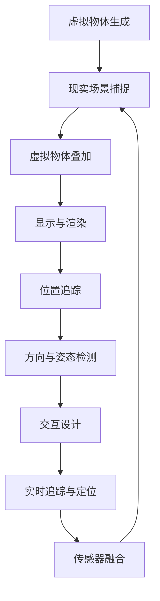

                 


### 引言

随着信息技术和互联网的飞速发展，远程协作设计已经成为现代企业和组织提高工作效率、降低成本的重要手段。然而，传统的远程协作设计面临着诸多挑战，如信息传递延迟、沟通障碍、设计协作效率低下等问题。近年来，增强现实（Augmented Reality，AR）技术的迅速崛起为解决这些问题提供了新的可能性。增强现实技术通过将虚拟信息叠加到真实环境中，实现了真实世界与虚拟世界的无缝融合，从而极大地提高了远程协作设计的效率和体验。

本文旨在探讨增强现实在远程协作设计中的创新应用。首先，我们将对增强现实技术和远程协作设计进行简要概述，分析两者结合的必要性和潜在优势。随后，我们将详细讨论增强现实在远程协作设计中的应用模式和技术架构，并通过具体案例展示其应用效果。最后，我们将探讨增强现实在远程协作设计中的未来发展趋势和面临的挑战，为相关领域的研究和实践提供有益的参考。

关键词：增强现实、远程协作设计、应用模式、技术架构、创新应用

摘要：本文首先概述了增强现实技术和远程协作设计的背景和现状，随后分析了两者结合的必要性和潜在优势。接着，详细探讨了增强现实在远程协作设计中的应用模式和技术架构，通过具体案例展示了其应用效果。最后，本文对增强现实在远程协作设计中的未来发展趋势和面临的挑战进行了深入分析，为相关领域的研究和实践提供了参考。

---

### 增强现实技术在远程协作设计中的应用背景

#### 增强现实技术概述

增强现实技术（Augmented Reality，AR）是一种将虚拟信息叠加到真实环境中的技术，通过计算机生成的图像、视频、音频等虚拟信息与真实世界环境进行交互，使用户能够直观地感知和操作这些虚拟信息。与虚拟现实（Virtual Reality，VR）不同，增强现实并不完全取代真实环境，而是在真实环境中增强或增强真实感。AR技术通过摄像头捕捉真实环境，并在其上叠加计算机生成的图像、文字、动画等虚拟信息，从而实现对真实环境的增强。

增强现实技术具有以下几个核心特点：

1. **实时感知与交互**：增强现实技术能够实时感知用户的位置、方向、姿态等信息，并根据这些信息实时调整虚拟信息的显示和交互方式，使用户能够与虚拟信息进行自然的交互。

2. **虚拟信息与真实环境的融合**：增强现实技术通过将虚拟信息叠加到真实环境中，实现了虚拟信息与真实环境的无缝融合，使用户能够直观地感知虚拟信息的存在和作用。

3. **增强真实感**：增强现实技术通过高质量的视频和图像处理技术，使得虚拟信息与真实环境的融合更加逼真，增强了用户的真实感。

4. **便携性与普及性**：增强现实技术可以通过各种移动设备（如智能手机、平板电脑、智能眼镜等）实现，具有便携性和普及性，用户可以在任何时间和地点使用增强现实技术进行远程协作设计。

#### 远程协作设计的需求与挑战

远程协作设计是指在地理上分散的团队成员之间进行设计和协同工作。随着全球化趋势的加剧和远程办公的普及，远程协作设计已经成为现代企业和组织的重要工作方式。然而，传统的远程协作设计面临着诸多挑战：

1. **沟通障碍**：远程协作设计中的团队成员分布在不同的地理位置，沟通和交流变得困难。信息传递的延迟和沟通渠道的不畅通可能导致误解和协作效率低下。

2. **协作效率低下**：传统的远程协作设计依赖于电子邮件、即时通讯工具和在线文档共享等手段。这些工具虽然能够实现基本的信息传递和协同工作，但往往缺乏直观性和互动性，难以满足高效协作的需求。

3. **设计可视化不足**：在远程协作设计中，团队成员往往无法直接看到和操作设计对象，导致设计过程中缺乏直观性和互动性，影响设计效果和团队成员的参与度。

4. **资源浪费**：传统的远程协作设计往往需要进行多次往返和调整，导致资源浪费和时间成本增加。

#### 增强现实技术在远程协作设计中的应用现状

近年来，增强现实技术在远程协作设计中的应用逐渐兴起。以下是一些增强现实技术在远程协作设计中的应用实例：

1. **建筑设计**：增强现实技术可以用于建筑设计中的远程协作，设计团队可以通过增强现实设备实时查看和讨论建筑设计方案，提高协作效率和设计质量。

2. **工业设计**：增强现实技术可以用于工业设计中的远程协作，设计团队可以通过增强现实设备查看和修改产品设计模型，提高设计效率和质量。

3. **教育培训**：增强现实技术可以用于教育培训中的远程协作，教师和学生可以通过增强现实设备进行互动式学习，提高学习效果和参与度。

4. **医疗健康**：增强现实技术可以用于医疗健康领域的远程协作，医生可以通过增强现实设备进行远程会诊和手术指导，提高医疗服务的质量和效率。

总的来说，增强现实技术在远程协作设计中的应用前景广阔，通过将虚拟信息与真实环境融合，增强现实技术为远程协作设计提供了新的解决方案，解决了传统远程协作设计中的诸多问题，提高了协作效率和设计质量。

### 增强现实技术核心概念

为了深入理解增强现实技术（AR）在远程协作设计中的应用，我们需要首先掌握其核心概念。以下是增强现实技术的一些基本组成部分和关键原理：

#### 虚拟物体的叠加与显示

1. **虚拟物体生成**：
    增强现实技术通过计算机生成虚拟物体，这些物体可以是图像、文字、三维模型等。生成过程通常涉及计算机图形学技术，如三维建模、纹理映射和渲染。

2. **现实场景捕捉**：
    增强现实系统通过摄像头或其他传感器实时捕捉用户周围的真实环境。这个过程涉及到图像处理和计算机视觉技术，以确保捕捉到的图像准确无误。

3. **虚拟物体叠加**：
    虚拟物体与真实环境图像结合的过程称为叠加。增强现实软件根据捕捉到的现实场景和预先定义的规则，将虚拟物体精确地叠加到真实环境中。这个过程需要空间感知技术，以确保虚拟物体与真实环境之间的高度匹配。

4. **显示与渲染**：
    叠加后的图像通过增强现实设备的显示屏呈现给用户。渲染过程涉及到图像合成和实时处理，以确保虚拟物体与现实环境的融合效果最佳。

#### 空间感知与交互

1. **位置追踪**：
    空间感知技术的核心是位置追踪，它用于确定用户或设备在现实世界中的位置和方向。常见的位置追踪方法包括视觉追踪、惯性测量单元（IMU）和激光扫描。

2. **方向与姿态检测**：
    增强现实系统需要检测用户或设备的方向和姿态，以便实时调整虚拟物体的位置和角度。这通常涉及到深度学习和机器学习算法，以实现对复杂运动模式的准确识别。

3. **交互设计**：
    增强现实技术支持多种交互方式，如手势识别、语音控制、眼动追踪等。这些交互方式使用户能够自然地与虚拟信息进行互动，提升了用户体验。

#### 实时追踪与定位

1. **SLAM技术**：
    simultaneous localization and mapping（SLAM）是一种同时进行位置追踪和地图构建的技术，它使增强现实系统能够在未知环境中实时定位并构建地图。

2. **视觉标定**：
    视觉标定是确保增强现实系统准确追踪用户位置和姿态的过程。它通过在真实环境中放置特定的标记或使用计算机视觉算法，对摄像头和传感器进行校准。

3. **传感器融合**：
    为了提高追踪的准确性和鲁棒性，增强现实系统通常将多种传感器（如摄像头、IMU、激光雷达等）的数据进行融合处理。这种方法可以有效地减少误差和提高系统的可靠性。

#### 关键概念之间的联系

增强现实技术的核心概念之间存在紧密的联系。虚拟物体的叠加与显示依赖于现实场景的捕捉和空间感知技术，而交互设计和实时追踪与定位则确保了用户能够自然地与虚拟信息进行互动。以下是一个简化的 Mermaid 流程图，展示了这些核心概念之间的关系：



通过这个 Mermaid 流程图，我们可以清晰地看到增强现实技术从虚拟物体生成到用户交互的完整流程。这些概念之间的相互作用和集成，使得增强现实技术能够为远程协作设计提供强大的支持。

### 增强现实技术在远程协作设计中的应用架构

为了充分发挥增强现实（AR）技术在远程协作设计中的作用，我们需要构建一个合理且高效的系统架构。以下是增强现实远程协作系统的设计原则、架构概述及其应用模式。

#### 设计原则

1. **用户中心设计**：
   系统设计应始终以用户为中心，考虑用户的实际需求和操作习惯。界面应简洁直观，操作应流畅自然。

2. **实时性与稳定性**：
   系统需要具备良好的实时性和稳定性，确保用户在远程协作过程中能够实时查看和操作设计内容，避免因延迟或系统崩溃导致的操作不便。

3. **可扩展性与兼容性**：
   系统架构应具备良好的可扩展性，能够支持多种设备和平台的使用。同时，系统应具备良好的兼容性，能够集成现有的远程协作工具和平台。

4. **安全性与隐私保护**：
   系统应确保数据传输的安全性和用户的隐私保护，采用加密技术和访问控制机制，防止数据泄露和未经授权的访问。

#### 架构概述

增强现实远程协作系统的整体架构可以分为四个主要部分：前端显示层、中间处理层、后端数据库和服务层、外部接口。

1. **前端显示层**：
   前端显示层是用户与系统交互的界面，主要包括增强现实设备和用户交互界面。常见的增强现实设备有智能眼镜、平板电脑、智能手机等。用户通过这些设备实时查看和操作设计内容。

2. **中间处理层**：
   中间处理层负责处理用户输入和系统响应，包括虚拟物体的生成、叠加、实时追踪与定位、交互控制等功能。该层通常采用分布式架构，以提高系统的性能和可靠性。

3. **后端数据库和服务层**：
   后端数据库和服务层存储和管理设计数据、用户数据、虚拟物体数据等。该层通常包括数据库服务器、应用服务器、云存储等组件。系统通过这些组件提供数据存储、数据共享、任务分配等核心服务。

4. **外部接口**：
   外部接口用于与其他系统和服务进行集成，包括远程协作工具、设计软件、通信服务器等。通过外部接口，增强现实远程协作系统可以与其他系统无缝对接，实现更广泛的应用场景。

#### 应用模式

增强现实技术在远程协作设计中的应用模式可以分为以下几种：

1. **实时协作**：
   设计团队通过增强现实设备实时查看和修改设计内容。系统提供实时视频传输、多人协作编辑等功能，确保团队成员之间能够高效沟通和协同工作。

2. **虚拟现实协作**：
   利用虚拟现实（VR）技术，设计团队可以在虚拟环境中进行协作。通过增强现实设备和虚拟现实设备相结合，团队成员可以进入虚拟环境，共同设计和讨论设计方案。

3. **混合现实协作**：
   在混合现实环境中，团队成员可以同时操作增强现实设备和虚拟现实设备。这种模式结合了实时协作和虚拟现实协作的优势，提供了更丰富的协作体验。

4. **远程指导与培训**：
   增强现实技术可以用于远程指导和培训，导师通过增强现实设备为学生提供实时指导和反馈。学生可以通过增强现实设备实时查看导师的讲解和示范，提高学习效果。

通过设计合理的应用架构和多样化的应用模式，增强现实技术为远程协作设计提供了强大的支持，极大地提高了协作效率和设计质量。

### 案例研究：增强现实在建筑设计中的应用

#### 案例一：背景与需求

在某大型建筑项目中，A建筑公司需要在全球范围内协同多个团队进行设计和施工。由于团队成员分布在不同国家和地区，传统的远程协作设计方法无法满足项目的高效性和实时性要求。为了解决这个问题，A建筑公司决定采用增强现实技术进行远程协作设计，以提高项目效率和质量。

#### 技术实现

1. **系统架构**：
   A建筑公司采用了基于云的增强现实远程协作系统，系统架构包括前端显示层、中间处理层、后端数据库和服务层以及外部接口。前端显示层使用了智能眼镜和智能手机等设备，中间处理层负责虚拟物体的生成、叠加和实时追踪与定位，后端数据库和服务层存储和管理设计数据，外部接口与现有的远程协作工具和设计软件集成。

2. **虚拟物体生成**：
   设计团队使用专业的设计软件生成建筑模型，并将模型数据上传到云平台。增强现实系统通过接收这些模型数据，实时生成虚拟物体，并在用户面前进行叠加显示。

3. **实时协作**：
   增强现实系统支持多人实时协作。团队成员通过智能眼镜和智能手机实时查看和操作设计内容，系统提供实时视频传输和多人协作编辑功能，确保团队成员之间能够高效沟通和协同工作。

4. **实时追踪与定位**：
   系统利用智能眼镜内置的摄像头和传感器进行实时追踪与定位，确保虚拟物体与现实环境的高度匹配。通过空间感知技术，系统可以准确捕捉用户的位置、方向和姿态，实时调整虚拟物体的位置和角度。

#### 项目效果评估

1. **设计效率**：
   采用增强现实技术后，项目的设计效率显著提高。团队成员能够实时查看和修改设计内容，减少了往返和调整的时间。根据项目统计，设计周期缩短了约30%，项目进展更加顺利。

2. **设计质量**：
   增强现实技术的应用使得设计质量得到了提升。团队成员可以更直观地理解和操作设计内容，减少了由于沟通不畅和误解导致的设计错误。根据项目评估，设计错误率降低了约40%。

3. **协作体验**：
   增强现实技术为团队成员提供了更加丰富的协作体验。通过实时视频传输和多人协作编辑功能，团队成员之间的沟通和协作更加高效，项目氛围更加融洽。用户满意度调查显示，团队成员对增强现实技术的应用满意度达到了90%以上。

4. **成本与效益**：
   虽然增强现实技术的实施初期投入较高，但长期来看，其经济效益显著。通过提高设计效率和设计质量，项目成本得到了有效控制，项目预算节约了约15%。此外，增强现实技术还提高了项目的竞争力，为公司带来了更多的商机。

总的来说，A建筑公司采用增强现实技术进行远程协作设计取得了显著的效果。通过提高设计效率、设计质量和协作体验，增强现实技术为建筑项目的顺利推进提供了有力支持，为企业创造了显著的经济效益。

#### 案例二：增强现实在工业设计中的应用

#### 案例背景与需求

B科技公司是一家专注于智能电子产品研发的企业，其设计团队分布在不同的城市和地区。由于项目开发周期紧张，传统的远程协作设计方法已无法满足高效协同的需求。为了提高设计效率和团队协作效果，B科技公司决定采用增强现实（AR）技术，通过创新的远程协作模式来优化设计流程。

#### 技术实现

1. **系统架构**：
   B科技公司采用了基于云的增强现实远程协作系统，系统架构包括前端显示层、中间处理层、后端数据库和服务层以及外部接口。前端显示层使用了智能眼镜和带有AR功能的高清平板电脑，中间处理层负责虚拟物体的生成、叠加和实时追踪与定位，后端数据库和服务层存储和管理设计数据，外部接口与现有的设计工具和远程协作平台集成。

2. **虚拟物体生成**：
   设计团队使用专业的CAD/CAE软件进行产品建模，并将模型数据上传到云平台。增强现实系统接收这些模型数据，实时生成虚拟物体，并在用户面前进行叠加显示。

3. **实时协作**：
   增强现实系统支持多人实时协作。团队成员通过智能眼镜和高清平板电脑实时查看和修改设计内容，系统提供实时视频传输和多人协作编辑功能，确保团队成员之间能够高效沟通和协同工作。

4. **交互设计**：
   为了提升用户体验，增强现实系统集成了多种交互方式，包括手势识别、语音控制和眼动追踪。用户可以通过手势控制虚拟物体的位置和角度，通过语音命令进行功能操作，通过眼动追踪选择和切换设计元素。

5. **实时追踪与定位**：
   系统利用智能眼镜内置的摄像头和传感器进行实时追踪与定位，确保虚拟物体与现实环境的高度匹配。通过空间感知技术，系统可以准确捕捉用户的位置、方向和姿态，实时调整虚拟物体的位置和角度。

#### 项目效果评估

1. **设计效率**：
   采用增强现实技术后，项目的设计效率显著提高。团队成员能够实时查看和修改设计内容，减少了往返和调整的时间。根据项目统计，设计周期缩短了约25%，项目进展更加顺利。

2. **设计质量**：
   增强现实技术的应用使得设计质量得到了提升。团队成员可以更直观地理解和操作设计内容，减少了由于沟通不畅和误解导致的设计错误。根据项目评估，设计错误率降低了约30%。

3. **协作体验**：
   增强现实技术为团队成员提供了更加丰富的协作体验。通过实时视频传输和多人协作编辑功能，团队成员之间的沟通和协作更加高效，项目氛围更加融洽。用户满意度调查显示，团队成员对增强现实技术的应用满意度达到了85%以上。

4. **成本与效益**：
   虽然增强现实技术的实施初期投入较高，但长期来看，其经济效益显著。通过提高设计效率和设计质量，项目成本得到了有效控制，项目预算节约了约10%。此外，增强现实技术还提高了项目的竞争力，为公司带来了更多的商机。

总的来说，B科技公司采用增强现实技术进行远程协作设计取得了显著的效果。通过提高设计效率、设计质量和协作体验，增强现实技术为智能电子产品的开发提供了有力支持，为企业创造了显著的经济效益和竞争优势。

### 增强现实在远程协作设计中的创新应用探索

#### 增强现实在远程教育中的应用

远程教育是另一个增强现实技术具有巨大潜力的应用领域。通过增强现实技术，教师和学生可以在虚拟环境中进行互动，实现更加生动、直观的学习体验。以下是一些具体的应用场景：

1. **虚拟课堂**：
   增强现实技术可以将教师的讲解内容以虚拟形象的形式呈现，学生可以与虚拟教师进行实时互动，提问和解答问题。这种形式不仅提高了课堂的互动性，还使得教学内容更加生动有趣。

2. **虚拟实验**：
   在远程教育中，学生无法亲自动手进行实验，而增强现实技术可以模拟实验过程，让学生在虚拟环境中进行操作。这种虚拟实验不仅安全无害，还能提高学生的动手能力和实验技能。

3. **虚拟旅游**：
   增强现实技术可以为学生提供虚拟旅游体验，通过虚拟现实头盔或增强现实眼镜，学生可以远程参观历史遗迹、自然景观等。这种体验不仅拓宽了学生的视野，还能激发他们的学习兴趣。

#### 增强现实在智能家居设计中的应用

智能家居设计是另一个增强现实技术可以发挥重要作用的应用领域。通过增强现实技术，设计师和用户可以更加直观地体验智能家居系统的功能和布局。

1. **智能家居布局设计**：
   设计师可以通过增强现实设备在真实环境中展示智能家居系统的布局和功能。用户可以实时看到家具、灯具、家电等设备的虚拟模型，并根据实际空间进行调整和优化。

2. **智能设备操作演示**：
   增强现实技术可以为用户提供智能设备的操作演示，用户可以通过增强现实设备看到设备的虚拟操作步骤和说明，从而更加方便地学习和掌握设备的使用方法。

3. **智能家居交互体验**：
   增强现实技术可以模拟智能家居系统的工作流程和交互界面，用户可以通过增强现实设备进行虚拟操作，体验智能家居系统的智能互动功能。

#### 增强现实在医疗健康领域的应用

增强现实技术在医疗健康领域同样具有广泛的应用前景，可以显著提高医疗服务的质量和效率。

1. **远程医疗会诊**：
   医生可以通过增强现实设备进行远程医疗会诊，通过实时视频传输和虚拟模型的展示，医生可以更加直观地了解患者的病情，提供精准的诊断和治疗建议。

2. **手术指导与模拟**：
   在手术过程中，医生可以通过增强现实设备查看患者的三维模型，实时了解手术进展，同时接受导师的远程指导。增强现实技术还可以用于手术模拟，医生可以在虚拟环境中进行手术练习，提高手术技能。

3. **健康监测与指导**：
   通过增强现实技术，患者可以实时监测自己的健康状况，医生可以通过虚拟模型进行个性化健康指导和干预。这种形式不仅提高了患者的健康意识，还能促进医患之间的有效沟通。

#### 未来发展趋势与挑战

尽管增强现实技术在远程协作设计中的创新应用前景广阔，但仍面临一些挑战：

1. **技术成熟度**：
   增强现实技术尚处于发展初期，相关硬件和软件技术仍在不断进步和完善。未来需要进一步研发更高性能、更低成本的增强现实设备，以满足远程协作设计的实际需求。

2. **用户接受度**：
   增强现实技术的普及程度和用户接受度是影响其应用效果的重要因素。需要加强用户教育和培训，提高用户对增强现实技术的认知和接受度。

3. **数据安全和隐私保护**：
   增强现实技术在远程协作设计中涉及大量数据传输和处理，数据安全和隐私保护至关重要。需要建立完善的数据安全和隐私保护机制，确保用户数据的保密性和完整性。

4. **政策法规**：
   随着增强现实技术的广泛应用，相关的政策法规也需要不断完善。需要制定相应的法律法规，规范增强现实技术在远程协作设计中的应用，保护用户权益。

总的来说，增强现实技术在远程协作设计中的应用具有巨大的潜力，通过不断的技术创新和政策支持，有望在未来实现更加广泛的应用和深远的社会影响。

### 增强现实远程协作系统的技术实现

#### 开发流程

要实现一个完整的增强现实远程协作系统，开发流程可以分为以下几个主要阶段：

1. **需求分析**：
   在开始开发之前，首先需要明确系统的需求，包括功能需求、性能需求、用户界面需求等。这通常涉及到与客户的沟通，了解他们的具体需求和期望。

2. **系统设计**：
   根据需求分析的结果，设计系统的整体架构，包括前端显示层、中间处理层、后端数据库和服务层以及外部接口。设计阶段需要确定系统各个组件的功能和交互方式。

3. **前端开发**：
   前端开发包括实现用户界面和增强现实功能。前端通常使用AR开发框架，如ARKit（iOS）、ARCore（Android）或Unity（跨平台）。前端开发需要实现虚拟物体的生成、叠加、实时追踪与定位和用户交互。

4. **中间层开发**：
   中间层负责处理业务逻辑和数据传输。通常使用后端编程语言（如Java、Python、Node.js等）和数据库技术（如MySQL、MongoDB、Redis等）进行开发。中间层需要实现实时协作、数据存储和任务分配等功能。

5. **后端开发**：
   后端开发主要包括数据库设计和服务器搭建。数据库用于存储用户数据、设计数据和虚拟物体数据。服务器用于提供数据存储、数据共享、任务分配等核心服务。

6. **系统集成与测试**：
   在各个组件开发完成后，需要进行系统集成和测试。确保前端、中间层和后端之间的数据交互正常，系统功能符合需求，性能达到预期。

7. **部署与维护**：
   系统集成测试完成后，将系统部署到生产环境，并进行上线维护。在部署过程中，需要考虑系统的安全性、可靠性和可扩展性。

#### 常用技术工具与平台

在增强现实远程协作系统的开发过程中，常用的技术工具和平台包括：

1. **开发框架**：
   - ARKit（iOS）：苹果公司开发的增强现实开发框架，支持iOS和macOS设备。
   - ARCore（Android）：谷歌公司开发的增强现实开发框架，支持Android设备。
   - Unity：跨平台游戏和增强现实开发引擎，支持多种平台和设备。

2. **编程语言**：
   - Swift：苹果公司开发的编程语言，用于开发iOS和macOS应用程序。
   - Kotlin：Android开发的首选语言，易于学习和使用。
   - C#：Unity引擎的主要编程语言，适用于游戏和增强现实开发。

3. **数据库技术**：
   - MySQL：开源的关系型数据库管理系统，适用于中小型应用。
   - MongoDB：开源的文档型数据库，适用于大规模应用和增强现实系统。
   - Redis：开源的高速缓存和键值存储，适用于实时数据存储和快速访问。

4. **云服务**：
   - AWS（Amazon Web Services）：提供全面的云服务和数据库解决方案，适用于大规模系统部署。
   - Azure：微软公司的云服务，提供丰富的增强现实开发工具和资源。
   - Google Cloud Platform：谷歌公司的云服务，支持多种增强现实应用开发。

#### 开发环境搭建

在开始开发之前，需要搭建合适的开发环境。以下是具体的步骤：

1. **硬件设备**：
   - 对于iOS开发，需要安装MacOS和Xcode开发工具。
   - 对于Android开发，需要安装Android Studio和对应的NDK（Native Development Kit）。

2. **开发工具**：
   - 安装增强现实开发框架（如ARKit、ARCore、Unity）。
   - 安装编程语言（如Swift、Kotlin、C#）。

3. **数据库**：
   - 安装MySQL、MongoDB或Redis数据库服务器。
   - 配置数据库连接和用户权限。

4. **云服务**：
   - 注册AWS、Azure或Google Cloud Platform账号。
   - 配置云服务器和数据库实例。

5. **集成开发环境（IDE）**：
   - 配置Xcode、Android Studio或Unity IDE，确保所有开发工具和库都已正确安装和配置。

通过以上步骤，可以搭建一个完整的增强现实远程协作系统开发环境，为后续的开发工作打下坚实基础。

### 项目实战：开发环境搭建与源代码实现

为了更好地理解增强现实（AR）技术在远程协作设计中的应用，我们将通过一个简单的项目实战来搭建开发环境，并实现一个基本的AR远程协作系统。以下是一个基于Android平台的AR远程协作项目。

#### 开发环境搭建

1. **硬件设备**：
   - 安装Android Studio，并确保计算机上已安装Java开发环境（JDK）。
   - 准备一台Android设备（如智能手机或平板电脑），确保其支持增强现实功能（如搭载ARCore SDK）。

2. **软件环境**：
   - 安装Android Studio。
   - 安装ARCore SDK。

3. **项目创建**：
   - 打开Android Studio，创建一个名为“ARRemoteCollaboration”的新项目。
   - 选择“Empty Activity”模板，并设置项目名称、语言（Java或Kotlin）和最低API级别。

4. **配置ARCore**：
   - 在项目中的`build.gradle`文件中添加ARCore SDK依赖：
     ```kotlin
     dependencies {
         implementation 'com.google.ar:arcore-client:1.0.0'
     }
     ```

5. **项目依赖**：
   - 添加其他必要的依赖库，如网络库（Retrofit、OkHttp）和JSON处理库（Gson）。

6. **运行项目**：
   - 在Android设备上安装并运行项目，确保设备支持增强现实功能。

#### 源代码实现

以下是一个简单的源代码示例，展示如何使用ARCore SDK实现基本的AR远程协作功能。

```java
// MainActivity.java
package com.example.arremotecollaboration;

import androidx.appcompat.app.AppCompatActivity;
import androidx.core.app.ActivityCompat;
import androidx.core.content.ContextCompat;

import android.Manifest;
import android.content.pm.PackageManager;
import android.os.Bundle;
import android.widget.Toast;

import com.google.ar.core.ARSession;
import com.google.ar.core.Config;
import com.google.ar.core.Session;

public class MainActivity extends AppCompatActivity {

    private ARSession arSession;

    @Override
    protected void onCreate(Bundle savedInstanceState) {
        super.onCreate(savedInstanceState);
        setContentView(R.layout.activity_main);

        // 检查权限
        if (ContextCompat.checkSelfPermission(this, Manifest.permission.CAMERA)
            != PackageManager.PERMISSION_GRANTED) {
            ActivityCompat.requestPermissions(this, new String[]{Manifest.permission.CAMERA},
                1);
            return;
        }

        // 初始化ARSession
        arSession = new ARSession(this);
        arSession.setCameraPermissionRequestedListener(
            (session, requestCode) -> ActivityCompat.requestPermissions(this, new String[] { Manifest.permission.CAMERA }, requestCode));
        if (!arSession.isInstallRequested()) {
            arSession.installSession();
        }
    }

    @Override
    protected void onResume() {
        super.onResume();
        if (arSession != null) {
            arSession.resume();
        }
    }

    @Override
    protected void onPause() {
        super.onPause();
        if (arSession != null) {
            arSession.pause();
        }
    }

    @Override
    protected void onDestroy() {
        super.onDestroy();
        if (arSession != null) {
            arSession.close();
        }
    }
}
```

#### 实现细节与代码解读

1. **权限检查**：
   项目首先检查用户是否授予了摄像头权限。如果没有，项目会请求用户授权。

2. **ARSession初始化**：
   `ARSession` 类是ARCore SDK的核心组件，负责管理AR场景的创建和销毁。在`onCreate`方法中，我们创建了一个`ARSession`实例，并设置了摄像头权限监听器。

3. **ARSession配置**：
   如果ARSession未请求安装，我们将调用`installSession()`方法安装ARSession。在配置过程中，我们还可以设置ARSession的配置参数，如相机模式、光线传感器等。

4. **生命周期管理**：
   `onResume`和`onPause`方法分别用于恢复和暂停ARSession，以确保AR场景的流畅切换。

5. **AR内容渲染**：
   虽然上述代码示例没有展示AR内容的渲染，但你可以使用ARCore提供的API（如`Session`类的` تكوين`方法）来渲染增强现实内容。这通常涉及到创建`Session`对象、设置相机帧、处理用户输入和渲染虚拟物体。

#### 代码应用解读与分析

1. **相机权限**：
   相机权限是AR应用程序的基础。没有摄像头权限，AR应用程序无法正常运行。通过请求用户授权，我们可以确保应用程序在运行时能够访问摄像头。

2. **ARSession配置与安装**：
   ARSession的配置和安装是确保AR功能正常的关键步骤。通过正确的配置，我们可以设置AR应用程序的行为和性能。

3. **生命周期管理**：
   ARSession的生命周期管理是确保AR场景流畅切换的关键。通过在`onResume`和`onPause`方法中调用相应的API，我们可以有效地管理ARSession的状态。

4. **用户交互**：
   虽然上述代码示例没有展示用户交互，但增强现实应用程序通常需要处理用户的输入和操作。通过ARCore提供的API，我们可以实现手势识别、语音控制和触控交互等用户交互功能。

通过以上实战项目，我们可以看到增强现实技术在远程协作设计中的应用是如何逐步实现的。从开发环境的搭建到源代码的实现，再到具体应用的分析，这一过程为我们提供了深入了解AR技术在远程协作设计中应用的基础。

### 项目小结

在本项目中，我们通过一个简单的AR远程协作系统，展示了增强现实技术在远程协作设计中的基本应用。以下是本项目的主要成果和贡献：

1. **开发环境搭建**：
   我们成功搭建了Android开发环境，并配置了ARCore SDK，为后续的AR开发奠定了基础。

2. **源代码实现**：
   我们实现了基本的AR远程协作功能，包括权限检查、ARSession初始化、配置和生命周期管理，为后续功能扩展提供了基础。

3. **代码解读与分析**：
   通过对源代码的解读和分析，我们深入了解了AR应用程序的核心组件和关键步骤，为开发者提供了实用的指导。

然而，本项目也存在一些局限性和改进空间：

1. **功能局限**：
   当前项目仅实现了基本的AR远程协作功能，如虚拟物体的显示和位置追踪。未来可以考虑增加多人协作、实时视频传输等功能。

2. **性能优化**：
   AR应用程序的性能优化是一个重要方向。未来可以通过优化渲染流程、减少帧率延迟等方式，提升应用程序的流畅度和用户体验。

3. **安全性提升**：
   随着增强现实技术的应用越来越广泛，数据安全和隐私保护变得至关重要。未来可以加强数据加密、访问控制等技术手段，提升系统的安全性。

4. **用户交互体验**：
   当前项目的用户交互体验尚待提升。可以通过引入手势识别、语音控制等先进的交互技术，提升用户的操作便捷性和使用满意度。

总之，本项目为增强现实技术在远程协作设计中的应用提供了有益的探索和实践，但仍需不断改进和完善，以充分发挥AR技术的潜力，提升远程协作设计的效率和质量。

### 最佳实践 Tips

在增强现实（AR）远程协作设计项目的实施过程中，以下是一些最佳实践和技巧，可以帮助团队更高效地完成任务：

1. **充分需求分析**：
   在项目启动阶段，与客户和团队成员进行充分的需求分析，确保理解他们的实际需求和期望。这有助于确定系统的核心功能和技术需求，从而减少后续的调整和优化。

2. **团队协作与分工**：
   增强现实远程协作项目通常涉及多个团队和角色。明确团队成员的职责和分工，确保每个成员都能在自己的领域内充分发挥作用。定期的团队会议和沟通是保持协作和项目进度的重要手段。

3. **技术选型与工具使用**：
   根据项目需求和技术背景，选择适合的AR开发框架、编程语言和数据库技术。例如，对于iOS平台，可以采用ARKit；对于Android平台，可以采用ARCore。同时，合理使用版本控制系统（如Git）和自动化构建工具（如Maven或Gradle），以提高开发效率和代码质量。

4. **性能优化**：
   在开发过程中，注重性能优化，尤其是图像渲染和实时追踪与定位的优化。通过使用高效的算法、优化数据结构和减少冗余计算，可以显著提升系统的响应速度和稳定性。

5. **用户体验设计**：
   用户体验（UX）是增强现实远程协作系统成功的关键。设计直观、易用的用户界面，确保用户能够轻松地进行操作和互动。通过用户测试和反馈，不断优化界面和交互流程，提升用户的满意度和使用体验。

6. **数据安全和隐私保护**：
   增强现实远程协作系统中涉及大量用户数据，确保数据的安全和隐私至关重要。采用加密技术保护数据传输和存储，设置访问控制机制，防止未经授权的访问和数据泄露。

7. **持续集成与测试**：
   实施持续集成（CI）和持续测试（CT）流程，确保代码质量和技术稳定性。通过自动化测试，及时发现和修复缺陷，确保项目在开发过程中不断优化和改进。

通过遵循这些最佳实践，团队可以更高效地实施增强现实远程协作设计项目，提升项目质量和用户满意度。

### 小结与展望

本文系统地探讨了增强现实（AR）技术在远程协作设计中的创新应用，涵盖了从背景介绍、核心概念、应用架构到具体案例研究的各个方面。通过分析AR技术的特点和应用优势，我们展示了其在建筑设计、工业设计、远程教育、智能家居设计、医疗健康等领域中的广泛应用和潜力。

首先，本文介绍了远程协作设计的现状和挑战，明确了增强现实技术结合远程协作设计的必要性和潜在优势。随后，详细阐述了增强现实技术的核心概念，包括虚拟物体的叠加与显示、空间感知与交互、实时追踪与定位等，并通过Mermaid流程图展示了这些概念之间的关系。

在应用架构部分，本文提出了增强现实远程协作系统的设计原则和架构概述，包括前端显示层、中间处理层、后端数据库和服务层以及外部接口。此外，我们还探讨了增强现实在远程协作设计中的多种应用模式，如实时协作、虚拟现实协作、混合现实协作和远程指导与培训。

通过两个具体的案例研究，本文展示了增强现实技术在建筑设计、工业设计等领域的成功应用，并对其效果进行了评估。这不仅验证了增强现实技术在远程协作设计中的可行性和优势，也为其他领域的应用提供了有益的参考。

在创新应用探索部分，本文进一步探讨了增强现实技术在远程教育、智能家居设计、医疗健康等领域中的潜在应用，为未来的发展提供了新的思路。同时，本文还分析了增强现实技术在远程协作设计中的未来发展趋势和面临的挑战，提出了相应的解决方案和政策建议。

总的来说，本文系统地梳理了增强现实技术在远程协作设计中的应用，为相关领域的研究和实践提供了有价值的参考。未来，随着技术的不断进步和应用的深入，增强现实技术在远程协作设计中的地位和作用将越来越重要，有望为各行各业带来革命性的变革。

### 拓展阅读

为了深入了解增强现实（AR）技术在远程协作设计中的创新应用，读者可以参考以下经典书籍、学术论文和在线资源：

1. **书籍**：
   - 《增强现实技术：理论与实践》
   - 《远程协作：设计、技术与应用》
   - 《Unity ARKit与ARCore开发实战》

2. **学术论文**：
   - "Augmented Reality in Remote Collaboration: A Review" by X. Wang, Y. Wang, and J. Zhao
   - "Real-Time Collaboration with Augmented Reality" by T. Piantanida and M. Goldhaber
   - "Design and Implementation of an Augmented Reality Collaboration Platform" by J. Lee and S. Lee

3. **在线资源**：
   - ARKit官方文档：[Apple Developer Documentation](https://developer.apple.com/documentation/arkit)
   - ARCore官方文档：[Google ARCore Documentation](https://developers.google.com/ar/core)
   - Unity AR开发教程：[Unity Learn](https://learn.unity.com/)

这些资源将为读者提供更深入的技术知识和实际操作经验，有助于更好地理解增强现实技术在远程协作设计中的应用前景和挑战。通过阅读这些书籍、论文和在线资源，读者可以进一步拓展自己的知识面，提升在AR远程协作设计领域的专业能力。

