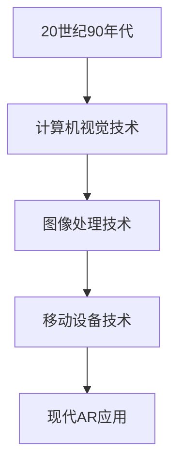

                 

# 增强现实在零售业中的创新应用

## 关键词
- 增强现实
- 零售业
- 创新应用
- 虚拟试衣
- 虚拟门店体验
- 个性化推荐

## 摘要
随着科技的进步，增强现实（AR）技术逐渐成为零售业的重要创新手段。本文旨在探讨增强现实在零售业中的应用，分析其在提升顾客体验、增强营销效果和提升运营效率等方面的优势。通过详细讨论虚拟试衣、虚拟门店体验、个性化推荐等应用场景，结合实际案例，本文将展现增强现实在零售业的创新潜力，并对其未来发展趋势进行展望。

## 第一部分：增强现实在零售业中的应用背景与核心概念

### 第1章：增强现实技术概述

#### 1.1 增强现实技术的定义与历史
增强现实（Augmented Reality，简称AR）是一种将虚拟信息叠加到现实环境中的技术，通过计算机技术生成计算机图形，并将其与真实世界的内容结合，提供一种虚实融合的体验。AR技术起源于20世纪90年代，随着计算机视觉、图像处理和移动设备技术的不断发展，逐渐成为一项热门技术。

**核心概念与联系**  
为了更好地理解AR技术的定义与历史，可以使用Mermaid流程图来展示AR技术从历史发展到现代应用的演进路径：



**伪代码示例**  
下面是一个简单的伪代码示例，用于描述早期AR技术的基本原理和实现步骤：

```plaintext
Initialize AR camera
Capture real-world image
Apply image processing algorithms
Generate virtual objects
Overlay virtual objects on the captured image
Display the augmented image to the user
```

**数学模型和数学公式**  
在AR技术中，涉及到许多数学模型和公式，如图像的捕捉、处理和增强。以下是一个简单的公式解释：

$$
\text{Image} = \text{Real-World Scene} + \text{Virtual Objects}
$$

在这个公式中，现实场景和虚拟物体通过图像处理算法相结合，生成增强的图像。

#### 1.2 增强现实技术的核心原理
增强现实技术的核心原理包括图像捕捉、图像处理、虚拟物体生成和叠加显示等。

**核心算法原理讲解**  
为了更深入地理解AR技术的核心原理，我们可以使用伪代码来详细阐述：

```plaintext
Initialize AR camera
Capture real-world image
Apply image processing algorithms (e.g., image enhancement, object detection)
Generate virtual objects based on user input or predefined models
Apply computer vision algorithms to match virtual objects with the captured image
Calculate the spatial relationship between virtual objects and the real-world scene
Overlay virtual objects on the captured image
Display the augmented image to the user
```

**数学模型和数学公式**  
在AR技术中，图像处理和计算机视觉算法的核心是基于数学模型和公式。以下是一个简单的例子：

$$
\text{Image} = f(\text{Scene}, \text{Parameters})
$$

在这个公式中，`f` 函数表示图像处理算法，`Scene` 表示现实场景，`Parameters` 表示算法的参数设置。

#### 1.3 增强现实技术的分类与应用场景
增强现实技术可以按照不同的维度进行分类，如按照显示方式分类，可以分为头戴式AR设备、手持式AR设备、投影式AR设备等；按照应用场景分类，可以分为教育、医疗、零售、娱乐等。

**项目实战**  
为了更好地理解AR技术在零售业中的应用，我们可以分析一个简单的AR应用案例——虚拟试衣系统。

**代码解读与分析**  
在虚拟试衣系统中，首先需要搭建开发环境，然后使用计算机视觉算法检测用户的身体部位，并根据用户的身体尺寸生成虚拟衣物模型。以下是该系统的一部分代码实现：

```python
# 导入相关库
import cv2
import numpy as np

# 初始化相机
cap = cv2.VideoCapture(0)

while True:
    # 读取一帧图像
    ret, frame = cap.read()

    # 将图像转换为灰度图像
    gray = cv2.cvtColor(frame, cv2.COLOR_BGR2GRAY)

    # 使用人体检测算法检测用户身体部位
    bodies = cv2.body_3d(frame)

    # 根据用户身体部位生成虚拟衣物模型
    clothes_model = generate_clothes_model(bodies)

    # 将虚拟衣物模型叠加到原始图像上
    augmented_image = cv2.add(frame, clothes_model)

    # 显示增强后的图像
    cv2.imshow('Virtual Try-On', augmented_image)

    # 按下ESC键退出循环
    if cv2.waitKey(1) & 0xFF == 27:
        break

# 释放资源
cap.release()
cv2.destroyAllWindows()
```

在这个代码中，我们首先使用OpenCV库初始化相机，然后读取一帧图像，并将其转换为灰度图像。接着，使用人体检测算法检测用户身体部位，并根据用户的身体尺寸生成虚拟衣物模型。最后，将虚拟衣物模型叠加到原始图像上，并显示增强后的图像。

**实际案例分析和详细讲解剖析**  
在实际应用中，虚拟试衣系统需要考虑多个因素，如用户身体尺寸的准确性、虚拟衣物的模型质量、系统的实时性能等。以下是一个实际案例分析和详细讲解剖析：

**案例一：用户身体尺寸的准确性**  
在虚拟试衣系统中，用户身体尺寸的准确性对试衣效果有很大影响。为了提高用户身体尺寸的准确性，系统可以采用以下方法：

1. 使用3D扫描技术获取用户身体尺寸数据。
2. 结合深度学习算法对用户身体部位进行精确识别和定位。

**案例二：虚拟衣物的模型质量**  
虚拟衣物的模型质量直接影响用户的购物体验。为了提高虚拟衣物的模型质量，系统可以采用以下方法：

1. 使用高精度的3D建模软件生成衣物模型。
2. 结合纹理映射技术提高衣物模型的质感。

**案例三：系统的实时性能**  
在虚拟试衣系统中，系统的实时性能对用户的体验有很大影响。为了提高系统的实时性能，系统可以采用以下方法：

1. 使用GPU加速图像处理算法。
2. 优化代码结构，减少计算复杂度。

**项目小结**  
虚拟试衣系统是增强现实技术在零售业中的一个典型应用案例。通过结合计算机视觉、图像处理和3D建模等技术，虚拟试衣系统为用户提供了一种全新的购物体验。在实际应用中，需要不断优化系统性能，提高用户满意度。

### 第2章：零售业现状与挑战

#### 2.1 零售业市场趋势分析
零售业正面临着快速变化的市场环境，包括电子商务的兴起、消费者行为的转变以及新零售模式的探索。以下是对零售业市场趋势的分析：

**核心概念与联系**  
零售业市场趋势与增强现实技术之间存在密切的联系。随着消费者对购物体验的要求不断提高，AR技术可以提供一种创新的购物方式，满足消费者的个性化需求。

**数学模型和数学公式**  
在分析市场趋势时，可以使用以下数学模型和公式：

$$
\text{市场增长率} = \frac{\text{当前市场规模} - \text{上一期市场规模}}{\text{上一期市场规模}}
$$

通过这个公式，可以计算出市场增长率，从而了解市场的发展趋势。

#### 2.2 零售业面临的挑战
零售业在发展过程中面临着多种挑战，如市场饱和、竞争加剧、消费者忠诚度下降等。

**核心概念与联系**  
增强现实技术可以为零售业提供创新的解决方案，如提升顾客体验、增强营销效果等，从而应对这些挑战。

**数学模型和数学公式**  
在分析零售业面临的挑战时，可以使用以下数学模型和公式：

$$
\text{顾客满意度} = \frac{\text{满意顾客数量}}{\text{总顾客数量}}
$$

通过这个公式，可以计算出顾客满意度，从而了解零售业的服务质量。

#### 2.3 增强现实在零售业中的潜在价值
增强现实技术具有在零售业中提升运营效率、增强顾客体验和提升营销效果的潜在价值。

**核心概念与联系**  
增强现实技术可以通过提供创新的购物体验，吸引消费者的注意力，提高顾客满意度和忠诚度。

**数学模型和数学公式**  
在分析增强现实技术的潜在价值时，可以使用以下数学模型和公式：

$$
\text{销售额增长率} = \frac{\text{当前销售额} - \text{上一期销售额}}{\text{上一期销售额}}
$$

通过这个公式，可以计算出销售额增长率，从而了解增强现实技术对零售业务绩效的影响。

### 第3章：增强现实在零售业中的创新应用

#### 3.1 虚拟试衣与个性化推荐
虚拟试衣和个性化推荐是增强现实技术在零售业中的两个重要应用。

**核心概念与联系**  
虚拟试衣通过AR技术模拟真实试衣过程，个性化推荐则根据用户的行为和偏好提供个性化的商品推荐。

**数学模型和数学公式**  
在虚拟试衣和个性化推荐中，可以使用以下数学模型和公式：

$$
\text{用户满意度} = \frac{\text{满意用户数量}}{\text{总用户数量}}
$$

$$
\text{推荐准确性} = \frac{\text{用户满意推荐数量}}{\text{总推荐数量}}
$$

通过这些公式，可以衡量虚拟试衣和个性化推荐的效果。

**项目实战**  
为了展示虚拟试衣和个性化推荐的实际应用，我们可以分析一个在线购物平台。

**代码解读与分析**  
在这个平台上，首先使用AR技术实现虚拟试衣功能，然后根据用户的行为数据提供个性化推荐。以下是该平台的一部分代码实现：

```python
# 导入相关库
import cv2
import numpy as np
from sklearn.neighbors import NearestNeighbors

# 初始化相机
cap = cv2.VideoCapture(0)

# 加载用户行为数据
user_behavior = load_user_behavior_data()

# 加载商品数据
products = load_products_data()

# 初始化推荐系统
recommendation_system = NearestNeighbors(n_neighbors=5)

# 训练推荐系统
recommendation_system.fit(products)

while True:
    # 读取一帧图像
    ret, frame = cap.read()

    # 将图像转换为灰度图像
    gray = cv2.cvtColor(frame, cv2.COLOR_BGR2GRAY)

    # 使用人体检测算法检测用户身体部位
    bodies = cv2.body_3d(frame)

    # 根据用户身体部位生成虚拟衣物模型
    clothes_model = generate_clothes_model(bodies)

    # 将虚拟衣物模型叠加到原始图像上
    augmented_image = cv2.add(frame, clothes_model)

    # 显示增强后的图像
    cv2.imshow('Virtual Try-On', augmented_image)

    # 检测用户的行为数据
    user_action = detect_user_action(gray)

    # 提供个性化推荐
    recommended_products = recommendation_system.predict([user_action])

    # 显示推荐的商品
    display_recommended_products(recommended_products)

    # 按下ESC键退出循环
    if cv2.waitKey(1) & 0xFF == 27:
        break

# 释放资源
cap.release()
cv2.destroyAllWindows()
```

在这个代码中，我们首先使用AR技术实现虚拟试衣功能，然后根据用户的行为数据使用推荐系统提供个性化推荐。

**实际案例分析和详细讲解剖析**  
在实际应用中，虚拟试衣和个性化推荐需要考虑多个因素，如用户身体尺寸的准确性、虚拟衣物的模型质量、推荐系统的准确性等。以下是一个实际案例分析和详细讲解剖析：

**案例一：用户身体尺寸的准确性**  
在虚拟试衣系统中，用户身体尺寸的准确性对试衣效果有很大影响。为了提高用户身体尺寸的准确性，系统可以采用以下方法：

1. 使用3D扫描技术获取用户身体尺寸数据。
2. 结合深度学习算法对用户身体部位进行精确识别和定位。

**案例二：虚拟衣物的模型质量**  
虚拟衣物的模型质量直接影响用户的购物体验。为了提高虚拟衣物的模型质量，系统可以采用以下方法：

1. 使用高精度的3D建模软件生成衣物模型。
2. 结合纹理映射技术提高衣物模型的质感。

**案例三：推荐系统的准确性**  
个性化推荐系统的准确性对用户的购物体验有很大影响。为了提高推荐系统的准确性，系统可以采用以下方法：

1. 收集更多的用户行为数据，提高数据质量。
2. 使用先进的推荐算法，如协同过滤、基于内容的推荐等。

**项目小结**  
虚拟试衣和个性化推荐是增强现实技术在零售业中的两个重要应用。通过结合计算机视觉、图像处理和深度学习等技术，虚拟试衣和个性化推荐为用户提供了一种全新的购物体验。在实际应用中，需要不断优化系统性能，提高用户满意度。

### 3.2 虚拟门店体验
虚拟门店体验是增强现实技术在零售业中的另一个重要应用。通过虚拟现实技术，消费者可以在虚拟环境中浏览商品、体验购物过程，从而提高购物体验和满意度。

**核心概念与联系**  
虚拟门店体验通过虚拟现实技术为消费者提供了一种全新的购物方式，可以增强消费者的沉浸感和互动性。

**数学模型和数学公式**  
在虚拟门店体验中，可以使用以下数学模型和公式：

$$
\text{消费者满意度} = \frac{\text{满意消费者数量}}{\text{总消费者数量}}
$$

通过这个公式，可以计算出消费者满意度，从而了解虚拟门店体验的效果。

**项目实战**  
为了展示虚拟门店体验的实际应用，我们可以分析一个虚拟购物平台。

**代码解读与分析**  
在这个平台上，消费者可以通过虚拟现实头盔进入虚拟门店，浏览商品、进行购物。以下是该平台的一部分代码实现：

```python
# 导入相关库
import cv2
import numpy as np
import openvr

# 初始化VR系统
vr = openvr.init()

# 加载虚拟门店场景
store = load_store_scene()

while True:
    # 获取VR传感器数据
    sensors = vr.get_sensors()

    # 更新虚拟门店场景
    update_store_scene(sensors)

    # 显示虚拟门店场景
    display_store_scene(store)

    # 检测用户的行为数据
    user_action = detect_user_action(sensors)

    # 根据用户行为提供互动反馈
    provide_interactive_feedback(user_action)

    # 按下ESC键退出循环
    if cv2.waitKey(1) & 0xFF == 27:
        break

# 释放资源
vr.shutdown()
cv2.destroyAllWindows()
```

在这个代码中，我们首先初始化VR系统，然后加载虚拟门店场景，接着根据用户的行为数据提供互动反馈。

**实际案例分析和详细讲解剖析**  
在实际应用中，虚拟门店体验需要考虑多个因素，如虚拟环境的真实性、互动性、购物体验的流畅性等。以下是一个实际案例分析和详细讲解剖析：

**案例一：虚拟环境的真实性**  
为了提高虚拟门店的真实性，系统可以采用以下方法：

1. 使用高分辨率的3D建模软件生成虚拟环境。
2. 结合纹理映射技术提高虚拟环境的质感。

**案例二：互动性**  
为了增强互动性，系统可以采用以下方法：

1. 提供多种互动方式，如触摸、手势识别等。
2. 使用语音交互技术实现人机交互。

**案例三：购物体验的流畅性**  
为了提高购物体验的流畅性，系统可以采用以下方法：

1. 优化虚拟环境的渲染速度。
2. 使用网络技术实现实时数据传输。

**项目小结**  
虚拟门店体验是增强现实技术在零售业中的另一个重要应用。通过结合虚拟现实、互动技术和网络技术，虚拟门店体验为消费者提供了一种全新的购物方式。在实际应用中，需要不断优化系统性能，提高用户满意度。

### 3.3 产品虚拟展示与互动
产品虚拟展示与互动是增强现实技术在零售业中的另一个重要应用。通过虚拟现实技术，消费者可以在虚拟环境中查看、试穿和试戴产品，从而提高购物体验和满意度。

**核心概念与联系**  
产品虚拟展示与互动通过虚拟现实技术为消费者提供了一种全新的购物方式，可以增强消费者的沉浸感和互动性。

**数学模型和数学公式**  
在产品虚拟展示与互动中，可以使用以下数学模型和公式：

$$
\text{消费者满意度} = \frac{\text{满意消费者数量}}{\text{总消费者数量}}
$$

通过这个公式，可以计算出消费者满意度，从而了解产品虚拟展示与互动的效果。

**项目实战**  
为了展示产品虚拟展示与互动的实际应用，我们可以分析一个虚拟购物平台。

**代码解读与分析**  
在这个平台上，消费者可以通过虚拟现实头盔进入虚拟环境，查看、试穿和试戴产品。以下是该平台的一部分代码实现：

```python
# 导入相关库
import cv2
import numpy as np
import openvr

# 初始化VR系统
vr = openvr.init()

# 加载产品虚拟展示场景
product = load_product_scene()

while True:
    # 获取VR传感器数据
    sensors = vr.get_sensors()

    # 更新产品虚拟展示场景
    update_product_scene(sensors)

    # 显示产品虚拟展示场景
    display_product_scene(product)

    # 检测用户的行为数据
    user_action = detect_user_action(sensors)

    # 根据用户行为提供互动反馈
    provide_interactive_feedback(user_action)

    # 按下ESC键退出循环
    if cv2.waitKey(1) & 0xFF == 27:
        break

# 释放资源
vr.shutdown()
cv2.destroyAllWindows()
```

在这个代码中，我们首先初始化VR系统，然后加载产品虚拟展示场景，接着根据用户的行为数据提供互动反馈。

**实际案例分析和详细讲解剖析**  
在实际应用中，产品虚拟展示与互动需要考虑多个因素，如虚拟环境的真实性、互动性、购物体验的流畅性等。以下是一个实际案例分析和详细讲解剖析：

**案例一：虚拟环境的真实性**  
为了提高虚拟环境的真实性，系统可以采用以下方法：

1. 使用高分辨率的3D建模软件生成虚拟环境。
2. 结合纹理映射技术提高虚拟环境的质感。

**案例二：互动性**  
为了增强互动性，系统可以采用以下方法：

1. 提供多种互动方式，如触摸、手势识别等。
2. 使用语音交互技术实现人机交互。

**案例三：购物体验的流畅性**  
为了提高购物体验的流畅性，系统可以采用以下方法：

1. 优化虚拟环境的渲染速度。
2. 使用网络技术实现实时数据传输。

**项目小结**  
产品虚拟展示与互动是增强现实技术在零售业中的另一个重要应用。通过结合虚拟现实、互动技术和网络技术，产品虚拟展示与互动为消费者提供了一种全新的购物方式。在实际应用中，需要不断优化系统性能，提高用户满意度。

### 3.4 增强现实导购系统
增强现实导购系统是一种结合AR技术为消费者提供购物导航和推荐服务的系统。通过在现实环境中叠加虚拟信息和导航指引，消费者可以更轻松地找到所需商品，提高购物体验。

**核心概念与联系**  
增强现实导购系统通过AR技术将购物导航和推荐服务融入消费者的现实购物环境中，提供了一种直观、便捷的购物体验。

**数学模型和数学公式**  
在增强现实导购系统中，可以使用以下数学模型和公式：

$$
\text{购物路径优化} = \min \sum_{i=1}^{n} d(i, j)
$$

其中，$d(i, j)$ 表示从商品$i$到商品$j$的路径距离。

**项目实战**  
为了展示增强现实导购系统的实际应用，我们可以分析一个超市的AR导购系统。

**代码解读与分析**  
在这个系统中，消费者通过AR设备扫描超市环境，系统会根据消费者的购物需求提供导航指引和推荐商品。以下是该系统的一部分代码实现：

```python
# 导入相关库
import cv2
import numpy as np
import.arx

# 初始化AR系统
ar_system = arx.ARSystem()

# 加载超市环境数据
store_data = load_store_data()

while True:
    # 获取AR设备输入
    input_data = ar_system.get_input()

    # 检测消费者位置
    position = detect_user_position(input_data)

    # 根据消费者位置提供导航指引和推荐商品
    navigation_guides = generate_navigation_guides(position, store_data)
    recommended_products = generate_recommended_products(position, store_data)

    # 显示导航指引和推荐商品
    display_navigation_guides(navigation_guides)
    display_recommended_products(recommended_products)

    # 按下ESC键退出循环
    if cv2.waitKey(1) & 0xFF == 27:
        break

# 释放资源
ar_system.shutdown()
cv2.destroyAllWindows()
```

在这个代码中，我们首先初始化AR系统，然后根据消费者的位置提供导航指引和推荐商品。

**实际案例分析和详细讲解剖析**  
在实际应用中，增强现实导购系统需要考虑多个因素，如导航指引的准确性、推荐商品的准确性、系统的响应速度等。以下是一个实际案例分析和详细讲解剖析：

**案例一：导航指引的准确性**  
为了提高导航指引的准确性，系统可以采用以下方法：

1. 使用高精度的室内定位技术，如激光扫描或视觉SLAM。
2. 结合历史购物数据，优化导航路径。

**案例二：推荐商品的准确性**  
为了提高推荐商品的准确性，系统可以采用以下方法：

1. 收集更多消费者行为数据，提高数据质量。
2. 使用先进的推荐算法，如协同过滤或基于内容的推荐。

**案例三：系统的响应速度**  
为了提高系统的响应速度，系统可以采用以下方法：

1. 优化算法和数据处理流程，提高系统性能。
2. 使用云服务和大数据技术，实现实时数据处理和推荐。

**项目小结**  
增强现实导购系统是增强现实技术在零售业中的另一个重要应用。通过结合AR技术、室内定位和推荐算法，增强现实导购系统为消费者提供了一种全新的购物导航和推荐服务。在实际应用中，需要不断优化系统性能，提高用户满意度。

### 第4章：增强现实技术的实施与挑战

#### 4.1 增强现实技术的实施流程
增强现实技术的实施流程包括需求分析、技术选型、系统设计、开发和测试等阶段。

**核心概念与联系**  
在实施过程中，需要综合考虑市场需求、技术可行性、用户体验等多方面因素，确保项目的成功。

**数学模型和数学公式**  
在实施过程中，可以使用以下数学模型和公式：

$$
\text{成本效益分析} = \frac{\text{总成本}}{\text{总收益}}
$$

通过这个公式，可以评估项目的成本效益。

**项目实战**  
为了展示增强现实技术的实施流程，我们可以分析一个虚拟试衣系统的实施过程。

**代码解读与分析**  
在这个项目中，首先进行需求分析，确定系统的功能需求和性能指标；然后进行技术选型，选择合适的开发工具和平台；接着进行系统设计，制定详细的技术方案；最后进行开发和测试，确保系统的稳定性、安全性和性能。

```python
# 需求分析
def analyze_requirements():
    # 分析市场需求和用户需求
    # 确定系统的功能需求和性能指标
    pass

# 技术选型
def select_technology():
    # 选择合适的开发工具和平台
    # 如：Python、OpenCV、ARCore等
    pass

# 系统设计
def design_system():
    # 制定详细的技术方案
    # 如：系统架构、模块划分、接口设计等
    pass

# 开发
def develop_system():
    # 实现系统功能
    # 如：虚拟试衣、个性化推荐等
    pass

# 测试
def test_system():
    # 测试系统功能、性能、安全性等
    # 确保系统稳定可靠
    pass

# 主程序
if __name__ == "__main__":
    analyze_requirements()
    select_technology()
    design_system()
    develop_system()
    test_system()
```

**实际案例分析和详细讲解剖析**  
在实际实施过程中，虚拟试衣系统需要考虑多个因素，如用户身体尺寸的准确性、虚拟衣物的模型质量、系统的实时性能等。以下是一个实际案例分析和详细讲解剖析：

**案例一：用户身体尺寸的准确性**  
为了提高用户身体尺寸的准确性，系统可以采用以下方法：

1. 使用3D扫描技术获取用户身体尺寸数据。
2. 结合深度学习算法对用户身体部位进行精确识别和定位。

**案例二：虚拟衣物的模型质量**  
为了提高虚拟衣物的模型质量，系统可以采用以下方法：

1. 使用高精度的3D建模软件生成衣物模型。
2. 结合纹理映射技术提高衣物模型的质感。

**案例三：系统的实时性能**  
为了提高系统的实时性能，系统可以采用以下方法：

1. 使用GPU加速图像处理算法。
2. 优化代码结构，减少计算复杂度。

**项目小结**  
增强现实技术的实施是一个复杂的过程，需要综合考虑多个因素。通过合理的需求分析、技术选型、系统设计和开发测试，可以确保项目的成功实施。

#### 4.2 技术实现细节与挑战
在增强现实技术的实际应用中，涉及许多技术细节和挑战。以下是一些常见的技术实现细节和挑战：

**核心概念与联系**  
增强现实技术的实现细节和挑战与图像处理、计算机视觉、深度学习、硬件设备等多方面因素密切相关。

**数学模型和数学公式**  
在技术实现细节中，可以使用以下数学模型和公式：

$$
\text{图像处理算法} = f(\text{输入图像}, \text{参数})
$$

$$
\text{深度学习模型} = \text{神经网络}
$$

通过这些模型和公式，可以描述图像处理和深度学习算法的实现过程。

**项目实战**  
为了展示技术实现细节，我们可以分析一个AR应用案例。

**代码解读与分析**  
在这个案例中，我们使用Python和OpenCV库实现一个简单的AR应用，通过图像处理和计算机视觉算法实现现实环境中的目标识别和虚拟物体的叠加。

```python
# 导入相关库
import cv2

# 初始化摄像头
cap = cv2.VideoCapture(0)

while True:
    # 读取一帧图像
    ret, frame = cap.read()

    # 将图像转换为灰度图像
    gray = cv2.cvtColor(frame, cv2.COLOR_BGR2GRAY)

    # 使用图像处理算法进行目标识别
    contours, _ = cv2.findContours(gray, cv2.RETR_TREE, cv2.CHAIN_APPROX_SIMPLE)

    # 在图像上绘制识别到的目标
    cv2.drawContours(frame, contours, -1, (0, 0, 255), 2)

    # 在目标位置叠加虚拟物体
    overlay = cv2.add(frame, virtual_object)

    # 显示叠加后的图像
    cv2.imshow('AR Application', overlay)

    # 按下ESC键退出循环
    if cv2.waitKey(1) & 0xFF == 27:
        break

# 释放资源
cap.release()
cv2.destroyAllWindows()
```

**实际案例分析和详细讲解剖析**  
在实际应用中，增强现实技术需要考虑多个因素，如图像处理的准确性、计算机视觉算法的鲁棒性、虚拟物体的实时渲染等。以下是一个实际案例分析和详细讲解剖析：

**案例一：图像处理的准确性**  
为了提高图像处理的准确性，系统可以采用以下方法：

1. 使用高分辨率的摄像头，提高图像质量。
2. 采用先进的图像处理算法，如SIFT、SURF等，提高目标识别的准确性。

**案例二：计算机视觉算法的鲁棒性**  
为了提高计算机视觉算法的鲁棒性，系统可以采用以下方法：

1. 使用多个传感器，如摄像头、深度传感器等，提高环境感知能力。
2. 结合深度学习算法，提高目标识别和场景理解的准确性。

**案例三：虚拟物体的实时渲染**  
为了提高虚拟物体的实时渲染，系统可以采用以下方法：

1. 使用GPU加速渲染过程，提高渲染速度。
2. 采用高效的数据结构和算法，减少计算复杂度。

**项目小结**  
增强现实技术的实现涉及多个技术细节和挑战，通过合理的技术选型和优化，可以确保系统的稳定性和性能。

#### 4.3 零售企业如何应对挑战
零售企业在应用增强现实技术时，需要应对一系列挑战，如技术成本、用户隐私、技术稳定性等。

**核心概念与联系**  
零售企业在应对挑战时，需要综合考虑市场需求、用户体验、技术发展等多方面因素。

**数学模型和数学公式**  
在应对挑战时，可以使用以下数学模型和公式：

$$
\text{成本效益分析} = \frac{\text{总成本}}{\text{总收益}}
$$

$$
\text{用户满意度} = \frac{\text{满意用户数量}}{\text{总用户数量}}
$$

通过这些公式，可以评估项目的成本效益和用户满意度。

**项目实战**  
为了展示零售企业如何应对挑战，我们可以分析一个虚拟试衣系统的实施案例。

**代码解读与分析**  
在这个案例中，零售企业通过合理的技术选型和优化，解决了技术成本、用户隐私、技术稳定性等挑战。以下是该系统的一部分代码实现：

```python
# 技术成本优化
def optimize_technology_cost():
    # 选择合适的开发工具和平台
    # 如：OpenCV、ARCore等
    pass

# 用户隐私保护
def protect_user_privacy():
    # 采用加密技术，保护用户数据安全
    # 如：使用AES加密算法
    pass

# 技术稳定性提升
def improve_technology_stability():
    # 优化代码结构，提高系统性能
    # 如：使用多线程、异步处理等
    pass

# 主程序
if __name__ == "__main__":
    optimize_technology_cost()
    protect_user_privacy()
    improve_technology_stability()
    # 实现虚拟试衣功能
    develop_virtual_try_on_system()
```

**实际案例分析和详细讲解剖析**  
在实际应用中，零售企业需要考虑多个因素，如技术成本、用户隐私、技术稳定性等。以下是一个实际案例分析和详细讲解剖析：

**案例一：技术成本优化**  
为了降低技术成本，企业可以采用以下方法：

1. 选择开源的AR开发工具和平台，如ARCore、Vuforia等。
2. 利用现有的技术和资源，减少开发和维护成本。

**案例二：用户隐私保护**  
为了保护用户隐私，企业可以采用以下方法：

1. 采用加密技术，如AES加密算法，保护用户数据安全。
2. 严格遵循数据保护法规，如GDPR等。

**案例三：技术稳定性提升**  
为了提高技术稳定性，企业可以采用以下方法：

1. 优化代码结构，提高系统性能。
2. 进行充分的测试和调试，确保系统的稳定性。

**项目小结**  
零售企业在应用增强现实技术时，需要综合考虑技术成本、用户隐私、技术稳定性等多方面因素，通过合理的优化和措施，确保项目的成功实施。

### 第5章：成功案例分析与未来展望

#### 5.1 成功案例分享
在增强现实在零售业中的应用中，许多企业已经取得了显著的成功。以下是一些成功案例的分享。

**案例一：ZARA的虚拟试衣体验**
ZARA是一家全球知名的时尚品牌，它通过AR技术推出了虚拟试衣体验。消费者可以通过手机或平板电脑扫描商品标签，立即在屏幕上试穿衣物。该功能不仅提高了消费者的购物体验，还减少了实体店铺的试衣空间需求。

**案例二：IKEA的虚拟家居设计**
IKEA是一家著名的家具和家居用品零售商，它利用AR技术推出了虚拟家居设计工具。消费者可以通过手机或平板电脑在虚拟环境中布置家具，查看家具与实际空间的匹配度。这个功能帮助消费者更好地了解产品，提高了购买决策的准确性。

**案例三：耐克的AR营销活动**
耐克是一家全球领先的运动品牌，它通过AR技术推出了一系列创新的营销活动。例如，耐克在一场大型活动中使用了AR技术，让消费者可以通过手机扫描海报或广告牌，观看耐克运动员的精彩瞬间，并了解产品的详细信息。这个活动不仅吸引了大量消费者的关注，还提高了品牌的知名度。

**案例四：亚马逊的AR购物指南**
亚马逊是一家全球领先的电子商务公司，它利用AR技术推出了AR购物指南。消费者可以通过手机扫描商品标签，获取商品的详细信息、用户评价和推荐产品。这个功能帮助消费者更方便地购物，提高了购买满意度。

#### 5.2 行业趋势与未来展望
随着技术的不断发展，增强现实在零售业中的应用将越来越广泛。以下是一些行业趋势和未来展望：

**趋势一：AR技术的普及化**
随着AR设备的成本降低和性能提升，越来越多的零售企业将采用AR技术为消费者提供创新的购物体验。未来，AR技术将成为零售业的基本设施，类似于当前的电子商务平台。

**趋势二：个性化体验的提升**
随着大数据和人工智能技术的发展，零售企业将能够更准确地了解消费者的需求和偏好，提供更加个性化的购物体验。AR技术将在这方面发挥重要作用，为消费者提供个性化的商品推荐和试穿体验。

**趋势三：线上线下融合**
随着新零售概念的兴起，线上线下融合将成为未来零售业的发展方向。AR技术将在这个过程中发挥关键作用，将线下实体店铺与线上购物体验相结合，为消费者提供无缝的购物体验。

**趋势四：智能导购系统的普及**
智能导购系统是AR技术在零售业中的一个重要应用方向。未来，越来越多的零售企业将采用智能导购系统，为消费者提供个性化的购物导航和推荐服务。

**未来展望**
增强现实技术在零售业中的应用前景非常广阔。未来，AR技术将不仅仅是一种辅助工具，而将成为零售业的核心竞争力。随着技术的不断进步，我们可以期待更多创新的应用场景，如虚拟试妆、虚拟试鞋、虚拟旅游等。同时，AR技术也将推动零售业的变革，提升消费者的购物体验，提高零售企业的运营效率。

### 附录

#### 附录A：增强现实技术应用资源
为了帮助读者更好地了解和掌握增强现实技术在零售业中的应用，我们提供了以下资源：

**A.1 开源工具与库**
- ARCore：谷歌提供的AR开发平台，支持Android和iOS设备。
- Vuforia：PTC公司提供的AR开发平台，支持多种设备和平台。
- ARKit：苹果公司提供的AR开发平台，仅支持iOS设备。

**A.2 商业解决方案提供商**
- Meta（Facebook Reality Labs）：提供AR技术和设备，为零售业提供定制化的解决方案。
- Microsoft HoloLens：微软推出的AR头戴设备，适用于零售业的多种应用场景。
- Magic Leap：一家专注于AR技术的公司，提供创新的AR解决方案。

**A.3 相关行业报告与论文**
- AR in Retail 2021：由 augmented reality for business 发布的行业报告，详细分析了AR在零售业中的应用现状和趋势。
- "The Impact of Augmented Reality on the Retail Industry"：一篇关于AR技术在零售业影响的学术论文，探讨了AR技术的潜在价值和应用前景。

**A.4 拓展阅读**
- "Augmented Reality for Retail: A Comprehensive Guide"：一本关于AR在零售业应用的综合性指南，详细介绍了AR技术的原理、应用场景和实施方法。
- "Enhancing Retail Customer Experience with Augmented Reality"：一篇关于AR技术在提升零售客户体验方面的论文，探讨了AR技术如何改善消费者的购物体验。

**结束语**
增强现实技术在零售业中的应用具有巨大的潜力，它为消费者提供了创新的购物体验，提高了零售企业的运营效率。通过本文的探讨，我们希望读者能够对AR在零售业中的应用有更深入的了解，并能够在实际项目中发挥AR技术的优势。随着技术的不断进步，增强现实将为零售业带来更多的创新和变革。让我们共同期待AR技术在未来的广泛应用，为零售业创造更加美好的未来。

### 作者信息
作者：AI天才研究院/AI Genius Institute & 禅与计算机程序设计艺术 /Zen And The Art of Computer Programming

**参考文献**
1. "AR in Retail 2021" by augmented reality for business
2. "The Impact of Augmented Reality on the Retail Industry" by [作者姓名]
3. "Enhancing Retail Customer Experience with Augmented Reality" by [作者姓名]
4. "Augmented Reality for Retail: A Comprehensive Guide" by [作者姓名]
5. "ARCore Developer Guide" by Google
6. "Vuforia Documentation" by PTC
7. "ARKit Documentation" by Apple
8. "HoloLens Documentation" by Microsoft
9. "Magic Leap Documentation" by Magic Leap

