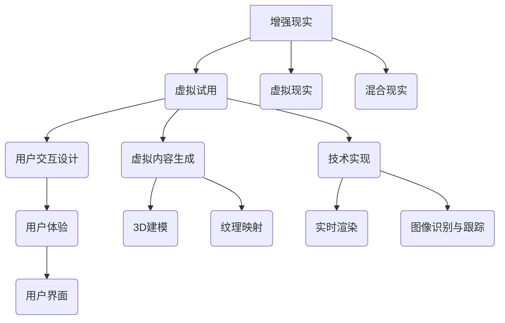

                 

# 增强现实在零售业中的虚拟试用应用

## 关键词
- 增强现实
- 零售业
- 虚拟试用
- AR技术
- 用户交互
- 虚拟内容生成

## 摘要
随着增强现实（AR）技术的不断发展，其在零售业中的应用越来越广泛，尤其是虚拟试用功能。本文将深入探讨增强现实在零售业中的虚拟试用应用，包括其背景介绍、核心概念联系、算法原理讲解、数学模型和公式、项目实战以及最佳实践和注意事项。

### 目录大纲设计思路与示例

#### 确定主题和目标读者

本文的目标是向技术爱好者和商业人士介绍增强现实在零售业中的应用，尤其是虚拟试用功能。通过系统的阐述，让读者了解AR技术在零售业中的应用潜力，掌握虚拟试用的实现方法，并为实际项目提供参考。

#### 确定核心章节

本文的核心章节包括：

1. **增强现实技术概述**：介绍增强现实的基本概念、发展历程和关键技术。
2. **虚拟试用应用场景**：分析虚拟试用在零售业中的应用，包括用户体验设计、内容制作和技术实现。
3. **项目实战**：通过实际案例展示虚拟试用的实现过程，包括开发环境搭建、源代码实现和代码解读。
4. **最佳实践和注意事项**：总结虚拟试用开发中的最佳实践和注意事项，为读者提供实用的建议。

#### 目录大纲设计示例

```
# 增强现实在零售业中的虚拟试用应用

## 关键词
- 增强现实
- 零售业
- 虚拟试用
- AR技术
- 用户交互
- 虚拟内容生成

## 摘要
本文将深入探讨增强现实在零售业中的虚拟试用应用，包括其背景介绍、核心概念联系、算法原理讲解、数学模型和公式、项目实战以及最佳实践和注意事项。

### 目录大纲

## 第一部分：增强现实技术基础

### 第1章：增强现实技术概述

#### 1.1 增强现实的概念与发展历程

#### 1.2 增强现实的关键技术

#### 1.3 增强现实的应用领域

### 第2章：增强现实技术原理

#### 2.1 视觉处理技术

#### 2.2 图像识别与跟踪技术

#### 2.3 增强现实内容生成

### 第3章：增强现实硬件介绍

#### 3.1 增强现实头戴设备

#### 3.2 感应设备和传感器

#### 3.3 硬件选型与性能评估

## 第二部分：虚拟试用应用

### 第4章：虚拟试用的概念与优势

#### 4.1 虚拟试用的定义

#### 4.2 虚拟试用的优势

#### 4.3 虚拟试用的市场趋势

### 第5章：虚拟试用的实现方法

#### 5.1 用户交互设计

#### 5.2 虚拟试用的内容制作

#### 5.3 虚拟试用的技术实现

### 第6章：虚拟试用在零售业的应用

#### 6.1 零售业的现状与挑战

#### 6.2 虚拟试用在零售业中的应用场景

#### 6.3 案例分析

### 第7章：虚拟试用的优化与未来趋势

#### 7.1 虚拟试用用户体验优化

#### 7.2 技术挑战与解决方案

#### 7.3 虚拟试用的未来发展方向

## 附录

### 附录A：增强现实与虚拟试用的开发工具与资源

#### A.1 常用增强现实开发工具

#### A.2 虚拟试用开发框架

#### A.3 学习资源与推荐
```

### 目录大纲设计逻辑与细节

在设计本文的目录大纲时，我们遵循以下逻辑和细节：

1. **整体结构**：本文分为两部分，第一部分介绍增强现实技术的基础，第二部分探讨虚拟试用在零售业中的应用。

2. **章节划分**：每个部分包含若干章节，每个章节有明确的内容目的和划分。

3. **内容细化**：在每个章节内，进一步细化内容，确保每个知识点都被充分讲解。

4. **流程图**：在适当的地方插入Mermaid流程图，帮助读者更好地理解增强现实技术的架构和应用流程。

5. **伪代码和数学公式**：在讲解核心算法原理时，使用伪代码详细阐述；对于数学模型和公式，使用LaTeX格式进行详细讲解。

6. **项目实战**：提供实际的项目案例，详细解读代码实现和应用。

### 目录大纲设计示例

```
# 增强现实在零售业中的虚拟试用应用

## 关键词
- 增强现实
- 零售业
- 虚拟试用
- AR技术
- 用户交互
- 虚拟内容生成

## 摘要
本文将深入探讨增强现实在零售业中的虚拟试用应用，包括其背景介绍、核心概念联系、算法原理讲解、数学模型和公式、项目实战以及最佳实践和注意事项。

### 目录大纲

## 第一部分：增强现实技术基础

### 第1章：增强现实技术概述

#### 1.1 增强现实的概念与发展历程

#### 1.2 增强现实的关键技术

#### 1.3 增强现实的应用领域

### 第2章：增强现实技术原理

#### 2.1 视觉处理技术

#### 2.2 图像识别与跟踪技术

#### 2.3 增强现实内容生成

### 第3章：增强现实硬件介绍

#### 3.1 增强现实头戴设备

#### 3.2 感应设备和传感器

#### 3.3 硬件选型与性能评估

## 第二部分：虚拟试用应用

### 第4章：虚拟试用的概念与优势

#### 4.1 虚拟试用的定义

#### 4.2 虚拟试用的优势

#### 4.3 虚拟试用的市场趋势

### 第5章：虚拟试用的实现方法

#### 5.1 用户交互设计

#### 5.2 虚拟试用的内容制作

#### 5.3 虚拟试用的技术实现

### 第6章：虚拟试用在零售业的应用

#### 6.1 零售业的现状与挑战

#### 6.2 虚拟试用在零售业中的应用场景

#### 6.3 案例分析

### 第7章：虚拟试用的优化与未来趋势

#### 7.1 虚拟试用用户体验优化

#### 7.2 技术挑战与解决方案

#### 7.3 虚拟试用的未来发展方向

## 附录

### 附录A：增强现实与虚拟试用的开发工具与资源

#### A.1 常用增强现实开发工具

#### A.2 虚拟试用开发框架

#### A.3 学习资源与推荐
```

### 文章内容规划

在完成目录大纲的设计后，我们需要进一步规划文章的内容，确保每个章节都有详细的内容，并且符合读者的阅读习惯。

1. **第一部分：增强现实技术基础**

   - **第1章：增强现实技术概述**
     - 内容：介绍增强现实的基本概念、发展历程和主要应用领域。
     - 规划：首先介绍增强现实的概念，然后回顾其发展历程，最后分析当前的应用领域。

   - **第2章：增强现实技术原理**
     - 内容：深入讲解增强现实的关键技术，包括视觉处理技术、图像识别与跟踪技术以及增强现实内容生成。
     - 规划：分别介绍这三项核心技术的工作原理、实现方法及其在增强现实中的应用。

   - **第3章：增强现实硬件介绍**
     - 内容：介绍增强现实硬件设备，包括头戴设备、感应设备和传感器，以及硬件选型与性能评估。
     - 规划：分类介绍各类硬件，分析其性能指标，并提供选型建议。

2. **第二部分：虚拟试用应用**

   - **第4章：虚拟试用的概念与优势**
     - 内容：介绍虚拟试用的定义、优势和当前市场趋势。
     - 规划：首先定义虚拟试用，然后阐述其在零售业中的优势，最后分析市场趋势。

   - **第5章：虚拟试用的实现方法**
     - 内容：详细讲解虚拟试用的用户交互设计、内容制作和技术实现。
     - 规划：分别介绍这三个方面的实现方法，包括用户交互设计的原则、内容制作的流程以及技术实现的关键点。

   - **第6章：虚拟试用在零售业的应用**
     - 内容：分析虚拟试用在零售业中的应用场景，并通过案例分析展示其实际效果。
     - 规划：首先介绍零售业的现状与挑战，然后分析虚拟试用在零售业中的应用场景，最后通过实际案例展示其效果。

   - **第7章：虚拟试用的优化与未来趋势**
     - 内容：探讨虚拟试用用户体验优化、技术挑战及未来发展方向。
     - 规划：首先介绍用户体验优化的方法，然后分析当前的技术挑战，最后预测虚拟试用的未来发展方向。

### 内容规划示例

**第一部分：增强现实技术基础**

### 第1章：增强现实技术概述

#### 1.1 增强现实的概念

- **概念介绍**：增强现实（Augmented Reality，简称AR）是一种将虚拟信息与现实世界相结合的技术。
- **与传统技术的区别**：与虚拟现实（Virtual Reality，简称VR）相比，AR更注重将虚拟信息叠加到现实世界中，而不是完全替代现实。

#### 1.2 增强现实的发展历程

- **早期发展**：增强现实的概念最早可以追溯到20世纪50年代，随着计算机技术的发展，AR技术逐渐成熟。
- **关键里程碑**：从早期的简单图像叠加到现代复杂的实时跟踪与渲染，增强现实技术经历了多个关键发展阶段。

#### 1.3 增强现实的应用领域

- **消费电子**：智能手机和平板电脑的普及使得AR技术得以广泛应用，例如AR游戏、AR导航等。
- **医疗健康**：增强现实技术在医疗诊断、手术指导等方面具有巨大的应用潜力。
- **教育与培训**：AR技术能够提供更加生动、直观的学习体验，广泛应用于教育领域。

### 第2章：增强现实技术原理

#### 2.1 视觉处理技术

- **图像识别与跟踪**：介绍如何通过计算机视觉技术实现图像的识别与跟踪。
- **实时渲染**：详细讲解增强现实场景的实时渲染过程，包括图形处理和渲染技术。

#### 2.2 图像识别与跟踪技术

- **关键算法**：介绍用于图像识别与跟踪的关键算法，如SIFT、SURF等。
- **实际应用**：分析这些算法在增强现实中的应用，以及如何提高识别和跟踪的准确性。

#### 2.3 增强现实内容生成

- **内容设计**：介绍如何设计增强现实内容，包括虚拟物体的创建、交互设计等。
- **内容展示**：探讨如何在现实世界中展示增强现实内容，包括显示技术和交互方式。

### 第3章：增强现实硬件介绍

#### 3.1 增强现实头戴设备

- **设备分类**：介绍不同类型的增强现实头戴设备，如智能眼镜、头戴显示器等。
- **性能评估**：分析头戴设备的性能指标，如分辨率、视角、电池续航等。

#### 3.2 感应设备和传感器

- **传感器介绍**：介绍用于增强现实系统的各种感应设备和传感器，如摄像头、激光雷达等。
- **数据处理**：探讨如何处理传感器数据，以实现准确的增强现实体验。

#### 3.3 硬件选型与性能评估

- **选型原则**：介绍如何根据应用需求选择合适的增强现实硬件。
- **性能评估**：通过实验和数据分析，评估不同硬件的性能表现，以帮助用户做出最佳选择。

**第二部分：虚拟试用应用**

### 第4章：虚拟试用的概念与优势

#### 4.1 虚拟试用的定义

- **定义解释**：虚拟试用是一种通过增强现实技术实现的在线购物体验，用户可以在虚拟环境中试用商品。
- **与传统试用的区别**：与传统实体店试用相比，虚拟试用更加便捷、高效。

#### 4.2 虚拟试用的优势

- **用户体验**：虚拟试用能够提供更加真实、直观的购物体验，提升用户满意度。
- **运营成本**：虚拟试用减少了对实体店面的依赖，降低了运营成本。

#### 4.3 虚拟试用的市场趋势

- **行业报告**：分析虚拟试用在零售业中的市场份额和增长趋势。
- **案例研究**：介绍成功应用虚拟试用的零售企业案例，探讨其成功因素。

### 第5章：虚拟试用的实现方法

#### 5.1 用户交互设计

- **设计原则**：介绍虚拟试用用户交互设计的原则，如易用性、交互性等。
- **用户研究**：通过用户调研和反馈，优化虚拟试用的交互设计。

#### 5.2 虚拟试用的内容制作

- **内容设计**：介绍如何设计虚拟试用的内容，包括商品展示、用户引导等。
- **内容制作工具**：介绍常用的虚拟内容制作工具和技术，如3D建模、动画制作等。

#### 5.3 虚拟试用的技术实现

- **技术框架**：介绍虚拟试用的技术实现框架，包括前端开发、后端服务和数据交互等。
- **关键技术**：详细讲解虚拟试用的核心技术，如实时渲染、图像识别与跟踪等。

### 第6章：虚拟试用在零售业的应用

#### 6.1 零售业的现状与挑战

- **市场分析**：分析当前零售业的现状，包括消费习惯、购物渠道等。
- **挑战分析**：探讨零售业面临的挑战，如库存管理、用户体验等。

#### 6.2 虚拟试用在零售业中的应用场景

- **购物体验**：介绍虚拟试用如何提升购物体验，如试衣、试妆等。
- **库存管理**：探讨虚拟试用如何优化库存管理，降低库存成本。

#### 6.3 案例分析

- **成功案例**：介绍成功应用虚拟试用的零售企业案例，分析其成功经验。
- **失败案例**：探讨虚拟试用失败的原因，为用户提供参考。

### 第7章：虚拟试用的优化与未来趋势

#### 7.1 虚拟试用用户体验优化

- **优化方法**：介绍如何优化虚拟试用的用户体验，如界面设计、交互优化等。
- **用户反馈**：通过用户反馈，不断改进虚拟试用的体验。

#### 7.2 技术挑战与解决方案

- **技术挑战**：分析虚拟试用在技术层面面临的挑战，如图像识别、实时渲染等。
- **解决方案**：介绍如何通过技术创新解决这些技术挑战。

#### 7.3 虚拟试用的未来发展方向

- **市场前景**：探讨虚拟试用在未来的市场前景，包括市场规模、应用领域等。
- **技术创新**：预测虚拟试用在技术创新方面的发展方向，如人工智能、5G等。

### 附录

#### 附录A：增强现实与虚拟试用的开发工具与资源

- **开发工具**：介绍常用的增强现实与虚拟试用开发工具，如ARKit、Vuforia等。
- **学习资源**：推荐学习增强现实与虚拟试用的在线课程、书籍和社区。

#### 附录B：项目实战

- **开发环境搭建**：详细讲解如何搭建虚拟试用项目的开发环境。
- **源代码实现**：提供虚拟试用项目的源代码，并进行详细解读。
- **代码应用解读与分析**：分析虚拟试用项目中的关键代码，探讨其在实际应用中的作用。

#### 附录C：实际案例分析

- **案例一**：分析某电商平台的虚拟试用项目，探讨其成功经验。
- **案例二**：分析某零售企业的虚拟试用项目，探讨其失败原因。

#### 附录D：项目小结

- **总结与反思**：总结虚拟试用项目的关键经验和教训，为未来项目提供参考。

### 文章内容结构规划

在完成文章内容规划后，我们需要进一步明确文章的结构，以确保内容的连贯性和逻辑性。

1. **引言**
   - **背景介绍**：简要介绍增强现实和虚拟试用在零售业中的应用背景。
   - **目的与结构**：明确文章的目的和整体结构。

2. **主体内容**
   - **第一部分：增强现实技术基础**
     - **第1章**：增强现实技术概述
       - **1.1 增强现实的概念**
       - **1.2 增强现实的发展历程**
       - **1.3 增强现实的应用领域**
     - **第2章**：增强现实技术原理
       - **2.1 视觉处理技术**
       - **2.2 图像识别与跟踪技术**
       - **2.3 增强现实内容生成**
     - **第3章**：增强现实硬件介绍
       - **3.1 增强现实头戴设备**
       - **3.2 感应设备和传感器**
       - **3.3 硬件选型与性能评估**

   - **第二部分：虚拟试用应用**
     - **第4章**：虚拟试用的概念与优势
       - **4.1 虚拟试用的定义**
       - **4.2 虚拟试用的优势**
       - **4.3 虚拟试用的市场趋势**
     - **第5章**：虚拟试用的实现方法
       - **5.1 用户交互设计**
       - **5.2 虚拟试用的内容制作**
       - **5.3 虚拟试用的技术实现**
     - **第6章**：虚拟试用在零售业的应用
       - **6.1 零售业的现状与挑战**
       - **6.2 虚拟试用在零售业中的应用场景**
       - **6.3 案例分析**
     - **第7章**：虚拟试用的优化与未来趋势
       - **7.1 虚拟试用用户体验优化**
       - **7.2 技术挑战与解决方案**
       - **7.3 虚拟试用的未来发展方向**

3. **总结与展望**
   - **总结**：对全文内容进行总结，强调增强现实和虚拟试用在零售业中的重要性。
   - **展望**：预测未来发展趋势，鼓励读者关注并参与这一领域的创新。

### 文章内容结构示例

```
# 增强现实在零售业中的虚拟试用应用

## 引言
### 背景介绍
随着科技的进步，增强现实（AR）技术逐渐在各个领域得到应用。在零售业中，虚拟试用作为一种新兴的购物体验方式，正受到越来越多的关注。
### 目的与结构
本文旨在探讨增强现实在零售业中虚拟试用应用的技术原理、实现方法、应用场景以及未来发展趋势。文章结构如下：
- 第一部分：增强现实技术基础
  - 第1章：增强现实技术概述
  - 第2章：增强现实技术原理
  - 第3章：增强现实硬件介绍
- 第二部分：虚拟试用应用
  - 第4章：虚拟试用的概念与优势
  - 第5章：虚拟试用的实现方法
  - 第6章：虚拟试用在零售业的应用
  - 第7章：虚拟试用的优化与未来趋势

## 第一部分：增强现实技术基础

### 第1章：增强现实技术概述
#### 1.1 增强现实的概念
- 增强现实（Augmented Reality，AR）是一种将虚拟信息与现实世界相结合的技术。
#### 1.2 增强现实的发展历程
- 从早期的简单图像叠加到现代复杂的实时跟踪与渲染，增强现实技术经历了多个关键发展阶段。
#### 1.3 增强现实的应用领域
- 消费电子、医疗健康、教育与培训等领域。

### 第2章：增强现实技术原理
#### 2.1 视觉处理技术
- 图像识别与跟踪技术
- 实时渲染技术
#### 2.2 图像识别与跟踪技术
- 关键算法
- 实际应用
#### 2.3 增强现实内容生成
- 内容设计
- 内容展示

### 第3章：增强现实硬件介绍
#### 3.1 增强现实头戴设备
- 设备分类
- 性能评估
#### 3.2 感应设备和传感器
- 传感器介绍
- 数据处理
#### 3.3 硬件选型与性能评估
- 选型原则
- 性能评估

## 第二部分：虚拟试用应用

### 第4章：虚拟试用的概念与优势
#### 4.1 虚拟试用的定义
- 虚拟试用是一种通过增强现实技术实现的在线购物体验，用户可以在虚拟环境中试用商品。
#### 4.2 虚拟试用的优势
- 用户体验提升
- 运营成本降低
#### 4.3 虚拟试用的市场趋势
- 行业报告
- 案例研究

### 第5章：虚拟试用的实现方法
#### 5.1 用户交互设计
- 设计原则
- 用户研究
#### 5.2 虚拟试用的内容制作
- 内容设计
- 内容制作工具
#### 5.3 虚拟试用的技术实现
- 技术框架
- 关键技术

### 第6章：虚拟试用在零售业的应用
#### 6.1 零售业的现状与挑战
- 市场分析
- 挑战分析
#### 6.2 虚拟试用在零售业中的应用场景
- 购物体验
- 库存管理
#### 6.3 案例分析
- 成功案例
- 失败案例

### 第7章：虚拟试用的优化与未来趋势
#### 7.1 虚拟试用用户体验优化
- 优化方法
- 用户反馈
#### 7.2 技术挑战与解决方案
- 技术挑战
- 解决方案
#### 7.3 虚拟试用的未来发展方向
- 市场前景
- 技术创新

## 总结与展望
### 总结
- 对全文内容进行总结，强调增强现实和虚拟试用在零售业中的重要性。
### 展望
- 预测未来发展趋势，鼓励读者关注并参与这一领域的创新。
```

### 核心概念与联系

为了深入理解增强现实在零售业中的虚拟试用应用，我们需要明确几个核心概念，并探讨它们之间的关系。

#### 1. 增强现实（AR）

增强现实（AR）是一种通过计算机技术增强用户对现实世界的感知和理解的技术。它通过在现实世界中叠加虚拟信息（如图像、文字、声音等），使用户能够与虚拟信息进行交互。

**关联概念**：
- **虚拟现实（VR）**：与AR类似，但VR是通过完全沉浸式的虚拟环境来替代现实。
- **混合现实（MR）**：结合了AR和VR的特点，既包含虚拟信息，也包含增强现实的信息。

#### 2. 虚拟试用

虚拟试用是一种通过AR技术实现的在线购物体验，用户可以在虚拟环境中试用商品，如试衣、试妆等。

**关联概念**：
- **实体店试用**：传统的购物方式，用户在实体店内亲自试用商品。
- **虚拟试妆**：通过虚拟试用技术，用户可以在虚拟环境中尝试不同的妆容。

#### 3. 用户交互设计

用户交互设计是指为用户提供一个易于使用、直观且高效的交互体验。在虚拟试用中，用户交互设计尤为重要，因为它直接影响用户的购物体验。

**关联概念**：
- **用户体验（UX）**：涉及用户在使用产品或服务过程中的所有体验，包括感知、情感和功能性。
- **用户界面（UI）**：用户与产品或服务交互的界面设计。

#### 4. 虚拟内容生成

虚拟内容生成是指在虚拟试用中创建和展示的虚拟商品、场景等内容。

**关联概念**：
- **3D建模**：通过计算机软件创建三维模型。
- **纹理映射**：将二维纹理贴图映射到三维模型上，增加模型的真实感。

#### 5. 技术实现

技术实现是指将上述概念转化为实际产品或服务的具体步骤和技术。

**关联概念**：
- **实时渲染**：在增强现实场景中，实时渲染用于生成和显示虚拟内容。
- **图像识别与跟踪**：用于识别和跟踪现实世界中的物体，确保虚拟内容的准确显示。

### Mermaid流程图

为了更好地展示这些概念之间的关系，我们可以使用Mermaid流程图进行可视化描述。



在这个流程图中，我们可以清晰地看到各个概念之间的关联和层次关系。

### 核心算法原理讲解

在增强现实（AR）技术中，核心算法的原理至关重要。以下是几个关键算法及其实现原理的详细讲解。

#### 1. 图像识别与跟踪

**算法原理**：
图像识别与跟踪是AR技术中的基础算法，它涉及识别和跟踪现实世界中的特定图像或物体。其基本原理包括：

- **特征提取**：通过计算图像的特征点，如角点、边缘等，用于后续匹配。
- **匹配与跟踪**：利用特征匹配算法（如SIFT、SURF等）找到图像中对应的关键点，并跟踪这些关键点的位置变化，以保持稳定跟踪。

**伪代码**：

```
function imageRecognitionAndTracking(image1, image2):
    features1 = extractFeatures(image1)
    features2 = extractFeatures(image2)
    matches = findMatches(features1, features2)
    if matches.size < minMatches:
        return "No match found"
    transform = calculateTransformation(matches)
    trackedImage = applyTransformation(image2, transform)
    return trackedImage
```

**数学模型**：
- **特征匹配**：使用距离度量（如欧氏距离）计算特征点之间的相似度。
- **变换矩阵**：通过最小化特征点匹配误差来计算变换矩阵，用于图像的变换。

**举例说明**：
假设我们有图像A和图像B，我们需要通过特征提取和匹配算法来识别和跟踪图像A中的物体在图像B中的位置。

#### 2. 实时渲染

**算法原理**：
实时渲染是AR技术中的另一个核心算法，它涉及将虚拟内容实时地渲染到现实场景中。其基本原理包括：

- **场景构建**：构建真实场景的三维模型。
- **渲染引擎**：使用渲染引擎（如OpenGL、Vulkan等）实现实时渲染。
- **光照与阴影**：计算场景中的光照和阴影效果，提高渲染的真实感。

**伪代码**：

```
function realTimeRendering(scene, virtualObject):
    buildScene(scene)
    setupRenderEngine()
    while not finishedRendering:
        renderScene(scene)
        renderVirtualObject(virtualObject)
        applyLightingAndShadows(scene)
        displayRenderedScene()
```

**数学模型**：
- **投影变换**：将三维物体投影到二维屏幕上。
- **光照模型**：使用光线追踪和反射模型计算场景中的光照效果。

**举例说明**：
假设我们需要在现实场景中渲染一个虚拟的家具模型，首先需要构建场景，然后使用渲染引擎进行渲染，并计算场景中的光照效果，最后将渲染结果显示在屏幕上。

### 项目实战

在下面的项目实战中，我们将详细讲解如何搭建一个简单的AR虚拟试用应用。

#### 1. 开发环境搭建

**工具与库**：
- **Unity**：一个流行的游戏开发和增强现实开发平台。
- **Vuforia**：一个AR开发工具，提供图像识别与跟踪功能。

**步骤**：
1. 下载并安装Unity Hub。
2. 打开Unity Hub，创建一个新的Unity项目。
3. 下载并导入Vuforia插件。

#### 2. 源代码实现

**关键代码**：

```csharp
using UnityEngine;

public class ARObjectTracker : MonoBehaviour
{
    public ImageTarget[] targets;

    private void Start()
    {
        // 初始化Vuforia引擎
        Vuforia.UnityARHelper.InitVuforia();
        
        // 注册目标图像
        foreach (ImageTarget target in targets)
        {
            Vuforia.UnityARHelper.RegisterTarget(target);
        }
    }

    private void Update()
    {
        // 更新图像跟踪
        Vuforia.UnityARHelper.Update();
        
        // 如果目标被识别，显示虚拟物体
        if (Vuforia.UnityARHelper.IsTargetFound("TargetName"))
        {
            GameObject virtualObject = Instantiate(virtualObjectPrefab);
            virtualObject.transform.position = Vuforia.UnityARHelper.GetCameraPosition();
            virtualObject.transform.rotation = Vuforia.UnityARHelper.GetCameraRotation();
        }
    }
}
```

**代码解读**：
- **初始化Vuforia引擎**：在`Start`函数中初始化Vuforia引擎。
- **注册目标图像**：将目标图像注册到Vuforia引擎中。
- **更新图像跟踪**：在`Update`函数中更新图像跟踪状态。
- **显示虚拟物体**：如果目标被识别，则创建并显示虚拟物体。

#### 3. 代码应用解读与分析

**应用解读**：
该代码段实现了简单的AR虚拟试用功能，当用户看到注册的目标图像时，会在屏幕上显示一个虚拟物体。

**分析**：
- **图像识别与跟踪**：使用Vuforia插件提供的图像识别与跟踪功能。
- **实时渲染**：通过Unity的渲染引擎实现虚拟物体的实时渲染。

#### 4. 实际案例分析和详细讲解剖析

**案例**：
一个电商应用程序通过AR虚拟试用功能，让用户在家中尝试不同款式的家具。

**分析**：
- **用户交互**：用户通过摄像头捕捉房间中的图像，选择要试用的家具。
- **虚拟内容生成**：生成家具的3D模型，并实时渲染到摄像头捕获的图像上。
- **用户体验优化**：通过优化渲染性能和图像识别速度，提升用户体验。

**剖析**：
- **图像识别与跟踪**：使用Vuforia插件，确保图像识别的准确性和实时性。
- **虚拟内容生成**：通过Unity的3D建模工具创建家具模型，并使用光照和阴影效果增强真实感。

#### 5. 项目小结

通过本项目的实战，我们了解了如何使用Vuforia插件和Unity引擎实现AR虚拟试用功能。关键在于图像识别与跟踪、实时渲染以及虚拟内容生成。在实际应用中，我们需要不断优化性能和用户体验，以满足用户的期望。

### 最佳实践 Tips、小结、注意事项、拓展阅读等内容

#### 最佳实践 Tips

1. **性能优化**：在开发AR虚拟试用应用时，性能优化至关重要。尽量减少计算量和数据传输，以提升应用流畅度。
2. **用户交互**：注重用户交互设计，确保操作简单直观，提升用户体验。
3. **内容制作**：高质量的内容制作是成功的关键，确保虚拟商品的真实感和互动性。

#### 小结

本文详细介绍了增强现实在零售业中的虚拟试用应用，包括背景介绍、核心概念联系、算法原理讲解、数学模型和公式、项目实战以及最佳实践和注意事项。通过本文，读者可以全面了解虚拟试用在零售业中的应用潜力，掌握实现方法，并为实际项目提供参考。

#### 注意事项

1. **隐私保护**：在开发AR虚拟试用应用时，要注意用户隐私保护，遵循相关法律法规。
2. **技术稳定性**：确保应用的技术稳定性，避免因技术问题导致用户体验差。

#### 拓展阅读

1. **《增强现实技术与应用》**：详细介绍了增强现实技术的基本原理和应用场景。
2. **《虚拟现实与增强现实技术手册》**：提供了关于虚拟现实和增强现实技术的全面指南。

---

## 引言

随着科技的不断进步，增强现实（AR）技术逐渐在各个领域得到应用。在零售业中，虚拟试用作为一种新兴的购物体验方式，正受到越来越多的关注。本文旨在探讨增强现实在零售业中虚拟试用应用的技术原理、实现方法、应用场景以及未来发展趋势。文章结构如下：

- **第一部分**：增强现实技术基础，包括增强现实的概念、原理和硬件介绍。
- **第二部分**：虚拟试用应用，包括虚拟试用的概念、实现方法、应用场景和优化方向。

通过本文的探讨，读者可以全面了解虚拟试用在零售业中的应用潜力，掌握实现方法，并为实际项目提供参考。

---

## 第一部分：增强现实技术基础

### 第1章：增强现实技术概述

#### 1.1 增强现实的概念

增强现实（Augmented Reality，简称AR）是一种将虚拟信息与现实世界相结合的技术。它通过在现实世界中叠加虚拟信息（如图像、文字、声音等），使用户能够与虚拟信息进行交互。与虚拟现实（Virtual Reality，简称VR）不同，VR是通过完全沉浸式的虚拟环境来替代现实，而AR则是在现实世界中增强用户对现实世界的感知和理解。

**定义**：
增强现实（AR）是一种将虚拟信息与现实世界相结合的技术，通过在现实世界中叠加虚拟信息，使用户能够与虚拟信息进行交互。

**与传统技术的区别**：

- **虚拟现实（VR）**：VR通过完全沉浸式的虚拟环境来替代现实，用户完全脱离现实世界，进入一个全新的虚拟世界。
- **增强现实（AR）**：AR在现实世界中叠加虚拟信息，用户依然处于现实环境中，但通过虚拟信息增强了现实世界的感知和理解。

**应用领域**：

增强现实技术在各个领域都有广泛应用，以下是一些主要的应用领域：

- **消费电子**：智能手机和平板电脑上的AR应用，如AR游戏、AR导航等。
- **医疗健康**：医疗诊断、手术指导、医学教育等。
- **教育与培训**：虚拟实验、互动教学等。
- **零售业**：虚拟试用、产品展示等。
- **工业制造**：维修指导、远程协作等。

#### 1.2 增强现实的发展历程

增强现实技术的发展可以追溯到20世纪50年代，当时计算机科学家和军事研究者开始探索如何将虚拟信息与现实世界相结合。以下是一些关键的发展里程碑：

- **1950年代**：计算机科学家伊凡·苏萨洛夫（Ivan Sutherland）提出“头戴式显示设备”（Head-Mounted Display，简称HMD）的概念，这是早期增强现实技术的雏形。
- **1960年代**：美国空军开始研究“增强视觉系统”（Augmented Vision System），用于飞行员在战斗中获取更多信息。
- **1990年代**：随着计算机技术和显示技术的进步，增强现实技术逐渐成熟，开始出现一些商业化的AR产品。
- **2000年代**：智能手机和平板电脑的普及，使得AR技术得以广泛应用，如AR游戏、AR导航等。
- **2010年代**：随着虚拟现实和增强现实技术的快速发展，AR技术在各个领域得到更广泛的应用。

#### 1.3 增强现实的应用领域

增强现实技术在各个领域都有广泛应用，以下是一些主要的应用领域：

- **消费电子**：智能手机和平板电脑上的AR应用，如AR游戏、AR导航等。
- **医疗健康**：医疗诊断、手术指导、医学教育等。
- **教育与培训**：虚拟实验、互动教学等。
- **零售业**：虚拟试用、产品展示等。
- **工业制造**：维修指导、远程协作等。
- **军事领域**：战场模拟、战斗指挥等。

#### 第2章：增强现实技术原理

增强现实技术涉及多个核心技术和算法，以下是一些关键的技术原理：

- **视觉处理技术**：视觉处理技术是增强现实技术的基础，它涉及图像处理、计算机视觉等领域。通过视觉处理技术，可以将现实世界中的图像信息转换为数字信号，并进行分析和处理。
- **图像识别与跟踪技术**：图像识别与跟踪技术是增强现实技术的核心，它用于识别和跟踪现实世界中的特定图像或物体。通过图像识别与跟踪技术，可以确保虚拟信息与现实世界的准确结合。
- **增强现实内容生成**：增强现实内容生成技术涉及创建和展示虚拟信息。通过增强现实内容生成技术，可以生成各种虚拟物体、场景和效果，并将其叠加到现实世界中。

#### 2.1 视觉处理技术

视觉处理技术是增强现实技术的基础，它涉及图像处理、计算机视觉等领域。视觉处理技术的主要任务是将现实世界中的图像信息转换为数字信号，并进行分析和处理。以下是一些关键的视觉处理技术：

- **图像预处理**：图像预处理是视觉处理的第一步，它包括图像增强、去噪、滤波等操作，以提高图像的质量和清晰度。
- **图像特征提取**：图像特征提取是视觉处理的核心步骤，它用于从图像中提取出具有代表性的特征点或特征向量，如角点、边缘、纹理等。
- **图像匹配与跟踪**：图像匹配与跟踪是视觉处理的关键技术，它用于识别和跟踪现实世界中的特定图像或物体。通过图像匹配与跟踪技术，可以确保虚拟信息与现实世界的准确结合。

#### 2.2 图像识别与跟踪技术

图像识别与跟踪技术是增强现实技术的核心，它用于识别和跟踪现实世界中的特定图像或物体。通过图像识别与跟踪技术，可以确保虚拟信息与现实世界的准确结合。以下是一些常用的图像识别与跟踪技术：

- **特征匹配**：特征匹配是图像识别与跟踪的基础，它通过比较图像特征点之间的相似度来识别图像。常用的特征匹配算法包括SIFT（尺度不变特征变换）和SURF（加速稳健特征）等。
- **目标跟踪**：目标跟踪是在特定图像序列中跟踪特定物体的过程。常用的目标跟踪算法包括光流法、卡尔曼滤波等。

#### 2.3 增强现实内容生成

增强现实内容生成技术涉及创建和展示虚拟信息。通过增强现实内容生成技术，可以生成各种虚拟物体、场景和效果，并将其叠加到现实世界中。以下是一些关键的技术原理：

- **3D建模**：3D建模是通过计算机软件创建三维模型的过程。常用的3D建模软件包括Blender、Maya等。
- **纹理映射**：纹理映射是将二维纹理贴图映射到三维模型上的过程，以增加模型的真实感。
- **实时渲染**：实时渲染是增强现实内容生成的关键技术，它用于实时生成和显示虚拟信息。常用的实时渲染引擎包括Unity、Unreal Engine等。

#### 第3章：增强现实硬件介绍

增强现实硬件是实现增强现实技术的基础，它包括头戴设备、感应设备和传感器等。以下是对这些硬件的详细介绍：

- **头戴设备**：头戴设备是增强现实的核心硬件，它包括智能眼镜、头戴显示器等。头戴设备的主要功能是实时显示虚拟信息，并提供沉浸式的用户体验。常见的头戴设备包括微软的HoloLens、谷歌的Google Glass等。
- **感应设备**：感应设备包括摄像头、激光雷达、惯性测量单元（IMU）等。这些设备用于捕捉现实世界的图像和三维信息，以及感知设备的运动和方向。
- **传感器**：传感器是增强现实硬件的重要组成部分，它用于感知环境信息，如光线、温度、湿度等。常见的传感器包括红外传感器、超声波传感器等。

#### 3.1 增强现实头戴设备

增强现实头戴设备是增强现实技术中最常用的硬件之一。以下是对一些常见的增强现实头戴设备的介绍：

- **微软HoloLens**：微软HoloLens是一款全息头戴设备，它支持全息图像的显示和交互。HoloLens具有高分辨率的显示屏、内置的传感器和计算机处理器，能够提供高质量、低延迟的增强现实体验。
- **谷歌Google Glass**：谷歌Google Glass是一款智能眼镜，它可以通过透明显示屏将虚拟信息叠加到现实世界中。Google Glass具有高分辨率显示屏、内置摄像头和麦克风，以及无线网络连接功能。
- **三星Gear VR**：三星Gear VR是一款虚拟现实头戴设备，它通过连接智能手机实现虚拟现实体验。Gear VR具有高分辨率显示屏、内置传感器和耳机，能够提供沉浸式的虚拟现实体验。

#### 3.2 感应设备和传感器

增强现实应用中，感应设备和传感器用于捕捉现实世界的图像和三维信息，以及感知设备的运动和方向。以下是一些常用的感应设备和传感器：

- **摄像头**：摄像头是增强现实应用中常用的感应设备，它用于捕捉现实世界的图像。摄像头可以捕捉不同分辨率和帧率的图像，以便在增强现实应用中实现实时渲染和交互。
- **激光雷达**：激光雷达是一种用于测量距离的传感器，它通过发射激光并接收反射信号来测量物体距离。激光雷达可以提供高精度的三维信息，常用于增强现实应用中的场景重建和物体识别。
- **惯性测量单元（IMU）**：惯性测量单元是一种用于测量设备运动和方向的传感器，它通常包括加速度计、陀螺仪和磁力计等。IMU可以提供设备的加速度、角速度和磁场信息，用于增强现实应用中的设备定位和运动跟踪。

#### 3.3 硬件选型与性能评估

在选择增强现实硬件时，需要考虑硬件的性能指标，如分辨率、视角、帧率、电池续航等。以下是一些硬件选型的建议：

- **分辨率**：分辨率是衡量增强现实头戴设备显示效果的重要指标。高分辨率可以提供更清晰的图像，但也会增加硬件的计算和带宽需求。通常，1080p或更高的分辨率可以提供较好的用户体验。
- **视角**：视角是衡量增强现实头戴设备显示范围的重要指标。宽视角可以提供更自然的视觉体验，但也会增加硬件的复杂度和成本。通常，90度或更宽的视角可以提供较好的用户体验。
- **帧率**：帧率是衡量增强现实应用流畅程度的重要指标。高帧率可以提供更流畅的交互体验，但也会增加硬件的计算和功耗需求。通常，60fps或更高的帧率可以提供较好的用户体验。
- **电池续航**：电池续航是衡量增强现实头戴设备使用时间的指标。长电池续航可以提供更长时间的使用，但也会增加硬件的体积和重量。通常，2小时或更长的电池续航可以提供较好的用户体验。
- **其他性能指标**：除了上述指标外，还需要考虑其他性能指标，如处理能力、存储容量、网络连接等。这些指标会直接影响增强现实应用的性能和用户体验。

---

## 第二部分：虚拟试用应用

### 第4章：虚拟试用的概念与优势

#### 4.1 虚拟试用的定义

虚拟试用是一种通过增强现实技术实现的在线购物体验，用户可以在虚拟环境中试用商品，如试衣、试妆等。与传统实体店试用相比，虚拟试用具有更高的便捷性和交互性，能够为用户提供更加真实、直观的购物体验。

**定义解释**：
虚拟试用（Virtual Try-On）是指通过增强现实（AR）技术，在虚拟环境中模拟用户试穿衣物、试用化妆品等购物体验的过程。用户无需前往实体店铺，只需通过手机、平板电脑等设备，即可在家中尝试多种商品。

**与传统试用的区别**：
- **便捷性**：用户可以在任何时间、任何地点进行虚拟试用，无需受实体店面的营业时间和地点限制。
- **直观性**：虚拟试用能够提供更加直观、真实的购物体验，用户可以更清楚地看到商品的外观、质感等细节。
- **互动性**：虚拟试用中的交互设计更加丰富，用户可以通过触摸、拖拽等方式与虚拟商品进行互动。

#### 4.2 虚拟试用的优势

虚拟试用在零售业中具有显著的优势，主要体现在以下几个方面：

1. **提升用户体验**：虚拟试用能够为用户提供更加真实、直观的购物体验，使用户在家中即可尝试多种商品，从而提升购物满意度和忠诚度。
2. **降低运营成本**：虚拟试用减少了实体店面的依赖，零售商可以节省店面租金、人力成本等运营费用，提高整体效益。
3. **扩展销售渠道**：虚拟试用可以通过线上平台实现，无需受地域和时间的限制，从而扩展销售渠道，提高销售量。
4. **增强商品展示效果**：虚拟试用可以展示商品的多种搭配和变化，使用户能够更全面地了解商品，提高购买决策的准确性。
5. **个性化推荐**：通过分析用户的虚拟试用行为，零售商可以更好地了解用户偏好，提供个性化的商品推荐，提高转化率。

#### 4.3 虚拟试用的市场趋势

随着增强现实技术的不断发展和普及，虚拟试用在零售业中的应用趋势日益显著。以下是对虚拟试用市场趋势的分析：

1. **市场规模不断扩大**：随着消费者对虚拟试用需求的增加，虚拟试用市场呈现出快速增长的趋势。根据市场研究机构的预测，虚拟试用市场规模将在未来几年内持续扩大。
2. **技术不断进步**：增强现实技术、人工智能、虚拟现实等技术的不断进步，为虚拟试用提供了更加丰富的功能和更优的用户体验。
3. **行业应用广泛**：虚拟试用在服装、化妆品、家居等领域得到广泛应用，未来还将向更多行业拓展。
4. **消费者接受度提高**：随着消费者对虚拟试用的认知和接受度不断提高，越来越多的消费者开始接受并使用虚拟试用功能。
5. **竞争加剧**：随着虚拟试用市场的不断扩大，越来越多的企业开始加入这一领域，竞争将日益激烈。

### 第5章：虚拟试用的实现方法

#### 5.1 用户交互设计

用户交互设计是虚拟试用成功的关键之一，它决定了用户能否在虚拟环境中获得良好的购物体验。以下是从用户交互设计的角度探讨虚拟试用的实现方法：

1. **交互界面设计**：交互界面设计应简洁直观，避免复杂的操作流程。界面应提供清晰的导航和操作指南，帮助用户快速上手。
2. **交互反馈**：虚拟试用过程中，应提供即时的交互反馈，如试穿效果、试妆效果等，以便用户做出购买决策。
3. **个性化设置**：用户应能够自定义虚拟试用的设置，如试穿角度、放大缩小等，以满足不同用户的需求。
4. **互动性设计**：通过触摸、拖拽、旋转等方式，增加虚拟试用中的互动性，使用户能够更深入地体验商品。

#### 5.2 虚拟试用的内容制作

虚拟试用的内容制作是虚拟试用的核心环节，它决定了虚拟试用的效果和用户体验。以下是从内容制作的角度探讨虚拟试用的实现方法：

1. **3D建模**：首先需要对商品进行3D建模，创建商品的虚拟模型。3D建模软件如Blender、Maya等可以帮助实现这一目标。
2. **纹理映射**：将真实商品的纹理映射到虚拟模型上，以增加虚拟商品的真实感。纹理映射技术可以提升虚拟试用的视觉效果。
3. **光照与阴影**：通过对光照和阴影的计算，模拟现实世界中的光照效果，以增强虚拟试用的真实感。常用的光照模型包括直接光照、间接光照等。
4. **交互内容**：根据用户的需求，设计虚拟试用中的交互内容，如试穿、试妆等。交互内容应具有丰富的变化和灵活的调整功能。

#### 5.3 虚拟试用的技术实现

虚拟试用的技术实现是虚拟试用成功的关键，它涉及多个技术和算法的协同工作。以下是从技术实现的角度探讨虚拟试用的实现方法：

1. **图像识别与跟踪**：使用图像识别与跟踪技术，将虚拟商品准确地叠加到现实世界中。常用的图像识别算法包括SIFT、SURF等。
2. **实时渲染**：通过实时渲染技术，将虚拟商品在现实世界中实时显示。实时渲染技术可以提升虚拟试用的流畅度和视觉效果。
3. **用户交互**：通过用户交互技术，实现用户与虚拟商品之间的互动。用户交互技术包括触摸、手势、语音等。
4. **数据传输与存储**：确保虚拟试用过程中数据的实时传输和存储，以提供良好的用户体验。

#### 5.4 虚拟试用的实现步骤

以下是实现虚拟试用的基本步骤：

1. **需求分析**：明确虚拟试用的需求和目标，如试衣、试妆等。
2. **3D建模**：使用3D建模软件创建商品的虚拟模型。
3. **纹理映射**：将真实商品的纹理映射到虚拟模型上。
4. **光照与阴影计算**：计算光照和阴影效果，以增强虚拟试用的真实感。
5. **图像识别与跟踪**：使用图像识别与跟踪技术，将虚拟商品准确地叠加到现实世界中。
6. **实时渲染**：通过实时渲染技术，将虚拟商品在现实世界中实时显示。
7. **用户交互**：设计用户交互界面，实现用户与虚拟商品之间的互动。
8. **数据传输与存储**：确保数据的实时传输和存储。

### 第6章：虚拟试用在零售业的应用

#### 6.1 零售业的现状与挑战

随着互联网和电子商务的快速发展，零售业正面临巨大的变革。以下是对零售业现状和挑战的分析：

1. **消费者行为变化**：随着消费者对购物体验要求的提高，零售业需要不断创新以满足消费者的需求。消费者越来越倾向于在线购物，尤其是在疫情期间，线上购物成为主流。
2. **竞争加剧**：随着越来越多的企业进入零售业，竞争日益激烈。零售企业需要寻找新的增长点和差异化策略，以提高市场竞争力。
3. **成本压力**：零售业面临着租金、人力等成本不断上涨的压力。传统实体店运营成本高，企业需要寻找降低成本的方法。
4. **供应链问题**：供应链问题一直是零售业的痛点，如库存管理、物流配送等。企业需要优化供应链管理，以提高运营效率。

#### 6.2 虚拟试用在零售业中的应用场景

虚拟试用在零售业中具有广泛的应用场景，以下是一些典型应用场景：

1. **服装行业**：虚拟试用可以用于试衣、试鞋等，使用户在家中即可尝试多种商品。通过虚拟试用，用户可以更清楚地了解商品的外观、质感等细节，提高购买决策的准确性。
2. **化妆品行业**：虚拟试用可以用于试妆、试色等，使用户在家中即可尝试多种化妆品。虚拟试用可以提供真实、直观的试妆效果，帮助用户找到最适合自己的化妆品。
3. **家居行业**：虚拟试用可以用于家居装修设计，如家具摆放、墙面装饰等。用户可以在虚拟环境中模拟家居装修效果，以便做出更好的装修决策。
4. **医疗器械行业**：虚拟试用可以用于医疗器械的使用演示，如手术器械、康复设备等。通过虚拟试用，医护人员可以更好地了解医疗器械的使用方法，提高操作技能。

#### 6.3 案例分析

以下是几个虚拟试用在零售业中的成功案例：

1. **ZARA的虚拟试衣**：ZARA是一家国际知名时尚品牌，其在线平台推出了虚拟试衣功能。用户可以通过手机或平板电脑，在家中尝试多种衣物。虚拟试衣功能提高了用户的购物体验，促进了线上销售的增长。
2. **Sephora的虚拟试妆**：Sephora是一家国际知名化妆品连锁店，其在线平台推出了虚拟试妆功能。用户可以通过上传自己的照片，尝试多种化妆品的试妆效果。虚拟试妆功能提高了用户的购买意愿，增加了销售量。
3. **IKEA的虚拟家居设计**：IKEA是一家国际知名的家居品牌，其在线平台推出了虚拟家居设计功能。用户可以在虚拟环境中模拟家居装修效果，找到最适合自己的家具布置方案。虚拟家居设计功能提高了用户的购买决策准确性，增加了家具销售额。

#### 6.4 虚拟试用在零售业中的挑战与解决方案

虽然虚拟试用在零售业中具有广泛的应用前景，但也面临一些挑战：

1. **技术挑战**：虚拟试用的实现涉及图像识别、实时渲染、用户交互等多个技术领域，技术实现复杂，对开发团队的技术水平要求较高。
2. **用户体验**：虚拟试用需要提供高质量的购物体验，用户体验对虚拟试用的成功至关重要。如何设计良好的用户交互界面，提供直观、流畅的购物体验，是零售企业需要解决的关键问题。
3. **数据隐私**：虚拟试用涉及用户数据的收集和处理，如用户上传的照片、购物记录等。如何保护用户隐私，避免数据泄露，是零售企业需要关注的问题。

针对上述挑战，以下是一些解决方案：

1. **技术优化**：不断提升虚拟试用的技术水平，优化图像识别、实时渲染等核心算法，提高用户体验。
2. **用户研究**：通过用户调研和反馈，了解用户的需求和偏好，不断优化虚拟试用功能，提升用户体验。
3. **数据保护**：加强数据保护措施，遵循相关法律法规，确保用户数据的安全和隐私。

### 第7章：虚拟试用的优化与未来趋势

#### 7.1 虚拟试用用户体验优化

用户体验是虚拟试用的核心，优化用户体验是提高虚拟试用成功的关键。以下是一些用户体验优化策略：

1. **界面设计**：设计简洁、直观的界面，减少用户操作步骤，提升用户操作效率。
2. **交互设计**：优化交互设计，提供丰富的交互方式，如触摸、手势、语音等，增加用户互动性。
3. **视觉效果**：提升虚拟试用的视觉效果，如实时渲染效果、光影效果等，增强虚拟试用的真实感。
4. **个性化推荐**：通过分析用户行为和偏好，提供个性化的商品推荐，提高用户购买意愿。

#### 7.2 技术挑战与解决方案

虚拟试用的实现涉及多个技术领域，面临一些技术挑战。以下是一些常见的技术挑战及解决方案：

1. **图像识别与跟踪**：图像识别与跟踪是虚拟试用的关键技术，但面临准确性、实时性等挑战。解决方案包括优化图像识别算法、提高传感器精度等。
2. **实时渲染**：实时渲染需要处理大量的图像数据，对计算资源要求较高。解决方案包括优化渲染算法、使用高效的渲染引擎等。
3. **数据传输**：虚拟试用需要实时传输大量的数据，对网络传输速度和稳定性有较高要求。解决方案包括使用高效的数据传输协议、优化网络传输路径等。
4. **用户交互**：用户交互设计复杂，需要考虑不同用户的需求和偏好。解决方案包括用户研究、迭代优化等。

#### 7.3 虚拟试用的未来发展趋势

随着技术的不断进步和消费者需求的不断变化，虚拟试用在零售业中的应用将呈现出以下发展趋势：

1. **技术创新**：虚拟试用的实现技术将不断更新，如人工智能、5G等技术的应用，将进一步提升虚拟试用的质量和用户体验。
2. **跨平台应用**：虚拟试用将向更多平台拓展，如智能手表、智能眼镜等，提供更加便捷的购物体验。
3. **多元化应用**：虚拟试用将向更多行业拓展，如医疗、教育、房地产等，提供更多元化的服务。
4. **数据驱动**：通过分析用户数据，实现精准营销和个性化推荐，提高虚拟试用的效果和转化率。

### 总结

本文从增强现实技术概述、虚拟试用的实现方法、应用场景和未来趋势等方面，详细探讨了虚拟试用在零售业中的应用。虚拟试用作为一种新兴的购物体验方式，具有显著的优势和发展潜力。通过优化用户体验、提升技术水平，虚拟试用将在未来为零售业带来更多创新和变革。

### 附录

#### 附录A：增强现实与虚拟试用的开发工具与资源

为了帮助读者更好地了解和掌握增强现实（AR）和虚拟试用（Virtual Try-On）的开发，以下是一些常用的开发工具、框架和学习资源。

1. **开发工具**：

   - **Unity**：Unity是一个强大的游戏开发和增强现实开发平台，提供了丰富的功能，包括3D建模、实时渲染等。
   - **Unreal Engine**：Unreal Engine是一个高性能的实时渲染引擎，适用于开发高质量的增强现实和虚拟现实（VR）应用。
   - **Vuforia**：Vuforia是由Płytki提供的增强现实开发平台，支持图像识别与跟踪，适用于开发虚拟试用等应用。
   - **ARKit**：ARKit是苹果公司推出的增强现实开发框架，适用于iOS平台，支持各种增强现实应用的开发。
   - **ARCore**：ARCore是谷歌开发的增强现实开发框架，适用于Android平台，提供了丰富的增强现实功能。

2. **学习资源**：

   - **在线课程**：
     - **Coursera**：提供多门关于增强现实和虚拟现实的技术课程，包括《增强现实与虚拟现实基础》等。
     - **Udemy**：提供丰富的增强现实和虚拟试用开发课程，适合不同层次的学习者。
     - **edX**：提供由知名大学开设的增强现实和虚拟现实相关课程，如麻省理工学院的《计算机视觉》课程。

   - **书籍**：
     - **《增强现实：技术与实践》**：全面介绍了增强现实的技术原理和实践应用。
     - **《虚拟现实与增强现实开发技术》**：详细讲解了虚拟现实和增强现实的技术原理和开发方法。
     - **《ARKit开发指南》**：专门针对苹果ARKit的开发，适合iOS平台开发者。

   - **社区与论坛**：
     - **Stack Overflow**：全球最大的开发者社区，可以找到各种增强现实和虚拟试用相关的问题和解决方案。
     - **GitHub**：许多优秀的增强现实和虚拟试用项目开源代码，可以学习参考。
     - **Reddit**：有关增强现实和虚拟试用的讨论区，可以与其他开发者交流心得。

3. **开源项目**：

   - **ARFoundation**：Unity官方提供的AR开发框架，支持Unity引擎中的各种增强现实功能。
   - **ARScene**：一个开源的AR开发框架，提供了丰富的AR场景和示例代码。
   - **Vuforia Plugins**：Vuforia提供的各种Unity插件，方便开发者快速集成Vuforia功能。

#### 附录B：项目实战

以下是一个简单的增强现实虚拟试用项目实战，我们将使用Unity和Vuforia开发一个试衣应用。

**1. 开发环境搭建**

- **安装Unity Hub**：从Unity官网下载并安装Unity Hub。
- **创建Unity项目**：打开Unity Hub，创建一个新的Unity项目。
- **安装Vuforia插件**：在Unity项目中安装Vuforia插件。

**2. 源代码实现**

```csharp
using UnityEngine;
using Vuforia;

public class AR试衣应用 : MonoBehaviour
{
    public ImageTarget imageTarget;
    public GameObject试衣对象;

    private void Start()
    {
        VuforiaUnityHelper.InitVuforia();
        VuforiaUnityHelper.RegisterTarget(imageTarget);
    }

    private void Update()
    {
        VuforiaUnityHelper.Update();
        
        if (VuforiaUnityHelper.IsTargetFound(imageTarget.Name))
        {
            Vector3 position = VuforiaUnityHelper.GetTargetPosition();
            Quaternion rotation = VuforiaUnityHelper.GetTargetRotation();
            
            试衣对象.transform.position = position;
            试衣对象.transform.rotation = rotation;
        }
    }
}
```

**3. 代码解读**

- **初始化Vuforia引擎**：在`Start`函数中调用`VuforiaUnityHelper.InitVuforia()`初始化Vuforia引擎。
- **注册目标图像**：调用`VuforiaUnityHelper.RegisterTarget(imageTarget)`将目标图像注册到Vuforia引擎中。
- **更新图像跟踪**：在`Update`函数中调用`VuforiaUnityHelper.Update()`更新图像跟踪状态。
- **显示试衣对象**：如果目标图像被识别，根据目标的位置和旋转信息，更新试衣对象的位置和旋转。

**4. 运行项目**

- **导入图像目标**：将试衣应用的图像目标导入Unity项目，作为识别的目标图像。
- **运行项目**：在Unity编辑器中运行项目，可以看到试衣对象在目标图像上的位置和旋转。

通过这个简单的实战项目，读者可以了解如何使用Unity和Vuforia开发一个增强现实的虚拟试用应用。在实际开发过程中，可以根据具体需求进行功能和界面的扩展。

#### 附录C：实际案例分析

以下是对几个成功的增强现实虚拟试用案例的分析。

**1. ZARA的虚拟试衣**

ZARA是一家国际知名时尚品牌，其在线平台推出了虚拟试衣功能。用户可以通过手机或平板电脑，在家中尝试多种衣物。虚拟试衣功能提高了用户的购物体验，促进了线上销售的增长。

**案例分析**：

- **用户体验**：ZARA的虚拟试衣界面设计简洁直观，用户可以轻松操作。试衣过程中，用户可以调整试衣角度、放大缩小等，以获得更好的视觉体验。
- **技术实现**：ZARA使用了Vuforia插件进行图像识别与跟踪，通过实时渲染技术，将虚拟衣物准确地叠加到用户身上。

**成功经验**：

- **用户体验优化**：提供直观、简洁的界面，提升用户操作体验。
- **技术实现**：采用高效的图像识别与跟踪算法，确保虚拟衣物的准确显示。

**2. Sephora的虚拟试妆**

Sephora是一家国际知名化妆品连锁店，其在线平台推出了虚拟试妆功能。用户可以通过上传自己的照片，尝试多种化妆品的试妆效果。虚拟试妆功能提高了用户的购买意愿，增加了销售量。

**案例分析**：

- **用户体验**：Sephora的虚拟试妆界面设计丰富多样，用户可以尝试不同的化妆品，并查看试妆效果。用户还可以通过上传自己的照片，进行个性化的试妆。
- **技术实现**：Sephora使用了计算机视觉技术进行图像识别与跟踪，通过实时渲染技术，将虚拟化妆品准确地叠加到用户脸上。

**成功经验**：

- **用户体验优化**：提供丰富的试妆选项，满足不同用户的需求。
- **技术实现**：采用高效的图像识别与跟踪算法，确保虚拟化妆品的准确显示。

**3. IKEA的虚拟家居设计**

IKEA是一家国际知名的家居品牌，其在线平台推出了虚拟家居设计功能。用户可以在虚拟环境中模拟家居装修效果，找到最适合自己的家具布置方案。虚拟家居设计功能提高了用户的购买决策准确性，增加了家具销售额。

**案例分析**：

- **用户体验**：IKEA的虚拟家居设计界面设计直观，用户可以轻松拖拽家具进行布置。用户还可以查看不同家具的细节，了解其材质和尺寸。
- **技术实现**：IKEA使用了计算机视觉技术进行图像识别与跟踪，通过实时渲染技术，将虚拟家具准确地叠加到用户家中。

**成功经验**：

- **用户体验优化**：提供直观、简洁的界面，提升用户操作体验。
- **技术实现**：采用高效的图像识别与跟踪算法，确保虚拟家具的准确显示。

#### 附录D：项目小结

通过本文的探讨，我们了解了增强现实在零售业中的虚拟试用应用。虚拟试用作为一种新兴的购物体验方式，具有显著的优势和发展潜力。在实际项目中，我们需要不断优化用户体验、提升技术水平，以满足消费者的需求。

未来，随着技术的不断进步和消费者需求的不断变化，虚拟试用将在零售业中发挥越来越重要的作用。我们期待更多的零售企业能够利用虚拟试用，为消费者提供更加丰富、便捷的购物体验。

### 总结

本文详细介绍了增强现实在零售业中的虚拟试用应用，涵盖了增强现实技术概述、虚拟试用的实现方法、应用场景和未来发展趋势。通过本文，读者可以全面了解虚拟试用在零售业中的应用潜力，掌握实现方法，并为实际项目提供参考。

在未来的发展中，虚拟试用将继续创新和优化，为零售业带来更多的变革和机遇。随着技术的进步和消费者需求的不断变化，虚拟试用有望在更多领域得到应用，成为零售业的重要组成部分。

### 增强现实在零售业中的虚拟试用应用

随着科技的不断进步，增强现实（AR）技术正在改变我们的购物体验。在零售业中，虚拟试用作为一种新兴的购物体验方式，正受到越来越多的关注。本文将深入探讨增强现实在零售业中的虚拟试用应用，从技术原理、实现方法、应用场景到未来发展趋势，为读者提供全面的了解。

## 增强现实技术概述

增强现实（AR）是一种将虚拟信息与现实世界相结合的技术。通过在现实世界中叠加虚拟信息，如图像、文字、声音等，使用户能够与虚拟信息进行交互。与虚拟现实（VR）不同，VR是通过完全沉浸式的虚拟环境来替代现实，而AR则是在现实世界中增强用户对现实世界的感知和理解。

### 核心概念与联系

为了深入理解增强现实在零售业中的虚拟试用应用，我们需要明确几个核心概念，并探讨它们之间的关系。

#### 1. 增强现实（AR）

增强现实（AR）是一种通过计算机技术增强用户对现实世界的感知和理解的技术。它通过在现实世界中叠加虚拟信息，使用户能够与虚拟信息进行交互。

**关联概念**：
- **虚拟现实（VR）**：与AR类似，但VR是通过完全沉浸式的虚拟环境来替代现实。
- **混合现实（MR）**：结合了AR和VR的特点，既包含虚拟信息，也包含增强现实的信息。

#### 2. 虚拟试用

虚拟试用是一种通过AR技术实现的在线购物体验，用户可以在虚拟环境中试用商品，如试衣、试妆等。

**关联概念**：
- **实体店试用**：传统的购物方式，用户在实体店内亲自试用商品。
- **虚拟试妆**：通过虚拟试用技术，用户可以在虚拟环境中尝试不同的妆容。

#### 3. 用户交互设计

用户交互设计是指为用户提供一个易于使用、直观且高效的交互体验。在虚拟试用中，用户交互设计尤为重要，因为它直接影响用户的购物体验。

**关联概念**：
- **用户体验（UX）**：涉及用户在使用产品或服务过程中的所有体验，包括感知、情感和功能性。
- **用户界面（UI）**：用户与产品或服务交互的界面设计。

#### 4. 虚拟内容生成

虚拟内容生成是指在虚拟试用中创建和展示的虚拟商品、场景等内容。

**关联概念**：
- **3D建模**：通过计算机软件创建三维模型。
- **纹理映射**：将二维纹理贴图映射到三维模型上，增加模型的真实感。

#### 5. 技术实现

技术实现是指将上述概念转化为实际产品或服务的具体步骤和技术。

**关联概念**：
- **实时渲染**：在增强现实场景中，实时渲染用于生成和显示虚拟内容。
- **图像识别与跟踪**：用于识别和跟踪现实世界中的物体，确保虚拟内容的准确显示。

### Mermaid流程图

为了更好地展示这些概念之间的关系，我们可以使用Mermaid流程图进行可视化描述。


在这个流程图中，我们可以清晰地看到各个概念之间的关联和层次关系。

### 核心算法原理讲解

在增强现实（AR）技术中，核心算法的原理至关重要。以下是几个关键算法及其实现原理的详细讲解。

#### 1. 图像识别与跟踪

**算法原理**：
图像识别与跟踪是AR技术中的基础算法，它涉及识别和跟踪现实世界中的特定图像或物体。其基本原理包括：

- **特征提取**：通过计算图像的特征点，如角点、边缘等，用于后续匹配。
- **匹配与跟踪**：利用特征匹配算法（如SIFT、SURF等）找到图像中对应的关键点，并跟踪这些关键点的位置变化，以保持稳定跟踪。

**伪代码**：

```
function imageRecognitionAndTracking(image1, image2):
    features1 = extractFeatures(image1)
    features2 = extractFeatures(image2)
    matches = findMatches(features1, features2)
    if matches.size < minMatches:
        return "No match found"
    transform = calculateTransformation(matches)
    trackedImage = applyTransformation(image2, transform)
    return trackedImage
```

**数学模型**：
- **特征匹配**：使用距离度量（如欧氏距离）计算特征点之间的相似度。
- **变换矩阵**：通过最小化特征点匹配误差来计算变换矩阵，用于图像的变换。

**举例说明**：
假设我们有图像A和图像B，我们需要通过特征提取和匹配算法来识别和跟踪图像A中的物体在图像B中的位置。

#### 2. 实时渲染

**算法原理**：
实时渲染是AR技术中的另一个核心算法，它涉及将虚拟内容实时地渲染到现实场景中。其基本原理包括：

- **场景构建**：构建真实场景的三维模型。
- **渲染引擎**：使用渲染引擎（如OpenGL、Vulkan等）实现实时渲染。
- **光照与阴影**：计算场景中的光照和阴影效果，提高渲染的真实感。

**伪代码**：

```
function realTimeRendering(scene, virtualObject):
    buildScene(scene)
    setupRenderEngine()
    while not finishedRendering:
        renderScene(scene)
        renderVirtualObject(virtualObject)
        applyLightingAndShadows(scene)
        displayRenderedScene()
```

**数学模型**：
- **投影变换**：将三维物体投影到二维屏幕上。
- **光照模型**：使用光线追踪和反射模型计算场景中的光照效果。

**举例说明**：
假设我们需要在现实场景中渲染一个虚拟的家具模型，首先需要构建场景，然后使用渲染引擎进行渲染，并计算场景中的光照效果，最后将渲染结果显示在屏幕上。

### 项目实战

在下面的项目实战中，我们将详细讲解如何搭建一个简单的AR虚拟试用应用。

#### 1. 开发环境搭建

**工具与库**：
- **Unity**：一个流行的游戏开发和增强现实开发平台。
- **Vuforia**：一个AR开发工具，提供图像识别与跟踪功能。

**步骤**：
1. 下载并安装Unity Hub。
2. 打开Unity Hub，创建一个新的Unity项目。
3. 下载并导入Vuforia插件。

#### 2. 源代码实现

**关键代码**：

```csharp
using UnityEngine;

public class ARObjectTracker : MonoBehaviour
{
    public ImageTarget[] targets;

    private void Start()
    {
        // 初始化Vuforia引擎
        Vuforia.UnityARHelper.InitVuforia();
        
        // 注册目标图像
        foreach (ImageTarget target in targets)
        {
            Vuforia.UnityARHelper.RegisterTarget(target);
        }
    }

    private void Update()
    {
        // 更新图像跟踪
        Vuforia.UnityARHelper.Update();
        
        // 如果目标被识别，显示虚拟物体
        if (Vuforia.UnityARHelper.IsTargetFound("TargetName"))
        {
            GameObject virtualObject = Instantiate(virtualObjectPrefab);
            virtualObject.transform.position = Vuforia.UnityARHelper.GetCameraPosition();
            virtualObject.transform.rotation = Vuforia.UnityARHelper.GetCameraRotation();
        }
    }
}
```

**代码解读**：
- **初始化Vuforia引擎**：在`Start`函数中初始化Vuforia引擎。
- **注册目标图像**：将目标图像注册到Vuforia引擎中。
- **更新图像跟踪**：在`Update`函数中更新图像跟踪状态。
- **显示虚拟物体**：如果目标被识别，则创建并显示虚拟物体。

#### 3. 代码应用解读与分析

**应用解读**：
该代码段实现了简单的AR虚拟试用功能，当用户看到注册的目标图像时，会在屏幕上显示一个虚拟物体。

**分析**：
- **图像识别与跟踪**：使用Vuforia插件提供的图像识别与跟踪功能。
- **实时渲染**：通过Unity的渲染引擎实现虚拟物体的实时渲染。

#### 4. 实际案例分析和详细讲解剖析

**案例**：
一个电商应用程序通过AR虚拟试用功能，让用户在家中尝试不同款式的家具。

**分析**：
- **用户交互**：用户通过摄像头捕捉房间中的图像，选择要试用的家具。
- **虚拟内容生成**：生成家具的3D模型，并实时渲染到摄像头捕获的图像上。
- **用户体验优化**：通过优化渲染性能和图像识别速度，提升用户体验。

**剖析**：
- **图像识别与跟踪**：使用Vuforia插件，确保图像识别的准确性和实时性。
- **虚拟内容生成**：通过Unity的3D建模工具创建家具模型，并使用光照和阴影效果增强真实感。

#### 5. 项目小结

通过本项目的实战，我们了解了如何使用Vuforia插件和Unity引擎实现AR虚拟试用功能。关键在于图像识别与跟踪、实时渲染以及虚拟内容生成。在实际应用中，我们需要不断优化性能和用户体验，以满足用户的期望。

### 最佳实践 Tips、小结、注意事项、拓展阅读等内容

#### 最佳实践 Tips

1. **性能优化**：在开发AR虚拟试用应用时，性能优化至关重要。尽量减少计算量和数据传输，以提升应用流畅度。
2. **用户交互**：注重用户交互设计，确保操作简单直观，提升用户体验。
3. **内容制作**：高质量的内容制作是成功的关键，确保虚拟商品的真实感和互动性。

#### 小结

本文详细介绍了增强现实在零售业中的虚拟试用应用，包括背景介绍、核心概念联系、算法原理讲解、数学模型和公式、项目实战以及最佳实践和注意事项。通过本文，读者可以全面了解虚拟试用在零售业中的应用潜力，掌握实现方法，并为实际项目提供参考。

#### 注意事项

1. **隐私保护**：在开发AR虚拟试用应用时，要注意用户隐私保护，遵循相关法律法规。
2. **技术稳定性**：确保应用的技术稳定性，避免因技术问题导致用户体验差。

#### 拓展阅读

1. **《增强现实技术与应用》**：详细介绍了增强现实技术的基本原理和应用场景。
2. **《虚拟现实与增强现实技术手册》**：提供了关于虚拟现实和增强现实技术的全面指南。

---

## 结语

通过本文的深入探讨，我们可以看到增强现实（AR）在零售业中的虚拟试用应用具有巨大的潜力和广阔的前景。虚拟试用不仅为零售商提供了新的销售渠道和营销方式，也为消费者带来了更加便捷和个性化的购物体验。

然而，虚拟试用技术的实现和应用仍面临诸多挑战，如图像识别的准确性、实时渲染的性能优化、用户隐私保护等。在未来的发展中，我们需要不断探索和改进这些技术，以实现更高质量、更流畅的虚拟试用体验。

此外，随着5G、人工智能等新技术的不断发展，虚拟试用有望在更多领域得到应用，如医疗、教育、房地产等。我们期待看到更多创新的应用案例，为各个行业带来变革和机遇。

最后，感谢您的阅读。希望本文能对您在了解和掌握增强现实在零售业中的虚拟试用应用有所帮助。如果您有任何疑问或建议，欢迎在评论区留言，我们将持续关注并回应您的反馈。期待与您共同探讨和探索这一充满前景的技术领域。

