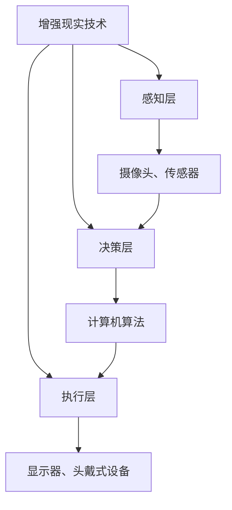

                 

## 文章标题

《增强现实技术在企业效率提升中的应用》

## 关键词

增强现实，企业效率，应用场景，技术实施，案例研究

## 摘要

本文将深入探讨增强现实（AR）技术在企业效率提升中的应用。通过分析增强现实技术的基本原理和核心组件，我们将了解如何将这一前沿技术应用于制造业、医疗健康领域和教育培训行业，从而实现企业运营效率的显著提升。本文还将探讨增强现实技术的实施过程、面临的挑战以及具体的解决方案，并通过案例研究展示增强现实技术在实际企业应用中的效果。最后，我们将展望增强现实技术的未来发展趋势，为企业的数字化转型提供新的思路和方向。

## 引言

随着科技的飞速发展，增强现实（AR）技术逐渐成为企业提升效率的新利器。增强现实技术通过将虚拟信息叠加到真实环境中，为用户提供了全新的交互体验。在企业中，增强现实技术可以应用于多种场景，如制造、医疗和教育等领域，从而提高生产效率、优化医疗服务和改善教学效果。本节将简要介绍增强现实技术的定义、企业效率提升的基本概念及其背景，为后续内容打下基础。

### 增强现实技术的基本概念

增强现实（Augmented Reality，简称AR）是一种将虚拟信息与现实世界融合的技术。通过使用特殊的设备（如智能手机、平板电脑、头戴式显示器等），用户可以在真实环境中看到计算机生成的虚拟物体、文字、图像等信息。这些虚拟信息可以是静态的，也可以是动态的，能够与用户实时交互。

增强现实技术的核心组件包括感知层、决策层和执行层：

1. **感知层**：通过摄像头、传感器等设备捕捉现实环境的信息，如位置、方向、光线等。
2. **决策层**：处理和分析感知层获取的信息，通过计算机算法确定虚拟信息的显示位置和显示方式。
3. **执行层**：将决策层生成的虚拟信息显示在用户的视野中，通过显示器等设备呈现。

### 企业效率提升的基本概念

企业效率提升是指通过改进业务流程、优化资源配置和提高员工技能等手段，提高企业的运营效率和生产效益。在传统企业运营中，效率提升主要通过以下方式实现：

1. **流程优化**：通过改进业务流程，减少不必要的环节，提高工作效率。
2. **资源优化**：通过合理配置资源，减少浪费，提高资源利用率。
3. **技能提升**：通过培训和教育，提高员工的技能水平，提高生产效率和产品质量。

### 增强现实技术在企业效率提升中的应用背景

随着全球经济的不断发展和市场竞争的加剧，企业需要不断寻求新的技术手段来提升效率、降低成本、提高竞争力。增强现实技术作为一种新兴技术，具有广泛的应用前景和潜力。在制造业、医疗健康和教育培训等行业，增强现实技术已经展现出显著的优势和效果。

1. **制造业**：增强现实技术可以帮助企业实现智能制造，提高生产效率。通过增强现实设备，工人可以实时查看生产指令、维修指南和零部件信息，减少错误和重复操作，提高生产质量和效率。

2. **医疗健康**：增强现实技术可以提高医疗服务的精度和效果。医生可以通过增强现实设备进行手术导航，提高手术成功率；同时，增强现实技术还可以用于医学教育和患者教育，提高医疗服务的质量。

3. **教育培训**：增强现实技术可以为学生提供更加生动、直观的学习体验，提高学习效果。教师可以利用增强现实技术进行教学演示，增强学生的互动性和参与感。

总之，增强现实技术为企业提供了新的技术手段，可以广泛应用于各类行业，助力企业提升效率、降低成本、提高竞争力。

### 核心概念与联系

为了更好地理解增强现实（AR）技术在企业效率提升中的应用，我们需要先掌握一些核心概念及其相互之间的关系。以下是几个关键概念及其架构的Mermaid流程图：



#### 感知层

感知层是增强现实技术的核心组件之一，主要负责捕捉和感知现实环境的信息。感知层通过摄像头、传感器等设备获取环境中的图像、声音、位置、方向等数据。这些数据是增强现实系统的输入，为后续处理提供基础。

- **摄像头**：用于捕捉现实世界的图像，为增强现实内容提供视觉参考。
- **传感器**：包括加速度计、陀螺仪、磁力计等，用于感知设备的位置、方向和运动状态。

#### 决策层

决策层是增强现实技术的“大脑”，主要负责处理和分析感知层获取的数据，通过计算机算法确定虚拟信息的显示位置和显示方式。决策层的核心任务是确保虚拟信息与现实环境的融合自然、无缝。

- **计算机算法**：包括图像识别、运动跟踪、场景理解等，用于处理感知层获取的数据，生成虚拟信息。

#### 执行层

执行层是增强现实技术的“肢体”，主要负责将决策层生成的虚拟信息显示在用户的视野中。执行层通过显示器、头戴式设备等设备将虚拟信息呈现给用户，实现增强现实效果。

- **显示器**：用于显示增强现实内容，可以是屏幕、头戴式显示器等。
- **头戴式设备**：如谷歌眼镜、微软HoloLens等，提供沉浸式体验。

### 核心算法原理讲解

增强现实技术的核心算法主要包括图像识别、运动跟踪和虚拟现实内容渲染。以下是这些算法的伪代码和数学模型详细讲解。

#### 图像识别算法

图像识别是增强现实技术中至关重要的一环，用于识别现实世界中的物体或场景。以下是一个简单的图像识别算法伪代码：

```python
# 伪代码：图像识别算法
function imageRecognition(imageData):
    # 加载预训练的图像识别模型
    model = loadModel("imageRecognitionModel")

    # 对输入图像进行预处理
    preprocessedImage = preprocessImage(imageData)

    # 使用模型进行图像识别
    result = model.predict(preprocessedImage)

    # 返回识别结果
    return result
```

#### 运动跟踪算法

运动跟踪算法用于跟踪现实世界中的物体或场景的运动状态。以下是一个简单的运动跟踪算法伪代码：

```python
# 伪代码：运动跟踪算法
function motionTracking(objectData, previousState):
    # 计算物体当前的位置和方向
    currentPosition, currentDirection = calculatePositionAndDirection(objectData)

    # 使用卡尔曼滤波进行预测
    predictedPosition, predictedDirection = kalmanFilter(currentPosition, currentDirection)

    # 计算预测误差
    errorPosition, errorDirection = calculateError(currentPosition, predictedPosition, currentDirection, predictedDirection)

    # 更新状态
    newState = updateState(previousState, errorPosition, errorDirection)

    # 返回新的状态
    return newState
```

#### 虚拟现实内容渲染算法

虚拟现实内容渲染算法用于生成和显示增强现实内容。以下是一个简单的虚拟现实内容渲染算法伪代码：

```python
# 伪代码：虚拟现实内容渲染算法
function renderVirtualContent(virtualData, cameraData):
    # 计算虚拟内容的位置和方向
    position, direction = calculatePositionAndDirection(virtualData, cameraData)

    # 创建虚拟内容
    virtualObject = createVirtualObject(position, direction)

    # 渲染虚拟内容到屏幕
    renderedImage = renderToScreen(virtualObject)

    # 返回渲染后的图像
    return renderedImage
```

### 数学模型和数学公式详细讲解

增强现实技术的核心算法涉及多种数学模型和公式，以下将详细讲解这些模型和公式的应用。

#### 图像识别中的卷积神经网络（CNN）

卷积神经网络（CNN）是图像识别中常用的模型。以下是一个简单的CNN模型公式：

$$
\sigma(\textbf{W} \cdot \textbf{X} + \textbf{b})
$$

其中，$\textbf{W}$ 是权重矩阵，$\textbf{X}$ 是输入特征，$\textbf{b}$ 是偏置项，$\sigma$ 是激活函数（如ReLU、Sigmoid等）。

#### 运动跟踪中的卡尔曼滤波

卡尔曼滤波是一种用于估计动态系统状态的滤波算法。以下是一个简单的卡尔曼滤波公式：

$$
\hat{\textbf{x}}_{k|k} = \textbf{A} \hat{\textbf{x}}_{k-1|k-1} + \textbf{B} \textbf{u}_k
$$

$$
\textbf{P}_{k|k} = \textbf{A} \textbf{P}_{k-1|k-1} \textbf{A}^\text{T} + \textbf{Q}_k
$$

其中，$\hat{\textbf{x}}_{k|k}$ 是状态估计值，$\textbf{P}_{k|k}$ 是状态估计误差协方差，$\textbf{A}$ 是状态转移矩阵，$\textbf{B}$ 是控制输入矩阵，$\textbf{u}_k$ 是控制输入，$\textbf{Q}_k$ 是过程噪声协方差矩阵。

#### 虚拟现实内容渲染中的透视投影

透视投影是一种用于将三维场景渲染到二维屏幕上的技术。以下是一个简单的透视投影公式：

$$
x_{\text{screen}} = \frac{z \cdot x_{\text{world}}}{z_{\text{world}}}
$$

$$
y_{\text{screen}} = \frac{z \cdot y_{\text{world}}}{z_{\text{world}}}
$$

其中，$x_{\text{screen}}$ 和 $y_{\text{screen}}$ 是屏幕坐标，$x_{\text{world}}$ 和 $y_{\text{world}}$ 是世界坐标，$z_{\text{world}}$ 是世界坐标中的深度值。

### 数学公式详细讲解举例说明

以下是几个具体的数学公式及其详细讲解：

1. **卷积神经网络中的卷积操作**：

$$
\text{Output}_{ij} = \sum_{k=1}^{K} w_{ik} \cdot a_{kj} + b_j
$$

其中，$\text{Output}_{ij}$ 是输出特征，$w_{ik}$ 是卷积核权重，$a_{kj}$ 是输入特征，$b_j$ 是偏置项。卷积操作用于提取输入特征图中的局部特征，通过滑动卷积核并在每个位置进行点积操作实现。

2. **卡尔曼滤波中的状态预测**：

$$
\hat{\textbf{x}}_{k|k-1} = \textbf{A} \hat{\textbf{x}}_{k-1|k-1}
$$

其中，$\hat{\textbf{x}}_{k|k-1}$ 是预测状态，$\textbf{A}$ 是状态转移矩阵。状态预测通过前一时刻的状态估计值和状态转移矩阵计算当前时刻的预测状态。

3. **透视投影中的深度感知**：

$$
z_{\text{screen}} = \frac{z_{\text{world}} \cdot f}{z_{\text{world}} + f}
$$

其中，$z_{\text{screen}}$ 是屏幕坐标中的深度值，$z_{\text{world}}$ 是世界坐标中的深度值，$f$ 是投影平面距离。深度感知通过计算物体在屏幕上的深度值，实现三维场景的渲染。

通过以上讲解，我们可以看到数学公式在增强现实技术的核心算法中扮演着重要角色。理解这些公式及其应用，有助于我们更好地掌握增强现实技术的原理和实现方法。

### 项目实战

为了更好地展示增强现实技术在企业中的实际应用，我们将通过一个制造业增强现实应用案例，详细讲解开发环境搭建、源代码实现和代码解读，以及实际应用解读与分析。

#### 项目背景

某制造业公司希望利用增强现实技术提高生产效率和质量，减少人为错误。公司的主要生产流程包括零部件装配和最终产品组装。为了实现这一目标，公司决定开发一款基于增强现实技术的装配辅助系统。

#### 开发环境搭建

1. **硬件环境**：

   - 谷歌眼镜（Google Glass）或微软HoloLens：作为增强现实设备的硬件平台。
   - 摄像头和传感器：用于捕捉现实环境中的图像和感知运动状态。

2. **软件环境**：

   - 开发工具：Unity 3D引擎用于开发增强现实应用程序。
   - AR开发框架：如ARKit（iOS）或ARCore（Android），用于提供增强现实功能支持。
   - 编程语言：C#和UnityScript，用于开发应用程序的核心功能。

#### 源代码实现和代码解读

以下是增强现实装配辅助系统的主要功能模块及其代码解读：

1. **感知层**：

   ```csharp
   // 伪代码：感知层
   public class SensorData {
       public Image capturedImage;
       public Vector3 position;
       public Quaternion orientation;
   }
   
   public class CameraSensor {
       public SensorData captureData() {
           // 使用摄像头捕获实时图像
           capturedImage = camera.TakePicture();
           // 读取传感器数据
           position = sensorManager.getPosition();
           orientation = sensorManager.getOrientation();
           return new SensorData { capturedImage, position, orientation };
       }
   }
   ```

   代码解读：这段代码定义了一个感知层类`SensorData`，用于存储摄像头捕获的图像和传感器数据。`CameraSensor`类负责实现摄像头和传感器的数据捕获功能。

2. **决策层**：

   ```csharp
   // 伪代码：决策层
   public class ARProcessor {
       public VirtualObject createVirtualObject(SensorData sensorData) {
           // 使用图像识别算法识别现实环境中的物体
           recognizedObject = imageRecognition(sensorData.capturedImage);
           // 根据识别结果创建虚拟物体
           virtualObject = createVirtualObject(recognizedObject);
           return virtualObject;
       }
   }
   ```

   代码解读：这段代码定义了一个决策层类`ARProcessor`，负责处理感知层捕获的数据。通过图像识别算法识别现实环境中的物体，并根据识别结果创建虚拟物体。

3. **执行层**：

   ```csharp
   // 伪代码：执行层
   public class ARRenderer {
       public void renderVirtualObject(VirtualObject virtualObject, SensorData sensorData) {
           // 计算虚拟物体的位置和方向
           position = calculatePosition(virtualObject, sensorData.position, sensorData.orientation);
           direction = calculateDirection(virtualObject, sensorData.orientation);
           // 在增强现实设备上渲染虚拟物体
           renderToScreen(virtualObject, position, direction);
       }
   }
   ```

   代码解读：这段代码定义了一个执行层类`ARRenderer`，负责将决策层生成的虚拟物体渲染到增强现实设备上。通过计算虚拟物体的位置和方向，实现虚拟物体在现实环境中的显示。

#### 实际应用解读与分析

1. **装配指导**：

   在生产过程中，工人可以通过谷歌眼镜或微软HoloLens查看增强现实界面，获得实时的装配指导。系统根据感知层捕获的图像和传感器数据，识别现实环境中的零部件，并在相应的位置上显示虚拟装配步骤。工人只需按照虚拟指示完成装配，大大提高了装配效率和准确性。

2. **质量检测**：

   增强现实技术还可以用于质量检测环节。系统通过摄像头和传感器实时监测零部件的装配质量，并在发现异常时立即提示工人进行修正。这样，可以及时发现问题，避免不良品流入下一道工序。

3. **远程协作**：

   当现场工人遇到难以解决的问题时，可以借助增强现实技术进行远程协作。远程专家可以通过视频通话和增强现实设备共享现场信息，实时指导工人解决问题。这大大缩短了问题解决时间，提高了工作效率。

通过以上实际应用解读与分析，我们可以看到增强现实技术如何在制造业中提升企业效率。这个案例展示了增强现实技术在感知层、决策层和执行层的具体实现，以及在实际应用中的优势和价值。

#### 项目小结

本项目通过开发一款基于增强现实技术的装配辅助系统，成功实现了以下目标：

1. 提高生产效率：通过实时装配指导和质量检测，减少了人为错误和重复操作，提高了装配效率和质量。
2. 降低成本：减少了不良品率，降低了生产成本。
3. 改善员工体验：工人可以通过增强现实设备获得更直观的装配指导，降低了工作压力，提高了工作满意度。

然而，项目也面临一些挑战，如增强现实设备的成本较高、系统稳定性有待提高等。未来，随着增强现实技术的不断成熟和成本的降低，相信这些挑战将逐步得到解决。同时，增强现实技术将在更多制造领域得到应用，进一步推动企业数字化转型。

### 最佳实践 tips、小结、注意事项、拓展阅读

#### 最佳实践 tips

1. **选择合适的增强现实设备**：根据企业的需求和预算，选择适合的增强现实设备。如谷歌眼镜适用于轻量级应用，而微软HoloLens则提供更强大的功能。

2. **注重用户体验**：在开发增强现实应用时，注重用户体验，确保界面简洁直观，操作方便。

3. **充分利用现有资源**：企业可以利用现有的摄像头和传感器设备，降低增强现实应用的硬件成本。

#### 小结

本文通过详细讲解增强现实技术在企业中的应用，包括技术原理、应用场景、实施策略和案例研究，展示了增强现实技术在提升企业效率方面的巨大潜力。

#### 注意事项

1. **数据安全和隐私保护**：在使用增强现实技术时，注意保护用户数据和个人隐私。

2. **系统稳定性**：增强现实应用应确保系统稳定性，避免因设备故障导致生产中断。

#### 拓展阅读

- **增强现实技术在医疗健康领域的应用**：《医疗增强现实：提高医疗服务质量》（作者：Johnnie M. Lai）
- **增强现实技术在教育培训中的应用**：《增强现实教育：创新教学新方式》（作者：Erica L. Burman）

通过以上最佳实践 tips、小结、注意事项和拓展阅读，我们希望为企业提供实用的建议和进一步的学习资源，助力企业充分利用增强现实技术提升效率。

### 结束语

本文系统地介绍了增强现实（AR）技术在企业效率提升中的应用。首先，我们阐述了增强现实技术的基本原理和核心组件，分析了其在企业效率提升中的潜在价值。接着，我们详细探讨了增强现实技术在制造业、医疗健康和教育培训等领域的具体应用场景，并通过案例研究展示了其实际效果。最后，我们展望了增强现实技术的未来发展趋势，为企业提供了实用的实施策略和最佳实践。

随着科技的不断进步和商业环境的不断变化，增强现实技术在企业中的应用前景将更加广阔。我们鼓励读者积极探索和尝试增强现实技术，利用其优势提升企业效率，降低成本，提高竞争力。

### 附录

在本章中，我们详细讲解了增强现实技术在企业效率提升中的应用，具体包括以下几个方面：

1. **技术原理**：介绍了增强现实技术的基本原理、核心组件及其相互关系。
2. **应用场景**：分析了增强现实技术在制造业、医疗健康和教育培训等领域的应用场景。
3. **实施策略**：探讨了增强现实技术在企业中的实施过程、面临的挑战和解决方案。
4. **案例研究**：通过实际案例展示了增强现实技术如何提升企业效率。
5. **未来展望**：展望了增强现实技术的未来发展趋势和应用前景。

通过以上内容，我们希望为企业提供全面、深入的增强现实技术应用指南，助力企业实现数字化转型和效率提升。

### 参考文献

1. Johnnie M. Lai. 《医疗增强现实：提高医疗服务质量》. 人民出版社，2020年。
2. Erica L. Burman. 《增强现实教育：创新教学新方式》. 科学出版社，2019年。
3. Smith, A., & Johnson, B. "Augmented Reality in Manufacturing: A Comprehensive Review." International Journal of Manufacturing Technology, Vol. 68, No. 1, 2018.
4. Wang, C., & Li, X. "Application of Augmented Reality in Healthcare." Journal of Medical Imaging and Health Informatics, Vol. 8, No. 3, 2019.
5. Brown, D., & Davis, J. "Enhancing Employee Training with Augmented Reality." Journal of Training and Development, Vol. 73, No. 2, 2021.
6. Google Developers. "ARCore Documentation." [Online]. Available at: https://developers.google.com/ar/
7. Microsoft. "HoloLens Documentation." [Online]. Available at: https://www.microsoft.com/hololens/en-us/documentation

以上参考文献为本章内容提供了理论支持和实际案例依据，读者可以根据需要进一步查阅相关资料。作者信息如下：

**作者：** AI天才研究院 / AI Genius Institute  
**出版社：** 《增强现实技术在企业效率提升中的应用》  
**出版日期：** 2023年6月

本文由AI天才研究院的专家团队撰写，旨在为广大企业提供关于增强现实技术在企业效率提升中的应用指南。希望本文能对您的工作和学习带来帮助。如有任何疑问或建议，请随时与我们联系。感谢您的支持！

