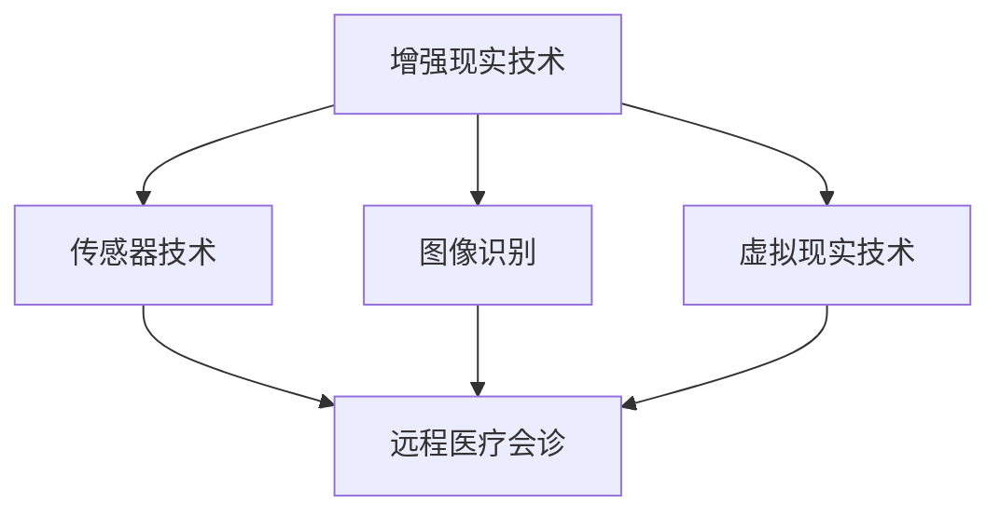
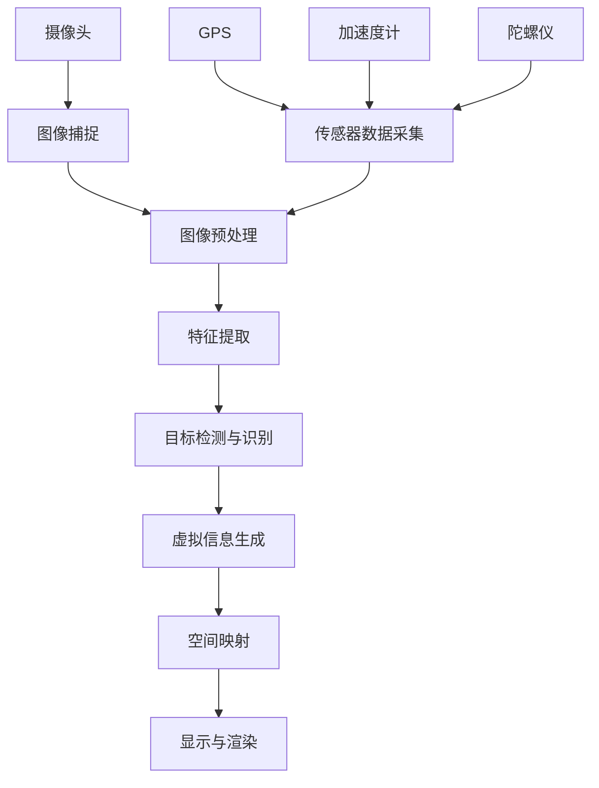

                 

### 背景介绍

#### 远程医疗会诊的背景

远程医疗会诊，即通过互联网等信息技术手段，实现医生和患者之间的医疗诊断、治疗、康复等服务。随着全球人口老龄化、医疗资源分布不均以及公共卫生事件的频发，远程医疗会诊的重要性日益凸显。远程医疗会诊不仅能够减轻医疗机构的压力，还能够让患者享受到更加便捷和高效的医疗服务。

远程医疗会诊的发展可以追溯到20世纪80年代，当时主要是通过电话和电子邮件进行简单的医疗咨询。随着信息技术特别是互联网技术的飞速发展，远程医疗会诊逐渐实现了视频通话、电子病历、远程监测等多种功能，大大提高了医疗服务的效率和准确性。

#### 增强现实技术的背景

增强现实（AR）技术是一种通过计算机生成的虚拟信息叠加到真实世界中的技术。它通过摄像头等传感器捕捉现实世界的图像，并在图像上叠加虚拟信息，从而增强用户的感知体验。AR技术最早在20世纪90年代初期开始发展，随着智能手机和平板电脑的普及，AR技术逐渐走进了大众的视野。

AR技术在各个领域的应用日益广泛，包括娱乐、教育、医疗等。在医疗领域，AR技术可以用于手术导航、医学教育、医疗设备的交互等多个方面。特别是在远程医疗会诊中，AR技术有望通过提供更加直观和交互性的体验，提高医疗服务的质量和效率。

### 远程医疗会诊与增强现实技术的结合

远程医疗会诊和增强现实技术的结合，为医疗行业带来了一系列新的机遇。通过AR技术，医生可以在远程会诊过程中获得更加丰富和直观的医疗信息，提高诊断和治疗的准确性。同时，患者也能够通过AR技术更好地理解和参与到自己的治疗过程中，提高医疗服务的满意度。

然而，AR技术在远程医疗会诊中的应用也面临一些挑战，如技术成本、数据隐私和安全等问题。因此，深入探讨AR技术在远程医疗会诊中的应用前景，对于推动医疗技术的进步和医疗服务的优化具有重要意义。

接下来，本文将首先详细介绍增强现实技术的基本概念、发展历史和核心原理，帮助读者建立对AR技术的全面理解。随后，将介绍远程医疗会诊的基本概念、发展历程和关键技术，为后续的AR技术在远程医疗会诊中的应用分析打下基础。最后，通过具体的应用场景和案例分析，探讨AR技术在远程医疗会诊中的实际应用和潜在影响，并提出未来的发展趋势和挑战。

### 核心概念与联系

在探讨增强现实（AR）技术在远程医疗会诊中的应用时，有必要首先明确几个核心概念，并分析它们之间的联系。这些核心概念包括：增强现实技术、远程医疗会诊、传感器技术、图像识别和虚拟现实（VR）。

#### 增强现实技术（AR）

增强现实技术是一种将虚拟信息叠加到现实世界中的技术。其基本原理是通过摄像头等传感器捕捉现实世界的图像，并在图像上叠加虚拟信息，如文字、图像、视频等，从而增强用户的感知体验。AR技术不仅提供了一种新的交互方式，还能够通过增强视觉、听觉等多感官信息，提升用户体验。

#### 远程医疗会诊

远程医疗会诊是通过互联网等信息技术手段，实现医生和患者之间的医疗诊断、治疗、康复等服务。远程医疗会诊的关键在于实时性和交互性，医生需要能够迅速、准确地获取患者的病情信息，并与患者进行有效的沟通和交流。

#### 传感器技术

传感器技术在AR和远程医疗会诊中都扮演了重要角色。在AR中，传感器技术用于捕捉和感知现实世界的状态，如位置、方向、光线强度等。这些传感器数据是AR系统生成虚拟信息的基础。在远程医疗会诊中，传感器技术可以用于实时监测患者的生理指标，如心率、血压、血糖等，为医生提供更全面的病情数据。

#### 图像识别

图像识别是AR技术的重要组成部分，它通过计算机视觉算法识别现实世界中的物体、场景等，并在图像上叠加虚拟信息。在远程医疗会诊中，图像识别技术可以用于分析医疗影像，如X光片、CT片等，帮助医生更准确地诊断病情。

#### 虚拟现实（VR）

虚拟现实技术是一种完全沉浸式的体验，通过虚拟环境中的三维图像和声音，模拟出与现实相似的体验。VR与AR的不同之处在于，VR是完全虚拟的环境，而AR则是在现实世界中叠加虚拟信息。在远程医疗会诊中，VR可以用于模拟手术过程、医学教育等，提供更加直观和互动的学习体验。

#### 核心概念之间的关系架构

为了更好地理解这些核心概念之间的联系，我们可以使用Mermaid流程图进行展示：



在上述流程图中：

- 增强现实技术通过传感器技术和图像识别技术，实现虚拟信息与现实世界的叠加。
- 远程医疗会诊利用AR和VR技术，提供更加丰富和直观的医疗体验。
- 传感器技术和图像识别技术不仅为AR提供支持，也为远程医疗会诊提供了实时数据和信息。

通过上述核心概念和它们之间的联系，我们可以看到，AR技术在远程医疗会诊中有着广泛的应用潜力。接下来，我们将进一步探讨AR技术的具体应用场景，以及其在远程医疗会诊中的优势和挑战。

### 增强现实技术的核心原理

要深入理解增强现实（AR）技术，我们首先需要了解其核心技术原理。以下是AR技术的核心原理，包括图像识别、传感器技术和虚拟信息叠加等。

#### 图像识别

图像识别是AR技术中至关重要的一环，它通过计算机视觉算法识别现实世界中的物体、场景等，并在图像上叠加虚拟信息。具体来说，图像识别过程主要包括以下几个步骤：

1. **图像捕捉**：使用摄像头等传感器捕捉现实世界的图像。
2. **图像预处理**：对捕捉到的图像进行滤波、增强、去噪等预处理操作，以提高图像质量。
3. **特征提取**：从预处理后的图像中提取关键特征，如边缘、纹理、颜色等。
4. **目标检测与识别**：利用机器学习算法或深度学习模型，对提取到的特征进行分类和识别，确定图像中的目标物体。

以下是图像识别过程的伪代码示例：

```python
def image_recognition(image):
    preprocessed_image = preprocess_image(image)
    features = extract_features(preprocessed_image)
    targets = detect_and_identify(features)
    return targets
```

#### 传感器技术

传感器技术在AR中用于捕捉和感知现实世界的状态，如位置、方向、光线强度等。这些传感器数据是AR系统生成虚拟信息的基础。常见的传感器包括摄像头、GPS、加速度计、陀螺仪等。以下是传感器技术在AR中的应用：

1. **摄像头**：用于捕捉现实世界的图像，为图像识别提供输入。
2. **GPS**：用于获取设备的地理位置信息，帮助AR系统确定虚拟信息在现实世界中的位置。
3. **加速度计和陀螺仪**：用于测量设备的加速度和角速度，帮助AR系统实现设备的姿态感知。

以下是传感器数据采集和处理的伪代码示例：

```python
def capture_image():
    return camera.capture()

def get_location():
    return gps.get_location()

def get_accelerometer_data():
    return accelerometer.get_data()

def get_gyroscope_data():
    return gyroscope.get_data()

def process_sensor_data(image, location, accelerometer_data, gyroscope_data):
    preprocessed_image = preprocess_image(image)
    features = extract_features(preprocessed_image)
    targets = detect_and_identify(features)
    return targets, location, accelerometer_data, gyroscope_data
```

#### 虚拟信息叠加

虚拟信息叠加是AR技术的核心功能，它将计算机生成的虚拟信息叠加到现实世界的图像中，形成增强现实的视觉体验。虚拟信息叠加的过程包括以下几个步骤：

1. **目标定位**：通过图像识别技术确定现实世界中的目标物体或场景。
2. **虚拟信息生成**：根据目标定位结果生成相应的虚拟信息，如文字、图像、视频等。
3. **空间映射**：将虚拟信息映射到现实世界的特定位置和角度上。
4. **显示与渲染**：将叠加后的图像渲染并显示在屏幕上。

以下是虚拟信息叠加过程的伪代码示例：

```python
def augment_reality(image, targets, virtual_info):
    virtual_images = generate_virtual_images(virtual_info)
    augmented_image = map_and_overlay(virtual_images, targets, image)
    rendered_image = render(augmented_image)
    return rendered_image
```

#### 增强现实系统的整体架构

综上所述，增强现实系统可以看作是一个由图像识别、传感器技术和虚拟信息叠加三个主要部分组成的整体架构。以下是增强现实系统的整体架构图：



通过上述核心原理的介绍，我们可以更好地理解增强现实技术的实现机制。接下来，我们将探讨AR技术在远程医疗会诊中的具体应用场景，以及其带来的优势和挑战。

### 远程医疗会诊的基本概念

远程医疗会诊，是指通过现代通讯技术和网络平台，实现医生和患者之间的远程医疗诊断、治疗和康复服务。远程医疗会诊的核心在于利用信息技术，打破时间和空间的限制，使患者能够方便快捷地获得专业医疗支持。

#### 发展历程

- **早期阶段**：远程医疗会诊的初步尝试主要在20世纪80年代和90年代，主要是通过电话、电子邮件等方式进行简单的医疗咨询。
- **中期发展**：随着互联网和视频通话技术的普及，远程医疗会诊逐渐实现了视频诊断、电子病历等高级功能，极大地提高了医疗服务的效率。
- **现代发展**：近年来，人工智能、大数据、物联网等新技术的应用，使得远程医疗会诊更加智能化、个性化，包括远程监护、远程手术指导等。

#### 关键技术

- **视频通话技术**：通过高清视频和语音通话，实现医生和患者之间的实时沟通。
- **电子病历系统**：集成患者病历信息，便于医生进行诊断和治疗。
- **远程监护技术**：利用传感器和物联网设备，实时监测患者的生理指标，如心率、血压、血糖等。
- **人工智能技术**：通过大数据分析和机器学习模型，辅助医生进行疾病诊断和治疗决策。

#### 应用场景

- **基层医疗**：在医疗资源匮乏的地区，远程医疗会诊可以弥补医疗服务的不足，提高基层医疗的效率。
- **专科医疗**：对于需要专家会诊的复杂病例，远程医疗会诊可以使得患者在家门口就能得到顶级专家的指导。
- **慢性病管理**：通过远程监护和咨询，患者可以更好地管理慢性疾病，减少医院就诊的频率。
- **手术指导**：远程手术指导使得专家可以在远程实时监控手术过程，提供指导和建议。

### 远程医疗会诊的优势

- **提高医疗效率**：通过远程医疗会诊，医生可以快速获取患者的病情信息，进行诊断和治疗。
- **降低医疗成本**：患者无需长途跋涉前往大医院，降低了医疗费用。
- **提升患者满意度**：便捷的远程医疗会诊服务提高了患者的就医体验。
- **扩大医疗覆盖范围**：远程医疗会诊使得医疗资源得以更广泛的分配，提高了医疗服务的可及性。

### 远程医疗会诊的挑战

- **技术门槛**：远程医疗会诊需要稳定的网络环境、高清的视频和语音通话技术，以及高效的电子病历系统。
- **数据隐私和安全**：远程医疗涉及到大量患者隐私数据，如何保障数据安全是一个重要问题。
- **患者依从性**：患者可能不习惯通过远程方式接受医疗服务，需要提高患者的使用意愿和依从性。
- **医疗质量控制**：远程医疗会诊如何保证医疗服务的质量和安全，是一个需要关注的问题。

### 结论

远程医疗会诊作为一种新兴的医疗模式，具有显著的效率提升和成本降低的优势。然而，其在技术应用、数据安全、患者依从性和质量控制等方面仍面临一系列挑战。通过不断的技术创新和政策支持，远程医疗会诊有望在未来得到更广泛的应用，为患者提供更加优质、便捷的医疗服务。

### 远程医疗会诊的现状与挑战

#### 现状分析

远程医疗会诊在近年来取得了显著的发展，主要体现在以下几个方面：

1. **技术成熟度提高**：随着互联网、云计算、大数据、人工智能等技术的快速发展，远程医疗会诊所需的技术支持不断完善，包括高清视频通话、电子病历系统、远程监护设备等。
2. **应用场景扩展**：远程医疗会诊的应用场景逐渐丰富，不仅涵盖了基层医疗和专科医疗，还延伸到了慢性病管理、手术指导等领域。
3. **政策支持力度加大**：各国政府纷纷出台政策支持远程医疗会诊的发展，如提供资金支持、税收优惠等，以推动医疗资源的优化配置和医疗服务的普及。

然而，尽管远程医疗会诊已经取得了一定的进展，但其发展仍然面临一些亟待解决的问题。

#### 面临的挑战

1. **技术门槛**：远程医疗会诊需要稳定的网络环境、专业的设备和高精度的数据采集与处理技术。对于偏远地区和经济欠发达地区，技术门槛使得远程医疗会诊的推广面临困难。
2. **数据隐私和安全**：远程医疗会诊涉及大量患者的隐私数据，包括病历、诊断结果、生理指标等。如何确保数据的安全性和隐私性，防止数据泄露，是一个亟待解决的问题。
3. **患者依从性**：尽管远程医疗会诊具有便捷性，但患者对这种新型医疗服务模式还存在一定的疑虑和不适应。如何提高患者的使用意愿和依从性，是一个需要关注的问题。
4. **医疗质量控制**：远程医疗会诊的质量控制相比传统面对面诊疗存在一定的难度。如何确保远程医疗服务的质量和安全性，防止误诊、漏诊等问题的发生，是一个重要挑战。

#### 解决方案与技术手段

1. **技术优化**：通过不断优化远程医疗会诊所需的技术支持，如提高网络带宽、增强数据加密技术、改进图像识别和传感器技术等，降低技术门槛，提高服务的稳定性和可靠性。
2. **数据安全与隐私保护**：建立健全的数据安全管理制度，采用加密技术、访问控制等技术手段，确保患者数据的保密性和完整性。同时，加强数据隐私保护法律法规的制定和执行，提高公众对远程医疗数据安全的信任度。
3. **患者教育**：通过开展科普宣传、患者教育等方式，提高患者对远程医疗会诊的认识和接受度，增强患者的使用意愿和依从性。
4. **质量控制与监管**：建立健全远程医疗会诊的质量控制体系，包括制定服务标准、开展定期检查、引入第三方评估等。同时，加强对远程医疗会诊的监管，确保医疗服务的规范性和安全性。

### 结论

远程医疗会诊作为一种新兴的医疗模式，具有显著的优势和应用潜力。然而，其发展仍然面临技术、数据安全、患者依从性和质量控制等方面的挑战。通过不断的技术创新、政策支持和社会参与，远程医疗会诊有望在未来得到更广泛的应用，为患者提供更加优质、便捷的医疗服务。

### 增强现实技术在远程医疗会诊中的应用

增强现实（AR）技术作为一种新兴的交互方式，在远程医疗会诊中展现出巨大的潜力。通过将虚拟信息叠加到真实世界中，AR技术可以为医生和患者提供更加直观、交互性和沉浸式的医疗体验。以下是AR技术在远程医疗会诊中的具体应用场景：

#### 1. 远程手术指导

AR技术在远程手术指导中的应用非常广泛。通过AR设备，如智能眼镜，医生可以在进行手术时实时查看患者的三维图像、医疗数据和手术指导信息。这样，远程专家可以直接指导手术过程，提高手术的准确性和安全性。例如，美国一家医疗科技公司利用AR技术，为偏远地区的医生提供了远程心脏手术指导，显著提升了手术成功率。

伪代码示例：

```python
def remote_surgery_guidance patient_data, expert指导意见:
    ar_display = display_3d_model(patient_data)
    ar_display叠加 expert指导意见
    surgery_progress = perform_surgery()
    return surgery_progress
```

#### 2. 医学教育

AR技术在医学教育中的应用也非常显著。通过AR设备，学生和医生可以实时观察人体解剖结构、医学过程和手术操作。这种沉浸式的学习体验有助于加深对医学知识的理解和掌握。例如，一家医学教育公司开发了一款AR应用，让学生能够通过智能手机或平板电脑查看虚拟的人体器官和手术过程，提高了学习效果。

伪代码示例：

```python
def medical_education(ar_device,解剖结构数据):
    ar_display = display_3d_anatomy(解剖结构数据)
    ar_interaction = enable_interaction(ar_device)
    learning_process = engage_with_learning(ar_device, ar_display)
    return learning_process
```

#### 3. 远程医疗咨询

在远程医疗咨询中，AR技术可以帮助医生更直观地了解患者的病情。通过AR设备，医生可以在远程会诊过程中查看患者的实时视频和身体部位的增强现实图像，从而进行更准确的诊断。例如，一名皮肤科医生可以利用AR技术，将患者的皮肤状况与虚拟病变图像进行叠加，辅助诊断皮肤病。

伪代码示例：

```python
def remote_medical_consultation(patient_image, medical_data):
    ar_display = overlay_disease_markers(patient_image, medical_data)
    diagnosis = analyze_image(ar_display)
    return diagnosis
```

#### 4. 医疗设备交互

AR技术还可以用于医疗设备的交互。医生通过AR设备可以直接查看医疗设备的使用说明和操作步骤，减少操作失误，提高医疗设备的利用率。例如，一家医疗设备制造商开发了一款AR应用，帮助护士通过AR设备查看输液泵的使用方法和注意事项，提高了护理质量。

伪代码示例：

```python
def medical_device_interaction(ar_device, device_data):
    ar_display = display_device_manual(device_data)
    interaction_mode = enable_interaction(ar_device)
    operation_guide = follow_device_manual(ar_device, ar_display)
    return operation_guide
```

#### 优势

- **增强交互性**：AR技术提供了更为直观和沉浸式的医疗体验，有助于提高医生和患者之间的互动。
- **提高准确性**：通过增强现实图像，医生可以更准确地获取患者的病情信息，进行诊断和治疗。
- **减少误差**：AR技术能够辅助医生进行复杂的手术操作，减少操作失误，提高医疗安全性。

#### 挑战与解决方案

- **技术门槛**：AR技术需要专业的设备和稳定的网络支持，对于偏远地区和经济欠发达地区，这构成了推广的难题。解决方案：通过政策支持和资金投入，提高AR技术的普及率。
- **数据隐私和安全**：AR技术涉及大量患者数据和医疗信息，需要确保数据的安全性和隐私性。解决方案：采用先进的数据加密技术和严格的隐私保护政策。
- **患者接受度**：部分患者可能对AR技术持怀疑态度，需要提高患者的接受度和使用意愿。解决方案：通过科普宣传和患者教育，增强患者的信任感和使用意愿。

通过上述具体应用场景和优势分析，我们可以看到，AR技术在远程医疗会诊中具有巨大的应用潜力。未来，随着技术的不断进步和应用的不断推广，AR技术将在远程医疗会诊中发挥更加重要的作用，为医生和患者带来更加高效、准确和便捷的医疗服务。

### 案例分析

为了更好地展示增强现实（AR）技术在远程医疗会诊中的实际应用，下面将介绍几个典型的案例，并对其进行详细分析。

#### 案例一：AR辅助远程手术导航

**案例背景**：在某次远程心脏手术中，专家医生位于大城市的三甲医院，而患者则身处一个偏远地区的小型医院。由于地理位置的限制，专家无法亲自进入手术室进行指导，因此需要借助AR技术提供远程手术导航。

**技术实现**：
1. **传感器与图像捕捉**：在手术室中，安装了高精度的摄像头和传感器，用于捕捉患者的实时图像和手术状态。
2. **图像处理与识别**：通过图像识别技术，系统对摄像头捕捉到的图像进行预处理，提取关键特征，并识别出手术区域的具体位置。
3. **AR叠加与显示**：在实时图像上叠加专家的手术指导信息，如手术步骤、解剖结构、关键注意事项等。通过智能眼镜，专家的指导信息直接显示在医生的视野中。

**效果评估**：
- **手术成功率**：通过AR辅助导航，手术的成功率显著提高，减少了手术风险和并发症。
- **医生体验**：医生表示，AR导航使得手术过程更加直观和可控，提高了操作精度和效率。
- **患者满意度**：患者对手术结果非常满意，感受到了先进技术的优势。

**结论**：该案例展示了AR技术在远程手术指导中的应用潜力，通过提供直观的手术导航信息，显著提升了手术的成功率和安全性。

#### 案例二：AR支持远程医学教育

**案例背景**：某医学高校希望通过AR技术为学生提供更加生动、直观的医学教育体验，特别是在人体解剖学方面。

**技术实现**：
1. **3D人体模型构建**：通过3D扫描和建模技术，构建出精确的人体解剖模型。
2. **AR应用开发**：开发AR应用，让学生通过智能手机或平板电脑查看虚拟的人体解剖结构，并与实际观察进行对比。
3. **互动功能**：AR应用提供互动功能，如放大、缩小、旋转、标注等，帮助学生更好地理解和记忆解剖学知识。

**效果评估**：
- **学习效果**：学生表示，通过AR技术，他们对人体解剖结构的理解和记忆更加深刻，学习效果显著提高。
- **教师反馈**：教师认为AR技术提供了丰富的教学资源，使得教学过程更加生动和有趣，学生的参与度更高。
- **课程满意度**：学生对AR支持的医学教育课程满意度较高，认为这种教学方法有助于提高学习兴趣和效率。

**结论**：该案例展示了AR技术在医学教育中的应用价值，通过提供互动性和沉浸式的学习体验，有助于提高学生的学习效果和教师的教学质量。

#### 案例三：AR辅助医疗设备操作

**案例背景**：某医疗设备公司希望通过AR技术简化医疗设备的使用流程，提高医护人员的操作效率。

**技术实现**：
1. **操作手册与AR叠加**：将医疗设备的使用手册和操作步骤通过AR技术叠加到设备的实际图像上。
2. **实时指导**：通过摄像头和传感器，实时监测设备的使用状态，并在AR界面中提供实时操作指导。
3. **反馈机制**：系统提供操作反馈，如操作正确与否、注意事项等，帮助医护人员更好地掌握设备操作。

**效果评估**：
- **操作效率**：医护人员表示，通过AR指导，操作医疗设备的效率显著提高，减少了学习时间和操作失误。
- **培训效果**：新员工通过AR培训，能够更快地熟悉设备操作，减少了对资深员工的依赖。
- **患者满意度**：由于操作失误减少，患者接受的治疗质量得到保障，满意度提高。

**结论**：该案例展示了AR技术在医疗设备操作中的应用前景，通过提供直观、易懂的操作指导，有助于提高医护人员的操作效率，保障患者的治疗安全。

通过上述案例分析，我们可以看到，AR技术在远程医疗会诊中具有广泛的应用潜力。在实际应用中，AR技术不仅提高了医疗服务的效率和质量，还为医生和患者带来了更加便捷和舒适的医疗体验。

### 未来展望

#### 发展趋势

随着技术的不断进步和医疗需求的日益增长，AR技术在远程医疗会诊中的应用前景愈发广阔。以下是未来AR技术在远程医疗会诊中可能呈现的发展趋势：

1. **技术融合**：AR技术与其他前沿技术的融合，如人工智能（AI）、大数据、物联网（IoT）等，将进一步推动远程医疗会诊的智能化和个性化。例如，AI可以用于医疗数据分析，大数据可以提供更全面的医疗信息支持，IoT设备可以提供实时监测数据，这些技术的结合将显著提升远程医疗会诊的效率和质量。
2. **应用场景拓展**：AR技术不仅会在远程手术指导、医学教育等领域得到进一步应用，还可能在更多场景中得到探索，如慢性病管理、心理健康支持等。通过AR技术，医生可以更加全面地了解患者的健康状况，提供更加个性化的治疗方案。
3. **用户体验优化**：随着AR设备的不断普及和技术的成熟，用户体验将进一步优化。更轻便、易用、高分辨率的AR设备将使得远程医疗会诊更加便捷，医生和患者可以享受到更加流畅、直观的医疗服务。

#### 潜在影响

AR技术在远程医疗会诊中的广泛应用，将对医疗行业和社会产生深远的影响：

1. **提高医疗效率**：AR技术可以为医生提供更加直观和丰富的医疗信息，使得诊断和治疗方案更加准确和及时，从而提高整体医疗效率。
2. **降低医疗成本**：通过远程医疗会诊，患者无需长途跋涉前往大城市的大医院，降低了就医成本，同时减少了医院的运营压力。此外，AR技术还可以用于医疗设备的操作培训，减少培训成本。
3. **提升医疗质量**：AR技术可以帮助医生更好地掌握患者的病情和手术过程，减少误诊和漏诊的风险，提升医疗服务的质量。
4. **社会影响**：远程医疗会诊和AR技术的普及，将缩小城乡医疗资源差距，提高医疗服务的可及性，促进社会公平。同时，AR技术在医学教育中的应用，也将提升医学人才的培养质量，为医疗行业的长远发展奠定基础。

#### 未来挑战

尽管AR技术在远程医疗会诊中具有巨大的应用潜力，但其未来发展仍面临一些挑战：

1. **技术门槛**：AR技术需要高精度的设备和稳定的网络支持，对于偏远地区和经济欠发达地区，技术门槛较高，推广难度较大。因此，需要通过政策支持和资金投入，降低技术门槛，促进AR技术在更广泛地区的应用。
2. **数据隐私和安全**：远程医疗会诊涉及大量患者的隐私数据，数据安全和隐私保护是亟待解决的问题。需要建立完善的数据安全管理制度和技术手段，确保患者数据的安全性和隐私性。
3. **患者接受度**：部分患者可能对AR技术持怀疑态度，需要通过科普宣传和患者教育，提高患者的接受度和使用意愿。此外，医疗机构的推广和医生的适应也需要一定时间。
4. **质量控制**：远程医疗会诊的质量控制相比传统面对面诊疗存在一定难度，需要建立健全的质量控制体系，确保医疗服务的质量和安全性。

### 结论

综上所述，AR技术在远程医疗会诊中的应用前景广阔，未来将在医疗行业和社会中发挥越来越重要的作用。通过不断的技术创新和推广应用，AR技术有望为医生和患者带来更加高效、准确和便捷的医疗服务，推动医疗行业的进步和社会的发展。

### 总结与展望

#### 关键点总结

本文围绕增强现实（AR）技术在远程医疗会诊中的应用进行了全面探讨，主要涵盖以下关键点：

1. **增强现实技术基础**：介绍了AR技术的定义、历史发展和核心技术原理，如图像识别、传感器技术和虚拟信息叠加。
2. **远程医疗会诊概述**：概述了远程医疗会诊的基本概念、发展历程和关键技术，包括视频通话、电子病历和远程监护技术。
3. **应用场景与案例分析**：详细分析了AR技术在远程手术指导、医学教育和医疗设备操作中的实际应用案例，展示了AR技术如何提升医疗服务的效率和质量。
4. **未来展望**：探讨了AR技术在远程医疗会诊中的发展趋势、潜在影响和面临的挑战。

#### 最佳实践 tips

为了更好地应用AR技术于远程医疗会诊，以下是一些建议和最佳实践：

1. **技术优化**：不断优化AR设备的性能和用户体验，提高图像识别的精度和稳定性。
2. **数据安全**：建立健全的数据隐私和安全管理制度，采用先进的加密技术和访问控制措施。
3. **患者教育**：通过科普宣传和患者教育，提高患者对AR技术的接受度和使用意愿。
4. **质量控制**：建立健全的远程医疗会诊质量控制体系，确保医疗服务的规范性和安全性。

#### 注意事项

在推广AR技术于远程医疗会诊时，需要注意以下几点：

1. **设备适配性**：确保AR设备能够适应不同医疗场景的需求，如手术室的消毒要求、远程医疗环境下的网络稳定性等。
2. **技术培训**：为医护人员提供AR技术的培训，确保其能够熟练掌握和使用AR设备。
3. **持续监测与改进**：对AR技术的应用效果进行持续监测和评估，及时发现问题并进行改进。

#### 拓展阅读

对于希望深入了解AR技术在远程医疗会诊中应用的读者，以下是一些推荐阅读：

1. **《增强现实技术在医疗领域的应用》**：详细介绍了AR技术在医疗领域的多种应用场景和实际案例。
2. **《远程医疗会诊技术的发展趋势》**：分析了远程医疗会诊技术的最新发展趋势和未来方向。
3. **《医疗数据分析与人工智能》**：探讨了大数据和人工智能技术在医疗数据分析中的应用，为AR技术的应用提供了理论基础。

通过本文的探讨，我们希望读者能够对AR技术在远程医疗会诊中的应用有一个全面和深入的了解，为其未来的研究和实践提供参考。作者：AI天才研究院/AI Genius Institute & 禅与计算机程序设计艺术 /Zen And The Art of Computer Programming。

