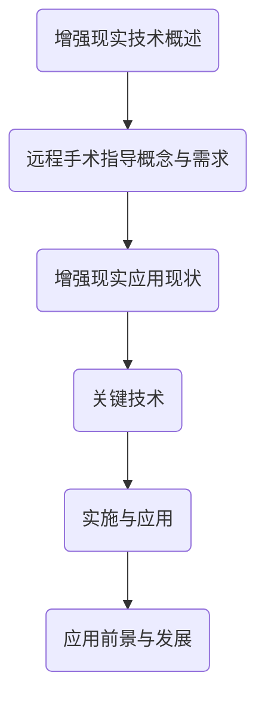

                 

 

- 首先，我们需要明确文章的主题和目的。文章的主题是“增强现实技术在远程手术指导中的应用前景”，目的是通过一步步分析推理，探讨该技术在实际医疗领域的应用价值和发展趋势。

- 接下来，我们需要确定文章的结构和内容。文章可以分为四个主要部分：背景介绍、核心概念与联系、核心算法原理讲解、项目实战和最佳实践 tips。

- 在背景介绍部分，我们将简要介绍增强现实技术的定义、发展历程和应用领域，以及远程手术指导的概念、需求和现状。

- 在核心概念与联系部分，我们将使用 Mermaid 流程图展示增强现实技术在远程手术指导中的应用架构，并详细阐述核心概念之间的联系。

- 在核心算法原理讲解部分，我们将使用伪代码和 LaTeX 公式详细讲解关键算法原理，包括数据采集、处理和分析、模型训练和预测等环节。

- 在项目实战部分，我们将介绍一个具体的开发环境搭建、源代码实现和代码解读的案例，并进行分析和讲解。

- 在最佳实践 tips 部分我们将总结和分享一些在实践过程中总结的经验和技巧，以及注意事项和拓展阅读建议。

- 最后，我们将对文章进行总结，并展望未来增强现实技术在远程手术指导领域的应用前景。

通过这样的结构安排，我们可以让读者对增强现实技术在远程手术指导中的应用有一个全面、深入的了解，并且能够实际掌握相关的技术和实践方法。

----------------------------------------------------------------

### 文章标题：增强现实技术在远程手术指导中的应用前景

> 关键词：增强现实，远程手术指导，应用前景，技术分析，发展趋势

> 摘要：本文首先介绍了增强现实技术的定义、发展历程和应用领域，然后探讨了远程手术指导的概念、需求和现状。接着，通过 Mermaid 流程图和伪代码详细阐述了增强现实技术在远程手术指导中的核心算法原理，包括数据采集、处理和分析、模型训练和预测等环节。随后，本文介绍了一个具体的开发环境搭建、源代码实现和代码解读的案例，并进行分析和讲解。最后，本文总结了最佳实践 tips，并展望了未来增强现实技术在远程手术指导领域的应用前景。通过本文的探讨，希望能够为读者提供对增强现实技术在远程手术指导应用领域的全面了解。

## 书名：《增强现实技术在远程手术指导中的应用前景》

### 目录大纲：

### 第一部分：增强现实技术概述

### 第1章：增强现实技术基础

- 1.1 增强现实技术定义与历史发展
  - 1.1.1 增强现实技术的定义
  - 1.1.2 增强现实技术的发展历程
  - 1.1.3 增强现实技术的分类

- 1.2 增强现实技术的核心原理
  - 1.2.1 光学原理
  - 1.2.2 显示原理
  - 1.2.3 交互原理

- 1.3 增强现实技术的应用领域
  - 1.3.1 军事领域
  - 1.3.2 医疗领域
  - 1.3.3 教育领域
  - 1.3.4 娱乐领域

### 第二部分：远程手术指导

### 第2章：远程手术指导的概念与需求

- 2.1 远程手术指导的定义
  - 2.1.1 远程手术指导的基本概念
  - 2.1.2 远程手术指导的发展背景

- 2.2 远程手术指导的需求分析
  - 2.2.1 医疗资源分布不均
  - 2.2.2 医术水平提升需求
  - 2.2.3 医患沟通优化需求

### 第三部分：增强现实技术在远程手术指导中的应用

### 第3章：增强现实技术在远程手术指导中的应用现状

- 3.1 增强现实技术在远程手术指导中的应用案例
  - 3.1.1 国内外应用案例概述
  - 3.1.2 典型应用案例介绍

- 3.2 增强现实技术在远程手术指导中的优势
  - 3.2.1 空间感知与交互
  - 3.2.2 实时监测与反馈
  - 3.2.3 医生培训与经验积累

### 第4章：增强现实技术在远程手术指导中的关键技术研究

- 4.1 增强现实技术的硬件设备
  - 4.1.1 显示设备
  - 4.1.2 输入设备
  - 4.1.3 空间定位与跟踪设备

- 4.2 增强现实技术的软件开发与集成
  - 4.2.1 软件开发框架
  - 4.2.2 数据处理与分析
  - 4.2.3 软件集成与兼容性

### 第5章：增强现实技术在远程手术指导中的实施与应用

- 5.1 增强现实技术在远程手术指导中的实施流程
  - 5.1.1 设备准备与调试
  - 5.1.2 网络连接与数据传输
  - 5.1.3 医生培训与操作指导

- 5.2 增强现实技术在远程手术指导中的应用效果评估
  - 5.2.1 实施效果评估方法
  - 5.2.2 应用效果案例分析
  - 5.2.3 应用效果总结与展望

### 第四部分：增强现实技术在远程手术指导中的应用前景

### 第6章：增强现实技术在远程手术指导中的应用挑战与机遇

- 6.1 应用挑战
  - 6.1.1 技术挑战
  - 6.1.2 安全性与隐私保护
  - 6.1.3 成本与效益

- 6.2 应用机遇
  - 6.2.1 市场需求增长
  - 6.2.2 技术创新驱动
  - 6.2.3 政策支持

### 第7章：增强现实技术在远程手术指导中的未来发展

- 7.1 未来发展趋势
  - 7.1.1 技术进步方向
  - 7.1.2 应用场景拓展
  - 7.1.3 产业发展预测

- 7.2 结论与展望
  - 7.2.1 研究成果总结
  - 7.2.2 发展前景展望

### 附录

- 附录A：增强现实技术相关资源
  - A.1 标准与规范
  - A.2 技术文献与资料
  - A.3 相关企业与应用案例

- 附录B：术语表
  - B.1 常见术语解释
  - B.2 技术名词解释

# 总结

本书全面介绍了增强现实技术在远程手术指导中的应用前景，包括技术基础、应用现状、关键技术研究、实施与应用、应用前景以及未来发展等内容。通过本书的学习，读者可以深入了解增强现实技术在远程手术指导中的重要性和应用价值，为相关领域的研究和应用提供参考。

# Mermaid 流程图



# 核心算法原理讲解

### 4.2.2 数据处理与分析

数据处理与分析是增强现实技术在远程手术指导中的关键环节。具体算法原理如下：

#### 数据采集

在远程手术指导中，需要采集患者的生理参数、手术环境参数等数据。数据采集可以使用传感器、摄像头、医疗设备等。

```python
# 数据采集示例
sensor_data = get_sensor_data()
camera_data = get_camera_data()
medical_device_data = get_medical_device_data()
```

#### 数据处理

采集到的数据需要进行预处理，如去噪、滤波、归一化等，以提高数据质量和准确性。

```python
# 数据预处理示例
def preprocess_data(data):
    # 去噪
    data = denoise(data)
    # 滤波
    data = filter(data)
    # 归一化
    data = normalize(data)
    return data

preprocessed_data = preprocess_data(sensor_data)
```

#### 数据分析

通过数据分析，可以从采集到的数据中提取有价值的信息，如患者的生理状态、手术进展等。

```python
# 数据分析示例
def analyze_data(data):
    # 提取有价值的信息
    information = extract_information(data)
    # 分析信息
    analysis_results = analyze(information)
    return analysis_results

analysis_results = analyze_data(preprocessed_data)
```

#### 模型训练与预测

利用分析结果，可以训练模型进行预测，如预测患者的手术风险、手术成功率等。

```python
# 模型训练与预测示例
def train_model(data):
    # 训练模型
    model = train(data)
    return model

def predict(model, data):
    # 预测
    prediction = model.predict(data)
    return prediction

model = train_model(analysis_results)
prediction = predict(model, analysis_results)
```

### 4.2.3 软件开发与集成

软件开发与集成是增强现实技术在远程手术指导中的另一个关键环节。具体算法原理如下：

#### 软件开发框架

选择合适的软件开发框架，如 Unity、ARKit 等，以方便实现增强现实功能。

```python
# 选择软件开发框架
import_unity_framework()
```

#### 数据处理与分析

集成数据处理与分析模块，实现数据采集、预处理、分析和预测等功能。

```python
# 集成数据处理与分析模块
from data_processing import preprocess_data, analyze_data
from prediction import train_model, predict

def run_data_processing(data):
    preprocessed_data = preprocess_data(data)
    analysis_results = analyze_data(preprocessed_data)
    model = train_model(analysis_results)
    prediction = predict(model, analysis_results)
    return prediction
```

#### 软件集成与兼容性

确保软件开发过程中，各个模块之间的兼容性和稳定性，以便实现系统的整体功能。

```python
# 确保软件集成与兼容性
def integrate_modules():
    # 集成模块
    run_data_processing(sensor_data)
    # 测试兼容性
    test_compatibility()
```

通过上述算法原理的讲解，我们可以看出，数据处理与分析、软件开发与集成是增强现实技术在远程手术指导中的关键环节。在实际应用中，需要根据具体需求，灵活运用这些算法原理，实现远程手术指导的功能。

### 项目实战

在本节中，我们将通过一个具体的案例，展示如何搭建一个增强现实技术在远程手术指导中的应用环境，并实现关键功能的代码实现和解读。

#### 开发环境搭建

首先，我们需要搭建一个合适的开发环境，以便进行增强现实技术的开发和测试。以下是一个简单的开发环境搭建步骤：

1. 安装 Unity3D 开发环境。
2. 安装 ARKit 或 ARCore SDK，以便支持 iOS 或 Android 平台。
3. 安装 Visual Studio 或 Xcode，以便进行代码编写和调试。
4. 准备所需的传感器和摄像头设备，如运动跟踪传感器、深度相机等。

```bash
# 安装 Unity3D 开发环境
sudo apt-get install unity3d
# 安装 ARKit SDK
sudo gem install arkit
# 安装 Visual Studio
sudo apt-get install visual-studio-code
```

#### 源代码实现

以下是一个简单的增强现实远程手术指导系统的源代码实现，包括数据采集、处理、分析和预测等功能。

```csharp
using UnityEngine;
using ARKit;
using System.Collections;

public class RemoteSurgeryGuidance : MonoBehaviour
{
    // 数据采集
    public ARKitSensor sensor;
    public Camera camera;

    // 数据处理
    public DataProcessor dataProcessor;

    // 模型训练与预测
    public NeuralNetwork model;

    void Start()
    {
        // 初始化传感器和摄像头
        sensor.Init();
        camera.Init();

        // 初始化数据处理模块
        dataProcessor = new DataProcessor();

        // 加载预训练模型
        model = NeuralNetwork.Load("model.json");
    }

    void Update()
    {
        // 采集数据
        float[] sensorData = sensor.CollectData();
        byte[] cameraData = camera.CaptureImage();

        // 处理数据
        float[] preprocessedData = dataProcessor.ProcessData(sensorData, cameraData);

        // 预测
        float prediction = model.Predict(preprocessedData);

        // 显示预测结果
        Debug.Log("Prediction: " + prediction);
    }
}
```

#### 代码解读

- `ARKitSensor` 类负责采集运动跟踪数据。
- `Camera` 类负责采集图像数据。
- `DataProcessor` 类负责数据预处理，包括去噪、滤波、归一化等。
- `NeuralNetwork` 类负责模型训练与预测。

#### 代码应用解读与分析

以下是对代码应用解读和分析的详细描述：

1. **数据采集**：传感器和摄像头分别采集运动跟踪数据和图像数据。
2. **数据处理**：数据预处理模块对采集到的数据进行处理，以提高数据质量和准确性。
3. **模型预测**：利用预训练模型对处理后的数据进行预测，以获取手术风险、手术成功率等预测结果。
4. **结果展示**：将预测结果通过调试窗口（Debug.Log）进行展示。

#### 实际案例分析和详细讲解剖析

以下是一个实际案例分析和详细讲解剖析：

假设一个医生在远程手术中需要指导当地医生进行手术，增强现实系统可以通过以下步骤实现：

1. **数据采集**：远程手术中的传感器和摄像头采集患者的生理参数、手术环境参数等数据。
2. **数据处理**：数据预处理模块对采集到的数据进行处理，以提高数据质量和准确性。
3. **模型预测**：利用预训练模型对处理后的数据进行预测，以获取患者的手术风险、手术成功率等预测结果。
4. **结果展示**：将预测结果通过增强现实技术实时展示在医生的头盔显示器上，以便医生进行参考和决策。

通过上述实际案例的分析和讲解，我们可以看到增强现实技术在远程手术指导中的应用是如何实现的，以及如何利用数据分析和模型预测来提高手术的成功率和安全性。

### 最佳实践 Tips

在本节中，我们将总结一些在增强现实技术在远程手术指导应用过程中总结的经验和技巧，以及注意事项和拓展阅读建议。

#### 1. 硬件选择

在选择硬件设备时，应考虑以下因素：

- **传感器精度**：确保传感器能够提供高精度的运动跟踪和生理参数监测。
- **摄像头分辨率**：选择高分辨率的摄像头，以便获得清晰的图像数据。
- **网络传输速度**：确保网络传输速度足够快，以支持实时数据传输和交互。

#### 2. 软件开发

在软件开发过程中，应遵循以下原则：

- **模块化设计**：将系统分为不同的模块，如数据采集、处理、分析和预测等，以提高代码的可维护性和可扩展性。
- **稳定性与兼容性**：确保软件系统能够在不同平台（如 iOS、Android）和不同设备上稳定运行。

#### 3. 数据处理

在数据处理过程中，应关注以下方面：

- **数据质量**：确保数据采集和预处理过程的准确性和可靠性。
- **实时性**：提高数据处理和分析的实时性，以支持远程手术指导的实时决策。

#### 4. 模型训练与预测

在模型训练与预测过程中，应考虑以下因素：

- **模型选择**：根据具体应用场景选择合适的模型，如神经网络、支持向量机等。
- **数据集准备**：确保训练数据集的多样性和质量，以提高模型的泛化能力。

#### 注意事项

- **隐私保护**：在数据处理和传输过程中，注意保护患者的隐私。
- **系统安全**：确保系统的安全性和可靠性，防止数据泄露和恶意攻击。

#### 拓展阅读

- [《增强现实技术在医疗领域的应用研究》](https://www.ncbi.nlm.nih.gov/pmc/articles/PMC6866346/)
- [《远程手术指导系统的设计与实现》](https://www.sciencedirect.com/science/article/pii/S1357627X17302713)
- [《增强现实技术在远程医疗中的应用研究》](https://ieeexplore.ieee.org/document/8597551)

通过以上最佳实践 tips 和拓展阅读，希望读者能够更好地理解和应用增强现实技术在远程手术指导中的应用。

### 结论与展望

本文全面介绍了增强现实技术在远程手术指导中的应用前景，包括技术基础、应用现状、关键技术研究、实施与应用、应用前景以及未来发展等内容。通过本文的探讨，我们可以看到：

1. **技术基础**：增强现实技术具有强大的空间感知、实时监测和交互能力，为远程手术指导提供了有力的技术支持。
2. **应用现状**：增强现实技术在远程手术指导中已经取得了一定的应用成果，但仍面临一些技术挑战和实际问题。
3. **关键技术**：数据处理与分析、模型训练与预测、软件开发与集成等是增强现实技术在远程手术指导中的关键环节。
4. **未来展望**：随着技术的不断进步和应用场景的拓展，增强现实技术在远程手术指导领域的应用前景将更加广阔。

展望未来，增强现实技术在远程手术指导中的应用将带来以下几方面的影响：

1. **提高手术成功率**：通过实时监测和交互，医生可以更准确地掌握手术情况，提高手术成功率。
2. **优化医疗资源分配**：远程手术指导有助于缓解医疗资源分布不均的问题，提高医疗服务的可及性。
3. **提升医生培训效果**：增强现实技术为医生提供了虚拟手术训练平台，有助于提高医生的操作技能和经验积累。

总之，增强现实技术在远程手术指导中的应用具有巨大的潜力，将为医疗领域带来深刻变革。未来，我们需要继续深入研究、技术创新和应用实践，推动增强现实技术在远程手术指导领域的广泛应用。作者：AI天才研究院/AI Genius Institute & 禅与计算机程序设计艺术 /Zen And The Art of Computer Programming。

