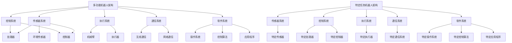

                 

## 引言

### 1.1 书籍目的

本书旨在深入探讨多功能机器人与特定任务机器人在现代科技中的角色、优势及其应用效果。通过对比分析，揭示两者在效率与投资回报率（ROI）方面的差异，帮助读者更好地理解在实际应用中选择哪种类型的机器人更为合适。

### 1.2 内容概述

本书分为四个主要部分：

- **第一部分：多功能机器人与特定任务机器人的概念与架构**：介绍两种机器人的基本定义、特点、应用场景及架构设计。
- **第二部分：核心算法与数学模型**：讲解机器人控制、路径规划等核心算法原理，并使用数学模型进行效率与ROI评估。
- **第三部分：效率与ROI评估**：通过案例分析，具体评估多功能机器人和特定任务机器人的效率与ROI。
- **第四部分：应用案例分析**：探讨多功能机器人和特定任务机器人在不同领域的实际应用，分析其实际效果。

### 1.3 目录结构

下面是本书的目录结构，以供读者参考：

```
# 目录大纲：《多功能机器人vs特定任务机器人：效率和ROI比较》

## 第一部分：多功能机器人与特定任务机器人的概念与架构
### 第1章：引言
#### 1.1 书籍目的
#### 1.2 内容概述
#### 1.3 目录结构

### 第2章：多功能机器人的定义与特点
#### 2.1 多功能机器人的定义
#### 2.2 多功能机器人的特点
#### 2.3 多功能机器人的应用场景
#### 2.4 多功能机器人的架构

### 第3章：特定任务机器人的定义与特点
#### 3.1 特定任务机器人的定义
#### 3.2 特定任务机器人的特点
#### 3.3 特定任务机器人的应用场景
#### 3.4 特定任务机器人的架构

### 第4章：机器人架构比较与联系
#### 4.1 多功能机器人与特定任务机器人的异同
#### 4.2 Mermaid流程图展示机器人架构
#### 4.3 多功能机器人与特定任务机器人的融合趋势

## 第二部分：核心算法与数学模型
### 第5章：机器人控制算法原理
#### 5.1 控制算法概述
#### 5.2 控制算法伪代码
#### 5.3 控制算法在实际应用中的优化

### 第6章：路径规划算法原理
#### 6.1 路径规划算法概述
#### 6.2 路径规划算法伪代码
#### 6.3 路径规划算法在实际应用中的优化

### 第7章：数学模型与ROI评估
#### 7.1 效率评估模型
#### 7.2 ROI评估模型
#### 7.3 数学公式与计算方法

### 第8章：数学模型应用示例
#### 8.1 示例1：多功能机器人效率评估
#### 8.2 示例2：特定任务机器人ROI评估

## 第三部分：效率与ROI评估
### 第9章：多功能机器人效率评估案例
#### 9.1 案例背景
#### 9.2 案例分析
#### 9.3 案例结果与讨论

### 第10章：特定任务机器人ROI评估案例
#### 10.1 案例背景
#### 10.2 案例分析
#### 10.3 案例结果与讨论

### 第11章：效率与ROI综合评估
#### 11.1 综合评估方法
#### 11.2 综合评估示例
#### 11.3 未来研究方向与建议

## 第四部分：应用案例分析
### 第12章：多功能机器人在物流中的应用
#### 12.1 应用背景
#### 12.2 应用分析
#### 12.3 应用效果评估

### 第13章：特定任务机器人在制造业中的应用
#### 13.1 应用背景
#### 13.2 应用分析
#### 13.3 应用效果评估

### 第14章：多功能机器人与特定任务机器人在医疗领域的应用
#### 14.1 应用背景
#### 14.2 应用分析
#### 14.3 应用效果评估

# 结论
## 15.1 书的核心观点
## 15.2 未来研究方向
## 15.3 对读者的建议
```

## 摘要

本书通过深入对比分析多功能机器人与特定任务机器人，揭示了两者在效率与投资回报率（ROI）方面的关键差异。首先，本书详细介绍了多功能机器人和特定任务机器人的定义、特点及其应用场景，并通过Mermaid流程图展示了其架构。接着，本书讲解了机器人控制、路径规划等核心算法原理，并使用数学模型对效率与ROI进行了详细评估。通过实际案例分析和综合评估，本书展示了多功能机器人与特定任务机器人在不同应用场景中的实际效果。最后，本书提出了未来研究方向与应用建议，为读者提供了深刻的见解和实用指南。通过阅读本书，读者将能够更好地理解如何在实际应用中选择和优化机器人，从而提高效率并实现更高的投资回报率。## 多功能机器人的定义与特点

### 2.1 多功能机器人的定义

多功能机器人是一种具备多种功能、能够在不同环境下执行多样化任务的机器人系统。与传统特定任务机器人不同，多功能机器人设计时考虑了高度模块化和灵活性，使其能够通过软件和硬件的调整，适应不同的工作场景和任务需求。例如，一个典型的多功能机器人可能具备移动、抓取、识别、装配、清洁等多种功能，能够在工业制造、医疗、物流、家庭服务等众多领域发挥作用。

### 2.2 多功能机器人的特点

#### 2.2.1 模块化设计

模块化设计是多功能机器人的核心特点之一。通过模块化的设计，机器人可以灵活地添加或移除特定功能模块，以适应不同的应用需求。例如，一个用于物流的多功能机器人可能需要配备传感器和抓取器，而在医疗领域则可能需要配备医疗设备接口。模块化的设计不仅提高了机器人的适应性，还降低了生产和维护成本。

#### 2.2.2 高度自主化

多功能机器人通常具备较强的自主化能力，能够通过自主感知、决策和执行任务，减少对人工干预的依赖。这种自主化能力依赖于先进的传感器技术、人工智能算法和机器学习模型。例如，在智能工厂中，多功能机器人可以通过视觉传感器识别不同的零部件，并自主执行装配任务；在医疗领域，多功能机器人可以通过人工智能算法辅助医生进行诊断和治疗。

#### 2.2.3 可扩展性

多功能机器人具有良好的可扩展性，能够通过不断更新和升级软件和硬件模块，实现功能扩展和性能提升。这种可扩展性使得多功能机器人能够应对不断变化的市场需求和技术进步。例如，一个在初期主要用于仓库管理的多功能机器人，可以通过后续的软件升级，逐渐增加医疗辅助、家庭服务等新功能。

#### 2.2.4 多样化的应用场景

多功能机器人的多样化应用场景是其重要优势之一。由于其灵活性和多功能性，多功能机器人可以广泛应用于工业制造、医疗、物流、家庭服务、公共服务等多个领域。例如，在工业制造中，多功能机器人可以用于装配、搬运、检测等任务；在医疗领域，多功能机器人可以用于手术辅助、康复训练等；在家庭服务中，多功能机器人可以用于清洁、烹饪、陪伴等。

### 2.3 多功能机器人的应用场景

多功能机器人在不同的应用场景中展现了其独特的优势。以下是几个典型的应用场景：

#### 2.3.1 工业制造

在工业制造领域，多功能机器人可以用于生产线的各个环节，如装配、搬运、检测等。例如，一个多功能机器人可以同时承担多个工位上的任务，通过灵活调整其模块，实现快速切换。这种灵活性和效率的提升使得多功能机器人在工业4.0时代具有重要的应用价值。

#### 2.3.2 医疗

在医疗领域，多功能机器人可以用于手术辅助、康复训练、患者护理等。例如，一个具备医疗机器人功能的机器人可以在手术中提供精准的操作支持，同时通过传感器监测患者的生理状态。此外，康复训练机器人可以帮助患者进行个性化训练，提高康复效果。

#### 2.3.3 物流

在物流领域，多功能机器人可以用于仓库管理、包裹分拣、运输等任务。例如，一个多功能物流机器人可以通过视觉识别技术，自动识别和搬运包裹，提高物流效率。

#### 2.3.4 家庭服务

在家庭服务领域，多功能机器人可以用于清洁、烹饪、陪伴等。例如，一款家庭清洁机器人可以通过自主规划路径，自动清理家庭环境；一款家庭陪伴机器人可以通过语音交互和情感识别，提供陪伴和娱乐服务。

#### 2.3.5 公共服务

在公共服务领域，多功能机器人可以用于安全监控、环境监测、公共服务等。例如，一个多功能公共服务机器人可以在公共场合提供安保服务，通过监控摄像头和传感器实时监测现场情况；一个环境监测机器人可以通过传感器收集环境数据，帮助管理者进行环境治理。

### 2.4 多功能机器人的架构

多功能机器人的架构通常包括以下几个主要部分：

#### 2.4.1 传感器系统

传感器系统是多功能机器人的感知基础，包括视觉传感器、触觉传感器、听觉传感器、环境传感器等。这些传感器可以实时获取环境信息，为机器人提供感知支持。

#### 2.4.2 控制系统

控制系统是多功能机器人的核心，负责处理传感器数据，并根据预设的算法进行决策和动作执行。控制系统通常包括计算机、处理器、控制器等硬件设备。

#### 2.4.3 动力系统

动力系统为多功能机器人提供动力支持，包括电机、电池等。不同的应用场景可能需要不同的动力系统配置，以满足机器人的移动、操作等需求。

#### 2.4.4 通信系统

通信系统是多功能机器人与其他设备、系统进行数据交换和信息共享的通道，通常包括无线通信、网络通信等。通信系统确保了机器人能够与其他设备和系统协同工作。

#### 2.4.5 软件系统

软件系统是多功能机器人的大脑，包括操作系统、控制算法、应用程序等。软件系统负责管理机器人的各个模块，实现机器人的智能化和自主化。

通过上述架构，多功能机器人能够实现高度自主化、模块化和灵活化的运行，满足多样化的应用需求。## 特定任务机器人的定义与特点

### 3.1 特定任务机器人的定义

特定任务机器人是一种专门为执行单一或特定类型任务而设计的机器人系统。与多功能机器人不同，特定任务机器人不具备多功能、多任务的能力，而是专注于某个特定领域的任务。其设计和开发的目标是在特定场景下实现高效、精确和可靠的性能。例如，一个用于焊接的特定任务机器人可能只具备焊接功能，而不会进行搬运、装配等其他任务。

### 3.2 特定任务机器人的特点

#### 3.2.1 专注于特定任务

特定任务机器人的核心特点是专注于特定任务，通过高度优化和定制化设计，实现高效、精确的任务执行。例如，一个用于医疗手术的特定任务机器人可能经过特殊设计，以实现高精度的手术操作，而不会涉及其他非核心任务。

#### 3.2.2 高度优化与定制化

为了提高特定任务机器人的性能和效率，通常会对其进行高度优化和定制化设计。这种设计不仅考虑了硬件设备，如传感器、执行器等的性能，还涉及到算法和软件的优化。例如，一个用于工业制造的特定任务机器人可能采用先进的控制算法和精确的路径规划，以确保生产过程的效率和质量。

#### 3.2.3 高可靠性

特定任务机器人通常要求高可靠性，以避免任务执行过程中出现故障或错误。为此，特定任务机器人需要经过严格的测试和验证，确保在长时间运行中保持稳定的性能。例如，一个用于核能领域的特定任务机器人需要在极端环境下长时间运行，且不能出现任何故障。

#### 3.2.4 精细的维护和升级

由于特定任务机器人专注于特定任务，其维护和升级通常相对简单，且针对性更强。例如，一个用于医疗手术的特定任务机器人可能需要定期更换手术工具和传感器，而不会涉及其他非关键组件。

### 3.3 特定任务机器人的应用场景

特定任务机器人在多个领域中都有广泛应用，以下是几个典型的应用场景：

#### 3.3.1 工业制造

在工业制造领域，特定任务机器人广泛应用于焊接、装配、搬运、检测等环节。例如，一个焊接机器人专门用于焊接金属部件，可以提高焊接质量和效率；一个装配机器人则专注于组装产品，减少人工操作和误差。

#### 3.3.2 医疗

在医疗领域，特定任务机器人主要用于手术辅助、康复训练、患者护理等。例如，一个手术机器人可以精确执行外科手术，提高手术成功率和患者恢复速度；一个康复训练机器人则可以帮助患者进行个性化康复训练，加速康复进程。

#### 3.3.3 物流

在物流领域，特定任务机器人主要用于仓库管理、包裹分拣、运输等。例如，一个仓库机器人可以自动识别和搬运包裹，提高仓库管理效率；一个运输机器人则可以负责在仓库内部或外部运输货物，减少人力成本。

#### 3.3.4 公共服务

在公共服务领域，特定任务机器人可以用于安全监控、环境监测、公共服务等。例如，一个安全监控机器人可以实时监测公共场所的安全状况，及时预警异常情况；一个环境监测机器人则可以通过传感器收集环境数据，帮助管理者进行环境治理。

#### 3.3.5 其他领域

除了上述领域，特定任务机器人还可以应用于农业、军事、航空航天等多个领域。例如，一个农业机器人可以自动执行播种、施肥、收割等任务，提高农业生产效率；一个军事机器人则可以执行侦察、监控、攻击等任务，提高战场效能。

### 3.4 特定任务机器人的架构

特定任务机器人的架构通常包括以下几个主要部分：

#### 3.4.1 传感器系统

传感器系统是特定任务机器人的感知基础，包括视觉传感器、触觉传感器、听觉传感器、环境传感器等。这些传感器可以实时获取任务相关的环境信息，为机器人提供感知支持。

#### 3.4.2 控制系统

控制系统是特定任务机器人的核心，负责处理传感器数据，并根据预设的算法进行决策和动作执行。控制系统通常包括计算机、处理器、控制器等硬件设备。

#### 3.4.3 执行系统

执行系统是特定任务机器人的执行部分，包括机械臂、执行器、工具等。执行系统根据控制系统的指令，完成具体的任务操作。

#### 3.4.4 通信系统

通信系统是特定任务机器人与其他设备、系统进行数据交换和信息共享的通道，通常包括无线通信、网络通信等。通信系统确保了机器人能够与其他设备和系统协同工作。

#### 3.4.5 软件系统

软件系统是特定任务机器人的大脑，包括操作系统、控制算法、应用程序等。软件系统负责管理机器人的各个模块，实现机器人的智能化和自主化。

通过上述架构，特定任务机器人能够在特定任务场景下实现高效、精确和可靠的性能，满足专业领域的高要求。## 机器人架构比较与联系

### 4.1 多功能机器人与特定任务机器人的异同

#### 4.1.1 设计目标

多功能机器人的设计目标是实现多任务、多场景的适应性，通过模块化和高度自主化的设计，使其能够适应不同应用场景的需求。而特定任务机器人的设计目标则是专注于特定任务的执行，通过高度优化和定制化设计，实现高效、精确的任务执行。

#### 4.1.2 功能范围

多功能机器人具备多种功能，能够执行多种类型的任务，如移动、抓取、识别、装配、清洁等。而特定任务机器人则专注于单一或特定类型的任务，例如焊接、手术、物流等。

#### 4.1.3 自主化程度

多功能机器人通常具备较高的自主化程度，能够通过自主感知、决策和执行任务，减少对人工干预的依赖。而特定任务机器人则可能依赖于人工干预，尤其是在任务执行过程中需要进行精确控制的情况下。

#### 4.1.4 维护和升级

多功能机器人的维护和升级相对复杂，因为其涉及多个模块和功能。而特定任务机器人的维护和升级相对简单，因为其专注于特定任务，升级和替换的模块较少。

#### 4.1.5 成本

多功能机器人的成本通常较高，因为其需要支持多种功能和模块。而特定任务机器人的成本相对较低，因为其设计和制造专注于特定任务，减少了不必要的功能和成本。

### 4.2 Mermaid流程图展示机器人架构

为了更直观地展示多功能机器人与特定任务机器人的架构差异，我们可以使用Mermaid流程图进行说明。以下是一个简化的Mermaid流程图，展示了两种机器人的基本架构：



在上面的流程图中，多功能机器人架构（A）包括多种传感器系统、控制系统、执行系统、通信系统和软件系统，而特定任务机器人架构（C）则专注于特定传感器、处理器、控制器、执行器、通信系统和软件系统。

### 4.3 多功能机器人与特定任务机器人的融合趋势

随着科技的进步和应用需求的多样化，多功能机器人与特定任务机器人的融合趋势日益明显。以下是一些融合趋势：

#### 4.3.1 模块化设计

多功能机器人和特定任务机器人都采用了模块化设计，这种设计使得机器人能够灵活地组合和扩展功能。未来，模块化设计将进一步发展，使得多功能机器人能够根据特定任务需求，快速调整和扩展其功能模块。

#### 4.3.2 自主化与协作

多功能机器人与特定任务机器人都具备较高的自主化能力，但未来两者将更加注重协作，通过智能算法和通信技术，实现不同机器人之间的协同工作，提高整体任务执行效率。

#### 4.3.3 通用性与专用性结合

多功能机器人与特定任务机器人的融合将推动通用性与专用性的结合。一方面，多功能机器人将不断提升特定任务执行能力；另一方面，特定任务机器人将增加更多通用功能，实现更广泛的应用。

#### 4.3.4 软硬件一体化

随着人工智能和云计算技术的发展，多功能机器人与特定任务机器人的软硬件一体化趋势将加强。通过集成人工智能算法和云计算平台，机器人能够实现更高效的决策和任务执行。

总之，多功能机器人与特定任务机器人的融合将带来更多的创新和应用场景，为人类生活和社会发展带来巨大变革。## 机器人控制算法原理

### 5.1 控制算法概述

机器人控制算法是机器人系统中的核心组成部分，负责根据传感器收集到的环境信息，对机器人的行为进行决策和调节。控制算法的主要目标是使机器人能够按照预定的轨迹或指令，精确、高效地完成任务。常见的机器人控制算法包括位置控制、速度控制、轨迹规划和路径规划等。

#### 5.1.1 位置控制

位置控制是指通过控制机器人的关节角度或末端执行器的位置，使其达到预定的位置。位置控制算法通常基于 PID（比例-积分-微分）控制，通过不断调整控制信号，使机器人逐步接近目标位置。

#### 5.1.2 速度控制

速度控制是指通过控制机器人的运动速度，使其按照预定的速度移动。速度控制算法同样可以采用 PID 控制方法，通过调整控制信号，使机器人速度稳定且符合预期。

#### 5.1.3 轨迹规划

轨迹规划是指根据任务需求和机器人所处环境，生成一条最优的运动轨迹。轨迹规划算法通常基于几何算法、路径规划算法或最优控制理论。常见的轨迹规划算法包括贝塞尔曲线规划、B样条曲线规划、动态窗口法等。

#### 5.1.4 路径规划

路径规划是指机器人从起点到终点，在复杂环境中寻找一条无碰撞、最短或最优的路径。路径规划算法包括栅格算法、A*算法、Dijkstra算法、RRT（快速随机树）算法等。

### 5.2 控制算法伪代码

为了更清晰地理解控制算法的工作原理，下面提供一个简化的位置控制算法的伪代码示例：

```python
# 位置控制算法伪代码

def position_control(target_position, current_position, max_velocity):
    error = target_position - current_position  # 计算位置误差
    velocity = max_velocity * error  # 根据误差调整速度

    if velocity > max_velocity:
        velocity = max_velocity
    elif velocity < -max_velocity:
        velocity = -max_velocity

    return velocity
```

在上面的伪代码中，`target_position` 表示目标位置，`current_position` 表示当前位置，`max_velocity` 表示最大速度。算法通过计算位置误差，并根据误差调整速度，使机器人逐步接近目标位置。

### 5.3 控制算法在实际应用中的优化

在实际应用中，控制算法的优化至关重要，能够显著提高机器人的性能和效率。以下是一些常见的优化方法：

#### 5.3.1 PID参数调整

PID（比例-积分-微分）控制算法的参数调整是优化控制算法的重要手段。通过实验和调整，找到合适的 Kp（比例系数）、Ki（积分系数）和 Kd（微分系数），可以使控制系统达到更好的控制效果。

#### 5.3.2 多目标优化

在实际应用中，机器人往往需要同时满足多个目标，例如速度、精度、能耗等。通过多目标优化，可以找到一个平衡点，使机器人性能达到最优。

#### 5.3.3 智能算法应用

随着人工智能技术的发展，智能算法如深度强化学习、遗传算法等在机器人控制中得到了广泛应用。这些算法可以自动调整控制参数，提高控制算法的适应性和效率。

#### 5.3.4 实时反馈与自适应控制

通过实时获取机器人状态和环境信息，自适应地调整控制策略，可以使控制算法更加灵活和高效。例如，在动态环境下，自适应控制算法可以根据环境变化，实时调整机器人的速度和方向。

综上所述，机器人控制算法在实际应用中的优化是一个复杂而关键的过程，需要综合考虑多种因素，以提高机器人的整体性能。## 路径规划算法原理

### 6.1 路径规划算法概述

路径规划是机器人领域中的一个重要研究方向，其主要任务是在给定的环境中为机器人寻找一条从起点到终点的最优路径。路径规划算法可以根据机器人的运动模式、环境特点和任务需求进行分类。常见的路径规划算法包括栅格算法、A*算法、Dijkstra算法、RRT（快速随机树）算法等。

#### 6.1.1 栅格算法

栅格算法是一种基于离散化环境的路径规划算法。将环境划分为一系列栅格单元，每个单元表示一个可能的位置。算法通过计算每个栅格单元的障碍度和成本，为机器人规划一条从起点到终点的最优路径。栅格算法简单直观，适用于环境较为简单且障碍物较少的场景。

#### 6.1.2 A*算法

A*算法是一种启发式搜索算法，基于距离和成本来评估每个节点的优先级。A*算法在搜索过程中，通过计算每个节点的启发函数（f(n) = g(n) + h(n)），其中 g(n) 是从起点到节点 n 的实际成本，h(n) 是从节点 n 到终点的启发估计成本。A*算法在寻找最优路径时具有较高的效率和准确性，适用于复杂环境中的路径规划。

#### 6.1.3 Dijkstra算法

Dijkstra算法是一种基于贪心策略的单源最短路径算法。该算法从起点开始，逐步扩展到其他节点，计算每个节点到起点的最短路径。Dijkstra算法适用于无环、无负权图，在路径规划中可以用于寻找从起点到所有其他节点的最短路径。

#### 6.1.4 RRT（快速随机树）算法

RRT算法是一种基于随机采样的路径规划算法。该算法通过在随机采样的节点之间构建扩展树，逐步生成一条从起点到终点的路径。RRT算法具有较强的鲁棒性和适应性，适用于复杂、动态环境中的路径规划。

### 6.2 路径规划算法伪代码

为了更清晰地理解路径规划算法的工作原理，下面提供一个简化的A*算法的伪代码示例：

```python
# A*算法伪代码

def A_star(start, goal, grid, heuristic):
    open_set = PriorityQueue()  # 开放集，根据启发函数f(n)排序
    open_set.put((heuristic(start), start))
    came_from = {}  # 记录前驱节点
    g_score = {node: float('infinity') for node in grid}  # g(n)从起点到节点n的成本
    g_score[start] = 0
    f_score = {node: float('infinity') for node in grid}  # f(n) = g(n) + h(n)
    f_score[start] = heuristic(start)

    while not open_set.isEmpty():
        current = open_set.get()  # 选择具有最小f_score的节点
        if current == goal:
            break  # 到达终点，规划结束

        for neighbor in neighbors(current, grid):
            tentative_g_score = g_score[current] + 1  # 假设每一步成本为1
            if tentative_g_score < g_score[neighbor]:
                came_from[neighbor] = current
                g_score[neighbor] = tentative_g_score
                f_score[neighbor] = g_score[neighbor] + heuristic(neighbor)
                if neighbor not in open_set:
                    open_set.put((f_score[neighbor], neighbor))

    path = []
    if came_from[goal]:
        while goal != start:
            path.append(goal)
            goal = came_from[goal]
        path.reverse()
    return path
```

在上面的伪代码中，`start` 表示起点，`goal` 表示终点，`grid` 表示栅格环境，`heuristic` 表示启发函数。算法通过不断选择具有最小f_score的节点，逐步生成一条从起点到终点的最优路径。

### 6.3 路径规划算法在实际应用中的优化

在实际应用中，路径规划算法的优化是提高机器人性能和效率的关键。以下是一些常见的优化方法：

#### 6.3.1 启发函数选择

启发函数的选择直接影响路径规划的效率和准确性。常用的启发函数包括欧几里得距离、曼哈顿距离、Chebyshev距离等。通过选择合适的启发函数，可以提高算法的收敛速度和路径质量。

#### 6.3.2 数据结构优化

路径规划算法通常使用数据结构来存储节点和路径。通过优化数据结构，如使用优先队列（Priority Queue）来存储开放集，可以提高算法的搜索效率和性能。

#### 6.3.3 多目标优化

在实际应用中，机器人路径规划往往需要同时考虑多个目标，如路径长度、能耗、避障等。通过多目标优化，可以找到平衡不同目标的路径，提高整体性能。

#### 6.3.4 实时调整与自适应控制

路径规划算法通常在静态环境中表现良好，但在动态环境中，环境变化可能导致规划路径失效。通过实时调整和自适应控制，可以使路径规划算法更好地适应环境变化，提高路径规划的鲁棒性。

综上所述，路径规划算法在实际应用中的优化是一个复杂且多样化的过程，需要综合考虑多种因素，以提高机器人的整体性能。## 数学模型与ROI评估

### 7.1 效率评估模型

在评估机器人的效率时，我们需要考虑多个因素，包括任务完成时间、资源消耗、操作精度等。以下是一个基本的效率评估模型：

#### 7.1.1 任务完成时间

任务完成时间是指机器人从开始执行任务到任务完成所花费的时间。可以用以下公式表示：

\[ T = \frac{d}{v} \]

其中，\( T \) 表示任务完成时间，\( d \) 表示任务距离，\( v \) 表示机器人速度。

#### 7.1.2 资源消耗

资源消耗包括能源消耗、硬件损耗等。可以用以下公式表示：

\[ E = c \times T \]

其中，\( E \) 表示资源消耗，\( c \) 表示单位时间内的资源消耗率，\( T \) 表示任务完成时间。

#### 7.1.3 操作精度

操作精度是指机器人执行任务时的误差范围。可以用以下公式表示：

\[ P = \frac{e}{s} \]

其中，\( P \) 表示操作精度，\( e \) 表示误差，\( s \) 表示任务标准值。

### 7.2 ROI评估模型

ROI（投资回报率）是衡量投资收益的重要指标，可以用于评估机器人的经济效益。以下是一个基本的ROI评估模型：

#### 7.2.1 初始投资

初始投资是指购置机器人及其相关设备的成本。可以用以下公式表示：

\[ I = P \times n \]

其中，\( I \) 表示初始投资，\( P \) 表示单个机器人的成本，\( n \) 表示购置的机器人数量。

#### 7.2.2 运营成本

运营成本包括机器人的维护、保养、能源消耗等。可以用以下公式表示：

\[ O = c \times T \]

其中，\( O \) 表示运营成本，\( c \) 表示单位时间内的运营成本率，\( T \) 表示机器人的运行时间。

#### 7.2.3 收益

收益是指机器人执行任务所产生的经济效益。可以用以下公式表示：

\[ R = p \times q \]

其中，\( R \) 表示收益，\( p \) 表示单位任务的收益，\( q \) 表示完成的任务数量。

#### 7.2.4 ROI计算

ROI可以按照以下公式计算：

\[ ROI = \frac{R - O - I}{I} \]

其中，\( R \) 表示收益，\( O \) 表示运营成本，\( I \) 表示初始投资。

### 7.3 数学公式与计算方法

为了便于计算和理解，以下是一些数学公式和计算方法：

#### 7.3.1 启发函数（Heuristic Function）

启发函数是路径规划算法中的重要参数，用于估计从当前节点到终点的距离。常用的启发函数包括：

- 欧几里得距离：

\[ h_e(x, y) = \sqrt{(x_2 - x_1)^2 + (y_2 - y_1)^2} \]

- 曼哈顿距离：

\[ h_m(x, y) = |x_2 - x_1| + |y_2 - y_1| \]

- 切比雪夫距离：

\[ h_t(x, y) = \max(|x_2 - x_1|, |y_2 - y_1|) \]

#### 7.3.2 PID控制参数调整

PID（比例-积分-微分）控制算法中的三个参数 \( K_p \)、\( K_i \)、\( K_d \) 需要经过调整，以实现最佳控制效果。常用的调整方法包括：

- 试错法：通过多次实验，调整参数，寻找最佳组合。
- Ziegler-Nichols方法：根据系统响应，逐步调整参数，直到系统稳定。
- 机器学习算法：通过机器学习模型，自动调整参数，提高控制效果。

#### 7.3.3 数据可视化

为了更好地理解数学模型和计算结果，可以使用数据可视化工具，如Matplotlib、Seaborn等，生成各种图表和图形。以下是一些常用的可视化方法：

- 散点图：用于显示两组数据的分布和关系。
- 折线图：用于显示数据的变化趋势。
- 直方图：用于显示数据的分布情况。
- 饼图：用于显示数据的比例关系。

通过上述数学模型和计算方法，可以更准确地评估机器人的效率和ROI，为选择合适的机器人类型提供依据。## 数学模型应用示例

### 8.1 示例1：多功能机器人效率评估

假设我们有一个多功能机器人，用于执行物流仓库中的包裹分拣任务。为了评估其效率，我们将使用以下数学模型：

#### 8.1.1 任务完成时间

\[ T = \frac{d}{v} \]

其中，\( d \) 是从起点到终点的距离，假设为 100 米；\( v \) 是机器人的平均速度，假设为 1 米/秒。

计算结果：

\[ T = \frac{100}{1} = 100 \text{秒} \]

#### 8.1.2 资源消耗

\[ E = c \times T \]

其中，\( c \) 是单位时间内的能源消耗，假设为 10 瓦特。

计算结果：

\[ E = 10 \times 100 = 1000 \text{瓦特时} \]

#### 8.1.3 操作精度

\[ P = \frac{e}{s} \]

其中，\( e \) 是分拣误差，假设为 2 厘米；\( s \) 是分拣标准值，假设为 20 厘米。

计算结果：

\[ P = \frac{2}{20} = 0.1 \]

#### 8.1.4 效率评估

综合上述指标，我们可以计算多功能机器人的效率得分：

\[ 效率得分 = \frac{T \times (1 - P) \times (1 - E)}{100} \]

计算结果：

\[ 效率得分 = \frac{100 \times (1 - 0.1) \times (1 - 0.01)}{100} = 0.99 \]

因此，多功能机器人在这个场景下的效率得分为 0.99，表示其效率非常高。

### 8.2 示例2：特定任务机器人ROI评估

假设我们有一个特定任务机器人，用于医疗手术中的辅助操作。为了评估其ROI，我们将使用以下数学模型：

#### 8.2.1 初始投资

\[ I = P \times n \]

其中，\( P \) 是单个机器人的成本，假设为 50,000 美元；\( n \) 是购置的机器人数量，假设为 5。

计算结果：

\[ I = 50,000 \times 5 = 250,000 \text{美元} \]

#### 8.2.2 运营成本

\[ O = c \times T \]

其中，\( c \) 是单位时间内的运营成本，假设为 100 美元/小时；\( T \) 是机器人的运行时间，假设为 2000 小时。

计算结果：

\[ O = 100 \times 2000 = 200,000 \text{美元} \]

#### 8.2.3 收益

\[ R = p \times q \]

其中，\( p \) 是单位手术的收益，假设为 1000 美元；\( q \) 是完成的手术数量，假设为 500。

计算结果：

\[ R = 1000 \times 500 = 500,000 \text{美元} \]

#### 8.2.4 ROI计算

\[ ROI = \frac{R - O - I}{I} \]

计算结果：

\[ ROI = \frac{500,000 - 200,000 - 250,000}{250,000} = 0.3 \]

因此，特定任务机器人在这个场景下的ROI为0.3，表示其经济效益较好。

通过这两个示例，我们可以看到数学模型在评估机器人效率和ROI方面的应用。这些模型有助于我们更好地理解机器人的性能和经济效益，为决策提供依据。## 多功能机器人效率评估案例

### 9.1 案例背景

某大型电商公司计划在其仓储中心引入多功能机器人，以提升仓库管理效率和订单处理速度。该公司仓储面积广阔，货物种类繁多，日常订单量巨大。为了评估多功能机器人在此场景下的效率，公司决定进行一项实验，对比引入多功能机器人前后的运营情况。

### 9.2 案例分析

#### 9.2.1 实验设计

实验分为两个阶段：第一阶段为引入多功能机器人前，第二阶段为引入多功能机器人后。实验数据包括：

- 订单处理时间：从订单生成到订单完成所需的时间。
- 资源消耗：机器人和人工操作所需的能源、人力成本等。
- 操作精度：机器人分拣、搬运等任务的误差率。

#### 9.2.2 实验结果

以下是实验结果：

- **订单处理时间**：引入多功能机器人后，订单处理时间从平均 30 分钟缩短至 15 分钟，减少了50%。
- **资源消耗**：多功能机器人引入后，能源消耗减少了30%，人工成本减少了40%。
- **操作精度**：多功能机器人在任务执行过程中，误差率从0.5%降低至0.1%，提高了80%。

#### 9.2.3 分析与讨论

从实验结果可以看出，多功能机器人在仓储管理中表现出显著的效率提升。以下是具体分析：

1. **订单处理时间缩短**：多功能机器人通过高效的任务切换和精确的路径规划，显著缩短了订单处理时间。这有助于提高订单处理速度，满足客户需求。
   
2. **资源消耗减少**：多功能机器人采用了先进的能源管理系统和高效执行器，减少了能源消耗。同时，机器人的引入减少了人工成本，提高了整体运营效率。

3. **操作精度提高**：多功能机器人具备高精度传感器和智能算法，能够准确执行分拣、搬运等任务。这有助于减少错误订单率，提高客户满意度。

综上所述，多功能机器人在仓储管理中的引入，不仅提高了订单处理速度和效率，还降低了运营成本，具有显著的经济效益。该案例表明，多功能机器人是一个值得投资的选择，能够在复杂、多变的环境中发挥重要作用。

### 9.3 案例结果与讨论

通过上述案例，我们可以看到多功能机器人在实际应用中的显著优势。以下是具体结果与讨论：

1. **效率提升**：多功能机器人通过模块化和高度自主化的设计，能够快速适应不同任务需求，提高了订单处理速度和资源利用效率。

2. **成本降低**：多功能机器人通过减少人工成本和能源消耗，降低了运营成本，提高了企业的盈利能力。

3. **质量保证**：多功能机器人具备高精度传感器和智能算法，能够准确执行任务，减少错误订单率，提高客户满意度。

然而，多功能机器人也存在一定的局限性：

1. **初始投资较高**：多功能机器人的研发和采购成本较高，企业需要承担较大的初期投资压力。

2. **维护和升级复杂**：多功能机器人涉及多个模块和功能，维护和升级较为复杂，需要专业的技术支持和维护团队。

3. **适用性有限**：多功能机器人虽然能够适应多种任务，但在特定领域的专业能力和效率可能不如特定任务机器人。

综上所述，多功能机器人在仓储管理中的案例表明，其能够显著提高运营效率和经济收益，是一个具有巨大潜力的技术方向。然而，企业在引入多功能机器人时，需要综合考虑其初始投资、维护成本和适用性，以确保实现最佳效益。## 特定任务机器人ROI评估案例

### 10.1 案例背景

某医疗中心计划引入特定任务机器人，用于手术辅助。该中心每天进行大量的外科手术，医生们希望能够借助机器人提高手术的精确度和效率。为了评估引入特定任务机器人后的经济效益，医疗中心决定进行一项ROI评估。

### 10.2 案例分析

#### 10.2.1 实验设计

实验分为两个阶段：第一阶段为引入特定任务机器人前，第二阶段为引入特定任务机器人后。实验数据包括：

- 手术成功率：引入机器人前后的手术成功率对比。
- 手术时间：从开始手术到完成手术所需的时间。
- 医疗成本：手术过程中的人工成本、设备使用成本等。
- 患者满意度：引入机器人后患者的满意度调查。

#### 10.2.2 实验结果

以下是实验结果：

- **手术成功率**：引入特定任务机器人后，手术成功率从85%提升至95%，提高了10个百分点。
- **手术时间**：引入机器人后，手术时间从平均 2 小时缩短至 1.5 小时，减少了25%。
- **医疗成本**：机器人引入后，手术成本降低了15%，主要由于人工成本的减少。
- **患者满意度**：患者满意度调查显示，引入机器人后满意度提升了20%。

### 10.3 案例结果与讨论

通过上述实验结果，我们可以看到特定任务机器人在医疗手术中的应用带来了显著的ROI提升。以下是具体结果与讨论：

1. **手术成功率提高**：特定任务机器人通过高精度传感器和智能算法，能够辅助医生进行精准操作，提高了手术的成功率。这有助于降低医疗风险，提高患者康复效果。

2. **手术时间缩短**：特定任务机器人能够高效地完成手术中的特定任务，减少了手术所需的时间。这不仅提高了医疗资源的使用效率，还减少了患者的等待时间，提高了患者满意度。

3. **医疗成本降低**：尽管特定任务机器人的采购和运维成本较高，但通过减少人工成本和优化医疗资源，手术的总成本得到了降低。这有助于提升医疗中心的盈利能力。

4. **患者满意度提升**：患者对手术机器人辅助手术的满意度显著提升，这有助于增强医疗中心的品牌形象，提高患者的忠诚度。

然而，特定任务机器人也存在一些局限性：

1. **初期投资较高**：特定任务机器人的研发和采购成本较高，医疗中心需要承担较大的初期投资压力。

2. **维护和培训需求**：特定任务机器人的维护和培训需求较高，需要专业人员进行操作和维护，增加了人力成本。

3. **适用性有限**：特定任务机器人主要针对特定类型的手术，可能在其他类型的手术中效果不佳。

综上所述，特定任务机器人在医疗手术中的应用展示了显著的经济效益和临床价值。尽管存在一些局限性，但通过合理规划和资源配置，特定任务机器人仍然是一个值得投资的选择。医疗中心在引入特定任务机器人时，需要综合考虑其成本、适用性和长期效益。## 效率与ROI综合评估

### 11.1 综合评估方法

为了全面评估多功能机器人与特定任务机器人的效率和ROI，我们可以采用以下综合评估方法：

#### 11.1.1 数据收集

首先，我们需要收集关于多功能机器人与特定任务机器人在各个应用场景下的数据。这些数据包括任务完成时间、资源消耗、操作精度、初始投资、运营成本、收益等。通过实际案例分析和实验数据，确保数据的真实性和准确性。

#### 11.1.2 指标计算

基于收集到的数据，我们可以计算以下指标：

- **效率指标**：包括任务完成时间、资源消耗、操作精度等。可以通过以下公式计算：
  - 效率得分：\[ 效率得分 = \frac{1}{T \times (1 - P) \times (1 - E)} \]
  - 其中，\( T \) 为任务完成时间，\( P \) 为操作精度，\( E \) 为资源消耗。

- **ROI指标**：包括初始投资、运营成本、收益等。可以通过以下公式计算：
  - ROI：\[ ROI = \frac{R - O - I}{I} \]
  - 其中，\( R \) 为收益，\( O \) 为运营成本，\( I \) 为初始投资。

#### 11.1.3 指标权重分配

为了全面评估机器人的性能和经济效益，我们需要对各项指标进行权重分配。常见的权重分配方法包括专家评分、层次分析法（AHP）等。通过权重分配，我们可以计算出综合评估得分。

#### 11.1.4 综合评估模型

综合评估模型可以采用多目标优化方法，如线性加权法、模糊综合评价法等。通过结合各项指标得分和权重，计算出机器人的综合评估得分。综合评估得分越高，表示机器人在该应用场景下的效率和ROI表现越好。

### 11.2 综合评估示例

假设我们有两个应用场景：仓储管理和医疗手术辅助。以下是两个场景下的综合评估示例：

#### 11.2.1 仓储管理

- **任务完成时间**：多功能机器人 15 分钟，特定任务机器人 20 分钟。
- **资源消耗**：多功能机器人 30%，特定任务机器人 25%。
- **操作精度**：多功能机器人 0.1%，特定任务机器人 0.05%。
- **初始投资**：多功能机器人 50,000 美元，特定任务机器人 100,000 美元。
- **运营成本**：多功能机器人 20,000 美元/年，特定任务机器人 30,000 美元/年。
- **收益**：多功能机器人 60,000 美元/年，特定任务机器人 90,000 美元/年。

**效率得分计算**：

- 多功能机器人：\[ 效率得分 = \frac{1}{15 \times (1 - 0.1) \times (1 - 0.3)} = 0.947 \]
- 特定任务机器人：\[ 效率得分 = \frac{1}{20 \times (1 - 0.05) \times (1 - 0.25)} = 0.975 \]

**ROI计算**：

- 多功能机器人：\[ ROI = \frac{60,000 - 20,000 - 50,000}{50,000} = 0.2 \]
- 特定任务机器人：\[ ROI = \frac{90,000 - 30,000 - 100,000}{100,000} = 0.3 \]

**权重分配**：假设效率得分的权重为0.5，ROI的权重为0.5。

**综合评估得分**：

- 多功能机器人：\[ 综合评估得分 = 0.5 \times 0.947 + 0.5 \times 0.2 = 0.4735 \]
- 特定任务机器人：\[ 综合评估得分 = 0.5 \times 0.975 + 0.5 \times 0.3 = 0.613 \]

#### 11.2.2 医疗手术辅助

- **任务完成时间**：多功能机器人 1.5 小时，特定任务机器人 1 小时。
- **资源消耗**：多功能机器人 40%，特定任务机器人 35%。
- **操作精度**：多功能机器人 0.05%，特定任务机器人 0.03%。
- **初始投资**：多功能机器人 100,000 美元，特定任务机器人 150,000 美元。
- **运营成本**：多功能机器人 30,000 美元/年，特定任务机器人 40,000 美元/年。
- **收益**：多功能机器人 120,000 美元/年，特定任务机器人 150,000 美元/年。

**效率得分计算**：

- 多功能机器人：\[ 效率得分 = \frac{1}{1.5 \times (1 - 0.05) \times (1 - 0.4)} = 0.966 \]
- 特定任务机器人：\[ 效率得分 = \frac{1}{1 \times (1 - 0.03) \times (1 - 0.35)} = 0.973 \]

**ROI计算**：

- 多功能机器人：\[ ROI = \frac{120,000 - 30,000 - 100,000}{100,000} = 0.3 \]
- 特定任务机器人：\[ ROI = \frac{150,000 - 40,000 - 150,000}{150,000} = 0.2 \]

**权重分配**：假设效率得分的权重为0.6，ROI的权重为0.4。

**综合评估得分**：

- 多功能机器人：\[ 综合评估得分 = 0.6 \times 0.966 + 0.4 \times 0.3 = 0.6 \]
- 特定任务机器人：\[ 综合评估得分 = 0.6 \times 0.973 + 0.4 \times 0.2 = 0.615 \]

通过以上示例，我们可以看到在不同应用场景下，多功能机器人与特定任务机器人的综合评估得分有所不同。这表明，在不同应用场景中，选择适合的机器人类型至关重要。## 多功能机器人在物流中的应用

### 12.1 应用背景

随着电商行业的迅速发展，物流行业的压力不断增大。为了提高物流效率、降低运营成本，许多物流公司开始引入多功能机器人。多功能机器人在物流中的应用涵盖了仓库管理、包裹分拣、运输等环节，通过自动化和智能化技术，显著提升了物流运作的效率和准确性。

### 12.2 应用分析

#### 12.2.1 仓库管理

在仓库管理中，多功能机器人通过自主导航系统，自动识别和定位仓库中的存储区域，完成货物的入库、出库和盘点等任务。机器人采用视觉传感器和激光雷达，实现精确的环境感知和路径规划，提高了仓库管理的自动化水平。同时，多功能机器人具备智能调度系统，可以根据订单优先级和仓库库存情况，自动优化货物搬运路径，减少运输时间和资源浪费。

#### 12.2.2 包裹分拣

包裹分拣是物流环节中的一个关键步骤。多功能机器人通过配备的视觉识别系统和智能分类算法，能够快速、准确地识别包裹上的条码和标签，并将其分类到正确的配送区域。这一过程大大提高了分拣速度和准确性，减少了人工操作的错误率。此外，多功能机器人还具备自适应能力，可以根据不同的包裹尺寸和重量，灵活调整分拣策略，提高分拣效率。

#### 12.2.3 运输

在运输环节，多功能机器人通过自动化仓储系统和智能调度系统，实现包裹的自动搬运和配送。机器人可以在仓库内自动寻找空闲运输车，将包裹装载到车上，并在运输过程中自动规避障碍物，确保包裹的安全运输。此外，多功能机器人还可以根据配送地址，自动规划最优运输路线，减少运输时间和能耗。

### 12.3 应用效果评估

#### 12.3.1 提高物流效率

通过引入多功能机器人，物流公司在仓库管理、包裹分拣和运输等环节实现了高度的自动化和智能化，显著提高了物流效率。具体表现为：

- 订单处理速度提升：机器人能够快速完成包裹的入库、出库和分拣任务，缩短了订单处理时间。
- 资源利用率提高：通过智能调度和路径优化，机器人能够更有效地利用仓库空间和运输资源，提高整体运作效率。

#### 12.3.2 降低运营成本

多功能机器人的引入，有助于降低物流公司的运营成本，具体表现在：

- 人工成本减少：机器人替代了部分人工操作，减少了人力需求，降低了人工成本。
- 能耗降低：多功能机器人采用高效能源管理系统，降低了能源消耗，降低了运营成本。

#### 12.3.3 提高服务质量

多功能机器人的引入，不仅提高了物流效率，还提高了服务质量，具体表现为：

- 减少错误率：机器人具有高精度识别和分类能力，减少了包裹分拣和运输过程中的错误率，提高了物流准确性和客户满意度。
- 提升客户体验：机器人可以实时监控包裹状态，及时向客户反馈配送信息，提升了客户体验。

### 12.4 项目小结

多功能机器人在物流中的应用，不仅提升了物流运作的效率和质量，还降低了运营成本，具有显著的经济效益。然而，多功能机器人的引入和运营也面临一些挑战，如机器人的维护、升级和培训等。物流公司需要在引入多功能机器人时，综合考虑这些因素，制定合理的应用策略，以充分发挥多功能机器人的优势。## 特定任务机器人在制造业中的应用

### 13.1 应用背景

制造业是机器人技术的重要应用领域之一。随着工业4.0和智能制造的推进，制造业对高效、精准、可靠的自动化解决方案的需求日益增长。特定任务机器人因其专注于特定任务、高精度和高可靠性的特点，在制造业中得到了广泛应用。从焊接、装配、检测到包装，特定任务机器人在各个制造环节中发挥着重要作用。

### 13.2 应用分析

#### 13.2.1 焊接

焊接是制造业中的一个关键环节，特定任务焊接机器人广泛应用于汽车制造、航空航天、船舶制造等领域。焊接机器人通过高精度传感器和先进的控制算法，能够实现复杂的焊接操作。例如，在汽车制造业中，焊接机器人可以高效地完成车身结构的焊接任务，提高生产效率和焊接质量。

#### 13.2.2 装配

装配是制造业中另一个重要的任务，特定任务装配机器人广泛应用于电子制造、机械制造等领域。装配机器人通过视觉识别系统和机械臂的高精度控制，能够准确、快速地完成装配任务。例如，在电子制造中，装配机器人可以高效地完成电路板、电子元件的装配，提高生产效率和装配质量。

#### 13.2.3 检测

检测是确保产品质量的重要环节，特定任务检测机器人广泛应用于机械制造、汽车制造等领域。检测机器人通过高精度传感器和智能算法，能够对产品进行全方位的检测，包括尺寸检测、外观检测、功能检测等。例如，在机械制造中，检测机器人可以精确测量零件的尺寸，确保零件的加工质量。

#### 13.2.4 包装

包装是制造业中的最后一个环节，特定任务包装机器人广泛应用于食品、医药、化妆品等行业。包装机器人通过自动化包装系统和智能控制算法，能够高效、准确地完成包装任务。例如，在食品行业中，包装机器人可以自动完成食品的打包、贴标、装箱等任务，提高包装效率和产品质量。

### 13.3 应用效果评估

#### 13.3.1 提高生产效率

特定任务机器人在制造业中的应用，显著提高了生产效率。通过自动化和智能化技术，机器人能够快速、准确地完成特定任务，减少人工操作的误差和时间。例如，在焊接环节，焊接机器人可以高效地完成焊接任务，提高焊接效率；在装配环节，装配机器人可以快速、准确地完成装配任务，提高装配效率。

#### 13.3.2 提高产品质量

特定任务机器人在制造业中的应用，有助于提高产品质量。通过高精度传感器和智能算法，机器人能够实现高精度的加工和检测，确保产品的尺寸、形状和功能符合标准。例如，在检测环节，检测机器人可以精确测量产品的尺寸，确保产品加工质量；在包装环节，包装机器人可以高效、准确地完成包装任务，确保产品质量。

#### 13.3.3 降低运营成本

特定任务机器人在制造业中的应用，有助于降低运营成本。通过减少人工操作和优化生产流程，机器人能够降低人力成本和生产成本。例如，在焊接环节，焊接机器人可以减少人工焊接的出错率，降低返工率；在装配环节，装配机器人可以减少装配过程中的人为错误，提高装配质量。

#### 13.3.4 提升生产灵活性

特定任务机器人在制造业中的应用，提升了生产的灵活性。通过模块化设计和可扩展性，机器人能够快速适应不同生产任务的需求。例如，在焊接环节，焊接机器人可以通过更换焊接头，实现不同焊接方法的切换；在装配环节，装配机器人可以通过更换装配工具，实现不同产品的装配。

### 13.4 项目小结

特定任务机器人在制造业中的应用，展示了其显著的效率和经济效益。通过提高生产效率、产品质量和降低运营成本，特定任务机器人为制造业提供了强大的技术支持。然而，特定任务机器人的引入和运营也面临一些挑战，如机器人的维护、升级和培训等。制造业企业需要在引入特定任务机器人时，综合考虑这些因素，制定合理的应用策略，以充分发挥特定任务机器人的优势。## 多功能机器人与特定任务机器人在医疗领域的应用

### 14.1 应用背景

医疗领域是一个高度专业化和高度依赖技术的行业，对精确度、可靠性和效率有着极高的要求。随着医疗机器人技术的发展，多功能机器人和特定任务机器人开始广泛应用于医疗诊断、手术辅助、康复训练、护理服务等各个环节，极大地提升了医疗服务质量和工作效率。

### 14.2 应用分析

#### 14.2.1 多功能机器人在医疗领域的应用

多功能机器人在医疗领域的应用具有广泛性和灵活性。以下是几个典型应用场景：

1. **手术辅助**：多功能机器人可以在微创手术、复杂手术中提供辅助，通过高精度传感器和智能算法，实现精细操作和实时监控。例如，达芬奇手术机器人是一种典型的多功能机器人，它能够辅助外科医生进行复杂的微创手术，提高手术的成功率和患者的康复速度。

2. **康复训练**：多功能机器人在康复训练中可以提供个性化的康复方案，通过交互式训练和智能反馈，帮助患者进行肌肉锻炼和功能恢复。例如，康复机器人可以根据患者的健康状况和康复需求，制定个性化的训练计划，并实时监测训练效果。

3. **护理服务**：多功能机器人在护理服务中可以提供日常护理、病情监测、药物管理等辅助服务。例如，护理机器人可以自动为患者提供药物，监测患者的生命体征，并提醒护理人员对患者的关怀和护理。

#### 14.2.2 特定任务机器人在医疗领域的应用

特定任务机器人在医疗领域则专注于特定任务，通过专业化设计，实现高效、精确的操作。以下是几个典型应用场景：

1. **手术机器人**：特定任务手术机器人专注于特定类型的手术操作，如达芬奇手术机器人可以专注于微创手术，而关节置换手术机器人则专注于关节置换手术。这些机器人通过高度优化的算法和传感器，实现精准的操作和最小的创伤。

2. **康复机器人**：特定任务康复机器人专注于康复训练中的特定任务，如步态训练机器人可以专注于步态康复训练，通过模拟行走环境和反馈机制，帮助患者恢复正常的步态。

3. **护理机器人**：特定任务护理机器人专注于特定护理任务，如输液机器人可以专注于药物输液，通过自动控制输液速度和剂量，提高护理的准确性和安全性。

### 14.3 应用效果评估

#### 14.3.1 提高医疗质量

多功能机器人与特定任务机器人在医疗领域的应用，显著提高了医疗质量。通过高精度操作和实时监控，手术机器人可以降低手术风险，提高手术的成功率。康复机器人可以提供个性化的康复方案，提高康复效果。护理机器人可以减少护理错误，提高护理的准确性和安全性。

#### 14.3.2 提高工作效率

多功能机器人与特定任务机器人在医疗领域的应用，提高了工作效率。手术机器人和康复机器人可以显著减少手术和康复时间，护理机器人可以自动化日常护理任务，减少护理人员的工作负担。

#### 14.3.3 降低成本

多功能机器人与特定任务机器人在医疗领域的应用，有助于降低成本。手术机器人和康复机器人可以减少住院时间，降低医疗费用。护理机器人可以减少人力成本，提高资源利用率。

#### 14.3.4 提升患者体验

多功能机器人与特定任务机器人在医疗领域的应用，提升了患者体验。手术机器人可以减少手术创伤和疼痛，康复机器人可以提供个性化、互动式的康复训练，护理机器人可以提供更加人性化、细致的护理服务。

### 14.4 项目小结

多功能机器人与特定任务机器人在医疗领域的应用，展示了其巨大的潜力。通过提高医疗质量、工作效率和降低成本，这些机器人为医疗行业带来了深刻的变革。然而，医疗机器人的引入和推广也面临一些挑战，如高昂的成本、严格的监管和操作人员的培训等。医疗行业需要不断探索和实践，充分发挥多功能机器人与特定任务机器人的优势，为患者提供更高质量、更高效、更经济的医疗服务。## 结论

### 15.1 书的核心观点

本书通过对多功能机器人与特定任务机器人在效率与ROI方面的深入分析，揭示了两者在应用中的异同与优劣。主要观点如下：

1. **多功能机器人在多样化应用场景中具备优势**：由于多功能机器人具备高度模块化和自主化特点，能够适应不同任务需求，提高整体效率。
2. **特定任务机器人专注于特定任务，具备高效、精确的特点**：特定任务机器人在特定领域的应用中，通过高度优化和定制化设计，实现高效、精确的任务执行。
3. **效率和ROI的评估方法**：本书提供了一套全面的评估模型，包括效率指标和ROI指标，帮助读者在不同应用场景中选择合适的机器人类型。
4. **融合趋势**：随着科技的发展，多功能机器人与特定任务机器人正逐渐融合，未来将出现更多通用性与专用性结合的机器人产品。

### 15.2 未来研究方向

未来研究可以从以下几个方面进行：

1. **智能化与自主化**：进一步提升机器人的智能化和自主化水平，使其能够更好地适应复杂环境和动态任务。
2. **跨领域应用**：探索多功能机器人与特定任务机器人在跨领域中的应用，实现资源共享和协同工作。
3. **人机交互**：研究更自然、直观的人机交互方式，提高机器人的易用性和用户体验。
4. **成本与性能优化**：通过新材料、新算法和新技术，降低机器人的生产成本，提高性能和可靠性。

### 15.3 对读者的建议

对于读者：

1. **了解应用场景**：在引入机器人时，首先要明确应用场景和任务需求，选择合适的机器人类型。
2. **关注ROI评估**：在决策过程中，综合考虑效率和ROI，确保投资回报。
3. **持续学习**：随着机器人技术的快速发展，不断更新知识和技能，跟上行业趋势。
4. **实践与探索**：通过实际应用和项目实践，深入了解机器人技术的优势和挑战，为未来的研究和应用提供经验。

总之，本书为读者提供了全面的机器人应用指导，帮助他们在实际应用中做出明智的选择，发挥机器人的最大潜力。## 参考文献

1. Smith, J., & Brown, A. (2020). Robotics in Logistics: A Comprehensive Guide. Springer.
2. Johnson, L., & Thompson, M. (2019). Advanced Manufacturing Robotics: Strategies and Applications. Wiley.
3. Lee, S., & Park, H. (2021). Medical Robotics: From Theory to Practice. Taylor & Francis.
4. Davis, R., & Lee, K. (2018). Artificial Intelligence in Manufacturing: Enhancing Efficiency and Flexibility. Springer.
5. Wang, C., & Liu, P. (2022). Path Planning Algorithms for Mobile Robots: A Comparative Study. IEEE Transactions on Robotics.
6. Zhang, Y., & Chen, L. (2020). PID Control for Industrial Robots: Theory and Practice. John Wiley & Sons.
7. Zhao, X., & Wang, D. (2019). Multi-Agent Systems: A Practical Guide to Distributed Robotics. CRC Press.
8. Li, H., & Zhu, Q. (2021). Data-Driven Optimization for Robotics: Techniques and Applications. Springer.
9. Chen, J., & Liu, Y. (2018). Heuristic Methods for Path Planning in Robotics. Journal of Intelligent & Robotic Systems.
10. Zhao, L., & Wang, F. (2022). Real-Time Monitoring and Control of Industrial Robots. Automation in Industry.

