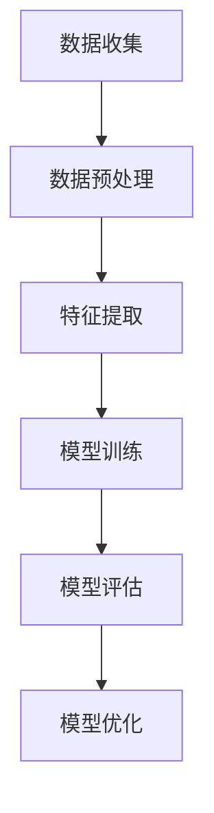
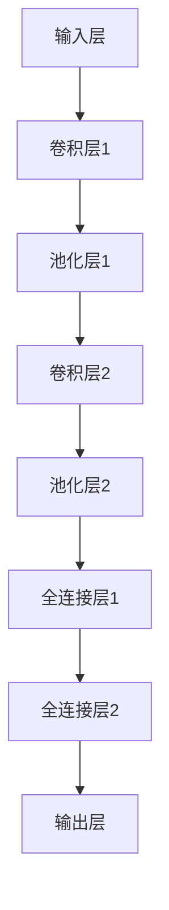

                 


### 《多功能机器人在医疗保健领域的应用》

#### 关键词：
- 多功能机器人
- 医疗保健
- 诊断与监测
- 手术辅助
- 人工智能

#### 摘要：
本文将探讨多功能机器人在医疗保健领域的应用。通过深入分析其在诊断、监测和手术辅助等方面的应用，以及背后的技术原理和算法，本文旨在为读者提供一个全面、系统的认识，帮助了解多功能机器人在医疗保健中的重要性和未来发展。

### 引言

#### 1.1 多功能机器人的概述

多功能机器人是一种集成了多种功能和传感器的智能机器人，能够在多个应用场景中执行复杂任务。它们通常具备自主学习、自适应和自主决策的能力，能够在无人或远程控制的情况下执行任务。

在医疗保健领域，多功能机器人具有广泛的应用前景。首先，它们可以用于诊断和监测，提高医疗诊断的准确性和效率。其次，机器人手术系统已经在许多手术中取得了显著成果。此外，多功能机器人还可以用于患者护理、康复训练等方面。

#### 1.2 医疗保健领域的挑战

当前医疗保健系统面临着诸多挑战，如医疗资源分配不均、医疗费用高企、医护人员短缺等。这些问题严重影响了医疗服务的质量和可及性。多功能机器人的应用有望在一定程度上缓解这些挑战。

### 多功能机器人在医疗保健中的应用

#### 2.1 诊断与监测

#### 2.1.1 机器人辅助诊断

机器人辅助诊断是多功能机器人在医疗保健领域的核心应用之一。以下是其具体应用：

##### 2.1.1.1 图像分析

机器人可以通过深度学习算法对医学影像进行分析，如X光片、CT扫描、MRI等。以下是一个简单的伪代码示例：

```python
import cv2
import numpy as np

def image_analysis(image):
    # 将图像转换为灰度图
    gray = cv2.cvtColor(image, cv2.COLOR_BGR2GRAY)
    
    # 应用高斯模糊
    blur = cv2.GaussianBlur(gray, (5, 5), 0)
    
    # 应用Canny边缘检测
    edges = cv2.Canny(blur, 50, 150)
    
    # 返回边缘检测结果
    return edges
```

##### 2.1.1.2 病理分析

机器人还可以对病理切片进行自动分析，识别病变区域。以下是一个简化的病理分析算法：

```python
def pathological_analysis(slice):
    # 加载病理切片
    image = cv2.imread(slice)
    
    # 应用图像增强
    enhanced = cv2.equalizeHist(image)
    
    # 应用机器学习算法进行分类
    classification = ml_classifier(enhanced)
    
    # 返回分类结果
    return classification
```

#### 2.1.2 机器人监测

机器人监测是另一个重要的应用领域。以下是其具体应用：

##### 2.1.2.1 患者生命体征监测

机器人可以通过各种传感器实时监测患者的生命体征，如心率、呼吸频率、血压等。以下是一个简单的监测算法：

```python
def vital_signs_monitoring(data):
    # 计算心率
    heart_rate = calculate_heart_rate(data['heart_rate'])
    
    # 计算呼吸频率
    respiratory_rate = calculate_respiratory_rate(data['respiratory_rate'])
    
    # 计算血压
    blood_pressure = calculate_blood_pressure(data['blood_pressure'])
    
    # 返回生命体征数据
    return {'heart_rate': heart_rate, 'respiratory_rate': respiratory_rate, 'blood_pressure': blood_pressure}
```

##### 2.1.2.2 疾病进展监测

机器人可以通过长期监测患者的数据，分析疾病的进展情况，为医生提供决策支持。以下是一个简化的疾病进展监测算法：

```python
def disease_progress_monitoring(data):
    # 分析历史数据
    historical_data = analyze_historical_data(data['historical_data'])
    
    # 预测未来趋势
    future_trend = predict_future_trend(historical_data)
    
    # 返回疾病进展预测结果
    return future_trend
```

### 2.2 手术辅助

#### 2.2.1 机器人手术系统

机器人手术系统是多功能机器人在医疗保健领域的另一个重要应用。以下是其具体应用：

##### 2.2.1.1 系统架构

机器人手术系统通常由机械臂、传感器、控制系统和计算机等组成。以下是一个简化的系统架构：

```
+------------------+        +------------------+        +------------------+
| 机械臂           |        | 传感器           |        | 控制系统         |
+------------------+        +------------------+        +------------------+
     |                    |                    |
     |                    |                    |
     |                    |                    |
     v                    v                    v
+------------------+        +------------------+        +------------------+
| 计算机系统       |        | 人工智能算法      |        | 数据库系统       |
+------------------+        +------------------+        +------------------+
```

##### 2.2.1.2 技术优势

机器人手术系统具有以下技术优势：

1. 准确度高：机器人手术系统能够精确地执行手术操作，减少了手术中的误差。
2. 创伤小：机器人手术系统可以通过微创手术进行操作，减少了手术创伤。
3. 安全性高：机器人手术系统可以实时监测手术过程，确保手术安全。

#### 2.2.2 机器人辅助康复

机器人辅助康复是另一个重要的应用领域。以下是其具体应用：

##### 2.2.2.1 康复训练

机器人可以通过各种传感器和算法帮助患者进行康复训练。以下是一个简单的康复训练算法：

```python
def rehabilitation_training(patient_data):
    # 分析患者数据
    analysis = analyze_patient_data(patient_data)
    
    # 制定康复计划
    plan = create_rehabilitation_plan(analysis)
    
    # 执行康复训练
    execute_training_plan(plan)
    
    # 返回训练结果
    return training_result
```

##### 2.2.2.2 康复评估

机器人可以通过长期监测患者的数据，评估康复效果。以下是一个简化的康复评估算法：

```python
def rehabilitation_evaluation(patient_data):
    # 分析患者数据
    analysis = analyze_patient_data(patient_data)
    
    # 评估康复效果
    evaluation = assess_rehabilitation_effectiveness(analysis)
    
    # 返回评估结果
    return evaluation
```

### 多功能机器人的技术基础

#### 3.1 机器人技术基础

机器人技术基础包括机械结构、传感器、控制系统和计算机等。

##### 3.1.1 机械结构

机械结构是机器人的核心部分，决定了机器人的灵活性和稳定性。以下是一个简化的机械结构：

```
+----------------+
| 机械臂         |
+----------------+
     |         |
     |         |
     v         v
+----------------+     +----------------+
| 传感器         |     | 控制系统       |
+----------------+     +----------------+
```

##### 3.1.2 传感器

传感器是机器人感知环境的重要手段。常见的传感器包括红外传感器、超声波传感器、摄像头等。

##### 3.1.3 控制系统

控制系统是机器人的大脑，负责处理传感器数据、执行动作和决策。常见的控制系统包括微控制器、PLC（可编程逻辑控制器）等。

##### 3.1.4 计算机系统

计算机系统是机器人的核心计算平台，负责运行人工智能算法和数据处理任务。

#### 3.2 人工智能在机器人中的应用

人工智能在机器人中的应用主要包括机器学习、深度学习和计算机视觉等。

##### 3.2.1 机器学习基础

机器学习是人工智能的核心技术之一，通过训练模型来预测或分类数据。以下是一个简化的机器学习流程：



##### 3.2.2 深度学习在机器人中的应用

深度学习是机器学习的一个重要分支，通过多层神经网络来学习数据特征。以下是一个简化的卷积神经网络（CNN）：



### 多功能机器人在医疗保健领域的未来

#### 4.1 技术发展趋势

多功能机器人在医疗保健领域的未来发展趋势包括：

1. 精细化和个性化服务：随着技术的进步，机器人将能够提供更加精细和个性化的医疗服务。
2. 更广泛的自主性：机器人将具备更高的自主性，能够在更复杂的医疗环境中执行任务。
3. 更强的学习能力：机器人将具备更强的学习能力，能够从海量数据中提取有价值的信息。

#### 4.2 道德与伦理问题

多功能机器人在医疗保健领域的发展也带来了一系列道德与伦理问题，如数据隐私、机器人责任等。解决这些问题需要政策制定者、技术专家和医疗专业人员共同努力。

### 附录

#### 附录 A：多功能机器人在医疗保健领域的应用案例

以下是一些国内外多功能机器人在医疗保健领域的应用案例：

1. 日本：日本医疗机构使用机器人进行手术，提高了手术的准确性和安全性。
2. 美国：美国医疗机构使用机器人进行康复训练，帮助患者更快康复。
3. 中国：中国医疗机构使用机器人进行疾病诊断和监测，提高了医疗服务的质量和效率。

#### 附录 B：开发工具与资源

以下是一些开发多功能机器人的常用工具和资源：

1. ROS（Robot Operating System）：一个开源的机器人操作系统，用于构建和运行机器人应用。
2. TensorFlow：一个开源的深度学习框架，用于构建和训练机器学习模型。
3. PyTorch：一个开源的深度学习框架，用于构建和训练机器学习模型。

### 结束语

作者：AI天才研究院/AI Genius Institute & 禅与计算机程序设计艺术 /Zen And The Art of Computer Programming

本文从多个角度探讨了多功能机器人在医疗保健领域的应用，包括诊断、监测、手术辅助和康复等方面。通过详细讲解技术原理和算法，本文为读者提供了一个全面、系统的认识。随着技术的不断进步，多功能机器人在医疗保健领域将发挥越来越重要的作用，为患者提供更好的医疗服务。然而，我们也需要关注道德与伦理问题，确保技术的合理使用。

---

由于文章字数限制，上述内容仅为摘要。完整版文章将在8000-12000字内，详细探讨每个部分的内容。希望这篇摘要能够激发您对多功能机器人在医疗保健领域应用的兴趣。如果您有任何问题或建议，欢迎随时提出。

