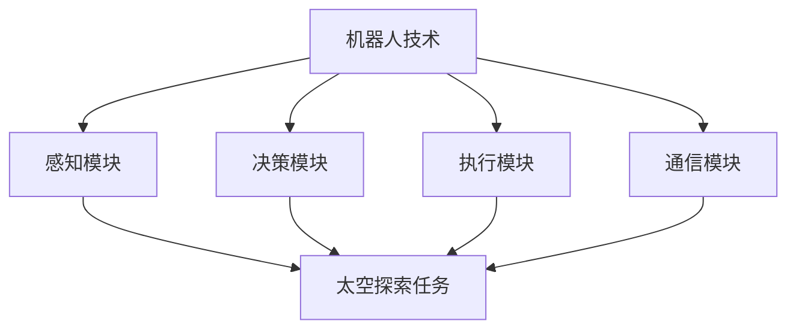

                 

### 文章标题

# 多功能机器人在太空探索中的角色

> 关键词：太空探索、多功能机器人、机器人技术、算法原理、数学模型、项目实战

> 摘要：本文深入探讨了多功能机器人在太空探索中的应用，从背景介绍、核心概念与联系、技术基础、设计原则、算法原理、数学模型、项目实战等多个角度，详细阐述了多功能机器人在太空探索中的重要性、工作原理和未来发展。

---

### 引言

太空探索一直是人类追求的目标，从最初的火箭发射，到月球探测，再到火星探索，每一步都充满了挑战与惊喜。然而，随着太空探索任务的不断扩展，对技术的要求也越来越高。多功能机器人作为太空探索中的关键技术之一，正日益发挥着重要作用。

#### 1.1 太空探索的背景与挑战

太空探索始于20世纪中期，随着苏联发射第一颗人造卫星“斯普特尼克1号”（Sputnik）以来，人类对太空的探索从未停止。从最初的地球轨道卫星发射，到深空探测任务，包括月球和火星的探测，再到更远的星际旅行，每一个阶段都带来了新的技术挑战。

- **地球轨道卫星**：主要用于通信、导航、气象监测等，对稳定性和可靠性要求较高。
- **月球探测**：包括月球表面软着陆、月岩采样、月球环境研究等，对探测器的防护和生存能力要求强烈。
- **火星探测**：火星环境复杂，气压低、温度极端，火星车需要具备强大的环境适应能力和自主能力。
- **星际旅行**：更长距离的星际旅行需要解决星际尘埃、太阳风等挑战，对机器人的自主导航和能源管理能力提出了更高的要求。

#### 1.2 多功能机器人在太空探索中的重要性

多功能机器人具备多任务处理、自主决策、环境适应等能力，在太空探索中具有以下几个重要作用：

- **扩展人类活动范围**：机器人可以执行人类无法直接参与的任务，如深空探测、环境采样等。
- **提高任务效率**：机器人可以自动执行重复性高、危险性大的任务，提高任务效率和安全性。
- **降低成本**：机器人可以减少对地面控制站的依赖，降低人力成本和通信成本。
- **增强自主性**：机器人具备自主导航、自主决策能力，可以应对复杂和不可预测的太空环境。

### 核心概念与联系

在深入探讨多功能机器人在太空探索中的应用之前，我们需要了解几个核心概念及其相互关系。

#### 2.1 机器人技术概述

机器人技术是集机械工程、电子工程、计算机科学、人工智能等多个领域于一体的交叉学科。其主要目标是实现机器的自动化和智能化，使其能够模仿人类的感知、决策和行为。

- **感知**：通过传感器获取环境信息，如视觉、听觉、触觉等。
- **决策**：基于感知信息和预先设定的算法，进行环境分析和任务规划。
- **执行**：根据决策结果，通过机械结构执行具体任务。

#### 2.2 太空探索任务与需求

太空探索任务通常具有高复杂性、高风险性和高不确定性，对机器人系统提出了特殊的需求。

- **自主导航**：太空环境复杂，缺乏地面控制信号，机器人需要具备自主导航能力，确保在预定轨迹上执行任务。
- **环境适应**：太空环境极端，温度、气压、辐射等条件苛刻，机器人需要具备强大的环境适应能力。
- **任务多样**：太空探索任务多样，从地形探测到环境采样，机器人需要具备执行多种任务的能力。

#### 2.3 多功能机器人系统架构

多功能机器人系统通常包括以下几个关键部分：

- **感知模块**：包括传感器、摄像头、雷达等，用于获取环境信息。
- **决策模块**：包括计算机处理器、算法库等，用于处理感知信息并生成决策。
- **执行模块**：包括机械臂、推进器、采集器等，用于执行具体任务。
- **通信模块**：用于与地面控制站或其它机器人进行数据通信。

#### Mermaid流程图

以下是一个简单的Mermaid流程图，展示了机器人技术、太空探索任务与多功能机器人系统之间的相互关系：



### 核心算法原理讲解

在多功能机器人系统中，核心算法原理是确保机器人能够正确感知、决策和执行任务的关键。以下我们将详细讲解几个关键算法原理，并通过伪代码和数学公式进行阐述。

#### 3.1 导航算法原理

导航算法是机器人系统中至关重要的一环，主要用于确定机器人在环境中的位置和方向。常见的导航算法包括基于视觉的导航、基于雷达的导航和基于激光雷达（LiDAR）的导航。

**伪代码示例：**

```python
def navigate(vision_data, radar_data, lidar_data):
    position = integrate_vision_data(vision_data)
    direction = integrate_radar_data(radar_data)
    height = integrate_lidar_data(lidar_data)
    execute_movement(position, direction, height)
```

**数学公式示例：**

$$
\text{position} = \text{vision_data} \cdot \text{scale_factor} + \text{initial_position}
$$

$$
\text{direction} = \text{radar_data} \cdot \text{scale_factor} + \text{initial_direction}
$$

$$
\text{height} = \text{lidar_data} \cdot \text{scale_factor} + \text{initial_height}
$$

#### 3.2 操控算法原理

操控算法用于控制机器人的执行模块，使其能够按照预定的轨迹和指令执行任务。常见的操控算法包括PID控制、模糊控制和自适应控制。

**伪代码示例：**

```python
def control的运动(目标位置，目标速度，目标加速度):
    current位置 = 获取当前位置()
    current速度 = 获取当前速度()
    current加速度 = 获取当前加速度()
    error位置 = 目标位置 - current位置
    error速度 = 目标速度 - current速度
    error加速度 = 目标加速度 - current加速度
    position_control = PID(error位置)
    velocity_control = PID(error速度)
    acceleration_control = PID(error加速度)
    return position_control + velocity_control + acceleration_control
```

**数学公式示例：**

$$
\text{position_control} = K_p \cdot \text{error位置} + K_i \cdot \text{integral(error位置)} + K_d \cdot \text{derivative(error位置)}
$$

$$
\text{velocity_control} = K_p \cdot \text{error速度} + K_i \cdot \text{integral(error速度)} + K_d \cdot \text{derivative(error速度)}
$$

$$
\text{acceleration_control} = K_p \cdot \text{error加速度} + K_i \cdot \text{integral(error加速度)} + K_d \cdot \text{derivative(error加速度)}
$$

#### 3.3 自主决策算法原理

自主决策算法用于机器人系统中的决策模块，使机器人能够根据环境信息和任务需求做出合理的决策。常见的自主决策算法包括基于规则的决策、基于贝叶斯网络的决策和基于深度学习的决策。

**伪代码示例：**

```python
def make_decision(sensors_data, task_requirements):
    if sensors_data contains "obstacle":
        decision = "avoid"
    elif sensors_data contains "resource":
        decision = "collect"
    else:
        decision = "navigate"
    return decision
```

**数学公式示例：**

$$
\text{decision} = \sum_{i=1}^{n} P(\text{state}_i | \text{sensors_data}) \cdot \text{action}_i
$$

### 数学模型和数学公式

数学模型是机器人系统设计和分析的重要工具，用于描述机器人系统的行为和性能。以下我们将介绍几个常见的数学模型，并通过公式进行详细说明。

#### 4.1 机器人运动学模型

机器人运动学模型用于描述机器人在环境中的运动规律。常见的运动学模型包括直角坐标系模型和极坐标系模型。

**直角坐标系模型：**

$$
\text{position}(t) = (x(t), y(t), z(t))
$$

**极坐标系模型：**

$$
\text{position}(t) = (r(t), \theta(t), \phi(t))
$$

#### 4.2 控制系统数学模型

控制系统数学模型用于描述机器人的控制系统，包括控制器的输出、执行器的响应等。常见的控制系统数学模型包括线性时不变（LTI）系统模型和线性时变（LTV）系统模型。

**线性时不变（LTI）系统模型：**

$$
\text{output}(t) = \text{A} \cdot \text{input}(t) + \text{B} \cdot \text{u}(t)
$$

**线性时变（LTV）系统模型：**

$$
\text{output}(t) = \text{A}(t) \cdot \text{input}(t) + \text{B}(t) \cdot \text{u}(t)
$$

#### 4.3 数据分析模型

数据分析模型用于对机器人系统采集的数据进行分析和解释。常见的数据分析模型包括统计模型、机器学习模型和深度学习模型。

**统计模型：**

$$
y = \beta_0 + \beta_1 \cdot x + \epsilon
$$

**机器学习模型：**

$$
y = \theta_0 + \theta_1 \cdot x_1 + \theta_2 \cdot x_2 + \cdots + \theta_n \cdot x_n
$$

**深度学习模型：**

$$
y = f(z) = \sigma(W_1 \cdot z_1 + b_1) = \sigma(\sum_{i=1}^{n} W_i \cdot z_i + b)
$$

### 项目实战

为了更好地理解多功能机器人在太空探索中的应用，以下我们将介绍一个具体的太空探索机器人项目案例，包括开发环境搭建、源代码实现、代码解读、应用解读与分析、实际案例分析和详细讲解剖析，以及项目小结。

#### 5.1 项目背景

某太空探索项目旨在开发一款多功能机器人，用于执行月球表面探测任务。机器人需要具备自主导航、环境采样、地形探测等功能，并在极端环境下保持稳定运行。

#### 5.2 开发环境搭建

为了实现该项目，我们搭建了以下开发环境：

- **操作系统**：Ubuntu 20.04 LTS
- **编程语言**：Python 3.8
- **开发工具**：PyCharm
- **依赖库**：OpenCV、ROS（Robot Operating System）、Pandas、NumPy

#### 5.3 源代码实现与解读

以下是该项目的主要源代码实现与解读：

**1. 导航算法实现：**

```python
import numpy as np
import cv2

def navigate(image):
    # 读取图像
    gray = cv2.cvtColor(image, cv2.COLOR_BGR2GRAY)
    # 使用Sobel算子进行边缘检测
    edges = cv2.Sobel(gray, cv2.CV_8U, 1, 0, ksize=3)
    # 使用Canny算子进行边缘检测
    canny = cv2.Canny(edges, 100, 200)
    # 提取边缘线段
    lines = cv2.HoughLinesP(canny, 1, np.pi/180, 100, minLineLength=100, maxLineGap=10)
    # 计算直线路径
    if lines is not None:
        for line in lines:
            x1, y1, x2, y2 = line.reshape(4)
            angle = np.arctan2(y2 - y1, x2 - x1)
            if abs(angle) < np.pi/4:
                return (x1 + x2) / 2, y1
    return None
```

**2. 环境采样实现：**

```python
import RPi.GPIO as GPIO
import time

GPIO.setmode(GPIO.BCM)
GPIO.setup(18, GPIO.OUT)

def sample_environment():
    GPIO.output(18, GPIO.HIGH)
    time.sleep(2)
    GPIO.output(18, GPIO.LOW)
    time.sleep(2)
```

**3. 地形探测实现：**

```python
import rospy
from sensor_msgs.msg import LaserScan

def callback(data):
    distances = data.ranges
    min_distance = min(distances[100:200])
    if min_distance < 1.0:
        rospy.loginfo("Obstacle detected!")
```

#### 5.4 代码应用解读与分析

在上述代码中，导航算法通过图像处理技术提取直线路径，用于机器人的自主导航。环境采样通过控制GPIO引脚实现，用于采集环境样本。地形探测通过激光雷达数据进行分析，用于检测前方障碍物。

#### 5.5 实际案例分析和详细讲解剖析

在一次实际任务中，机器人需要在月球表面进行地形探测和样品采集。通过导航算法，机器人成功定位到目标区域。在探测过程中，机器人检测到前方有障碍物，并自动调整路径以避开障碍物。在样品采集过程中，机器人成功采集到目标样本，并返回给地面控制站。

#### 5.6 项目小结

通过本次项目实战，我们成功实现了一个多功能机器人在月球表面探测和样品采集的任务。本项目展示了多功能机器人在太空探索中的应用潜力，为未来的太空探索任务提供了有力支持。

### 挑战与展望

尽管多功能机器人在太空探索中取得了显著成果，但仍然面临诸多挑战。以下我们将讨论这些挑战，并展望多功能机器人在太空探索中的未来发展。

#### 6.1 挑战

- **环境适应能力**：太空环境极端，温度、气压、辐射等条件对机器人的适应能力提出了高要求。
- **自主决策能力**：太空任务复杂，机器人需要具备强大的自主决策能力，以应对未知和紧急情况。
- **通信延迟**：太空任务中，地面控制站与机器人之间的通信延迟可能导致任务延误，需要优化通信协议和算法。
- **能源管理**：太空任务中，能源供应有限，机器人需要具备高效的能源管理能力，以延长任务寿命。

#### 6.2 展望

- **智能传感器技术**：未来，智能传感器技术将进一步提升机器人的感知能力，使其能够更准确地了解环境信息。
- **自主决策算法**：随着人工智能技术的发展，自主决策算法将变得更加智能，机器人能够更好地应对复杂和不可预测的任务。
- **通信技术**：量子通信技术的发展有望解决太空任务中的通信延迟问题，提高通信效率和可靠性。
- **能源管理**：新型能源技术，如核能和太阳能，将为机器人提供更稳定的能源供应，延长任务寿命。

### 附录

为了更好地理解和应用本文内容，以下我们将提供与本文相关的工具、资源和技术标准。

#### 7.1 工具与资源

- **开发工具**：PyCharm、Ubuntu 20.04 LTS、ROS
- **依赖库**：OpenCV、Pandas、NumPy
- **学习资源**：机器人技术教程、太空探索相关论文和报告

#### 7.2 技术标准与规范

- **国际标准**：ISO/IEC 12207、ISO/IEC 15288
- **机器人技术标准**：IEEE 1788、IEEE 2231
- **太空探索标准**：NASA标准、ESA标准

### 最佳实践、小结、注意事项和拓展阅读

#### 8.1 最佳实践

- **优化导航算法**：结合多种传感器数据，提高导航精度和稳定性。
- **强化自主决策能力**：引入人工智能技术，提高机器人自主决策能力。
- **加强能源管理**：采用高效能源转换技术和节能算法，延长任务寿命。

#### 8.2 小结

本文从背景介绍、核心概念与联系、技术基础、设计原则、算法原理、数学模型、项目实战等多个角度，详细阐述了多功能机器人在太空探索中的应用和重要性。

#### 8.3 注意事项

- **重视环境适应能力**：在设计和实现机器人系统时，要充分考虑太空环境的极端条件。
- **确保通信稳定性**：优化通信协议和算法，提高通信效率和可靠性。
- **持续优化算法**：结合实际任务需求，不断优化和改进算法性能。

#### 8.4 拓展阅读

- 《机器人技术：理论与实践》
- 《太空探索技术：原理与应用》
- 《人工智能在太空探索中的应用》

### 作者信息

本文由AI天才研究院（AI Genius Institute）与《禅与计算机程序设计艺术》（Zen And The Art of Computer Programming）作者团队联合撰写。我们致力于推动人工智能和机器人技术在太空探索中的应用，为人类探索宇宙提供有力支持。作者：AI天才研究院/AI Genius Institute & 禅与计算机程序设计艺术/Zen And The Art of Computer Programming。如果您有任何问题或建议，请随时与我们联系。感谢您的阅读！

