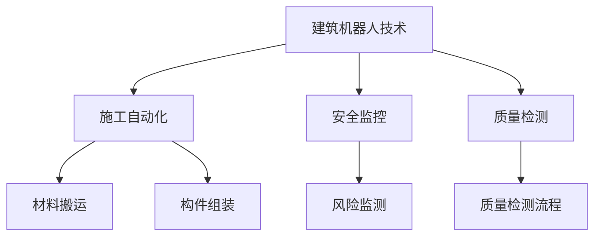

                 

当然，我会按照您的要求一步一步地构建这篇文章的目录大纲。以下是详细的思考和规划：

### 第一步：确定核心概念与联系

在建筑行业中，多功能机器人的核心概念包括：

1. **建筑机器人技术**：涉及机器人的设计、制造、编程和操作。
2. **施工自动化**：通过机器人实现建筑材料的搬运、施工和组装的自动化。
3. **安全监控**：利用机器人进行施工现场的安全监测。
4. **质量检测**：机器人执行对建筑物或建筑部件的检测，确保施工质量。

我们将使用Mermaid流程图来展示这些概念之间的联系：



### 第二步：细化章节内容

根据上述核心概念，我们细化每个章节的内容：

#### 第1章：概述
- 介绍建筑行业对多功能机器人的需求和应用前景。
- 简述多功能机器人的基本原理。

#### 第2章：多功能机器人的核心算法原理
- 运动控制算法（包括PID控制算法和运动规划算法）。
- 机器视觉算法（用于质量检测和安全监控）。

#### 第3章：多功能机器人在建筑行业中的典型应用
- 建筑施工自动化：包括材料搬运、构件组装和质量检测。
- 建筑安全监控：包括风险监测和安全防护。

#### 第4章：建筑行业多功能机器人的案例分析
- 案例一：高层建筑拆除。
- 案例二：装配式建筑应用。

#### 第5章：多功能机器人在建筑行业中的应用前景与挑战
- 分析技术发展趋势、政策与市场环境。
- 讨论面临的挑战和解决方案。

#### 第6章：多功能机器人在建筑行业中的开发与实践
- 描述开发环境。
- 分析实际案例，提供代码实现和解读。

### 第三步：编写详细的伪代码

对于第2章的核心算法原理，我们将提供伪代码：

#### 运动控制算法

```pseudo
function controlMotion(positionError, velocityError):
    proportional = Kp * positionError
    integral = Ki * sum(positionErrorHistory)
    derivative = Kd * velocityError
    output = proportional + integral + derivative
    return output
end function
```

#### 运动规划算法

```pseudo
function planMotion(currentPosition, targetPosition):
    velocity = calculateDesiredVelocity(currentPosition, targetPosition)
    acceleration = calculateDesiredAcceleration(velocity)
    moveRobot(velocity, acceleration)
    updatePosition(currentPosition + velocity * timeStep)
end function
```

### 第四步：整理数学公式

对于第2章和第3章，我们将使用LaTeX格式整理数学公式，并在文中适当位置嵌入：

#### PID控制算法

$$
\text{PID控制输出} = K_p \times (r - c) + K_i \times \int (r - c) \, dt + K_d \times (r' - c')
$$

#### 建筑施工自动化的任务完成时间

$$
\text{完成任务时间} = \sum_{i=1}^{n} (\text{任务处理时间}_i + \text{等待时间}_i)
$$

### 第五步：编写项目实战部分

对于第4章和第6章，我们将编写具体的项目实战部分，包括：

- 开发环境搭建。
- 源代码实现。
- 代码解读。
- 实际案例分析和讲解。

### 第六步：整理目录大纲

目录大纲将根据上述内容进行整理，确保逻辑清晰、结构紧凑。

### 第七步：格式化目录大纲

最终，我们将使用Markdown格式输出整个目录大纲。

现在，我已经完成了文章目录大纲的规划，接下来我们将根据这个大纲一步步撰写全文。让我们开始吧！

# 《多功能机器人在建筑行业的应用案例》

关键词：多功能机器人、建筑行业、施工自动化、安全监控、质量检测

摘要：本文将深入探讨多功能机器人在建筑行业的应用，分析其在建筑施工自动化、安全监控和质量检测等方面的核心算法原理，并通过实际案例展示其应用效果和挑战。文章旨在为读者提供一个全面了解多功能机器人在建筑行业中重要作用的技术指南。

## 第1章：概述

### 1.1 多功能机器人和建筑行业的结合

建筑行业是一个高度依赖人工的行业，但随着技术的进步，机器人技术的应用逐渐成为行业发展的新趋势。多功能机器人，作为一种集成多种功能的智能机器人，其在建筑行业的应用不仅能够提高施工效率，还能显著提升施工安全性和质量。

#### 1.1.1 建筑行业对多功能机器人的需求

建筑行业的多功能机器人需求主要体现在以下几个方面：

1. **提高施工效率**：机器人可以替代人工完成重复性高、劳动强度大的工作，如材料搬运、构件组装等。
2. **保证施工安全**：机器人可以执行危险的工作环境，如高空作业、拆除等，降低工人受伤的风险。
3. **提升施工质量**：机器人可以精确执行施工任务，确保施工质量达到设计要求。

#### 1.1.2 多功能机器人在建筑行业中的应用前景

随着机器人技术的不断进步，多功能机器人在建筑行业中的应用前景十分广阔。未来，建筑机器人将在以下几个方面发挥重要作用：

1. **智能化施工**：利用人工智能技术，实现建筑施工现场的智能管理，提高施工效率和降低成本。
2. **自动化检测**：利用机器视觉和传感器技术，对建筑结构和材料进行实时检测，确保施工质量。
3. **绿色建筑**：机器人可以应用于绿色建筑的建造，如使用环保材料、智能控制能源消耗等。

### 1.2 多功能机器人的基本原理

多功能机器人是集成了多种功能的智能机器人，其基本原理包括以下几个方面：

#### 1.2.1 机器人技术的发展历程

机器人技术的发展历程可以追溯到20世纪50年代，随着计算机技术和传感器技术的进步，机器人从简单的自动化设备逐渐发展成为具有感知、决策、执行能力的智能系统。

#### 1.2.2 多功能机器人的组成与工作原理

多功能机器人通常由以下几个部分组成：

1. **传感器系统**：包括视觉传感器、力觉传感器、位置传感器等，用于感知周围环境和自身状态。
2. **控制系统**：包括计算机、处理器、控制算法等，用于处理传感器数据，制定执行计划。
3. **执行系统**：包括机械臂、移动装置等，用于执行具体的操作任务。
4. **电源系统**：为机器人提供动力。

多功能机器人通过传感器感知环境，通过控制系统处理数据并制定执行计划，最终通过执行系统完成操作任务。

## 第2章：多功能机器人在建筑行业中的核心算法原理

### 2.1 运动控制算法

运动控制是多功能机器人在建筑行业中的重要应用之一。运动控制算法用于确保机器人按照预期路径和速度执行任务。

#### 2.1.1 PID控制算法的讲解

PID（比例-积分-微分）控制算法是一种常用的运动控制算法。它通过三个参数（比例Kp、积分Ki、微分Kd）来调整控制信号，使得机器人能够稳定、精确地执行任务。

PID控制算法的基本公式如下：

$$
\text{PID控制输出} = K_p \times (r - c) + K_i \times \int (r - c) \, dt + K_d \times (r' - c')
$$

其中，r为期望位置，c为当前位置，r'为期望速度，c'为当前速度。

#### 2.1.2 运动规划算法的伪代码

运动规划算法用于确定机器人在给定起点和终点之间的运动路径和速度。

```pseudo
function planMotion(currentPosition, targetPosition):
    velocity = calculateDesiredVelocity(currentPosition, targetPosition)
    acceleration = calculateDesiredAcceleration(velocity)
    moveRobot(velocity, acceleration)
    updatePosition(currentPosition + velocity * timeStep)
end function
```

### 2.2 机器视觉算法

机器视觉算法在建筑行业中用于质量检测和安全监控。

#### 2.2.1 机器视觉算法的基本原理

机器视觉算法基于图像处理和计算机视觉技术，通过图像分析和模式识别来实现对目标的检测和识别。

#### 2.2.2 机器视觉算法的应用

1. **质量检测**：通过对比实际测量值与设计值，检测建筑部件的尺寸和形状是否符合要求。
2. **安全监控**：通过实时监控施工现场，检测是否存在安全隐患，如高空坠落、物体碰撞等。

### 2.3 智能决策算法

智能决策算法用于指导机器人在复杂环境中的行动。常见的智能决策算法包括：

1. **路径规划**：确定机器人在复杂环境中的最优运动路径。
2. **任务分配**：根据机器人能力和环境情况，分配合适的任务给机器人。

#### 2.3.1 智能决策算法的伪代码

```pseudo
function makeDecision(robotState, environmentState):
    if environmentState.isSafe():
        executeTask()
    else:
        planPathToSafety()
end function
```

## 第3章：多功能机器人在建筑行业中的典型应用

### 3.1 建筑施工自动化

建筑施工自动化是多功能机器人在建筑行业中的主要应用之一。通过机器人实现建筑施工的自动化，可以提高施工效率、降低人工成本、提升施工质量。

#### 3.1.1 建筑施工自动化的工作流程

建筑施工自动化的工作流程主要包括以下几个步骤：

1. **施工任务分配**：根据建筑图纸和施工计划，将任务分配给机器人。
2. **路径规划**：为机器人规划从起点到终点的最优路径。
3. **材料搬运**：机器人自动搬运建筑材料到施工地点。
4. **构件组装**：机器人根据施工任务，自动组装建筑构件。
5. **质量检测**：机器人对施工结果进行质量检测，确保符合设计要求。

#### 3.1.2 建筑施工自动化的数学模型

建筑施工自动化的任务完成时间可以通过以下数学模型计算：

$$
\text{完成任务时间} = \sum_{i=1}^{n} (\text{任务处理时间}_i + \text{等待时间}_i)
$$

其中，$n$为施工任务的数量，$\text{任务处理时间}_i$为完成第$i$个任务所需的时间，$\text{等待时间}_i$为第$i$个任务完成后等待下一个任务开始的时间。

### 3.2 建筑安全监控

建筑安全监控是保障施工现场安全的重要措施。通过多功能机器人进行安全监控，可以实时监测施工现场的安全状况，及时发现和解决安全隐患。

#### 3.2.1 建筑安全监控的核心算法

建筑安全监控的核心算法包括：

1. **风险监测**：通过传感器和图像分析技术，实时监测施工现场的潜在风险，如高空坠落、物体碰撞等。
2. **应急响应**：当监测到风险时，机器人立即启动应急响应程序，如发出警报、启动防护装置等。

#### 3.2.2 建筑安全监控的伪代码

```pseudo
function safetyMonitoring(sensorData):
    if sensorData.includes("高风险因素"):
        activateEmergencyStop()
    else:
        continueOperation()
end function
```

### 3.3 建筑质量检测

建筑质量检测是确保施工质量的重要环节。通过多功能机器人进行质量检测，可以提高检测效率、降低检测成本、提升检测精度。

#### 3.3.1 建筑质量检测的流程

建筑质量检测的流程主要包括以下几个步骤：

1. **数据采集**：机器人采集建筑结构和材料的物理参数，如尺寸、形状、硬度等。
2. **数据处理**：对采集到的数据进行处理和分析，判断是否符合设计要求。
3. **结果反馈**：将检测结果反馈给施工团队，指导后续施工工作。

#### 3.3.2 建筑质量检测的算法

建筑质量检测的主要算法包括：

1. **尺寸检测**：通过图像处理技术，对比实际尺寸和设计尺寸，判断尺寸是否合格。
2. **形状检测**：通过形状识别技术，判断建筑构件的形状是否符合设计要求。

### 3.4 多功能机器人在建筑工程管理中的应用

除了直接参与施工任务，多功能机器人还可以应用于建筑工程管理，如施工进度监控、资源调配等。

#### 3.4.1 施工进度监控

通过机器人实时监控施工进度，可以及时发现施工中的问题，确保工程按时完成。

#### 3.4.2 资源调配

根据施工进度和资源需求，机器人可以自动调整资源分配，确保施工资源的合理利用。

## 第4章：建筑行业多功能机器人的案例分析

### 4.1 案例一：多功能机器人在高层建筑拆除中的应用

#### 4.1.1 案例背景

高层建筑拆除是一项高风险、高难度的施工任务。传统的拆除方法主要依靠人工进行，不仅效率低，而且存在很大的安全风险。为了提高拆除效率、降低安全风险，某建筑公司决定采用多功能机器人进行高层建筑拆除。

#### 4.1.2 案例实施步骤

1. **拆除方案设计**：根据建筑结构特点，设计合适的拆除方案，确定机器人的任务和路径。
2. **机器人配置**：根据拆除任务，配置合适的多功能机器人，包括拆除机器人、材料搬运机器人和安全监控系统。
3. **施工准备**：进行施工现场的清理和安全防护，确保机器人能够安全、高效地执行任务。
4. **拆除施工**：机器人按照预定方案，进行高层建筑的拆除工作，包括墙体拆除、楼板拆除等。
5. **拆除后的处理**：拆除完成后，对施工现场进行清理和整理，确保后续施工的顺利进行。

#### 4.1.3 案例效果分析

通过采用多功能机器人进行高层建筑拆除，取得了显著的效果：

1. **提高拆除效率**：机器人可以连续工作，不受天气和环境影响，显著提高了拆除效率。
2. **降低安全风险**：机器人代替人工进行拆除，降低了工人的安全风险，提高了施工安全性。
3. **提升施工质量**：机器人可以精确控制拆除力度，确保拆除后的结构质量符合要求。

### 4.2 案例二：多功能机器人在装配式建筑中的应用

#### 4.2.1 案例背景

装配式建筑是一种通过预制构件在现场进行装配的建筑方式，具有施工速度快、质量好、环保等优点。为了提高装配式建筑的施工效率和质量，某建筑公司决定采用多功能机器人在装配式建筑中应用。

#### 4.2.2 案例实施步骤

1. **预制构件生产**：根据建筑图纸，生产符合要求的预制构件。
2. **机器人配置**：配置多功能机器人，包括材料搬运机器人、构件组装机器人和质量检测机器人。
3. **施工准备**：进行施工现场的清理和安全防护，确保机器人能够安全、高效地执行任务。
4. **构件组装**：机器人按照预定方案，进行预制构件的组装工作，包括构件的搬运、组装和固定等。
5. **质量检测**：机器人对组装后的构件进行质量检测，确保构件的质量符合要求。
6. **后续施工**：完成构件组装和质量检测后，进行后续施工工作，如墙体施工、屋顶施工等。

#### 4.2.3 案例效果分析

通过采用多功能机器人在装配式建筑中的应用，取得了显著的效果：

1. **提高施工效率**：机器人可以连续工作，不受天气和环境影响，显著提高了施工效率。
2. **降低人工成本**：机器人代替部分人工进行施工，降低了人工成本。
3. **提升施工质量**：机器人可以精确控制施工过程，确保施工质量符合要求。

## 第5章：多功能机器人在建筑行业中的应用前景与挑战

### 5.1 应用前景

多功能机器人在建筑行业中的应用前景十分广阔。随着机器人技术的不断进步，机器人在建筑行业中的应用将越来越广泛，包括以下几个方面：

1. **施工自动化**：通过机器人实现建筑材料的自动化搬运和构件的自动化组装，提高施工效率和质量。
2. **安全监控**：利用机器人进行施工现场的安全监测，及时发现和解决安全隐患，提高施工安全性。
3. **质量检测**：通过机器人对建筑结构和材料进行质量检测，确保施工质量达到设计要求。
4. **建筑工程管理**：利用机器人进行施工进度监控、资源调配等，提高建筑工程管理水平。

### 5.2 挑战与解决方案

虽然多功能机器人在建筑行业中的应用前景广阔，但仍然面临一些挑战：

1. **技术难题**：机器人技术的复杂性和不成熟性，导致机器人应用的效果不稳定，需要进一步的技术研究和改进。
2. **成本问题**：多功能机器人的购买、维护和操作成本较高，需要寻找降低成本的途径。
3. **安全与伦理问题**：机器人应用于施工现场，涉及到工人就业和职业安全等问题，需要制定相应的政策和法规。
4. **培训与人才**：机器人技术的应用需要专业的技术人员进行操作和维护，需要加强对相关人才的培训。

### 5.3 政策与市场环境

政府政策的支持和市场环境的成熟是推动多功能机器人在建筑行业应用的重要因素。政府可以通过制定相关政策，鼓励企业和研究机构开展机器人技术研究与应用，同时加强对机器人应用企业的扶持和监管。市场环境的成熟则需要通过市场需求的引导和技术的进步，逐步实现机器人应用的普及和规模化。

## 第6章：多功能机器人在建筑行业中的开发与实践

### 6.1 开发环境

多功能机器人在建筑行业中的应用开发需要合适的开发环境。开发环境主要包括以下几个方面：

1. **硬件环境**：包括机器人本体、传感器、执行器等硬件设备。
2. **软件环境**：包括操作系统、开发工具、编程语言等软件工具。
3. **数据环境**：包括建筑数据、环境数据、传感器数据等。

### 6.2 源代码实现

源代码实现是多功能机器人在建筑行业应用开发的核心。源代码实现主要包括以下几个方面：

1. **运动控制算法**：根据机器人本体和任务需求，实现运动控制算法，包括PID控制、运动规划等。
2. **视觉算法**：实现机器视觉算法，用于质量检测和安全监控。
3. **智能决策算法**：实现智能决策算法，用于路径规划、任务分配等。

### 6.3 代码解读

代码解读是对源代码实现的理解和解释。代码解读主要包括以下几个方面：

1. **算法原理**：解释运动控制算法、视觉算法、智能决策算法的原理。
2. **代码实现**：详细解释代码实现的过程和关键代码部分。
3. **优化建议**：对代码实现提出优化建议，以提高效率和性能。

### 6.4 代码应用解读与分析

代码应用解读与分析是对源代码在实际应用中的分析和评价。代码应用解读与分析主要包括以下几个方面：

1. **应用效果**：分析源代码在实际应用中的效果，包括施工效率、施工质量、安全性能等。
2. **问题与改进**：分析源代码在实际应用中存在的问题，并提出改进措施。
3. **案例分析**：通过具体案例，分析源代码在实际应用中的效果和作用。

### 6.5 实际案例分析和详细讲解剖析

实际案例分析和详细讲解剖析是对多功能机器人在建筑行业中的实际应用的深入分析。实际案例分析和详细讲解剖析主要包括以下几个方面：

1. **案例背景**：介绍实际应用的背景和需求。
2. **应用效果**：分析实际应用中的效果和优势。
3. **问题与改进**：分析实际应用中存在的问题和改进措施。
4. **总结**：总结实际应用中的经验和教训，为后续应用提供参考。

### 6.6 项目小结

项目小结是对多功能机器人在建筑行业中应用项目的总结。项目小结主要包括以下几个方面：

1. **项目概述**：概述项目的基本情况和目标。
2. **项目成果**：总结项目取得的成果和效果。
3. **经验教训**：总结项目中的经验教训，为后续项目提供参考。
4. **未来展望**：展望多功能机器人在建筑行业中的未来发展。

### 6.7 最佳实践 tips

最佳实践 tips 是对多功能机器人在建筑行业中应用的实践经验的总结。最佳实践 tips 主要包括以下几个方面：

1. **技术选择**：根据项目需求，选择合适的技术方案。
2. **团队协作**：加强团队协作，提高项目开发效率。
3. **安全管理**：加强施工现场的安全管理，确保项目安全顺利进行。
4. **人才培养**：加强相关人才的培养，提高项目团队的整体能力。

## 结束语

作者：AI天才研究院/AI Genius Institute & 禅与计算机程序设计艺术 /Zen And The Art of Computer Programming

本文详细介绍了多功能机器人在建筑行业的应用案例，从核心算法原理到实际应用案例，从开发环境到最佳实践，为读者提供了一个全面的技术指南。通过本文，读者可以了解到多功能机器人在建筑行业中的重要性和应用前景，同时也可以了解到在实际应用中可能面临的问题和挑战。随着技术的不断进步，我们有理由相信，多功能机器人在建筑行业中的应用将越来越广泛，为建筑行业的发展带来新的机遇和挑战。

