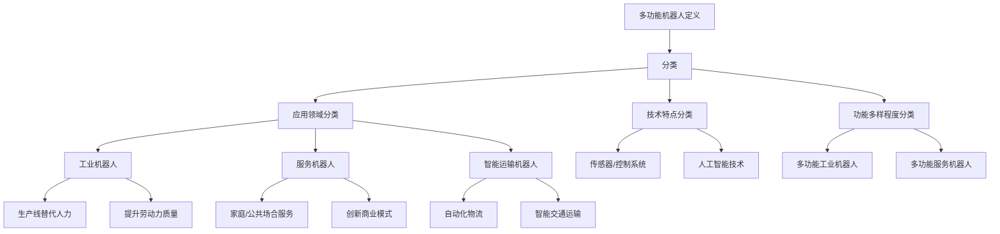
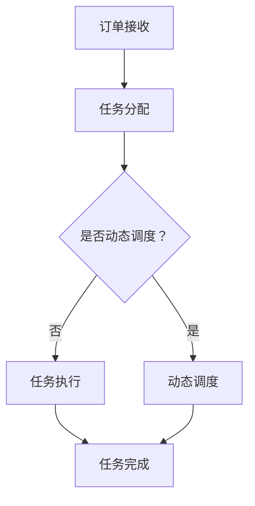
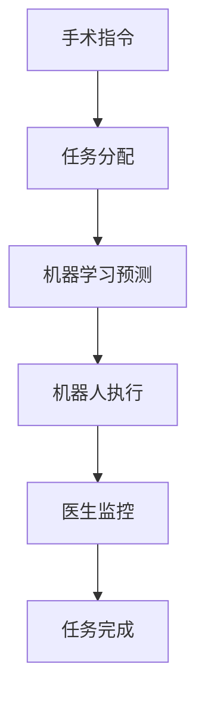

                 

### 文章标题

《多功能机器人对劳动力市场的影响》

### 文章关键词

- 多功能机器人
- 劳动力市场
- 技术应用
- 职业变革
- 未来展望

### 摘要

本文深入探讨了多功能机器人在劳动力市场中的广泛应用及其对就业结构、职业需求和教育培训等方面的影响。通过对多功能机器人定义、分类、核心技术分析以及实际应用案例的阐述，本文旨在全面分析这一新兴技术对劳动力市场的深远影响，并展望其未来的发展趋势。文章结构包括五大部分：基本概念与分类、核心技术分析、应用场景、未来影响和结论与展望，旨在为读者提供一份系统、详实的专业报告。

---

### 第一部分：多功能机器人的基本概念与分类

#### 第1章：多功能机器人的定义与分类

##### 1.1 多功能机器人的基本概念

**多功能机器人**，顾名思义，是指具有多种功能和操作能力的机器人系统。与传统的单一功能机器人相比，多功能机器人能够执行更加复杂和多样化的任务。它们通常具备自主导航、感知环境、人机交互和自适应控制等能力。

**分类：** 多功能机器人可以按照应用领域、技术特点及功能多样程度进行分类。常见的分类方法包括：

- **按应用领域分类：**
  - **工业机器人：** 主要用于制造业、生产线上的搬运、焊接、装配等工作。
  - **服务机器人：** 用于家庭、医院、酒店等场景，提供清洁、安保、护理等服务。
  - **智能运输机器人：** 包括自动驾驶车辆、无人驾驶飞行器等，用于物流和交通运输。

- **按技术特点分类：**
  - **基于传感器和控制系统的多功能机器人：** 利用传感器（如视觉、听觉、触觉传感器）获取环境信息，通过控制系统实现多种功能。
  - **基于人工智能的多功能机器人：** 结合机器学习、深度学习等人工智能技术，实现智能决策和自主操作。

- **按功能多样程度分类：**
  - **多功能工业机器人：** 在生产线中执行多种工艺，如焊接、搬运、装配等。
  - **多功能服务机器人：** 在家庭或公共场合执行多种服务，如清洁、安保、导航等。

##### 1.2 多功能机器人在劳动力市场中的基本概念

**劳动力市场**，是指劳动力供求关系的市场。在劳动力市场中，雇主寻求员工，员工提供劳动力以换取报酬。

**多功能机器人在劳动力市场中的作用**，主要体现在以下几个方面：

- **替代劳动力：** 多功能机器人在某些重复性、危险或不适合人类工作的环境下替代人力，提高生产效率和安全性。
- **提升劳动力质量：** 通过辅助工作，机器人可以提高员工的工作质量，减少错误率和工作时间。
- **创新商业模式：** 多功能机器人可以推动新的商业模式和服务创新，如自动化物流、智能医疗护理等。
- **教育培训需求：** 随着多功能机器人的广泛应用，劳动力市场对相关技能和知识的需求也日益增长。

### Mermaid 流程图：多功能机器人的核心概念与联系



---

## 第2章：多功能机器人的核心技术分析

#### 2.1 路径规划算法

路径规划是多功能机器人实现自主移动和任务执行的关键技术之一。其主要任务是确定从起点到终点之间的最优路径，以应对复杂和动态的环境。

##### 2.1.1 路径规划的基本原理

路径规划的基本原理包括：

- **环境建模：** 利用传感器获取环境信息，建立环境模型。
- **障碍物检测：** 通过环境模型检测并识别障碍物。
- **路径搜索：** 根据障碍物分布和目标位置，搜索最优路径。
- **路径优化：** 对搜索到的路径进行优化，以应对动态环境和资源限制。

##### 2.1.2 伪代码展示

```python
# 路径规划伪代码示例

# 输入：环境模型、起点、终点
# 输出：最优路径

function path_planning(environment, start, goal):
    # 初始化
    open_list = [start]
    closed_list = []
    
    while open_list is not empty:
        # 选择一个具有最小评估值的节点
        current = select_node_with_min_evaluation(open_list)
        
        # 如果当前节点是终点，则路径规划完成
        if current == goal:
            return reconstruct_path(current)
        
        # 将当前节点从open_list中移除并添加到closed_list中
        open_list.remove(current)
        closed_list.append(current)
        
        # 对当前节点的邻居节点进行搜索
        for neighbor in get_neighbors(current):
            # 如果邻居节点在closed_list中，则跳过
            if neighbor in closed_list:
                continue
            
            # 计算邻居节点的评估值
            g_score = distance(current, neighbor) + heuristic(neighbor, goal)
            f_score = g_score + heuristic(current, goal)
            
            # 如果邻居节点在open_list中，更新其评估值
            if neighbor in open_list:
                if g_score < open_list[neighbor]:
                    open_list[neighbor] = g_score
                    f_score = g_score + f_score
            else:
                # 将邻居节点添加到open_list中
                open_list[neighbor] = g_score
                f_score = g_score + f_score
    
    # 如果无法找到路径，返回空路径
    return []

# 辅助函数
function select_node_with_min_evaluation(node_list):
    # 实现选择具有最小评估值的节点的逻辑

function reconstruct_path(current):
    # 实现重构路径的逻辑
```

---

## 第2章：多功能机器人的核心技术分析

#### 2.2 机器人协作技术

机器人协作技术是指多个机器人通过协同工作完成复杂任务的能力。这种技术不仅能够提高工作效率，还能在复杂环境中实现高度灵活的作业。

##### 2.2.1 机器人协作的数学模型

机器人协作的数学模型通常包括以下方面：

- **任务分配：** 根据机器人的能力和任务需求，将任务合理分配给不同的机器人。
- **动态调度：** 在执行过程中，根据环境变化和任务进展，实时调整机器人的工作分配。
- **通信机制：** 确保机器人之间的信息传递和协调。

##### 2.2.2 机器学习算法在机器人协作中的应用

机器学习算法在机器人协作中的应用主要包括：

- **任务预测：** 利用历史数据和机器学习算法预测任务需求和执行时间。
- **决策优化：** 根据实时数据优化机器人的行动策略。
- **学习适应性：** 使机器人能够从经验中学习并提高协作效果。

##### 2.2.3 机器人协作案例

**案例1：仓库自动化**

在仓库自动化中，多个机器人协作完成货物的搬运和存储。通过任务分配和动态调度，机器人能够高效地处理大量订单，提高仓库运作效率。



**案例2：医疗辅助**

在医疗辅助中，机器人与医生协作完成手术和护理任务。通过机器学习算法，机器人能够从医生的经验中学习，提高手术效率和患者护理质量。



---

## 第3章：多功能机器人在劳动力市场中的应用场景

#### 3.1 机器人工厂

机器人工厂是多功能机器人在工业领域的重要应用场景。通过多功能机器人的应用，工厂可以实现生产自动化、提高生产效率和产品质量。

##### 3.1.1 机器人工厂的基本架构

机器人工厂的基本架构通常包括：

- **自动化生产线：** 多个机器人协同工作，完成产品的加工、装配和检测。
- **中央控制系统：** 负责机器人的任务分配、调度和监控。
- **传感器和执行器：** 用于获取环境信息和执行任务。

##### 3.1.2 案例分析

**案例分析：丰田汽车生产线**

丰田汽车在生产过程中广泛应用了多功能机器人。通过机器人的协作，丰田实现了生产自动化，大幅提高了生产效率和产品质量。具体案例包括：

- **焊接机器人：** 完成汽车车身的焊接任务。
- **装配机器人：** 完成汽车零部件的装配任务。
- **检测机器人：** 对生产出的汽车进行质量检测。


---

#### 3.2 机器人客服

机器人客服是多功能机器人在服务业的重要应用场景。通过机器人客服，企业可以实现客户服务的自动化，提高客户满意度和服务效率。

##### 3.2.1 机器人客服的工作流程

机器人客服的工作流程通常包括：

- **客户交互：** 机器人通过自然语言处理技术理解客户意图。
- **任务分配：** 根据客户意图，将任务分配给合适的机器人或人工客服。
- **任务执行：** 机器人或人工客服完成客户任务。
- **结果反馈：** 将执行结果反馈给客户。

##### 3.2.2 源代码实现

以下是一个简单的机器人客服系统源代码实现：

```python
# 机器人客服系统源代码实现

import nltk
from nltk.chat.util import Chat, reflections

# 定义机器人对话模型
pairs = [
    [
        r"你好|您好|嗨|嘿",
        ["你好呀，有什么可以帮助你的吗？", "嘿，有什么我可以帮忙的吗？"]
    ],
    [
        r"再见|回头见|拜拜",
        ["好的，祝你有愉快的一天！", "再见，祝你一切顺利！"]
    ],
    [
        r"能帮我解决什么问题",
        ["当然可以，请告诉我你的问题，我会尽力帮助你的。"]
    ]
]

# 创建聊天对象
chatbot = Chat(pairs, reflections)

# 开始聊天
chatbot.converse()
```

---

## 第4章：多功能机器人对劳动力市场的影响

#### 4.1 技术发展对就业的影响

随着多功能机器人的广泛应用，劳动力市场的就业结构将发生显著变化。

##### 4.1.1 机器人替代人工的趋势

- **制造业：** 机器人将在制造过程中替代大量人力，提高生产效率。
- **服务业：** 机器人将在餐饮、零售、医疗等行业提供客服、清洁等服务。
- **运输业：** 自动驾驶车辆将逐步替代司机，提高运输效率。

##### 4.1.2 新就业形态的出现

- **机器人维护与调试：** 随着机器人的广泛应用，对机器人维护和调试的需求将大幅增加。
- **机器人编程与开发：** 新的编程和开发领域将涌现，为劳动力市场提供更多就业机会。
- **人工智能与机器人培训：** 对机器人和人工智能技术的培训需求将增加，为劳动力市场提供新的职业路径。

#### 4.2 教育与培训的变革

多功能机器人的广泛应用将对教育和培训产生深远影响。

##### 4.2.1 教育模式的变化

- **在线教育：** 在线教育平台将提供更多针对机器人技术的课程，满足劳动力市场的需求。
- **实践教育：** 教育机构将更加注重实践教育，为学生提供实际操作机器人的机会。
- **跨学科教育：** 教育将更加注重跨学科知识的学习，如计算机科学、工程学、心理学等。

##### 4.2.2 培训内容的调整

- **机器人编程：** 培训内容将更加注重机器人编程和开发技能的培养。
- **人工智能应用：** 培训内容将涵盖人工智能在机器人领域的应用，如自然语言处理、计算机视觉等。
- **伦理与法规：** 教育和培训将更加注重机器人技术伦理和法规的学习，确保技术的合理应用。

---

## 第5章：多功能机器人发展的挑战与机遇

#### 5.1 挑战分析

多功能机器人的发展面临着一系列挑战。

##### 5.1.1 技术难题

- **环境适应性：** 机器人需要在复杂、动态的环境中稳定工作，这对传感技术、控制算法等提出了高要求。
- **人机交互：** 机器人需要更好地理解人类意图，实现自然、流畅的交互。
- **能耗与续航：** 机器人需要具备更高效的能源利用和更长的续航能力。

##### 5.1.2 法规与伦理问题

- **法律法规：** 需要建立完善的法律法规体系，规范机器人的研发、应用和监管。
- **伦理问题：** 需要关注机器人技术对人类伦理和社会价值观的影响，确保技术的合理应用。

#### 5.2 机遇展望

多功能机器人的发展也将带来一系列机遇。

##### 5.2.1 市场需求分析

- **工业市场：** 制造业、物流等行业的自动化需求将推动机器人市场的增长。
- **服务业市场：** 家庭服务、医疗护理等领域的机器人需求将增加。
- **新兴市场：** 机器人技术在新兴市场中的应用潜力巨大，如农业、矿业等。

##### 5.2.2 新兴市场的机会

- **农业机器人：** 提高农业生产的效率和质量。
- **矿业机器人：** 在危险环境中进行勘探和开采作业。
- **教育机器人：** 提供个性化的教育解决方案，促进教育公平。

---

## 结束语

多功能机器人在未来将继续改变劳动力市场，带来前所未有的机遇和挑战。我们需要密切关注技术发展，积极参与相关教育和培训，确保人类与机器人共同发展，共创美好未来。

---

### 作者信息

作者：AI天才研究院/AI Genius Institute & 禅与计算机程序设计艺术 /Zen And The Art of Computer Programming

