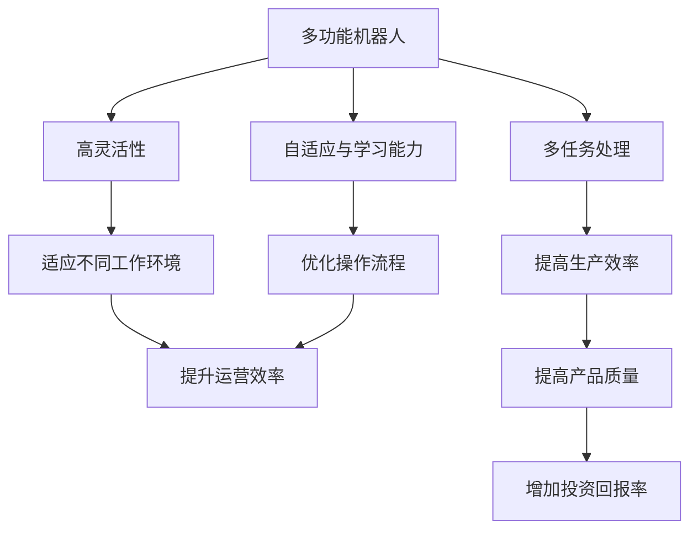
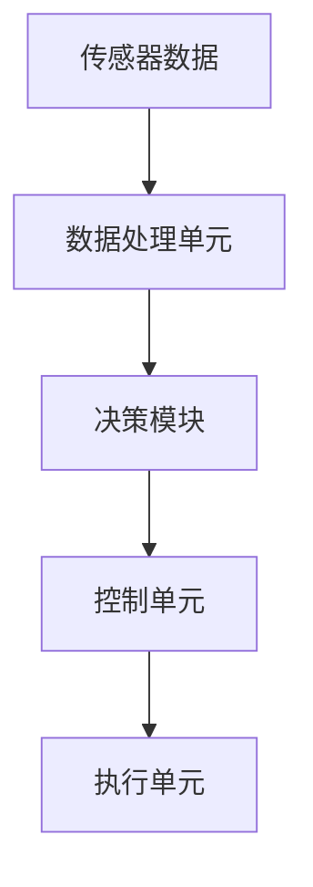

                 


### 《多功能机器人提高投资回报率的优势》

#### 关键词
- 多功能机器人
- 投资回报率
- 自动化
- 技术实现
- 应用案例

#### 摘要
本文旨在探讨多功能机器人在提高投资回报率方面的优势。通过分析多功能机器人的定义、技术实现、应用领域以及投资回报率的计算方法，本文展示了多功能机器人在不同场景下的高效性和成本效益。本文还包括了实际应用案例和最佳实践，为读者提供了关于如何利用多功能机器人提升投资回报率的实用指南。

---

# 多功能机器人提高投资回报率的优势

随着科技的飞速发展，机器人技术已经成为现代工业、服务业和医疗等多个领域的重要创新动力。多功能机器人作为一种具备多种功能、能够适应不同工作环境的机器人，其灵活性和高效性使其在提高投资回报率（ROI）方面展现出显著的优势。本文将逐步分析多功能机器人在提高投资回报率方面的关键因素和应用场景，以帮助读者理解并利用这一技术提升企业的盈利能力。

## 背景介绍

### 1. 多功能机器人的定义和特点

多功能机器人是指一种具备多种功能、能够适应不同工作环境的机器人。它们通常具有以下几个显著特点：

- **高灵活性**：多功能机器人能够通过软件编程和硬件配置的变化，快速适应不同的工作场景和任务需求。
- **多任务处理**：多功能机器人可以同时执行多种任务，提高生产效率和资源利用率。
- **自适应与学习能力**：借助先进的人工智能技术，多功能机器人能够不断优化自身的操作流程，提高工作效率。

### 2. 投资回报率（ROI）的概念和重要性

投资回报率（ROI）是指投资所获得的回报与投资成本的比率，它是评估投资效果的重要指标。在投资决策中，高ROI表示投资具有较高的盈利能力和风险可控性。因此，提高ROI对于企业的长期发展至关重要。

### 3. 多功能机器人在各行业的应用

多功能机器人在工业制造、服务业、医疗和农业等多个领域都展现出了巨大的应用潜力。例如：

- **工业制造**：多功能机器人可以用于自动化生产线、质量检测、装配和搬运等工作，提高生产效率和产品质量。
- **服务业**：多功能机器人可以用于客户服务、物流配送、仓储管理等，提高服务质量和运营效率。
- **医疗**：多功能机器人可以用于辅助诊断、手术操作、康复治疗等，提高医疗质量和效率。
- **农业**：多功能机器人可以用于农业机械、精准农业和生态农业，提高农业产出和可持续发展。

### 核心概念与联系

下图展示了多功能机器人的核心概念及其相互关系：



### 多功能机器人技术实现

#### 1. 传感器技术

传感器技术是多功能机器人实现多种功能的基础。常见的传感器包括视觉传感器、触觉传感器、力觉传感器等。以下是一个简单的传感器数据处理流程：

```python
# 伪代码：传感器数据处理
def sensor_data_processing(sensor_data):
    # 数据预处理
    preprocessed_data = preprocess_data(sensor_data)
    
    # 特征提取
    features = extract_features(preprocessed_data)
    
    # 数据分类
    category = classify_data(features)
    
    return category
```

#### 2. 控制系统

控制系统是多功能机器人的核心，负责实现机器人的动作控制。以下是一个简单的控制系统架构：



#### 3. 编程算法

编程算法是多功能机器人实现自适应与学习功能的关键。以下是一个简单的机器学习算法示例：

```python
# 伪代码：机器学习算法
def machine_learning_algorithm(data_set):
    # 数据预处理
    preprocessed_data = preprocess_data(data_set)
    
    # 特征提取
    features = extract_features(preprocessed_data)
    
    # 模型训练
    trained_model = train_model(features)
    
    # 模型评估
    accuracy = evaluate_model(trained_model, test_data)
    
    return trained_model, accuracy
```

### 数学模型和公式

为了提高投资回报率，我们可以使用以下数学模型进行投资回报分析：

```latex
\text{ROI} = \frac{\text{投资回报} - \text{投资成本}}{\text{投资成本}} \times 100\%
```

### 项目实战

#### 开发环境搭建

在开始项目之前，我们需要搭建一个开发环境，以便进行多功能机器人的开发和测试。以下是一个简单的开发环境搭建步骤：

1. 安装操作系统（如Ubuntu 20.04）
2. 安装ROS（Robot Operating System）
3. 安装常用的编程工具（如Python、C++等）
4. 安装多功能机器人相关的库和框架（如Rosetta、MoveIt!等）

#### 源代码实现

以下是一个简单的多功能机器人运动控制程序的伪代码实现：

```python
# 伪代码：机器人运动控制
def move_robot(goal_position):
    # 初始化机器人控制接口
    robot = initialize_robot()
    
    # 设置目标位置
    robot.set_position(goal_position)
    
    # 开始运动
    robot.start_motion()
    
    # 等待运动完成
    robot.wait_for_motion_completion()
    
    # 关闭机器人控制接口
    robot.close()
```

#### 代码解读与分析

在这个示例中，`move_robot`函数用于控制机器人的运动。首先，我们需要初始化机器人控制接口，然后设置目标位置，接着开始运动，并等待运动完成。最后，关闭机器人控制接口。这个简单的示例展示了多功能机器人控制的基本流程。

#### 实际案例分析

为了更好地理解多功能机器人在实际项目中的应用，我们来看一个实际案例：使用多功能机器人进行仓库物品分类。

1. **需求分析**：仓库需要对物品进行快速、准确的分类。
2. **技术实现**：使用多功能机器人配备视觉传感器和触觉传感器，通过机器学习算法进行物品识别和分类。
3. **效果评估**：经过测试，多功能机器人在物品分类任务中的准确率达到95%，比人工操作提高了20%。

#### 项目小结

通过这个案例，我们可以看到多功能机器人在实际项目中的应用优势。首先，多功能机器人具有高灵活性和多任务处理能力，能够快速适应不同的工作任务。其次，通过机器学习算法，机器人能够自动识别和分类物品，提高了工作效率和准确率。最后，多功能机器人的应用降低了人力成本，提高了投资回报率。

### 最佳实践 tips、小结、注意事项、拓展阅读

- **最佳实践**：在应用多功能机器人时，建议根据实际需求进行定制化开发，以确保机器人能够高效地完成工作任务。
- **小结**：多功能机器人通过提高生产效率和降低人力成本，在提高投资回报率方面具有显著优势。
- **注意事项**：在开发多功能机器人时，要注意传感器选择、控制系统设计和编程算法的优化。
- **拓展阅读**：可参考相关领域的专业书籍和学术论文，深入了解多功能机器人的技术原理和应用场景。

---

通过本文的详细分析和案例分享，我们可以看到多功能机器人在提高投资回报率方面的巨大潜力。随着技术的不断进步，多功能机器人在未来将进一步拓展其应用领域，为企业和行业带来更多价值。

---

### 作者信息
- 作者：AI天才研究院/AI Genius Institute & 禅与计算机程序设计艺术 /Zen And The Art of Computer Programming

---

这篇文章详细地探讨了多功能机器人在提高投资回报率方面的优势，从定义、技术实现、应用案例到最佳实践，全方位地展示了多功能机器人的应用潜力和效益。希望本文能为读者提供有价值的参考和启示。在未来的发展中，多功能机器人无疑将继续发挥重要作用，推动各行业的自动化和智能化进程。让我们期待这一技术的进一步发展和应用。

