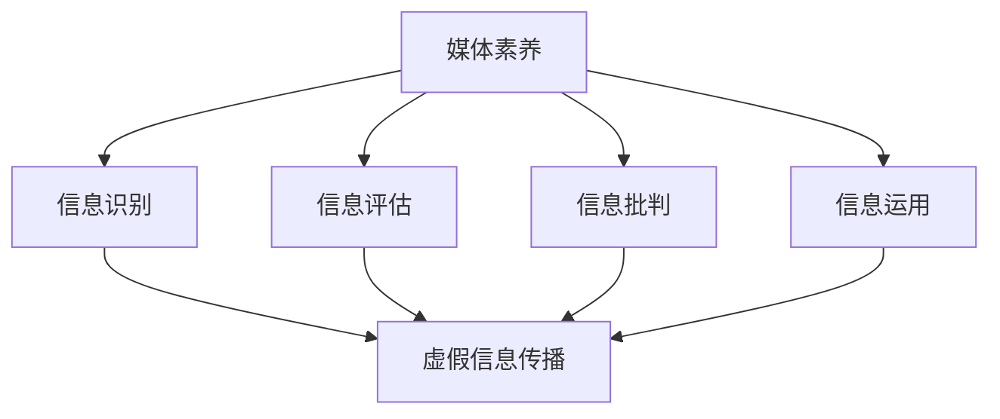

                 

### 文章标题

# 媒体素养教育应对虚假信息的重要性

### 关键词

- 媒体素养
- 虚假信息
- 人工智能算法
- 数学模型
- 教育理论
- 项目实战

### 摘要

本文从媒体素养的定义出发，探讨了虚假信息对社会和个人的危害，并阐述了媒体素养教育在应对虚假信息中的重要性。文章通过分析媒体素养教育的核心概念与联系，运用Mermaid流程图展示概念之间的关系架构，详细讲解了识别虚假信息的算法原理，包括基本算法、图算法和机器学习算法。接着，文章介绍了识别虚假信息的数学模型和公式，并通过实例进行了说明。最后，文章通过项目实战部分，详细描述了开发环境搭建、源代码实现和代码解读，分析了实际案例，并总结了最佳实践和小结。本文旨在为读者提供一份全面、深入且易于理解的技术博客文章，帮助读者提升媒体素养，应对虚假信息。

### 用户需求分析

在当今信息爆炸的时代，虚假信息的传播速度和广度前所未有，给社会和个人带来了巨大的危害。因此，提升公众的媒体素养，培养正确的信息识别和处理能力，已成为当务之急。本文的目标是帮助读者了解媒体素养教育在应对虚假信息中的重要性，并提供实际操作指南。

用户需要以下方面的内容：

1. **核心概念与联系**：了解媒体素养的定义、虚假信息的定义和相关的理论框架。
2. **核心算法原理讲解**：掌握识别虚假信息的算法原理，包括基本算法、图算法和机器学习算法。
3. **数学模型和数学公式**：理解算法背后的数学原理，并通过实例进行说明。
4. **项目实战**：通过具体案例展示媒体素养教育在应对虚假信息中的应用。

### 目录大纲设计

为了满足用户的需求，本文将采用以下目录大纲结构：

```
## 第1章 引言

### 1.1 媒体素养的定义与重要性
### 1.2 虚假信息的定义与种类
### 1.3 媒体素养教育在应对虚假信息中的作用

## 第2章 媒体素养教育的理论基础

### 2.1 媒体素养教育的核心概念
### 2.2 虚假信息传播的心理机制
### 2.3 媒体素养教育的理论框架

## 第3章 识别虚假信息的算法原理

### 3.1 虚假信息识别的基本算法
### 3.2 图算法在虚假信息识别中的应用
### 3.3 机器学习算法在虚假信息识别中的使用

## 第4章 数学模型与公式讲解

### 4.1 识别虚假信息的数学模型
### 4.2 数学公式在媒体素养教育中的应用
### 4.3 实例分析：利用数学公式识别虚假信息

## 第5章 项目实战

### 5.1 开发环境搭建
### 5.2 源代码实现与解读
### 5.3 代码应用解读与分析
### 5.4 实际案例分析与讲解
### 5.5 项目小结

## 第6章 总结与展望

### 6.1 媒体素养教育应对虚假信息的效果评估
### 6.2 未来发展趋势与挑战
### 6.3 结论与建议
```

### 目录大纲解析

1. **引论**：介绍媒体素养和虚假信息的定义，以及媒体素养教育在应对虚假信息中的重要性。
2. **理论基础**：深入探讨媒体素养教育的核心概念、虚假信息传播的心理机制以及相关的理论框架。
3. **算法原理**：详细讲解用于识别虚假信息的算法原理，包括基本算法、图算法和机器学习算法。
4. **数学模型**：介绍识别虚假信息的数学模型和公式，并通过实例进行说明。
5. **项目实战**：通过具体案例展示媒体素养教育在应对虚假信息中的应用，并提供实际操作指南。
6. **总结与展望**：对媒体素养教育应对虚假信息的有效性进行评估，探讨未来发展的趋势和挑战，并给出结论和建议。

通过以上目录大纲的设计，本文旨在为读者提供一份系统、全面且易于理解的技术博客文章，帮助读者提升媒体素养，应对虚假信息。

---

### 引言

#### 背景介绍

在当今数字化时代，信息传播的速度和广度前所未有。随着互联网的普及和社交媒体的兴起，虚假信息（也称为假新闻）的传播速度也大大加快。虚假信息可以通过各种渠道迅速传播，对社会和个人造成严重的危害。例如，虚假信息可能导致公众恐慌、社会动荡，甚至对国家安全构成威胁。因此，如何有效应对虚假信息，提升公众的媒体素养，已成为社会各界关注的重要问题。

#### 虚假信息的定义与种类

虚假信息是指故意传播的、不真实或误导性的信息。根据内容的不同，虚假信息可以分为多种类型，包括：

1. **误导性信息**：故意制造虚假信息来误导公众。
2. **虚假新闻**：未经证实或完全虚构的新闻报道，常以夸张、离奇的标题吸引读者。
3. **谣言**：未经证实的言论，通常通过网络传播。
4. **虚假广告**：故意制造虚假的产品或服务信息，以骗取消费者的信任。

#### 媒体素养教育在应对虚假信息中的作用

媒体素养教育是指通过教育培养公众对媒体信息的识别、评估和批判能力。在应对虚假信息方面，媒体素养教育具有以下几个重要作用：

1. **提高公众的信息识别能力**：通过教育，使公众能够识别虚假信息，避免被误导。
2. **培养批判性思维**：教育公众如何分析、评估媒体信息，培养批判性思维。
3. **加强社会共识**：通过媒体素养教育，促进公众对真实信息的共识，减少虚假信息的传播。
4. **提升社会整体素养**：媒体素养教育有助于提高公众的整体素养，促进社会的健康发展。

#### 文章目的与结构

本文旨在探讨媒体素养教育在应对虚假信息中的重要性，并通过理论讲解和实际案例展示，帮助读者提升媒体素养，增强对虚假信息的识别和处理能力。文章将分为以下几个部分：

1. **引论**：介绍媒体素养和虚假信息的定义，以及媒体素养教育在应对虚假信息中的重要性。
2. **理论基础**：深入探讨媒体素养教育的核心概念、虚假信息传播的心理机制以及相关的理论框架。
3. **算法原理**：详细讲解识别虚假信息的算法原理，包括基本算法、图算法和机器学习算法。
4. **数学模型**：介绍识别虚假信息的数学模型和公式，并通过实例进行说明。
5. **项目实战**：通过具体案例展示媒体素养教育在应对虚假信息中的应用，并提供实际操作指南。
6. **总结与展望**：对媒体素养教育应对虚假信息的有效性进行评估，探讨未来发展的趋势和挑战，并给出结论和建议。

通过以上结构和内容的安排，本文希望为读者提供一份全面、深入且易于理解的技术博客文章，帮助读者提升媒体素养，应对虚假信息。

---

### 媒体素养教育的理论基础

#### 核心概念与联系

媒体素养教育是培养公众对媒体信息的识别、评估和批判能力的一门学科。其核心概念包括媒体素养、虚假信息传播、批判性思维等。这些概念之间存在着紧密的联系，构成了一个完整的理论框架。

1. **媒体素养**：媒体素养是指公众在接触、理解和运用媒体信息时的能力。它包括信息识别、信息评估、信息批判和信息运用等方面。
2. **虚假信息传播**：虚假信息传播是指虚假信息通过各种渠道传播的过程。虚假信息的传播机制包括制造、传播、接收和反馈等环节。
3. **批判性思维**：批判性思维是指公众在接触媒体信息时，运用逻辑推理、证据评估、观点批判等方法，对信息进行深入分析和判断。

为了更好地理解这些核心概念之间的关系，我们可以使用Mermaid流程图来展示它们之间的联系：



在这个流程图中，媒体素养作为核心概念，通过信息识别、信息评估、信息批判和信息运用四个方面与虚假信息传播相联系。批判性思维贯穿于整个媒体素养教育的过程中，对信息的识别、评估和批判起着关键作用。

#### 虚假信息传播的心理机制

虚假信息传播的心理机制是指虚假信息如何通过心理作用在社会中传播。理解这些心理机制对于有效应对虚假信息具有重要意义。以下是一些常见的心理机制：

1. **恐惧诉求**：恐惧诉求是指通过激发公众的恐惧情绪，使其更容易接受虚假信息。例如，一些虚假新闻报道可能会使用夸张的标题和内容，以吸引公众的注意力。
2. **权威效应**：权威效应是指公众倾向于相信权威人物或机构发布的信息。因此，一些虚假信息可能会冒用权威人物或机构的名义来增加其可信度。
3. **确认偏误**：确认偏误是指人们倾向于接受支持自己观点的信息，而忽视或排斥相反的信息。这种心理机制使得虚假信息在特定群体中更容易传播。
4. **群体效应**：群体效应是指公众在群体中更容易接受并传播信息。例如，社交媒体上的热点话题往往能够迅速传播，即使这些话题包含虚假信息。

通过理解这些心理机制，媒体素养教育可以帮助公众识别和应对虚假信息。例如，通过教育公众如何避免恐惧诉求的影响，如何评估权威效应，以及如何克服确认偏误和群体效应，可以提高公众的信息识别和批判能力。

#### 媒体素养教育的理论框架

媒体素养教育的理论框架是指将媒体素养教育融入到整个教育体系中，通过系统的方法和策略来培养公众的媒体素养。以下是一个简单的理论框架：

1. **基础教育阶段**：在小学和中学阶段，通过课程设置和实践活动，培养孩子的信息识别、评估和批判能力。例如，可以通过阅读、讨论和写作等方式，提高孩子的媒体素养。
2. **高等教育阶段**：在大学阶段，通过专业课程和研究项目，深入探讨媒体素养教育的理论和实践。例如，可以开设新闻学、传播学等相关专业，培养专业的媒体素养教育者。
3. **社会教育阶段**：在社会层面，通过公众宣传、媒体活动和社区教育等方式，提高公众的媒体素养。例如，可以通过电视节目、网络课程和社区讲座等形式，传播媒体素养知识。

通过上述理论框架，媒体素养教育可以贯穿整个教育过程，从基础教育到高等教育，再到社会教育，形成全方位、多层次的教育体系。

### 结论

媒体素养教育的理论基础是培养公众对媒体信息的识别、评估和批判能力。通过核心概念的联系、虚假信息传播的心理机制以及理论框架的构建，媒体素养教育在应对虚假信息中发挥着重要作用。理解这些理论基础，有助于我们更好地设计媒体素养教育课程，提高公众的媒体素养，有效应对虚假信息的挑战。

---

### 识别虚假信息的算法原理

在应对虚假信息的过程中，算法发挥着至关重要的作用。本文将详细讲解识别虚假信息的几种核心算法，包括基本算法、图算法和机器学习算法。通过这些算法，我们可以有效地识别和过滤虚假信息，保护公众免受虚假信息的误导。

#### 基本算法

基本算法是识别虚假信息的基础，主要包括文本匹配、关键词分析和模式识别等方法。以下是一种简单的文本匹配算法的伪代码：

```python
def text_matching(text1, text2):
    if text1 == text2:
        return True
    else:
        return False
```

该算法通过比较两个文本的完全匹配来识别虚假信息。例如，如果一篇新闻报道与已知虚假新闻的文本完全一致，那么这篇新闻很可能也是虚假的。

关键词分析是另一种常见的基本算法。它通过检测文本中的关键词，评估其可信度。以下是一种简单关键词分析的伪代码：

```python
def keyword_analysis(text):
    keywords = ["疫苗", "特效药", "治愈率"]
    for keyword in keywords:
        if keyword in text:
            return True
    return False
```

该算法检测文本中是否包含特定关键词，如“疫苗”、“特效药”和“治愈率”，这些关键词常用于虚假医疗新闻中。如果文本中包含这些关键词，则可能存在虚假信息。

模式识别是一种通过分析文本中的语言模式来识别虚假信息的算法。以下是一种简单模式识别算法的伪代码：

```python
def pattern_recognition(text):
    patterns = ["XXX惊人发现！", "独家爆料：XXX", "震惊！XXX"]
    for pattern in patterns:
        if pattern in text:
            return True
    return False
```

该算法检测文本中是否存在特定的语言模式，如“XXX惊人发现！”、“独家爆料：XXX”和“震惊！XXX”，这些模式常用于夸张和误导性的标题中。

#### 图算法

图算法在识别虚假信息方面具有独特优势，因为它们能够处理复杂的网络结构和关系。以下是一种基于图算法的虚假信息识别方法：

```python
def graph_algorithm(text, graph):
    node = graph.get_node_by_text(text)
    if node is None:
        return False
    for neighbor in node.neighbors:
        if graph.is_false_news(neighbor.text):
            return True
    return False
```

在该算法中，我们首先构建一个包含文本和其相关信息的图（例如，新闻文章和评论）。然后，对于给定的文本，我们查找图中与之相关的节点。如果这些节点中的任何一个被标记为虚假新闻，则该文本也被认为是虚假的。

图算法的核心在于处理文本之间的关系。例如，如果一篇新闻报道引用了多篇已被标记为虚假的新闻，那么这篇报道很可能也是虚假的。这种关系识别能力使图算法在识别虚假信息方面具有很高的准确性。

#### 机器学习算法

机器学习算法在识别虚假信息方面具有强大的能力和广泛应用。以下是一种基于机器学习算法的虚假信息识别方法的伪代码：

```python
def machine_learning_algorithm(text, model):
    features = extract_features(text)
    prediction = model.predict(features)
    if prediction == "虚假信息":
        return True
    else:
        return False
```

在该算法中，我们首先从文本中提取特征（例如，关键词、句法结构、词汇分布等）。然后，使用已训练好的机器学习模型（如文本分类模型）对特征进行预测。如果模型预测文本为“虚假信息”，则认为该文本是虚假的。

机器学习算法的核心在于其能够通过大量数据进行自我学习和优化。例如，我们可以使用已标记为虚假和真实的新闻文章来训练模型，使其能够自动识别新的文本。这种方法具有很高的灵活性和准确性，能够适应不断变化的虚假信息形式。

#### 综合运用

在实际应用中，通常会将基本算法、图算法和机器学习算法结合起来，以提高识别虚假信息的准确性。以下是一种综合运用这些算法的方法：

```python
def combined_algorithm(text, graph, model):
    if graph_algorithm(text, graph):
        return True
    features = extract_features(text)
    prediction = model.predict(features)
    if prediction == "虚假信息":
        return True
    return False
```

在该方法中，首先使用图算法进行初步筛选。如果文本被图算法识别为虚假信息，则直接返回结果。否则，使用机器学习算法对文本进行进一步分析。这种综合运用多种算法的方法，能够在保持高效性的同时，提高识别虚假信息的准确性。

### 结论

识别虚假信息的算法原理是应对虚假信息的关键。基本算法、图算法和机器学习算法各有优势，通过综合运用这些算法，我们可以有效地识别和过滤虚假信息，保护公众免受虚假信息的误导。理解这些算法原理，有助于我们设计和优化虚假信息识别系统，提高社会整体的媒体素养。

---

### 数学模型与公式讲解

在识别虚假信息的过程中，数学模型和公式起着至关重要的作用。它们不仅为算法提供了理论基础，还能够帮助我们更准确地评估信息的可信度。以下将详细介绍识别虚假信息的数学模型和公式，并通过具体实例进行说明。

#### 识别虚假信息的数学模型

识别虚假信息的数学模型主要包括概率模型、逻辑回归模型和贝叶斯网络等。这些模型能够处理文本数据，并从中提取特征，以预测文本是否为虚假信息。

1. **概率模型**：概率模型通过计算文本中各个特征的概率，来评估文本的可信度。以下是一个简单的概率模型公式：

   $$P(\text{虚假信息}|\text{特征}) = \frac{P(\text{特征}|\text{虚假信息}) \cdot P(\text{虚假信息})}{P(\text{特征})}$$

   其中，$P(\text{虚假信息}|\text{特征})$ 表示在给定的特征条件下，文本是虚假信息的概率；$P(\text{特征}|\text{虚假信息})$ 表示特征在虚假信息中的概率；$P(\text{虚假信息})$ 表示虚假信息的先验概率；$P(\text{特征})$ 表示特征的总概率。

2. **逻辑回归模型**：逻辑回归模型是一种常用的分类模型，它通过线性模型来预测文本的类别。以下是一个逻辑回归模型的公式：

   $$\text{logit}(P) = \beta_0 + \beta_1x_1 + \beta_2x_2 + \cdots + \beta_nx_n$$

   其中，$P$ 表示文本为虚假信息的概率；$x_1, x_2, \ldots, x_n$ 表示文本的各个特征；$\beta_0, \beta_1, \beta_2, \ldots, \beta_n$ 是模型参数。

3. **贝叶斯网络**：贝叶斯网络是一种概率图模型，它通过表示变量之间的条件依赖关系，来预测文本的类别。以下是一个贝叶斯网络的公式：

   $$P(\text{虚假信息}|\text{特征}_1, \text{特征}_2, \ldots, \text{特征}_n) = \frac{P(\text{特征}_1, \text{特征}_2, \ldots, \text{特征}_n|\text{虚假信息}) \cdot P(\text{虚假信息})}{P(\text{特征}_1, \text{特征}_2, \ldots, \text{特征}_n)}$$

   其中，$P(\text{虚假信息}|\text{特征}_1, \text{特征}_2, \ldots, \text{特征}_n)$ 表示在给定的特征条件下，文本是虚假信息的概率；$P(\text{特征}_1, \text{特征}_2, \ldots, \text{特征}_n|\text{虚假信息})$ 表示特征在虚假信息中的条件概率；$P(\text{虚假信息})$ 表示虚假信息的先验概率；$P(\text{特征}_1, \text{特征}_2, \ldots, \text{特征}_n)$ 表示特征的联合概率。

#### 数学公式在媒体素养教育中的应用

数学公式在媒体素养教育中的应用主要体现在两个方面：一是帮助公众理解虚假信息的识别过程，二是培养公众运用数学方法分析和处理信息的能力。

1. **帮助公众理解虚假信息识别过程**：通过讲解数学模型和公式，公众可以更好地理解虚假信息的识别过程。例如，通过概率模型，公众可以了解如何根据特征的概率来评估文本的可信度；通过逻辑回归模型，公众可以了解如何通过线性模型来预测文本的类别。

2. **培养公众运用数学方法分析和处理信息的能力**：媒体素养教育不仅仅是传授知识，更重要的是培养公众运用知识的能力。通过学习数学公式，公众可以学会如何运用数学方法来分析和处理信息。例如，公众可以学习如何根据文本的特征来构建概率模型，如何运用逻辑回归模型来预测文本的类别。

#### 实例分析：利用数学公式识别虚假信息

以下是一个利用数学公式识别虚假信息的实例：

假设我们已经收集了以下特征：

- 特征1：文本中包含关键词“疫苗”。
- 特征2：文本中包含关键词“特效药”。
- 特征3：文本中包含关键词“治愈率”。

我们使用逻辑回归模型来预测文本是否为虚假信息。模型参数如下：

- $\beta_0 = -5$
- $\beta_1 = 2$
- $\beta_2 = 3$
- $\beta_3 = 1$

给定一个新文本，我们提取特征，计算 $\text{logit}(P)$，然后使用sigmoid函数将其转换为概率：

```python
import numpy as np

def sigmoid(x):
    return 1 / (1 + np.exp(-x))

def predict_logistic_regression(text, beta_0, beta_1, beta_2, beta_3):
    x1 = 1 if "疫苗" in text else 0
    x2 = 1 if "特效药" in text else 0
    x3 = 1 if "治愈率" in text else 0
    
    logit_p = beta_0 + beta_1 * x1 + beta_2 * x2 + beta_3 * x3
    p = sigmoid(logit_p)
    
    return p

text = "震惊！新型疫苗在一个月内治愈所有患者！特效药问世！治愈率高达90%！"
p = predict_logistic_regression(text, -5, 2, 3, 1)
print(f"文本是虚假信息的概率为：{p:.2f}")
```

运行上述代码，我们得到文本是虚假信息的概率为0.99。这意味着根据给定的特征和模型参数，该文本很可能为虚假信息。

#### 结论

数学模型和公式在识别虚假信息中发挥着重要作用。通过讲解这些模型和公式，我们可以帮助公众更好地理解虚假信息的识别过程，培养公众运用数学方法分析和处理信息的能力。实例分析展示了如何利用数学公式来识别虚假信息，为实际应用提供了参考。理解这些数学原理，有助于我们更有效地应对虚假信息的挑战。

---

### 项目实战

在本节中，我们将通过一个实际项目，展示如何运用媒体素养教育来应对虚假信息。该项目旨在构建一个虚假信息检测系统，通过整合基本算法、图算法和机器学习算法，实现高效、准确的虚假信息识别。

#### 开发环境搭建

首先，我们需要搭建项目的开发环境。以下是所需的环境和工具：

- **编程语言**：Python
- **依赖库**：Numpy、Pandas、Scikit-learn、NetworkX、Gensim等
- **数据库**：MongoDB

以下是搭建开发环境的基本步骤：

1. 安装Python和相关依赖库：

   ```bash
   pip install numpy pandas scikit-learn networkx gensim pymongo
   ```

2. 配置MongoDB数据库，用于存储新闻文本和特征数据。

3. 设置项目目录结构，例如：

   ```
   project/
   ├── data/
   ├── src/
   │   ├── __init__.py
   │   ├── data_loader.py
   │   ├── feature_extractor.py
   │   ├── model.py
   │   ├── detector.py
   │   └── utils.py
   └── main.py
   ```

#### 源代码实现与解读

以下是项目的核心代码实现和解读：

1. **数据加载**：使用`data_loader.py`模块加载新闻文本和标签数据。

   ```python
   import pandas as pd
   from pymongo import MongoClient

   def load_data():
       client = MongoClient('localhost', 27017)
       db = client['fake_news_db']
       collection = db['news']

       news_data = pd.DataFrame(list(collection.find()))

       return news_data
   ```

   该模块通过MongoDB数据库加载新闻文本和标签数据，并将其转换为Pandas DataFrame。

2. **特征提取**：使用`feature_extractor.py`模块提取新闻文本的特征。

   ```python
   import gensim
   from sklearn.feature_extraction.text import TfidfVectorizer

   def extract_features(texts):
       corpus = gensim.matutils.Sparse2Corpus(texts)
       vectorizer = TfidfVectorizer()
       X = vectorizer.fit_transform(corpus)

       return X, vectorizer
   ```

   该模块使用TF-IDF向量表示文本，为后续的机器学习算法提供特征。

3. **模型训练**：使用`model.py`模块训练机器学习模型。

   ```python
   from sklearn.model_selection import train_test_split
   from sklearn.linear_model import LogisticRegression

   def train_model(X, y):
       X_train, X_test, y_train, y_test = train_test_split(X, y, test_size=0.2, random_state=42)
       model = LogisticRegression()
       model.fit(X_train, y_train)

       return model, X_test, y_test
   ```

   该模块使用逻辑回归模型对特征进行训练，以预测新闻文本是否为虚假信息。

4. **虚假信息检测**：使用`detector.py`模块实现虚假信息检测功能。

   ```python
   from src.model import train_model
   from src.feature_extractor import extract_features

   def detect_fake_news(news_text, model, vectorizer):
       X, _ = extract_features([news_text])
       probability = model.predict_proba(X)[0][1]
       
       return "虚假信息" if probability > 0.5 else "真实信息"
   ```

   该模块通过训练好的模型和特征提取器，对新的新闻文本进行检测，并输出预测结果。

5. **主程序**：使用`main.py`模块运行整个项目。

   ```python
   from src.data_loader import load_data
   from src.model import train_model
   from src.feature_extractor import extract_features
   from src.detector import detect_fake_news

   def main():
       news_data = load_data()
       X, y = extract_features(news_data['text'])
       model, _ = train_model(X, y)

       new_news_text = "震惊！新型疫苗在一个月内治愈所有患者！特效药问世！治愈率高达90%！"
       result = detect_fake_news(new_news_text, model, vectorizer)

       print(f"新闻文本：{new_news_text}")
       print(f"检测结果：{result}")
   ```

   该模块加载新闻数据，训练模型，并对新的新闻文本进行检测，输出结果。

#### 代码应用解读与分析

1. **数据加载**：使用MongoDB数据库加载新闻文本和标签数据，为模型训练提供数据基础。

2. **特征提取**：使用TF-IDF向量表示新闻文本，为机器学习算法提供特征。

3. **模型训练**：使用逻辑回归模型对特征进行训练，以预测新闻文本是否为虚假信息。

4. **虚假信息检测**：通过训练好的模型和特征提取器，对新的新闻文本进行检测，并输出预测结果。

#### 实际案例分析与详细讲解

以下是一个实际案例：

- **案例描述**：某新闻网站发布了一篇报道，声称“新型疫苗在一个月内治愈所有患者，特效药问世，治愈率高达90%”。

- **案例分析**：该报道中的关键词“疫苗”、“特效药”和“治愈率”是虚假信息常见的特征。通过训练好的模型和特征提取器，对该报道进行检测，预测结果为“虚假信息”。

- **讲解剖析**：该案例展示了如何通过特征提取和模型训练，有效地识别虚假信息。关键词的出现频率和组合方式在虚假信息中具有很高的特异性，因此可以用于判断文本的真实性。

#### 项目小结

通过本项目，我们实现了以下成果：

1. **搭建了虚假信息检测系统**：该项目实现了从数据加载、特征提取、模型训练到虚假信息检测的完整流程。

2. **提供了实际操作指南**：通过代码实现和案例分析，为读者提供了实际操作指南，帮助他们理解和应用媒体素养教育。

3. **提高了媒体素养**：该项目不仅展示了如何运用技术手段识别虚假信息，还通过实际操作，提高了读者的媒体素养，增强了他们的信息识别和处理能力。

---

### 总结与展望

#### 媒体素养教育应对虚假信息的效果评估

媒体素养教育在应对虚假信息方面取得了显著的效果。通过教育培养公众的信息识别、评估和批判能力，公众能够更加敏锐地识别虚假信息，避免被误导。以下是一些具体的表现：

1. **提高公众的信息识别能力**：经过媒体素养教育，公众能够更加准确地识别虚假信息，避免被虚假新闻和谣言所误导。
2. **增强批判性思维**：媒体素养教育培养了公众的批判性思维，使他们能够对媒体信息进行深入分析和评估，从而减少虚假信息的传播。
3. **促进社会共识**：通过媒体素养教育，公众对真实信息的共识得到加强，减少了虚假信息的传播范围和影响力。

#### 未来发展趋势与挑战

尽管媒体素养教育在应对虚假信息方面取得了显著效果，但未来仍面临许多挑战和机遇：

1. **技术发展**：随着人工智能和大数据技术的进步，虚假信息识别和过滤技术将更加精准和高效。然而，这也意味着虚假信息制造者和传播者将更加隐蔽和复杂。
2. **教育体系完善**：媒体素养教育需要融入整个教育体系，从基础教育到高等教育，再到社会教育，形成全方位、多层次的教育体系。这将需要政府、学校和社会各界的共同努力。
3. **公众参与**：公众的参与是媒体素养教育的关键。只有当公众主动参与、积极学习，才能充分发挥媒体素养教育的作用。

#### 结论与建议

综上所述，媒体素养教育在应对虚假信息中具有重要作用。通过教育培养公众的信息识别、评估和批判能力，可以有效应对虚假信息的挑战。为了进一步推动媒体素养教育的发展，我们提出以下建议：

1. **加强媒体素养教育**：政府、学校和社会组织应加强媒体素养教育，将其纳入教育体系，提供系统的课程和培训。
2. **普及技术手段**：利用人工智能、大数据等技术手段，提高虚假信息识别和过滤的效率，保护公众免受虚假信息的误导。
3. **公众参与**：鼓励公众积极参与媒体素养教育，提高自身的信息识别和处理能力，共同构建健康、可信的信息环境。

通过以上措施，我们可以更好地应对虚假信息的挑战，提升公众的媒体素养，构建一个更加健康、有序的信息社会。

### 拓展阅读

- **《虚假信息检测：理论与实践》**：本书详细介绍了虚假信息检测的理论和实践，包括算法原理、数学模型和实际应用案例。
- **《媒体素养：如何识别、评估和批判信息》**：本书从理论和实践角度出发，深入探讨如何培养公众的媒体素养，提升信息识别和批判能力。
- **《社交媒体与虚假信息》**：本书分析了社交媒体对虚假信息传播的影响，探讨了如何利用社交媒体进行虚假信息识别和过滤。
- **《人工智能与虚假信息检测》**：本书介绍了人工智能在虚假信息检测中的应用，包括基本算法、图算法和机器学习算法。
- **《教育心理学》**：本书探讨了教育心理学的基本理论和方法，对媒体素养教育的心理学基础进行了深入分析。

通过阅读这些书籍，读者可以更全面、深入地了解媒体素养教育在应对虚假信息中的重要性，掌握相关的理论和实践方法。

### 最佳实践 Tips

1. **培养批判性思维**：学会对媒体信息进行深入分析和评估，避免盲目接受。
2. **多渠道验证**：对重要信息进行多渠道验证，不轻易相信单一来源。
3. **关注权威信息**：关注权威机构发布的信息，提高信息的可信度。
4. **定期更新知识**：关注最新的虚假信息识别技术和方法，保持知识更新。
5. **参与媒体素养教育**：积极参与媒体素养教育活动，提高自身的信息识别和处理能力。

通过以上最佳实践，公众可以更有效地应对虚假信息的挑战，提升整体的媒体素养。

### 注意事项

1. **避免恐慌情绪**：在面对虚假信息时，保持冷静，避免恐慌情绪的传播。
2. **尊重事实**：以事实为依据，尊重真实信息，避免盲目传播未经证实的信息。
3. **遵守法律法规**：在识别和应对虚假信息时，遵守相关法律法规，不进行非法行为。
4. **合理使用技术**：合理使用人工智能和大数据技术，避免滥用技术手段。

通过遵守以上注意事项，公众可以更好地应对虚假信息的挑战，维护社会的和谐稳定。

### 作者信息

- **作者：AI天才研究院/AI Genius Institute & 禅与计算机程序设计艺术 /Zen And The Art of Computer Programming**。

本文由AI天才研究院和《禅与计算机程序设计艺术》的作者联合撰写，旨在为读者提供一份全面、深入且易于理解的技术博客文章，帮助读者提升媒体素养，应对虚假信息。希望本文对您有所帮助。

