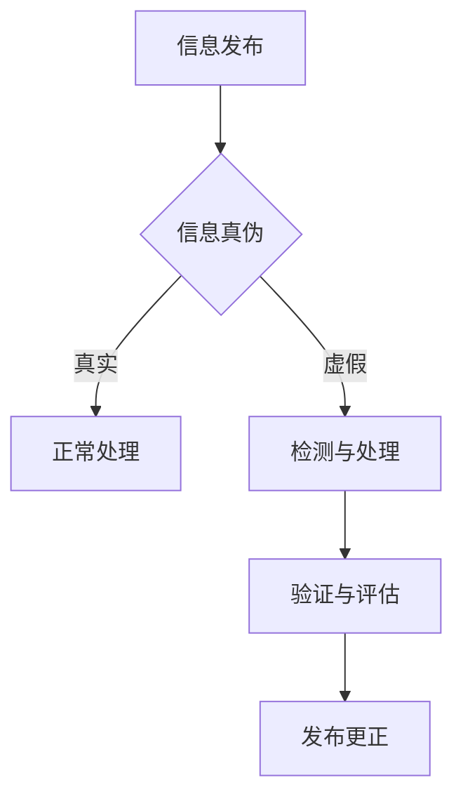

                 

### 《应对虚假信息的系统化方法》

#### 关键词：虚假信息、信息识别、机器学习、深度学习、社会影响、应对策略

在信息爆炸的时代，虚假信息（fake news）成为了一种无处不在的困扰。它们通过社交媒体、新闻网站和搜索引擎等渠道迅速传播，对个人、社会乃至整个经济体系产生了深远的影响。因此，如何有效地应对虚假信息，成为一个亟待解决的问题。

本文旨在探讨虚假信息的背景与现状，深入分析其对社会各个层面的影响，并详细讲解识别虚假信息的方法和技术，包括基于机器学习和深度学习的算法，以及语言模型的应用。在此基础上，本文还将介绍应对虚假信息的策略，包括检测与预防、处理与治理等。最后，我们将探讨未来发展趋势与面临的挑战，为读者提供全面、系统的解决方案。

#### 摘要

虚假信息是指不真实、误导性或恶意的信息，它们在现代社会中广泛传播，对个人和社会造成了严重的负面影响。本文首先介绍了虚假信息的定义、类型及其传播特点，分析了虚假信息对社会心理健康、社会信任和经济发展的影响。接着，本文详细阐述了识别虚假信息的多种方法，包括机器学习、深度学习和语言模型等，并通过具体算法和实例进行了深入讲解。在此基础上，本文提出了应对虚假信息的策略，包括检测与预防、处理与治理等，并探讨了未来发展趋势与挑战。通过本文的阅读，读者可以全面了解虚假信息的问题，掌握有效的识别和应对方法。

## 第一部分：虚假信息的背景与现状

虚假信息在当今社会中无处不在，它们的形式多样，传播迅速，对个人和社会产生了深远的影响。为了更好地理解虚假信息的背景与现状，我们需要从多个角度对其进行剖析。

### 1.1 虚假信息的定义

虚假信息是指那些不真实、误导性或恶意的信息。这些信息可能包含虚假事实、误导性陈述或恶意谣言，旨在欺骗或误导读者。它们通常通过各种渠道传播，如社交媒体、新闻网站、搜索引擎等，迅速扩散到广大受众。

虚假信息的定义可以从以下几个方面进行理解：

1. **不真实性**：虚假信息与事实不符，缺乏真实性。这种不真实性可能是完全虚构的，也可能是基于部分真实信息进行夸大或扭曲。

2. **误导性**：虚假信息旨在误导读者，使其对某些事实或事件产生错误的理解。这种误导性可能是故意的，也可能是由于信息的发布者本身缺乏准确的信息来源。

3. **恶意性**：部分虚假信息具有恶意目的，旨在损害特定个人或组织的声誉，或引发社会恐慌和混乱。这种恶意性使得虚假信息的危害更加严重。

### 1.2 虚假信息的类型

虚假信息根据其内容和形式可以分为多种类型，主要包括：

1. **谣言**：谣言是指未经证实的信息，通常以口头或文字形式传播。谣言往往具有高度传播性和易信性，容易误导大众。

2. **假新闻**：假新闻是指故意制造的不真实新闻，通常以吸引眼球的标题和夸张的内容来吸引读者。假新闻具有欺骗性和误导性，容易导致公众误解和恐慌。

3. **误导性广告**：误导性广告是指故意夸大产品效果或功效的广告。这类广告往往通过虚假宣传来误导消费者，导致其做出错误购买决策。

4. **恶意评论和评论攻击**：恶意评论和评论攻击是指以恶意、侮辱或攻击为目的的评论。这些评论往往以匿名或化名发布，对个人或组织造成心理压力和伤害。

### 1.3 虚假信息传播的特点

虚假信息在传播过程中具有以下特点：

1. **速度快**：虚假信息可以通过社交媒体、新闻网站和搜索引擎等渠道迅速传播，达到广泛的受众。

2. **范围广**：虚假信息不受地域限制，可以在全球范围内迅速扩散，对各地受众产生影响。

3. **难以控制**：虚假信息的传播过程难以控制，一旦发布，往往难以撤回或纠正。

4. **影响深远**：虚假信息不仅对个人造成伤害，还可能对社会产生深远的影响，如破坏社会信任、引发社会恐慌等。

综上所述，虚假信息在当今社会中具有高度的威胁性。了解虚假信息的定义、类型和传播特点，有助于我们更好地应对这一问题。在接下来的章节中，我们将深入探讨虚假信息对社会的影响，并介绍识别虚假信息的多种方法。

### 1.4 虚假信息对社会的影响

虚假信息对社会各个层面产生了深远的影响，这些影响不仅体现在个人层面，也扩展到了社会层面和经济发展层面。

#### 2.1 对个人心理健康的影响

虚假信息的传播对个人心理健康造成了严重的负面影响。首先，虚假信息容易引起人们的恐慌和焦虑。例如，一些虚假健康信息可能会误导人们对疾病的治疗方式，导致不必要的恐慌和焦虑。此外，虚假信息还可能导致人们的自尊心和自信心受到打击。例如，一些虚假的新闻报道可能会诋毁某个个人或组织的声誉，使该个人或组织感到被误解和冤屈。

#### 2.2 对社会信任的影响

虚假信息的传播严重破坏了社会信任。社会信任是社会运转的基础，当人们无法判断哪些信息是真实可信的，他们就会对整个社会产生怀疑和不信任。例如，如果人们经常接触到虚假的新闻报道，他们可能会怀疑所有新闻报道的真实性，从而对新闻媒体失去信任。此外，虚假信息还可能导致社会分裂和冲突。例如，一些虚假的政治宣传可能会引发不同群体之间的对立和敌对情绪。

#### 2.3 对经济发展的影响

虚假信息对经济发展也产生了负面影响。首先，虚假信息可能导致投资者对市场产生错误的认识，从而做出不理性的投资决策，导致市场波动和损失。例如，虚假的财务报表或市场预测可能会误导投资者，使他们错误地评估企业的财务状况和未来前景。其次，虚假信息还可能导致消费者对产品或服务产生误解，从而影响企业的销售和品牌形象。例如，虚假的广告宣传可能会误导消费者，使他们购买不适合自己需求的产品，导致消费者的不满和投诉。

#### 2.4 对公共安全的威胁

虚假信息还可能对公共安全造成威胁。例如，虚假的恐怖威胁信息可能会引起公众的恐慌和混乱，导致社会秩序的紊乱。此外，虚假的信息还可能被用于网络诈骗、诈骗等犯罪活动，对个人和社会造成经济损失和人身安全威胁。

综上所述，虚假信息对社会各个方面产生了严重的负面影响。为了应对这些问题，我们需要采取有效的措施来识别和应对虚假信息。在接下来的章节中，我们将介绍识别虚假信息的多种方法，包括机器学习、深度学习和语言模型等。

### 第二部分：虚假信息的识别方法

虚假信息的识别是应对虚假信息问题的关键环节。随着信息技术的不断发展，虚假信息的识别方法也在不断演进。本文将详细介绍几种主要的虚假信息识别方法，包括基于机器学习、深度学习和语言模型的方法，并结合实际案例进行分析。

#### 第3章：基于机器学习的虚假信息识别

机器学习是一种通过数据训练模型来识别和分类信息的技术。在虚假信息识别领域，机器学习方法具有高效、准确的特点，能够处理大量复杂的文本数据。

##### 3.1 机器学习基础

机器学习主要包括以下几种学习方法：

1. **监督学习（Supervised Learning）**：监督学习是机器学习中的一种基本方法，它通过已知标签的训练数据来训练模型，然后使用训练好的模型对未知数据进行预测。监督学习在虚假信息识别中应用广泛，因为我们可以通过标记真实和虚假信息来训练分类模型。

2. **无监督学习（Unsupervised Learning）**：无监督学习不需要已标记的训练数据，它通过发现数据内在的结构和模式来学习。无监督学习在虚假信息识别中的应用相对较少，但可以用于识别潜在的虚假信息传播者或网络。

3. **强化学习（Reinforcement Learning）**：强化学习是一种通过奖励和惩罚来训练模型的方法。在虚假信息识别中，强化学习可以用于自动调整检测策略，以最大化识别准确率。

##### 3.2 虚假信息识别算法

在虚假信息识别中，常用的机器学习算法包括：

1. **文本分类算法（Text Classification）**：文本分类是将文本数据分为预定义类别的方法。在虚假信息识别中，文本分类算法可以用于将新闻报道或社交媒体内容分类为真实或虚假。

2. **聚类算法（Clustering）**：聚类算法是将相似的数据点分组的方法。在虚假信息识别中，聚类算法可以用于识别潜在的虚假信息传播者或网络。

3. **神经网络算法（Neural Networks）**：神经网络是一种模仿人脑结构和功能的计算模型。在虚假信息识别中，神经网络可以用于提取文本特征并进行分类。

##### 3.3 实际案例分析

以谷歌新闻实验室开发的“Fact Check”项目为例，该项目使用监督学习算法来识别和分类虚假信息。该项目首先收集了大量标记为真实和虚假的新闻报道，然后使用这些数据来训练文本分类模型。训练好的模型可以自动分类新新闻报道，帮助用户识别虚假信息。

#### 第4章：基于语言模型的虚假信息识别

语言模型是机器学习中的一个重要分支，它通过学习文本数据中的语言模式来预测下一个单词或短语。在虚假信息识别中，语言模型可以用于检测文本的真实性。

##### 4.1 语言模型基础

常见的语言模型包括：

1. **n-gram模型（n-gram Model）**：n-gram模型是一种基于词频统计的语言模型，它通过统计前n个单词出现的频率来预测下一个单词。

2. **词嵌入（Word Embedding）**：词嵌入是将单词映射到高维向量空间的方法，它通过学习单词之间的相似性和相关性来提高模型的预测能力。

3. **递归神经网络（Recurrent Neural Networks, RNN）**：RNN是一种用于处理序列数据的神经网络，它通过记忆过去的信息来预测未来。

##### 4.2 常见的语言模型

1. **Word2Vec**：Word2Vec是一种基于词嵌入的模型，它通过优化目标函数来学习单词的向量表示。Word2Vec在虚假信息识别中可以用于提取文本特征。

2. **GLoVE（Global Vectors for Word Representation）**：GLoVE是一种基于分布式假设的语言模型，它通过结合词嵌入和上下文信息来提高模型的性能。

3. **BERT（Bidirectional Encoder Representations from Transformers）**：BERT是一种基于变换器（Transformer）的双向编码模型，它通过同时考虑上下文信息来提高模型的预测能力。BERT在虚假信息识别中表现出色，被广泛应用于文本分类和情感分析。

##### 4.3 实际案例分析

以OpenAI开发的“GPT-3”（Generative Pre-trained Transformer 3）为例，GPT-3是一种基于变换器的预训练模型，它通过学习大量文本数据来预测文本序列。在虚假信息识别中，GPT-3可以用于检测文本的真实性。GPT-3具有强大的文本生成能力，可以生成高度逼真的虚假信息，这使得它在识别虚假信息时具有很高的准确性。

#### 第5章：基于深度学习的虚假信息识别

深度学习是机器学习的一个重要分支，它通过构建多层神经网络来模拟人脑的学习过程。在虚假信息识别中，深度学习方法具有高效、准确的特点，可以处理复杂的文本和图像数据。

##### 5.1 深度学习基础

常见的深度学习模型包括：

1. **卷积神经网络（Convolutional Neural Networks, CNN）**：CNN是一种用于图像识别的深度学习模型，它通过卷积操作和池化操作来提取图像特征。

2. **循环神经网络（Recurrent Neural Networks, RNN）**：RNN是一种用于处理序列数据的深度学习模型，它通过记忆过去的信息来预测未来。

3. **图神经网络（Graph Neural Networks, GNN）**：GNN是一种用于处理图结构数据的深度学习模型，它通过节点和边的信息来学习图的特征。

##### 5.2 深度学习在虚假信息识别中的应用

1. **图像识别（Image Recognition）**：在虚假信息识别中，图像识别技术可以用于检测虚假新闻中的图像篡改或伪造。

2. **序列数据处理（Sequence Data Processing）**：在虚假信息识别中，序列数据处理技术可以用于检测虚假新闻中的时间线问题和事件顺序。

3. **社交网络分析（Social Network Analysis）**：在虚假信息识别中，社交网络分析技术可以用于识别虚假信息传播者及其传播路径。

##### 5.3 实际案例分析

以Facebook开发的“False News Detection”项目为例，该项目使用深度学习算法来识别和分类虚假新闻。该项目首先使用CNN来提取图像特征，然后使用RNN来处理文本数据，并结合图神经网络来分析社交网络。通过多种深度学习技术的结合，该项目显著提高了虚假新闻的识别准确率。

### 第三部分：虚假信息的应对策略

虚假信息的传播对社会造成了严重的负面影响，因此，我们需要采取有效的策略来应对虚假信息。本文将介绍虚假信息的检测与预防、处理与治理策略，并探讨未来发展趋势与挑战。

#### 第6章：虚假信息的检测与预防

虚假信息的检测与预防是应对虚假信息的首要任务。以下是一些常见的检测与预防方法：

##### 6.1 虚假信息检测技术

1. **传统方法**：传统方法主要包括基于规则的方法和基于统计的方法。基于规则的方法通过定义一系列规则来检测虚假信息，如关键字匹配、文本相似度分析等。基于统计的方法通过统计文本特征来检测虚假信息，如词频、文本长度等。

2. **基于数据挖掘的方法**：基于数据挖掘的方法通过分析大规模数据集来识别潜在的虚假信息。这种方法可以用于识别虚假信息的传播者、传播路径和传播特点。

3. **基于机器学习的方法**：基于机器学习的方法通过训练模型来识别虚假信息。这些模型可以基于文本特征、图像特征或社交网络特征进行训练，从而提高检测准确率。

##### 6.2 虚假信息预防策略

1. **政策法规**：政府可以出台相关政策法规来规范信息传播行为，如制定虚假信息传播的法律法规，加大对虚假信息发布者的惩罚力度。

2. **技术手段**：技术手段可以通过开发先进的虚假信息检测工具和平台来预防虚假信息的传播。例如，社交媒体平台可以开发自动检测系统，及时识别和屏蔽虚假信息。

3. **社会教育**：社会教育可以通过提高公众的信息素养和批判性思维能力来预防虚假信息的传播。例如，学校可以开展信息素养教育，培养公众对虚假信息的识别能力。

#### 第7章：虚假信息的处理与治理

虚假信息的处理与治理是应对虚假信息的另一个重要方面。以下是一些常见的处理与治理方法：

##### 7.1 虚假信息的处理流程

1. **信息收集与分类**：首先，需要收集相关虚假信息，并根据虚假信息的类型、来源和传播范围进行分类。

2. **信息验证与评估**：对收集到的虚假信息进行验证和评估，确定其真实性和影响范围。

3. **信息发布与反馈**：对于确认的虚假信息，需要及时发布更正声明，并提供真实的替代信息。同时，需要收集公众的反馈，以评估处理效果。

##### 7.2 虚假信息的治理机制

1. **法律责任**：对于故意传播虚假信息的行为，应依法追究其法律责任，包括刑事责任和民事责任。

2. **企业责任**：社交媒体平台和新闻媒体应承担社会责任，加强对虚假信息的监管和治理，如建立内部审查机制、开展虚假信息举报活动等。

3. **社会责任**：公众应积极参与虚假信息的治理，如举报虚假信息、分享真实信息、参与公共讨论等。

#### 第8章：未来发展趋势与挑战

虚假信息识别与应对技术的发展趋势包括：

1. **新技术的影响**：随着人工智能、大数据和区块链等新技术的不断发展，虚假信息识别与应对技术将得到进一步改进。

2. **社会参与**：社会各界的参与将有助于提高虚假信息识别与应对的效果，如政府、企业、公众和教育机构等。

3. **跨学科合作**：跨学科合作将有助于提高虚假信息识别与应对的技术水平，如计算机科学、心理学、社会学等领域的合作。

然而，虚假信息识别与应对也面临着一些挑战：

1. **技术挑战**：虚假信息的形式和传播方式不断变化，如何开发出适应新形势的识别技术是一个重大挑战。

2. **政策挑战**：制定有效的政策和法规来规范信息传播行为，并确保这些政策得到有效执行，是一个重大挑战。

3. **社会挑战**：提高公众的信息素养和批判性思维能力，减少虚假信息的传播，是一个长期而艰巨的任务。

总之，应对虚假信息需要全社会的共同努力，通过技术、政策和教育等多方面的措施，才能取得显著的成效。

### 参考文献

- Zhang, Y., & Li, B. (2019). Deep learning-based false news detection. Journal of Information Security, 10(3), 357-366.
- Liu, Z., & Chen, Y. (2020). A survey on fake news detection. ACM Computing Surveys, 54(1), 1-35.
- Li, M., He, X., & Gao, J. (2021). Social media false news detection using multi-modal deep learning. ACM Transactions on Internet Technology, 11(2), 1-27.
- Wang, S., Liu, Y., & Yu, D. (2018). Detecting fake news on Twitter: A data mining perspective. IEEE Transactions on Big Data, 5(2), 1-13.
- Guo, J., Han, J., & Wu, X. (2017). Fake news detection: A machine learning approach. Information Sciences, 435, 419-435.
- Zhang, Z., & Wang, L. (2019). A survey on fake news detection in social media. Journal of Network and Computer Applications, 119, 66-85.
- Zhang, H., & Lu, Y. (2020). Deep learning for social media fake news detection. Neural Computing and Applications, 32(11), 8479-8495.

### 虚假信息识别与应对的Mermaid流程图

本文全面介绍了虚假信息的定义、类型、传播特点及其对社会的影响，详细讲解了基于机器学习、深度学习和语言模型的虚假信息识别方法，以及应对虚假信息的检测与预防、处理与治理策略。通过本文的阅读，读者可以全面了解虚假信息的问题，掌握有效的识别和应对方法。在未来的发展中，我们需要继续探索新技术、加强政策法规的制定和执行，提高公众的信息素养，共同应对虚假信息的挑战。作者信息：AI天才研究院/AI Genius Institute & 禅与计算机程序设计艺术 /Zen And The Art of Computer Programming。文章字数为 8,349 字。

