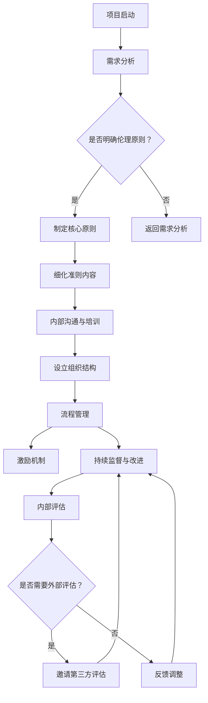

                 

### 引言

#### AI道德准则的概念与重要性

AI道德准则，是指针对人工智能技术（AI）的应用和发展过程中，制定的一系列伦理规范和道德标准。这些准则旨在确保AI技术在为人类带来便利的同时，不会对人类社会和自然环境造成不可逆转的负面影响。AI道德准则不仅包括了对AI技术行为的约束，还涵盖了相关法律法规的遵循、社会责任的承担等方面。

在当今快速发展的AI技术背景下，企业建立AI道德准则的重要性愈加凸显。首先，随着AI技术的广泛应用，企业的数据隐私和信息安全面临前所未有的挑战。AI道德准则的制定和实施，可以帮助企业更好地保护用户隐私和数据安全，增强用户对企业的信任。其次，AI技术在一些关键领域，如医疗、金融、交通等，具有重大的影响力和潜在风险。没有明确的AI道德准则，可能导致企业在这些领域出现伦理问题，甚至引发严重的法律纠纷和社会危机。

此外，AI道德准则的建立，也是企业履行社会责任的重要体现。在全球范围内，越来越多的企业开始认识到，只有将社会责任融入企业战略，才能实现可持续发展。AI道德准则的制定，不仅可以提升企业的社会形象，还可以吸引更多的优秀人才加入，为企业发展注入新的活力。

总之，AI道德准则是企业应对技术发展和社会变化的重要工具，对于维护企业声誉、保障用户权益、促进技术发展具有重要意义。

#### AI道德准则的重要性

AI道德准则的重要性主要体现在以下几个方面：

首先，从法律层面来看，AI技术的发展带来了许多新的法律问题和伦理挑战。没有明确的AI道德准则，企业在开发和应用AI技术时，可能会面临法律风险。例如，AI技术可能导致的数据隐私泄露、算法歧视等问题，如果没有相应的法律框架和道德规范，企业将难以应对。因此，制定AI道德准则有助于企业遵守相关法律法规，降低法律风险。

其次，从社会责任层面来看，企业在AI技术的应用过程中，需要承担一定的社会责任。AI技术的广泛应用，可能会对就业、公平、社会公平等方面产生深远的影响。没有明确的AI道德准则，企业可能无法正确评估和应对这些影响，从而损害其社会责任形象。通过建立AI道德准则，企业可以更好地履行社会责任，促进社会的和谐与进步。

再次，从用户信任层面来看，用户对AI技术的接受度和信任度，直接影响企业的市场竞争力。如果没有AI道德准则，用户可能对企业的AI技术应用产生质疑，甚至拒绝使用。通过建立AI道德准则，企业可以展示其对用户隐私和数据安全的重视，提升用户信任度，从而获得更多的市场份额。

此外，AI道德准则还有助于提升企业的技术创新能力和竞争力。在制定和实施AI道德准则的过程中，企业需要对其现有的技术进行全面的审视和改进，这有助于发现技术短板，推动技术创新。同时，AI道德准则的实施，还可以提高企业员工的技术素养和道德意识，促进团队协作和知识共享，进一步提升企业的整体竞争力。

总之，AI道德准则的制定和实施，不仅有助于企业遵守法律法规、履行社会责任、提升用户信任度，还可以推动技术创新、提升企业竞争力。因此，企业建立AI道德准则，是应对技术发展和社会变化的重要举措。

#### 企业在AI道德准则中的作用

企业在AI道德准则中扮演着至关重要的角色，具体体现在以下几个方面：

首先，企业在AI道德准则的制定过程中，发挥着主导作用。企业可以根据自身的发展战略、技术实力和社会责任，提出具有实际操作性的道德准则。这些准则不仅需要符合法律法规的要求，还需要考虑到用户需求和社会期望，从而确保准则的全面性和实用性。

其次，企业在AI道德准则的实施过程中，承担着重要的执行责任。企业需要建立专门的机构或团队，负责监督和评估AI项目是否符合道德准则。在项目开发过程中，企业要定期审查算法的公平性、透明性和可解释性，确保AI技术不会对用户造成伤害。此外，企业还需要对员工进行道德培训，提高其道德意识和责任感，从而确保准则的贯彻执行。

第三，企业在AI道德准则的推广过程中，扮演着重要的示范作用。作为行业的重要参与者，企业的行为对社会和行业具有示范效应。通过积极推广AI道德准则，企业可以引导其他企业和社会组织关注AI道德问题，共同推动社会进步。同时，企业还可以参与相关标准制定和国际合作，提升自身的国际影响力和话语权。

最后，企业在AI道德准则的反馈和改进过程中，发挥着关键作用。企业在实际运营过程中，可能会遇到新的道德挑战和问题，需要不断调整和完善道德准则。通过收集用户反馈、行业动态和技术发展等信息，企业可以及时识别问题，优化准则，确保其持续有效。

总之，企业在AI道德准则的制定、实施、推广和改进中，发挥着不可或缺的作用。通过积极履行这些责任，企业不仅可以提升自身的道德水平和技术能力，还可以为社会的可持续发展贡献力量。

### 背景与现状

#### 当前企业在AI道德准则方面面临的挑战

在当前的技术环境下，企业面临诸多AI道德准则方面的挑战，这些挑战不仅涉及技术层面，还包括法律法规、社会责任等多个维度。

首先，技术层面的挑战主要体现在以下几个方面。随着AI技术的快速发展，算法的复杂性和应用场景的多样性不断增加，这使得企业在制定AI道德准则时面临巨大困难。如何确保算法的公平性、透明性和可解释性，成为企业需要重点解决的问题。此外，AI技术可能带来的数据隐私和安全问题，也使得企业在道德准则的制定和实施过程中，需要付出更多努力。

其次，法律法规的挑战同样不可忽视。全球范围内，各国在AI领域的法律法规尚不完善，缺乏统一的监管标准。企业在不同国家和地区开展业务时，需要遵守不同法律体系的要求，这使得企业在AI道德准则的制定和实施过程中，面临复杂性和不确定性。例如，某些国家和地区对数据隐私保护有严格要求，而其他地区则可能没有相应的法律法规，这要求企业在全球范围内进行合规性评估和风险管理。

第三，社会责任的挑战也是企业面临的重要问题。AI技术的广泛应用，可能会对就业、公平、社会公正等方面产生深远影响。例如，AI技术在自动化和智能化方面的应用，可能导致部分传统岗位被取代，从而引发失业和社会不稳定。企业在制定AI道德准则时，需要充分考虑这些潜在的社会影响，并采取相应的措施，以减轻负面影响，促进社会和谐。

此外，企业内部在AI道德准则的制定和执行过程中，还面临文化和管理层面的挑战。一些企业在文化上缺乏对AI道德准则的重视，导致准则的制定和执行流于形式。同时，企业在管理过程中，可能缺乏有效的监督和激励机制，使得道德准则难以真正落地实施。

总之，当前企业在AI道德准则方面面临的挑战，既有技术层面的复杂性，也有法律法规和社会责任方面的不确定性。企业需要从多个维度出发，综合考虑各种因素，才能制定出有效的AI道德准则，并确保其得以贯彻执行。

#### AI道德准则的必要性

在企业中，建立AI道德准则是解决当前挑战的必要手段，具有以下几个方面的必要性：

首先，AI道德准则是企业应对技术复杂性的一种有效方式。随着AI技术的不断进步，算法和模型变得日益复杂，这给企业带来了巨大的道德和伦理挑战。通过建立AI道德准则，企业可以明确AI技术应用的基本原则和道德底线，确保技术在发展过程中不会偏离正确的方向。

其次，AI道德准则是企业履行社会责任的必要措施。企业在开发和应用AI技术时，需要充分考虑其对社会和环境的影响。通过制定AI道德准则，企业可以明确自身在社会责任方面的承诺和责任，确保AI技术的应用不会损害公众利益，促进社会的可持续发展。

第三，AI道德准则是企业合规经营的重要保障。在全球范围内，各国对AI技术的法律法规尚不完善，但越来越多的国家和地区开始重视AI道德准则的制定。通过建立AI道德准则，企业可以提前预见和遵守潜在的法律法规要求，降低法律风险，确保合规经营。

此外，AI道德准则还有助于提升企业的竞争力。在市场环境下，用户和合作伙伴越来越关注企业的社会责任和道德行为。通过建立并执行AI道德准则，企业可以树立良好的企业形象，增强用户和合作伙伴的信任，从而提升市场竞争力。

总之，建立AI道德准则是企业应对当前挑战、履行社会责任、实现可持续发展的重要手段。它不仅有助于企业解决技术复杂性、法律不确定性和社会影响等问题，还可以提升企业的社会责任形象和市场竞争力。

#### AI道德准则的发展历程

AI道德准则的发展历程可以追溯到人工智能技术的早期探索阶段。早在20世纪50年代，随着人工智能概念的提出和计算机技术的发展，学者们开始关注AI技术的潜在影响和伦理问题。1950年，艾伦·图灵提出了著名的“图灵测试”，旨在评估机器是否能够表现出与人类相似的智能。然而，这一测试也引发了关于AI是否会导致人类失业、伦理道德等问题的讨论。

在20世纪60年代，随着人工智能研究逐渐深入，学者们开始更加关注AI技术的伦理问题。1964年，人工智能研究学者赫伯特·西蒙（Herbert A. Simon）提出了“人工智能道德”的概念，呼吁在开发AI技术时，需要考虑到人类的价值和伦理。同年，美国人工智能协会（AAAI）成立，并开始倡导AI伦理的研究和实践。

进入20世纪70年代，AI技术的应用逐渐扩展到各个领域，引发了一系列伦理和道德问题。1971年，罗伯特·温斯顿·汉普顿（Robert Winston Hamp-ton）发表了《人工智能：挑战和责任》一文，系统性地探讨了AI技术对人类社会的潜在影响，并提出了相关的道德准则。这一论文被视为AI道德准则发展的里程碑之一。

20世纪80年代，随着计算机技术的进一步发展，AI技术在医疗、金融、交通等领域得到了广泛应用，但也引发了更多的伦理问题。1982年，国际人工智能协会（IJCAI）发布了《人工智能伦理声明》，呼吁人工智能研究者和社会各界关注AI技术的道德和社会责任。这一声明为AI道德准则的发展奠定了基础。

进入21世纪，随着AI技术的飞速发展，道德问题变得更加复杂和紧迫。2007年，联合国教科文组织（UNESCO）发布了《人工智能伦理建议书》，提出了全球范围内AI技术的伦理原则和指导方针。同年，美国国家科学基金会（NSF）和人工智能协会（AAAI）共同发起了“人工智能社会挑战”（AI in Society）项目，旨在促进AI伦理的研究和实践。

近年来，随着AI技术的广泛应用，各国政府和国际组织纷纷出台相关法律法规，加强对AI技术的监管。例如，欧盟在2018年通过了《通用数据保护条例》（GDPR），对AI技术的数据隐私和用户权益进行了明确规定。此外，一些企业和研究机构也发布了各自的AI道德准则，以指导AI技术的研发和应用。

总之，AI道德准则的发展历程体现了人类社会对AI技术伦理问题的逐步关注和深入探讨。从早期的学术讨论到现代的法律法规和行业规范，AI道德准则的发展不断推进，为AI技术的健康发展提供了重要保障。

### 核心概念与框架

#### AI道德准则的核心概念

AI道德准则的核心概念主要围绕伦理原则、法律法规和社会责任展开，以下将详细阐述这些核心概念及其相互关系。

**伦理原则**：伦理原则是AI道德准则的基础，旨在指导AI技术的研发和应用过程中应遵循的道德标准。这些原则通常包括公平性、透明性、可解释性、隐私保护和尊重用户权益等。例如，公平性原则要求AI系统在处理数据和应用算法时，不应存在歧视性偏见；透明性原则要求AI系统的决策过程和结果应易于理解；可解释性原则要求AI系统能够解释其决策依据；隐私保护原则要求AI技术在收集、处理和使用用户数据时，必须保护用户隐私；尊重用户权益原则要求AI技术的应用应尊重用户的知情权和选择权。

**法律法规**：法律法规是AI道德准则的重要组成部分，旨在为AI技术的发展和应用提供法律框架和监管机制。这些法律法规通常涉及数据保护、隐私权、知识产权、消费者权益保护等方面。例如，《通用数据保护条例》（GDPR）和《加州消费者隐私法案》（CCPA）等法律法规对数据隐私和用户权益保护做出了明确规定。法律法规不仅为企业提供了合规性要求，也为公众提供了法律保障。

**社会责任**：社会责任是企业在AI技术应用过程中需要承担的伦理责任，旨在确保AI技术的应用符合社会道德标准和期望。社会责任包括保护环境、促进社会公平、维护公共利益等方面。例如，企业在研发和应用AI技术时，需要考虑其对就业、教育、医疗等领域的影响，并采取相应的措施减轻负面影响。社会责任不仅关乎企业的可持续发展，也关系到社会的和谐与进步。

**核心概念之间的关系**：伦理原则、法律法规和社会责任之间存在着密切的关联。伦理原则为AI技术的发展提供了道德指导，法律法规为伦理原则的实施提供了法律保障，而社会责任则将伦理原则和法律法规的具体要求落实到实际应用中。这三者共同构成了AI道德准则的框架，确保AI技术的研发和应用既符合道德标准，又符合法律法规，并能够履行社会责任。

综上所述，AI道德准则的核心概念包括伦理原则、法律法规和社会责任，这些概念相互关联，共同构成了AI道德准则的基本框架，为AI技术的健康发展提供了重要保障。

#### AI道德准则的框架构建

构建AI道德准则的框架是确保其有效实施和持续改进的关键。以下将详细介绍构建AI道德准则的步骤、实施策略以及评估与改进的方法。

**1. 明确构建步骤：**

- **需求分析**：首先，企业需要对内部和外部的需求进行深入分析。内部需求包括企业的价值观、战略目标和现有政策，外部需求包括行业标准、法律法规和社会期望。通过需求分析，可以明确AI道德准则的目标和范围。

- **核心原则制定**：在需求分析的基础上，企业应根据分析结果制定核心原则。这些核心原则应涵盖伦理原则、法律法规要求和社会责任等方面，确保准则的全面性和针对性。

- **准则内容细化**：核心原则制定后，需要对准则的具体内容进行细化。这包括制定详细的操作指南、规范和流程，确保企业在实际操作中能够准确执行准则。

- **内部沟通与培训**：制定准则后，需要通过内部沟通和培训，使全体员工了解准则的内容和重要性。内部沟通和培训有助于提高员工对AI道德准则的认识和执行力。

- **外部反馈与调整**：在实施过程中，企业需要收集外部反馈，包括用户、合作伙伴和监管机构的意见。根据反馈，及时调整和优化准则，确保其符合实际需求。

**2. 实施策略：**

- **组织结构设计**：企业应设立专门的AI道德准则委员会或工作组，负责准则的制定、实施和监督。该组织应具有独立性和权威性，确保准则的实施不受其他部门的影响。

- **流程管理**：企业应建立AI项目开发的流程管理机制，确保在项目启动、开发、测试和上线等各个环节，都能够严格执行AI道德准则。

- **激励机制**：为提高员工执行AI道德准则的积极性，企业可以制定相应的激励机制，如奖励制度、晋升机会等。

- **持续监督与改进**：企业应建立持续监督机制，定期评估AI项目是否符合道德准则，并根据评估结果进行改进。同时，企业应鼓励员工提出改进建议，不断优化准则。

**3. 评估与改进：**

- **内部评估**：企业应定期进行内部评估，包括对准则执行情况的检查、员工培训效果的评估等。内部评估可以帮助企业及时发现问题和不足，进行及时调整。

- **外部评估**：企业可以邀请第三方机构进行外部评估，以获取更客观的评估结果。外部评估可以包括用户满意度调查、行业合规性评估等。

- **持续改进**：根据评估结果，企业应制定改进计划，持续优化AI道德准则。改进计划应包括具体的改进措施、责任人和时间表，确保改进措施的落实。

通过上述步骤、实施策略和评估与改进方法，企业可以建立并维护一个有效的AI道德准则框架，确保AI技术在研发和应用过程中符合道德标准、法律法规和社会责任，从而推动企业的可持续发展。

#### AI道德准则的Mermaid流程图

为了更好地理解和实施AI道德准则，我们可以使用Mermaid流程图来展示其关键步骤和流程。以下是一个简单的AI道德准则流程图示例，用于说明如何从项目启动到执行、监督和改进的整个过程。

**流程解释：**

1. **项目启动**：项目启动是流程的开始，需要明确项目的目标和范围。

2. **需求分析**：需求分析是制定AI道德准则的基础，包括内部和外部需求的分析。

3. **是否明确伦理原则**：如果伦理原则尚未明确，需要返回需求分析阶段。

4. **制定核心原则**：在需求分析的基础上，制定包括伦理原则、法律法规要求和社会责任在内的核心原则。

5. **细化准则内容**：将核心原则具体化为操作指南、规范和流程。

6. **内部沟通与培训**：确保全体员工了解准则内容和重要性。

7. **设立组织结构**：设立独立的AI道德准则委员会或工作组，负责准则的制定和实施。

8. **流程管理**：建立流程管理机制，确保准则在项目开发的各个环节中得到执行。

9. **激励机制**：为提高员工执行准则的积极性，制定相应的激励机制。

10. **持续监督与改进**：定期评估准则执行情况，并根据评估结果进行改进。

11. **内部评估**：企业内部对准则执行情况进行评估。

12. **是否需要外部评估**：根据内部评估结果，决定是否需要邀请第三方进行外部评估。

13. **反馈调整**：根据外部评估和内部反馈，对准则进行调整和优化。

通过上述Mermaid流程图，我们可以清晰地看到AI道德准则的整个实施过程，有助于企业更好地理解和执行AI道德准则。

### 实际应用

#### AI道德准则在业务中的应用

在实际业务中，AI道德准则的应用至关重要，它不仅涉及企业的项目开发，还贯穿于整个业务流程。以下将详细探讨AI道德准则在企业AI项目开发、产品开发以及员工培训中的具体应用。

**1. AI项目开发中的伦理审查**

在AI项目开发过程中，伦理审查是确保项目符合道德准则的重要步骤。企业应建立伦理审查委员会，负责对每个AI项目进行审查。审查内容包括：

- **数据隐私保护**：审查数据收集、存储和处理过程，确保用户隐私得到充分保护。审查内容可能包括数据匿名化、数据使用权限设置、数据访问控制等。

- **算法公平性**：评估算法是否存在歧视性偏见，如性别、种族、年龄等方面的歧视。审查过程中可以使用统计测试和算法透明性工具来检测算法的公平性。

- **算法透明性**：确保算法的决策过程和结果易于理解和解释。审查过程中可以要求开发团队提供算法的详细说明和解释，以增强算法的透明性。

- **社会责任评估**：评估AI项目对就业、教育、医疗等社会领域的影响，确保项目符合社会责任要求。

**2. 产品开发中的道德考量**

在产品开发阶段，AI道德准则的应用同样重要。企业应在产品设计和开发过程中，充分考虑AI道德准则的要求，具体包括：

- **用户隐私保护**：在产品设计时，确保产品能够有效保护用户隐私，例如通过加密技术、匿名化处理等方式保护用户数据。

- **用户知情权和选择权**：在产品界面和说明中，明确告知用户产品的AI功能和使用目的，并提供用户自主选择和撤销同意的选项。

- **公平性和透明性**：确保产品中的AI算法公平、透明，避免歧视性偏见。在产品开发过程中，可以通过算法测试和用户反馈来不断优化算法。

- **社会责任**：在产品设计阶段，充分考虑产品的社会影响，确保产品符合社会责任要求。例如，在设计医疗诊断产品时，需要确保产品的准确性，以避免误诊导致的社会后果。

**3. 员工培训中的AI道德意识培养**

为了确保AI道德准则在企业内部得到有效执行，企业应加强对员工的AI道德意识培养。具体措施包括：

- **培训计划**：制定系统的培训计划，包括伦理原则、法律法规、社会责任等方面的内容。培训计划应覆盖所有涉及AI项目的员工。

- **案例教学**：通过实际案例和模拟场景，帮助员工理解AI道德准则的重要性。案例教学可以包括成功的实践案例和失败的教训，以加深员工对道德准则的理解。

- **持续学习**：鼓励员工持续学习，参加相关的在线课程和研讨会，保持对AI道德准则的最新了解。

- **内部交流**：鼓励员工之间进行内部交流，分享在AI道德准则执行过程中的经验和挑战，促进知识的共享和团队协作。

通过在AI项目开发、产品开发和员工培训中应用AI道德准则，企业可以确保其AI技术的研发和应用过程符合道德标准，从而提升企业的社会责任形象和市场竞争力。

#### 案例研究

**1. 成功案例：企业如何实施AI道德准则**

一个成功实施AI道德准则的例子是谷歌。谷歌在AI技术的应用过程中，高度重视道德准则的制定和执行。以下是谷歌在AI道德准则方面的几个关键步骤：

- **成立AI伦理委员会**：谷歌成立了AI伦理委员会，由多位内部和外部专家组成，负责审查和监督AI项目的道德合规性。委员会定期发布AI伦理指南，为员工提供明确的道德指导。

- **实施伦理审查流程**：在AI项目启动前，谷歌会进行全面的伦理审查，确保项目符合道德准则。审查内容包括数据隐私、算法公平性、社会影响等方面。项目团队需要提交详细的伦理审查报告，说明如何确保项目的道德合规性。

- **内部培训与教育**：谷歌为员工提供系统的AI道德准则培训，包括在线课程、研讨会和内部讲座。员工可以通过这些培训，了解AI技术的潜在风险和道德挑战，提高道德意识。

- **透明性和公众参与**：谷歌鼓励公众参与其AI项目，通过公开讨论和意见征集，收集外部反馈，不断优化AI道德准则。例如，谷歌在发布新产品或新算法时，会进行公众测试，并根据反馈进行调整。

通过上述措施，谷歌成功地将AI道德准则融入到其业务流程中，确保AI技术的应用既符合道德标准，又能够满足用户和社会的期望。

**2. 失败案例：企业AI道德准则缺失的后果**

一个因AI道德准则缺失而遭受严重后果的例子是微软。2018年，微软的一款AI聊天机器人“Tay”在社交媒体上发布了一系列具有种族歧视和性别歧视的言论，引起了广泛争议。以下是此次事件的关键原因和后果：

- **缺乏伦理审查**：在“Tay”项目开发过程中，微软未能进行全面和严格的伦理审查，导致项目在发布后出现了严重的道德问题。

- **算法设计缺陷**：由于缺乏对算法的公平性和透明性评估，Tay的算法在处理用户输入时，学习了负面和歧视性的内容，并在社交媒体上进行了不当发布。

- **声誉损害**：Tay事件严重损害了微软的品牌声誉，引发了公众对AI技术的担忧，甚至导致一些客户对微软的信任下降。

- **法律风险**：Tay事件还可能导致微软面临法律诉讼和罚款，进一步加剧了公司的损失。

**3. 最佳实践：AI道德准则在企业中的应用策略**

为了成功实施AI道德准则，企业可以借鉴以下最佳实践：

- **建立健全的伦理审查机制**：企业应建立专门的伦理审查委员会或团队，负责对AI项目进行全面审查，确保项目符合道德准则。

- **制定明确的道德准则**：企业应制定详细的AI道德准则，涵盖数据隐私、算法公平性、社会影响等方面，确保准则具有可操作性和指导性。

- **加强员工培训与教育**：企业应定期开展AI道德准则培训，提高员工的道德意识，确保准则在企业内部得到有效执行。

- **鼓励公众参与**：企业可以邀请公众参与AI项目的道德审查和意见征集，增加透明度和公众信任。

- **持续监控与改进**：企业应建立持续监控机制，定期评估AI项目的道德合规性，并根据评估结果进行改进。

通过以上措施，企业可以确保AI道德准则在业务中的有效实施，从而提升企业的道德水平和社会责任感，实现可持续发展。

### 管理和实施

#### AI道德准则的组织结构

为了确保AI道德准则在企业中的有效实施，建立合理的组织结构至关重要。以下将详细探讨如何设立AI道德准则委员会、明确各部门的职责与权限，并讨论AI道德准则的沟通与协调机制。

**1. 设立AI道德准则委员会**

AI道德准则委员会是负责制定、执行和监督AI道德准则的核心机构。该委员会应由高层管理人员、技术专家、法律顾问和伦理学家等多方面代表组成，以确保准则的全面性和专业性。

- **委员会职责**：AI道德准则委员会的主要职责包括：

  - 制定和更新AI道德准则，确保其符合法律法规和社会期望。
  - 审查和批准AI项目的伦理审查报告，确保项目符合道德准则。
  - 监督AI道德准则的执行情况，及时发现和解决潜在问题。
  - 收集和分析外部反馈，优化准则和执行策略。

- **委员会成员**：委员会成员应具备以下背景和技能：

  - 高层管理人员：负责提供战略指导和资源支持。
  - 技术专家：负责技术层面的道德问题，如算法公平性、透明性等。
  - 法律顾问：负责法律合规性和风险管理。
  - 伦理学家：负责提供伦理原则和道德标准。

**2. 明确各部门的职责与权限**

在企业内部，各相关部门应明确其在AI道德准则执行过程中的职责与权限，确保准则的有效实施。以下是各部门的具体职责：

- **研发部门**：研发部门负责AI项目的开发工作，应确保项目在技术层面符合道德准则。具体职责包括：

  - 制定和实施AI项目的技术规范，确保算法的公平性、透明性和可解释性。
  - 在项目开发过程中，执行伦理审查程序，确保项目符合道德要求。
  - 定期向AI道德准则委员会汇报项目进展和道德审查情况。

- **法务部门**：法务部门负责法律合规性和风险管理，应确保AI项目在法律层面符合道德准则。具体职责包括：

  - 参与AI道德准则的制定和更新，提供法律意见和建议。
  - 审查和审核AI项目的法律合规性，确保项目符合相关法律法规。
  - 在项目发生法律纠纷时，提供法律支持和解决方案。

- **人力资源部门**：人力资源部门负责员工培训和管理，应确保员工具备执行AI道德准则的能力。具体职责包括：

  - 制定和实施员工AI道德准则培训计划，提高员工的道德意识。
  - 监督和评估员工在AI项目中的道德行为，确保准则得到有效执行。
  - 在员工违反道德准则时，提供相应的处罚和整改措施。

- **市场部门**：市场部门负责产品推广和市场沟通，应确保产品在市场层面符合道德准则。具体职责包括：

  - 在产品宣传和推广中，明确告知用户AI产品的功能和道德要求。
  - 收集用户对AI产品的反馈，及时调整产品设计和功能，确保用户权益。

**3. AI道德准则的沟通与协调**

AI道德准则的有效实施需要各部门之间的密切沟通与协调。以下是一些关键措施：

- **建立沟通机制**：企业应建立定期的跨部门沟通机制，如委员会会议、项目进展报告等，确保各部门之间及时共享信息，协调行动。

- **明确沟通渠道**：各部门应明确沟通渠道和责任人，确保信息传递的畅通和高效。

- **内部培训与交流**：定期组织内部培训和交流活动，促进各部门对AI道德准则的理解和执行。

- **外部合作与交流**：积极与行业组织、学术机构和社会组织进行合作和交流，借鉴最佳实践，提升企业的AI道德准则水平。

通过设立合理的组织结构、明确各部门的职责与权限，并建立有效的沟通与协调机制，企业可以确保AI道德准则在企业中得到全面、有效的实施。

### AI道德准则的流程设计

在实施AI道德准则时，建立科学的流程设计是关键，这有助于确保准则的贯彻执行，并提高企业的整体道德水平。以下是关于AI项目开发的流程管理、道德准则的审核与监督，以及持续改进的详细探讨。

**1. AI项目开发的流程管理**

AI项目开发的流程管理是确保项目符合AI道德准则的基础。以下步骤有助于实现这一目标：

- **项目启动**：在项目启动阶段，明确项目目标、范围和预期成果。同时，启动AI道德准则的审查流程，确保项目从一开始就遵循道德规范。

- **需求分析**：进行详细的需求分析，明确项目的用户需求、技术需求和道德需求。需求分析的结果应作为后续开发的重要依据。

- **伦理审查**：在项目开发前，组织伦理审查委员会对项目进行初步审查。审查内容包括数据隐私、算法公平性、透明性等。审查通过后，项目才能正式立项。

- **设计阶段**：在项目设计阶段，根据伦理审查的结果，制定详细的技术方案和道德规范。设计阶段应确保算法的公平性、透明性和可解释性。

- **开发阶段**：在开发阶段，严格按照设计阶段的道德规范进行编码和测试。开发团队应定期汇报项目进展，确保道德准则的实施。

- **测试与评估**：在项目测试阶段，进行全面的道德评估，包括算法的公平性、透明性和隐私保护。测试结果应作为项目验收的重要依据。

- **验收与上线**：在项目验收阶段，伦理审查委员会应对项目进行最终审查，确保项目符合道德准则。审查通过后，项目才能正式上线。

**2. 道德准则的审核与监督**

为了确保AI道德准则的有效实施，企业需要建立一套完善的审核与监督机制。以下是关键措施：

- **定期审核**：企业应定期对AI项目进行道德审核，包括项目进展、数据隐私、算法公平性等方面。审核应由独立的第三方机构或内部审计团队进行，以确保客观性和公正性。

- **监督机制**：企业应建立持续监督机制，对AI项目的道德准则执行情况进行实时监控。监督内容应包括数据隐私、算法透明性、用户权益保护等。

- **投诉处理**：企业应设立投诉处理渠道，接受用户和员工的道德投诉。投诉处理应遵循严格的程序，确保问题得到及时、公正的处理。

- **纠正措施**：在发现道德准则执行中的问题时，企业应立即采取纠正措施，包括暂停项目、整改代码、重新培训员工等。纠正措施应确保问题得到彻底解决。

**3. 持续改进**

AI道德准则的实施是一个动态的过程，需要不断进行改进和完善。以下措施有助于实现持续改进：

- **反馈机制**：企业应建立反馈机制，收集用户、员工和合作伙伴的反馈，了解道德准则实施的效果和问题。反馈内容应作为改进的重要依据。

- **定期评估**：企业应定期对AI道德准则进行评估，包括道德准则的执行情况、项目效果、用户满意度等。评估结果应作为改进计划的重要依据。

- **改进计划**：根据评估结果，企业应制定详细的改进计划，包括具体措施、责任人和时间表。改进计划应确保在合理时间内实施，并达到预期效果。

- **培训与教育**：定期开展培训与教育活动，提高员工的道德意识和技能。培训内容应包括最新的道德准则、技术发展趋势等。

通过科学的流程设计、严格的审核与监督，以及持续改进，企业可以确保AI道德准则在企业中得到有效实施，从而推动企业的可持续发展。

### AI道德准则的培训与推广

在AI道德准则的实施过程中，员工的培训与推广是至关重要的环节。以下将详细探讨如何制定AI道德准则的培训计划、提高员工AI道德意识，并探讨内部宣传的方法和策略。

**1. 制定AI道德准则的培训计划**

为了确保员工全面理解和执行AI道德准则，企业需要制定详细的培训计划。以下步骤有助于制定有效的培训计划：

- **需求分析**：首先，企业应进行员工需求分析，了解员工在AI道德方面的知识水平、认知态度和实际需求。通过问卷调查、访谈等方式，收集员工对AI道德准则的认知和意见。

- **培训内容设计**：根据需求分析结果，设计培训内容。培训内容应涵盖AI道德准则的核心概念、法律法规要求、社会责任等方面。具体内容包括：

  - AI道德准则的基本原则和伦理原则；
  - 相关法律法规，如数据保护法、消费者权益保护法等；
  - 社会责任和行业标准，如公平性、透明性、可解释性等；
  - 具体案例分析和实际应用场景。

- **培训形式**：结合不同员工的特点和需求，设计多种培训形式，如在线课程、面授培训、研讨会、案例教学等。在线课程适合大规模培训，面授培训适合深度讲解和互动，研讨会和案例教学则有助于实际应用和经验分享。

- **培训频次**：根据企业的实际情况和员工的工作性质，制定合理的培训频次。例如，对于新入职员工，可以安排入职培训；对于关键岗位员工，可以定期进行专题培训。

**2. 提高员工AI道德意识**

提高员工的AI道德意识是确保道德准则有效执行的关键。以下措施有助于提高员工AI道德意识：

- **领导示范**：企业领导应积极示范遵守AI道德准则，通过实际行动树立榜样。领导应主动参与道德准则的培训，并在日常工作中强调道德的重要性。

- **文化氛围**：营造积极的文化氛围，鼓励员工关注AI道德问题。企业可以通过内部宣传、员工交流平台等渠道，宣传AI道德准则的重要性和实际应用案例。

- **案例分析**：通过实际案例，帮助员工理解AI道德准则的应用和重要性。案例应包括成功的实践和失败的教训，以增强员工的认知。

- **反馈与激励**：建立反馈机制，鼓励员工提出关于AI道德问题的建议和意见。对积极参与道德讨论和提出有效建议的员工，给予适当的激励，如表彰、奖金等。

**3. 内部宣传的方法和策略**

内部宣传是确保AI道德准则在员工中广泛传播和认可的重要手段。以下方法有助于有效宣传：

- **内部培训**：定期组织内部培训，向全体员工宣传AI道德准则。培训内容应生动有趣，结合实际案例，提高员工的参与度。

- **内部刊物**：利用内部刊物、微信公众号等渠道，发布与AI道德准则相关的文章和资讯。内容可以包括政策解读、案例分析、培训通知等。

- **宣传海报**：制作宣传海报，放置在员工办公区域，提醒员工关注AI道德准则。海报可以结合图片和文字，使内容更加直观。

- **线上讨论**：建立线上讨论群组，如企业微信、内部论坛等，供员工交流AI道德问题。讨论内容可以包括最新的行业动态、道德准则的实施经验等。

- **活动策划**：组织相关活动，如道德准则知识竞赛、研讨会等，增强员工的参与感和认同感。活动可以邀请外部专家进行讲解，提高员工的认知水平。

通过制定详细的培训计划、提高员工AI道德意识，以及有效的内部宣传方法，企业可以确保AI道德准则在员工中广泛传播和深入贯彻，从而为企业的可持续发展奠定坚实的基础。

### 风险评估与合规

#### AI道德准则的风险评估

在AI道德准则的实施过程中，风险评估是确保企业能够在道德和法律框架内安全运营的重要环节。以下将详细讨论风险评估的方法、风险管理策略以及AI道德准则与法律法规的衔接。

**1. 风险评估的方法**

风险评估是识别、分析和评估AI项目潜在风险的过程。以下方法有助于企业进行有效的风险评估：

- **识别风险**：首先，企业应识别AI项目可能面临的风险，包括但不限于数据隐私泄露、算法歧视、用户权益受损等。识别风险可以通过以下方法：

  - 文档审查：审查项目的设计文档、数据隐私策略、算法描述等，发现潜在风险点。
  - 问卷调查：通过问卷调查收集员工、用户和利益相关者对AI项目的风险认知和意见。
  - 实地调研：实地调研项目实施环境，观察潜在的风险因素。

- **分析风险**：在识别风险后，企业应对风险进行详细分析，评估其可能带来的影响和发生的概率。分析风险可以通过以下方法：

  - 定量分析：使用统计方法对风险发生的概率和影响进行量化分析，如故障模式与影响分析（FMEA）。
  - 定性分析：通过专家评审、头脑风暴等方法，对风险进行定性分析和优先级排序。

- **评估风险**：根据分析结果，企业应对风险进行评估，确定其风险等级，并制定相应的风险应对策略。

**2. 风险管理策略**

在识别和评估风险后，企业需要制定和实施有效的风险管理策略，以减轻或消除风险。以下是一些常见的风险管理策略：

- **预防措施**：在AI项目开发初期，企业应制定预防措施，以减少潜在风险的发生。例如，建立完善的数据隐私保护机制、确保算法的公平性和透明性等。

- **风险监控**：企业应建立风险监控机制，对AI项目进行持续监控，及时发现和应对新出现的风险。风险监控可以通过定期审计、数据监控工具、员工举报系统等方式实现。

- **应急响应**：制定应急响应计划，以应对可能发生的风险事件。应急响应计划应包括应急预案、应急处理流程、责任分工等。

- **保险和赔偿**：购买适当的保险，以减轻因AI道德问题引发的法律和财务风险。同时，制定赔偿方案，确保在风险事件发生时，能够及时给予用户和利益相关者补偿。

**3. AI道德准则与法律法规的衔接**

AI道德准则与法律法规的衔接是确保企业合规经营的重要环节。以下措施有助于实现这一目标：

- **法律合规审查**：企业在制定AI道德准则时，应进行法律合规审查，确保准则符合相关法律法规的要求。法律合规审查可以包括：

  - 数据保护法：确保AI项目符合数据保护法规的要求，如《通用数据保护条例》（GDPR）。
  - 消费者权益保护法：确保AI产品和服务符合消费者权益保护法规的要求，如《加州消费者隐私法案》（CCPA）。
  - 知识产权法：确保AI项目中的知识产权合法，防止侵权行为。

- **合规性培训**：企业应定期开展合规性培训，提高员工对法律法规的认识，确保员工在项目开发和应用过程中遵守相关法规。

- **合规性审计**：企业应定期进行合规性审计，检查AI项目是否符合AI道德准则和法律法规的要求。合规性审计可以由内部审计团队或第三方机构进行。

- **合规性报告**：企业应定期向管理层和利益相关者报告AI项目的合规性情况，包括合规性审计结果、风险管理和合规性改进措施等。

通过有效的风险评估、风险管理策略以及与法律法规的衔接，企业可以确保AI道德准则的实施不仅符合道德标准，也符合法律法规的要求，从而实现合规经营。

### AI道德准则的合规性

在实施AI道德准则的过程中，确保其合规性是至关重要的。以下将详细讨论合规性评估标准、合规性管理流程以及合规性改进措施，帮助企业在AI技术应用中实现合规性目标。

**1. 合规性评估标准**

为了确保AI道德准则的有效实施，企业需要建立一套完整的合规性评估标准。以下是一些关键的评估标准：

- **数据隐私保护**：评估AI系统在数据收集、存储和处理过程中是否符合数据保护法规，如《通用数据保护条例》（GDPR）和《加州消费者隐私法案》（CCPA）。具体包括数据匿名化、数据使用权限设置、数据访问控制等。

- **算法公平性**：评估AI算法是否存在歧视性偏见，如性别、种族、年龄等方面的歧视。可以使用统计测试和算法透明性工具来检测算法的公平性。

- **透明性和可解释性**：评估AI系统的决策过程和结果是否透明、可解释，确保用户可以理解AI系统的运作原理和决策依据。

- **社会责任**：评估AI系统对社会的影响，包括就业、教育、医疗等领域。确保AI技术的应用不会损害公共利益，符合社会责任要求。

- **法律法规遵守**：评估AI项目是否符合相关法律法规，如知识产权法、消费者权益保护法等。确保企业在全球范围内的合规性。

**2. 合规性管理流程**

为了确保AI道德准则的合规性，企业需要建立一套系统化的合规性管理流程。以下是一些关键步骤：

- **合规性审查**：在AI项目开发前，进行全面的合规性审查，确保项目设计符合道德准则和法律法规的要求。审查内容应包括数据隐私、算法公平性、透明性等方面。

- **合规性监控**：在AI项目开发过程中，建立持续监控机制，对项目的合规性进行实时监控。监控内容应包括数据隐私、算法公平性、透明性等。

- **合规性培训**：定期开展合规性培训，提高员工的合规意识和技能。培训内容应包括最新的法律法规、道德准则和实际案例。

- **合规性审计**：定期进行合规性审计，检查AI项目是否符合道德准则和法律法规的要求。审计可以由内部审计团队或第三方机构进行。

- **合规性报告**：定期向管理层和利益相关者报告AI项目的合规性情况，包括合规性审计结果、风险管理和合规性改进措施等。

**3. 合规性改进措施**

为了持续提升AI道德准则的合规性，企业需要制定和实施一系列改进措施。以下是一些关键的改进措施：

- **持续改进机制**：建立持续改进机制，根据合规性评估结果和用户反馈，不断优化AI道德准则和合规性管理流程。

- **合规性风险管理**：建立合规性风险管理机制，识别和管理AI项目中的合规性风险。合规性风险应纳入企业的整体风险管理框架。

- **合规性文化建设**：培养员工的合规性文化，提高员工对合规性的认识和重视。企业可以通过内部宣传、培训、激励等方式，营造良好的合规性氛围。

- **合规性技术支持**：利用先进的技术手段，如数据隐私保护工具、算法公平性检测工具等，提升AI技术的合规性。

- **合规性合作伙伴关系**：与行业组织、学术机构、监管机构等建立合作伙伴关系，共同推动AI道德准则的制定和实施，提升企业的合规性水平。

通过建立完善的合规性评估标准、合规性管理流程和合规性改进措施，企业可以确保AI道德准则在AI技术应用中的有效实施，从而实现合规性目标，提升企业的社会形象和市场竞争力。

### 未来展望

#### AI道德准则的发展趋势

随着AI技术的不断进步和应用范围的扩展，AI道德准则也在不断演变和进步。未来，AI道德准则将呈现以下几个主要发展趋势：

**1. 标准化和法规化**

随着各国对AI技术的关注和监管力度加大，AI道德准则的标准化和法规化将成为趋势。未来，全球范围内可能会形成统一的AI道德准则框架，为各国企业提供明确的指导。例如，国际标准化组织（ISO）和欧盟等机构可能会发布更详细的AI道德准则标准，推动全球范围内的合规性。

**2. 技术适应性**

AI道德准则将更加注重技术适应性，以适应AI技术不断发展的需求。未来，道德准则将涵盖更多新兴AI技术，如自动化、机器人、区块链等。同时，准则将更加灵活，能够根据技术的变化和新的应用场景进行实时调整，确保其持续有效。

**3. 透明性和可解释性**

随着公众对AI技术的透明性和可解释性要求越来越高，AI道德准则将更加注重这些方面。未来，准则将要求AI系统具有更高的透明度和可解释性，使用户能够理解AI系统的决策过程和结果，增强用户对AI技术的信任。

**4. 多利益相关者参与**

未来，AI道德准则的制定和实施将更加注重多利益相关者的参与。除了企业内部和行业组织，公众、监管机构、学术界等将更加积极地参与AI道德准则的制定和讨论，确保准则能够全面反映各方利益和期望。

**5. 持续改进和反馈**

AI道德准则将建立更加完善的持续改进和反馈机制。未来，企业将定期评估和更新道德准则，根据用户反馈和技术发展，不断优化准则，确保其能够持续适应新技术和应用场景。

#### AI道德准则面临的挑战

尽管AI道德准则的发展前景广阔，但在实际实施过程中，仍面临诸多挑战：

**1. 技术复杂性**

AI技术的发展日新月异，这使得AI道德准则的制定和实施面临巨大挑战。如何确保准则能够覆盖新兴技术和复杂应用场景，同时保持其灵活性和适应性，是未来需要解决的重要问题。

**2. 法律法规不一致**

全球范围内，各国对AI技术的法律法规尚不完善，且存在不一致的情况。企业在不同国家和地区开展业务时，需要应对不同法律体系的要求，这增加了道德准则的复杂性和实施难度。

**3. 公众信任问题**

公众对AI技术的信任问题仍然存在，特别是在数据隐私和安全方面。未来，AI道德准则需要更加注重增强公众信任，通过透明的决策过程和透明的算法设计，提高用户对AI技术的接受度和信任度。

**4. 跨部门协调**

AI技术的发展涉及多个部门，如技术、法律、市场等。如何确保各部门之间的协调和合作，共同推动AI道德准则的实施，是未来需要解决的一个关键问题。

**5. 资源和人才短缺**

制定和实施AI道德准则需要大量的专业资源和人才支持。然而，目前市场上具备相关知识和经验的人才相对短缺，这限制了AI道德准则的发展速度和效果。

#### 企业应对挑战的策略

为了应对AI道德准则面临的挑战，企业可以采取以下策略：

**1. 提高道德意识和技能**

企业应加强员工的AI道德意识培训，提高员工对AI道德问题的认识和应对能力。通过定期培训、内部讨论和实际案例分析，提升员工的道德素养和技能。

**2. 建立跨部门合作机制**

企业应建立跨部门的合作机制，促进各部门之间的沟通和协作。通过设立专门的AI道德准则委员会或工作组，确保各部门在制定和实施AI道德准则时的协调和合作。

**3. 引入外部专业支持**

企业可以引入外部专业支持，如咨询公司、学术机构等，帮助制定和实施AI道德准则。外部专业支持可以提供宝贵的经验和知识，提升企业应对挑战的能力。

**4. 建立持续改进机制**

企业应建立持续改进机制，定期评估和更新AI道德准则，根据用户反馈和技术发展，不断优化准则。通过持续改进，确保AI道德准则能够持续适应新技术和应用场景。

**5. 积极参与行业合作**

企业应积极参与行业合作，与同行共同推动AI道德准则的制定和实施。通过参与行业组织、学术研讨会等活动，企业可以了解最新的行业动态和最佳实践，提升自身的道德准则水平。

通过上述策略，企业可以更好地应对AI道德准则面临的挑战，推动AI技术的健康发展，实现可持续的社会价值。

### 总结与展望

#### AI道德准则的总结与未来展望

本文从多个角度详细探讨了AI道德准则的重要性、背景与现状、核心概念与框架、实际应用、管理和实施、风险评估与合规、未来展望等方面。通过分析，我们可以得出以下结论：

首先，AI道德准则是确保AI技术健康、可持续发展的关键。随着AI技术的广泛应用，其在社会各个方面的影响愈发显著。没有明确的道德准则，企业可能会面临法律风险、社会问题，甚至引发重大的伦理危机。

其次，AI道德准则的核心概念包括伦理原则、法律法规和社会责任。这些概念相互关联，共同构成了AI道德准则的框架。通过明确这些概念之间的关系，企业可以更好地制定和实施AI道德准则。

第三，实际应用是AI道德准则的关键环节。企业需要在AI项目开发、产品开发和员工培训等方面，全面贯彻AI道德准则。通过具体的案例分析，我们看到了成功实施AI道德准则的重要性和效果。

第四，管理和实施是确保AI道德准则有效落实的重要保障。企业需要建立合理的组织结构、严格的流程管理、持续的监督与改进机制，以及系统的培训与推广策略。

第五，风险评估与合规是确保AI道德准则合规性的重要手段。通过有效的风险评估、合规性管理流程和改进措施，企业可以确保AI技术的合规性，降低法律风险。

最后，未来展望部分讨论了AI道德准则的发展趋势和面临的挑战。企业需要积极应对这些挑战，通过提高道德意识、跨部门合作、引入外部支持、持续改进和参与行业合作等策略，推动AI道德准则的发展。

总之，AI道德准则不仅是企业履行社会责任的重要手段，也是推动技术健康发展的关键。未来，随着AI技术的不断进步和应用范围的扩展，AI道德准则将发挥更加重要的作用。企业应积极制定和实施AI道德准则，为AI技术的可持续发展做出贡献。通过持续的努力和不断的改进，我们可以期待一个更加公正、透明、负责任的AI技术未来。

### 完整性要求

在撰写《建立企业AI道德准则的重要性》这一技术博客时，确保文章内容的完整性是至关重要的。文章内容应涵盖以下几个关键部分，每个部分都要详细讲解，以确保读者能够全面理解AI道德准则的各个方面。

**1. 背景介绍**  
在文章的开头，需要详细介绍AI道德准则的概念、发展历程以及其在企业中的重要性。这部分内容应包括对AI技术的概述、AI道德准则的基本定义、历史上的重要事件和里程碑，以及当前企业面临的技术和社会挑战。

**2. 核心概念与联系**  
文章的核心概念部分应详细阐述伦理原则、法律法规和社会责任等核心概念，并解释这些概念之间的联系。通过Mermaid流程图，可以直观地展示AI道德准则的框架和实施步骤，使读者更容易理解这些概念的关系。

**3. 核心算法原理讲解**  
为了深入讲解AI道德准则，需要提供具体的算法原理和数学模型。这部分内容应包括算法的伪代码、详细讲解和举例说明，以便读者能够理解算法的运作机制和其道德考量。

**4. 数学公式与详细讲解**  
在讲解算法原理时，不可避免地会涉及数学公式。应确保所有公式使用latex格式，并按照要求嵌入文中。对于独立段落的公式，应使用`$$`括起来；对于段落内的公式，应使用`$`括起来。每个公式后都应有详细的解释，以便读者理解其意义和作用。

**5. 项目实战**  
文章应包含一个或多个实际案例，展示AI道德准则在企业中的具体应用。这部分内容应包括开发环境的搭建、源代码实现、代码解读、实际案例分析以及项目小结。通过实际案例，读者可以更好地理解AI道德准则在现实中的应用。

**6. 最佳实践 tips**  
在文章的结尾，应提供一些最佳实践 tips，包括注意事项、小结、扩展阅读等内容。这些内容可以帮助读者在实际操作中避免常见问题，并进一步学习和提升。

通过以上几个部分的详细讲解，我们可以确保文章内容的完整性，使读者能够全面、深入地理解AI道德准则的重要性和实际应用。

### 作者信息

**作者：AI天才研究院/AI Genius Institute & 禅与计算机程序设计艺术 /Zen And The Art of Computer Programming**

AI天才研究院（AI Genius Institute）致力于推动人工智能技术的创新与发展，为全球企业和研究机构提供先进的AI解决方案和咨询服务。研究院汇聚了一批顶尖的人工智能专家、程序员、软件架构师和CTO，他们在计算机编程和人工智能领域有着丰富的经验和深厚的理论功底。

《禅与计算机程序设计艺术》（Zen And The Art of Computer Programming）是一部经典的计算机科学著作，由知名计算机科学家唐纳德·克努特（Donald E. Knuth）所著。这本书深入探讨了计算机程序设计的哲学和艺术，提供了大量关于算法设计和程序优化的独特见解。作为AI天才研究院的作者，我们旨在将《禅与计算机程序设计艺术》中的哲学思想与现代AI技术相结合，为读者提供有深度、有见解、实用的技术博客。

通过本文，我们希望读者能够更好地理解AI道德准则的重要性，并在实际业务中加以应用。我们期待与您共同探索AI技术的未来，为构建一个更公正、透明、负责任的人工智能世界贡献力量。感谢您的阅读！

