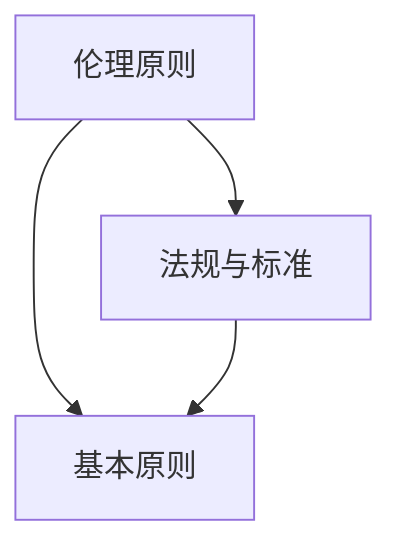
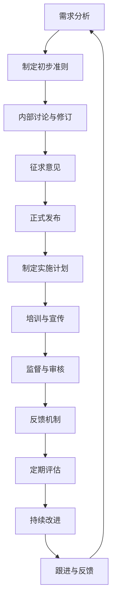
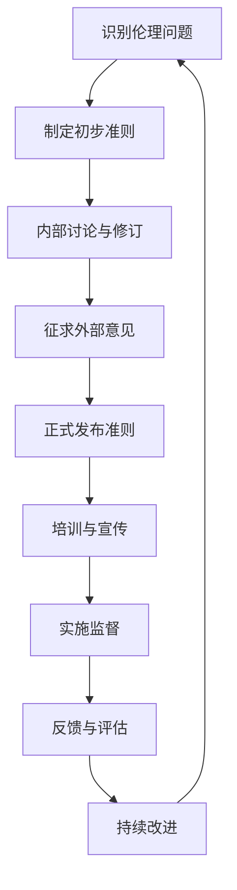

                 


### 1.1 AI道德准则的概念与重要性

#### 1.1.1 AI道德准则的定义

AI道德准则，简而言之，是指为人工智能应用设置的一系列伦理指导原则和规范。这些准则旨在确保人工智能系统在设计和应用过程中，能够最大限度地尊重和保护个人隐私、公正性和社会责任。具体来说，AI道德准则包括了对人工智能决策过程的透明度、责任归属、数据保护、公平性和非歧视性等方面的要求。

在技术层面上，AI道德准则不仅仅是一种伦理规范，它还涉及到复杂的算法设计、数据管理和法律合规等多方面内容。例如，在算法设计中，需要考虑如何减少算法偏见、提高决策的透明度和可解释性；在数据管理方面，需要确保数据的合法来源、准确性和安全性；在法律合规方面，需要遵循相关法律法规，如《通用数据保护条例》（GDPR）等。

#### 1.1.2 AI道德准则的重要性

首先，AI道德准则是维护社会公共利益的基础。随着人工智能技术的迅猛发展，其在各个领域中的应用越来越广泛，如医疗、金融、交通等。然而，如果没有严格的道德准则来指导，人工智能系统可能会对个人隐私、社会公正产生负面影响，甚至可能威胁到社会的稳定和安全。

其次，AI道德准则是企业社会责任的体现。在商业竞争中，企业不仅需要关注利润，还应该承担起社会责任。通过建立AI道德准则，企业能够确保其人工智能产品的设计和应用符合社会伦理标准，从而提高公众对其信任度，增强企业的品牌形象。

此外，AI道德准则是推动技术进步的催化剂。在技术发展过程中，一些潜在的问题和挑战可能会被忽视。通过AI道德准则的制定和实施，可以引导技术研究者和管理者关注这些问题，并采取相应的措施加以解决，从而促进技术的健康发展。

总的来说，AI道德准则是确保人工智能技术造福人类的重要保障。它不仅关乎个人和社会的利益，也是企业持续发展的关键。在接下来的部分，我们将进一步探讨AI道德准则的发展历程，以及当前企业在这一领域面临的挑战。

#### 1.1.3 企业在AI道德准则中的作用

企业在AI道德准则中扮演着至关重要的角色。首先，企业在人工智能项目的设计和开发过程中，需要严格遵守AI道德准则，确保其产品和服务不损害用户隐私和权益。例如，企业在收集和使用用户数据时，必须遵循数据保护原则，确保数据的安全性和隐私性。

其次，企业需要建立内部AI道德准则，将其融入到研发、运营和管理的各个环节中。例如，在研发阶段，企业可以通过伦理审查委员会来评估项目是否符合道德准则；在运营阶段，企业可以通过定期审计和培训来确保员工遵守这些准则。

此外，企业还应积极参与AI道德准则的制定和推广。通过参与行业协会、学术会议和标准制定过程，企业可以影响AI道德准则的制定方向，使其更加符合行业实际需求和技术发展趋势。

最后，企业在AI道德准则的实施过程中，需要建立健全的监督和反馈机制。通过设立独立的监督机构，企业可以确保AI道德准则得到有效执行，并及时发现和纠正潜在问题。

总的来说，企业在AI道德准则中的作用不仅体现在自身产品和服务的合规性上，还体现在对整个行业和社会的贡献上。通过积极参与和推动AI道德准则的实施，企业不仅能够提升自身形象，还能为构建一个更加公正、透明和可持续的人工智能社会贡献力量。

### 1.2 AI道德准则的发展历程

AI道德准则并非一蹴而就，其发展历程可以追溯到人工智能技术的起源。在早期，人工智能研究主要集中在科学计算和自动化领域，当时对伦理问题的关注相对较少。然而，随着人工智能技术的不断演进，特别是在21世纪初期，其应用范围和影响力逐渐扩大，伦理问题逐渐成为研究的重点。

#### 1.2.1 AI道德准则的起源

AI道德准则的起源可以追溯到20世纪80年代。当时，随着人工智能在各个领域中的广泛应用，一些学者开始关注人工智能技术可能带来的伦理和社会问题。1986年，美国计算机协会（ACM）成立了计算机伦理委员会，这是第一个正式提出AI伦理问题的组织。同年，欧洲理事会通过了《人工智能伦理导则》，标志着AI道德准则在国际上的初步形成。

#### 1.2.2 AI道德准则的发展阶段

AI道德准则的发展可以分为以下几个阶段：

1. **伦理原则的提出**：在20世纪80年代和90年代，人工智能研究者开始提出一系列伦理原则，如透明性、责任性、公正性和非歧视性等。这些原则为后来的AI道德准则奠定了基础。

2. **法律法规的完善**：进入21世纪，随着人工智能技术的迅猛发展，各国开始制定相关法律法规，如《通用数据保护条例》（GDPR）和《人工智能法案》等。这些法律法规为AI道德准则的实施提供了法律保障。

3. **行业标准的建立**：近年来，多个行业组织和学术机构开始制定AI道德准则和行业标准，如国际标准化组织（ISO）的《人工智能伦理设计指南》和欧盟的《人工智能伦理准则》等。这些标准为企业的AI道德实践提供了具体指导。

#### 1.2.3 我国AI道德准则的发展现状

我国在AI道德准则方面的研究与实践也取得了显著进展。近年来，国家层面出台了一系列政策和指导意见，如《新一代人工智能伦理规范》和《人工智能发展行动计划》等。这些政策和指导意见为AI道德准则的制定和实施提供了政策支持。

在学术界，我国人工智能研究机构和企业也积极推动AI道德准则的研究和推广。例如，中国人工智能学会成立了人工智能伦理专业委员会，发布了一系列AI伦理指导文件。

此外，部分企业已经开始在其内部实施AI道德准则。例如，百度、阿里巴巴和腾讯等互联网巨头在其人工智能产品和服务中，引入了AI道德准则，确保其应用符合社会伦理标准。

总的来说，我国AI道德准则的发展已经进入了一个快速推进的阶段，随着技术的不断进步和政策的不断完善，未来我国在AI道德准则方面有望取得更多突破。

### 2.1 AI道德准则的核心概念

AI道德准则的核心概念涵盖了伦理原则、法律法规和基本原则等多个方面。这些概念相互关联，共同构成了一个完整的道德框架，指导人工智能系统在设计和应用过程中的行为。

#### 2.1.1 伦理原则

伦理原则是AI道德准则的基础，主要包括以下几个方面：

1. **透明性**：人工智能系统的决策过程应尽可能透明，用户能够理解系统的运作机制和决策依据。这有助于提高用户对系统的信任度，减少潜在的伦理争议。

2. **责任性**：人工智能系统的开发者、运营者和使用者都应承担相应的责任。在系统出现问题时，应明确责任归属，确保问题能够及时解决。

3. **公正性和非歧视性**：人工智能系统应避免偏见和歧视，确保对所有用户公平对待。这需要通过算法优化和数据处理等措施来实现。

4. **自主性和可解释性**：人工智能系统应具备一定的自主决策能力，同时其决策过程应具有可解释性，方便用户和监管机构理解。

#### 2.1.2 法规与标准

法律法规和行业标准是AI道德准则的重要组成部分，为道德准则的实施提供了法律和制度保障。主要法律法规和标准包括：

1. **通用数据保护条例（GDPR）**：GDPR是欧盟制定的一项数据保护法规，对个人数据的收集、使用和保护提出了严格的要求。AI系统的数据管理应遵循GDPR的规定。

2. **人工智能法案**：多国已开始制定人工智能相关法案，如欧盟的《人工智能法案》、我国的《新一代人工智能发展规划》等。这些法案规定了人工智能系统的应用范围和监管要求。

3. **行业标准和指南**：如国际标准化组织（ISO）的《人工智能伦理设计指南》、欧盟的《人工智能伦理准则》等。这些标准为企业的AI道德实践提供了具体指导。

#### 2.1.3 AI道德准则的基本原则

AI道德准则的基本原则是指导人工智能系统设计和应用的核心价值观，主要包括以下几个方面：

1. **尊重隐私**：确保用户的个人信息得到保护，避免隐私泄露。

2. **促进社会福祉**：人工智能系统的设计和应用应旨在促进社会福祉，减少负面影响。

3. **公平与公正**：确保人工智能系统的决策过程公平、公正，避免对特定群体产生歧视。

4. **可持续发展**：在人工智能系统的设计和应用中，考虑其长期影响，推动可持续发展。

#### 2.1.4 核心概念之间的关系架构

为了更好地理解AI道德准则的核心概念及其关系，我们可以使用Mermaid流程图来表示：



在这个流程图中，伦理原则是整个框架的基础，它直接影响到法规与标准和基本原则的制定。而法规与标准则为伦理原则的实施提供了法律和制度保障，基本原则则是具体指导人工智能系统设计和应用的核心价值观。

### 2.2 AI道德准则的框架构建

构建AI道德准则的框架是确保人工智能系统在设计和应用过程中遵循伦理标准的关键步骤。一个完善的AI道德准则框架应包括明确的构建步骤、实施策略以及持续改进的方法。以下是一步步构建AI道德准则的详细过程。

#### 2.2.1 构建AI道德准则的步骤

1. **需求分析**：首先，企业需要对现有的AI应用场景进行深入分析，识别出可能涉及的伦理问题。这包括了解数据来源、处理过程、应用目的以及可能影响到的用户群体等。

2. **制定初步准则**：在需求分析的基础上，企业可以结合现有的伦理原则、法律法规和行业标准，制定初步的AI道德准则。这些准则应涵盖透明性、责任性、公正性和非歧视性等方面。

3. **内部讨论与修订**：初步准则制定后，应组织内部讨论，广泛征集各部门的意见和建议，对准则进行修订和完善。这一步骤有助于确保准则的全面性和可操作性。

4. **征求意见**：在内部讨论后，企业可以邀请外部专家、行业组织和公众参与准则的评审，进一步优化准则内容。这一步骤有助于提高准则的透明度和公信力。

5. **正式发布**：经过充分讨论和修订后，企业应正式发布AI道德准则，并在公司内部广泛宣传和培训，确保所有相关人员都了解并遵守这些准则。

#### 2.2.2 AI道德准则的实施策略

1. **制定实施计划**：在正式发布AI道德准则后，企业应制定详细的实施计划，明确责任分工、时间表和关键里程碑。实施计划应包括培训、监督和反馈机制等具体内容。

2. **培训与宣传**：企业应定期组织AI道德准则的培训，提高员工对准则的理解和执行力。同时，通过内部通讯、海报、会议等多种形式，广泛宣传AI道德准则的重要性和实施要求。

3. **监督与审核**：企业应设立专门的监督机构，定期对AI项目的实施情况进行审核，确保准则得到有效执行。监督机构可以采取现场检查、问卷调查等方式，收集反馈信息，及时发现和纠正问题。

4. **反馈机制**：企业应建立有效的反馈机制，鼓励员工和用户提出意见和建议，对AI道德准则的实施效果进行评估和改进。

#### 2.2.3 AI道德准则的评估与改进

1. **定期评估**：企业应定期对AI道德准则的实施效果进行评估，包括准则的适用性、执行情况和改进空间等。评估结果应作为改进准则的重要依据。

2. **持续改进**：根据评估结果，企业应对AI道德准则进行持续改进。改进措施可以包括修订准则内容、优化实施流程、增加培训课程等。

3. **跟进与反馈**：在改进过程中，企业应密切关注员工和用户的反馈，及时调整和优化准则，确保其能够持续满足实际需求。

通过以上步骤，企业可以逐步构建和完善AI道德准则框架，确保人工智能系统在设计和应用过程中遵循伦理标准，从而更好地服务于社会和用户。

### 2.3 AI道德准则的Mermaid流程图

为了更好地理解AI道德准则的构建和实施过程，我们可以使用Mermaid流程图来直观地表示这一过程。以下是AI道德准则的Mermaid流程图：



在这个流程图中，每个节点代表一个关键步骤，箭头表示步骤之间的逻辑关系。通过这个流程图，我们可以清晰地看到从需求分析到持续改进的整个过程，以及各步骤之间的相互作用。

- **需求分析（A）**：首先，企业需要识别和分析现有AI应用场景中的伦理问题。
- **制定初步准则（B）**：在需求分析的基础上，企业制定初步的AI道德准则。
- **内部讨论与修订（C）**：初步准则制定后，企业内部进行讨论和修订，确保准则的全面性和可操作性。
- **征求意见（D）**：企业邀请外部专家、行业组织和公众参与准则的评审，进一步优化准则内容。
- **正式发布（E）**：经过充分讨论和修订后，企业正式发布AI道德准则。
- **制定实施计划（F）**：企业制定详细的实施计划，明确责任分工、时间表和关键里程碑。
- **培训与宣传（G）**：企业定期组织AI道德准则的培训，提高员工对准则的理解和执行力。
- **监督与审核（H）**：企业设立专门的监督机构，定期对AI项目的实施情况进行审核。
- **反馈机制（I）**：企业建立有效的反馈机制，鼓励员工和用户提出意见和建议。
- **定期评估（J）**：企业定期对AI道德准则的实施效果进行评估。
- **持续改进（K）**：根据评估结果，企业对AI道德准则进行持续改进。
- **跟进与反馈（L）**：企业密切关注员工和用户的反馈，及时调整和优化准则。

通过这个Mermaid流程图，企业可以系统地构建和实施AI道德准则，确保其能够在设计和应用过程中遵循伦理标准，从而更好地服务于社会和用户。

### 2.3.1 AI道德准则的流程设计

在构建AI道德准则的过程中，流程设计是一个关键环节。一个合理的流程设计能够确保道德准则在各个环节中得到有效实施，从而最大限度地保障人工智能系统的伦理性和合规性。以下是AI道德准则的流程设计：

#### 2.3.1.1 流程设计概述

AI道德准则的流程设计可以分为以下几个阶段：

1. **需求分析**：识别和分析现有AI应用场景中的伦理问题，为后续准则制定提供基础。
2. **准则制定**：在需求分析的基础上，制定初步的AI道德准则，并进行内部讨论和修订。
3. **征求意见**：邀请外部专家、行业组织和公众参与准则的评审，进一步优化准则内容。
4. **正式发布**：正式发布AI道德准则，并在公司内部进行广泛宣传和培训。
5. **实施与监督**：制定详细的实施计划，进行培训与宣传，设立监督机构对AI项目进行审核。
6. **反馈与改进**：建立反馈机制，定期评估准则的实施效果，并根据评估结果进行持续改进。

#### 2.3.1.2 流程设计细节

1. **需求分析**：

   - **步骤**：首先，企业需要识别出AI应用场景中的伦理问题，如数据隐私、算法偏见、决策透明性等。
   - **工具**：可以使用问题树（Problem Tree）来帮助识别和分析问题，如图：

     ```mermaid
     graph TD
         A[数据隐私]
         B[算法偏见]
         C[决策透明性]
         
         A --> B
         A --> C
         B --> D{算法可解释性}
         C --> E{数据透明性}
         D --> F[用户信任]
         E --> G[社会公正]
     ```

   - **示例**：例如，在医疗领域，AI系统可能会涉及患者隐私和数据保护的问题。通过分析这些问题，可以制定针对性的隐私保护措施。

2. **准则制定**：

   - **步骤**：在需求分析的基础上，企业制定初步的AI道德准则，涵盖透明性、责任性、公正性等方面。
   - **工具**：可以使用鱼骨图（Ishikawa Diagram）来梳理和分类伦理问题，如图：

     ```mermaid
     graph TD
         A[伦理问题]
         B[数据保护]
         C[算法偏见]
         D[透明性]
         E[责任性]
         F[公正性]
         
         A --> B
         A --> C
         A --> D
         A --> E
         A --> F
     ```

   - **示例**：在制定透明性准则时，企业可以明确要求AI系统的决策过程应具备可解释性，使用户能够理解系统是如何做出决策的。

3. **征求意见**：

   - **步骤**：邀请外部专家、行业组织和公众参与准则的评审，收集意见和建议。
   - **工具**：可以使用脑图（Mind Map）来记录和整理各方意见和建议，如图：

     ```mermaid
     graph TD
         A[AI道德准则]
         B[透明性]
         C[责任性]
         D[公正性]
         E[用户反馈]
         F[专家建议]
         G[行业标准]
         
         A --> B
         A --> C
         A --> D
         B --> E
         C --> F
         D --> G
     ```

   - **示例**：在征求意见阶段，企业可以通过问卷调查、公开论坛等方式，收集用户和专家的意见，进一步优化准则内容。

4. **正式发布**：

   - **步骤**：经过讨论和修订后，正式发布AI道德准则，并在公司内部进行广泛宣传和培训。
   - **工具**：可以使用PPT、海报、内部通讯等方式进行宣传，如图：

     ```mermaid
     graph TD
         A[发布AI道德准则]
         B[内部培训]
         C[内部通讯]
         D[海报宣传]
         
         A --> B
         A --> C
         A --> D
     ```

   - **示例**：企业可以通过内部培训课程，让员工深入了解AI道德准则的重要性和实施要求。

5. **实施与监督**：

   - **步骤**：制定详细的实施计划，进行培训与宣传，设立监督机构对AI项目进行审核。
   - **工具**：可以使用流程图（Flowchart）来描述实施过程，如图：

     ```mermaid
     graph TD
         A[制定实施计划]
         B[培训与宣传]
         C[监督与审核]
         D[反馈与改进]
         
         A --> B
         B --> C
         C --> D
         D --> A
     ```

   - **示例**：企业可以定期组织AI项目审核，确保准则得到有效执行。

6. **反馈与改进**：

   - **步骤**：建立反馈机制，定期评估准则的实施效果，并根据评估结果进行持续改进。
   - **工具**：可以使用鱼骨图（Ishikawa Diagram）来分析反馈信息，如图：

     ```mermaid
     graph TD
         A[反馈信息]
         B[问题识别]
         C[改进措施]
         
         A --> B
         B --> C
         C --> A
     ```

   - **示例**：企业可以根据用户和专家的反馈，识别出准则实施中的问题，并制定相应的改进措施。

通过以上流程设计，企业可以系统地构建和实施AI道德准则，确保其在各个环节中得到有效执行，从而最大限度地保障人工智能系统的伦理性和合规性。

### 2.3.2 Mermaid流程图的应用

为了更好地理解和实施AI道德准则，我们可以使用Mermaid流程图来展示其关键步骤和逻辑关系。以下是一个示例的Mermaid流程图，用于描述AI道德准则的整个生命周期：



在这个流程图中：

- **A[识别伦理问题]**：首先，企业需要识别和分析现有AI应用场景中的伦理问题，如数据隐私、算法偏见、决策透明性等。
- **B[制定初步准则]**：在识别伦理问题后，企业制定初步的AI道德准则，涵盖透明性、责任性、公正性等方面。
- **C[内部讨论与修订]**：初步准则制定后，企业内部进行讨论和修订，确保准则的全面性和可操作性。
- **D[征求外部意见]**：企业邀请外部专家、行业组织和公众参与准则的评审，收集意见和建议。
- **E[正式发布准则]**：经过讨论和修订后，正式发布AI道德准则，并在公司内部进行广泛宣传和培训。
- **F[培训与宣传]**：企业定期组织AI道德准则的培训，提高员工对准则的理解和执行力。
- **G[实施监督]**：企业设立专门的监督机构，定期对AI项目的实施情况进行审核。
- **H[反馈与评估]**：建立反馈机制，定期评估准则的实施效果，识别问题和改进空间。
- **I[持续改进]**：根据评估结果，企业对AI道德准则进行持续改进，确保其与时俱进。

通过这个Mermaid流程图，企业可以系统地构建和实施AI道德准则，确保其在各个环节中得到有效执行。同时，流程图的使用有助于提高准则的可视化和理解性，使相关人员更容易掌握实施流程和要点。

### 3.1 AI道德准则在业务中的应用

在AI道德准则的实际业务应用中，企业需要将其融入到各个业务环节，以确保人工智能系统在设计和应用过程中遵循伦理标准。以下将从伦理审查、产品开发、员工培训等方面详细探讨AI道德准则在业务中的应用。

#### 3.1.1 企业AI项目的伦理审查

伦理审查是确保AI项目符合道德准则的重要步骤。在项目启动阶段，企业应建立伦理审查委员会，负责评估项目的伦理风险和道德合规性。以下是伦理审查的具体步骤：

1. **确定审查范围**：明确审查的对象和内容，包括项目的目标、数据来源、算法设计、应用场景等。
2. **制定审查标准**：结合AI道德准则和行业标准，制定具体的审查标准，如透明性、责任性、公正性和非歧视性等。
3. **审查流程**：伦理审查委员会对项目进行详细审查，包括评估项目的设计方案、数据使用和算法实现等，确保其符合道德准则。
4. **审查记录**：记录审查过程和结果，形成书面报告，作为项目审批和监督的依据。

通过伦理审查，企业可以及时发现和纠正项目中的伦理问题，确保项目在合规的基础上推进。

#### 3.1.2 AI道德准则在产品开发中的应用

在产品开发阶段，AI道德准则应贯穿于整个开发过程，从需求分析、设计到测试，确保产品的设计和应用符合伦理标准。以下是AI道德准则在产品开发中的应用步骤：

1. **需求分析**：在需求分析阶段，明确产品的目标和用户需求，同时识别潜在伦理问题，如数据隐私、算法偏见等。
2. **设计审查**：在产品设计阶段，进行伦理审查，确保设计方案符合AI道德准则。例如，确保算法的透明性和可解释性，避免算法偏见。
3. **开发实施**：在开发过程中，遵循伦理原则，如使用匿名化数据、保护用户隐私、确保数据的合法来源等。
4. **测试与验证**：在产品测试阶段，通过测试和验证，确保产品在实际应用中符合伦理标准，如避免歧视性决策、确保决策过程的透明性。

通过在产品开发中应用AI道德准则，企业可以确保产品在设计、开发和应用过程中遵循伦理原则，提高产品的社会价值。

#### 3.1.3 AI道德准则在员工培训中的融入

员工培训是确保AI道德准则在企业内部得到有效执行的关键环节。以下是AI道德准则在员工培训中的应用步骤：

1. **制定培训计划**：根据企业的AI道德准则，制定详细的培训计划，包括培训内容、时间安排和培训方式等。
2. **培训内容**：培训内容应涵盖AI道德准则的基本原则、实际案例、法律法规等方面，确保员工全面了解AI道德准则的要求。
3. **培训方式**：采用多种培训方式，如线上课程、研讨会、案例分析等，提高员工的参与度和学习效果。
4. **考核与评估**：培训结束后，对员工进行考核和评估，确保其掌握AI道德准则的知识和技能。

通过员工培训，企业可以提升员工的AI道德意识和执行力，确保企业内部的AI项目符合伦理标准。

总的来说，AI道德准则在业务中的应用需要从多个方面入手，包括伦理审查、产品开发和员工培训等。通过这些措施，企业可以确保人工智能系统在设计和应用过程中遵循伦理标准，从而更好地服务于社会和用户。

### 3.2 案例研究

在探讨AI道德准则的实际应用时，通过具体案例研究可以帮助我们更好地理解其在企业中的实施效果和面临的挑战。以下将介绍两个案例，分别展示成功实施AI道德准则的企业和未能有效实施AI道德准则的后果，同时提供一些最佳实践策略。

#### 3.2.1 成功案例：企业如何实施AI道德准则

**案例背景**：A公司是一家专注于金融科技的企业，其开发了一款智能投顾系统，为用户提供建议和投资策略。为了确保系统的公正性和透明性，A公司决定在其智能投顾系统中实施AI道德准则。

**实施步骤**：

1. **需求分析与初步准则制定**：A公司首先对智能投顾系统进行了深入的需求分析，识别出数据隐私、算法偏见和决策透明性等伦理问题。基于这些分析结果，公司制定了一整套AI道德准则，包括数据保护、算法可解释性和用户知情权等方面。

2. **内部讨论与修订**：公司内部成立了AI道德准则委员会，组织了多次讨论会议，邀请各部门负责人和技术专家参与，对准则进行修订和完善。

3. **征求意见**：公司还邀请了外部专家、行业组织和其他金融机构，通过问卷调查和公开论坛等形式，收集意见和建议，进一步优化AI道德准则。

4. **正式发布与培训**：在充分讨论和修订后，公司正式发布了AI道德准则，并通过内部培训和在线课程，确保所有员工都了解和遵守这些准则。

5. **实施与监督**：公司制定了详细的实施计划，设立了监督机构，定期对智能投顾系统的实施情况进行审核和监督，确保准则得到有效执行。

**实施效果**：通过实施AI道德准则，A公司的智能投顾系统在透明性、责任性和公正性等方面得到了显著提升。用户对系统的信任度显著增加，公司也在市场上树立了良好的品牌形象。

#### 3.2.2 失败案例：企业AI道德准则缺失的后果

**案例背景**：B公司是一家新兴的人工智能公司，其开发了一款面向医疗领域的AI诊断系统。由于公司管理层对AI道德准则的重视不足，系统在应用过程中出现了一系列问题。

**问题表现**：

1. **数据隐私泄露**：系统在处理患者数据时，未能采取有效的隐私保护措施，导致大量患者数据泄露。

2. **算法偏见**：系统在诊断过程中，对某些特定群体的诊断结果存在偏见，导致歧视性决策。

3. **缺乏透明性**：系统的决策过程缺乏透明性，用户无法了解其决策依据和算法逻辑。

**后果**：

1. **用户信任度下降**：由于系统存在隐私泄露和偏见问题，用户对其信任度大幅下降。

2. **法律风险**：公司面临严重的法律风险，可能面临巨额罚款和诉讼。

3. **品牌形象受损**：公司在市场上声誉受损，失去了大量潜在客户和合作伙伴。

#### 3.2.3 最佳实践：AI道德准则在企业中的应用策略

结合以上案例，以下是一些最佳实践策略，帮助企业成功实施AI道德准则：

1. **高层领导重视**：企业高层应高度重视AI道德准则的制定和实施，确保其在公司战略中得到充分体现。

2. **全面培训**：通过全面的培训，确保所有员工都了解AI道德准则的内容和要求，提高其道德意识和执行力。

3. **伦理审查**：在项目启动阶段，进行严格的伦理审查，确保项目设计符合道德准则。

4. **透明沟通**：建立透明、开放的沟通机制，鼓励员工和用户提出意见和建议，及时解决问题。

5. **持续改进**：建立反馈和改进机制，定期评估AI道德准则的实施效果，并根据评估结果进行持续改进。

通过以上策略，企业可以确保AI道德准则在业务中得到有效实施，提高系统的伦理性和合规性，从而更好地服务于社会和用户。

### 3.3 最佳实践：AI道德准则在企业中的应用策略

在AI道德准则的实际应用中，企业需要采取一系列最佳实践策略，以确保其能够在业务中有效落地。以下是一些关键策略和实施建议：

#### 3.3.1 明确目标和范围

首先，企业需要明确AI道德准则的应用目标和范围。这包括确定哪些业务领域和应用场景需要遵守AI道德准则，以及准则的具体内容和要求。例如，企业可以针对医疗、金融、交通等关键领域，制定具体的AI道德准则，确保在这些领域中应用人工智能系统时能够遵循伦理标准。

**实施步骤**：

1. **业务分析**：分析企业现有的业务流程和应用场景，识别出潜在伦理问题和风险点。
2. **目标设定**：根据业务分析结果，明确AI道德准则的应用目标和范围，确保其覆盖关键领域和风险点。
3. **准则制定**：结合目标和范围，制定具体的AI道德准则，包括透明性、责任性、公正性等方面。

#### 3.3.2 建立内部治理结构

为了确保AI道德准则在企业内部得到有效执行，企业需要建立专门的治理结构，包括伦理委员会、合规部门等。这些部门负责制定、监督和执行AI道德准则，确保其在企业运营中发挥重要作用。

**实施步骤**：

1. **伦理委员会**：设立伦理委员会，由公司高层领导、技术专家和外部顾问组成，负责制定和审核AI道德准则。
2. **合规部门**：设立合规部门，负责监督AI项目的实施情况，确保其符合AI道德准则。
3. **职责分工**：明确各部门的职责和权限，确保AI道德准则在各个环节中得到有效执行。

#### 3.3.3 培训与宣传

培训是确保员工了解和遵守AI道德准则的关键。企业应定期组织AI道德准则培训，提高员工的道德意识和合规能力。同时，通过内部通讯、海报、会议等多种形式，广泛宣传AI道德准则的重要性和实施要求。

**实施步骤**：

1. **培训计划**：制定详细的培训计划，包括培训内容、时间安排和培训方式等。
2. **培训内容**：培训内容应涵盖AI道德准则的基本原则、实际案例、法律法规等方面。
3. **宣传推广**：通过内部通讯、海报、会议等方式，广泛宣传AI道德准则的重要性和实施要求。

#### 3.3.4 持续改进

AI道德准则的实施是一个持续的过程，企业需要不断评估和改进准则，以适应技术和业务的变化。通过建立反馈机制和定期评估，企业可以及时发现和纠正问题，确保AI道德准则的持续有效性。

**实施步骤**：

1. **反馈机制**：建立有效的反馈机制，鼓励员工和用户提出意见和建议，收集反馈信息。
2. **定期评估**：定期对AI道德准则的实施效果进行评估，包括准则的适用性、执行情况和改进空间等。
3. **持续改进**：根据评估结果，对AI道德准则进行持续改进，优化准则内容和实施流程。

通过以上策略，企业可以确保AI道德准则在业务中得到有效实施，提高系统的伦理性和合规性，从而更好地服务于社会和用户。

### 4.1 AI道德准则的组织结构

为了确保AI道德准则在企业内部得到有效实施，建立合适的组织结构是关键。以下将详细讨论AI道德准则委员会的设立、各部门的职责以及内部沟通与协调的重要性。

#### 4.1.1 设立AI道德准则委员会

AI道德准则委员会是企业实施AI道德准则的核心机构，负责制定、监督和执行AI道德准则。以下是设立AI道德准则委员会的具体步骤：

1. **确定委员会成员**：委员会成员应包括企业高层领导、技术专家、法律顾问、人力资源部门和外部顾问等。确保委员会成员具有广泛的知识和经验，能够全面考虑AI道德准则的实施。

2. **明确职责**：AI道德准则委员会的主要职责包括：
   - 制定AI道德准则：结合企业业务和技术特点，制定具体的AI道德准则。
   - 监督执行：监督AI道德准则在企业内部的实施情况，确保各部门遵守准则。
   - 定期评估：定期评估AI道德准则的实施效果，提出改进建议。

3. **制定工作流程**：为了确保委员会的高效运作，应制定详细的工作流程，包括会议安排、决策流程和报告机制等。

#### 4.1.2 明确各部门的职责与权限

在AI道德准则的实施过程中，各部门的职责与权限的明确至关重要。以下是各部门的主要职责：

1. **技术部门**：
   - 负责AI道德准则的技术实现：确保AI系统的设计、开发和测试符合AI道德准则的要求。
   - 技术评估：对AI项目的伦理风险进行评估，确保其符合道德准则。

2. **法律部门**：
   - 合规审查：对AI项目的法律合规性进行审查，确保其符合相关法律法规。
   - 法律咨询：为AI道德准则的制定和实施提供法律支持和建议。

3. **人力资源部门**：
   - 培训与宣传：组织AI道德准则的培训，提高员工的道德意识和合规能力。
   - 激励与考核：将AI道德准则的执行情况纳入员工的考核和激励机制。

4. **运营部门**：
   - 监督实施：监督AI道德准则在企业日常运营中的执行情况。
   - 反馈机制：建立反馈渠道，收集员工和用户的意见和建议，及时解决实施中的问题。

#### 4.1.3 内部沟通与协调

为了确保AI道德准则在企业内部得到有效实施，各部门之间的沟通与协调至关重要。以下是内部沟通与协调的具体措施：

1. **定期会议**：定期召开各部门的协调会议，讨论AI道德准则的实施进展和问题，确保各部门之间的信息共享和协调。

2. **信息共享平台**：建立信息共享平台，如内部通讯系统、协作工具等，方便各部门之间交流和协作。

3. **跨部门合作**：在AI道德准则的实施过程中，各部门应积极合作，共同解决问题。例如，技术部门和法律部门可以共同审查AI项目的伦理风险和法律合规性。

4. **反馈机制**：建立有效的反馈机制，鼓励各部门提出意见和建议，及时解决实施中的问题。

通过设立AI道德准则委员会、明确各部门的职责与权限，以及加强内部沟通与协调，企业可以确保AI道德准则在企业内部得到有效实施，从而提高系统的伦理性和合规性。

### 4.2 AI道德准则的流程设计

在AI道德准则的实施过程中，流程设计是一个关键环节，它能够确保准则在企业内部得到有效贯彻和执行。以下是AI道德准则的流程设计，包括AI项目开发的流程管理、AI道德准则的审核与监督以及持续改进的步骤。

#### 4.2.1 AI项目开发的流程管理

1. **需求分析与规划**：
   - **步骤**：首先，进行需求分析，明确AI项目的目标、应用场景和用户需求。
   - **工具**：可以使用用户故事地图（User Story Map）来梳理需求，如图：

     ```mermaid
     graph TD
         A[用户故事1]
         B[用户故事2]
         C[用户故事3]
         
         A --> B
         B --> C
     ```

   - **示例**：例如，在医疗领域，用户故事可以是“医生需要快速准确地诊断疾病”。

2. **伦理审查**：
   - **步骤**：在项目规划阶段，进行伦理审查，识别潜在的伦理问题和风险。
   - **工具**：可以使用风险矩阵（Risk Matrix）来评估伦理风险，如图：

     ```mermaid
     graph TD
         A[数据隐私]
         B[算法偏见]
         C[决策透明性]
         
         A --> B
         B --> C
     ```

   - **示例**：评估数据隐私、算法偏见和决策透明性等方面的风险。

3. **设计阶段**：
   - **步骤**：在项目设计阶段，将AI道德准则融入到系统的架构和算法中。
   - **工具**：可以使用系统架构图（System Architecture Diagram）来描述系统的设计，如图：

     ```mermaid
     graph TD
         A[数据输入]
         B[算法模块]
         C[决策模块]
         D[数据输出]
         
         A --> B
         B --> C
         C --> D
     ```

   - **示例**：在算法模块中设计透明性和可解释性机制，确保用户能够理解决策过程。

#### 4.2.2 AI道德准则的审核与监督

1. **定期审核**：
   - **步骤**：定期对AI项目的实施情况进行审核，确保其符合AI道德准则。
   - **工具**：可以使用检查表（Checklist）来记录审核过程和结果，如图：

     ```mermaid
     graph TD
         A[数据隐私检查]
         B[算法偏见检查]
         C[决策透明性检查]
         
         A --> B
         B --> C
     ```

   - **示例**：定期检查数据隐私、算法偏见和决策透明性等方面的合规性。

2. **监督机制**：
   - **步骤**：建立监督机制，确保AI道德准则在企业内部得到有效执行。
   - **工具**：可以使用监控图（Monitoring Chart）来跟踪实施情况，如图：

     ```mermaid
     graph TD
         A[监督周期1]
         B[监督周期2]
         C[监督周期3]
         
         A --> B
         B --> C
     ```

   - **示例**：定期进行监督和评估，确保AI道德准则的实施不受干扰。

3. **反馈机制**：
   - **步骤**：建立反馈机制，收集员工和用户的意见和建议，及时解决实施中的问题。
   - **工具**：可以使用反馈表（Feedback Form）来记录反馈信息，如图：

     ```mermaid
     graph TD
         A[员工反馈]
         B[用户反馈]
         
         A --> B
     ```

   - **示例**：通过员工和用户的反馈，识别和解决问题。

#### 4.2.3 持续改进

1. **定期评估**：
   - **步骤**：定期评估AI道德准则的实施效果，识别改进空间。
   - **工具**：可以使用评估表（Assessment Form）来记录评估结果，如图：

     ```mermaid
     graph TD
         A[透明性评估]
         B[责任性评估]
         C[公正性评估]
         
         A --> B
         B --> C
     ```

   - **示例**：评估透明性、责任性和公正性等方面的实施效果。

2. **改进措施**：
   - **步骤**：根据评估结果，制定改进措施，并逐步实施。
   - **工具**：可以使用改进计划（Improvement Plan）来记录改进措施和实施步骤，如图：

     ```mermaid
     graph TD
         A[改进措施1]
         B[改进措施2]
         C[改进措施3]
         
         A --> B
         B --> C
     ```

   - **示例**：例如，优化数据隐私保护措施，提高算法的可解释性。

通过上述流程设计，企业可以确保AI道德准则在企业内部得到有效实施和持续改进，从而提高系统的伦理性和合规性。

### 4.3 AI道德准则的培训与推广

在AI道德准则的实施过程中，培训与推广是确保其得到有效执行的关键环节。通过系统的培训，可以提高员工的道德意识和技能，促进AI道德准则在企业内部的广泛认同和遵守。

#### 4.3.1 AI道德准则的培训计划

1. **培训内容**：
   - **伦理原则**：介绍AI道德准则的基本原则，如透明性、责任性、公正性和非歧视性等。
   - **法律法规**：讲解与AI相关的法律法规，如《通用数据保护条例》（GDPR）和《人工智能法案》等。
   - **实际案例**：通过实际案例，分析AI道德准则在不同场景中的应用，帮助员工理解其重要性。
   - **操作指南**：提供具体的操作指南，指导员工如何在日常工作中遵守AI道德准则。

2. **培训方式**：
   - **线上课程**：利用在线学习平台，提供灵活的培训课程，方便员工随时学习。
   - **内部讲座**：邀请专家进行专题讲座，深入讲解AI道德准则的内涵和实践。
   - **实践工作坊**：组织实践工作坊，通过实际操作，提高员工对AI道德准则的应用能力。

3. **培训时间安排**：
   - **初期培训**：在AI道德准则发布之初，进行集中培训，确保员工全面了解准则内容和要求。
   - **定期更新**：根据AI技术的发展和法律法规的变化，定期更新培训内容，确保员工的知识保持最新。

#### 4.3.2 员工的AI道德意识培养

1. **文化塑造**：
   - **企业文化建设**：在企业内部营造尊重AI道德准则的文化氛围，通过标语、海报等方式宣传AI道德准则的重要性。
   - **价值观传播**：将AI道德准则融入企业文化，培养员工的道德价值观，使其成为员工的自觉行为。

2. **激励机制**：
   - **绩效评估**：将AI道德准则的执行情况纳入员工绩效评估体系，鼓励员工遵守准则。
   - **表彰奖励**：对在AI道德准则执行中表现优秀的员工进行表彰和奖励，提高员工的积极性。

3. **持续关注**：
   - **定期检查**：定期检查员工对AI道德准则的遵守情况，及时发现和纠正问题。
   - **反馈机制**：建立反馈机制，鼓励员工提出意见和建议，不断优化培训内容和方式。

通过系统的培训和文化塑造，企业可以培养员工的AI道德意识，使其在日常工作中有意识地遵守AI道德准则，从而确保企业人工智能系统的伦理性和合规性。

### 4.4 风险管理策略

在AI道德准则的实施过程中，风险管理是确保企业能够有效应对伦理问题和合规风险的重要环节。以下将详细讨论如何识别和评估AI道德风险、制定风险管理策略以及建立监控和纠正机制。

#### 4.4.1 识别和评估AI道德风险

1. **风险识别**：
   - **方法**：通过全面的风险评估，识别AI应用中可能存在的道德风险。可以使用风险矩阵（Risk Matrix）来评估风险的严重程度和发生概率，如图：

     ```mermaid
     graph TD
         A[数据隐私]
         B[算法偏见]
         C[决策透明性]
         
         A --> B
         B --> C
     ```

   - **示例**：例如，数据隐私风险可能导致用户隐私泄露，算法偏见风险可能导致不公平的决策。

2. **评估方法**：
   - **定量分析**：使用数据分析和模型评估风险的影响和可能性，如通过机器学习算法预测算法偏见。
   - **定性分析**：通过专家访谈、焦点小组和案例研究等，评估风险的伦理和合规影响。

3. **风险分类**：
   - **高优先级风险**：如数据隐私泄露、算法偏见等，需要立即关注和处理。
   - **低优先级风险**：如算法透明性不足等，可以阶段性关注和处理。

#### 4.4.2 制定风险管理策略

1. **风险预防策略**：
   - **设计原则**：在AI系统设计和开发阶段，融入AI道德准则，确保系统的设计和实现符合伦理要求。
   - **隐私保护**：采用数据匿名化、加密等技术，确保用户数据的隐私和安全。
   - **算法审计**：定期对算法进行审计，确保其没有偏见和歧视，符合公平性和透明性要求。

2. **风险缓解策略**：
   - **应急计划**：制定应急计划，以应对可能发生的AI道德风险事件。
   - **风险隔离**：通过技术手段，将高风险模块与其他模块隔离，降低风险传播。
   - **培训与教育**：定期对员工进行AI道德准则培训，提高其道德意识和风险识别能力。

3. **风险转移策略**：
   - **保险**：购买责任保险，以应对可能的法律诉讼和赔偿要求。
   - **合作伙伴**：与信誉良好的合作伙伴合作，共同承担和管理风险。

#### 4.4.3 监控和纠正机制

1. **监控机制**：
   - **实时监控**：建立实时监控系统，对AI系统的运行状态进行实时监控，及时发现潜在风险。
   - **定期审查**：定期对AI系统的道德和合规性进行审查，评估其是否符合AI道德准则。

2. **纠正机制**：
   - **问题识别**：建立问题识别机制，及时发现和报告AI系统中的伦理和合规问题。
   - **问题处理**：制定问题处理流程，对识别出的问题进行分类和优先级排序，及时处理和纠正。
   - **责任追究**：明确责任归属，对违反AI道德准则的行为进行责任追究。

通过上述风险管理策略，企业可以确保在AI道德准则的实施过程中，能够有效识别和应对潜在风险，保障AI系统的伦理性和合规性。

### 4.5 合规性评估

在AI道德准则的实施过程中，合规性评估是确保企业遵守法律法规和行业标准的关键步骤。以下将详细讨论如何进行合规性评估、评估标准以及管理流程。

#### 4.5.1 合规性评估方法

1. **评估步骤**：

   - **初步评估**：在项目启动阶段，对AI系统进行初步的合规性评估，识别可能涉及的法律和行业标准。
   - **详细评估**：在项目开发和测试阶段，进行详细的合规性评估，确保AI系统的设计和实现符合相关法规和标准。
   - **持续评估**：在系统运行阶段，定期对AI系统的合规性进行评估，确保其持续符合法律法规和行业标准。

2. **评估工具**：

   - **合规性检查表**：使用合规性检查表，对AI系统进行逐项检查，确保其符合法律法规和行业标准。
   - **风险评估矩阵**：通过风险评估矩阵，评估AI系统的合规风险，确定重点监管领域。

#### 4.5.2 评估标准

1. **法律法规**：

   - **数据保护法规**：如《通用数据保护条例》（GDPR）和《加州消费者隐私法案》（CCPA），确保用户数据的安全和保护。
   - **隐私保护标准**：如ISO/IEC 27001，确保数据隐私保护措施的有效性。
   - **行业规范**：如金融行业的《信息安全技术》标准和医疗行业的《医疗器械监督管理条例》等。

2. **AI伦理准则**：

   - **透明性和可解释性**：确保AI系统的决策过程透明，用户能够理解系统的决策逻辑。
   - **公平性和非歧视性**：确保AI系统在决策过程中对所有用户公平对待，避免歧视。
   - **责任性和可追溯性**：明确AI系统的责任归属，确保在出现问题时能够追溯和纠正。

#### 4.5.3 管理流程

1. **合规性评估流程**：

   - **需求分析**：明确AI系统的应用场景和用户需求，识别潜在的法律和伦理问题。
   - **制定合规计划**：制定详细的合规评估计划，包括评估内容、评估方法和评估时间表。
   - **实施评估**：按照评估计划，对AI系统进行详细评估，记录评估结果。
   - **评估报告**：编写合规性评估报告，总结评估结果和发现的问题。
   - **整改和跟进**：根据评估报告，制定整改措施，对不符合要求的部分进行改进，并跟进整改效果。

2. **合规性管理流程**：

   - **合规性审查**：定期对AI系统的合规性进行审查，确保其持续符合法律法规和行业标准。
   - **合规性培训**：对员工进行合规性培训，提高其合规意识和能力。
   - **合规性监控**：建立合规性监控机制，对AI系统的运行状态进行实时监控，及时发现和纠正问题。
   - **合规性审计**：定期进行合规性审计，确保AI系统的合规性得到有效执行。

通过上述合规性评估和管理流程，企业可以确保AI系统的设计和应用符合法律法规和行业标准，从而提高系统的合法性和合规性，降低法律风险。

### 5.1 AI道德准则的风险评估

在AI道德准则的实施过程中，风险评估是一个关键环节，旨在识别、分析和评估AI系统的潜在风险，并制定相应的风险管理策略。以下将详细讨论AI道德准则的风险评估方法、风险管理策略以及AI道德准则与法律法规的衔接。

#### 5.1.1 风险评估方法

1. **风险识别**：

   - **情景分析**：通过分析不同应用场景下可能出现的伦理风险，识别潜在的道德问题。例如，在医疗领域，AI系统可能面临的数据隐私泄露、算法偏见等问题。

   - **专家访谈**：邀请伦理学、法律和AI领域的专家进行访谈，获取他们对AI道德风险的专业判断和意见。

   - **文献回顾**：通过回顾相关文献和研究，识别已知的AI道德风险和最佳实践。

2. **风险评估**：

   - **定量评估**：使用定量方法，如风险矩阵（Risk Matrix）和蒙特卡洛模拟（Monte Carlo Simulation），评估AI道德风险的概率和影响。例如，通过计算算法偏见发生的概率及其对用户决策的影响，确定风险等级。

   - **定性评估**：通过定性方法，如访谈和专家评估，评估AI道德风险的重要性和严重性。

3. **风险分类**：

   - **高优先级风险**：如数据隐私泄露、算法偏见等，需要立即关注和处理。
   - **中优先级风险**：如决策透明性不足等，需要定期关注和处理。
   - **低优先级风险**：如算法可解释性不足等，可以阶段性关注和处理。

#### 5.1.2 风险管理策略

1. **风险预防策略**：

   - **设计原则**：在AI系统设计和开发阶段，融入AI道德准则，确保系统的设计和实现符合伦理要求。

   - **数据保护**：采用数据匿名化、加密等技术，确保用户数据的安全和保护。

   - **算法审计**：定期对算法进行审计，确保其没有偏见和歧视，符合公平性和透明性要求。

2. **风险缓解策略**：

   - **应急计划**：制定应急计划，以应对可能发生的AI道德风险事件。

   - **风险隔离**：通过技术手段，将高风险模块与其他模块隔离，降低风险传播。

   - **培训与教育**：定期对员工进行AI道德准则培训，提高其道德意识和风险识别能力。

3. **风险转移策略**：

   - **保险**：购买责任保险，以应对可能的法律诉讼和赔偿要求。

   - **合作伙伴**：与信誉良好的合作伙伴合作，共同承担和管理风险。

#### 5.1.3 AI道德准则与法律法规的衔接

1. **法律法规的遵循**：

   - **数据保护**：确保AI系统的数据处理符合《通用数据保护条例》（GDPR）和《加州消费者隐私法案》（CCPA）等数据保护法规。

   - **隐私保护**：遵循ISO/IEC 27001等隐私保护标准，确保数据隐私保护措施的有效性。

   - **行业规范**：遵守金融行业《信息安全技术》标准和医疗行业《医疗器械监督管理条例》等特定行业的法规。

2. **AI道德准则的补充**：

   - **补充规范**：AI道德准则可以在法律法规的基础上，提供更详细的伦理指导，如算法的透明性、公正性和非歧视性要求。

   - **交叉审核**：在进行合规性评估时，同时考虑法律法规和AI道德准则的要求，确保AI系统的设计和应用在伦理和法律层面都得到有效保障。

通过上述风险评估方法和风险管理策略，企业可以确保AI系统的伦理性和合规性，同时通过将AI道德准则与法律法规相结合，构建一个全面的风险管理体系，从而最大限度地降低AI系统的道德风险和法律风险。

### 5.2 AI道德准则的合规性

在AI道德准则的实施过程中，确保其合规性是至关重要的。合规性评估标准和管理流程的建立，不仅能够帮助企业遵循相关法律法规，还能提升AI系统的伦理性和公正性。以下将详细讨论合规性评估标准、管理流程以及改进措施。

#### 5.2.1 合规性评估标准

1. **数据保护与隐私**：

   - **GDPR和CCPA**：确保AI系统的数据处理符合《通用数据保护条例》（GDPR）和《加州消费者隐私法案》（CCPA）的要求，包括数据收集的合法性、数据的匿名化处理、用户同意等。

   - **ISO/IEC 27001**：遵循ISO/IEC 27001标准，确保数据隐私保护措施的有效性，如数据加密、访问控制、安全审计等。

2. **算法公正性和非歧视性**：

   - **避免偏见**：确保AI系统在决策过程中没有偏见和歧视，如性别、种族、年龄等方面的公平性。
   - **可解释性**：确保AI系统的决策过程透明和可解释，用户能够理解系统的决策逻辑。

3. **责任与透明性**：

   - **责任归属**：明确AI系统的责任归属，确保在出现问题时能够追溯和纠正。
   - **透明性要求**：确保AI系统的决策过程透明，用户能够了解系统的运作机制和决策依据。

4. **法律法规遵守**：

   - **行业法规**：遵守特定行业的法规要求，如金融行业的《反洗钱法》、医疗行业的《药品管理法》等。

#### 5.2.2 管理流程

1. **合规性评估流程**：

   - **需求分析**：在AI项目启动阶段，进行需求分析，识别潜在的法律和伦理问题。

   - **制定评估计划**：根据需求分析结果，制定详细的合规性评估计划，包括评估内容、评估方法和评估时间表。

   - **实施评估**：按照评估计划，对AI系统进行详细评估，确保其符合相关法律法规和AI道德准则。

   - **评估报告**：编写合规性评估报告，总结评估结果和发现的问题，提出改进建议。

   - **整改和跟进**：根据评估报告，制定整改措施，对不符合要求的部分进行改进，并跟进整改效果。

2. **合规性管理流程**：

   - **合规性审查**：定期对AI系统的合规性进行审查，确保其持续符合法律法规和行业标准。

   - **合规性培训**：对员工进行合规性培训，提高其合规意识和能力。

   - **合规性监控**：建立合规性监控机制，对AI系统的运行状态进行实时监控，及时发现和纠正问题。

   - **合规性审计**：定期进行合规性审计，确保AI系统的合规性得到有效执行。

#### 5.2.3 改进措施

1. **持续改进**：

   - **定期评估**：定期对AI道德准则的实施效果进行评估，识别改进空间，根据评估结果进行持续改进。

   - **反馈机制**：建立有效的反馈机制，鼓励员工和用户提出意见和建议，及时解决问题。

   - **改进计划**：根据反馈和评估结果，制定具体的改进计划，包括改进措施、时间表和责任人。

2. **技术手段**：

   - **算法优化**：通过算法优化，提高AI系统的公正性和透明性，减少偏见和歧视。

   - **透明性工具**：开发透明性工具，如可视化界面和决策解释功能，提高用户对AI系统的理解。

   - **隐私保护技术**：采用先进的隐私保护技术，如差分隐私（Differential Privacy），确保用户数据的安全和保护。

3. **跨部门合作**：

   - **建立跨部门委员会**：建立跨部门的AI道德准则委员会，负责制定、监督和执行AI道德准则，确保各部门之间的信息共享和协调。

   - **协作机制**：建立协作机制，鼓励各部门在AI道德准则的制定和实施中积极合作，共同解决复杂问题。

通过上述合规性评估标准、管理流程和改进措施，企业可以确保AI道德准则在实施过程中得到有效执行，从而提升AI系统的伦理性和公正性，降低法律风险。

### 5.3 AI道德准则的评估与改进

在AI道德准则的实施过程中，评估与改进是确保其持续有效性的关键环节。以下将详细讨论AI道德准则的评估流程、改进方法以及如何确保准则的持续改进。

#### 5.3.1 评估流程

1. **定期评估**：

   - **制定评估计划**：在AI道德准则实施初期，企业应制定详细的评估计划，包括评估内容、评估方法和评估周期。

   - **执行评估**：按照评估计划，定期对AI道德准则的实施效果进行评估。评估内容应涵盖透明性、责任性、公正性和非歧视性等方面。

   - **收集数据**：通过问卷调查、员工反馈、用户反馈等方式，收集相关数据，用于评估准则的实施效果。

   - **分析结果**：对收集到的数据进行分析，评估准则的实施效果，识别存在的问题和改进空间。

2. **评估报告**：

   - **编写评估报告**：根据评估结果，编写评估报告，总结准则的实施情况、发现的问题和改进建议。

   - **内部沟通**：将评估报告提交给企业高层领导和相关部门，进行内部沟通，确保各方了解评估结果。

   - **反馈与讨论**：组织相关人员进行讨论，针对评估中发现的问题，提出改进措施，并制定具体的改进计划。

#### 5.3.2 改进方法

1. **基于评估结果的改进**：

   - **识别问题**：根据评估结果，识别准则实施中的具体问题，如透明性不足、责任归属不明确等。

   - **制定改进措施**：针对识别出的问题，制定具体的改进措施，如增加透明性工具、完善责任归属机制等。

   - **实施改进措施**：将改进措施纳入企业的日常运营和管理流程中，确保其得到有效执行。

2. **借鉴最佳实践**：

   - **研究行业最佳实践**：通过研究国内外企业的AI道德准则实施案例，借鉴其成功经验和最佳实践。

   - **跨行业学习**：与其他行业进行交流和学习，了解不同行业在AI道德准则实施方面的做法和经验。

   - **制定适配方案**：根据企业的具体情况，制定适配的AI道德准则改进方案，确保其符合企业实际需求。

3. **持续学习与更新**：

   - **技术更新**：随着AI技术的不断进步，企业应定期更新AI道德准则，确保其与最新技术发展趋势相匹配。

   - **法律更新**：关注相关法律法规的更新和变化，及时调整AI道德准则，确保其符合最新的法律要求。

   - **社会动态**：关注社会动态和公众意见，及时了解社会对AI道德准则的需求和期望，进行相应调整。

#### 5.3.3 确保持续改进

1. **建立持续改进机制**：

   - **反馈机制**：建立有效的反馈机制，鼓励员工和用户提出意见和建议，及时收集反馈信息。

   - **改进计划**：制定详细的改进计划，明确改进目标、改进措施和责任人，确保改进措施得到有效执行。

   - **跟踪与监控**：定期跟踪和监控改进措施的实施情况，确保其按照计划进行，及时纠正偏差。

2. **加强员工培训**：

   - **培训内容**：将AI道德准则的评估和改进作为培训的重要内容，确保员工了解改进措施和改进效果。

   - **培训方式**：采用多样化的培训方式，如在线课程、工作坊、案例讨论等，提高员工的参与度和学习效果。

   - **培训考核**：对员工进行培训考核，确保其掌握AI道德准则的知识和技能，提高其执行能力。

3. **外部评估与认证**：

   - **第三方评估**：邀请第三方机构对AI道德准则的实施效果进行评估，提供独立、客观的评估意见。

   - **认证与认可**：通过获得相关认证和认可，如ISO 37001等，提升企业AI道德准则的公信力和影响力。

通过以上评估和改进方法，企业可以确保AI道德准则的持续有效性和适应性，不断提高系统的伦理性和合规性，从而更好地服务于社会和用户。

### 6.1 AI道德准则的发展趋势

随着人工智能技术的迅猛发展，AI道德准则也在不断演变和进步。以下是AI道德准则在未来的发展趋势和可能面临的挑战。

#### 6.1.1 技术发展的影响

1. **算法透明性和可解释性**：随着算法复杂性的增加，如何提高算法的透明性和可解释性，以便用户和监管机构能够理解和监督，将成为重要挑战。未来的发展可能会涉及更多的解释性算法和可视化工具。

2. **数据隐私保护**：随着数据量的增加和数据类型的多样化，如何保护用户隐私、确保数据的安全性和合法性，将是AI道德准则的重要发展方向。例如，差分隐私（Differential Privacy）等技术可能会得到更广泛的应用。

3. **人工智能伦理标准**：随着技术的进步，可能会出现更多针对特定领域的AI伦理标准，如医疗、金融等。这些标准将更加具体和细化，以满足不同行业的需求。

#### 6.1.2 社会与政策环境的变化

1. **法律法规的完善**：各国政府和国际组织可能会出台更多关于人工智能的法律和法规，加强对AI技术的监管。这些法规将涵盖数据隐私、算法透明性、责任归属等方面。

2. **公众意识的提高**：随着公众对AI技术认知的增加，对AI道德准则的关注和需求也会提高。公众的参与和反馈将成为AI道德准则发展的重要驱动力。

3. **跨学科合作**：AI道德准则的发展将需要更多的跨学科合作，包括伦理学、法律、计算机科学等。这种合作将有助于制定更加全面和科学的AI道德准则。

#### 6.1.3 企业在AI道德准则方面的未来发展方向

1. **持续改进和适应**：企业需要不断适应技术和社会环境的变化，持续改进其AI道德准则，确保其符合最新的法律要求和公众期望。

2. **跨部门合作与共享**：企业内部需要建立跨部门的合作机制，共享信息资源，共同推动AI道德准则的实施和改进。

3. **透明和可解释**：企业应努力提高AI系统的透明性和可解释性，增强用户对AI技术的信任，减少伦理争议。

4. **社会责任与影响**：企业应更加重视其AI技术的社会责任和影响，确保其应用符合社会伦理标准，为社会带来积极的影响。

总之，随着人工智能技术的不断进步和社会环境的变化，AI道德准则将面临新的挑战和机遇。企业需要积极参与和推动AI道德准则的发展，确保其在未来能够更好地服务于社会和用户。

### 6.2 AI道德准则面临的挑战

尽管AI道德准则在推动人工智能技术的健康发展中起着关键作用，但其发展过程中仍面临多种挑战，这些挑战涉及技术、社会和政策等多个层面。

#### 6.2.1 技术挑战

1. **算法透明性和可解释性**：随着深度学习等复杂算法的广泛应用，如何提高算法的透明性和可解释性是一个重大挑战。深度学习模型通常被视为“黑盒”，用户难以理解其决策过程，这可能导致用户对AI系统的信任度下降。

2. **算法偏见**：算法偏见是AI道德准则面临的一个关键问题。即使算法在设计时遵循了公平和公正的原则，但由于数据集中的偏差或算法设计中的缺陷，算法仍然可能产生偏见，从而对特定群体产生不公平的影响。

3. **隐私保护**：在数据驱动的AI应用中，如何保护用户隐私是一个持续的挑战。数据泄露和隐私侵犯事件频发，要求AI道德准则能够提供更强有力的隐私保护措施。

#### 6.2.2 社会挑战

1. **公众信任**：随着AI技术的普及，公众对AI系统的信任度成为一个关键问题。缺乏信任可能导致用户拒绝使用AI产品和服务，从而阻碍技术的推广和应用。

2. **伦理争议**：AI道德准则在具体实施过程中，可能会面临伦理争议。例如，在自动驾驶汽车面临生死抉择时，应如何做出决策，这是一个复杂的伦理问题，不同文化和价值观可能对此有不同看法。

3. **社会影响**：AI技术的发展和应用可能对社会结构和就业市场产生深远影响。如何确保AI技术的普及能够带来积极的社会影响，同时减少负面影响，是一个重要的社会挑战。

#### 6.2.3 政策与法律挑战

1. **法律法规的滞后**：现有的法律法规可能无法完全覆盖AI技术的发展和应用。例如，关于数据隐私、算法透明性和责任归属的法律法规可能需要进一步更新和完善。

2. **国际协调**：由于不同国家和地区在AI技术的发展和应用上存在差异，如何实现国际间的协调和合作，制定统一的AI道德准则，是一个重要问题。

3. **法律执行的挑战**：即使在法律法规得到完善的情况下，如何确保法律的有效执行，也是一个挑战。执法机构的资源和能力可能不足以应对日益复杂的AI技术环境。

综上所述，AI道德准则在未来的发展中，需要克服技术、社会和政策等多方面的挑战。通过技术创新、社会参与和政策协调，才能确保AI道德准则的有效实施，推动人工智能技术的健康和可持续发展。

### 6.3 企业应对挑战的策略

面对AI道德准则发展过程中所面临的挑战，企业需要采取一系列策略来确保AI系统的合规性和伦理性。以下是企业应对这些挑战的具体策略：

#### 6.3.1 提高AI道德准则的实施效率

1. **优化流程设计**：
   - **自动化工具**：利用自动化工具和平台，如合规性检查工具，来提高AI道德准则实施的效率。
   - **标准化流程**：建立标准化流程，确保AI系统的开发、测试和部署都遵循统一的AI道德准则。
   - **实时监控**：通过实时监控系统，对AI系统的运行状态进行监控，及时发现和纠正潜在的伦理问题。

2. **培训与意识提升**：
   - **全员培训**：定期组织AI道德准则的培训，提高员工对AI道德准则的理解和执行力。
   - **意识提升**：通过内部宣传、海报和案例分析等方式，提升员工对AI道德准则的重视程度。

3. **合作与共享**：
   - **行业联盟**：加入行业联盟和标准制定组织，与其他企业共享最佳实践，共同推动AI道德准则的实施。

#### 6.3.2 加强跨部门合作

1. **建立跨部门委员会**：
   - **设立AI道德准则委员会**：由技术、法律、人力资源等多个部门组成的AI道德准则委员会，负责制定、监督和执行AI道德准则。
   - **明确职责**：明确各部门在AI道德准则实施中的职责和权限，确保各部门之间的协调和合作。

2. **共享信息资源**：
   - **建立信息共享平台**：通过建立信息共享平台，促进各部门之间的信息交流，提高决策效率。
   - **跨部门项目**：推动跨部门项目，鼓励各部门在AI道德准则实施中共同参与和合作。

3. **定期沟通与反馈**：
   - **定期会议**：定期召开跨部门会议，讨论AI道德准则的实施进展和问题，确保各部门之间的信息共享和协调。
   - **反馈机制**：建立有效的反馈机制，鼓励员工和用户提出意见和建议，及时解决实施中的问题。

#### 6.3.3 积极参与AI道德准则的制定与推广

1. **参与标准制定**：
   - **加入标准组织**：加入国际和国内的标准制定组织，参与AI道德准则的制定和推广。
   - **提供建议**：基于企业的实践经验，为AI道德准则的制定提供有益的建议和意见。

2. **合作研究**：
   - **学术合作**：与学术机构和研究团队合作，共同开展AI道德准则的研究，推动技术进步和伦理发展。
   - **培训与合作**：与高校和研究机构合作，举办研讨会、培训课程等，提升员工的AI道德意识。

3. **推广最佳实践**：
   - **分享经验**：通过案例分享、白皮书和公开讲座等方式，推广企业在AI道德准则实施中的最佳实践。
   - **参与行业论坛**：积极参与行业论坛和会议，与同行交流经验，推动AI道德准则的普及。

通过上述策略，企业可以确保AI道德准则在实施过程中更加高效、有序，同时积极参与到AI道德准则的制定与推广中，为构建一个更加公正、透明和可持续的人工智能社会贡献力量。

### 总结

综上所述，建立企业AI道德准则的重要性不可忽视。它不仅是维护社会公共利益的基础，也是企业社会责任的体现，更是推动技术进步的催化剂。通过遵循AI道德准则，企业能够确保其人工智能产品的设计和应用符合社会伦理标准，提高用户对企业的信任度，从而提升品牌形象和市场竞争力。

从背景介绍、核心概念与框架、实际应用、管理和实施，到风险评估与合规，再到未来展望和面临的挑战，本文系统地阐述了建立企业AI道德准则的各个方面。通过具体案例研究和最佳实践策略，我们看到了AI道德准则在实际业务中的应用效果和实施方法。

然而，AI道德准则的实施并非一蹴而就，它需要企业在多个层面进行长期的努力和持续的改进。在技术方面，企业需要不断提升算法的透明性和可解释性，加强隐私保护措施；在社会方面，企业需要积极应对公众对AI技术的信任问题，加强与社会的互动和沟通；在政策方面，企业需要积极参与到AI道德准则的制定和推广中，推动相关法律法规的完善。

面对未来的挑战，企业应采取提高AI道德准则实施效率、加强跨部门合作、积极参与AI道德准则制定与推广等多方面的策略，确保AI系统的合规性和伦理性。同时，企业也应密切关注技术和社会环境的变化，持续改进其AI道德准则，以适应新的发展需求。

我们呼吁企业、学术界和政府部门共同努力，推动AI道德准则的建立和实施，为构建一个公正、透明和可持续的人工智能社会贡献力量。只有通过全社会的共同努力，我们才能确保人工智能技术真正造福人类，推动社会的进步和发展。

### 作者信息

**作者：** AI天才研究院 / AI Genius Institute & 禅与计算机程序设计艺术 / Zen And The Art of Computer Programming

AI天才研究院（AI Genius Institute）是全球领先的人工智能研究和培训机构，致力于推动人工智能技术的发展和普及。我们的团队由多位世界级人工智能专家、程序员、软件架构师和CTO组成，拥有丰富的实践经验和技术创新能力。

《禅与计算机程序设计艺术》（Zen And The Art of Computer Programming）是一部经典的技术畅销书，由AI天才研究院的资深大师级作家撰写。本书以深刻的哲学思考和独特的技术视角，探讨了计算机程序设计的本质和艺术，为程序员和软件开发者提供了宝贵的指导和建议。

通过本文，我们希望能够为企业和个人提供有价值的参考，推动AI道德准则的建立和实施，共同构建一个更加公正、透明和可持续的人工智能社会。感谢您的阅读和支持，期待与您在未来的技术探索中继续交流与合作。

