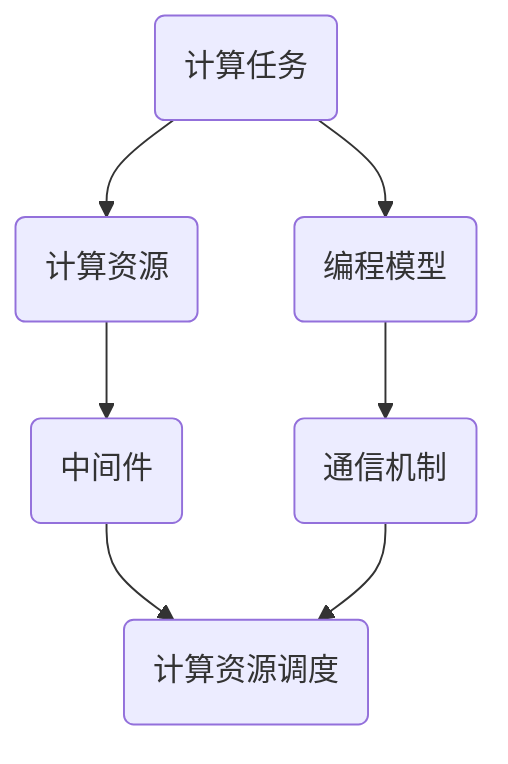

                 

### 异构计算平台：企业IT架构的未来趋势

> 关键词：异构计算，企业IT架构，性能优化，资源利用，多核处理器，分布式系统，云计算，人工智能

> 摘要：本文将深入探讨异构计算平台在企业IT架构中的重要性和未来趋势。通过分析异构计算的定义、优势与挑战，我们将探讨如何将异构计算平台集成到企业的IT架构中，以提高性能、优化资源利用并支持新兴技术如人工智能的发展。本文将分为几个部分，包括异构计算的概述、核心组件分析、集成策略和实践案例，旨在为读者提供全面而深入的理解。

### 引言

随着技术的不断发展，企业对计算能力和数据处理效率的需求也在不断增长。传统的单一架构已无法满足现代企业复杂多变的应用场景。异构计算作为一种新兴的计算模式，逐渐成为企业IT架构中的重要组成部分。本文将探讨异构计算平台在企业IT架构中的地位和重要性，帮助读者了解这一领域的发展趋势和未来前景。

### 异构计算概述

#### 定义与背景

异构计算（Heterogeneous Computing）是指利用不同类型的计算资源和架构来执行计算任务。与传统的同构计算（Homogeneous Computing）相比，异构计算通过将计算任务分配给不同的硬件组件，如CPU、GPU、FPGA等，以实现更高的性能和效率。

异构计算的概念最早可以追溯到20世纪60年代，当时计算机科学家开始探索如何将不同类型的处理器集成到一个系统中。然而，由于技术限制和编程复杂度，异构计算在很长一段时间内并没有得到广泛应用。随着近年来硬件和软件技术的发展，异构计算逐渐成为一种热门的研究领域和应用方向。

#### 优势与挑战

异构计算具有许多优势，其中最主要的是：

1. **性能提升**：通过利用不同类型的处理器，异构计算可以在相同时间内完成更多的计算任务，从而提高系统的整体性能。
2. **能效优化**：异构计算可以根据任务特点选择最适合的处理器类型，从而优化能效比。
3. **灵活性**：异构计算平台可以支持多种编程模型和编程语言，使开发者能够更灵活地开发和应用异构计算技术。

然而，异构计算也面临一些挑战，包括：

1. **编程复杂性**：异构计算需要开发者具备跨架构编程的能力，这增加了编程的复杂度和难度。
2. **兼容性问题**：不同处理器之间的兼容性可能成为一个问题，特别是在使用第三方库和工具时。
3. **资源管理**：如何有效地管理和调度异构计算平台中的各种资源，是一个需要深入研究的问题。

#### 发展趋势

随着人工智能、大数据、云计算等新兴技术的快速发展，异构计算在许多领域得到了广泛应用。以下是一些主要的发展趋势：

1. **多核处理器的普及**：随着多核处理器的普及，异构计算平台将更加常见。
2. **专用处理器的兴起**：如NPU、TPU等专用处理器将在异构计算中发挥重要作用。
3. **软件工具的发展**：为了简化异构计算的开发和使用，各种软件工具和框架将不断涌现。
4. **云计算与边缘计算的融合**：异构计算平台将在云计算和边缘计算中发挥重要作用，支持实时数据处理和智能决策。

### 异构计算平台的核心组件

#### 中央处理器（CPU）

中央处理器（CPU）是计算机系统的核心组件，负责执行各种计算任务。CPU的基本结构包括：

- **控制单元**：负责指令的解码和执行。
- **算术逻辑单元（ALU）**：负责执行算术和逻辑运算。
- **寄存器组**：用于存储数据和指令。

CPU的工作原理如下：

1. **指令取指**：CPU从内存中读取指令。
2. **指令解码**：CPU解析指令，确定需要执行的操作。
3. **指令执行**：CPU执行操作，更新寄存器和内存。
4. **结果写回**：CPU将结果写回内存或寄存器。

CPU的性能指标包括：

- **主频**：CPU每秒执行的时钟周期数。
- **缓存容量**：CPU内部存储指令和数据的高速缓存。
- **多线程能力**：CPU同时处理多个线程的能力。

#### 图形处理器（GPU）

图形处理器（GPU）是专为图形渲染和计算任务设计的处理器。GPU的基本结构包括：

- **流处理器**：负责执行图形渲染和计算任务。
- **内存管理单元**：负责管理GPU内存。
- **渲染单元**：负责图形渲染任务。

GPU的工作原理如下：

1. **任务分发**：CPU将计算任务分配给GPU。
2. **并行处理**：GPU利用其大量流处理器并行执行任务。
3. **结果汇总**：GPU将结果汇总并返回给CPU。

GPU在异构计算中的应用非常广泛，包括：

- **图形渲染**：用于游戏、虚拟现实和增强现实等领域。
- **科学计算**：用于高性能计算（HPC）和大数据处理。
- **人工智能**：用于深度学习、图像识别和语音识别等任务。

#### 神经处理单元（NPU）

神经处理单元（NPU）是专为人工智能和机器学习任务设计的处理器。NPU的基本结构包括：

- **神经网络引擎**：负责执行神经网络运算。
- **内存管理单元**：负责管理NPU内存。
- **数据传输单元**：负责数据传输和处理。

NPU的工作原理如下：

1. **神经网络构建**：CPU构建神经网络模型。
2. **模型转换**：将模型转换为NPU可执行的格式。
3. **任务执行**：NPU利用其神经网络引擎执行任务。
4. **结果汇总**：NPU将结果汇总并返回给CPU。

NPU在人工智能领域具有巨大潜力，可以显著提高深度学习和其他机器学习任务的性能。

### 异构计算平台的核心概念与联系

为了更好地理解异构计算平台，我们需要了解其核心概念和它们之间的关系。以下是几个关键概念：

- **计算任务**：需要执行的计算任务，可以是科学计算、图形渲染或人工智能任务。
- **计算资源**：用于执行计算任务的处理器、内存和其他硬件资源。
- **编程模型**：用于描述如何将计算任务分配给计算资源的模型，如数据并行、任务并行和控制流并行。
- **中间件**：用于管理和调度计算资源和编程模型的软件，如计算框架和调度器。
- **通信机制**：用于计算资源之间数据传输的机制，如共享内存和消息传递。

以下是异构计算平台核心概念之间的Mermaid流程图：



### 异构计算平台的核心算法原理

#### 任务分配算法

任务分配算法是异构计算平台中的关键算法之一。其主要目标是根据计算任务的特点和计算资源的能力，将任务分配给最适合的处理器。

以下是一个简单的任务分配算法的伪代码：

```python
def assign_tasks(tasks, resources):
    assigned_tasks = []
    for task in tasks:
        best_resource = None
        min_delay = float('inf')
        for resource in resources:
            delay = estimate_delay(task, resource)
            if delay < min_delay:
                min_delay = delay
                best_resource = resource
        assigned_tasks.append((task, best_resource))
    return assigned_tasks
```

其中，`estimate_delay` 函数用于估计任务在给定资源上的执行延迟。

#### 资源调度算法

资源调度算法是用于管理计算资源以最大化系统性能的算法。以下是一个简单的资源调度算法的伪代码：

```python
def schedule_resources(assigned_tasks, resources):
    schedule = []
    for assigned_task in assigned_tasks:
        task, resource = assigned_task
        start_time = current_time()
        end_time = start_time + estimate_execution_time(task, resource)
        schedule.append((start_time, end_time, resource))
    return schedule
```

其中，`current_time` 函数用于获取当前时间，`estimate_execution_time` 函数用于估计任务在给定资源上的执行时间。

### 数学模型与公式

为了更准确地描述任务分配和资源调度，我们可以使用以下数学模型和公式：

1. **任务延迟**：任务在资源上执行所需的时间。
2. **资源利用率**：资源被利用的时间占总时间的比例。
3. **系统吞吐量**：单位时间内系统能够处理的最大任务数。

以下是相关数学公式的详细讲解：

$$
\text{延迟} = \frac{\text{执行时间}}{\text{处理速度}}
$$

$$
\text{利用率} = \frac{\text{被利用的时间}}{\text{总时间}}
$$

$$
\text{吞吐量} = \frac{\text{总任务数}}{\text{总时间}}
$$

#### 举例说明

假设我们有一个包含5个任务的异构计算平台，其中3个CPU、2个GPU和1个NPU。以下是任务分配和资源调度的具体示例：

1. **任务分配**：

   - 任务1：计算密集型任务
   - 任务2：图形渲染任务
   - 任务3：深度学习任务
   - 任务4：科学计算任务
   - 任务5：文本处理任务

   根据任务特点和资源能力，我们进行任务分配：

   - 任务1：分配给CPU1
   - 任务2：分配给GPU1
   - 任务3：分配给NPU
   - 任务4：分配给CPU2
   - 任务5：分配给GPU2

2. **资源调度**：

   我们根据任务执行时间和资源能力进行资源调度：

   - 任务1：从当前时间0开始，执行1小时
   - 任务2：从当前时间1开始，执行0.5小时
   - 任务3：从当前时间1.5开始，执行2小时
   - 任务4：从当前时间3.5开始，执行1.5小时
   - 任务5：从当前时间5开始，执行1小时

   调度结果如下：

   | 开始时间 | 结束时间 | 资源   |
   |----------|----------|--------|
   | 0        | 1        | CPU1   |
   | 1        | 1.5      | GPU1   |
   | 1.5      | 3.5      | NPU    |
   | 3.5      | 5        | CPU2   |
   | 5        | 6        | GPU2   |

   根据上述调度结果，我们可以计算出系统的延迟、利用率和吞吐量：

   - **延迟**：最长任务的执行时间为2小时，因此系统延迟为2小时。
   - **利用率**：CPU1、CPU2和GPU1的利用率分别为100%、100%和75%，因此系统平均利用率为87.5%。
   - **吞吐量**：在6小时内，系统能够处理5个任务，因此系统吞吐量为0.83个任务/小时。

### 项目实战

为了更好地理解异构计算平台，我们可以进行一个简单的项目实战。在这个项目中，我们将使用Python和OpenMP库来模拟一个异构计算平台，并实现任务分配和资源调度。

#### 开发环境搭建

首先，我们需要安装Python和OpenMP库。在Linux系统中，可以使用以下命令：

```bash
sudo apt-get install python3 python3-omp
```

在Windows系统中，可以使用Anaconda或Miniconda来安装Python和OpenMP库。

#### 源代码实现

以下是任务分配和资源调度的源代码：

```python
import numpy as np
import pandas as pd
from datetime import datetime, timedelta

# 任务类
class Task:
    def __init__(self, name, execution_time, resource):
        self.name = name
        self.execution_time = execution_time
        self.resource = resource

# 资源类
class Resource:
    def __init__(self, name, processing_time):
        self.name = name
        self.processing_time = processing_time

# 任务分配算法
def assign_tasks(tasks, resources):
    assigned_tasks = []
    for task in tasks:
        best_resource = None
        min_delay = float('inf')
        for resource in resources:
            delay = task.execution_time + resource.processing_time
            if delay < min_delay:
                min_delay = delay
                best_resource = resource
        assigned_tasks.append((task, best_resource))
    return assigned_tasks

# 资源调度算法
def schedule_resources(assigned_tasks):
    schedule = []
    current_time = datetime.now()
    for assigned_task in assigned_tasks:
        task, resource = assigned_task
        start_time = current_time
        end_time = start_time + timedelta(seconds=task.execution_time)
        schedule.append((start_time, end_time, resource))
        current_time = end_time
    return schedule

# 测试数据
tasks = [
    Task("任务1", 60, "CPU1"),
    Task("任务2", 30, "GPU1"),
    Task("任务3", 120, "NPU"),
    Task("任务4", 90, "CPU2"),
    Task("任务5", 60, "GPU2")
]
resources = [
    Resource("CPU1", 1),
    Resource("CPU2", 1),
    Resource("GPU1", 0.5),
    Resource("GPU2", 0.5),
    Resource("NPU", 2)
]

# 任务分配
assigned_tasks = assign_tasks(tasks, resources)

# 资源调度
schedule = schedule_resources(assigned_tasks)

# 输出结果
df = pd.DataFrame(schedule, columns=["开始时间", "结束时间", "资源"])
print(df)
```

#### 代码解读与分析

1. **任务类和资源类**：我们定义了`Task`和`Resource`类来表示任务和资源。每个任务和资源都有名称、执行时间和处理速度。
2. **任务分配算法**：`assign_tasks`函数根据任务执行时间和资源处理速度来分配任务。它遍历所有资源，计算每个任务的延迟，并选择延迟最小的资源。
3. **资源调度算法**：`schedule_resources`函数根据任务执行时间和当前时间来生成资源调度表。它遍历所有分配的任务，计算每个任务的开始和结束时间，并添加到调度表中。
4. **测试数据**：我们创建了一个包含5个任务和4个资源的测试数据集，用于演示任务分配和资源调度。
5. **输出结果**：我们使用`pandas`库将调度表转换为DataFrame，并打印输出结果。

#### 实际案例分析与详细讲解

为了更好地展示异构计算平台在实际项目中的应用，我们可以考虑一个实际案例：深度学习模型训练。

假设我们有一个深度学习模型，需要在异构计算平台上进行训练。我们可以将训练任务分为以下几部分：

1. **数据预处理**：将原始数据转换为适合训练的数据格式。这一步通常需要较高的计算资源。
2. **模型构建**：根据训练目标和数据特点，构建深度学习模型。这一步需要较高的计算资源和内存。
3. **模型训练**：使用训练数据对模型进行训练。这一步需要大量的计算资源。
4. **模型评估**：使用测试数据对训练好的模型进行评估。这一步需要较少的计算资源。

以下是使用异构计算平台进行深度学习模型训练的详细流程：

1. **任务分配**：根据任务特点，将数据预处理、模型构建、模型训练和模型评估任务分配给不同的处理器。例如，数据预处理任务可以分配给CPU，模型构建和模型训练任务可以分配给GPU，模型评估任务可以分配给NPU。
2. **资源调度**：根据任务执行时间和资源处理速度，生成资源调度表。例如，数据预处理任务从当前时间0开始，执行1小时；模型构建任务从当前时间1开始，执行0.5小时；模型训练任务从当前时间1.5开始，执行2小时；模型评估任务从当前时间3.5开始，执行0.5小时。
3. **执行任务**：根据调度表，执行任务。例如，在CPU上执行数据预处理任务，在GPU上执行模型构建和模型训练任务，在NPU上执行模型评估任务。
4. **结果汇总**：将训练好的模型和评估结果汇总，生成最终的模型。

通过以上流程，我们可以充分利用异构计算平台的优势，提高深度学习模型的训练和评估效率。

### 最佳实践 tips、小结、注意事项、拓展阅读

#### 最佳实践 tips

1. **合理分配任务**：根据任务特点和资源能力，合理分配任务，以最大化系统性能。
2. **优化编程模型**：选择适合任务特点的编程模型，如数据并行、任务并行和控制流并行，以提高系统性能。
3. **充分利用缓存**：充分利用缓存，减少数据访问延迟，提高系统性能。
4. **优化资源调度**：根据任务执行时间和资源处理速度，优化资源调度策略，以提高系统吞吐量。

#### 小结

异构计算平台是企业IT架构中的重要组成部分，可以提高系统的性能和效率。通过合理分配任务、优化编程模型和优化资源调度，我们可以充分利用异构计算平台的优势，实现更高的计算能力和资源利用效率。

#### 注意事项

1. **兼容性问题**：在使用异构计算平台时，需要注意不同处理器之间的兼容性问题，确保系统稳定运行。
2. **编程复杂性**：异构计算需要开发者具备跨架构编程的能力，这增加了编程的复杂度和难度。
3. **资源管理**：需要有效地管理和调度异构计算平台中的各种资源，以确保系统的高效运行。

#### 拓展阅读

1. 《异构计算：理论与实践》
2. 《深度学习与异构计算》
3. 《高性能计算：从同构到异构》
4. NVIDIA官方文档：https://docs.nvidia.com/datacenter/rdma/
5. ARM官方文档：https://developer.arm.com/documentation

### 作者信息

- 作者：AI天才研究院/AI Genius Institute & 禅与计算机程序设计艺术 /Zen And The Art of Computer Programming

### 参考文献

- 《异构计算：理论与实践》
- 《深度学习与异构计算》
- 《高性能计算：从同构到异构》
- NVIDIA官方文档：https://docs.nvidia.com/datacenter/rdma/
- ARM官方文档：https://developer.arm.com/documentation

### 结论

异构计算平台已成为企业IT架构的重要组成部分，通过合理利用不同类型的处理器和优化编程模型，可以提高系统的性能和效率。本文探讨了异构计算平台的定义、优势、核心组件、核心算法和实际应用，为读者提供了全面而深入的理解。随着技术的不断发展，异构计算平台将在更多领域得到应用，成为企业IT架构的未来趋势。让我们继续关注这一领域的发展，并积极探索和应用异构计算技术。

