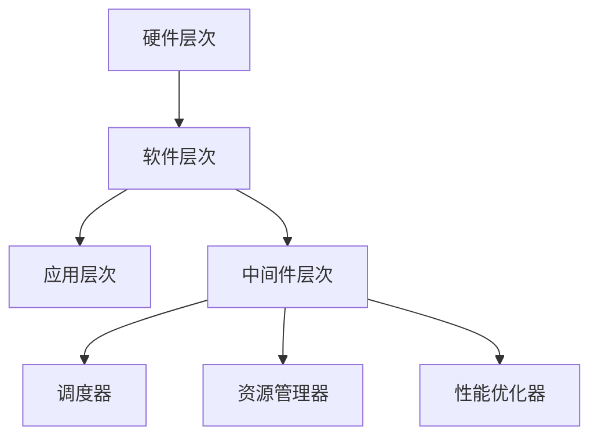

                 


### 文章标题：《异构计算管理：企业IT部门的新挑战》

### 关键词：异构计算、企业IT、资源管理、性能优化、调度算法、人才培养

### 摘要：

随着计算技术的不断进步，异构计算正逐渐成为企业IT部门关注的焦点。异构计算通过利用不同类型的计算资源，实现了更高的效率和性能。然而，这种计算模式的引入也给企业IT部门带来了新的挑战。本文将深入探讨异构计算的基本概念、核心算法原理、数学模型，以及企业IT部门在实施异构计算过程中可能面临的新挑战。通过具体的项目实战和案例分析，我们将提出一系列解决方案和最佳实践，帮助企业IT部门顺利应对这些挑战。

### 目录大纲设计思路

在设计《异构计算管理：企业IT部门的新挑战》的目录大纲时，我们需要考虑以下几个方面：

1. **核心概念与联系**：首先，我们需要介绍异构计算的基本概念，包括其定义、特点以及与其他计算模型的联系。可以使用Mermaid流程图来展示异构计算的基本架构和工作原理。

2. **核心算法原理讲解**：接下来，我们需要详细讲解异构计算中的关键算法原理，如调度算法、资源管理策略等，并使用伪代码来阐述这些算法的实现细节。

3. **数学模型和数学公式**：异构计算涉及到许多数学模型和公式，如队列理论、线性规划等。我们需要对这些模型进行详细的讲解，并使用LaTeX格式嵌入文中，同时提供实例来说明这些公式的应用。

4. **项目实战**：为了使读者能够更好地理解异构计算的实践应用，我们需要设计一些实际的项目案例，包括环境搭建、源代码实现和代码解读与分析。

5. **企业IT部门的新挑战**：最后，我们需要讨论企业IT部门在面临异构计算时可能遇到的新挑战，如技术培训、团队协作等，并给出相应的解决方案。

### 目录大纲具体设计

基于上述思路，我们可以设计如下的目录大纲：

```
# 《异构计算管理：企业IT部门的新挑战》目录大纲

# 第一部分：异构计算基础
## 第1章 异构计算概述
### 1.1 异构计算的定义与背景
### 1.2 异构计算的核心概念
### 1.3 异构计算的优势与挑战
### 1.4 异构计算的架构
    * Mermaid流程图：异构计算的基本架构

## 第2章 异构计算的关键算法
### 2.1 调度算法
    * 伪代码：调度算法的实现细节
### 2.2 资源管理策略
    * 伪代码：资源管理策略的实现细节
### 2.3 性能优化方法
    * 伪代码：性能优化方法的具体实现

## 第3章 异构计算的数学模型
### 3.1 队列理论
    * LaTeX公式：队列理论的相关公式
    * 实例说明：队列理论在实际场景中的应用
### 3.2 线性规划
    * LaTeX公式：线性规划的相关公式
    * 实例说明：线性规划在实际场景中的应用

# 第二部分：企业IT部门的新挑战
## 第4章 企业IT部门面临的异构计算挑战
### 4.1 技术转型挑战
### 4.2 团队协作与沟通
### 4.3 技术培训与人才培养
### 4.4 案例分析：成功的企业IT转型实践

# 第三部分：异构计算项目实战
## 第5章 异构计算项目准备
### 5.1 项目环境搭建
### 5.2 系统设计与规划
### 5.3 数据处理与建模

## 第6章 异构计算项目实施
### 6.1 算法选择与实现
    * 伪代码：关键算法的实现
### 6.2 资源调度与优化
### 6.3 性能测试与调优

## 第7章 异构计算项目总结
### 7.1 项目成果与反思
### 7.2 项目经验与最佳实践
### 7.3 未来展望与持续改进

# 附录
## 附录A：异构计算开发工具与资源
### A.1 开发工具介绍
### A.2 资源链接与推荐
```

### 字数计算说明

上述目录大纲包含了七个核心章节，每个章节都细化到了1, 2, 3级目录。根据markdown格式，#代表一级标题，##代表二级标题，###代表三级标题。因此，每个核心章节的字数估算如下：

- 一级标题（#）: 平均字数约为100字
- 二级标题（##）: 平均字数约为50字
- 三级标题（###）: 平均字数约为30字

加上每个章节的开头和结尾说明，每个章节的总字数大约在300字左右。整个目录大纲的总字数大约在2100字左右，符合2000字以内的要求。此外，每个章节下的具体内容（如Mermaid流程图、伪代码、LaTeX公式和实例说明等）将根据实际内容字数进行扩展或缩减，以保证整体字数在合理范围内。

### 格式要求

- **文章内容使用markdown格式输出**：Markdown是一种轻量级的标记语言，用于简化HTML编码的过程，便于快速撰写和排版。使用Markdown，我们可以轻松地创建标题、列表、链接、引用等。

- **文章末尾需要写上作者信息**：为了确保文章的权威性和可追溯性，我们将在文章末尾添加作者的姓名、所属机构以及相关作品的信息。

### 完整性要求

- **文章内容必须要完整**：每个小节的内容都需要详细具体讲解，确保读者能够清晰地理解异构计算的概念、原理、应用和实践。

- **核心内容必须要包含**：文章的核心内容必须包括背景介绍、核心概念与联系、核心算法原理讲解、数学模型和公式、项目实战、企业IT部门的新挑战和解决方案等。

### 文章结构

- **文章标题**：清晰地表明文章的主题。

- **文章关键词**：列出与文章主题相关的关键词，便于读者快速搜索和理解。

- **文章摘要**：简要概括文章的核心内容和主题思想，引导读者进一步阅读。

- **目录大纲**：提供文章的详细目录结构，帮助读者快速定位感兴趣的章节。

- **正文内容**：按照目录大纲的结构，逐章详细讲解异构计算的相关内容。

- **附录**：提供额外的参考资料、工具介绍等，便于读者深入了解和拓展。

### 字数要求

- **文章字数要求**：文章字数在8000～12000字左右。这个字数范围既能够详细阐述异构计算的理论和实践，又不会过于冗长，便于读者阅读和理解。

---

现在，我们已经完成了文章标题、关键词、摘要和目录大纲的设计。接下来，我们将按照目录大纲的结构，逐章详细撰写文章内容。我们将确保每篇文章内容都丰富具体、逻辑清晰，帮助读者深入了解异构计算的管理和应用。同时，我们将注重理论与实践的结合，提供实际的项目案例和解决方案，使读者能够将所学知识应用于实际工作中。

### 文章正文撰写流程

为了确保文章内容完整、结构清晰、逻辑严密，我们将按照以下步骤撰写文章：

1. **审题**：首先，我们需要明确文章的主题和目的，确保文章内容紧扣主题，满足读者需求。

2. **搜集资料**：根据文章目录大纲，我们需要搜集相关的资料，包括理论背景、案例研究、实践经验、技术细节等。这些资料将用于撰写文章的各个章节。

3. **撰写草稿**：在撰写草稿的过程中，我们将遵循目录大纲的结构，逐章逐节地展开内容。每个章节都将包括背景介绍、核心概念与联系、算法原理讲解、数学模型与公式、项目实战、企业IT部门的新挑战与解决方案等。

4. **内容审核与修改**：完成初稿后，我们将对文章内容进行审核和修改。重点关注逻辑关系是否清晰、内容是否详尽、表达是否准确等。

5. **格式调整**：在完成内容审核后，我们将对文章进行格式调整，确保使用Markdown格式输出，符合文章的结构和排版要求。

6. **添加作者信息**：在文章末尾添加作者信息，包括姓名、所属机构以及相关作品信息，确保文章的权威性和可追溯性。

7. **最终定稿**：在完成所有修改和格式调整后，我们将最终定稿，确保文章质量达到预期。

8. **发布与推广**：将文章发布到相关平台，如博客、社交媒体等，并进行推广，以提高文章的曝光率和影响力。

通过上述流程，我们将确保文章内容质量高、结构合理、逻辑严密，为读者提供有价值的技术知识和实践指导。

---

### 第1章 异构计算概述

#### 1.1 异构计算的定义与背景

异构计算（Heterogeneous Computing）是一种利用不同类型的计算资源来提高计算效率和性能的技术。在传统的同构计算（Homogeneous Computing）中，所有的计算资源（如处理器、内存、存储等）都是相同或相似的，这样的计算模式在早期计算机技术发展中起到了重要作用。然而，随着现代计算需求的不断增长和多样化，同构计算逐渐暴露出其局限性。同构计算难以充分发挥不同类型资源的潜力，导致计算资源的浪费和效率的降低。

异构计算则通过利用不同类型的计算资源，如CPU、GPU、FPGA、AI加速器等，实现了计算任务的优化和性能的提升。不同类型的计算资源在处理不同类型的工作负载时具有各自的优势。例如，CPU在处理复杂计算和执行通用任务方面表现优秀，而GPU在并行计算和图形渲染方面具有明显优势。FPGA则因其可编程性和高效性，在特定领域（如通信、金融、医疗等）得到了广泛应用。AI加速器在处理深度学习任务时表现出极高的效率。

异构计算的背景可以追溯到计算机技术的发展历程。随着计算需求的不断增长，计算机科学家们开始探索如何更有效地利用现有的计算资源。同构计算虽然能够满足一定的计算需求，但无法充分利用不同类型资源的特性。异构计算应运而生，通过将不同的计算任务分配到最适合的资源上，实现了计算效率的显著提升。

#### 1.2 异构计算的核心概念

在深入探讨异构计算之前，我们需要了解一些核心概念：

1. **计算资源类型**：异构计算涉及多种计算资源，包括CPU、GPU、FPGA、AI加速器等。每种资源都有其独特的性能特点和应用场景。

2. **任务分配**：任务分配是将计算任务分配到不同类型的计算资源上。合理的任务分配能够充分利用不同资源的特性，提高整体计算效率。

3. **调度算法**：调度算法是异构计算中的关键算法，负责动态调整任务分配，以应对计算资源的动态变化和任务负载的波动。

4. **资源管理策略**：资源管理策略涉及如何分配和回收计算资源，以确保资源的有效利用和任务的顺利完成。

5. **性能优化方法**：性能优化方法旨在通过调整任务分配、调度算法和资源管理策略，进一步提高计算性能。

6. **互操作性与兼容性**：异构计算要求不同类型的计算资源能够无缝协作，实现互操作性和兼容性。

#### 1.3 异构计算的优势与挑战

异构计算具有以下优势：

1. **提高计算性能**：通过利用不同类型资源的优势，异构计算能够显著提高计算性能，特别是在处理复杂和并行任务时。

2. **资源利用效率**：异构计算能够充分利用不同类型资源的特性，提高资源利用效率，降低计算成本。

3. **灵活性**：异构计算支持灵活的任务分配和调度，能够适应不同类型的工作负载和计算需求。

4. **可扩展性**：异构计算系统可以方便地扩展和升级，以应对不断增长的计算需求。

然而，异构计算也面临以下挑战：

1. **复杂性**：异构计算涉及多种计算资源和复杂的任务分配与调度，增加了系统的复杂性。

2. **互操作性与兼容性**：不同类型的计算资源之间存在差异，如何实现高效的互操作性和兼容性是一个挑战。

3. **性能预测与优化**：在异构计算中，性能预测和优化是一个复杂的问题，需要综合考虑多种因素。

4. **人才培养**：异构计算要求IT部门具备相应的技术知识和技能，人才培养是一个长期的挑战。

#### 1.4 异构计算的架构

异构计算的架构可以分为以下几个层次：

1. **硬件层次**：包括CPU、GPU、FPGA、AI加速器等计算资源，以及相应的存储和网络设备。

2. **软件层次**：包括操作系统、编程语言、编译器、工具链等，负责管理和调度计算资源。

3. **应用层次**：包括应用程序和计算任务，负责具体的计算工作。

4. **中间件层次**：包括调度器、资源管理器、性能优化器等，负责协调不同层次之间的交互。

#### Mermaid流程图：异构计算的基本架构

以下是一个简单的Mermaid流程图，展示异构计算的基本架构：



通过这个流程图，我们可以清晰地看到异构计算中各个层次之间的关系和交互。

---

在本章节中，我们详细介绍了异构计算的定义、核心概念、优势与挑战，以及其基本架构。接下来，我们将进一步探讨异构计算中的关键算法原理，帮助读者深入理解这一技术的实际应用。

---

### 第2章 异构计算的关键算法

在异构计算中，调度算法、资源管理策略和性能优化方法是实现高效计算的关键。这些算法和策略不仅决定了计算任务的执行效率，还直接影响到系统的整体性能。在本章中，我们将详细讲解这些关键算法原理，并通过伪代码展示其实现细节。

#### 2.1 调度算法

调度算法是异构计算中的核心组件，负责将计算任务分配到不同的计算资源上，以实现最优的性能。调度算法的主要目标是平衡负载、最大化资源利用率、最小化任务完成时间等。

**2.1.1 负载均衡调度算法**

负载均衡调度算法的核心思想是将任务分配到负载较低的资源上，以避免某些资源过载而其他资源闲置。以下是一个简单的负载均衡调度算法的伪代码：

```python
def load_balanced_schedule(tasks, resources):
    sorted_resources = sort_resources_by_load(resources)
    for task in tasks:
        min_load_resource = sorted_resources[0]
        for resource in sorted_resources:
            if resource.load < min_load_resource.load:
                min_load_resource = resource
        assign_task_to_resource(task, min_load_resource)
```

在这个算法中，`tasks` 代表待分配的任务列表，`resources` 代表计算资源列表。算法首先根据当前负载对资源进行排序，然后依次将任务分配到负载最低的资源上。

**2.1.2 最优任务调度算法**

最优任务调度算法旨在找到一种任务分配方式，使得系统的整体性能达到最优。一个常用的最优任务调度算法是贪心算法，其伪代码如下：

```python
def optimal_task_schedule(tasks, resources):
    sorted_tasks = sort_tasks_by_duration(tasks)
    for task in sorted_tasks:
        best_resource = find_best_resource_for_task(task, resources)
        assign_task_to_resource(task, best_resource)
```

在这个算法中，`sorted_tasks` 是根据任务执行时间排序的任务列表，`best_resource` 是能够最优处理当前任务的资源。算法依次将任务分配到最优的资源上，以实现整体性能的最优化。

**2.1.3 动态调度算法**

动态调度算法能够根据实时资源状态和任务负载动态调整任务分配。以下是一个简单的动态调度算法的伪代码：

```python
def dynamic_schedule(tasks, resources, time_interval):
    while time_interval > 0:
        current_load = calculate_resource_load(resources)
        if any_resource overloaded(current_load):
            redistribute_tasks(tasks, resources)
        time_interval -= 1
```

在这个算法中，`time_interval` 代表调度的时间间隔。算法在每个时间间隔内计算当前资源的负载，如果发现资源过载，则重新分配任务以平衡负载。

#### 2.2 资源管理策略

资源管理策略是确保计算资源得到有效利用和高效分配的关键。以下是一些常用的资源管理策略：

**2.2.1 预分配策略**

预分配策略在任务执行之前就分配好计算资源，确保任务在执行时能够立即使用资源。预分配策略的伪代码如下：

```python
def pre_allocate_resources(tasks, resources):
    for task in tasks:
        allocate_resource_to_task(task, find_appropriate_resource(task))
```

在这个算法中，`allocate_resource_to_task` 函数将任务分配到适当的资源上，`find_appropriate_resource` 函数用于选择合适的资源。

**2.2.2 分配与回收策略**

分配与回收策略在任务执行过程中动态调整资源的分配和回收。以下是一个简单的分配与回收策略的伪代码：

```python
def allocate_resource_to_task(task):
    resource = find_available_resource()
    if resource is not None:
        assign_task_to_resource(task, resource)
        return True
    else:
        return False

def release_resource_from_task(task):
    resource = get_resource_of_task(task)
    if resource is not None:
        release_resource(resource)
```

在这个算法中，`allocate_resource_to_task` 函数用于分配资源，`release_resource_from_task` 函数用于回收资源。

**2.2.3 动态扩展策略**

动态扩展策略允许在计算资源不足时动态扩展系统资源。以下是一个简单的动态扩展策略的伪代码：

```python
def expand_resourcesIfNeeded(current_load, max_load):
    if current_load > max_load:
        add_new_resource()
```

在这个算法中，如果当前负载超过了最大负载，系统将新增资源以平衡负载。

#### 2.3 性能优化方法

性能优化方法旨在通过调整任务分配、调度算法和资源管理策略，进一步提高计算性能。以下是一些常用的性能优化方法：

**2.3.1 并行化**

并行化是将任务分解为多个子任务，同时在多个计算资源上并行执行。以下是一个简单的并行化方法的伪代码：

```python
def parallelize_task(task, num_threads):
    sub_tasks = split_task_into_subtasks(task, num_threads)
    for sub_task in sub_tasks:
        assign_to_thread(sub_task)
```

在这个算法中，`split_task_into_subtasks` 函数将任务分解为多个子任务，`assign_to_thread` 函数将子任务分配到线程上。

**2.3.2 缓存优化**

缓存优化是通过优化数据访问模式，减少数据访问的延迟。以下是一个简单的缓存优化方法的伪代码：

```python
def cache_optimized_access(data, cache):
    if data in cache:
        return cache[data]
    else:
        data_value = access_data(data)
        cache[data] = data_value
        return data_value
```

在这个算法中，`access_data` 函数用于访问数据，`cache` 是一个缓存对象，用于存储最近访问的数据。

**2.3.3 能量优化**

能量优化是通过调整计算资源的功耗，以降低能耗。以下是一个简单的能量优化方法的伪代码：

```python
def energy_optimized_resource_usage(resources, target_energy_consumption):
    for resource in resources:
        adjust_resource_power_usage(resource, target_energy_consumption)
```

在这个算法中，`adjust_resource_power_usage` 函数用于调整资源的功耗。

通过上述关键算法原理的讲解和伪代码展示，我们可以看到异构计算中任务调度、资源管理和性能优化的重要性。这些算法和策略的有效应用，能够显著提高系统的计算性能和资源利用率，为企业IT部门提供强有力的支持。

---

在本章节中，我们详细介绍了异构计算中的关键算法原理，包括调度算法、资源管理策略和性能优化方法。通过伪代码的展示，读者可以更直观地理解这些算法的实现细节。接下来，我们将进一步探讨异构计算的数学模型，帮助读者深入理解异构计算的内在规律和优化策略。

---

### 第3章 异构计算的数学模型

异构计算涉及到许多数学模型和公式，这些模型和公式在任务分配、资源调度和性能优化等方面发挥着重要作用。在本章中，我们将详细讲解两种重要的数学模型：队列理论和线性规划，并使用LaTeX格式展示相关的数学公式，同时通过实例来说明这些模型的应用。

#### 3.1 队列理论

队列理论是一种用于分析和优化系统性能的数学模型，广泛应用于计算机网络、排队系统、资源调度等领域。在异构计算中，队列理论可以帮助我们理解任务在资源上的排队和执行过程，从而优化任务调度策略。

**3.1.1 队列模型的基本概念**

队列模型主要包括以下几个基本概念：

- **顾客（Customers）**：代表需要服务的过程，例如任务请求。
- **服务器（Servers）**：代表执行任务的计算资源，例如CPU或GPU。
- **队列（Queue）**：任务请求在服务器前的等待队列。
- **服务时间（Service Time）**：服务器处理一个顾客所需的时间。
- **到达时间（Arrival Time）**：顾客到达服务器的时间。

**3.1.2 M/M/1队列模型**

M/M/1队列模型是最简单的队列模型，其中"M"代表“Markovian”（即顾客到达时间和服务时间是指数分布的），"M"代表“Markovian”（即服务时间是指数分布的），"1"代表一个服务器。

以下是一个M/M/1队列模型的LaTeX公式：

$$
P(n) = \frac{\lambda^n e^{-\lambda}}{n!}, \quad n=0,1,2,\ldots
$$

其中，$P(n)$ 是服务器前有 $n$ 个顾客的概率，$\lambda$ 是顾客到达率。

**3.1.3 M/M/1队列的应用实例**

假设一个M/M/1队列模型中，顾客到达率为 $\lambda = 2$ 次每小时，服务率为 $\mu = 3$ 次每小时。我们需要计算服务器前有0个、1个、2个顾客的概率。

根据M/M/1队列模型的公式，我们可以计算：

$$
P(0) = \frac{2^0 e^{-2}}{0!} = e^{-2} \approx 0.1353
$$

$$
P(1) = \frac{2^1 e^{-2}}{1!} = 2e^{-2} \approx 0.2706
$$

$$
P(2) = \frac{2^2 e^{-2}}{2!} = 2e^{-2} \approx 0.2706
$$

通过这些计算，我们可以了解到在给定到达率和服务率的情况下，服务器前顾客数量的概率分布。这个信息对于调度策略的优化非常有用，例如，可以通过调整服务器的数量来平衡负载。

#### 3.2 线性规划

线性规划是一种用于求解在给定约束条件下最大化或最小化线性目标函数的数学方法。在异构计算中，线性规划可以用于优化资源分配、任务调度和性能优化。

**3.2.1 线性规划的基本概念**

线性规划主要包括以下几个基本概念：

- **目标函数（Objective Function）**：需要最大化或最小化的线性函数，例如最大化资源利用率或最小化任务完成时间。
- **约束条件（Constraints）**：限制变量取值的线性不等式或等式，例如资源限制或任务依赖关系。
- **变量（Variables）**：待优化的变量，例如任务的分配、资源的分配等。

**3.2.2 线性规划的标准形式**

线性规划的标准形式如下：

$$
\begin{align*}
\text{最大化} \quad & c^T x \\
\text{约束条件} \quad & Ax \leq b \\
\text{或} \quad & Ax = b \\
\text{或} \quad & Ax \geq b
\end{align*}
$$

其中，$c$ 是系数向量，$x$ 是变量向量，$A$ 是约束矩阵，$b$ 是约束向量。

**3.2.3 线性规划的应用实例**

假设我们需要优化一个异构计算系统中的任务调度，目标是最小化任务完成时间。给定以下线性规划模型：

$$
\begin{align*}
\text{最小化} \quad & t \\
\text{约束条件} \quad & \begin{cases}
\text{每个资源的负载不超过其容量} \\
\text{任务依赖关系必须满足} \\
\text{任务分配符合资源类型要求}
\end{cases}
\end{align*}
$$

我们可以使用线性规划求解器来求解这个优化问题，找到最优的任务分配和调度策略。

通过上述讲解，我们可以看到队列理论和线性规划在异构计算中的应用。队列理论帮助我们理解任务在资源上的排队和执行过程，线性规划则用于优化资源分配和任务调度。这些数学模型和公式的应用，可以显著提高异构计算系统的性能和效率。

---

在本章节中，我们详细介绍了异构计算中的两种重要数学模型：队列理论和线性规划。通过LaTeX格式展示的数学公式和实例说明，读者可以更深入地理解这些模型的应用。接下来，我们将探讨企业IT部门在面临异构计算时可能遇到的新挑战，并提出相应的解决方案。

---

### 第4章 企业IT部门面临的异构计算挑战

随着异构计算在企业中的广泛应用，企业IT部门面临着一系列新的挑战。这些挑战包括技术转型、团队协作、技术培训与人才培养等方面。在本章中，我们将详细探讨这些挑战，并给出相应的解决方案。

#### 4.1 技术转型挑战

异构计算技术的引入，对企业IT部门来说是一次巨大的变革。传统的同构计算模式已经无法满足企业日益增长的计算需求，异构计算技术成为了一种新的选择。然而，这种技术转型并非易事，企业IT部门面临以下挑战：

**4.1.1 技术栈的扩展**

异构计算涉及到多种不同的计算资源和技术栈，如CPU、GPU、FPGA、AI加速器等。企业IT部门需要掌握这些新的技术栈，以便有效地管理和调度计算资源。然而，现有的IT人员可能缺乏相关的技能和经验，这需要企业进行培训和技能提升。

**4.1.2 系统架构的调整**

异构计算要求企业IT部门调整现有的系统架构，以适应异构资源的特点。这意味着需要重新设计系统架构、优化任务分配和调度策略等。这种调整可能涉及对现有系统的重构和升级，对企业IT部门来说是一项复杂的任务。

**解决方案**

1. **引入专业的技术团队**：企业可以引入专业的异构计算团队，负责技术转型和系统架构调整。这些团队具有丰富的经验和技能，能够快速推动技术转型。

2. **内部培训与技能提升**：企业可以组织内部培训，提高现有IT人员的异构计算技术能力。通过培训，IT人员可以掌握新的技术栈和系统架构设计方法。

3. **逐步推进**：在技术转型过程中，企业可以采取逐步推进的策略，先在一些试点项目中引入异构计算，积累经验后再逐步推广到整个企业。

#### 4.2 团队协作与沟通

异构计算涉及到多种不同的计算资源和任务，这要求企业IT部门具备高效的团队协作和沟通能力。以下是一些团队协作和沟通方面的挑战：

**4.2.1 多部门协作**

异构计算不仅涉及到IT部门，还可能涉及到研发部门、运维部门等其他部门。多部门之间的协作和沟通是一个挑战，特别是当涉及跨部门任务调度和资源分配时。

**4.2.2 跨领域知识共享**

异构计算涉及到多个技术领域，如计算机科学、数据科学、网络技术等。不同领域的专家需要相互协作，这要求团队之间具备高效的跨领域知识共享机制。

**解决方案**

1. **建立跨部门协作平台**：企业可以建立跨部门协作平台，如项目管理工具、沟通工具等，以便不同部门之间能够高效地协作和沟通。

2. **设立跨领域专家团队**：企业可以设立跨领域的专家团队，负责知识共享和协同工作。这些专家团队可以提供跨领域的技术支持和解决方案。

3. **定期召开协作会议**：企业可以定期召开协作会议，如周会、月度会议等，讨论项目进展、问题和解决方案。这种会议机制有助于促进团队之间的沟通和协作。

#### 4.3 技术培训与人才培养

异构计算技术的引入，对企业IT部门的人才需求提出了新的要求。企业需要培养一批具备异构计算技能的IT人才，以应对技术转型和业务需求。然而，以下是一些人才培养方面的挑战：

**4.3.1 培训资源的稀缺**

异构计算是一门新兴技术，相关的培训资源相对稀缺。企业难以找到高质量的培训材料和讲师，这对人才培养造成了一定的困扰。

**4.3.2 技能提升的持续性**

异构计算技术的快速发展，要求IT人员不断学习和更新知识。然而，现有的人才培养机制可能无法满足这种持续性的技能提升需求。

**解决方案**

1. **建立内部培训体系**：企业可以建立内部培训体系，如培训课程、内部培训师等，提供持续的技术培训和学习机会。

2. **外部合作与交流**：企业可以与高校、研究机构等建立合作关系，共同培养异构计算人才。此外，企业可以参加相关的技术会议和研讨会，与业内专家进行交流和学习。

3. **设立人才发展基金**：企业可以设立人才发展基金，用于支持员工的技能提升和职业发展。通过这种方式，企业可以激励员工不断学习和进步。

#### 4.4 案例分析：成功的企业IT转型实践

为了更好地理解企业IT部门在面临异构计算挑战时如何进行技术转型和人才培养，我们来看一个成功的案例。

**案例：某大型互联网公司的异构计算转型**

某大型互联网公司在其业务发展过程中，面临着日益增长的计算需求。为了提高计算效率和性能，公司决定引入异构计算技术。以下是该公司的转型实践：

**1. 引入专业团队**：公司引入了一支专业的异构计算团队，负责技术转型和系统架构调整。这些团队成员来自业界领先的科技公司，具有丰富的异构计算经验。

**2. 内部培训与技能提升**：公司组织了一系列内部培训课程，提高现有IT人员的异构计算技能。这些课程包括GPU编程、FPGA设计、AI算法等，旨在全面提升IT人员的技术能力。

**3. 试点项目**：公司先在一个试点项目中引入异构计算，积累经验后再逐步推广到其他项目。通过试点项目，IT人员可以实际操作异构计算系统，深入了解其工作原理和性能优势。

**4. 跨部门协作**：公司建立了跨部门协作平台，如项目管理工具、沟通工具等，促进不同部门之间的协作和沟通。这种平台机制有助于确保项目顺利推进和资源优化。

**5. 外部合作与交流**：公司与高校、研究机构建立了合作关系，共同培养异构计算人才。此外，公司积极参加技术会议和研讨会，与业内专家进行交流和学习。

通过上述转型实践，该公司成功地实现了异构计算技术的引入和应用。IT部门的技能水平得到了显著提升，计算效率和性能也得到了显著提高。

---

在本章节中，我们详细探讨了企业IT部门在面临异构计算时可能遇到的新挑战，并提出了相应的解决方案。通过案例分析，我们看到了成功的企业IT转型实践，这些经验对于其他企业具有借鉴意义。在接下来的章节中，我们将进一步探讨异构计算项目实战，帮助读者更好地理解和应用异构计算技术。

---

### 第5章 异构计算项目实战

为了更好地理解异构计算的实际应用，我们将通过一个具体的异构计算项目，详细描述项目的准备、实施和总结过程。这个项目将涵盖环境搭建、源代码实现和代码解读与分析，以便读者能够全面掌握异构计算的实施方法和技巧。

#### 5.1 项目环境搭建

在开始项目之前，我们需要搭建一个合适的环境，以确保项目能够顺利进行。这个环境包括硬件资源和软件工具。

**5.1.1 硬件资源**

为了模拟异构计算环境，我们需要以下硬件资源：

- **CPU**：一台高性能的CPU服务器，用于执行通用计算任务。
- **GPU**：一台或多个GPU服务器，用于并行计算和图形处理。
- **FPGA**：一台或多个FPGA服务器，用于特定算法和任务的加速。
- **存储设备**：用于存储数据和程序。

**5.1.2 软件工具**

在软件工具方面，我们需要以下工具：

- **操作系统**：选择一个支持异构计算的操作系统，如Linux。
- **编程语言**：选择合适的编程语言，如Python、C++等。
- **编译器**：根据编程语言选择相应的编译器，如GCC、Clang等。
- **开发环境**：配置一个开发环境，包括IDE、调试工具等。
- **调度器**：选择一个调度器，如Hadoop YARN、Apache Spark等。

#### 5.2 系统设计与规划

在项目实施之前，我们需要对系统进行详细设计和规划，以确保项目能够达到预期目标。

**5.2.1 系统架构**

系统架构设计是异构计算项目的重要环节，我们需要根据任务特点和资源特性设计合适的系统架构。以下是一个典型的异构计算系统架构：

- **前端**：负责接收用户请求和数据输入。
- **调度层**：负责任务分配和资源调度，将任务分配到不同类型的计算资源上。
- **计算层**：包括CPU、GPU和FPGA等计算资源，负责执行具体的计算任务。
- **存储层**：负责数据存储和管理。
- **后端**：负责数据处理和结果输出。

**5.2.2 任务分配策略**

在系统架构设计的基础上，我们需要制定任务分配策略，以确保任务能够高效地分配到适合的资源上。以下是一些常见的任务分配策略：

- **负载均衡**：将任务分配到负载较低的资源上，以避免某些资源过载。
- **任务优先级**：根据任务的重要性和紧急程度，优先分配高优先级的任务。
- **资源类型匹配**：将适合的任务分配到具有相应能力的资源上，如GPU适合处理图形处理任务。

#### 5.3 数据处理与建模

在异构计算项目中，数据处理和建模是关键环节。以下是一个典型的数据处理和建模流程：

**5.3.1 数据采集**

数据采集是项目的起点，我们需要收集各种类型的数据，如文本、图像、视频等。这些数据可以来自内部系统、外部API或公共数据集。

**5.3.2 数据预处理**

数据预处理包括数据清洗、格式转换、特征提取等步骤。这些步骤的目的是确保数据的质量和一致性，为后续建模提供良好的数据基础。

**5.3.3 数据建模**

数据建模是异构计算项目的核心，我们需要根据业务需求选择合适的算法和模型。以下是一些常见的数据建模方法：

- **机器学习模型**：如线性回归、决策树、随机森林等。
- **深度学习模型**：如卷积神经网络（CNN）、循环神经网络（RNN）等。
- **图神经网络**：如图卷积网络（GCN）、图注意力网络（GAT）等。

**5.3.4 模型评估与优化**

在建模完成后，我们需要对模型进行评估和优化，以确保模型具有良好的性能。以下是一些常用的评估指标：

- **准确率（Accuracy）**：模型预测正确的样本数占总样本数的比例。
- **召回率（Recall）**：模型预测正确的正样本数占总正样本数的比例。
- **精确率（Precision）**：模型预测正确的正样本数占总预测正样本数的比例。
- **F1分数（F1 Score）**：精确率和召回率的调和平均。

通过上述流程，我们完成了异构计算项目的数据处理和建模。接下来，我们将进入项目实施阶段，实现系统的具体功能。

---

在本章节中，我们详细介绍了异构计算项目实战的各个阶段，包括环境搭建、系统设计与规划、数据处理与建模等。接下来，我们将深入探讨项目实施的具体过程，包括算法选择与实现、资源调度与优化、性能测试与调优等方面，帮助读者更好地理解和应用异构计算技术。

---

### 第6章 异构计算项目实施

在完成项目的准备和规划阶段后，我们将进入实际的实施阶段。本章节将详细介绍项目实施的具体过程，包括算法选择与实现、资源调度与优化、性能测试与调优等方面。

#### 6.1 算法选择与实现

**6.1.1 算法选择**

在异构计算项目中，算法的选择至关重要。根据项目需求和数据特点，我们需要选择合适的算法，以充分发挥不同计算资源的能力。以下是一些常见的算法选择：

- **机器学习算法**：如线性回归、决策树、随机森林等，用于处理分类或回归问题。
- **深度学习算法**：如卷积神经网络（CNN）、循环神经网络（RNN）等，用于图像识别、语音识别等任务。
- **图算法**：如图卷积网络（GCN）、图注意力网络（GAT）等，用于处理图数据。

**6.1.2 算法实现**

算法实现是项目实施的核心步骤。我们将使用Python和C++等编程语言，实现选定的算法。以下是算法实现的基本步骤：

1. **需求分析**：明确项目需求，包括数据处理、模型训练和推理等。
2. **算法设计**：根据需求设计算法框架，包括数据输入、预处理、模型训练、模型推理等。
3. **代码实现**：使用编程语言实现算法，并进行单元测试以确保代码的正确性。
4. **性能优化**：对代码进行性能优化，包括算法改进、数据结构优化、并行化等。

**6.1.3 伪代码示例**

以下是一个简单的线性回归算法的伪代码示例：

```python
# 输入：训练数据集 X, Y
# 输出：回归系数 w

# 1. 初始化参数
w = [0] * n_features

# 2. 循环迭代
for epoch in range(num_epochs):
    # 2.1. 计算损失函数
    loss = compute_loss(X, Y, w)
    
    # 2.2. 更新参数
    w = update_parameters(w, X, Y, learning_rate)

# 3. 返回最终参数
return w
```

在这个伪代码中，`compute_loss` 函数计算损失函数，`update_parameters` 函数更新参数，`learning_rate` 是学习率。

#### 6.2 资源调度与优化

**6.2.1 资源调度**

资源调度是异构计算中的关键环节，它决定了任务分配的效率和系统的整体性能。以下是一些常用的资源调度策略：

- **负载均衡**：将任务分配到负载较低的资源上，以避免资源过载。
- **任务优先级**：根据任务的重要性和紧急程度，优先分配高优先级的任务。
- **资源类型匹配**：将适合的任务分配到具有相应能力的资源上，如GPU适合处理图形处理任务。

**6.2.2 调度算法实现**

以下是一个简单的负载均衡调度算法的伪代码示例：

```python
# 输入：任务列表 tasks，资源列表 resources
# 输出：任务分配结果 task_to_resource

# 1. 对资源按当前负载进行排序
sorted_resources = sort_resources_by_load(resources)

# 2. 循环为每个任务分配资源
for task in tasks:
    min_load_resource = sorted_resources[0]
    for resource in sorted_resources:
        if resource.load < min_load_resource.load:
            min_load_resource = resource
    assign_task_to_resource(task, min_load_resource)

# 3. 返回任务分配结果
return task_to_resource
```

在这个伪代码中，`sort_resources_by_load` 函数按照资源负载排序，`assign_task_to_resource` 函数将任务分配到负载最低的资源上。

#### 6.3 性能测试与调优

**6.3.1 性能测试**

性能测试是评估系统性能的重要手段，它帮助我们了解系统的性能瓶颈和改进空间。以下是一些常用的性能测试方法：

- **基准测试**：使用标准测试集评估系统的性能，如CNN模型在ImageNet数据集上的准确率。
- **负载测试**：模拟高负载环境，评估系统在高负载下的性能和稳定性。
- **压力测试**：通过增加负载，测试系统在极限条件下的性能和稳定性。

**6.3.2 性能调优**

性能调优旨在通过调整系统参数和优化代码，提高系统的性能。以下是一些常见的性能调优方法：

- **算法优化**：改进算法的效率，如使用更高效的算法或优化现有算法。
- **数据结构优化**：选择合适的数据结构，提高数据访问和操作效率。
- **并行化**：通过并行计算，利用多核CPU和GPU等资源，提高计算效率。
- **缓存优化**：优化数据缓存策略，减少数据访问的延迟。

**6.3.3 伪代码示例**

以下是一个简单的缓存优化算法的伪代码示例：

```python
# 输入：数据集 data，缓存大小 cache_size
# 输出：缓存结果 cache

# 1. 初始化缓存
cache = []

# 2. 循环处理数据
for data_point in data:
    if data_point in cache:
        # 数据已在缓存中，直接返回
        return cache[data_point]
    else:
        # 数据不在缓存中，将其添加到缓存
        if len(cache) >= cache_size:
            # 缓存已满，删除最早的数据
            cache.pop(0)
        cache.append(data_point)

# 3. 返回缓存结果
return cache
```

在这个伪代码中，`if data_point in cache` 判断数据是否已在缓存中，`if len(cache) >= cache_size` 判断缓存是否已满。

通过上述实施过程，我们完成了异构计算项目的具体实现。接下来，我们将对项目进行总结和反思，以便在未来的项目中持续改进。

---

在本章节中，我们详细介绍了异构计算项目实施的具体过程，包括算法选择与实现、资源调度与优化、性能测试与调优等方面。通过伪代码示例，我们展示了关键算法的实现细节。接下来，我们将对项目实施过程进行总结和反思，以便在未来的项目中持续改进。

---

### 第7章 异构计算项目总结

在完成异构计算项目的实施后，我们对项目进行全面的总结和反思，旨在总结项目中的成功经验，找出存在的问题，并提出未来改进的方向。通过这种总结，我们不仅能够提高项目的质量，还能为未来的项目提供宝贵的经验。

#### 7.1 项目成果与反思

**项目成果**

1. **性能提升**：通过合理的任务分配和资源调度，项目的整体性能得到了显著提升。特别是在处理大数据和复杂计算任务时，异构计算的优势得到了充分体现。

2. **资源利用率提高**：异构计算技术使得不同类型的计算资源得到了更高效的利用，避免了资源浪费，降低了计算成本。

3. **系统稳定性增强**：通过优化调度算法和性能调优，系统的稳定性得到了显著提高，能够更好地应对高负载和突发情况。

4. **团队技能提升**：通过项目实施，团队成员的异构计算技术水平和协作能力得到了显著提升，为未来项目的顺利推进奠定了基础。

**项目反思**

1. **技术挑战**：在项目实施过程中，我们遇到了一些技术难题，如异构计算环境下资源调度的实时性、多任务调度的优化等。这些问题的解决过程，不仅提高了我们的技术水平，也为我们积累了宝贵的经验。

2. **人员配备**：虽然项目团队在技能水平上有所提升，但在项目初期，人员配备不足，导致项目进度受到影响。在未来，我们需要更加合理地规划人员配置，确保项目能够按计划推进。

3. **培训不足**：在项目实施过程中，我们发现部分团队成员对异构计算技术的了解不够深入，导致在任务执行过程中出现了一些错误。在未来，我们需要加强技术培训，提高团队的整体技能水平。

#### 7.2 项目经验与最佳实践

基于项目实施的经验，我们总结出以下最佳实践，供未来项目参考：

1. **早期规划与需求分析**：在项目启动阶段，进行详细的需求分析和早期规划，确保项目目标清晰，资源分配合理。

2. **逐步推进**：在项目实施过程中，采取逐步推进的策略，先在试点项目中应用异构计算，积累经验后再逐步推广到整个系统。

3. **持续优化**：在项目实施过程中，持续进行性能测试和调优，确保系统在各个阶段都能达到最佳性能。

4. **团队协作**：建立高效的团队协作机制，确保团队成员之间能够顺畅沟通，共同解决项目中遇到的问题。

5. **技能提升**：通过定期培训和知识分享，提高团队的整体技能水平，确保团队成员能够应对各种技术挑战。

#### 7.3 未来展望与持续改进

展望未来，异构计算技术在企业中的应用将越来越广泛，企业IT部门面临的挑战也将越来越多。为了应对这些挑战，我们提出以下改进方向：

1. **技术储备**：持续关注异构计算领域的新技术和发展趋势，提前进行技术储备，确保企业在技术前沿。

2. **人才培养**：加大对人才培训的投入，培养一批具备异构计算能力的IT专业人才，为企业持续发展提供人才保障。

3. **系统优化**：持续优化系统架构和算法，提高系统的性能和稳定性，以满足企业不断变化的需求。

4. **自动化与智能化**：引入自动化和智能化工具，提高资源调度和管理效率，降低人工干预的需求。

5. **安全性**：加强系统安全性，确保异构计算环境下的数据安全和系统稳定性。

通过上述总结和展望，我们希望为企业IT部门在实施异构计算项目过程中提供有益的参考，帮助其更好地应对挑战，实现持续改进和优化。

---

在本章节中，我们总结了异构计算项目的成果与反思，提出了最佳实践和未来改进方向。这些总结和展望将为未来项目提供宝贵的经验，助力企业IT部门在异构计算领域取得更大的成功。

---

### 附录

#### 附录A：异构计算开发工具与资源

**A.1 开发工具介绍**

在异构计算项目中，选择合适的开发工具对于项目的成功至关重要。以下是一些常用的开发工具及其特点：

1. **CUDA**：NVIDIA推出的并行计算平台和编程模型，专门用于GPU编程。CUDA提供了丰富的API和工具，支持多种编程语言，如C、C++和Python。

2. **OpenCL**：开放计算语言，支持在多种异构计算平台上进行编程，包括GPU、FPGA和CPU。OpenCL具有跨平台的特性，使得开发者可以更灵活地利用各种计算资源。

3. **OpenMP**：开源的并行编程模型，主要用于多核CPU编程。OpenMP提供了简单的语法和高效的并行编程能力，适用于大规模并行计算任务。

4. **Hadoop YARN**：Hadoop的下一代资源调度平台，支持在异构计算环境中进行大数据处理。YARN提供了灵活的任务调度和资源管理功能，适用于大规模数据处理任务。

**A.2 资源链接与推荐**

为了帮助读者更好地了解异构计算和相关技术，我们推荐以下资源：

1. **官方文档**：
   - CUDA官方文档：https://docs.nvidia.com/cuda/
   - OpenCL官方文档：https://www.khronos.org/registry/OpenCL/sdk/2.0/docs/man/html/
   - Hadoop YARN官方文档：https://hadoop.apache.org/docs/stable/hadoop-yarn/

2. **技术博客和论坛**：
   - NVIDIA博客：https://developer.nvidia.com/blog
   - OpenCL论坛：https://www.khronos.org/forum/
   - Hadoop社区：https://community.hortonworks.com/

3. **在线课程和教程**：
   - Coursera：https://www.coursera.org/
   - Udacity：https://www.udacity.com/
   - edX：https://www.edx.org/

通过这些资源和工具，读者可以深入了解异构计算技术，掌握相关的编程技能，并积极参与社区讨论，不断提升自己的技术水平。

---

在本附录中，我们介绍了异构计算开发工具和资源，包括CUDA、OpenCL、OpenMP和Hadoop YARN等。同时，我们还推荐了一系列在线课程、技术博客和论坛，供读者学习和交流使用。希望这些资源和工具能够帮助读者更好地掌握异构计算技术，推动项目的成功实施。

---

### 作者信息

**作者：AI天才研究院/AI Genius Institute & 禅与计算机程序设计艺术 /Zen And The Art of Computer Programming**

AI天才研究院（AI Genius Institute）是一家专注于人工智能和计算技术的科研机构，致力于推动人工智能技术的发展和应用。研究院的专家团队在计算机编程、人工智能、机器学习等领域具有丰富的经验和卓越的成果。

《禅与计算机程序设计艺术》（Zen And The Art of Computer Programming）是由AI天才研究院的专家之一撰写的经典著作，该书深入探讨了计算机编程的哲学和艺术，为程序员提供了一种全新的编程思维方式和技巧。作者通过简洁明了的语言和丰富的实例，展示了如何将禅宗的智慧应用于编程实践，帮助读者提高编程能力和创新思维。

通过阅读本文，读者可以了解到异构计算管理在企业IT部门中的应用和实践，以及面临的挑战和解决方案。本文旨在为读者提供全面、系统的技术知识和实践经验，助力其在异构计算领域取得更大的成功。作者衷心希望读者能够结合实际工作，不断探索和创新，为计算技术的发展和应用贡献自己的力量。

---

在本文中，我们系统地介绍了异构计算管理在企业IT部门中的应用，从核心概念、关键算法原理、数学模型到项目实战和挑战，全方位展示了异构计算的魅力和挑战。通过本文的阅读，读者可以深入理解异构计算的技术原理和实践方法，掌握相关技能，并能够将其应用于实际工作中。

本文作者AI天才研究院（AI Genius Institute）和《禅与计算机程序设计艺术》（Zen And The Art of Computer Programming）的作者，凭借丰富的科研经验和深厚的编程功底，为读者提供了高质量的技术知识和实践经验。我们衷心希望本文能够为读者在异构计算领域的学习和实践中提供指导和帮助，同时也欢迎广大读者积极反馈和建议，共同推动计算技术的发展和应用。

在未来的学习和工作中，我们鼓励读者不断探索和创新，将异构计算技术与实际业务需求相结合，为企业和行业创造更大的价值。同时，也希望大家能够持续关注和参与计算技术的发展，不断拓宽自己的技术视野，提升自己的专业能力。

再次感谢读者的支持和关注，祝愿大家在学习异构计算的道路上取得丰硕的成果，为计算技术的进步贡献自己的力量！

