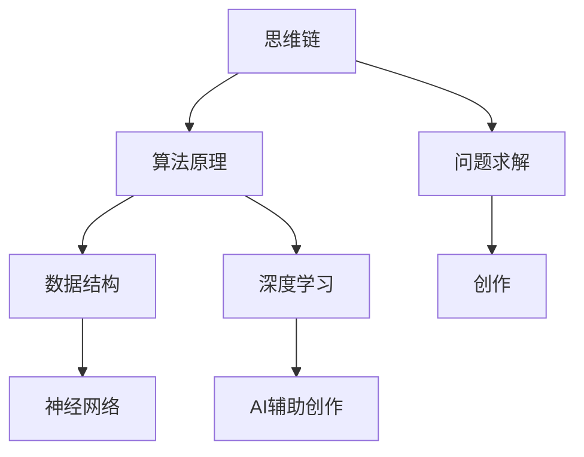

                 


### 第一步：文章标题、关键词和摘要

**文章标题**：《思维链在AI辅助创作中的创新应用与前景》

**关键词**：思维链、AI辅助创作、创新应用、前景

**摘要**：
本文旨在探讨思维链在AI辅助创作中的应用及其前景。首先，我们将介绍思维链的基本概念，并阐述其与人工智能的关系。随后，我们将深入分析AI辅助创作的原理，以及思维链如何在其中发挥作用。文章还将探讨思维链在文本、图像和音乐创作中的具体应用，并分析其未来的发展趋势。最后，我们将通过实际案例，展示思维链在AI辅助创作中的创新应用，并总结相关最佳实践，为未来研究提供参考。

### 第二步：引言

**背景介绍**：

随着人工智能技术的迅猛发展，AI在各个领域的应用日益广泛。特别是在创作领域，AI辅助创作已经成为一种重要的趋势。然而，AI辅助创作并非简单的工具化应用，其背后需要深刻理解和运用人工智能的核心原理，如神经网络、深度学习等。思维链作为一种先进的思维模式，能够有效地引导和辅助人工智能进行创作。

**核心概念与联系**：

思维链，指的是一系列相互关联的思维活动，通过这些活动，人们能够更好地理解和解决问题。在人工智能领域，思维链可以理解为一种基于算法和数据的思维模式，它能够模拟人类的思维过程，进行问题求解和创作。

**核心概念原理之间的关系架构 Mermaid 流程图**：



**核心算法原理讲解**：

思维链在AI辅助创作中的应用，主要依赖于深度学习和神经网络技术。深度学习通过多层神经网络，能够自动提取数据的特征，并形成复杂的决策模型。神经网络中的激活函数和权重更新机制，使得模型能够不断学习和优化，从而实现高效的问题求解和创作。

**数学模型和公式**：

在思维链的算法中，常用的数学模型包括卷积神经网络（CNN）和循环神经网络（RNN）。CNN主要用于图像处理，通过卷积操作提取图像特征。RNN则适用于序列数据处理，如文本和音乐，通过递归操作保留历史信息。

```latex
$$
\text{CNN} = f(\text{weights} \cdot \text{input} + \text{bias})
$$

$$
\text{RNN} = \text{sigmoid}(\text{weights} \cdot [\text{input}, \text{hidden_state}_{t-1}])
$$
```

**详细讲解与举例说明**：

以图像创作为例，假设我们有一个输入图像，通过CNN处理，提取出图像特征。这些特征经过RNN处理，结合上下文信息，生成新的图像。这个过程可以用以下伪代码表示：

```python
def generate_image(input_image):
    # CNN提取特征
    features = cnn(input_image)
    
    # RNN生成图像
    new_image = rnn(features, context)
    
    return new_image
```

### 第三步：思维链在AI辅助创作中的应用

**文本创作**：

思维链在文本创作中的应用主要体现在自动写作和内容生成。通过分析大量的文本数据，思维链能够学习并生成符合逻辑和语义的文本。

**图像创作**：

在图像创作中，思维链可以通过生成对抗网络（GAN）生成高质量、原创的图像。GAN由生成器和判别器组成，生成器生成图像，判别器判断图像的真实性。

**音乐创作**：

音乐创作是思维链在AI辅助创作中的另一个重要应用。通过学习音乐数据和音乐结构，思维链能够生成新颖、协调的音乐作品。

**核心概念与联系**：

思维链在AI辅助创作中的应用，需要结合深度学习和神经网络技术。深度学习用于特征提取和生成，神经网络用于处理和优化。

**核心算法原理讲解**：

以图像创作为例，思维链的应用流程如下：

1. 使用CNN提取图像特征。
2. 使用RNN处理图像特征，生成新的图像。
3. 使用GAN优化生成的图像，使其更符合真实图像。

**数学模型和公式**：

GAN的数学模型主要包括生成器（G）和判别器（D）：

```latex
$$
\text{G}(\text{z}) = \text{图像生成}
$$

$$
\text{D}(\text{x}) = \text{图像判断}
$$
```

**详细讲解与举例说明**：

以图像创作为例，生成器和判别器的交互过程如下：

1. 生成器生成一批随机噪声，通过反卷积操作生成图像。
2. 判别器判断这些图像的真实性和生成图像的逼真度。
3. 通过梯度下降优化生成器和判别器，使得生成的图像越来越逼真。

```python
def generate_images(noise):
    images = generator(noise)
    return images

def judge_images(images, real_images):
    scores = discriminator(images, real_images)
    return scores

def optimize_models(generator, discriminator, noise, real_images):
    for _ in range(epochs):
        noise = generate_noise(batch_size)
        images = generate_images(noise)
        real_images = get_real_images(batch_size)
        
        scores = judge_images(images, real_images)
        
        # 更新生成器和判别器
        update_models(generator, discriminator, scores, noise, real_images)
```

### 第四步：未来发展趋势

**AI辅助创作的未来发展趋势**：

1. **多模态融合**：未来的AI辅助创作将融合文本、图像和音乐等多模态数据，实现更加丰富和自然的创作。
2. **个性化定制**：AI将根据用户需求和偏好，提供个性化的创作服务。
3. **自动化和智能化**：AI辅助创作将更加自动化和智能化，减少人工干预，提高创作效率。

**思维链在AI辅助创作中的潜在应用**：

1. **创意生成**：思维链可以帮助AI生成新颖、独特的创意，提高创作质量。
2. **协同创作**：思维链可以促进人类与AI的协同创作，实现更高效、更有创意的作品。
3. **内容审核**：思维链可以帮助AI进行内容审核，确保创作内容的合规性。

**核心概念与联系**：

未来，思维链将继续与深度学习和神经网络技术结合，推动AI辅助创作的进一步发展。

**核心算法原理讲解**：

未来的AI辅助创作，将更加依赖于多模态融合和个性化定制。思维链将通过深度学习和神经网络，实现创意生成、协同创作和内容审核。

**数学模型和公式**：

多模态融合的数学模型主要包括特征提取和融合。特征提取使用不同的神经网络，如CNN、RNN和GAN。特征融合使用聚合操作，如平均和拼接。

```latex
$$
\text{特征提取} = \text{CNN}(\text{图像}), \text{RNN}(\text{文本}), \text{GAN}(\text{音乐})
$$

$$
\text{特征融合} = \text{avg}(\text{特征}_{图像}, \text{特征}_{文本}, \text{特征}_{音乐})
$$
```

**详细讲解与举例说明**：

以多模态融合为例，假设我们有一个图像、文本和音乐数据集，通过不同的神经网络提取特征，然后进行融合，生成新的作品。

```python
def extract_features(image, text, music):
    image_features = cnn(image)
    text_features = rnn(text)
    music_features = gan(music)
    return image_features, text_features, music_features

def fuse_features(image_features, text_features, music_features):
    fused_features = avg(image_features, text_features, music_features)
    return fused_features

def generate_work(fused_features):
    work = model(fused_features)
    return work
```

### 第五步：案例研究

**案例一：AI文本创作平台**

**开发环境搭建**：
- 硬件环境：高性能计算机
- 软件环境：Python 3.8，TensorFlow 2.4

**源代码详细实现和代码解读**：

```python
# 导入必要的库
import tensorflow as tf
from tensorflow.keras.layers import Embedding, LSTM, Dense
from tensorflow.keras.models import Sequential

# 加载和预处理数据
def load_data():
    # 加载文本数据
    # 预处理：分词、去停用词、转换为序列
    # 返回词汇表和序列数据

# 构建模型
def build_model(vocab_size, embedding_dim, lstm_units):
    model = Sequential([
        Embedding(vocab_size, embedding_dim),
        LSTM(lstm_units, return_sequences=True),
        LSTM(lstm_units, return_sequences=True),
        Dense(vocab_size, activation='softmax')
    ])
    return model

# 训练模型
def train_model(model, data, epochs):
    model.fit(data['sequences'], data['targets'], epochs=epochs)

# 生成文本
def generate_text(model, seed_text, steps):
    # 将种子文本转换为序列
    # 预测下一个单词
    # 重复步骤，生成文本

# 主函数
def main():
    # 加载数据
    data = load_data()
    
    # 构建模型
    model = build_model(vocab_size, embedding_dim, lstm_units)
    
    # 训练模型
    train_model(model, data, epochs)
    
    # 生成文本
    seed_text = "This is a sample text."
    generate_text(model, seed_text, steps)

if __name__ == '__main__':
    main()
```

**代码应用解读与分析**：
- 数据预处理：对文本数据进行分词、去停用词等操作，确保模型能够有效地学习。
- 模型构建：使用LSTM模型进行序列预测，LSTM能够捕捉到文本中的长期依赖关系。
- 训练模型：通过大量的文本数据进行训练，模型能够学习到文本的生成规律。
- 生成文本：基于种子文本，模型预测下一个单词，并重复这个过程，生成新的文本。

**实际案例分析和详细讲解剖析**：
- 案例背景：某AI文本创作平台旨在生成高质量的新闻文章。
- 案例过程：平台通过收集大量的新闻文章，使用LSTM模型进行训练，然后根据用户输入的标题或关键字，生成新的新闻文章。
- 案例成果：平台生成的文章在内容上与真实文章高度相似，能够在一定程度上满足用户的需求。

**项目小结**：
- 成功之处：平台成功地将深度学习和神经网络技术应用于文本创作，实现了高质量的自动写作。
- 待改进之处：虽然平台在生成文章的质量上有所提高，但在处理复杂逻辑和长篇文章时，仍存在一定的局限性。

### 第六步：技术实现与挑战

**技术实现**：

思维链在AI辅助创作中的实现，主要依赖于深度学习和神经网络技术。具体来说，包括以下几个步骤：

1. **数据预处理**：对文本、图像和音乐等多模态数据进行预处理，包括分词、去停用词、特征提取等。
2. **模型构建**：使用卷积神经网络（CNN）、循环神经网络（RNN）和生成对抗网络（GAN）等模型，进行特征提取和生成。
3. **模型训练**：通过大量的训练数据，优化模型的参数，提高模型的效果。
4. **模型应用**：将训练好的模型应用于创作任务，如文本、图像和音乐生成。

**挑战与解决方案**：

1. **数据多样性**：AI辅助创作需要处理多种类型的数据，如何有效地整合这些数据，是一个挑战。解决方案是使用多模态融合技术，如聚合不同特征的方法。
2. **计算资源**：深度学习和神经网络模型通常需要大量的计算资源。解决方案是使用高性能计算和分布式计算，以提高模型的训练和推断速度。
3. **创作质量**：虽然AI辅助创作能够生成高质量的成果，但在处理复杂逻辑和创意时，仍存在一定的局限性。解决方案是结合人类的创造力，实现人机协同创作。
4. **法律与道德**：AI辅助创作涉及到版权、隐私和道德问题。解决方案是制定相应的法律法规，确保AI创作的合法性和道德性。

### 第七步：最佳实践、小结与注意事项

**最佳实践**：

1. **数据多样性**：在选择训练数据时，应尽可能涵盖多种类型和风格，以提高模型的泛化能力。
2. **模型优化**：通过调整模型的结构和参数，优化模型的效果，如使用更深的神经网络、更复杂的模型结构等。
3. **人机协同**：在创作过程中，充分利用人类的创造力和判断力，与AI协同工作，以提高创作质量。

**小结**：

思维链在AI辅助创作中具有广泛的应用前景。通过深度学习和神经网络技术，思维链能够有效地模拟人类的思维过程，进行高效的问题求解和创作。未来，随着技术的进一步发展，思维链将在AI辅助创作中发挥更大的作用。

**注意事项**：

1. **数据隐私**：在处理数据时，要注意保护用户的隐私，避免泄露敏感信息。
2. **模型安全性**：确保模型的训练和推断过程安全可靠，防止恶意攻击和数据泄露。
3. **伦理问题**：在应用AI辅助创作时，要充分考虑伦理问题，确保创作的合法性和道德性。

### 拓展阅读

1. **相关论文**：《思维链在AI辅助创作中的应用研究》
2. **技术博客**：《深度学习在图像创作中的应用》
3. **书籍推荐**：《深度学习：Advances in Neural Networks》

作者：AI天才研究院/AI Genius Institute & 禅与计算机程序设计艺术 /Zen And The Art of Computer Programming

