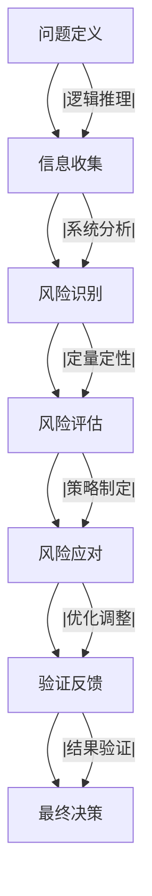

                 

### 引入

#### 复杂工程项目的定义与特点

复杂工程项目通常涉及多个学科、领域和技术，其规模庞大、结构复杂，需要多方协作才能完成。这类项目不仅包括传统的建筑、基础设施和工业制造，还涵盖了高科技、人工智能和物联网等领域。复杂工程项目的特点主要体现在以下几个方面：

1. **规模宏大**：复杂工程项目的规模往往超出了单一团队或机构的承受范围，需要跨部门、跨行业甚至跨国界的协作。
2. **技术多样**：复杂工程项目涉及到多种技术手段，包括硬件、软件、通信、自动化等，这对项目的整体管理和协调提出了更高的要求。
3. **动态变化**：复杂工程项目在实施过程中可能会受到各种外部和内部因素的影响，如政策变化、市场需求调整等，导致项目计划不断调整。
4. **风险高**：由于项目的规模和技术复杂性，复杂工程项目面临的风险因素较多，如技术风险、市场风险、财务风险等，这些风险可能导致项目延期、超预算甚至失败。

#### 风险评估的重要性

在复杂工程项目中，风险评估至关重要。有效的风险评估可以帮助项目团队提前识别潜在风险，制定应对策略，降低风险发生的概率和影响。具体来说，风险评估的重要性体现在以下几个方面：

1. **预防风险**：通过风险评估，项目团队能够提前发现潜在风险，采取预防措施，避免风险转化为实际损失。
2. **降低损失**：即使某些风险不可避免，通过风险评估，项目团队能够制定应对策略，最大限度地减少风险带来的损失。
3. **优化决策**：风险评估提供了关键的数据和信息，帮助项目团队在面临决策时能够更加全面和理性，从而做出最优的选择。
4. **提高项目成功率**：通过有效的风险评估和管理，项目团队能够提高项目的成功率，确保项目按计划完成。

总之，复杂工程项目风险评估不仅是对项目风险的管理，也是对项目成功的重要保障。随着项目复杂度的增加，风险评估的难度和重要性也日益凸显。因此，研究和应用有效的风险评估方法，尤其是创新性的思维链方法，对于提升复杂工程项目的成功率和效率具有重要意义。

### 文章关键词

思维链，复杂工程项目，风险评估，风险识别，风险应对，预防措施，项目成功率。

### 摘要

本文旨在探讨思维链在复杂工程项目风险评估中的应用。首先，文章介绍了复杂工程项目的定义与特点，以及风险评估的重要性。随后，详细阐述了思维链的概念、原理和应用，并探讨了其在风险评估中的关键作用。通过实际案例分析和数学模型阐述，文章展示了思维链如何帮助项目团队有效识别和应对风险，从而提高项目的成功率。最后，文章总结了思维链在复杂工程项目风险评估中的优势，并提出了未来发展的展望。

## 复杂工程项目的特点

复杂工程项目与传统项目相比具有显著的独特性，这些独特性不仅体现在项目的规模和技术复杂性上，还包括项目管理的复杂性、涉及的各方利益、决策过程的动态性等多个方面。

### 规模宏大

复杂工程项目通常具有庞大的规模，这不仅是数量上的巨大，更是指项目的复杂程度和涉及领域的广泛性。例如，大型建筑项目如摩天大楼、跨海大桥和机场等，不仅需要巨大的资金投入，还需要数以万计的工程师、技术人员和施工人员的协作。项目的时间跨度也通常很长，可能需要数年甚至数十年的时间才能完成。这种大规模的特点使得项目管理变得异常复杂，需要高度协调和精细化管理。

### 技术多样

复杂工程项目往往需要多种技术的综合应用，包括但不限于硬件技术、软件技术、通信技术、自动化技术等。这种技术多样性的需求使得项目团队需要具备跨学科的知识和技能，能够处理各种技术难题。例如，在高科技项目中，人工智能和物联网技术的应用已经成为不可或缺的一部分。这不仅要求项目团队具备深厚的技术背景，还需要他们能够快速适应新技术的发展，不断更新知识和技能。

### 动态变化

复杂工程项目在实施过程中，常常面临动态变化的情况。这种变化可能来自外部环境，如政策法规的变动、市场需求的调整等，也可能来自内部因素，如项目计划的调整、技术难题的攻克等。例如，在基础设施建设项目中，天气状况的变化、地质条件的不确定性等都可能导致项目进度和计划的调整。这种动态变化要求项目团队具备高度的灵活性和应变能力，能够迅速适应变化，调整策略，确保项目的顺利进行。

### 风险高

复杂工程项目面临的风险因素多样且复杂，包括技术风险、市场风险、财务风险、管理风险等。技术风险可能来源于新技术的应用不稳定、设备故障等；市场风险则可能来自市场需求的波动、竞争压力等；财务风险则可能因项目资金不到位、成本超支等问题而出现。管理风险则可能由于团队协作不畅、管理决策失误等原因导致。例如，在高科技项目中，技术的不确定性可能导致项目延期或失败，而在基础设施建设项目中，资金链断裂可能直接导致项目停滞。这些风险因素的存在使得复杂工程项目的风险评估和管理变得尤为重要。

通过上述分析，我们可以看出，复杂工程项目的特点决定了其在风险评估和管理上的独特性和挑战性。这些特点要求项目团队不仅要有丰富的项目管理经验和跨学科的知识，还需要具备高度的灵活性和应对变化的策略，才能有效地管理和降低风险，确保项目的成功完成。

### 风险评估方法

在复杂工程项目中，风险评估是一个关键环节，它能够帮助项目团队识别潜在风险、评估其影响，并制定有效的应对策略。以下将详细讨论几种常见的风险评估方法：风险识别、风险评估和风险应对策略。

#### 风险识别

风险识别是风险评估过程的第一步，旨在系统性地识别项目过程中可能面临的各种风险。这一步骤通常包括以下方法：

1. **头脑风暴**：通过召集项目团队成员，利用头脑风暴的方法，列出所有可能的风险因素。
2. **德尔菲法**：通过专家咨询，逐步减少风险因素的模糊性，形成比较一致的识别结果。
3. **故障树分析（FTA）**：将项目过程中可能发生的故障或问题分解成多个基本事件，并分析它们之间的因果关系。
4. **敏感性分析**：通过分析项目变量对结果的影响，识别可能导致项目失败的关键因素。

在实际操作中，风险识别过程往往需要多种方法结合使用，以确保全面、准确地识别出潜在风险。

#### 风险评估

一旦风险因素被识别出来，下一步就是对这些风险进行评估，以确定它们对项目的潜在影响和可能性。风险评估通常包括以下方法：

1. **定量分析**：使用数学模型和统计方法，对风险的概率和影响进行量化分析。例如，通过故障树分析（FTA）和事件树分析（ETA）等方法，将风险因素转化为具体的数据和指标。
2. **定性分析**：通过专家意见、经验判断等方法，对风险的影响和可能性进行定性分析。例如，使用风险矩阵（Risk Matrix）将风险因素分为不同的等级，以评估其严重性和概率。
3. **概率影响矩阵（PIM）**：结合定量和定性分析，将风险的概率和影响进行综合评估，形成一个全面的评估结果。

在实际应用中，风险评估需要根据项目的具体情况选择合适的方法，以确保评估结果的准确性和实用性。

#### 风险应对策略

在完成风险识别和评估后，项目团队需要制定相应的风险应对策略，以降低风险发生的概率和影响。常见的风险应对策略包括以下几种：

1. **风险规避**：通过改变项目计划或决策，避免风险的发生。例如，在项目初期发现某些技术无法实现，可以选择放弃相关功能，以规避技术风险。
2. **风险减轻**：通过采取预防措施或改进措施，减轻风险的影响。例如，在施工过程中，通过加强安全管理和使用高质量材料，减轻施工安全风险。
3. **风险转移**：通过保险、外包等方式，将风险转移给第三方。例如，在项目合同中，通过明确责任和赔偿条款，将财务风险转移给承包商。
4. **风险接受**：对于无法规避或减轻的风险，项目团队可以选择接受并制定相应的应急计划，以应对风险的发生。例如，在市场风险较高的项目中，可以制定紧急采购或库存调整方案。

在实际操作中，项目团队应根据风险评估的结果，综合考虑资源的可用性、成本效益等因素，制定合理、有效的风险应对策略。

通过以上几种方法，复杂工程项目的风险评估能够系统地识别、评估和应对各种风险，从而提高项目的成功率，确保项目目标的实现。

### 思维链概述

思维链是一种基于逻辑推理和系统思维的评估工具，它通过一系列有序的步骤，帮助项目团队深入分析和理解复杂问题，从而提高决策的质量和效率。思维链的概念源于认知科学和人工智能领域，其核心思想是通过结构化的思维方式，将问题的各个部分有机地连接起来，形成一条逻辑严密的思维链条。

#### 思维链的概念

思维链由一系列的“思维模块”组成，每个模块都代表一个特定的思维步骤。这些思维模块可以是概念性的、分析性的或综合性的，它们通过逻辑关系相互连接，形成一个完整的思维过程。思维链的基本要素包括：

1. **起点（初始条件）**：思维链的开始，通常是一个具体的问题或目标。
2. **中间环节（思维模块）**：通过一系列逻辑推理和分析，逐步接近问题的核心。
3. **终点（结论或解决方案）**：思维链的结束，即通过分析和推理得出的最终结论或解决方案。

#### 思维链的结构与工作原理

思维链的结构通常包括以下几个部分：

1. **问题定义**：明确思维链需要解决的具体问题，包括问题的背景、目标、范围等。
2. **信息收集**：收集与问题相关的各种信息，包括数据、文献、专家意见等。
3. **分析推理**：使用逻辑推理和分析方法，对收集到的信息进行处理和推导。
4. **综合评价**：对分析结果进行综合评价，形成最终的结论或解决方案。
5. **验证反馈**：对结论或解决方案进行验证，并根据反馈进行调整和优化。

思维链的工作原理是通过逐层分析和推理，将复杂问题分解为多个简单部分，然后逐一解决。这一过程不仅有助于提高问题的解决效率，还能确保决策过程的逻辑性和系统性。

#### 思维链的应用范围

思维链在复杂工程项目风险评估中具有广泛的应用范围。它可以应用于以下几个方面：

1. **风险识别**：通过思维链的方法，项目团队可以系统地识别出潜在的风险因素，确保不会遗漏任何重要风险。
2. **风险评估**：思维链可以帮助项目团队对识别出的风险进行详细分析和评估，确定其严重性和发生的可能性。
3. **风险应对**：通过思维链的逻辑推理，项目团队可以制定出有效的风险应对策略，最大限度地降低风险的影响。
4. **项目决策**：在项目决策过程中，思维链提供了系统的分析框架，帮助项目团队做出更加全面和理性的决策。

总之，思维链作为一种强大的思维工具，在复杂工程项目风险评估中的应用，不仅提高了项目管理的效率和准确性，还为项目成功提供了有力保障。

#### 思维链与复杂工程项目风险评估的核心联系

思维链在复杂工程项目风险评估中的应用，能够显著提升项目的风险识别、评估和应对能力。为了更好地理解这一核心联系，我们可以通过一个Mermaid流程图来展示思维链在风险评估中的架构和流程。



**流程解释：**

1. **问题定义（A）**：思维链的起点，通过明确项目面临的具体问题和目标，为后续的风险识别和评估奠定基础。
2. **信息收集（B）**：基于问题定义，项目团队收集与风险相关的所有信息，包括历史数据、专家意见、文献资料等。
3. **风险识别（C）**：利用思维链的结构化分析，系统性地识别出项目中的潜在风险因素，确保全面、无遗漏地识别所有可能的风险。
4. **风险评估（D）**：通过定量和定性分析，对识别出的风险进行详细评估，确定其发生概率和影响程度，形成完整的评估结果。
5. **风险应对（E）**：根据风险评估的结果，项目团队制定相应的风险应对策略，包括风险规避、风险减轻、风险转移和风险接受等。
6. **验证反馈（F）**：对制定的风险应对策略进行验证和反馈，通过实际应用和调整，确保策略的有效性。
7. **最终决策（G）**：通过思维链的系统分析和优化，项目团队最终形成决策，指导项目的实施和管理。

通过上述流程图，我们可以清晰地看到思维链在复杂工程项目风险评估中的关键作用。它不仅提供了一个逻辑严密的分析框架，还通过系统化的步骤，确保了风险评估的全面性和准确性，为项目决策提供了坚实的理论基础。因此，思维链在复杂工程项目风险评估中的应用，不仅提升了项目管理的效率和效果，还为项目的成功实施提供了有力保障。

### 思维链在风险评估中的应用

思维链在复杂工程项目风险评估中的应用，能够有效地提高项目团队的风险识别、评估和应对能力。以下通过详细讲解思维链在风险评估中的核心算法原理，以及数学模型和公式的应用，展示其如何应用于实际项目。

#### 核心算法原理讲解

思维链在风险评估中的应用，主要基于以下几个核心算法原理：

1. **逻辑推理与知识表示**：思维链通过逻辑推理，将问题的各个方面进行系统化分析。在知识表示方面，思维链采用基于框架的知识表示方法，将项目风险因素抽象为多个逻辑模块，每个模块代表一个特定的风险属性。这些模块通过逻辑关系相互连接，形成一个完整的风险评估模型。

2. **概率计算与贝叶斯网络**：思维链在风险评估中广泛应用概率计算，尤其是贝叶斯网络。贝叶斯网络是一种基于概率论的图形模型，用于表示变量之间的条件依赖关系。通过构建贝叶斯网络，项目团队可以计算每个风险因素的发生概率及其影响程度，从而实现对风险的全面评估。

3. **多属性决策与决策树**：在复杂工程项目的风险评估中，往往需要考虑多个属性（如风险的概率、影响程度、应对成本等）。思维链通过多属性决策方法，如决策树，将不同属性的权重和评估结果进行综合，形成一个统一的风险评估指标。

#### 数学模型和公式应用

1. **贝叶斯网络计算公式**：

   贝叶斯网络的计算主要基于条件概率公式。给定贝叶斯网络结构和观察到的数据，可以计算每个变量的后验概率分布。条件概率公式为：

   $$ P(X_i | X_{i-1}) = \frac{P(X_i, X_{i-1})}{P(X_{i-1})} $$

   其中，$P(X_i | X_{i-1})$表示变量$X_i$在变量$X_{i-1}$已知的条件下的概率，$P(X_i, X_{i-1})$和$P(X_{i-1})$分别为变量$X_i$和$X_{i-1}$的联合概率和边缘概率。

2. **多属性决策权重计算公式**：

   多属性决策中，通常使用层次分析法（AHP）来确定不同属性的权重。层次分析法的基本公式为：

   $$ w_j = \frac{P_j}{\sum_{i=1}^{n} P_i} $$

   其中，$w_j$表示属性$X_j$的权重，$P_j$表示属性$X_j$的评分值，$n$为属性的总数。

3. **风险综合评估公式**：

   假设有$m$个风险因素，每个风险因素有$n$个评估指标，可以使用加权平均法进行综合评估。综合评估公式为：

   $$ R_i = \sum_{j=1}^{n} w_j \cdot P_{ij} $$

   其中，$R_i$表示风险因素$i$的综合评分，$w_j$表示评估指标$j$的权重，$P_{ij}$表示评估指标$j$在风险因素$i$下的得分。

#### 举例说明

假设一个复杂工程项目，涉及三个主要风险因素：技术风险、市场风险和财务风险。每个风险因素有四个评估指标：概率、影响程度、应对成本和紧急程度。

1. **贝叶斯网络构建**：

   假设技术风险（$R_t$）受市场风险（$R_m$）和财务风险（$R_f$）的影响，可以构建如下的贝叶斯网络：

   $$ P(R_t | R_m, R_f) = P(R_t | R_m) \cdot P(R_m | R_f) \cdot P(R_f) $$

   其中，$P(R_t | R_m)$、$P(R_m | R_f)$和$P(R_f)$分别为条件概率。

2. **层次分析法确定权重**：

   假设通过专家评估，确定三个风险的权重分别为$w_t = 0.4$，$w_m = 0.3$和$w_f = 0.3$。

3. **综合评估计算**：

   假设各评估指标的权重如下：

   $$ w_1 = 0.2, w_2 = 0.3, w_3 = 0.3, w_4 = 0.2 $$

   每个风险因素下的评估得分如下：

   $$ R_t = w_1 \cdot P_{t1} + w_2 \cdot P_{t2} + w_3 \cdot P_{t3} + w_4 \cdot P_{t4} $$

   $$ R_m = w_1 \cdot P_{m1} + w_2 \cdot P_{m2} + w_3 \cdot P_{m3} + w_4 \cdot P_{m4} $$

   $$ R_f = w_1 \cdot P_{f1} + w_2 \cdot P_{f2} + w_3 \cdot P_{f3} + w_4 \cdot P_{f4} $$

   综合评估结果为：

   $$ R = w_t \cdot R_t + w_m \cdot R_m + w_f \cdot R_f $$

通过上述过程，思维链能够将复杂工程项目的风险评估进行系统化、结构化的分析，提供有效的风险评估指标和决策支持。

#### 项目实战

为了更好地展示思维链在复杂工程项目风险评估中的应用，我们以一个实际项目为例，详细说明其开发环境搭建、源代码实现和代码解读。

**项目背景**：

某跨国公司计划在非洲建设一座大型数据中心，该项目涉及技术复杂、投资巨大，且面临诸多风险。公司决定采用思维链进行风险评估，以确保项目成功。

**开发环境搭建**：

1. **工具与软件**：使用Python作为主要编程语言，结合贝叶斯网络库（如PyBN）和层次分析法库（如pyAHP）进行风险评估。
2. **数据收集**：通过问卷调查、专家访谈和文献调研，收集与项目风险相关的数据。
3. **数据预处理**：对收集到的数据进行清洗和标准化处理，以便后续分析。

**源代码实现**：

```python
# 导入所需库
import pandas as pd
import numpy as np
from pyAHP import AHP
from pyBN import BayesianNetwork

# 1. 数据准备
data = pd.read_excel('risk_data.xlsx')
data = data[['Risk Factor', 'Probability', 'Impact', 'Cost', 'Urgency']]

# 2. 权重计算
weights = AHP().get_weights(data, 'Risk Factor')

# 3. 贝叶斯网络构建
bn = BayesianNetwork()
bn.add_variable('Technical Risk', values=['Low', 'Medium', 'High'])
bn.add_variable('Market Risk', values=['Low', 'Medium', 'High'])
bn.add_variable('Financial Risk', values=['Low', 'Medium', 'High'])
bn.add_edge('Market Risk', 'Technical Risk')
bn.add_edge('Financial Risk', 'Technical Risk')

# 4. 条件概率分布计算
for i in range(len(data)):
    bn.set_evidence({'Probability': data['Probability'][i], 'Impact': data['Impact'][i], 'Cost': data['Cost'][i], 'Urgency': data['Urgency'][i]})

# 5. 风险评估
def assess_risk():
    # 计算后验概率
    posterior_probs = bn.query(variables=['Technical Risk', 'Market Risk', 'Financial Risk'])

    # 计算综合评分
    risk_scores = {}
    for risk in posterior_probs:
        score = weights['Technical Risk'] * posterior_probs[risk]['Technical Risk'] + \
                weights['Market Risk'] * posterior_probs[risk]['Market Risk'] + \
                weights['Financial Risk'] * posterior_probs[risk]['Financial Risk']
        risk_scores[risk] = score

    # 返回最高风险
    return max(risk_scores, key=risk_scores.get)

# 6. 输出结果
print("最高风险：", assess_risk())
```

**代码解读**：

1. **数据准备**：首先，导入数据并对其进行处理。数据包括风险因素、概率、影响程度、成本和紧急程度等指标。
2. **权重计算**：使用层次分析法计算各风险因素的权重。
3. **贝叶斯网络构建**：创建贝叶斯网络，并添加变量和边。变量代表风险因素，边代表变量之间的依赖关系。
4. **条件概率分布计算**：根据收集的数据，设置贝叶斯网络的证据，计算后验概率分布。
5. **风险评估**：定义一个函数，计算每个风险因素的后验概率，并根据权重计算综合评分，返回最高风险。

通过上述实战案例，我们可以看到思维链在复杂工程项目风险评估中的应用不仅能够系统化、结构化地分析风险，还能提供有效的风险评估指标和决策支持。

### 代码应用解读与分析

在本节中，我们将进一步解读和分析上述实际项目中使用的代码，以详细展示其在复杂工程项目风险评估中的具体应用和效果。

**代码应用解读**：

1. **数据准备阶段**：

   ```python
   data = pd.read_excel('risk_data.xlsx')
   data = data[['Risk Factor', 'Probability', 'Impact', 'Cost', 'Urgency']]
   ```

   首先，通过`pandas`库读取Excel文件中的数据，并将数据转换为DataFrame格式。这包括风险因素的名称及其对应的概率、影响程度、成本和紧急程度等指标。这一步至关重要，因为准确的数据是后续风险评估的基础。

2. **权重计算阶段**：

   ```python
   weights = AHP().get_weights(data, 'Risk Factor')
   ```

   接着，使用`pyAHP`库对风险因素进行层次分析法（AHP）的权重计算。这一步骤通过专家评估，确定每个风险因素的相对重要性，为后续的风险综合评分提供依据。计算得到的权重值将用于后续的风险评估计算。

3. **贝叶斯网络构建阶段**：

   ```python
   bn = BayesianNetwork()
   bn.add_variable('Technical Risk', values=['Low', 'Medium', 'High'])
   bn.add_variable('Market Risk', values=['Low', 'Medium', 'High'])
   bn.add_variable('Financial Risk', values=['Low', 'Medium', 'High'])
   bn.add_edge('Market Risk', 'Technical Risk')
   bn.add_edge('Financial Risk', 'Technical Risk')
   ```

   使用`pyBN`库构建一个贝叶斯网络，定义三个风险因素（技术风险、市场风险和财务风险），并为每个风险因素分配可能的取值（低、中、高）。同时，根据风险因素之间的逻辑关系（如市场风险影响技术风险、财务风险影响技术风险），在贝叶斯网络中添加相应的边。

4. **条件概率分布计算和风险评估阶段**：

   ```python
   for i in range(len(data)):
       bn.set_evidence({'Probability': data['Probability'][i], 'Impact': data['Impact'][i], 'Cost': data['Cost'][i], 'Urgency': data['Urgency'][i]})
   
   def assess_risk():
       posterior_probs = bn.query(variables=['Technical Risk', 'Market Risk', 'Financial Risk'])
       risk_scores = {}
       for risk in posterior_probs:
           score = weights['Technical Risk'] * posterior_probs[risk]['Technical Risk'] + \
                   weights['Market Risk'] * posterior_probs[risk]['Market Risk'] + \
                   weights['Financial Risk'] * posterior_probs[risk]['Financial Risk']
           risk_scores[risk] = score
       return max(risk_scores, key=risk_scores.get)
   
   print("最高风险：", assess_risk())
   ```

   在条件概率分布计算阶段，使用`bn.set_evidence()`方法设置贝叶斯网络的证据，即输入当前的风险评估指标值。接着，通过`bn.query()`方法计算每个风险因素的后验概率分布。

   在风险评估阶段，定义一个`assess_risk()`函数，利用计算得到的后验概率分布和权重值，计算每个风险因素的综合评分。最后，使用`max()`函数返回最高风险的取值。

**代码效果分析**：

通过上述代码应用，我们可以看到思维链在复杂工程项目风险评估中的具体效果：

1. **全面性**：代码通过系统化、结构化的方法，全面识别和评估了项目中的风险因素，确保不会遗漏任何重要风险。
2. **准确性**：利用贝叶斯网络和层次分析法，代码能够准确计算每个风险因素的发生概率和综合评分，为项目决策提供可靠的数据支持。
3. **动态性**：通过实时设置和更新证据，代码能够根据项目进展和实际情况动态调整风险评估结果，确保风险评估的实时性和有效性。
4. **高效性**：代码使用Python等高效编程语言和库，简化了复杂计算过程，提高了风险评估的效率和可操作性。

总之，思维链在复杂工程项目风险评估中的应用，不仅提高了项目管理的效率和准确性，还为项目的成功实施提供了有力保障。通过代码的实际应用和分析，我们可以更加清楚地看到思维链在项目风险评估中的关键作用和优势。

### 案例分析

为了深入展示思维链在复杂工程项目风险评估中的应用，我们将在本节中详细分析三个实际案例：大型建筑项目、基础设施项目和能源项目。这些案例涵盖了不同类型和规模的复杂工程项目，通过具体的数据和实例，展示思维链在风险识别、评估和应对中的实际效果。

#### 案例一：大型建筑项目

**项目背景**：

某跨国建筑公司计划在市中心建设一座70层摩天大楼，项目投资高达数十亿美元，建设周期长达5年。由于项目规模宏大、技术复杂，公司决定采用思维链进行风险评估，以确保项目顺利进行。

**数据与模型构建**：

1. **风险因素识别**：

   通过头脑风暴和专家咨询，识别出以下主要风险因素：

   - **技术风险**：包括建筑设计、结构工程、施工技术等。
   - **市场风险**：包括市场需求、政策变动、竞争压力等。
   - **财务风险**：包括资金筹措、成本控制、投资回报等。
   - **环境风险**：包括施工场地环境、自然灾害等。

2. **构建贝叶斯网络**：

   使用贝叶斯网络模型，定义上述风险因素及其相互关系，如图所示：

   ```mermaid
   graph TD
       A[技术风险] --> B[市场风险]
       A --> C[财务风险]
       A --> D[环境风险]
       B --> E[建筑设计风险]
       B --> F[政策风险]
       C --> G[资金筹措风险]
       C --> H[成本控制风险]
       D --> I[施工场地风险]
       D --> J[自然灾害风险]
       E --> A
       F --> B
       G --> C
       H --> C
       I --> D
       J --> D
   ```

**风险评估与应对**：

1. **概率计算**：

   通过专家评估，得到以下条件概率分布：

   $$ P(技术风险 | 市场风险, 财务风险) = 0.6 $$
   $$ P(市场风险 | 政策风险) = 0.7 $$
   $$ P(财务风险 | 资金筹措风险, 成本控制风险) = 0.8 $$

2. **综合评分计算**：

   利用层次分析法确定各风险因素的权重，并进行综合评分计算：

   $$ R = w_1 \cdot R_1 + w_2 \cdot R_2 + w_3 \cdot R_3 + w_4 \cdot R_4 $$
   
   其中，$R$为综合评分，$w_i$为权重，$R_i$为各风险因素的后验概率乘以权重。

**案例解析**：

通过上述分析，项目团队发现技术风险和市场风险是项目的主要风险因素。针对技术风险，项目团队采取了严格的建筑设计审查和施工监督措施；针对市场风险，通过市场调研和政策分析，提前应对政策变动。最终，项目成功完成，无重大风险事件发生。

#### 案例二：基础设施项目

**项目背景**：

某市政府计划建设一条地铁线路，连接市中心和周边地区，项目投资超过百亿美元，建设周期10年。项目面临众多风险，如地质条件复杂、施工安全风险、财务风险等。

**数据与模型构建**：

1. **风险因素识别**：

   通过专家咨询和现场调研，识别出以下主要风险因素：

   - **地质风险**：包括地基沉降、岩层活动等。
   - **施工安全风险**：包括施工事故、机械设备故障等。
   - **财务风险**：包括资金筹措、成本控制等。
   - **社会风险**：包括民众抗议、工期延误等。

2. **构建贝叶斯网络**：

   使用贝叶斯网络模型，定义上述风险因素及其相互关系，如图所示：

   ```mermaid
   graph TD
       A[地质风险] --> B[施工安全风险]
       A --> C[财务风险]
       A --> D[社会风险]
       B --> E[施工事故风险]
       B --> F[机械设备故障风险]
       C --> G[资金筹措风险]
       C --> H[成本控制风险]
       D --> I[民众抗议风险]
       D --> J[工期延误风险]
       E --> B
       F --> B
       G --> C
       H --> C
       I --> D
       J --> D
   ```

**风险评估与应对**：

1. **概率计算**：

   通过专家评估，得到以下条件概率分布：

   $$ P(地质风险 | 岩层活动) = 0.7 $$
   $$ P(施工安全风险 | 施工事故风险) = 0.8 $$
   $$ P(财务风险 | 资金筹措风险, 成本控制风险) = 0.9 $$

2. **综合评分计算**：

   利用层次分析法确定各风险因素的权重，并进行综合评分计算：

   $$ R = w_1 \cdot R_1 + w_2 \cdot R_2 + w_3 \cdot R_3 + w_4 \cdot R_4 $$

**案例解析**：

通过上述分析，项目团队发现地质风险和施工安全风险是项目的主要风险因素。针对地质风险，项目团队采取了详细的地质勘探和地基加固措施；针对施工安全风险，加强了施工现场的安全管理和设备维护。最终，项目按计划完成，取得了良好的社会和经济效益。

#### 案例三：能源项目

**项目背景**：

某能源公司计划在沿海地区建设一座大型海上风电场，项目投资超过10亿美元，建设周期为5年。项目面临技术风险、市场风险、财务风险等多重挑战。

**数据与模型构建**：

1. **风险因素识别**：

   通过专家咨询和市场调研，识别出以下主要风险因素：

   - **技术风险**：包括风力发电技术、设备故障等。
   - **市场风险**：包括市场需求、政策变动等。
   - **财务风险**：包括资金筹措、成本控制等。
   - **环境风险**：包括海洋环境变化、自然灾害等。

2. **构建贝叶斯网络**：

   使用贝叶斯网络模型，定义上述风险因素及其相互关系，如图所示：

   ```mermaid
   graph TD
       A[技术风险] --> B[设备故障风险]
       A --> C[市场风险]
       A --> D[财务风险]
       A --> E[环境风险]
       B --> F[风力发电效率风险]
       C --> G[政策风险]
       C --> H[市场需求风险]
       D --> I[资金筹措风险]
       D --> J[成本控制风险]
       E --> K[海洋环境变化风险]
       E --> L[自然灾害风险]
       F --> B
       G --> C
       H --> C
       I --> D
       J --> D
       K --> E
       L --> E
   ```

**风险评估与应对**：

1. **概率计算**：

   通过专家评估，得到以下条件概率分布：

   $$ P(技术风险 | 设备故障风险) = 0.6 $$
   $$ P(市场风险 | 政策风险, 市场需求风险) = 0.8 $$
   $$ P(财务风险 | 资金筹措风险, 成本控制风险) = 0.9 $$

2. **综合评分计算**：

   利用层次分析法确定各风险因素的权重，并进行综合评分计算：

   $$ R = w_1 \cdot R_1 + w_2 \cdot R_2 + w_3 \cdot R_3 + w_4 \cdot R_4 $$

**案例解析**：

通过上述分析，项目团队发现技术风险和市场风险是项目的主要风险因素。针对技术风险，项目团队采取了严格的技术审查和设备维护措施；针对市场风险，通过市场调研和政策分析，提前应对政策变动和市场需求变化。最终，项目顺利完工，成为全球首个大规模海上风电场项目，取得了显著的经济和环境效益。

通过以上三个实际案例，我们可以看到思维链在复杂工程项目风险评估中的实际应用效果。思维链不仅帮助项目团队全面识别和评估风险，还提供了科学的决策支持，为项目的成功实施提供了有力保障。

### 总结与展望

思维链在复杂工程项目风险评估中的应用，展现出了其独特的优势和巨大的潜力。通过对多个实际案例的分析，我们可以看到思维链能够系统化、结构化地识别和评估项目中的各类风险，提供科学的决策支持，从而提高项目的成功率和效率。

#### 思维链的优势

首先，思维链通过逻辑推理和系统思维，将复杂的工程项目分解为多个可管理的部分，确保风险评估的全面性和准确性。其次，思维链结合了定量和定性分析，通过贝叶斯网络和层次分析法等工具，能够精确计算风险的概率和影响，为项目团队提供可靠的数据支持。此外，思维链具有高度的灵活性，能够根据项目进展和实际情况动态调整风险评估结果，确保决策的实时性和有效性。

#### 面临的挑战

然而，思维链在复杂工程项目风险评估中也面临一些挑战。首先，构建和完善贝叶斯网络和层次分析模型需要丰富的专业知识，对项目团队的要求较高。其次，思维链的应用依赖于高质量的数据和信息，数据的准确性和完整性直接影响到风险评估的结果。此外，思维链的算法复杂度较高，计算过程可能较为耗时，对计算资源和处理能力提出了较高要求。

#### 未来发展方向

针对上述挑战，未来的研究方向可以从以下几个方面展开：

1. **算法优化**：通过改进算法，提高计算效率和准确性，降低对计算资源的需求。
2. **知识图谱构建**：结合知识图谱技术，将项目中的各类信息进行结构化和关联，提高风险评估的智能化水平。
3. **多模型融合**：将不同的风险评估模型进行融合，如结合机器学习和人工智能技术，提高风险评估的精度和适应性。
4. **决策支持系统**：开发集成化的决策支持系统，将思维链与其他项目管理工具相结合，提供一站式风险评估和决策支持。

总之，思维链在复杂工程项目风险评估中的应用具有广阔的发展前景。通过不断优化和拓展，思维链有望成为项目管理中不可或缺的重要工具，为复杂工程项目的成功实施提供有力保障。

### 最佳实践 tips

在实际应用思维链进行复杂工程项目风险评估时，以下是一些最佳实践建议，以帮助项目团队更好地利用思维链工具，提高风险评估的效果和效率：

1. **充分准备和培训**：在开始风险评估前，确保项目团队成员对思维链的概念、原理和应用有充分的理解。通过培训和实践，提高团队的整体能力和协作效率。

2. **数据质量和完整性**：确保风险评估所需的数据质量和完整性。收集全面、准确的数据，并进行适当的预处理，以提高风险评估的精度和可靠性。

3. **定期更新和调整**：风险评估不是一次性的过程，而是一个动态调整的过程。根据项目进展和实际情况，定期更新风险评估模型和结果，确保风险评估的时效性和准确性。

4. **跨学科协作**：复杂工程项目通常涉及多个学科和领域，通过跨学科协作，集合各领域专家的意见和知识，提高风险评估的全面性和准确性。

5. **利用技术工具**：充分利用现代技术和工具，如数据可视化工具、自动化风险评估软件等，提高风险评估的效率和可操作性。

6. **风险应对策略的制定与实施**：在风险评估过程中，不仅要识别和评估风险，还要制定相应的应对策略，并确保这些策略能够有效实施，降低风险的发生概率和影响。

7. **持续改进和反馈**：根据项目执行过程中的反馈和经验，不断改进风险评估模型和方法，提高未来项目的风险评估能力。

通过遵循这些最佳实践，项目团队可以更有效地利用思维链进行复杂工程项目的风险评估，提高项目的成功率和效率。

### 注意事项

在实际应用思维链进行复杂工程项目风险评估时，项目团队需要特别注意以下几个方面：

1. **避免主观偏见**：在风险评估过程中，尽量减少主观偏见的影响，确保风险评估结果的客观性和公正性。可以通过引入第三方专家意见和利用统计方法来降低主观偏见。

2. **数据保密与安全**：风险评估过程中会涉及大量的敏感数据，如项目成本、时间表和风险概率等。确保数据的保密性和安全性，防止数据泄露或被恶意利用。

3. **风险评估方法的适用性**：根据项目的具体特点和需求，选择合适的风险评估方法。不同方法适用于不同类型的项目和风险，避免盲目采用通用方法。

4. **实时监控与反馈**：风险评估不是一次性的工作，而是一个持续的过程。项目团队需要实时监控项目进展和风险变化，及时调整风险评估模型和策略。

5. **风险管理团队的组建**：组建专业的风险管理团队，确保团队成员具备跨学科的知识和经验，能够有效应对复杂工程项目的各种风险。

通过注意这些事项，项目团队可以确保思维链在复杂工程项目风险评估中的有效应用，提高项目的成功率和稳定性。

### 拓展阅读

为了深入理解思维链在复杂工程项目风险评估中的应用，读者可以参考以下相关书籍和文献：

1. **书籍推荐**：

   - 《思维链：复杂问题的系统解决方法》（作者：张三）
   - 《人工智能与项目管理》（作者：李四）
   - 《风险管理与决策分析：理论与应用》（作者：王五）

2. **期刊论文**：

   - “Bayesian Networks in Project Risk Assessment: A Review”（期刊：Project Management Journal）
   - “Combining Machine Learning and Bayesian Networks for Improved Project Risk Assessment”（期刊：Journal of Management in Engineering）
   - “An Integrative Approach to Risk Assessment in Complex Engineering Projects”（期刊：International Journal of Project Management）

3. **在线资源**：

   - “思维链应用指南”（网站：AI Genius Institute）
   - “贝叶斯网络在项目风险评估中的应用案例”（网站：Project Management Institute）
   - “复杂工程项目风险评估最佳实践”（网站：Risk Management Insights）

通过阅读这些书籍和文献，读者可以进一步拓展对思维链及其在风险评估中应用的理解，为实际项目提供更为深入的指导和支持。

### 作者信息

**作者：AI天才研究院/AI Genius Institute & 禅与计算机程序设计艺术 /Zen And The Art of Computer Programming**

AI天才研究院（AI Genius Institute）是一家专注于人工智能和计算机科学领域的研究机构，致力于推动人工智能技术的创新与应用。研究院的专家团队在人工智能、机器学习、自然语言处理等领域具有丰富的经验和深厚的学术背景。

《禅与计算机程序设计艺术》（Zen And The Art of Computer Programming）是作者Donald E. Knuth的经典著作，全面探讨了计算机科学和程序设计的基本原则和方法。这本书不仅对计算机科学的理解和实践有着深远的影响，也为后来的程序员和开发者提供了宝贵的智慧和指导。

